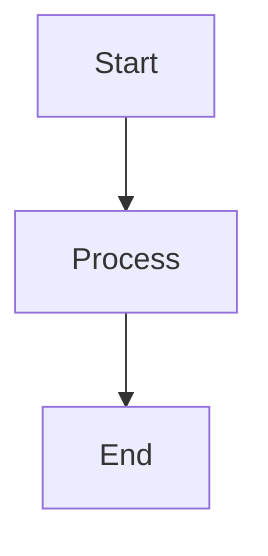

                 

### 文章标题

《技术质量管理体系的设计与实施》

### 关键词

技术质量管理、质量管理体系、设计原则、实施步骤、质量评估、持续改进

### 摘要

本文旨在探讨技术质量管理体系的设计与实施，从基础概念、设计原则、实施步骤到质量评估和持续改进，全面解析技术质量管理体系的构建过程。通过深入剖析核心概念之间的关系架构，详细讲解核心算法原理和数学模型，并结合实际项目实战，提供完整的实施指南，旨在帮助读者理解和掌握技术质量管理体系的构建与优化方法。

## 第一部分：技术质量管理体系概述

### 1.1 技术质量管理的定义与重要性

技术质量管理是指通过一系列科学的方法、工具和技术，确保信息技术（IT）产品或服务在设计和开发过程中达到既定的质量标准，以满足用户需求和期望。技术质量管理不仅仅关注产品或服务的功能实现，还涉及性能、可靠性、安全性和可用性等多个方面。

在现代企业中，技术质量管理的重要性日益凸显。首先，随着信息技术的发展，企业对IT系统的依赖程度越来越高，IT系统的稳定性和性能直接关系到企业的运营效率和竞争力。其次，技术的复杂性和快速变化要求企业能够快速适应市场变化，提高产品的质量和稳定性。最后，用户对服务质量的要求越来越高，只有通过有效的技术质量管理，企业才能赢得用户的信任和忠诚。

### 1.2 技术质量管理的历史与发展

技术质量管理的历史可以追溯到20世纪60年代，当时质量管理的理念开始被引入到IT领域。早期的技术质量管理主要集中在软件开发过程中，通过质量保证（Quality Assurance，QA）和质量控制（Quality Control，QC）来确保软件产品的质量。

随着信息技术的发展，技术质量管理的理念和方法也在不断演变。20世纪80年代，全面质量管理（Total Quality Management，TQM）的概念被引入到技术质量管理中，强调全员参与、持续改进和过程控制。20世纪90年代，ISO 9001质量管理体系标准的发布，进一步推动了技术质量管理在全球范围内的普及和应用。

进入21世纪，随着云计算、大数据和人工智能等新兴技术的兴起，技术质量管理的内容和方法也在不断扩展。例如，DevOps文化的推广，使技术质量管理从传统的软件开发过程延伸到整个开发和运营流程。此外，随着自动化测试和持续集成（Continuous Integration，CI）工具的广泛应用，技术质量管理的效率和效果得到了显著提升。

### 1.3 技术质量管理的关键概念与术语

为了更好地理解和应用技术质量管理，我们需要了解一些关键概念和术语。以下是几个重要的概念：

- **质量保证（Quality Assurance，QA）**：质量保证是指通过一系列预防措施和活动，确保产品或服务在设计和开发过程中符合既定的质量标准。质量保证侧重于过程控制和预防，旨在减少缺陷的产生。

- **质量控制（Quality Control，QC）**：质量控制是指通过检测和评估产品或服务的质量，识别和纠正缺陷，确保最终产品或服务符合质量标准。质量控制侧重于结果控制和纠正，旨在确保产品或服务的质量符合预期。

- **全面质量管理（Total Quality Management，TQM）**：全面质量管理是一种管理理念，强调全员参与、持续改进和过程控制。TQM旨在通过持续改进和优化过程，提高产品或服务的质量。

- **持续集成（Continuous Integration，CI）**：持续集成是一种软件开发实践，通过自动化构建和测试，确保代码库中的每个提交都能与现有代码兼容。持续集成能够提高开发效率，减少缺陷，提高代码质量。

- **自动化测试（Automated Testing）**：自动化测试是指使用自动化工具进行测试，以替代或辅助手工测试。自动化测试能够提高测试效率，减少测试成本，提高测试覆盖率和测试质量。

- **测试驱动开发（Test-Driven Development，TDD）**：测试驱动开发是一种软件开发方法，通过编写测试用例来驱动开发过程。TDD强调先写测试后写代码，确保代码质量。

- **质量度量（Quality Metrics）**：质量度量是指通过量化指标来评估产品或服务的质量。常见的质量度量包括缺陷密度、测试覆盖率、客户满意度等。

### 关键概念与联系

为了更好地理解技术质量管理中的关键概念和它们之间的关系，我们可以通过以下Mermaid流程图来展示它们之间的联系：

```mermaid
graph TD
    A[技术质量管理]
    B[质量保证(QA)]
    C[质量控制(QC)]
    D[全面质量管理(TQM)]
    E[持续集成(CI)]
    F[自动化测试]
    G[测试驱动开发(TDD)]
    H[质量度量]

    A --> B
    A --> C
    A --> D
    A --> E
    A --> F
    A --> G
    A --> H

    B --> H
    C --> H
    D --> B
    D --> C
    E --> H
    F --> H
    G --> H
```

这个流程图展示了技术质量管理中的各个关键概念之间的关系。质量保证和质量管理侧重于过程控制和预防，而质量控制则侧重于结果控制和纠正。全面质量管理（TQM）将全员参与和持续改进融入质量管理中，持续集成（CI）和自动化测试（F）通过自动化工具提高开发效率和代码质量，测试驱动开发（TDD）则通过先写测试来驱动开发过程，质量度量（H）则用于量化评估产品质量。

### 1.4 技术质量管理体系的组成

一个完整的技术质量管理体系通常包括以下组成部分：

- **质量策略**：质量策略是企业质量管理的总体方针和目标，明确企业对质量的承诺和愿景。

- **质量计划**：质量计划是针对具体项目或产品制定的详细质量实施计划，包括质量目标、质量活动、资源分配等。

- **质量控制**：质量控制是确保项目或产品符合既定质量标准的过程，包括检查、测试、审查等。

- **质量保证**：质量保证是通过一系列预防措施和活动，确保项目或产品在设计和开发过程中符合既定质量标准。

- **质量度量**：质量度量是通过量化指标来评估项目或产品的质量，为持续改进提供数据支持。

- **持续改进**：持续改进是通过不断评估和优化质量管理体系，提高产品质量和效率。

- **质量培训**：质量培训是为了提高员工的质量意识和技能，确保他们能够有效执行质量管理工作。

- **质量沟通**：质量沟通是确保质量信息在组织内部和外部有效传递和共享的过程。

### 1.5 技术质量管理体系的框架结构

技术质量管理体系通常可以分为三个层次：战略层、管理层和操作层。

- **战略层**：战略层主要包括质量策略和质量目标的制定，确定企业对质量管理的整体方向和目标。

- **管理层**：管理层主要包括质量计划的制定和执行，以及质量控制的实施。管理层需要确保项目或产品按照质量计划进行，并及时发现和纠正质量问题。

- **操作层**：操作层主要包括质量保证和质量度量的实施，以及持续改进的推动。操作层是质量管理体系的实际执行者，负责确保项目或产品的质量达到既定标准。

### 1.6 技术质量管理体系的标准化

技术质量管理体系的建设需要遵循一系列标准和规范。以下是一些重要的标准和规范：

- **ISO 9001**：ISO 9001是全球广泛采用的品质管理系统标准，适用于所有类型的企业。该标准规定了企业建立和维护质量管理体系的要求，帮助企业确保产品和服务的质量。

- **CMMI**：CMMI（能力成熟度模型集成）是一种过程改进方法，用于评估和改进企业的软件开发和项目管理过程。CMMI分为五个级别，从初始级到优化级，帮助企业逐步提升过程能力。

- **ITIL**：ITIL（信息技术基础设施图书馆）是一套IT服务管理标准，旨在帮助组织提供高效、可靠的IT服务。ITIL涵盖了IT服务的整个生命周期，包括服务战略、服务设计、服务过渡和服务运营。

- **六西格玛**：六西格玛是一种以数据为基础的改进方法，旨在通过减少缺陷和错误，提高产品和服务质量。六西格玛通过统计方法和工具，帮助企业识别和消除过程变异，实现质量提升。

通过遵循这些标准和规范，企业可以建立和优化技术质量管理体系，提高产品质量和市场竞争力。

## 第二部分：技术质量管理体系设计

### 2.1 技术质量管理体系设计原则

技术质量管理体系的设计是一个复杂而关键的过程，它关系到企业产品质量的稳定性和可持续性。以下是一些关键的设计原则：

#### 2.1.1 全员参与

技术质量管理体系的设计不仅仅是质量管理部门的责任，而是需要全员参与。从最高管理层到普通员工，每个人都应该认识到自己在质量管理体系中的作用和责任。通过全员参与，可以确保质量管理体系的全面性和有效性。

#### 2.1.2 持续改进

持续改进是技术质量管理体系设计的核心原则之一。企业应不断评估和优化质量管理体系，以适应技术和市场的变化。通过持续改进，企业可以提高产品质量，降低成本，提高市场竞争力。

#### 2.1.3 过程导向

技术质量管理体系设计应遵循过程导向的原则，即以过程为中心，确保每个过程都能够高效、稳定地运行。通过流程优化和过程控制，企业可以减少质量问题，提高生产效率。

#### 2.1.4 客户导向

客户是质量管理的核心。技术质量管理体系设计应充分考虑客户需求和期望，确保产品和服务能够满足客户的需求。通过收集和分析客户反馈，企业可以不断改进产品质量，提升客户满意度。

#### 2.1.5 数据驱动

数据是技术质量管理体系设计的基础。企业应充分利用数据来评估和管理质量。通过数据分析和统计方法，企业可以识别质量问题，制定有效的改进措施。

#### 2.1.6 标准化与规范化

标准化和规范化是确保技术质量管理体系有效运行的关键。企业应建立和遵循一系列标准和规范，确保所有过程和活动都符合统一的要求。

### 2.2 技术质量管理体系设计方法

技术质量管理体系设计的方法多种多样，以下介绍几种常用的设计方法：

#### 2.2.1 需求分析

需求分析是技术质量管理体系设计的第一步。企业应全面了解客户需求和市场趋势，明确产品或服务的功能、性能、可靠性等要求。通过需求分析，企业可以确定质量目标，为后续设计提供依据。

#### 2.2.2 流程设计

流程设计是技术质量管理体系设计的核心。企业应基于需求分析结果，设计合理的流程，确保每个过程都能够高效、稳定地运行。流程设计应考虑以下几个方面：

- **输入与输出**：明确每个过程的输入和输出，确保输入能够满足输出要求。
- **流程节点**：确定每个过程的节点，明确各节点的职责和任务。
- **流程控制**：设计流程控制机制，确保流程按照既定要求运行。
- **流程优化**：通过分析流程运行数据，不断优化流程，提高效率。

#### 2.2.3 模型设计

模型设计是将技术质量管理体系转化为具体实现的方法。常用的模型设计方法包括：

- **数据模型**：设计数据存储结构和数据关系，确保数据的完整性和一致性。
- **功能模型**：设计系统功能模块和接口，确保功能完整性和接口兼容性。
- **流程模型**：将流程设计转化为具体的流程图，明确流程的执行路径和节点。

#### 2.2.4 控制设计

控制设计是确保技术质量管理体系按照既定要求运行的关键。企业应设计一系列控制措施，包括：

- **监控机制**：建立监控机制，实时监控流程运行状态，及时发现和纠正问题。
- **反馈机制**：建立反馈机制，将监控数据和分析结果反馈给相关部门，推动持续改进。
- **预警机制**：设计预警机制，对可能出现的问题进行提前预警，防止问题扩大。

### 2.3 技术质量管理体系设计关键因素

技术质量管理体系设计成功的关键因素包括：

- **团队协作**：技术质量管理体系设计需要跨部门、跨专业的团队合作，确保设计方案的全面性和可操作性。
- **资源投入**：技术质量管理体系设计需要充足的资源投入，包括人力、资金和设备等。
- **时间管理**：技术质量管理体系设计需要合理安排时间，确保设计过程高效、有序。
- **风险控制**：技术质量管理体系设计应充分考虑风险因素，制定相应的风险管理措施。
- **用户参与**：技术质量管理体系设计应充分考虑用户需求，确保设计结果能够满足用户需求。

### 2.4 技术质量管理体系设计流程

技术质量管理体系设计流程可以分为以下几个阶段：

#### 2.4.1 需求分析

需求分析是技术质量管理体系设计的起点。企业应全面收集和分析客户需求、市场趋势和竞争情况，明确产品或服务的功能、性能、可靠性等要求。通过需求分析，企业可以确定质量目标，为后续设计提供依据。

#### 2.4.2 流程设计

流程设计是根据需求分析结果，设计合理的流程，确保每个过程都能够高效、稳定地运行。流程设计应考虑输入与输出、流程节点、流程控制等方面。

#### 2.4.3 模型设计

模型设计是将技术质量管理体系转化为具体的实现方法。企业应设计数据模型、功能模型和流程模型，确保系统的整体架构和功能模块。

#### 2.4.4 控制设计

控制设计是确保技术质量管理体系按照既定要求运行的关键。企业应设计监控机制、反馈机制和预警机制，确保流程的实时监控和问题预警。

#### 2.4.5 设计评审

设计评审是对技术质量管理体系设计结果进行评估和优化的重要环节。企业应组织相关部门和专家对设计结果进行评审，发现和纠正设计中的问题。

#### 2.4.6 设计文档

设计文档是技术质量管理体系设计的最终成果。企业应编写详细的设计文档，包括需求文档、流程文档、模型文档和控制文档等，为后续实施和维护提供依据。

### 2.5 技术质量管理体系设计案例

#### 案例一：某企业IT系统的质量管理设计

某企业在设计其IT系统时，采用了以下步骤：

1. **需求分析**：企业首先进行了全面的需求分析，明确了客户需求和市场趋势，确定了系统的功能、性能和可靠性等要求。

2. **流程设计**：基于需求分析结果，企业设计了一套完整的IT系统开发和管理流程，包括需求管理、设计开发、测试验证、部署上线等关键环节。

3. **模型设计**：企业设计了数据模型、功能模型和流程模型，确保系统的整体架构和功能模块清晰明了。

4. **控制设计**：企业建立了监控机制、反馈机制和预警机制，确保流程的实时监控和问题预警。

5. **设计评审**：企业组织了设计评审会议，对设计结果进行了评估和优化。

6. **设计文档**：企业编写了详细的设计文档，为后续实施和维护提供了清晰的指导。

通过上述步骤，某企业成功设计了一套符合其需求的技术质量管理体系，有效提高了IT系统的质量和稳定性。

## 第三部分：技术质量管理体系实施

### 3.1 技术质量管理体系实施概述

技术质量管理体系实施是将设计好的质量管理体系付诸实践的过程，它涉及到从项目管理、资源分配到具体实施步骤的各个方面。成功的实施能够确保技术质量管理体系的有效性和可持续性，进而提升产品和服务的质量。本节将介绍技术质量管理体系实施的关键步骤、常见挑战及其应对策略。

### 3.2 技术质量管理体系实施步骤

技术质量管理体系实施通常包括以下步骤：

#### 3.2.1 准备工作

在实施技术质量管理体系之前，企业需要进行充分的准备工作，包括：

- **组织结构调整**：根据技术质量管理体系的要求，调整组织结构和职责分配，确保各部门和员工明确自己在体系中的角色和责任。
- **资源准备**：准备必要的资源，包括人力、资金、设备和工具等。
- **培训和教育**：对员工进行质量管理体系相关的培训和教育，提高员工的质量意识和技能。

#### 3.2.2 制定实施计划

制定详细的实施计划是确保技术质量管理体系顺利实施的关键。实施计划应包括：

- **目标**：明确实施的目标和预期成果。
- **步骤**：详细列出实施的具体步骤和时间表。
- **责任分配**：明确每个步骤的责任人和时间节点。
- **资源配置**：合理分配资源，确保实施过程中资源的充足和合理使用。

#### 3.2.3 实施流程

实施流程是根据实施计划逐步推进的具体操作过程，包括：

- **流程启动**：根据实施计划启动各个流程，确保流程按照预定计划运行。
- **监控和反馈**：实时监控流程运行情况，收集反馈信息，及时发现和解决问题。
- **持续改进**：根据监控和反馈信息，不断优化流程，提高质量。

#### 3.2.4 检查和纠正

在实施过程中，企业应定期进行检查和纠正，确保流程和活动符合质量管理体系的要求。检查和纠正包括：

- **内部审核**：内部审核是检查质量管理体系是否符合既定标准的重要手段。内部审核应定期进行，覆盖所有关键流程和活动。
- **问题纠正**：对发现的问题进行详细分析，制定纠正措施，并确保纠正措施的有效实施。
- **改进措施**：根据内部审核和纠正措施的结果，制定改进措施，持续提升质量管理体系。

#### 3.2.5 实施总结和评估

在技术质量管理体系实施完成后，企业应对实施过程进行总结和评估，包括：

- **实施效果评估**：评估实施过程中达到的质量目标，分析成功和不足之处。
- **经验总结**：总结实施过程中的经验和教训，为后续的实施提供参考。
- **改进建议**：提出改进建议，为下一轮实施提供改进方向。

### 3.3 常见挑战与应对策略

技术质量管理体系实施过程中可能会遇到各种挑战，以下是一些常见挑战及其应对策略：

#### 3.3.1 员工抵触

员工对新的质量管理体系可能存在抵触情绪，认为这会增加工作量。应对策略包括：

- **沟通与培训**：加强沟通，解释质量管理体系的重要性，提高员工的质量意识。同时，提供全面的培训，帮助员工掌握新的工作方法和技能。
- **激励机制**：通过激励机制，如奖励和晋升机会，鼓励员工积极参与质量管理工作。

#### 3.3.2 资源不足

实施技术质量管理体系可能需要额外的资源，如人力、资金和设备等。应对策略包括：

- **资源规划**：提前进行资源规划，确保实施过程中有足够的资源支持。
- **优先级调整**：根据实施计划，合理调整资源分配，确保关键环节的资源充足。

#### 3.3.3 流程变更

质量管理体系实施可能会引起流程的变更，这可能影响现有的工作模式。应对策略包括：

- **流程优化**：对现有流程进行优化，确保新的质量管理体系能够顺畅运行。
- **逐步实施**：逐步引入新的流程，逐步调整和优化，避免一次性引入导致的工作混乱。

#### 3.3.4 风险控制

实施过程中可能存在各种风险，如技术风险、市场风险等。应对策略包括：

- **风险评估**：对实施过程中可能面临的风险进行评估，制定相应的风险管理措施。
- **应急预案**：制定应急预案，确保在风险发生时能够迅速响应和处理。

#### 3.3.5 持续改进

技术质量管理体系是一个动态的过程，需要持续改进。应对策略包括：

- **持续监控**：持续监控质量管理体系运行情况，收集和分析数据，识别问题和改进机会。
- **改进机制**：建立改进机制，确保问题能够及时得到解决，质量管理体系能够不断优化。

### 3.4 技术质量管理体系实施案例

#### 案例一：某互联网公司的质量管理体系实施

某互联网公司在实施其技术质量管理体系时，采取了以下步骤：

1. **准备工作**：公司首先对现有流程进行了梳理，明确了质量管理体系的目标和预期成果。同时，对公司员工进行了质量管理体系相关的培训。
2. **制定实施计划**：公司制定了详细的实施计划，包括目标、步骤、责任分配和资源配置等。
3. **实施流程**：公司根据实施计划逐步推进，确保每个流程按照预定计划运行。同时，公司建立了监控机制，实时监控流程运行情况，并及时收集反馈信息。
4. **检查和纠正**：公司定期进行内部审核，对发现的问题进行详细分析，并制定纠正措施，确保问题得到及时解决。
5. **实施总结和评估**：在实施完成后，公司对实施过程进行了总结和评估，评估了实施效果，总结了经验教训，并提出了改进建议。

通过上述步骤，某互联网公司成功实施了一套符合其需求的技术质量管理体系，有效提高了产品和服务的质量。

## 第四部分：技术质量管理体系评估与持续改进

### 4.1 技术质量管理体系评估概述

技术质量管理体系评估是对质量管理体系运行效果进行全面检查和评估的过程。通过评估，企业可以了解质量管理体系的有效性，发现潜在的问题和改进机会，从而持续提升产品质量和服务水平。本节将介绍技术质量管理体系评估的目的、方法、工具和流程。

### 4.2 技术质量管理体系评估的目的

技术质量管理体系评估的主要目的是：

1. **确保质量目标的实现**：通过评估，企业可以验证质量管理体系是否能够确保产品和服务达到预定的质量目标。
2. **识别问题和改进机会**：评估过程中，企业可以识别质量管理体系中的薄弱环节和潜在问题，从而制定针对性的改进措施。
3. **提升质量管理体系的有效性**：通过持续评估和改进，企业可以不断提升质量管理体系的有效性和适应性，以应对不断变化的市场和技术环境。
4. **增强客户满意度**：通过有效的质量管理体系评估，企业可以提高产品和服务的质量，增强客户的信任和满意度。

### 4.3 技术质量管理体系评估的方法

技术质量管理体系评估可以采用以下几种方法：

1. **内部审计**：内部审计是评估质量管理体系运行情况的重要手段。内部审计由独立于被审计部门的人员进行，通过对流程、记录和活动的检查，评估质量管理体系的有效性。
2. **自我评估**：自我评估是质量管理体系评估的另一种方法，企业可以自行评估质量管理体系是否符合标准和要求。自我评估有助于企业发现自身的问题和不足，为改进提供依据。
3. **第三方评估**：第三方评估是由外部专业机构进行的评估，具有较高的权威性和客观性。第三方评估可以为企业提供独立、公正的质量管理体系评估结果。
4. **过程分析**：过程分析是通过分析质量管理体系中的各个过程，评估其有效性和效率。过程分析可以揭示过程中的瓶颈和优化机会。
5. **数据分析**：通过收集和分析质量数据，企业可以评估质量管理体系的效果，识别问题，并提出改进措施。

### 4.4 技术质量管理体系评估的工具

在技术质量管理体系评估过程中，可以使用以下工具：

1. **质量指标**：质量指标是评估质量管理体系效果的关键工具，包括缺陷率、客户满意度、测试覆盖率等。
2. **检查表**：检查表是评估过程中用于记录和跟踪检查结果的工具。通过检查表，企业可以系统性地评估质量管理体系中的各个过程。
3. **流程图**：流程图是展示质量管理体系流程和节点的工具。通过流程图，企业可以清晰地了解质量管理体系的工作流程和相互关系。
4. **鱼骨图**：鱼骨图（因果图）是用于分析问题原因和关系的工具。通过鱼骨图，企业可以识别问题的根本原因，为改进提供方向。
5. **控制图**：控制图是用于监控过程稳定性和变化趋势的工具。通过控制图，企业可以及时发现和纠正过程中的异常。

### 4.5 技术质量管理体系评估的流程

技术质量管理体系评估的流程通常包括以下步骤：

1. **制定评估计划**：根据质量管理体系的要求和实际情况，制定评估计划，明确评估的目标、方法、工具和负责人。
2. **数据收集**：收集与质量管理体系相关的数据，包括质量指标、检查表记录、流程图、控制图等。
3. **数据分析**：对收集到的数据进行分析，评估质量管理体系的有效性和效率，识别问题和改进机会。
4. **问题识别**：通过数据分析，识别质量管理体系中的问题和薄弱环节。
5. **改进建议**：根据问题识别结果，提出针对性的改进建议，制定改进计划。
6. **实施改进**：按照改进计划，实施改进措施，优化质量管理体系。
7. **评估结果报告**：编制评估结果报告，总结评估过程、发现问题、改进建议和改进效果。

### 4.6 技术质量管理体系的持续改进

持续改进是技术质量管理体系的核心原则之一，它旨在通过不断评估和优化，提升质量管理体系的有效性和适应性。以下是一些持续改进的方法：

1. **定期评估**：定期对质量管理体系进行评估，确保其持续有效。
2. **数据驱动的决策**：基于数据分析和事实，制定和实施改进措施。
3. **全员参与**：鼓励员工参与持续改进，发挥员工的创造力和主动性。
4. **改进文化**：建立持续改进的企业文化，鼓励员工提出改进建议，并为其提供必要的支持和资源。
5. **持续培训**：提供持续的培训，提高员工的质量意识和技能。
6. **持续监控**：通过监控和反馈机制，实时跟踪改进措施的实施效果，确保改进措施的有效性。

### 4.7 技术质量管理体系评估案例

#### 案例一：某制造业企业的质量管理体系评估

某制造业企业在进行质量管理体系评估时，采取了以下步骤：

1. **制定评估计划**：企业根据质量管理体系的要求和实际情况，制定了详细的评估计划，明确了评估的目标、方法、工具和负责人。
2. **数据收集**：企业收集了与质量管理体系相关的数据，包括质量指标、检查表记录、流程图、控制图等。
3. **数据分析**：通过对收集到的数据进行分析，企业评估了质量管理体系的有效性和效率，识别了问题和改进机会。
4. **问题识别**：通过数据分析，企业识别了生产流程中的瓶颈和质量问题，如生产线故障率高、原材料质量不稳定等。
5. **改进建议**：根据问题识别结果，企业提出了针对性的改进建议，如优化生产线布局、加强原材料质量检验等。
6. **实施改进**：企业按照改进计划，实施了一系列改进措施，如升级生产线设备、加强员工培训等。
7. **评估结果报告**：企业编制了评估结果报告，总结了评估过程、发现问题、改进建议和改进效果。

通过持续评估和改进，某制造业企业成功优化了其质量管理体系，提高了产品质量和生产效率。

### 4.8 最佳实践与注意事项

在技术质量管理体系评估和持续改进过程中，企业可以借鉴以下最佳实践：

1. **制定明确的改进目标**：确保改进目标具体、可衡量和可实现。
2. **建立改进流程**：明确改进流程，确保改进措施的系统性和持续性。
3. **充分利用数据**：基于数据分析和事实，制定和实施改进措施。
4. **全员参与**：鼓励员工参与改进过程，发挥员工的创造力和主动性。
5. **持续培训**：提供持续的培训，提高员工的质量意识和技能。

同时，企业需要注意以下事项：

1. **确保评估的客观性和公正性**：评估过程中应保持客观和公正，避免主观偏见。
2. **关注改进效果**：改进措施实施后，应关注改进效果，确保改进措施的有效性。
3. **持续监控和反馈**：通过监控和反馈机制，确保改进措施的持续有效。

### 4.9 拓展阅读

对于希望深入了解技术质量管理体系评估和持续改进的读者，以下是一些推荐阅读资源：

1. **《质量管理方法论》**：李宏剑 著，详细介绍了质量管理的方法和工具。
2. **《六西格玛管理手册》**：彼得·帕累托 著，介绍了六西格玛管理方法的应用。
3. **《敏捷质量管理：通过敏捷实践提升产品和服务质量》**：托马斯·拉尔森 著，探讨了敏捷质量管理的方法和实践。
4. **《ISO 9001质量管理体系》**：ISO 国际标准化组织 著，详细介绍了ISO 9001质量管理体系的要求和应用。
5. **《质量管理专业教材》**：钟仕伦 著，提供了质量管理的基础理论和实践指导。

通过阅读这些书籍和资料，读者可以进一步了解技术质量管理体系评估和持续改进的理论和实践，提升自身的质量管理能力。

### 结论

技术质量管理体系的设计与实施是企业提升产品质量和服务水平的关键途径。通过本文的讨论，我们了解了技术质量管理体系的基本概念、设计原则、实施步骤、评估方法和持续改进的重要性。技术质量管理体系不仅关注产品或服务的功能实现，还涉及性能、可靠性、安全性和可用性等多个方面，是现代企业不可或缺的一部分。

本文通过多个案例和最佳实践，展示了技术质量管理体系的设计与实施方法，并提供了一系列的评估工具和策略，帮助企业实现质量管理的持续改进。我们鼓励读者在实际工作中，根据自身企业的特点和需求，灵活应用这些方法和策略，不断提升技术质量管理体系的有效性和适应性。

随着技术的不断进步和市场环境的变化，技术质量管理体系也需要不断调整和优化。我们相信，通过持续学习和实践，企业将能够建立和保持一个高效、稳定和可靠的技术质量管理体系，从而在激烈的市场竞争中脱颖而出。

作者：AI天才研究院/AI Genius Institute & 禅与计算机程序设计艺术 /Zen And The Art of Computer Programming

---

本文档使用Markdown格式编写，以便于读者理解和编辑。在Markdown格式中，标题使用井号（#）进行标识，井号的个数决定了标题的层级。正文中的子标题使用单个井号（##），段落之间使用空行分隔。以下是一个简单的Markdown示例：

```
# 文章标题

## 子标题一

这是一个子标题一。

## 子标题二

这是一个子标题二。

### 子标题二.1

这是一个子标题二.1。

---

这是一个分隔线。

$$
1+1=2
$$

这是一个独立的数学公式。

$1<2$

这是一个段落内的数学公式。
```

在Markdown中，段落之间需要至少一个空行来区分。列表、代码块、引用等都有特定的标识符，这些标识符会保持其在文档中的格式。本文中使用了Mermaid流程图来展示技术质量管理体系的架构，Mermaid是一种用于创建图表的Markdown扩展，它的语法和Markdown相似，但在代码块中定义。例如：



这将生成一个简单的流程图，显示一个开始（Start）、一个过程（Process）和一个结束（End）的顺序。在撰写技术文章时，确保使用合适的格式和语法，可以使文章内容更加清晰易懂，便于读者阅读和理解。同时，良好的文档格式也有助于保持文章的结构和逻辑性，便于未来的编辑和更新。

