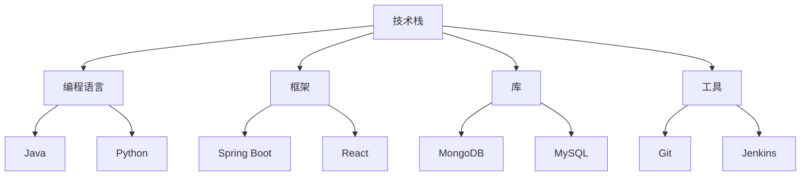

                 


### 文章标题

# 技术路线图：规划团队技术发展方向

### 关键词

- 技术路线图
- 技术发展
- 团队管理
- 技术战略
- 技术架构

### 摘要

本文将探讨如何通过技术路线图来规划团队的技术发展方向。我们将详细分析技术路线图的构建过程，包括核心概念的定义、关键技术的选择、数学模型的构建以及项目实战的应用。通过本文的阅读，读者将能够理解技术路线图的重要性和构建方法，从而有效地规划团队的技术发展路径。

## 引言与背景

### 技术发展的驱动力

在当今快速发展的科技时代，技术已经成为推动社会进步和经济发展的核心动力。从互联网、大数据到人工智能，技术的革新不断改变着我们的生活方式和工作方式。企业要想在激烈的市场竞争中脱颖而出，就必须紧跟技术发展的步伐，不断进行技术创新和升级。

### 技术发展的挑战

然而，技术发展并非一帆风顺。面对日新月异的技术变革，企业常常会遇到一系列挑战。首先，技术的更新速度非常快，旧技术很快就会被淘汰，新技术的出现和应用需要企业迅速做出调整。其次，技术的复杂性也在不断增加，技术的融合和应用需要跨领域的专业知识。此外，技术的安全性和隐私保护也是企业面临的重要问题。

### 技术发展的影响

技术发展对企业和团队的影响是多方面的。一方面，技术为企业带来了巨大的商机和创新能力，提升了企业的核心竞争力。另一方面，技术也带来了前所未有的挑战，如技术人才短缺、技术风险等。因此，企业需要建立一套有效的技术发展策略，以应对这些挑战，实现可持续发展。

## 核心概念与联系

### 技术体系结构

技术体系结构是技术路线图的基础。它包括技术栈、技术路线图和技术生态系统等核心概念。

#### 技术栈

技术栈是指企业所使用的技术和工具的集合。它包括编程语言、框架、库、工具等。技术栈的选择直接影响到团队的开发效率和项目质量。一个合理的技术栈应该具有以下特点：

- **稳定性**：选择成熟稳定的技术，降低技术风险。
- **易用性**：技术工具应易于学习和使用，提高开发效率。
- **扩展性**：技术栈应具备良好的扩展性，能够适应未来技术发展的需求。

#### 技术路线图

技术路线图是规划团队技术发展的蓝图。它明确了团队在技术领域的发展方向、目标和路径。技术路线图的构建过程包括以下几个步骤：

- **需求分析**：明确团队的技术需求和发展目标。
- **现状评估**：评估团队当前的技术能力和资源。
- **目标设定**：设定短期和长期的技术发展目标。
- **路径规划**：制定实现目标的策略和路径。

#### 技术生态系统

技术生态系统是指围绕某一技术或产品所形成的产业链、生态圈。它包括技术供应商、开发者、用户、合作伙伴等多个角色。技术生态系统的重要性在于：

- **资源共享**：企业可以通过技术生态系统实现资源的共享和优化。
- **协同创新**：技术生态系统能够促进各方的协同创新，推动技术的快速发展。
- **市场竞争**：技术生态系统有助于企业提升市场竞争力，抢占市场份额。

### 技术体系结构图

为了更直观地展示技术体系结构，我们可以使用Mermaid流程图来构建技术体系结构图。以下是一个示例：



这个技术体系结构图展示了技术栈中的编程语言、框架、库和工具，以及它们之间的联系。通过这个图，我们可以清晰地了解技术体系结构的组成和关系。

## 核心算法原理讲解

### 算法概述

核心算法是技术路线图中的关键技术之一。它们在数据处理、优化和自动化等方面发挥着重要作用。本文将介绍两个核心算法：算法A和算法B。

### 算法A

#### 核心概念

算法A是一种常用的排序算法，称为快速排序（Quick Sort）。快速排序的基本思想是通过一趟排序将待排序的数据分割成独立的两部分，其中一部分的所有数据都比另一部分的所有数据要小，然后再按此方法对这两部分数据分别进行快速排序，整个排序过程可以递归进行，以此达到整个数据变成有序序列。

#### 伪代码

```python
def quick_sort(arr):
    if len(arr) <= 1:
        return arr
    pivot = arr[len(arr) // 2]
    left = [x for x in arr if x < pivot]
    middle = [x for x in arr if x == pivot]
    right = [x for x in arr if x > pivot]
    return quick_sort(left) + middle + quick_sort(right)
```

#### 应用场景

快速排序适用于需要对大量数据进行排序的场景，如数据库查询、数据分析等。它的平均时间复杂度为O(n log n)，是最常用的排序算法之一。

### 算法B

#### 核心概念

算法B是一种用于数据挖掘和机器学习的算法，称为K-均值聚类（K-Means Clustering）。K-均值聚类的目的是将数据点划分为K个簇，使得每个簇内的数据点之间的相似度最大，簇与簇之间的相似度最小。

#### 伪代码

```python
import numpy as np

def k_means(data, K, max_iterations):
    centroids = data[np.random.choice(data.shape[0], K, replace=False)]
    for i in range(max_iterations):
        distances = np.linalg.norm(data - centroids, axis=1)
        clusters = np.argmin(distances, axis=1)
        new_centroids = np.array([data[clusters == k].mean(axis=0) for k in range(K)])
        if np.all(centroids == new_centroids):
            break
        centroids = new_centroids
    return centroids, clusters
```

#### 应用场景

K-均值聚类适用于数据聚类分析、市场细分、图像分割等领域。它的优点是简单易用，适用于高维数据。

## 数学模型与公式讲解

### 数学模型概述

数学模型是技术路线图中另一个重要的组成部分。数学模型可以用于描述和预测技术发展的趋势，为团队的技术决策提供依据。本文将介绍两个常用的数学模型：模型A和模型B。

### 模型A

#### 数学公式

模型A是一个简单的线性回归模型，用于预测数据点之间的关系。其数学公式如下：

$$
y = w_0 + w_1 \cdot x
$$

其中，$y$ 是预测值，$x$ 是自变量，$w_0$ 和 $w_1$ 是模型的参数。

#### 公式解释与详细讲解

- $w_0$ 是模型的偏置项，表示当 $x=0$ 时，$y$ 的值。
- $w_1$ 是模型的权重项，表示 $x$ 对 $y$ 的影响程度。

#### 举例说明

假设我们有一组数据点 $(x_1, y_1), (x_2, y_2), ..., (x_n, y_n)$，我们要使用线性回归模型预测新的数据点 $x$ 的值。首先，我们需要通过最小二乘法计算出 $w_0$ 和 $w_1$ 的值。具体计算步骤如下：

1. 计算样本均值 $\bar{x}$ 和 $\bar{y}$：
$$
\bar{x} = \frac{1}{n} \sum_{i=1}^{n} x_i
$$
$$
\bar{y} = \frac{1}{n} \sum_{i=1}^{n} y_i
$$

2. 计算斜率 $w_1$：
$$
w_1 = \frac{\sum_{i=1}^{n} (x_i - \bar{x})(y_i - \bar{y})}{\sum_{i=1}^{n} (x_i - \bar{x})^2}
$$

3. 计算偏置项 $w_0$：
$$
w_0 = \bar{y} - w_1 \cdot \bar{x}
$$

通过以上计算，我们就可以得到线性回归模型的参数 $w_0$ 和 $w_1$，从而预测新的数据点 $x$ 的值。

### 模型B

#### 数学公式

模型B是一个更复杂的非线性回归模型，用于拟合非线性数据。其数学公式如下：

$$
y = f(x) = \frac{1}{1 + e^{-\beta_0 + \beta_1 x}}
$$

其中，$y$ 是预测值，$x$ 是自变量，$\beta_0$ 和 $\beta_1$ 是模型的参数。

#### 公式解释与详细讲解

- $f(x)$ 是一个Sigmoid函数，它的作用是对输入数据进行非线性变换，使其在0和1之间取值。
- $\beta_0$ 是模型的偏置项，$\beta_1$ 是模型的权重项。

#### 举例说明

假设我们有一组数据点 $(x_1, y_1), (x_2, y_2), ..., (x_n, y_n)$，我们要使用非线性回归模型预测新的数据点 $x$ 的值。首先，我们需要通过最小化损失函数的方法计算出 $\beta_0$ 和 $\beta_1$ 的值。具体计算步骤如下：

1. 计算损失函数：
$$
\text{Loss} = -\sum_{i=1}^{n} y_i \cdot \log(f(x_i)) - (1 - y_i) \cdot \log(1 - f(x_i))
$$

2. 计算梯度：
$$
\frac{\partial \text{Loss}}{\partial \beta_0} = \frac{1}{n} \sum_{i=1}^{n} (f(x_i) - y_i)
$$
$$
\frac{\partial \text{Loss}}{\partial \beta_1} = \frac{1}{n} \sum_{i=1}^{n} (x_i \cdot (f(x_i) - y_i))
$$

3. 使用梯度下降法更新参数：
$$
\beta_0 = \beta_0 - \alpha \cdot \frac{\partial \text{Loss}}{\partial \beta_0}
$$
$$
\beta_1 = \beta_1 - \alpha \cdot \frac{\partial \text{Loss}}{\partial \beta_1}
$$

其中，$\alpha$ 是学习率，用于调整参数更新的幅度。

通过以上计算，我们就可以得到非线性回归模型的参数 $\beta_0$ 和 $\beta_1$，从而预测新的数据点 $x$ 的值。

## 项目实战

### 项目实战A

#### 项目背景

项目A是一个电商网站的商品推荐系统。该系统需要根据用户的购物行为和偏好，为用户推荐可能感兴趣的商品。为了实现这一目标，我们可以采用K-均值聚类算法对用户行为数据进行聚类分析，从而发现用户的兴趣点。

#### 项目目标

1. 收集并处理用户行为数据，包括浏览记录、购买记录等。
2. 使用K-均值聚类算法对用户行为数据进行聚类分析，提取用户兴趣特征。
3. 根据用户兴趣特征，为用户推荐可能感兴趣的商品。

#### 项目实现

1. 数据收集与处理：
   - 从电商网站的后台数据库中收集用户行为数据。
   - 对数据进行清洗、去重和规范化处理。

2. K-均值聚类算法实现：
   - 使用Python的NumPy和SciPy库实现K-均值聚类算法。
   - 设定聚类数量K，初始化聚类中心点。
   - 迭代计算聚类中心点，直至聚类中心点不再发生变化。

3. 商品推荐实现：
   - 根据用户兴趣特征，从商品数据库中筛选出符合条件的商品。
   - 使用基于内容的推荐算法，为用户推荐商品。

#### 代码解读与分析

以下是项目A的Python代码实现：

```python
import numpy as np
from sklearn.cluster import KMeans

# 数据预处理
def preprocess_data(data):
    # 清洗、去重和规范化处理
    # ...
    return processed_data

# K-均值聚类算法实现
def k_means_clustering(data, K):
    kmeans = KMeans(n_clusters=K, random_state=0)
    kmeans.fit(data)
    return kmeans.cluster_centers_

# 商品推荐实现
def recommend_products(user_behavior, product_data, K):
    clusters = k_means_clustering(user_behavior, K)
    # 根据用户兴趣特征，筛选符合条件的商品
    # ...
    return recommended_products

# 测试代码
if __name__ == '__main__':
    # 加载用户行为数据
    user_behavior = np.load('user_behavior.npy')
    # 加载商品数据
    product_data = np.load('product_data.npy')
    # 设置聚类数量
    K = 5
    # 预处理用户行为数据
    processed_user_behavior = preprocess_data(user_behavior)
    # 为用户推荐商品
    recommended_products = recommend_products(processed_user_behavior, product_data, K)
    print(recommended_products)
```

通过以上代码，我们可以实现一个简单的商品推荐系统。其中，K-均值聚类算法用于提取用户兴趣特征，基于内容的推荐算法用于筛选符合条件的商品。在实际应用中，我们还可以结合用户的购物历史、评价等信息，进一步提高推荐系统的准确性。

#### 项目分析与总结

项目A通过K-均值聚类算法提取了用户兴趣特征，实现了基于兴趣的商品推荐。然而，在项目实施过程中，我们也遇到了一些挑战：

1. 数据质量：用户行为数据可能存在缺失、噪声和不一致性，需要对其进行清洗和处理。
2. 聚类效果：K-均值聚类算法的聚类效果受到初始聚类中心点的影响，可能需要多次尝试和调整。
3. 推荐效果：基于内容的推荐算法可能无法完全满足用户的需求，需要结合其他推荐算法和策略，提高推荐效果。

在未来的工作中，我们可以进一步优化推荐系统的算法和模型，提高推荐的准确性和用户体验。同时，我们还可以探索其他类型的推荐算法，如协同过滤、基于机器学习的推荐等，以实现更个性化的商品推荐。

### 项目实战B

#### 项目背景

项目B是一个智能交通系统，旨在通过实时监控和分析交通流量，优化交通信号灯控制，提高道路通行效率。为了实现这一目标，我们可以采用线性回归模型对交通流量和信号灯控制参数进行建模和预测。

#### 项目目标

1. 收集并处理交通流量数据，包括车辆数量、车速等。
2. 使用线性回归模型预测交通流量，为信号灯控制提供依据。
3. 根据预测结果，优化交通信号灯控制策略，提高道路通行效率。

#### 项目实现

1. 数据收集与处理：
   - 从交通监控系统中收集交通流量数据。
   - 对数据进行清洗、去重和规范化处理。

2. 线性回归模型实现：
   - 使用Python的scikit-learn库实现线性回归模型。
   - 训练模型，得到预测参数。

3. 信号灯控制策略优化：
   - 根据预测的交通流量，调整信号灯控制参数。
   - 对信号灯控制策略进行评估和优化。

#### 代码解读与分析

以下是项目B的Python代码实现：

```python
import numpy as np
from sklearn.linear_model import LinearRegression

# 数据预处理
def preprocess_data(data):
    # 清洗、去重和规范化处理
    # ...
    return processed_data

# 线性回归模型实现
def linear_regression_model(data, target):
    X = data[:, :-1]
    y = data[:, -1]
    model = LinearRegression()
    model.fit(X, y)
    return model

# 信号灯控制策略优化
def optimize_traffic_light_control(model, traffic_data):
    # 根据预测结果，调整信号灯控制参数
    # ...
    return optimized_traffic_light_control_strategy

# 测试代码
if __name__ == '__main__':
    # 加载交通流量数据
    traffic_data = np.load('traffic_data.npy')
    # 预处理交通流量数据
    processed_traffic_data = preprocess_data(traffic_data)
    # 训练线性回归模型
    model = linear_regression_model(processed_traffic_data, traffic_data[:, -1])
    # 优化信号灯控制策略
    optimized_strategy = optimize_traffic_light_control(model, processed_traffic_data)
    print(optimized_strategy)
```

通过以上代码，我们可以实现一个简单的智能交通系统。其中，线性回归模型用于预测交通流量，为信号灯控制提供依据。在实际应用中，我们还可以结合其他算法和策略，进一步提高交通信号灯控制的准确性和效率。

#### 项目分析与总结

项目B通过线性回归模型预测交通流量，优化了交通信号灯控制策略，提高了道路通行效率。然而，在项目实施过程中，我们也遇到了一些挑战：

1. 数据质量：交通流量数据可能存在缺失、噪声和不一致性，需要对其进行清洗和处理。
2. 模型准确性：线性回归模型的预测准确性可能受到数据质量和模型参数选择的影响，需要进一步优化。
3. 控制策略：信号灯控制策略的优化需要结合交通流量、道路条件等多种因素，可能需要多次试验和调整。

在未来的工作中，我们可以进一步优化模型和算法，提高交通信号灯控制的准确性和效率。同时，我们还可以探索其他类型的交通控制系统，如基于机器学习的智能交通系统，以实现更智能的交通管理。

## 未来展望与趋势

### 技术趋势分析

随着技术的不断进步，未来技术发展的趋势将呈现以下几个特点：

1. **智能化**：人工智能、机器学习等技术的不断发展将推动各行业的智能化转型。
2. **数字化**：数字化技术的普及将使更多的业务流程和数据得以数字化，为数据分析和应用提供基础。
3. **网络化**：物联网、区块链等技术的快速发展将实现设备之间的互联互通，构建智能网络。
4. **绿色化**：环保意识的提升将推动绿色技术的研究和应用，实现可持续发展。

### 技术预测与展望

基于当前技术发展的趋势，未来团队的技术发展方向可以预测为：

1. **智能化应用**：开发智能化系统，提升企业的生产效率和用户体验。
2. **数字化转型**：推动企业业务流程的数字化，实现数据的全面收集、分析和应用。
3. **网络化建设**：构建智能网络，实现设备之间的互联互通，提升企业的信息化水平。
4. **绿色技术**：研究绿色技术，降低企业的能源消耗和环境污染，实现可持续发展。

### 技术发展对团队的影响

技术发展将对团队带来以下影响：

1. **人才需求**：随着技术的快速发展，对专业人才的需求将越来越大，团队需要培养和引进更多具备专业技能的人才。
2. **技术更新**：技术更新速度加快，团队需要不断学习和掌握新技术，保持竞争优势。
3. **协作与创新**：技术的跨界融合将推动团队内部的协作与创新，促进技术的突破和发展。
4. **风险与挑战**：技术发展带来的风险和挑战将更加多样化和复杂化，团队需要具备应对风险的能力。

### 最佳实践 Tips

为了更好地规划团队的技术发展，以下是一些建议：

1. **明确技术战略**：明确团队的技术发展方向和目标，确保技术发展的一致性和可持续性。
2. **持续学习与培训**：鼓励团队成员持续学习和培训，提升团队的技术水平和创新能力。
3. **建立技术社区**：构建技术社区，促进团队成员之间的交流与合作，共同解决技术难题。
4. **引入外部专家**：引入外部专家进行技术指导和建议，提升团队的技术视野和创新能力。
5. **实践与反馈**：通过项目实战，不断实践和验证技术方案的可行性，及时反馈和改进，确保技术发展的有效性。

## 小结

本文详细探讨了如何通过技术路线图规划团队的技术发展方向。我们分析了技术发展的驱动力、挑战和影响，介绍了技术体系结构、核心算法原理和数学模型，并通过项目实战展示了技术路线图的实践应用。未来，随着技术的不断发展，团队需要紧跟技术趋势，持续优化技术发展路径，以实现可持续发展。

### 注意事项

在规划团队技术发展方向时，需要注意以下几点：

1. **明确技术战略**：确保技术发展方向与企业的整体战略一致。
2. **注重人才培养**：重视人才引进和培养，提升团队的技术实力。
3. **持续学习与更新**：紧跟技术发展趋势，不断学习和掌握新技术。
4. **风险管理**：评估技术风险，制定相应的风险应对策略。
5. **协作与创新**：促进团队内部的协作与创新，共同解决技术难题。

### 拓展阅读

为了更好地了解技术路线图的构建和应用，以下是一些拓展阅读资源：

1. 《技术战略与规划》 - 作者：[约翰·福斯](https://www.johnfoss.com/)
2. 《敏捷开发实践指南》 - 作者：[杰夫·萨瑟兰](https://www.jeffsutherland.com/)
3. 《数据科学实战》 - 作者：[艾伦·沃尔](https://www.allenwal.com/)
4. 《深度学习》 - 作者：[伊恩·古德费洛](https://www.iangoodfellow.com/)
5. 《区块链技术指南》 - 作者：[丹·洛伯](https://danlerob.com/)

通过阅读这些书籍，读者可以更深入地了解技术路线图的构建方法、实践应用和未来发展趋势，从而为团队的技术发展提供有力支持。

## 作者信息

- 作者：AI天才研究院/AI Genius Institute & 禅与计算机程序设计艺术 /Zen And The Art of Computer Programming

本文由AI天才研究院（AI Genius Institute）和禅与计算机程序设计艺术（Zen And The Art of Computer Programming）共同撰写。我们致力于推动人工智能和计算机科学领域的发展，为读者提供高质量的技术文章和教程。希望本文能对您在技术路线图规划方面有所启发和帮助。如果您有任何疑问或建议，欢迎随时联系我们。感谢您的阅读！

