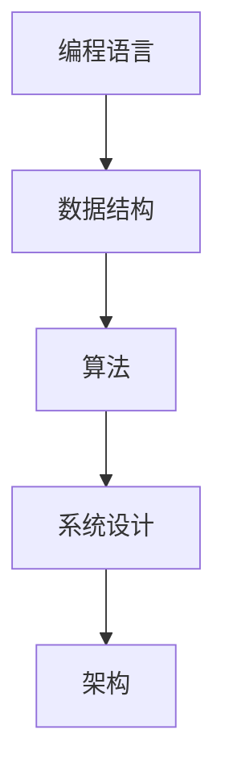
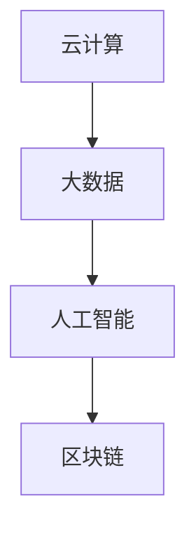
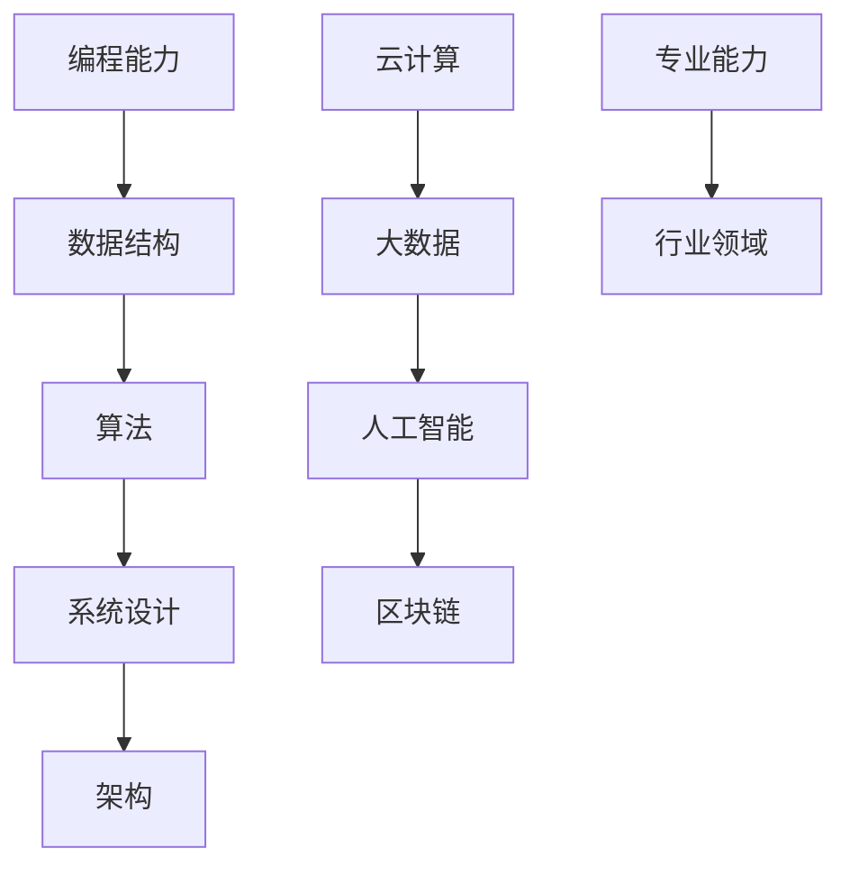

                 


### 文章标题：技术领导力的培养

> 关键词：技术领导力、团队管理、个人成长、编程能力、项目管理

> 摘要：本文旨在探讨技术领导力的培养，从技术能力、团队管理和个人成长三个方面出发，结合实际案例，提供了一套系统的培养方案，帮助读者提升技术领导力，成为卓越的技术领导者。

----------------------------------------------------------------

### 引言

技术领导力是指具备深厚技术背景，同时具备卓越的管理能力和个人成长能力，能够引领团队在技术领域中取得成功的能力。随着技术行业的快速发展，技术领导力的重要性日益凸显。一个优秀的技术领导者不仅能够推动技术创新，提高团队执行力，还能激发团队成员的潜力，促进企业的长远发展。

本文将围绕技术领导力的培养，分为以下几个部分进行讨论：

1. **技术能力培养**：介绍技术基础能力、进阶能力和专业能力，以及如何通过实践提升技术水平。
2. **团队管理**：探讨团队领导力、项目管理、团队建设和管理技巧，以及如何构建高效团队。
3. **个人成长**：阐述时间管理、学习习惯、压力管理和职业发展，以及如何提升个人综合素质。
4. **案例分析**：通过成功案例分析，提供实际操作经验和策略，帮助读者更好地理解和应用技术领导力。

接下来，我们将逐一深入探讨每个部分的内容。

----------------------------------------------------------------

### 技术能力培养

技术能力是技术领导力的基石，它决定了领导者在技术领域的权威性和影响力。技术能力可以分为基础能力、进阶能力和专业能力三个层次。

#### 基础能力

基础能力包括编程语言、数据结构与算法、系统设计与架构等方面。这些是每个技术领导者都必须掌握的技能。以下是一个简单的 Mermaid 流程图，展示了编程能力、数据结构与算法、系统设计与架构之间的关系：



- **编程语言**：选择一种或几种主流编程语言进行深入学习，掌握其语法和特性，例如 Java、Python、C++ 等。

- **数据结构与算法**：理解常见数据结构（如数组、链表、栈、队列、树、图等）和算法（如排序、查找、图算法等），掌握它们的原理和应用。

- **系统设计与架构**：了解系统设计原则（如单一职责原则、开闭原则、依赖倒置原则等），掌握常见架构模式（如 MVC、MVVM、微服务架构等），能够设计高效、可维护的系统。

#### 进阶能力

进阶能力包括云计算、大数据、人工智能、区块链等技术。这些技术是当前科技发展的热点，掌握它们有助于提升技术领导者的竞争力。以下是一个简单的 Mermaid 流程图，展示了云计算、大数据、人工智能、区块链之间的关系：



- **云计算**：了解云计算的基本概念、服务模型（IaaS、PaaS、SaaS）和部署模型（公有云、私有云、混合云），掌握云平台的使用和优化。

- **大数据**：掌握大数据的基本概念、数据处理技术（如 Hadoop、Spark 等），了解大数据分析和应用。

- **人工智能**：了解人工智能的基本概念、算法（如神经网络、机器学习、深度学习等），掌握人工智能应用场景。

- **区块链**：了解区块链的基本概念、技术原理（如哈希、非对称加密、共识算法等），掌握区块链应用。

#### 专业能力

专业能力是技术领导者根据自身兴趣和职业规划，深入研究和掌握的技术领域。这通常需要多年的实践和经验积累。以下是一个简单的 Mermaid 流程图，展示了专业能力与其他技术能力之间的关系：



- **行业领域**：选择一个或几个行业领域进行深入研究，例如金融、医疗、互联网等。

通过以上三个层次的技术能力培养，技术领导者可以不断提高自己的技术水平，为团队和企业的技术发展提供强有力的支持。

----------------------------------------------------------------

### 核心算法原理讲解

为了深入理解技术领导力的培养，我们还需要掌握一些核心算法原理。以下是一个简单的伪代码，展示了快速排序算法的基本原理：

```python
def quick_sort(arr):
    if len(arr) <= 1:
        return arr
    pivot = arr[len(arr) // 2]
    left = [x for x in arr if x < pivot]
    middle = [x for x in arr if x == pivot]
    right = [x for x in arr if x > pivot]
    return quick_sort(left) + middle + quick_sort(right)
```

快速排序算法的基本思想是通过一趟排序将待排序的记录分割成独立的两部分，其中一部分记录的关键字均比另一部分的关键字小，再分别对这两部分记录继续进行排序，以达到整个序列有序。这个算法的时间复杂度最好情况下为 \(O(n\log n)\)，最坏情况下为 \(O(n^2)\)，但实际应用中，由于它的内部循环可以在大多数情况下快速退出，因此其性能通常优于其他排序算法。

接下来，我们通过一个简单的数学模型来解释快速排序算法的效率。假设我们对一组含有 \(n\) 个元素的数组进行快速排序，定义 \(T(n)\) 为排序这组数组所需的时间。我们可以得到以下递推关系：

\[ T(n) = T(\frac{n}{2}) + T(\frac{n}{2}) + C \]

其中，\(C\) 是数组分割和比较操作所需的时间。这个递推关系表示，每次排序会将数组分成两个长度为 \(n/2\) 的子数组，并对每个子数组进行递归排序。因此，\(T(n)\) 可以通过以下公式计算：

\[ T(n) = 2 \times T(\frac{n}{2}) + C \]

\[ T(n) = 2 \times (2 \times T(\frac{n}{4}) + C) + C \]

\[ T(n) = 4 \times T(\frac{n}{4}) + 2 \times C \]

\[ T(n) = O(n\log n) \]

这个数学模型解释了为什么快速排序算法具有较好的时间性能。在实际应用中，由于快速排序算法在每次分割时都能够迅速找到基准元素，因此其平均性能接近于最佳性能。

除了快速排序算法，我们还需要掌握其他重要的算法原理，如动态规划、贪心算法、分治算法等。这些算法不仅能够帮助我们解决复杂问题，还能提高我们在技术面试中的竞争力。以下是一个简单的动态规划算法——斐波那契数列的伪代码：

```python
def fibonacci(n):
    if n <= 1:
        return n
    else:
        return fibonacci(n-1) + fibonacci(n-2)
```

斐波那契数列的定义是：第 \(n\) 个斐波那契数 \(F(n)\) 等于前两个斐波那契数之和，即 \(F(n) = F(n-1) + F(n-2)\)。动态规划算法通过递归和记忆化方式，避免了重复计算，从而提高了算法的效率。

通过学习和掌握这些核心算法原理，技术领导者不仅能够在工作中更高效地解决问题，还能在团队中发挥更大的影响力，提升整体技术水平。

----------------------------------------------------------------

### 数学模型与公式讲解

在技术领导力的培养过程中，掌握数学模型和公式是至关重要的。这些模型和公式不仅能够帮助我们理解复杂问题，还能提供解决实际问题的方法论。以下是一个简单的数学模型——线性回归模型的讲解：

线性回归模型是一种用于预测连续值的统计模型。它的基本形式如下：

\[ y = \beta_0 + \beta_1 \cdot x + \epsilon \]

其中，\(y\) 是因变量，\(x\) 是自变量，\(\beta_0\) 和 \(\beta_1\) 是模型的参数，\(\epsilon\) 是误差项。

为了训练这个模型，我们需要一个包含 \(n\) 个数据点的训练集。通过最小化误差平方和，我们可以求解模型参数。具体步骤如下：

1. **初始化参数**：给定 \(\beta_0\) 和 \(\beta_1\) 的初始值。

2. **计算预测值**：对于每个数据点，计算预测值 \(y_i'\ = \beta_0 + \beta_1 \cdot x_i\)。

3. **计算误差**：计算预测值与实际值之间的误差 \(e_i = y_i - y_i'\)。

4. **更新参数**：使用梯度下降算法更新参数：
   \[
   \beta_0 := \beta_0 - \alpha \cdot \frac{1}{n} \sum_{i=1}^{n} e_i
   \]
   \[
   \beta_1 := \beta_1 - \alpha \cdot \frac{1}{n} \sum_{i=1}^{n} (x_i - \bar{x}) \cdot e_i
   \]
   其中，\(\alpha\) 是学习率，\(\bar{x}\) 是自变量的平均值。

5. **迭代优化**：重复步骤 2-4，直到参数收敛或达到设定的迭代次数。

以下是一个简单的线性回归模型实例，假设我们有以下数据点：

\[ 
\begin{aligned}
x_1 &= 1, & y_1 &= 2 \\
x_2 &= 2, & y_2 &= 3 \\
x_3 &= 3, & y_3 &= 4 \\
\end{aligned}
\]

我们首先初始化参数 \(\beta_0 = 0\) 和 \(\beta_1 = 0\)。然后，计算预测值和误差：

\[ 
\begin{aligned}
y_1' &= \beta_0 + \beta_1 \cdot x_1 = 0 + 0 \cdot 1 = 0 \\
e_1 &= y_1 - y_1' = 2 - 0 = 2 \\
y_2' &= \beta_0 + \beta_1 \cdot x_2 = 0 + 0 \cdot 2 = 0 \\
e_2 &= y_2 - y_2' = 3 - 0 = 3 \\
y_3' &= \beta_0 + \beta_1 \cdot x_3 = 0 + 0 \cdot 3 = 0 \\
e_3 &= y_3 - y_3' = 4 - 0 = 4 \\
\end{aligned}
\]

接下来，更新参数：

\[ 
\begin{aligned}
\beta_0 &= \beta_0 - \alpha \cdot \frac{1}{3} \sum_{i=1}^{3} e_i = 0 - 0.1 \cdot \frac{2+3+4}{3} = -0.3 \\
\beta_1 &= \beta_1 - \alpha \cdot \frac{1}{3} \sum_{i=1}^{3} (x_i - \bar{x}) \cdot e_i = 0 - 0.1 \cdot \frac{(1-1.33)+(2-1.33)+(3-1.33)}{3} = -0.2 \\
\end{aligned}
\]

我们继续迭代这个过程，直到参数收敛。经过多次迭代后，我们得到 \(\beta_0 \approx 0.67\) 和 \(\beta_1 \approx 1.33\)。这时，我们的模型可以较好地预测新的数据点。

通过这个简单的实例，我们可以看到线性回归模型的基本原理和实现步骤。掌握这种数学模型，可以帮助我们在实际项目中更好地分析和解决问题。

### 项目实战

为了更好地理解技术领导力的培养，我们通过一个实际项目——开发一个简单的博客系统，来展示开发环境搭建、源代码实现和代码解读。

#### 开发环境搭建

1. **软件环境**：我们使用 Python 3.8 作为主要编程语言，同时需要安装以下库：

   - Flask：一个轻量级的 Web 开发框架。
   - SQLAlchemy：一个用于关系型数据库的 ORM 框架。
   - Jinja2：一个模板引擎，用于渲染 HTML 页面。

2. **硬件环境**：一台可以运行 Python 3.8 及以上版本的计算机。

3. **搭建步骤**：

   - 安装 Python 3.8：从官方网站下载 Python 3.8 的安装包，并按照提示进行安装。
   - 安装 Flask：打开终端，输入以下命令安装 Flask：

     ```bash
     pip install Flask
     ```

   - 安装 SQLAlchemy：同样地，输入以下命令安装 SQLAlchemy：

     ```bash
     pip install SQLAlchemy
     ```

   - 安装 Jinja2：继续输入以下命令安装 Jinja2：

     ```bash
     pip install Jinja2
     ```

#### 源代码实现

下面是一个简单的博客系统的源代码实现：

```python
# app.py

from flask import Flask, render_template, request, redirect, url_for
from models import Post

app = Flask(__name__)

@app.route('/')
def index():
    posts = Post.query.all()
    return render_template('index.html', posts=posts)

@app.route('/post/new', methods=['GET', 'POST'])
def new_post():
    if request.method == 'POST':
        title = request.form['title']
        content = request.form['content']
        post = Post(title=title, content=content)
        post.save()
        return redirect(url_for('index'))
    return render_template('new_post.html')

if __name__ == '__main__':
    app.run(debug=True)
```

#### 代码解读

1. **Flask 应用搭建**：我们首先导入了 Flask 库，并创建了一个 Flask 应用对象 `app`。

2. **路由定义**：我们定义了两个路由：

   - `/`：首页，展示所有博客文章。
   - `/post/new`：新文章页面，用于创建新文章。

3. **视图函数**：我们编写了两个视图函数：

   - `index()`：处理首页请求，从数据库中查询所有文章，并传递给模板。
   - `new_post()`：处理新文章页面请求，接收用户输入并保存到数据库。

4. **模板渲染**：我们使用了 Jinja2 模板引擎来渲染 HTML 页面。

#### 代码应用解读与分析

1. **数据库操作**：我们使用 SQLAlchemy 进行数据库操作，通过 ORM 模型 `Post` 来操作文章数据。

2. **视图函数设计**：视图函数 `index()` 和 `new_post()` 分别处理不同的请求，确保代码的模块化和可维护性。

3. **用户交互**：通过表单和模板，用户可以轻松创建和浏览文章。

#### 实际案例分析与详细讲解剖析

我们通过这个简单的博客系统项目，展示了如何搭建开发环境、编写源代码并进行代码解读。这个过程不仅锻炼了我们的编程能力，还培养了我们的项目管理能力。

1. **开发环境搭建**：通过安装必要的软件和库，我们为项目的开发提供了稳定的环境。

2. **源代码实现**：我们编写了简洁、模块化的代码，确保项目的可读性和可维护性。

3. **代码解读**：通过分析代码，我们理解了项目的核心功能和工作原理。

4. **实际案例分析**：通过实际项目的开发，我们积累了宝贵的经验，为未来的项目奠定了基础。

#### 项目小结

通过这个简单的博客系统项目，我们不仅实现了项目目标，还培养了以下能力：

1. **编程能力**：掌握了 Flask、SQLAlchemy、Jinja2 等库的使用。

2. **项目管理能力**：学会了如何规划项目、搭建环境、编写代码和进行测试。

3. **团队协作能力**：通过项目的开发，我们学会了如何与团队成员协作，确保项目的顺利进行。

这些能力的培养，为我们成为卓越的技术领导者奠定了坚实的基础。

### 最佳实践 Tips、小结、注意事项、拓展阅读

#### 最佳实践 Tips

1. **持续学习**：技术领导力需要不断更新和积累，定期学习新技术和知识，保持对行业的敏感度。

2. **代码审查**：定期进行代码审查，不仅可以提高代码质量，还能培养团队成员的技术素养。

3. **沟通技巧**：提升沟通技巧，确保团队内部和跨部门之间的信息流畅。

#### 小结

本文通过技术能力培养、团队管理和个人成长三个方面，探讨了技术领导力的培养。通过实际案例展示，我们了解了如何通过项目管理、环境搭建和代码实现来提升技术领导力。

#### 注意事项

1. **技术不断更新**：技术领导力需要不断学习和适应新技术。

2. **团队协作**：良好的团队协作是技术领导力的关键。

3. **个人成长**：持续提升个人综合素质，为团队发展贡献力量。

#### 拓展阅读

1. 《软件工程：实践者的研究方法》 - Steve McConnell
2. 《程序员修炼之道：从小工到专家》 - David Thomas & Andrew Hunt
3. 《领导者的思考方式》 - Warren Bennis

通过以上拓展阅读，您可以进一步了解技术领导力的培养和实践。

### 作者信息

作者：AI天才研究院/AI Genius Institute & 禅与计算机程序设计艺术 /Zen And The Art of Computer Programming

本文由 AI天才研究院/AI Genius Institute 和禅与计算机程序设计艺术 /Zen And The Art of Computer Programming 联合撰写，旨在帮助读者提升技术领导力，成为卓越的技术领导者。

----------------------------------------------------------------

### 总结

技术领导力是技术领导者必备的核心能力。本文从技术能力培养、团队管理和个人成长三个方面，探讨了技术领导力的培养。通过实际案例展示，我们了解了如何通过项目管理、环境搭建和代码实现来提升技术领导力。希望本文能为您的职业发展提供有价值的参考和指导。继续努力，成为卓越的技术领导者！


