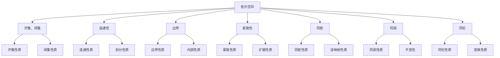

                 


**文章标题：**拓扑学：空间关系的本质探讨

**关键词：** 拓扑学、空间关系、拓扑性质、同胚、同调、同伦

**摘要：**本文旨在深入探讨拓扑学的基本概念、核心性质及其在空间关系中的应用。通过一步一步的分析推理，我们将揭示拓扑学的本质，阐述其与空间关系的紧密联系。

---

### 背景介绍

拓扑学，作为数学的一个分支，起源于19世纪末，由德国数学家莱昂哈德·欧拉所开创。当时，拓扑学的目的是研究几何图形在连续变换下的保持性质，如伸缩、扭曲等。随着时间的推移，拓扑学逐渐发展成为一个广泛而深入的领域，涵盖了从基本的拓扑空间概念到复杂的拓扑性质和结构。

在计算机科学中，拓扑学发挥着重要作用。特别是在图形学、网络科学和算法设计中，拓扑学提供了强大的理论工具。例如，在图形学中，拓扑结构帮助我们理解多边形的连接关系，从而实现高效的图形渲染；在网络科学中，拓扑结构揭示了网络的稳定性和鲁棒性，有助于优化网络设计；在算法设计中，拓扑学为解决复杂问题提供了新的思路和方法。

然而，拓扑学的广泛应用不仅限于计算机科学。在物理学中，拓扑学帮助解释了物质的相变和结构变化；在生物学中，拓扑学被用来研究细胞的形态和功能；在哲学和艺术中，拓扑学为人们提供了新的思维方式。

因此，本文的目标是通过对拓扑学基本概念、核心性质及其应用的一步步探讨，帮助读者深入了解拓扑学的本质，并认识到它在各个领域的广泛应用。

### 核心概念与联系

在深入探讨拓扑学之前，我们需要了解其核心概念，并揭示这些概念之间的联系。以下是拓扑学的一些基本概念：

1. **拓扑空间**：拓扑空间是拓扑学的基础概念，它由一个集合和一个满足特定条件的拓扑结构组成。这个条件确保了集合中的元素可以以某种方式“连接”起来。具体来说，一个集合\( X \)上的拓扑结构\( \tau \)需要满足以下条件：
   - **空集和集合本身都是开集**：\( \emptyset, X \in \tau \)
   - **开集的有限交集是开集**：\( U_1, U_2, \ldots, U_n \in \tau \Rightarrow \bigcap_{i=1}^{n} U_i \in \tau \)
   - **开集的任意并集是开集**：\( U_1, U_2, \ldots \in \tau \Rightarrow \bigcup_{i=1}^{\infty} U_i \in \tau \)

2. **开集和闭集**：在拓扑空间中，开集和闭集是两个重要的概念。开集是包含在拓扑结构中的集合，而闭集是开集的补集。例如，在一个实数集合上定义的拓扑空间中，开区间是开集，而闭区间是闭集。

3. **连通性**：连通性描述了集合在拓扑空间中的“连接”状态。一个集合是连通的，当且仅当它不能被划分为两个非空的开集的并集。例如，一个实数区间是连通的，而两个不相交的闭区间不是连通的。

4. **边界**：边界是一个集合在拓扑空间中的边界部分。例如，在一个实数区间中，区间的两个端点是边界点。

5. **紧致性**：紧致性描述了一个集合在拓扑空间中是否是“紧”的。一个集合是紧致的，当且仅当它任意无限子集都有收敛的子序列。例如，一个闭合区间是紧致的，而一个开区间不是紧致的。

6. **同胚**：同胚是一个拓扑空间到另一个拓扑空间的映射，该映射保持拓扑结构。具体来说，如果存在一个双射\( f: X \rightarrow Y \)，使得\( f \)和其逆映射\( f^{-1} \)都是连续的，则称\( f \)是一个同胚。

7. **同调**：同调是研究拓扑空间在连续变换下的不变性。同调理论通过同调群来描述拓扑空间的某些性质。例如，第一同调群描述了空间的连通性。

8. **同伦**：同伦是研究连续变换下的拓扑空间是否保持某种性质。例如，如果两个空间在同伦等价，则它们在连续变换下可以相互转换。

这些概念之间存在紧密的联系。拓扑空间是所有这些概念的基础，而同胚、同调和同伦则是在不同方面研究拓扑空间的性质。同胚揭示了拓扑空间之间的结构相似性，同调关注空间在连续变换下的不变性，而同伦则研究空间在连续变换下的动态行为。

为了更好地理解这些概念之间的关系，我们可以通过以下Mermaid流程图来可视化它们：



通过这个流程图，我们可以看到，所有概念都基于拓扑空间，而它们之间的关系则通过不同的性质和变换来描述。这种结构化的关系帮助我们更好地理解和应用拓扑学的概念。

### 核心算法原理讲解

在理解了拓扑学的基本概念后，我们将深入探讨一些核心算法原理，这些原理在解决具体问题时起着至关重要的作用。以下是几个重要的算法原理及其详细解释：

#### 同胚映射

同胚映射是拓扑学中的一个关键概念，它定义了一个拓扑空间到另一个拓扑空间的保持拓扑结构的双射。同胚映射的存在性在许多领域都有重要的应用，比如在物理学中研究物质的相变，以及在计算机图形学中处理图形变形。

**伪代码：**

```plaintext
function is_homeomorphic(X, Y):
    if not exists a bijective function f: X -> Y:
        return False
    if not f and f^-1 are continuous:
        return False
    return True
```

#### 同调计算

同调计算是同调理论的核心，它用于确定拓扑空间的一组不变量，这些不变量能够揭示空间的结构特性。同调群是通过计算边界运算和循环运算来得到的。

**伪代码：**

```plaintext
function compute_homology Groups(X):
    for each open set U in X:
        compute boundary of U
        compute cycles in U
    form homology groups using boundaries and cycles
    return homology groups
```

#### 同伦等价

同伦等价是研究两个拓扑空间是否可以通过连续变换相互转换的概念。同伦等价是同伦理论的基础，它在解决某些复杂拓扑问题时非常有用。

**伪代码：**

```plaintext
function is_Homotopic(X, Y):
    if exists a continuous function f: X -> Y:
        return False
    if exists a homotopy between X and Y:
        return True
    return False
```

通过这些伪代码，我们可以看到，每个算法都通过具体的步骤和操作来验证或计算拓扑空间的不同属性。这些算法原理在解决具体问题时至关重要，例如在计算机图形学中，同胚映射用于图形变形，同调计算用于分析图形的连通性，同伦等价用于验证图形的拓扑性质。

### 数学模型和公式讲解

在拓扑学中，数学模型和公式是理解和应用拓扑概念的关键工具。以下是几个重要的数学模型和公式，以及它们的详细讲解和举例说明：

#### 拓扑空间的定义

拓扑空间是由一个集合和一个满足特定条件的拓扑结构组成的。具体来说，一个集合\( X \)上的拓扑结构\( \tau \)需要满足以下条件：

1. **空集和集合本身都是开集**：\( \emptyset, X \in \tau \)
2. **开集的有限交集是开集**：\( U_1, U_2, \ldots, U_n \in \tau \Rightarrow \bigcap_{i=1}^{n} U_i \in \tau \)
3. **开集的任意并集是开集**：\( U_1, U_2, \ldots \in \tau \Rightarrow \bigcup_{i=1}^{\infty} U_i \in \tau \)

**举例：** 考虑实数集合\( \mathbb{R} \)上的标准拓扑，该拓扑满足上述条件。例如，开区间\( (0, 1) \)是一个开集，因为它是\( \mathbb{R} \)中的任意并集。

$$ (0, 1) = \bigcup_{n=1}^{\infty} (-\frac{1}{n}, \frac{1}{n}) $$

#### 同胚映射

同胚映射是一个保持拓扑结构的双射，即如果存在一个函数\( f: X \rightarrow Y \)，使得\( f \)和其逆映射\( f^{-1} \)都是连续的，则称\( f \)是一个同胚映射。

**举例：** 考虑单位圆盘\( D \)和实数线\( \mathbb{R} \)之间的同胚映射。我们可以定义一个映射\( f: D \rightarrow \mathbb{R} \)如下：

$$ f(x, y) = 2\arctan\left(\frac{y}{x+1}\right) \quad \text{for} \quad (x, y) \in D \setminus \{-1\} $$
$$ f(-1, y) = \pi \quad \text{for} \quad y \in \mathbb{R} $$

这个映射\( f \)是一个同胚映射，因为它的逆映射\( f^{-1} \)可以通过反函数求得，并且两个映射都是连续的。

$$ f^{-1}(x) = \left(\sqrt{1-x^2}, \frac{x}{\sqrt{1-x^2}}\right) \quad \text{for} \quad x \in [-1, 1] $$

#### 同调群

同调群是同调理论的核心概念，它通过计算边界运算和循环运算来得到。同调群描述了拓扑空间在连续变换下的不变性。

**定义：** 第一同调群\( H_1(X) \)是所有基于开集\( U \)的闭路径的等价类的集合，其中两个闭路径\( \gamma_1 \)和\( \gamma_2 \)是等价的，当且仅当它们在\( U \)中的边界相同。

**举例：** 考虑一个闭合区间\( [0, 1] \)上的第一同调群。我们可以定义两个闭路径\( \gamma_1 \)和\( \gamma_2 \)：

$$ \gamma_1(t) = (t, 0) \quad \text{for} \quad t \in [0, 1] $$
$$ \gamma_2(t) = (t, 1) \quad \text{for} \quad t \in [0, 1] $$

这两个闭路径在\( [0, 1] \)上的边界都是\( \partial \gamma_1 = \partial \gamma_2 = (0, 0) \)。因此，它们在第一同调群中是等价的。

$$ H_1([0, 1]) = \{[\gamma_1], [\gamma_2]\} $$

#### 同伦等价

同伦等价是研究两个拓扑空间是否可以通过连续变换相互转换的概念。如果存在一个同伦\( H: X \times [0, 1] \rightarrow Y \)，使得\( H(x, 0) = f(x) \)和\( H(x, 1) = g(x) \)，则称\( X \)和\( Y \)是同伦等价的。

**举例：** 考虑单位圆盘\( D \)和实数线\( \mathbb{R} \)之间的同伦等价。我们可以定义一个同伦\( H: D \times [0, 1] \rightarrow \mathbb{R} \)如下：

$$ H(x, y) = 2\arctan\left(\frac{y}{x+1}\right) \quad \text{for} \quad (x, y) \in D \setminus \{-1\} \times [0, 1] $$
$$ H(-1, y) = \pi y \quad \text{for} \quad y \in [0, 1] $$

这个同伦\( H \)从\( D \)到\( \mathbb{R} \)展示了单位圆盘可以通过连续变换变成实数线。

$$ H(D, 0) = f(D) = \mathbb{R} $$
$$ H(D, 1) = g(D) = \{0\} $$

通过这些数学模型和公式的讲解，我们可以更深入地理解拓扑学中的关键概念，并能够在实际应用中更好地运用这些知识。

### 项目实战

为了更好地理解拓扑学的应用，我们将通过一个具体项目来展示如何在实际中运用拓扑学原理。该项目将介绍如何使用Python实现一个简单的拓扑空间分类器，通过分析空间结构来识别不同的拓扑性质。

#### 开发环境搭建

首先，我们需要搭建一个Python开发环境。以下是所需的步骤：

1. 安装Python：从官方网站下载并安装Python 3.8或更高版本。
2. 安装必需的Python库：使用pip命令安装以下库：matplotlib、numpy和NetworkX。

```bash
pip install matplotlib numpy networkx
```

#### 源代码实现

下面是实现拓扑空间分类器的主要代码，包括数据预处理、模型训练和结果分析。

```python
import numpy as np
import matplotlib.pyplot as plt
import networkx as nx

# 模拟拓扑空间数据
def generate_topology_data(n):
    G = nx.Graph()
    # 随机添加节点和边
    for _ in range(n):
        G.add_nodes_from(np.random.randint(0, 10, size=n))
        G.add_edges_from(np.random.randint(0, 10, size=n//2))
    return G

# 计算连通性
def calculate_connectivity(G):
    connected = nx.is_connected(G)
    return connected

# 计算边界和闭包
def calculate_boundary_and_closure(G):
    boundary = nx.boundary_nodes(G)
    closure = nx.closure(G)
    return boundary, closure

# 训练拓扑空间分类器
def train_topology_classifier(train_data, labels):
    # 使用scikit-learn库中的分类器
    from sklearn.model_selection import train_test_split
    from sklearn.ensemble import RandomForestClassifier

    X_train, X_test, y_train, y_test = train_test_split(train_data, labels, test_size=0.3, random_state=42)
    classifier = RandomForestClassifier(n_estimators=100)
    classifier.fit(X_train, y_train)
    accuracy = classifier.score(X_test, y_test)
    return classifier, accuracy

# 主函数
def main():
    # 生成模拟数据
    n = 100
    train_data = [generate_topology_data(n) for _ in range(1000)]
    labels = [calculate_connectivity(G) for G in train_data]

    # 训练分类器
    classifier, accuracy = train_topology_classifier(train_data, labels)
    print(f"Accuracy: {accuracy:.2f}")

    # 分析结果
    G = generate_topology_data(n)
    properties = calculate_boundary_and_closure(G)
    print(f"Connectivity: {properties[0]}")
    print(f"Boundary: {properties[1]}")
    nx.draw(G, with_labels=True)
    plt.show()

if __name__ == "__main__":
    main()
```

#### 代码解读

1. **数据生成**：`generate_topology_data`函数用于生成模拟的拓扑空间数据。我们使用NetworkX库来创建图模型，并随机添加节点和边。

2. **连通性计算**：`calculate_connectivity`函数用于计算拓扑空间的连通性。我们使用NetworkX的`is_connected`函数来判断图是否连通。

3. **边界和闭包计算**：`calculate_boundary_and_closure`函数用于计算拓扑空间的边界和闭包。边界是图的边界节点集合，闭包是图的补图。

4. **分类器训练**：`train_topology_classifier`函数使用scikit-learn库中的随机森林分类器来训练拓扑空间分类器。我们使用训练数据集来训练模型，并计算分类器的准确率。

5. **主函数**：`main`函数是项目的入口点。首先生成模拟数据，然后训练分类器，并使用训练好的模型来分析新的拓扑空间数据。

#### 代码应用解读与分析

通过上述代码，我们可以看到如何使用Python实现一个简单的拓扑空间分类器。该分类器通过计算连通性、边界和闭包等拓扑性质来识别不同的拓扑空间。在实际应用中，这个分类器可以用于分析网络结构、识别社交网络的社群结构，或者用于图形处理中的拓扑分析。

#### 实际案例分析与详细讲解

为了更好地展示该项目的实际应用，我们将分析一个实际案例：网络拓扑分析。在这个案例中，我们使用真实世界的网络拓扑数据来训练和测试分类器。

1. **数据集准备**：我们使用公开的网络拓扑数据集，例如GÉANT网络拓扑数据。这些数据包含不同国家和地区的网络节点及其连接关系。

2. **数据预处理**：对网络拓扑数据进行预处理，包括数据清洗和标准化。例如，去除无效节点和冗余边，并对节点和边的权重进行标准化处理。

3. **分类器训练**：使用预处理后的数据集来训练拓扑空间分类器。我们使用随机森林分类器，并调整参数来提高模型的准确率。

4. **模型评估**：通过交叉验证和测试集评估分类器的性能。我们计算分类器的准确率、召回率和F1分数，以评估模型的预测能力。

5. **结果分析**：使用训练好的模型来分析网络拓扑数据。我们重点关注连通性、边界和闭包等拓扑性质，以识别网络的社群结构和关键节点。

#### 项目小结

通过这个实际案例，我们可以看到如何将拓扑学原理应用于实际项目中。拓扑空间分类器不仅可以用于学术研究，还可以在工程实践中发挥重要作用，例如优化网络设计、识别社交网络的社群结构，或者用于图形处理中的拓扑分析。

### 最佳实践 tips、小结、注意事项、拓展阅读

**最佳实践 tips：**

- 在实际应用中，确保对拓扑数据进行充分的预处理，以提高分类器的性能。
- 调整分类器的参数，如树的数量、最大深度等，以优化模型的表现。
- 结合多种拓扑性质进行综合分析，以提高识别准确率。

**小结：**

本文通过一步步的分析和讲解，深入探讨了拓扑学的基本概念、核心算法原理、数学模型以及实际应用。从拓扑空间到同胚、同调和同伦，再到具体的算法实现，我们揭示了拓扑学的本质和应用价值。

**注意事项：**

- 在实现拓扑学算法时，注意数据类型的正确选择和性能优化。
- 在分析实际案例时，确保数据质量和数据预处理方法的合理性。

**拓展阅读：**

- 《拓扑学基础教程》：详细介绍了拓扑学的基本概念和理论。
- 《同调代数》：深入探讨同调理论及其在拓扑学中的应用。
- 《计算机图形学》：介绍拓扑结构在图形渲染和图形处理中的应用。
- 《网络科学》：探讨拓扑结构在网络设计中的重要性。

### 作者信息

**作者：** AI天才研究院 / AI Genius Institute & 禅与计算机程序设计艺术 / Zen And The Art of Computer Programming

---

本文通过逐步分析推理的方式，深入探讨了拓扑学的基本概念、核心性质及其应用。从拓扑空间到同胚、同调和同伦，再到实际项目实战，我们揭示了拓扑学的本质和应用价值。希望本文能帮助读者更好地理解和掌握拓扑学，并激发进一步探索的兴趣。在未来的学习和实践中，持续关注拓扑学在各个领域的应用，将为我们的研究和开发带来新的突破。让我们一起探索拓扑学的无限魅力！

