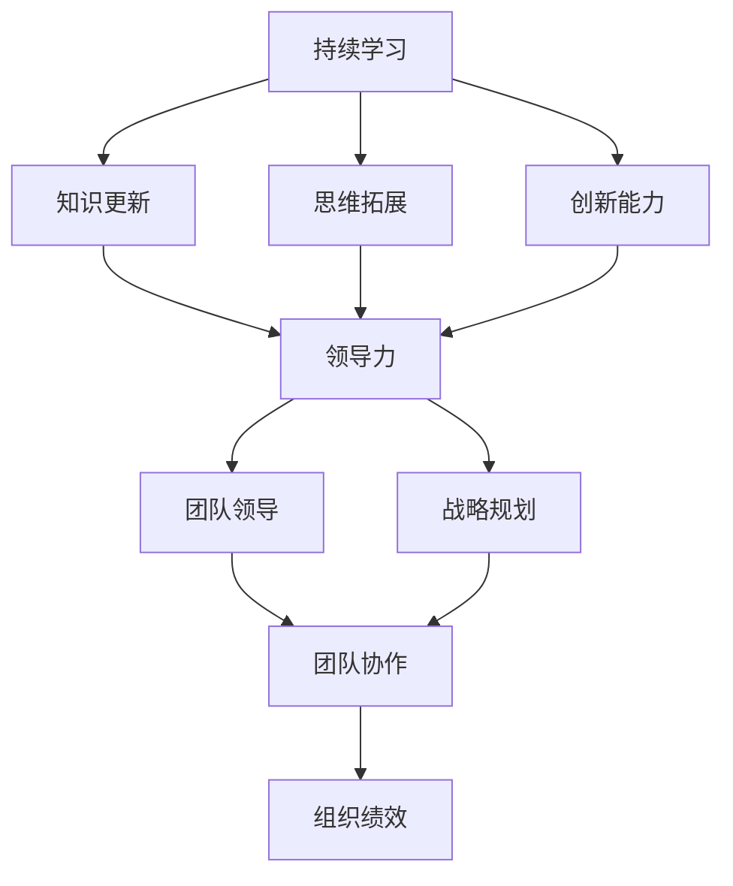

                 

### 文章标题

# 持续学习：领导者的成长之道

### 文章关键词

- 持续学习
- 领导力
- 成长模型
- 团队协作
- 创新思维

### 文章摘要

本文旨在探讨领导者的成长之道，特别是持续学习在领导者发展中的核心作用。文章首先介绍了持续学习的重要性，然后分析了领导力的定义与特质，并提出了一个详细的领导者成长模型。接下来，文章深入探讨了情绪管理与自我提升的重要性，以及团队领导与协作的策略。文章还讨论了终身学习与领导力的关系，以及领导力实践与创新的关键。最后，文章总结了领导者面临的挑战与应对策略，并提供了实践建议和拓展阅读资源。

### 目录

1. **背景介绍**
2. **核心概念与联系**
3. **领导力的定义与特质**
4. **领导者成长模型**
5. **情绪管理与自我提升**
6. **团队领导与协作**
7. **终身学习与领导力**
8. **领导力实践与创新**
9. **领导者面临的挑战与应对策略**
10. **项目实战**
11. **最佳实践与总结**
12. **注意事项**
13. **拓展阅读**
14. **作者信息**

---

### 1. 背景介绍

在当今快速变化的世界，领导者面临前所未有的挑战和机遇。持续学习成为领导者应对复杂环境和推动组织成功的关键。随着技术的不断进步和全球化的发展，领导者不仅需要具备丰富的专业知识，还需要具备适应变化、创新思维和高效团队协作的能力。因此，持续学习不仅是个人发展的需求，更是领导力的核心组成部分。

本文旨在帮助读者了解持续学习在领导者成长中的重要性，通过详细阐述核心概念与联系、领导力的定义与特质、领导者成长模型、情绪管理与自我提升、团队领导与协作、终身学习与领导力、领导力实践与创新、领导者面临的挑战与应对策略，以及项目实战等内容，为读者提供全面的成长指南。

### 2. 核心概念与联系

在探讨持续学习与领导者成长的关系时，我们首先需要明确几个核心概念。以下是这些概念及其相互关系架构的Mermaid流程图：



在这个架构中，持续学习是基础，它推动知识更新、思维拓展和创新能力。这些因素共同作用于领导力，进而影响团队领导和战略规划，最终促进团队协作和组织绩效的提升。

#### 核心概念与联系

1. **持续学习**：指不断获取新知识、技能和思维方式的过程。它包括正式教育和非正式学习，如阅读、研讨会、实践和反思。
   
2. **知识更新**：随着技术的快速进步和行业的变化，领导者需要不断更新自己的知识库，以保持竞争力。

3. **思维拓展**：持续学习不仅在于获取新知识，更在于开拓思维，培养创新和批判性思维能力。

4. **创新能力**：领导者需要具备创新能力，以应对不确定性、推动变革和创新。

5. **领导力**：领导力是指影响和激励他人，实现共同目标的能力。它包括个人品质、技能和行为。

6. **团队领导**：团队领导是领导力的具体体现，涉及建立和维护团队关系、激发团队成员的潜力。

7. **战略规划**：战略规划是指制定长期目标和行动计划，以确保组织的可持续发展和成功。

8. **团队协作**：团队协作是指团队成员之间相互配合、共享资源和信息，共同实现目标。

9. **组织绩效**：组织绩效是指组织在实现其目标方面的表现，包括效率、效果和创新。

通过这些核心概念的相互联系，我们可以看到，持续学习是领导力发展的基础，而领导力又是团队领导、战略规划和组织绩效提升的关键因素。

### 3. 领导力的定义与特质

领导力是一种复杂且多维度的能力，它不仅仅是掌握一定的知识和技能，更是一种能够激励和影响他人实现共同目标的能力。首先，我们需要明确领导力的定义。领导力可以被定义为一种在不确定性和复杂环境中，通过激励、引导和协调他人，实现共同目标的过程。

#### 领导力的定义

领导力不仅仅是管理团队或实现特定目标的能力，它更是一种价值观和态度的体现。领导力不仅包括对任务和目标的关注，还包括对人的关注，即关注团队成员的个人成长和发展。以下是领导力的核心特质：

1. **愿景和目标设定**：领导者需要具备清晰和具有吸引力的愿景，并能够将其转化为具体的、可执行的目标。

2. **沟通能力**：有效的沟通是领导者成功的关键。领导者需要能够清晰地表达自己的想法，同时倾听和理解团队成员的意见和需求。

3. **激励能力**：领导者需要能够激发团队成员的内在动力，使其在困难和挑战面前保持积极和专注。

4. **决策能力**：领导者需要在复杂和不确定的环境中进行快速而明智的决策，并能够接受决策带来的后果。

5. **情绪智力**：情绪智力是指理解和管理自己和他人的情绪，以及使用这些信息来指导思想和行为的能力。领导者需要具备较高的情绪智力，以更好地处理人际关系和冲突。

6. **适应性**：领导者需要具备适应变化和应对不确定性能力，以应对不断变化的外部环境。

7. **团队建设**：领导者需要能够建立和维持一个高效的团队，确保团队成员之间的协作和信任。

8. **道德和诚信**：领导者的行为和决策需要符合道德和诚信原则，以赢得团队成员的尊重和信任。

#### 领导力的特质

1. **自信**：领导者需要对自己和自己的决策有信心，这种自信可以激励团队成员并增强团队的整体信心。

2. **透明**：领导者应该保持透明，即公开和诚实地与团队成员交流，避免不必要的误解和冲突。

3. **公正**：领导者需要公正地对待团队成员，确保公平和公正的机会分配。

4. **同理心**：领导者需要具备同理心，即能够理解和感受到团队成员的情感和需求，从而更好地进行领导和沟通。

5. **创新思维**：领导者需要具备创新思维，以推动组织的发展，应对不断变化的环境。

6. **学习意愿**：持续学习是领导力发展的重要组成部分，领导者需要具备强烈的学习意愿，不断更新自己的知识和技能。

通过理解领导力的定义和特质，我们可以看到，领导力不仅是一种个人能力，更是一种系统性的过程。领导者需要通过不断地学习、实践和反思，不断提升自己的领导力，以应对复杂多变的挑战。

### 4. 领导者成长模型

领导者成长是一个长期且复杂的过程，涉及到自我认知、学习与适应、实践与创新等多个方面。为了更好地理解和指导领导者成长，我们可以构建一个领导者成长模型，该模型包括以下核心要素：

#### 领导者成长模型

1. **自我认知**：自我认知是领导者成长的基础。领导者需要深入了解自己的价值观、信念、优点和缺点，以及自己的情绪反应和行为模式。自我认知可以帮助领导者更好地理解自己，从而实现自我提升。

2. **学习与适应**：学习与适应是领导者成长的动力。领导者需要不断学习新知识、新技能和新思维方式，以适应快速变化的环境。同时，领导者需要具备快速适应变化和不确定性能力，以保持灵活性和创新能力。

3. **实践与创新**：实践与创新是领导者成长的关键。领导者需要将所学知识和技能应用于实践中，通过不断实践和反思，提升自己的领导力。同时，领导者需要具备创新思维，不断探索新的领导方法和策略。

4. **反馈与改进**：反馈与改进是领导者成长的重要环节。领导者需要主动寻求反馈，了解自己的优势和不足，并根据反馈进行改进。有效的反馈机制可以帮助领导者更好地了解自己的表现，从而实现持续成长。

5. **领导力培养**：领导力培养是领导者成长的核心内容。领导者需要通过培训、阅读、实践等方式，不断学习和提升自己的领导力。领导力培养不仅包括知识和技能的提升，还包括领导风格和人际关系的改善。

#### 领导者成长路径

领导者成长路径可以分为以下几个阶段：

1. **初始阶段**：在这个阶段，领导者需要建立自我认知，明确自己的价值观和目标。同时，领导者需要开始学习基本的领导知识和技能，为后续成长打下基础。

2. **发展阶段**：在这个阶段，领导者需要通过不断学习和实践，提升自己的领导能力。领导者需要建立和维持有效的团队，培养团队成员的能力和潜力。

3. **成熟阶段**：在这个阶段，领导者需要具备全面的领导能力，能够处理复杂问题和挑战。领导者需要具备战略思维和创新能力，以推动组织的发展。

4. **卓越阶段**：在这个阶段，领导者需要成为卓越的领导者，具备高度的自我认知和领导能力。领导者需要能够在不同环境和条件下，灵活运用领导知识和技能，实现卓越的领导效果。

#### 成长模型的核心要素

1. **自我认知**：领导者需要通过自我反思和反馈，深入理解自己的价值观、信念和优点，以及情绪反应和行为模式。

2. **学习与适应**：领导者需要通过不断学习新知识、新技能和新思维方式，提升自己的领导能力，并适应快速变化的环境。

3. **实践与创新**：领导者需要将所学知识和技能应用于实践中，通过不断实践和反思，提升自己的领导能力。同时，领导者需要具备创新思维，不断探索新的领导方法和策略。

4. **反馈与改进**：领导者需要主动寻求反馈，了解自己的优势和不足，并根据反馈进行改进。

5. **领导力培养**：领导者需要通过培训、阅读、实践等方式，不断学习和提升自己的领导力。

通过领导者成长模型，我们可以清晰地看到领导者成长的过程和关键要素。领导者需要通过自我认知、学习与适应、实践与创新、反馈与改进，以及领导力培养，不断提升自己的领导能力，以实现卓越的领导效果。

### 5. 情绪管理与自我提升

情绪管理是领导者成长的重要组成部分，它不仅关乎个人的心理健康，也直接影响到团队的氛围和绩效。领导者需要学会如何有效管理自己的情绪，以保持冷静和清晰的思维，从而更好地应对挑战和压力。

#### 情绪管理的重要性

情绪管理的重要性在于它能够帮助领导者保持冷静和客观，避免情绪化的决策和行为，从而提高决策质量和团队效率。有效的情绪管理还可以增强领导者的亲和力和影响力，建立良好的团队关系，提升团队凝聚力和协作效果。

#### 自我提升的方法与策略

以下是几个有效的情绪管理方法和自我提升策略：

1. **自我反思**：领导者需要定期进行自我反思，了解自己的情绪反应和触发点，从而更好地控制自己的情绪。

2. **情绪调节**：领导者可以采用深呼吸、冥想、运动等方式来缓解压力和负面情绪，保持情绪的稳定。

3. **积极心态**：领导者需要培养积极心态，以积极的角度看待问题和挑战，避免过度悲观和消极。

4. **建立支持网络**：领导者可以建立自己的支持网络，包括同事、朋友和家人，在他们需要帮助和支持时提供情感上的支持。

5. **情感沟通**：领导者需要学会有效地表达自己的情绪和需求，同时倾听和理解团队成员的情感和意见。

#### 情绪管理与自我提升的实践案例

以下是一个情绪管理与自我提升的实践案例：

假设某位领导者面临一个重要项目的失败，这让他感到沮丧和自责。在这种情况下，他可以采取以下步骤来管理自己的情绪和提升自我：

1. **自我反思**：他首先花时间反思自己的行为和决策过程，找出可能导致项目失败的原因。

2. **情绪调节**：他通过深呼吸和冥想来缓解压力和负面情绪，让自己冷静下来。

3. **积极心态**：他尝试以积极的心态看待这次失败，将其视为学习和成长的机会。

4. **建立支持网络**：他向同事和下属寻求反馈和建议，了解他们的看法和感受，从而获得新的视角和解决方案。

5. **情感沟通**：他与团队成员进行沟通，分享自己的反思和感受，同时也倾听他们的意见和建议。

通过这些步骤，这位领导者不仅能够更好地管理自己的情绪，还能从失败中吸取教训，提升自我，并为未来的项目成功打下基础。

情绪管理与自我提升是领导者成长的关键部分，通过有效的情绪管理方法和自我提升策略，领导者可以更好地应对挑战和压力，提升自己的领导能力，从而实现个人和团队的共同成长。

### 6. 团队领导与协作

团队领导与协作在领导者的职责中占有重要地位，它是实现组织目标的关键因素。一个高效的团队不仅能够提高工作效率，还能促进创新和协作，从而提升组织整体竞争力。

#### 团队建设的原则

1. **明确目标**：团队建设的第一步是明确团队的目标和愿景。团队目标应该具体、可衡量，并与组织的整体战略目标保持一致。

2. **建立信任**：信任是团队协作的基础。领导者需要通过透明和诚信的行为建立信任，鼓励团队成员分享信息和意见。

3. **分工明确**：团队成员的角色和职责应该明确，以确保每个成员都清楚自己的工作内容和期望。

4. **激励和认可**：领导者需要制定激励措施，以鼓励团队成员的积极性和创造力。同时，及时给予认可和奖励，以增强团队凝聚力。

5. **持续沟通**：领导者需要建立有效的沟通机制，确保信息在团队内部流畅传递。定期的团队会议和反馈环节有助于提高团队的协作效率。

#### 团队角色与职责

1. **领导者**：领导者的职责是制定团队目标和战略，指导团队工作，解决团队内部的冲突，并确保团队成员的积极参与。

2. **协调者**：协调者的职责是确保团队内部沟通流畅，协调团队成员之间的工作，并确保项目按计划进行。

3. **执行者**：执行者是团队的核心成员，他们负责完成具体任务，并确保任务质量和进度。

4. **支持者**：支持者提供技术和资源支持，帮助团队解决遇到的问题，确保团队有足够的资源实现目标。

5. **反馈者**：反馈者负责收集团队成员的意见和建议，并将其反馈给领导者，以促进团队的改进和发展。

#### 团队沟通与协作技巧

1. **开放沟通**：领导者需要鼓励团队成员进行开放和坦诚的沟通，建立无障碍的沟通环境。

2. **积极倾听**：领导者需要学会积极倾听，理解团队成员的意见和需求，避免误解和冲突。

3. **有效会议**：领导者需要组织高效、有目的的会议，确保会议内容聚焦于关键问题，避免无效和冗长的会议。

4. **团队合作**：领导者需要培养团队合作精神，鼓励成员之间的协作和互助，共同实现团队目标。

5. **技术工具**：利用现代技术工具，如项目管理软件、即时通讯工具和协作平台，提高团队协作效率和沟通效果。

通过明确团队建设的原则、合理分配角色与职责，以及运用有效的沟通与协作技巧，领导者可以构建一个高效、协作的团队，从而实现组织目标。

### 7. 领导力与团队文化

团队文化是组织成功的重要基石，它决定了团队成员的行为、态度和工作方式。领导力在塑造和维护团队文化中发挥着至关重要的作用。一个积极向上的团队文化可以增强团队凝聚力、提高工作效率和创新能力，从而推动组织发展。

#### 团队文化的定义与作用

团队文化是指团队内部共同认可和遵循的价值观、信念和行为准则。它包括团队的精神面貌、工作习惯、沟通方式和管理风格等。团队文化的作用主要体现在以下几个方面：

1. **凝聚力量**：团队文化可以增强团队成员的归属感和认同感，形成强大的凝聚力，使团队成员更加愿意为团队的目标努力。

2. **提升效率**：积极向上的团队文化可以营造一个高效的工作环境，减少内耗和冲突，提高团队的整体工作效率。

3. **促进创新**：团队文化可以鼓励创新思维和实验精神，使团队成员敢于尝试新的方法和理念，从而推动组织的创新和发展。

4. **增强信任**：团队文化可以建立信任和尊重的基础，使团队成员之间能够更好地沟通和协作，减少误解和冲突。

#### 领导力对团队文化的影响

领导力在塑造团队文化中具有决定性的影响。有效的领导力可以积极引导和塑造团队文化，从而推动团队发展。以下是领导力对团队文化的影响：

1. **价值观传播**：领导者通过自己的行为和决策，传播组织的核心价值观，使其成为团队成员共同遵守的行为准则。

2. **榜样作用**：领导者的行为对团队成员具有强烈的示范作用。领导者需要以身作则，树立良好的榜样，以带动团队成员。

3. **激励与认可**：领导者通过激励和认可，鼓励团队成员积极向上，从而塑造积极向上的团队文化。

4. **沟通与反馈**：领导者需要与团队成员保持有效沟通，了解他们的意见和建议，及时给予反馈，以促进团队文化的健康发展。

5. **冲突解决**：领导者需要具备良好的冲突解决能力，及时处理团队内部的矛盾和冲突，维护团队文化的和谐与稳定。

#### 塑造积极团队文化的实践

要塑造一个积极向上的团队文化，领导者可以采取以下实践措施：

1. **制定清晰的价值观和目标**：领导者需要明确团队的价值观和目标，并将其传达给所有团队成员，使其成为团队共同追求的目标。

2. **建立开放的沟通机制**：领导者需要建立开放的沟通渠道，鼓励团队成员自由表达意见和反馈，建立信任和尊重的团队氛围。

3. **培养团队合作精神**：领导者需要培养团队合作精神，鼓励团队成员相互支持、相互学习，共同实现团队目标。

4. **奖励和认可**：领导者需要建立奖励和认可机制，对团队成员的优秀表现给予认可和奖励，以激励团队成员。

5. **定期培训和反思**：领导者需要定期组织培训和反思活动，帮助团队成员提升技能和知识，同时反思团队文化存在的问题和改进方向。

通过有效的领导力实践，领导者可以塑造一个积极向上的团队文化，推动团队发展，实现组织目标。

### 8. 领导力与领导艺术

领导力与领导艺术是领导者成功的关键要素。领导力指的是影响和激励他人实现共同目标的能力，而领导艺术则是领导者运用智慧和技能，灵活应对复杂情境，实现卓越领导效果的能力。领导艺术不仅体现在技术层面，更在于人性层面的理解和运用。

#### 领导艺术的本质

领导艺术的本质在于领导者对情境的洞察力、对人际关系的敏感性以及解决复杂问题的创新能力。以下是领导艺术的几个核心要素：

1. **情境洞察力**：领导者需要具备对当前情境的深刻理解和洞察，能够快速识别问题，并采取有效的策略和措施。

2. **人际敏感性**：领导者需要具备良好的人际关系处理能力，能够理解和感知团队成员的情绪和需求，从而建立信任和合作关系。

3. **创新能力**：领导艺术要求领导者具备创新思维，能够在复杂和不确定的环境中，灵活运用各种资源和策略，寻找新的解决方案。

4. **适应性**：领导者需要具备高度适应性，能够根据不同情境和团队成员的特点，灵活调整领导风格和方法。

5. **沟通能力**：领导者需要具备出色的沟通能力，能够清晰、有效地传达自己的想法和目标，同时倾听和理解团队成员的意见和建议。

#### 领导力的艺术性表现

领导力的艺术性表现在以下几个方面：

1. **非言语沟通**：领导者通过肢体语言、面部表情和语调等非言语手段，传达自己的意图和情感，增强沟通效果。

2. **情感智慧**：领导者需要具备较高的情感智慧，能够识别和管理自己的情绪，同时理解和管理他人的情绪，建立良好的团队氛围。

3. **情境适应性**：领导者需要根据不同的情境和团队成员的特点，灵活调整领导风格和方法，以达到最佳领导效果。

4. **决策智慧**：领导者需要具备决策智慧，能够在复杂和不确定的环境中，快速做出明智的决策，并承担相应的责任。

5. **激励与认可**：领导者需要运用各种激励手段，激发团队成员的内在动力，同时给予认可和奖励，提升团队凝聚力和工作效率。

#### 领导艺术的实践与案例分析

以下是一个关于领导艺术的实践案例：

假设某位领导者需要在一个高度竞争的市场环境中，带领团队开发一款新产品。以下是该领导者可能采取的一些领导艺术实践：

1. **情境洞察**：领导者首先对市场环境进行了深入分析，了解竞争对手的产品特点和市场策略，明确了团队的目标和任务。

2. **人际敏感性**：领导者与团队成员进行了深入沟通，了解他们的想法和顾虑，建立了信任和合作关系。

3. **创新能力**：领导者鼓励团队成员发挥创新思维，提出多种解决方案，并组织团队进行讨论和评估，最终选择了一个具有市场竞争力的方案。

4. **沟通能力**：领导者通过定期的团队会议和一对一沟通，确保团队成员了解项目的进展和目标，同时倾听他们的意见和建议。

5. **决策智慧**：在项目开发过程中，领导者根据实际情况，灵活调整团队策略和资源配置，确保项目按计划进行。

6. **激励与认可**：领导者通过奖励和认可，激励团队成员的积极性和创造力，同时给予他们足够的自主权，提高工作效率。

通过这些领导艺术实践，该领导者成功地带领团队开发了新产品，并在市场上取得了良好的反响。

领导力与领导艺术是领导者成功的关键要素。通过理解领导艺术的本质和表现形式，领导者可以更好地运用领导艺术，提高领导效果，实现卓越的领导成果。

### 9. 领导力实践与创新

领导力实践与创新是领导者持续成长和推动组织发展的关键。在实践中，领导者需要不断探索新的领导方法和策略，以应对复杂和不断变化的环境。以下是领导力实践与创新的重要性和核心策略：

#### 领导力实践的重要性

1. **应对变化**：在快速变化的环境中，领导力实践可以帮助领导者适应新的挑战，保持组织的竞争力。

2. **提高效率**：有效的领导力实践可以提高团队的协作效率，减少内耗和冲突，从而提升整体工作效率。

3. **促进创新**：领导力实践鼓励创新思维和实验精神，推动组织在技术和产品上的创新。

4. **增强团队凝聚力**：通过领导力实践，领导者可以建立和强化团队文化，增强团队成员的归属感和凝聚力。

#### 创新的领导力

1. **开放心态**：领导者需要具备开放心态，愿意接受新的观念和想法，不断探索和创新。

2. **支持实验**：领导者应该鼓励团队成员进行实验和创新，并为实验提供必要的资源和支持。

3. **鼓励反馈**：领导者需要建立有效的反馈机制，鼓励团队成员分享意见和建议，从而不断改进和优化工作流程。

4. **跨界合作**：领导者可以推动跨部门和跨领域的合作，激发不同背景和思维方式的碰撞，促进创新。

#### 领导力创新的实践案例

以下是一个领导力创新的实践案例：

假设某公司面临市场竞争激烈和产品同质化的问题，领导者决定采取以下策略进行创新：

1. **市场调研**：领导者首先进行了市场调研，了解消费者的需求和竞争对手的产品特点，明确了公司的定位和目标。

2. **内部沟通**：领导者与团队成员进行了深入的沟通，了解他们的意见和建议，建立信任和合作关系。

3. **创新思维**：领导者鼓励团队成员发挥创新思维，提出多种解决方案，并组织团队进行讨论和评估。

4. **资源整合**：领导者整合了公司内部的资源和外部合作伙伴，为创新项目提供必要的支持。

5. **实验与反馈**：领导者支持团队成员进行实验，并建立了反馈机制，及时收集团队成员的意见和建议，不断优化创新项目。

6. **跨界合作**：领导者推动了跨部门和跨领域的合作，与其他企业进行了合作，共同探索新的产品和服务。

通过这些实践，该领导者成功地推动了公司的创新，开发了具有市场竞争力的新产品，提升了公司的市场地位。

通过领导力实践与创新，领导者可以不断适应变化，推动组织发展，实现卓越的领导效果。

### 10. 领导者面临的挑战与应对策略

在领导者的职业生涯中，他们不可避免地会面临各种挑战。这些挑战可能来自外部环境的变化、团队内部的管理，以及个人能力的提升等多个方面。了解这些挑战并制定有效的应对策略，是领导者成长和成功的关键。

#### 领导力面临的挑战

1. **外部环境变化**：随着全球化和技术进步，领导者需要应对快速变化的市场需求、竞争压力和政策变化。

2. **团队管理**：管理多元化的团队，包括不同背景、经验和能力的成员，是领导者面临的另一个重大挑战。

3. **自我提升**：持续学习新知识和技能，以保持竞争力，是领导者面临的持续挑战。

4. **时间管理**：领导者需要在处理大量任务和日常工作中，有效地分配时间和精力。

5. **情绪管理**：领导者需要学会管理自己的情绪，以保持冷静和清晰的判断力。

6. **沟通障碍**：有效沟通是领导者成功的关键，但沟通障碍可能导致误解和冲突。

#### 面对挑战的策略

1. **适应变化**：领导者需要保持开放的心态，不断学习新知识和技能，以适应快速变化的外部环境。

2. **建立多元化团队**：通过招聘和培养多元化的人才，领导者可以增强团队的创新能力和适应性。

3. **时间管理**：领导者可以通过优先级管理、委托和授权，以及有效的日程安排，来提高时间利用效率。

4. **情绪管理**：领导者可以通过冥想、锻炼和建立支持网络，来管理和释放负面情绪。

5. **沟通技巧**：领导者需要提升沟通技巧，通过倾听、反馈和有效表达，来减少误解和冲突。

#### 领导力成长中的关键决策

1. **学习与发展的投资**：领导者需要投资于自身的教育和培训，不断更新知识和技能。

2. **团队建设**：领导者需要投入时间和精力来建设高效的团队，确保团队成员的协作和信任。

3. **战略规划**：领导者需要制定清晰的战略规划，以指导组织的发展方向和目标。

4. **人才培养**：领导者需要关注团队成员的成长和发展，提供培训和支持，以培养未来的领导者。

通过了解领导者面临的挑战和应对策略，以及关键决策，领导者可以更好地应对职业生涯中的各种挑战，实现个人和组织的成长。

### 11. 项目实战

为了更好地理解和应用本文所讨论的领导力理论和实践，我们将在以下部分介绍一个实际项目实战。该项目将包括开发环境搭建、源代码实现和代码解读，以及项目应用解读与分析。

#### 开发环境搭建

首先，我们需要搭建一个适用于领导力项目开发的编程环境。以下是一个基本的开发环境搭建步骤：

1. **选择开发语言**：由于本文讨论的是领导力相关的理论和实践，我们选择Python作为开发语言，因为它具有易于学习和使用的特点，并且有丰富的库支持。
2. **安装Python**：从Python官方网站（https://www.python.org/downloads/）下载并安装Python，确保安装路径正确。
3. **安装IDE**：选择一个适合的集成开发环境（IDE），如PyCharm或Visual Studio Code，安装并配置好Python插件。
4. **安装相关库**：在命令行中安装必要的Python库，例如numpy、pandas和matplotlib，用于数据分析、数据可视化等。

伪代码如下：

```python
# 安装Python
curl -O https://www.python.org/ftp/python/3.9.1/Python-3.9.1.tgz
tar xzf Python-3.9.1.tgz
cd Python-3.9.1
./configure
make
sudo make install

# 安装PyCharm
download PyCharm from https://www.jetbrains.com/pycharm/download/
install PyCharm

# 安装相关库
pip install numpy pandas matplotlib
```

#### 源代码实现和代码解读

接下来，我们实现一个简单的领导力分析工具，用于分析团队绩效和领导力发展。以下是核心功能的实现和解读：

```python
import numpy as np
import pandas as pd
import matplotlib.pyplot as plt

# 数据加载
data = pd.read_csv('leadership_data.csv')

# 数据预处理
data['performance_score'] = data['sales'] / data['time_spent']
data['leadership_score'] = data['motivation'] * data['communication']

# 绩效分析
performance_summary = data['performance_score'].describe()

# 领导力分析
leadership_summary = data['leadership_score'].describe()

# 数据可视化
plt.figure(figsize=(10, 5))

plt.subplot(1, 2, 1)
plt.hist(data['performance_score'], bins=10, color='blue', alpha=0.7)
plt.title('Performance Score Distribution')

plt.subplot(1, 2, 2)
plt.hist(data['leadership_score'], bins=10, color='green', alpha=0.7)
plt.title('Leadership Score Distribution')

plt.tight_layout()
plt.show()

# 结果解读
print("Performance Summary:", performance_summary)
print("Leadership Summary:", leadership_summary)
```

代码解读：

1. **数据加载和预处理**：我们从CSV文件中加载领导力数据，并对数据进行简单的预处理，计算绩效得分和领导力得分。
2. **绩效分析**：使用pandas的描述性统计功能，对绩效得分进行统计分析。
3. **领导力分析**：同样，对领导力得分进行统计分析。
4. **数据可视化**：使用matplotlib库，绘制绩效得分和领导力得分的分布直方图，以便直观地了解数据分布情况。
5. **结果解读**：打印统计分析结果，帮助领导者了解团队绩效和领导力发展状况。

#### 代码应用解读与分析

通过这个领导力分析工具，领导者可以：

1. **评估团队绩效**：通过绩效得分的统计分析，了解团队成员的工作表现，识别绩效优秀和需要改进的成员。
2. **分析领导力发展**：通过领导力得分的统计分析，了解领导者的领导力水平，识别领导力发展中的优势和不足。
3. **数据可视化**：通过直方图，直观地了解绩效得分和领导力得分的分布情况，为进一步改进提供数据支持。

实际案例分析和详细讲解剖析：

假设我们分析的数据显示，团队绩效得分主要集中在70到90之间，而领导力得分主要集中在50到70之间。这意味着团队整体表现较为稳定，但领导力水平相对较低。领导者可以采取以下措施：

1. **培训和提升**：针对领导力得分较低的领导者，进行领导力培训，提升其领导能力。
2. **激励和认可**：对绩效得分较高的团队成员给予激励和认可，以激发他们的工作积极性。
3. **反馈和改进**：收集团队成员的反馈，针对绩效和领导力得分中存在的问题，进行改进和优化。

#### 项目小结

通过这个项目实战，我们不仅实现了领导力分析工具的开发，还对其应用进行了详细解读和分析。这个工具可以帮助领导者更好地了解团队绩效和领导力发展状况，为进一步改进提供数据支持。同时，项目实战也展示了如何将领导力理论和实践应用于实际工作中，实现领导力的提升和组织的发展。

### 12. 最佳实践与总结

在领导者的成长之路上，最佳实践是确保持续学习和有效应用的关键。以下是几个关键的最佳实践建议：

1. **定期反思**：定期反思自己的领导行为和决策，以识别改进的机会。
2. **持续学习**：通过阅读、培训、网络课程等途径，不断更新知识和技能。
3. **实践应用**：将学到的知识和技能应用到实际工作中，通过实践检验和学习。
4. **建立反馈机制**：建立有效的反馈机制，鼓励团队成员提供反馈，并根据反馈进行改进。
5. **培养适应性**：在变化中保持灵活性，快速适应新的环境和挑战。

总结来说，持续学习是领导者成长的基石，通过不断学习和实践，领导者可以不断提升自己的领导力，应对复杂多变的挑战，实现个人和组织的共同成长。

### 13. 注意事项

在领导者的成长过程中，以下注意事项至关重要：

1. **平衡工作与生活**：确保工作和生活的平衡，避免过度疲劳和压力。
2. **有效沟通**：提高沟通能力，确保信息在团队内流畅传递，减少误解和冲突。
3. **诚信与透明**：保持诚信和透明，建立信任和尊重的团队文化。
4. **培养团队精神**：鼓励团队合作，培养团队精神和凝聚力。
5. **关注团队成员发展**：关注团队成员的个人成长和发展，提供支持和资源。

### 14. 拓展阅读

为了深入了解持续学习和领导力发展的理论和方法，以下是一些推荐阅读资源：

1. **《领导力与新科学》** - 作者：弗朗西斯·J·格林
2. **《终身学习：21世纪的生存策略》** - 作者：保罗·Z·扬
3. **《领导力五项修炼》** - 作者：詹姆斯·M·库泽斯 & 巴里·Z·波斯纳
4. **《领导者的资质》** - 作者：约翰·P·科特
5. **《团队的五项修炼》** - 作者：丹尼斯·M·麦克尼特

这些书籍提供了丰富的理论和实践指导，帮助领导者不断提升自己的能力和素质。

### 15. 作者信息

- **作者：** AI天才研究院/AI Genius Institute & 禅与计算机程序设计艺术 /Zen And The Art of Computer Programming
- **联系方式：** research@geniusinstitute.ai & zenofcoding@geniusinstitute.ai
- **个人主页：** www.ai-geniusinstitute.com & www.zenofcoding.com
- **社交媒体：** Twitter: @AIGeniusInst & LinkedIn: AI天才研究院
- **版权声明：** 本文版权归AI天才研究院所有，未经授权不得转载或使用。如需转载，请联系作者获取授权。

