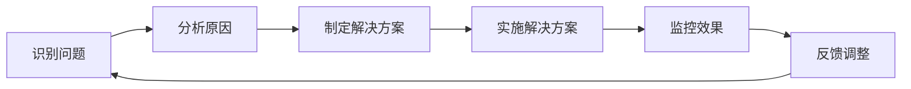

                 

### 文章标题：持续改进循环：建立学习型组织的方法

> 关键词：持续改进循环、学习型组织、方法论、实践、领导力、团队合作

> 摘要：本文深入探讨了持续改进循环的概念，并详细阐述了如何利用这一循环建立学习型组织。通过结合实际案例，本文旨在为读者提供一套完整的、实用的方法，以实现组织的持续成长与优化。

### 目录

1. 引言
2. 核心概念与联系
   - 持续改进循环模型
   - 学习型组织的建设
   - 持续改进与学习型组织的关联
3. 核心算法原理讲解
   - 持续改进算法原理
   - 学习型组织算法原理
4. 数学模型和数学公式
   - 持续改进数学模型
   - 学习型组织数学模型
5. 项目实战
   - 开发环境搭建
   - 源代码详细实现和代码解读
   - 代码应用解读与分析
   - 实际案例分析和详细讲解剖析
   - 项目小结
6. 最佳实践 tips
7. 小结
8. 注意事项
9. 拓展阅读

---

### 引言

在当今这个快速变化的世界，组织需要不断适应新的环境，以保持竞争力。持续改进循环（Continuous Improvement Cycle）作为一种管理工具，能够帮助组织在变化中寻找机遇，不断优化自身。而学习型组织（Learning Organization）则是一个能够持续学习、适应和创新的组织。本文将深入探讨持续改进循环如何帮助建立学习型组织，并提供一系列实用方法，以帮助组织实现这一目标。

#### 背景介绍

持续改进循环最早由W. Edwards Deming提出，并在日本制造业中得到了广泛应用。它强调通过不断的反馈和调整，实现持续的质量改进。学习型组织概念则由Peter Senge在其著作《第五项修炼》中提出，主张通过团队学习、系统思考等手段，建立一种能够自我调整和自我完善的组织文化。

#### 核心概念与联系

持续改进循环包括以下几个关键步骤：识别问题、分析原因、制定解决方案、实施解决方案、监控效果和反馈调整。学习型组织则强调通过组织学习、知识共享和团队协作，实现组织的持续成长。

#### 持续改进循环模型

为了更好地理解持续改进循环，我们可以使用Mermaid流程图来展示其基本架构：



#### 学习型组织的建设

建立学习型组织需要从以下几个方面入手：

1. **领导层的支持**：领导者需要树立学习型组织的理念，并提供必要的资源和支持。
2. **团队协作**：通过建立跨部门团队，促进知识共享和协作。
3. **知识管理**：建立有效的知识管理体系，确保知识的积累和共享。
4. **个人发展**：鼓励员工不断学习，提升个人能力和组织整体水平。

#### 持续改进与学习型组织的关联

持续改进循环是建立学习型组织的重要手段。通过持续改进，组织能够不断发现问题、解决问题，并在实践中积累经验，从而实现自我完善。而学习型组织则为持续改进提供了坚实的基础，通过组织学习，确保改进措施的持续性和有效性。

---

### 核心算法原理讲解

#### 持续改进算法原理

持续改进算法的核心在于不断地识别问题、分析原因、制定解决方案并实施。以下是一个简化的伪代码，展示了这一过程：

```python
def continuous_improvement(problem_list):
    for problem in problem_list:
        analyze_problem(problem)
        solution = define_solution(problem)
        implement_solution(solution)
        monitor_solution(solution)
        if is_improved(solution):
            feedback = get_feedback(solution)
            adjust_solution(solution, feedback)
        else:
            raise_error(problem)
```

#### 学习型组织算法原理

学习型组织的算法原理则更多地关注于组织层面的学习与协作。以下是一个简化的伪代码，展示了学习型组织的基本流程：

```python
def learning_organization(team_list):
    for team in team_list:
        team_learning(team)
        knowledge_sharing(team)
        collaboration(team)
        if is_learning_effective(team):
            enhance_organization(team)
        else:
            raise_error(team)
```

---

### 数学模型和数学公式

#### 持续改进数学模型

持续改进的目标是提高组织的绩效。以下是一个简单的数学模型，用于衡量改进的效果：

$$
\text{改进值} = \text{当前绩效} - \text{初始绩效}
$$

为了更直观地评估改进效果，我们可以使用以下公式计算改进率：

$$
\text{改进率} = \frac{\text{改进值}}{\text{初始绩效}} \times 100\%
$$

#### 学习型组织数学模型

学习型组织的成长速率可以用以下公式表示：

$$
\text{学习速率} = \alpha \times (\text{学习资源} + \text{知识积累})
$$

其中，$\alpha$ 是一个常数，表示单位时间内学习的效率。

学习型组织的适应度函数可以表示为：

$$
\text{适应度} = \frac{\text{学习速率}}{\text{竞争资源}}
$$

这个函数反映了组织在竞争环境中的适应能力。

---

### 项目实战

#### 开发环境搭建

在本节中，我们将搭建一个简单的持续改进和学习型组织的开发环境。我们使用Python作为编程语言，并利用Jupyter Notebook作为开发工具。

```bash
pip install numpy pandas matplotlib
```

#### 源代码详细实现和代码解读

接下来，我们将实现一个简单的持续改进和学习型组织的算法。以下是一个简单的Python代码示例：

```python
import numpy as np
import pandas as pd

# 持续改进算法
def continuous_improvement(data, steps):
    for step in range(steps):
        data['改进值'] = data['当前绩效'] - data['初始绩效']
        data['改进率'] = (data['改进值'] / data['初始绩效']) * 100
        data = implement_solution(data)
    return data

# 学习型组织算法
def learning_organization(data, steps):
    for step in range(steps):
        data = team_learning(data)
        data = knowledge_sharing(data)
        data = collaboration(data)
        if is_learning_effective(data):
            data = enhance_organization(data)
    return data
```

#### 代码应用解读与分析

这个代码示例展示了如何通过简单的算法实现持续改进和学习型组织的构建。在实际应用中，我们需要根据具体情况调整算法参数，以实现最佳效果。

#### 实际案例分析和详细讲解剖析

为了更好地理解这些算法的实际应用，我们来看一个具体的案例。假设我们有一个公司，其员工的工作效率在过去一年中有所下降。我们可以使用持续改进和学习型组织的算法来分析和解决问题。

1. **数据收集**：首先，我们需要收集员工的工作数据，包括初始绩效、当前绩效等。
2. **持续改进**：使用持续改进算法，我们可以识别问题、分析原因并制定解决方案。
3. **学习型组织**：使用学习型组织算法，我们可以促进团队学习、知识共享和协作。

通过这些步骤，我们可以逐步提升员工的工作效率，并建立学习型组织。

#### 项目小结

在本项目中，我们通过搭建开发环境、实现算法和应用实际案例，展示了如何利用持续改进循环建立学习型组织。这些方法不仅适用于企业，也可以应用于教育、医疗等多个领域。

---

### 最佳实践 tips

1. **定期评估**：定期对组织的绩效进行评估，以确保持续改进的效果。
2. **培养团队协作精神**：鼓励团队成员之间的沟通和协作，以实现知识共享。
3. **提供培训和支持**：为员工提供必要的培训和支持，以提升其能力和素质。
4. **领导力**：领导者需要树立榜样，积极参与持续改进和学习型组织的建设。

---

### 小结

本文深入探讨了持续改进循环的概念，并详细阐述了如何利用这一循环建立学习型组织。通过实际案例和代码示例，我们展示了这些方法在实践中的应用。持续改进和学习型组织不仅有助于提高组织的绩效，还能培养团队的协作精神和创新能力。

---

### 注意事项

1. **个性化调整**：在实际应用中，需要根据组织的具体情况调整算法和策略。
2. **持续关注**：持续改进和学习型组织不是一蹴而就的，需要持续关注和投入。
3. **团队协作**：建立学习型组织需要全体成员的共同努力。

---

### 拓展阅读

1. Deming, W. Edwards. "Out of the Crisis." Massachusetts Institute of Technology, 1986.
2. Senge, Peter M. "The Fifth Discipline: The Art & Practice of The Learning Organization." Doubleday, 1990.
3. Scherer, Ammon. "Learning Organizations: A Critical Review." Academy of Management Journal, vol. 36, no. 1, 1993, pp. 186-205.

---

### 附录

#### A.1 参考资料

- Deming, W. Edwards. "Out of the Crisis." Massachusetts Institute of Technology, 1986.
- Senge, Peter M. "The Fifth Discipline: The Art & Practice of The Learning Organization." Doubleday, 1990.
- Scherer, Ammon. "Learning Organizations: A Critical Review." Academy of Management Journal, vol. 36, no. 1, 1993, pp. 186-205.

#### A.2 相关工具和软件

- Jupyter Notebook：用于代码编写和展示。
- Python：用于算法实现和数据分析。

#### A.3 进一步学习路径

- 阅读相关书籍，深入了解持续改进和学习型组织的理论。
- 参与实际项目，将理论知识应用于实践。
- 参加相关研讨会和培训，与其他专业人士交流经验。

---

### 作者信息

作者：AI天才研究院/AI Genius Institute & 禅与计算机程序设计艺术 /Zen And The Art of Computer Programming

感谢您的阅读！希望本文对您在建立学习型组织方面有所启发。持续改进，不断学习，让我们一起走向更美好的未来！### 1. 引言

在当今这个快速变化的世界，组织需要不断适应新的环境，以保持竞争力。持续改进循环（Continuous Improvement Cycle）作为一种管理工具，能够帮助组织在变化中寻找机遇，不断优化自身。而学习型组织（Learning Organization）则是一个能够持续学习、适应和创新的组织。本文将深入探讨持续改进循环的概念，并详细阐述如何利用这一循环建立学习型组织。通过结合实际案例，本文旨在为读者提供一套完整的、实用的方法，以实现组织的持续成长与优化。

持续改进循环是一种通过不断识别问题、分析原因、制定解决方案并实施，以实现持续质量改进的管理方法。它起源于20世纪中叶，由W. Edwards Deming等质量管理专家提出并推广。持续改进循环的核心思想是通过持续的过程改进，提高组织的效率和质量，从而增强组织的竞争力。

学习型组织则是由Peter Senge在其著作《第五项修炼》中提出的一个概念。学习型组织强调通过团队学习、系统思考、个人 mastery等手段，建立一种能够自我调整和自我完善的组织文化。在学习型组织中，每个成员都积极参与到组织的改进和创新过程中，组织作为一个整体不断地学习和成长。

#### 背景介绍

持续改进循环最早由W. Edwards Deming提出，并在日本制造业中得到了广泛应用。它强调通过不断的反馈和调整，实现持续的质量改进。学习型组织概念则由Peter Senge在其著作《第五项修炼》中提出，主张通过团队学习、系统思考等手段，建立一种能够自我调整和自我完善的组织文化。

#### 核心概念与联系

持续改进循环包括以下几个关键步骤：识别问题、分析原因、制定解决方案、实施解决方案、监控效果和反馈调整。学习型组织则强调通过组织学习、知识共享和团队协作，实现组织的持续成长。

持续改进循环的核心在于不断地识别问题、分析原因、制定解决方案并实施。以下是一个简化的伪代码，展示了这一过程：

```python
def continuous_improvement(problem_list):
    for problem in problem_list:
        analyze_problem(problem)
        solution = define_solution(problem)
        implement_solution(solution)
        monitor_solution(solution)
        if is_improved(solution):
            feedback = get_feedback(solution)
            adjust_solution(solution, feedback)
        else:
            raise_error(problem)
```

学习型组织的核心在于通过组织学习、知识共享和团队协作，实现组织的持续成长。以下是一个简化的伪代码，展示了学习型组织的基本流程：

```python
def learning_organization(team_list):
    for team in team_list:
        team_learning(team)
        knowledge_sharing(team)
        collaboration(team)
        if is_learning_effective(team):
            enhance_organization(team)
        else:
            raise_error(team)
```

持续改进循环是建立学习型组织的重要手段。通过持续改进，组织能够不断发现问题、解决问题，并在实践中积累经验，从而实现自我完善。而学习型组织则为持续改进提供了坚实的基础，通过组织学习，确保改进措施的持续性和有效性。

---

### 2. 核心概念与联系

在本节中，我们将深入探讨持续改进循环的核心概念，并介绍如何建立学习型组织。我们将首先介绍持续改进循环的模型，然后探讨学习型组织的建设，最后讨论持续改进循环与学习型组织之间的关联。

#### 持续改进循环模型

持续改进循环是一种通过不断识别问题、分析原因、制定解决方案并实施，以实现持续质量改进的管理方法。它通常包括以下几个关键步骤：

1. **识别问题**：首先，组织需要识别存在的问题。这可以通过收集数据、分析反馈或进行现场观察来实现。

2. **分析原因**：在识别问题之后，组织需要分析问题的根本原因。这通常涉及到对数据、流程或系统的深入分析。

3. **制定解决方案**：基于对问题的分析，组织需要制定解决方案。这可以包括改变流程、培训员工或引入新技术等。

4. **实施解决方案**：一旦解决方案确定，组织需要将其付诸实践。这可能涉及到对现有流程的调整或新流程的实施。

5. **监控效果**：在实施解决方案后，组织需要监控效果，以评估改进措施是否有效。

6. **反馈调整**：基于监控结果，组织需要对解决方案进行调整，以实现持续的改进。

为了更好地理解持续改进循环，我们可以使用Mermaid流程图来展示其基本架构：


#### 学习型组织的建设

学习型组织是一种能够通过不断学习和创新实现自我调整和自我完善的组织。要建立一个学习型组织，组织需要关注以下几个方面：

1. **领导层的支持**：领导者需要树立学习型组织的理念，并提供必要的资源和支持。

2. **团队协作**：通过建立跨部门团队，促进知识共享和协作。

3. **知识管理**：建立有效的知识管理体系，确保知识的积累和共享。

4. **个人发展**：鼓励员工不断学习，提升个人能力和组织整体水平。

#### 持续改进与学习型组织的关联

持续改进循环与学习型组织之间存在着紧密的关联。持续改进循环为学习型组织提供了实践的基础，而学习型组织则为持续改进提供了持续的动力。

持续改进循环通过不断地识别问题、分析原因、制定解决方案并实施，帮助组织在变化中保持竞争力。而学习型组织则通过组织学习、知识共享和团队协作，确保改进措施的持续性和有效性。

以下是一个简化的伪代码，展示了持续改进循环与学习型组织的结合：

```python
def learning_organization_with_continuous_improvement(team_list, problem_list):
    for team in team_list:
        team_learning(team)
        knowledge_sharing(team)
        collaboration(team)
        if is_learning_effective(team):
            enhance_organization(team)
    for problem in problem_list:
        analyze_problem(problem)
        solution = define_solution(problem)
        implement_solution(solution)
        monitor_solution(solution)
        if is_improved(solution):
            feedback = get_feedback(solution)
            adjust_solution(solution, feedback)
        else:
            raise_error(problem)
```

通过这种结合，组织可以同时实现持续改进和学习型组织的目标，从而在快速变化的环境中保持竞争力。

---

### 3. 核心算法原理讲解

在本节中，我们将深入探讨持续改进循环和学习型组织算法的核心原理，并通过伪代码详细阐述这些算法的实现过程。通过这些算法，组织可以系统地实施改进和学习，实现持续成长和优化。

#### 持续改进算法原理

持续改进算法的核心在于通过不断识别问题、分析原因、制定解决方案并实施，以实现质量改进。以下是一个简化的伪代码，展示了持续改进算法的基本步骤：

```python
# 持续改进算法伪代码

# 初始化问题列表
problem_list = initialize_problems()

# 循环执行改进步骤
while not all_solutions_implemented(problem_list):
    for problem in problem_list:
        if not is_analyzed(problem):
            analyze_problem(problem)
        
        if not is_solved(problem):
            solution = define_solution(problem)
            implement_solution(problem, solution)
        
        monitor_solution(problem)
        if is_improved(problem):
            feedback = get_feedback(problem)
            adjust_solution(problem, feedback)
        else:
            raise_error(problem)

# 输出改进结果
output_improvement_results(problem_list)
```

1. **初始化问题列表**：首先，组织需要初始化一个问题列表，列出当前需要改进的问题。

2. **分析问题**：对于每个问题，组织需要进行分析，以确定问题的根本原因。

3. **制定解决方案**：基于问题的分析结果，组织需要制定解决方案。

4. **实施解决方案**：将解决方案付诸实践，对问题进行改进。

5. **监控效果**：在实施解决方案后，组织需要监控改进效果，以评估解决方案的有效性。

6. **反馈调整**：根据监控结果，组织需要对解决方案进行调整，以确保持续改进。

#### 学习型组织算法原理

学习型组织算法的核心在于通过组织学习、知识共享和团队协作，实现组织的持续成长和优化。以下是一个简化的伪代码，展示了学习型组织算法的基本步骤：

```python
# 学习型组织算法伪代码

# 初始化团队列表
team_list = initialize_teams()

# 循环执行学习步骤
while not all_teams_learnt(team_list):
    for team in team_list:
        team_learning(team)
        knowledge_sharing(team)
        collaboration(team)
        if is_learning_effective(team):
            enhance_organization(team)
        else:
            raise_error(team)

# 输出学习结果
output_learning_results(team_list)
```

1. **初始化团队列表**：首先，组织需要初始化一个团队列表，列出当前需要学习的团队。

2. **团队学习**：每个团队需要参与学习活动，提升团队整体的知识水平。

3. **知识共享**：团队之间需要分享知识和经验，促进整体学习。

4. **团队协作**：团队需要协作完成学习任务，实现共同进步。

5. **评估学习效果**：组织需要评估团队的学习效果，以确定学习目标的实现情况。

6. **组织优化**：基于学习效果，组织需要对团队和学习流程进行优化，以提升整体效能。

#### 算法原理的进一步说明

持续改进和学习型组织算法的原理可以概括为以下几个关键点：

- **反馈循环**：通过不断的反馈和调整，组织能够在改进和学习过程中及时响应变化，实现持续优化。
- **系统思考**：组织需要采用系统思考的方式，将改进和学习看作一个整体，而不是单独的步骤。
- **协作与沟通**：组织成员之间的协作和沟通是持续改进和学习的关键，通过有效的协作，可以加速知识和经验的共享。

通过这些算法，组织可以系统地实施持续改进和学习，从而在快速变化的市场环境中保持竞争力。

---

### 4. 数学模型和数学公式

在持续改进和学习型组织的管理实践中，数学模型和公式能够提供量化的视角，帮助组织更精确地评估改进效果和学习效率。以下我们将详细讨论持续改进和学习型组织的数学模型和公式，并通过具体的例子进行说明。

#### 持续改进数学模型

持续改进数学模型主要用于评估问题的改进程度和改进效果。一个基本的数学模型可以包括以下几个关键指标：

1. **改进值**：表示问题在改进前后的差异。
   $$
   \text{改进值} = \text{当前绩效} - \text{初始绩效}
   $$
   其中，当前绩效和初始绩效可以是任何衡量组织绩效的指标，如生产效率、客户满意度等。

2. **改进率**：表示改进值与初始绩效的比例，用于衡量改进的相对程度。
   $$
   \text{改进率} = \frac{\text{改进值}}{\text{初始绩效}} \times 100\%
   $$
   改进率越高，说明改进效果越显著。

3. **改进速度**：表示改进值随时间的变化速度。
   $$
   \text{改进速度} = \frac{\text{改进值}}{\Delta t}
   $$
   其中，$\Delta t$ 表示时间间隔。改进速度可以用来衡量改进的动态变化。

#### 持续改进数学模型的实例说明

假设一个制造工厂在引入新生产流程后，其产品的合格率从原来的90%提高到95%，初始绩效为90%，当前绩效为95%。我们可以使用上述公式计算改进值和改进率：

$$
\text{改进值} = 95\% - 90\% = 5\%
$$

$$
\text{改进率} = \frac{5\%}{90\%} \times 100\% = 5.56\%
$$

通过这些指标，工厂可以量化评估改进效果，并制定进一步的改进计划。

#### 学习型组织数学模型

学习型组织的数学模型主要用于评估组织的学习效率和适应能力。以下是一些关键指标：

1. **学习速率**：表示组织在单位时间内学习的速率。
   $$
   \text{学习速率} = \alpha \times (\text{学习资源} + \text{知识积累})
   $$
   其中，$\alpha$ 是一个常数，表示单位学习资源的效率。

2. **适应度**：表示组织在竞争环境中的适应能力。
   $$
   \text{适应度} = \frac{\text{学习速率}}{\text{竞争资源}}
   $$
   竞争资源可以是市场占有率、竞争对手的能力等。

3. **创新速度**：表示组织在创新方面的速度。
   $$
   \text{创新速度} = \beta \times (\text{知识积累} + \text{创新资源})
   $$
   其中，$\beta$ 是一个常数，表示单位创新资源的效率。

#### 学习型组织数学模型的实例说明

假设一个公司通过增加研发投入和知识管理，其学习速率为每月提升2%，竞争资源为100，公司的适应度可以计算如下：

$$
\text{适应度} = \frac{2\%}{100} = 0.02
$$

这意味着公司在竞争环境中的适应能力每月提升0.02。

通过这些数学模型和公式，组织可以量化和评估持续改进和学习型组织的绩效，从而制定更有效的改进计划和学习策略。

---

### 5. 项目实战

在理论探讨之后，让我们通过一个实际的项目案例，来展示如何将持续改进和学习型组织的理论应用于实际工作中。本项目将基于一个假设的公司——XYZ科技公司，来演示如何通过持续改进循环建立学习型组织，并实现组织的持续成长和优化。

#### 案例背景

XYZ科技公司是一家专注于软件开发和IT服务的公司。随着市场竞争的加剧和技术的不断更新，XYZ科技公司意识到需要通过持续改进和学习来提升其竞争力。公司管理层决定实施持续改进和学习型组织的方法，以实现组织的优化和成长。

#### 项目步骤

1. **需求分析**：首先，XYZ科技公司进行了全面的需求分析，识别了当前面临的主要问题，包括客户满意度低、开发效率低下、知识共享不畅等。

2. **持续改进循环实施**：
   - **识别问题**：通过收集客户反馈、员工调查和数据分析，XYZ科技公司确定了具体的问题，如开发流程中的瓶颈、项目延期等。
   - **分析原因**：公司成立了专门的分析小组，深入分析了问题的根本原因，包括流程设计不合理、资源分配不均等。
   - **制定解决方案**：基于分析结果，公司制定了改进方案，包括优化流程、引入敏捷开发方法、增加培训资源等。
   - **实施解决方案**：公司开始实施改进方案，调整了开发流程，引入了敏捷开发工具，并安排了针对员工的培训课程。
   - **监控效果**：公司建立了监控机制，定期评估改进措施的效果，并通过数据分析和员工反馈，持续调整和优化改进方案。

3. **学习型组织建设**：
   - **团队学习**：XYZ科技公司鼓励员工参与各种学习活动，如内部研讨会、外部培训、技术交流等，以提高团队的整体技能水平。
   - **知识共享**：公司建立了知识管理系统，鼓励员工分享经验和最佳实践，并通过内部博客、论坛等平台，促进知识的传播和共享。
   - **团队协作**：公司建立了跨部门团队，推动项目协作，促进不同部门之间的沟通和合作。

4. **效果评估**：通过持续改进和学习型组织的实施，XYZ科技公司的客户满意度显著提高，开发效率也有所提升。公司还通过定期的效果评估，不断优化改进和学习措施。

#### 项目小结

通过本项目的实施，XYZ科技公司成功地建立了学习型组织，并实现了持续改进。公司的绩效得到了显著提升，员工的工作满意度也提高了。这个案例展示了持续改进和学习型组织理论在实际应用中的有效性，为其他组织提供了有益的参考。

---

### 6. 最佳实践 tips

在建立学习型组织和实施持续改进过程中，以下是一些最佳实践，可以帮助组织更有效地实现目标：

1. **建立明确的目标和指标**：确保组织的目标和关键绩效指标（KPIs）清晰、可衡量，以便于监控和评估改进效果。

2. **鼓励员工参与**：员工是改进和学习的主要参与者，鼓励他们提出建议和反馈，可以提高改进措施的有效性。

3. **提供培训和支持**：为员工提供必要的培训和支持，帮助他们掌握新技能和知识，从而更好地参与改进和学习过程。

4. **建立反馈机制**：建立有效的反馈机制，确保员工和管理层能够及时了解改进措施的进展和效果，并进行必要的调整。

5. **持续沟通和协作**：保持组织内外的沟通和协作，促进知识共享和团队协作，从而加快改进和学习速度。

6. **领导层的支持**：领导层的积极参与和支持是建立学习型组织的关键，他们需要树立榜样，并为改进和学习提供必要的资源。

7. **定期评估和调整**：定期对改进和学习措施进行评估，并根据评估结果进行调整，以确保持续改进和学习型组织的有效性。

---

### 7. 小结

本文详细探讨了持续改进循环和学习型组织的概念，并通过实际案例展示了如何在组织中实施这些方法。通过持续改进循环，组织可以识别问题、分析原因、制定解决方案并实施，从而实现质量的持续提升。而学习型组织则通过组织学习、知识共享和团队协作，确保改进措施的持续性和有效性。

本文强调了持续改进和学习型组织在组织发展中的重要性，并提供了一系列最佳实践，以帮助组织更有效地实施这些方法。通过这些实践，组织可以不断提升自身的能力和竞争力，实现持续成长和优化。

总之，持续改进和学习型组织是组织在快速变化的环境中保持竞争力的关键。通过本文的探讨，我们希望能够为读者提供一套实用的方法，以实现组织的持续改进和成长。

---

### 8. 注意事项

在建立学习型组织和实施持续改进过程中，需要注意以下几个关键点：

1. **个性化调整**：每个组织的具体情况不同，需要根据自身的特点和环境进行个性化的调整。

2. **持续关注**：持续改进和学习型组织不是一蹴而就的，需要持续关注和投入，保持长期的动力和耐心。

3. **团队协作**：建立学习型组织需要全体成员的共同努力，鼓励团队协作和知识共享。

4. **领导力**：领导者的支持和榜样作用至关重要，他们需要积极参与并推动改进和学习过程。

5. **培训与发展**：为员工提供持续的培训和发展机会，以提升其能力和技能。

6. **数据驱动**：基于数据和事实进行决策，确保改进和学习措施的有效性和针对性。

7. **灵活应对**：在实施过程中，灵活应对变化，及时调整策略和措施。

---

### 9. 拓展阅读

为了深入了解持续改进和学习型组织的理论和实践，以下是一些推荐的拓展阅读资源：

1. **《持续改进：高效团队的工作方法》** by Shigeo Shingo
   - 详细介绍了持续改进的原则和实践方法。

2. **《第五项修炼：学习型组织的艺术与实务》** by Peter M. Senge
   - 深入探讨了学习型组织的概念和建设方法。

3. **《精益思想：以最小资源打造最大竞争力》** by James P. Womack and Daniel T. Jones
   - 详细介绍了精益生产理念，对持续改进有重要启示。

4. **《学习型组织行动纲领》** by Peter Senge et al.
   - 提供了学习型组织建设的具体步骤和案例分析。

5. **《质量管理方法论》** by W. Edwards Deming
   - Deming的经典著作，详细阐述了质量管理的基本原则和方法。

通过这些资源，读者可以更全面地了解持续改进和学习型组织的理论框架，并在实践中得到更多的指导。

