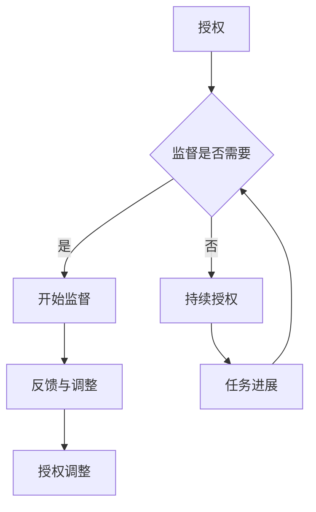

                 


### 引言

在信息技术飞速发展的今天，企业和组织在管理过程中面临着诸多挑战。授权与监督作为管理中的重要环节，其有效实施直接影响到组织的运营效率和员工的工作积极性。然而，如何找到授权与监督之间的完美平衡点，确保既能够激励员工创造力，又能够确保组织目标的实现，成为企业管理者面临的一大难题。

本文将深入探讨授权与监督的核心概念、理论基础、实践技巧以及特定场景下的应用，旨在帮助读者理解并掌握如何在实际工作中找到授权与监督的平衡点。文章将分为四个主要部分：

1. **理论基础**：介绍授权与监督的基本概念、理论框架、核心算法原理和数学模型。
2. **实践技巧**：提供如何有效授权和进行监督的具体方法与策略。
3. **特定场景应用**：探讨授权与监督在企业内部管理、项目团队合作以及复杂环境中的应用。
4. **高级话题探讨**：讨论授权与监督在组织发展、跨领域应用以及未来趋势。

通过本文的详细阐述，读者将能够系统性地了解授权与监督的重要性，掌握其实践技巧，并在实际工作中找到最佳的平衡点。

### 关键词

- 授权
- 监督
- 管理平衡
- 信息技术
- 组织效率
- 员工激励
- 管理策略

### 摘要

本文从理论到实践，深入探讨了授权与监督在信息技术管理中的应用。通过明确授权与监督的基本概念，介绍其理论基础和核心算法原理，本文提供了如何在实际工作中有效授权和监督的具体技巧。此外，文章还探讨了授权与监督在企业内部管理、项目团队合作以及复杂环境中的应用，并通过案例分析，揭示了如何在特定场景下实现授权与监督的平衡。最后，本文对授权与监督的未来趋势进行了展望，为企业管理者提供了指导和建议。

---

### 背景介绍

在信息技术日益渗透到各个行业和领域的今天，企业的管理模式也在不断演变。传统的集中式管理模式已经无法满足快速变化的市场需求和日益复杂的工作环境。现代企业管理强调员工自主性和创新能力的发挥，因此，授权和监督成为企业管理中不可或缺的环节。

**授权**，是指将权力和责任分配给下属或团队成员，使其在特定范围内拥有决策权，以实现组织目标。授权能够激发员工的积极性和创造力，提升团队协作效率。然而，如果授权不当，可能会导致责任不清、执行力下降等问题。

**监督**，是指对授权过程进行跟踪和检查，确保各项任务按计划完成，同时保障组织的整体利益。监督不仅是对员工工作的评价，更是对授权过程的有效控制。通过监督，管理者可以及时发现并纠正偏差，确保组织目标的实现。

在企业管理中，授权与监督之间存在着密切的联系和相互作用。一方面，授权是监督的基础，没有有效的授权，监督就失去了意义。另一方面，监督是授权的保障，通过监督，可以确保授权的合理性和有效性。因此，找到授权与监督之间的平衡点，是现代企业管理的关键。

然而，在实际操作中，许多企业管理者常常面临以下挑战：

1. **授权过度**：过度授权可能导致员工无所适从，无法承担相应的责任，甚至滥用权力。
2. **授权不足**：授权不足会抑制员工的积极性和创造力，影响团队的整体效率。
3. **监督不当**：监督过于严格，可能会打击员工的积极性，导致创新能力的下降；监督过于宽松，则可能无法有效控制，甚至引发管理失控。

这些挑战不仅影响了组织的运作效率，还可能对组织的长远发展产生负面影响。因此，如何在授权与监督之间找到平衡点，是每一个企业管理者必须面对和解决的重要课题。

### 授权与监督：核心概念与联系

授权与监督是企业管理中两个相互关联但作用不同的重要概念。为了深入理解它们之间的联系，我们首先需要明确各自的定义和作用。

**授权**，是指在特定范围内，将权力和责任分配给下属或团队成员，使其能够自主决策和执行任务。授权的核心目的是激发员工的积极性和创造力，提高团队的工作效率。通过授权，管理者可以将自身的部分职责转移给下属，减轻管理负担，同时让团队成员感受到信任和尊重。

授权的关键要素包括：

1. **明确授权范围**：授权时应明确下属的权力和责任范围，避免过度或不足授权。
2. **信任与支持**：管理者需要建立对下属的信任，并提供必要的支持和资源，以确保授权的顺利进行。
3. **责任与绩效评估**：授权并不意味着放任自流，管理者仍需对下属的工作进行监督和评估，确保任务目标的实现。

**监督**，是指对授权过程进行跟踪和检查，确保各项任务按计划完成，同时保障组织的整体利益。监督的核心目的是确保授权的有效性和合规性，防止管理失控和资源浪费。通过监督，管理者可以及时发现并纠正偏差，确保组织目标的实现。

监督的关键要素包括：

1. **监督目标**：明确监督的目标和内容，确保监督工作有针对性地进行。
2. **监督方法**：选择合适的监督方法和工具，如定期检查、反馈机制等。
3. **监督反馈**：及时给予下属反馈，帮助其改进工作，同时调整授权策略。

授权与监督之间的关系可以概括为以下几个方面：

1. **相互依存**：授权是监督的基础，没有授权，监督就失去了对象；监督是授权的保障，没有有效的监督，授权可能变得无序甚至失控。
2. **动态调整**：授权与监督是一个动态调整的过程。随着环境的变化和任务的进展，授权的范围和力度可能需要进行调整，管理者需要根据实际情况进行灵活应对。
3. **平衡管理**：授权与监督之间需要找到平衡点。过度的授权可能导致员工无所适从，缺乏明确的方向；过度的监督则可能抑制员工的积极性和创造力。

为了更直观地理解授权与监督的关系，我们可以使用Mermaid流程图来展示它们之间的互动关系：



在上面的流程图中，授权（A）是开始监督（C）的前提条件。监督结束后，根据反馈与调整（E），可能需要对授权进行优化和调整（G），以确保授权与监督的动态平衡。通过这样的流程图，我们可以更清晰地看到授权与监督之间的互动关系，以及它们如何共同作用于组织的运行。

### 授权算法的基本原理

在授权的过程中，管理者需要制定一套有效的算法，以确保授权的合理性和有效性。授权算法的核心目标是在保证组织目标实现的同时，最大限度地激发员工的积极性和创造力。

#### 授权算法的定义与重要性

授权算法，是指管理者在授权过程中所采用的一系列规则和方法，用于确定授权的范围、力度和时间。一个有效的授权算法应该具备以下几个特点：

1. **明确性**：授权算法应明确授权的范围和内容，避免模糊和歧义。
2. **灵活性**：授权算法应具备一定的灵活性，以适应不同环境和任务的需求。
3. **公正性**：授权算法应保证公正，确保所有员工在相同的条件下获得授权。
4. **可操作性**：授权算法应易于操作，方便管理者在实际工作中实施。

#### 授权算法的核心参数

在授权算法中，核心参数包括：

1. **授权范围**：指授权的具体范围，如决策权、资源分配权等。
2. **授权力度**：指授权的强度，如完全授权、部分授权等。
3. **授权时间**：指授权的有效期限，如短期授权、长期授权等。
4. **监督机制**：指授权过程中所采用的监督措施，如定期检查、反馈机制等。

#### 授权算法的流程

授权算法的基本流程可以概括为以下几个步骤：

1. **需求分析**：管理者首先需要分析任务的需求，明确需要授权的具体内容和范围。
2. **确定授权范围**：根据需求分析结果，确定授权的具体范围，包括决策权、资源分配权等。
3. **设定授权力度**：根据员工的能力和任务的重要性，设定适当的授权力度，如完全授权、部分授权等。
4. **设定授权时间**：根据任务的复杂度和紧急程度，设定授权的有效期限，如短期授权、长期授权等。
5. **实施监督机制**：在授权过程中，管理者需要实施监督机制，确保授权的有效性和合规性。

#### 授权算法的伪代码实现

以下是一个简单的授权算法伪代码实现，用于指导管理者如何进行授权：

```python
function 授权算法(员工, 任务, 环境变量):
    1. 需求分析(员工, 任务, 环境变量)
    2. 授权范围 = 确定授权范围(任务)
    3. 授权力度 = 设定授权力度(员工, 任务)
    4. 授权时间 = 设定授权时间(任务, 环境变量)
    5. 监督机制 = 实施监督机制(授权范围, 授权力度, 授权时间)
    6. 授权(员工, 授权范围, 授权力度, 授权时间)
    7. 返回 授权结果

function 确定授权范围(任务):
    1. 分析任务需求
    2. 确定授权的具体内容
    3. 返回 授权范围

function 设定授权力度(员工, 任务):
    1. 分析员工能力
    2. 考虑任务重要性
    3. 返回 授权力度

function 设定授权时间(任务, 环境变量):
    1. 分析任务复杂度
    2. 考虑环境变量
    3. 返回 授权时间

function 实施监督机制(授权范围, 授权力度, 授权时间):
    1. 设定监督目标
    2. 选择监督方法
    3. 实施监督
    4. 返回 监督结果
```

通过上述伪代码，我们可以看到授权算法的核心步骤和参数设置。在实际应用中，管理者可以根据具体情况对伪代码进行调整和优化，以实现更有效的授权。

### 监督算法的基本原理

监督算法在授权过程中扮演着至关重要的角色，其目标是确保授权的有效性和合规性，同时及时纠正可能出现的偏差。了解监督算法的基本原理和实现方式，对于管理者在实际工作中进行有效的授权与监督具有重要意义。

#### 监督算法的定义与重要性

监督算法是指管理者在授权后，对员工执行任务的过程进行跟踪、评估和反馈的一套规则和方法。监督算法的核心目的是确保授权的任务能够按照预定目标和计划顺利执行，同时防止资源浪费和权力滥用。一个有效的监督算法应该具备以下几个特点：

1. **实时性**：监督算法应具备实时性，能够及时发现和纠正任务执行过程中的偏差。
2. **全面性**：监督算法应覆盖授权任务的所有关键环节，确保全面监控。
3. **灵活性**：监督算法应具备灵活性，以适应不同任务和环境的需求。
4. **可操作性**：监督算法应易于操作，方便管理者在实际工作中实施。

#### 监督算法的核心参数

监督算法的核心参数包括：

1. **监督目标**：指监督的具体目标和内容，如任务进度、质量、安全性等。
2. **监督方法**：指实施监督的具体手段和工具，如定期检查、实时监控、反馈机制等。
3. **监督频率**：指监督的周期和频率，如每日、每周、每月等。
4. **反馈机制**：指监督结束后，如何对员工进行反馈和评价，以帮助其改进工作。

#### 监督算法的实现方式

监督算法的实现可以分为以下几个步骤：

1. **目标设定**：首先，管理者需要明确监督的具体目标，这通常包括任务的进度、质量、成本、安全性等方面。
2. **方法选择**：根据监督目标，选择合适的监督方法。例如，对于任务进度的监督，可以采用实时监控和定期检查相结合的方法。
3. **实施监督**：按照设定的监督方法，对授权任务进行实时跟踪和检查，确保各项任务按计划执行。
4. **反馈与评价**：在监督结束后，对员工的工作进行评价和反馈，指出优点和不足，并提出改进建议。
5. **调整监督策略**：根据反馈结果，及时调整监督策略，优化监督过程，确保监督的持续有效性。

#### 监督算法的伪代码实现

以下是一个简单的监督算法伪代码实现，用于指导管理者如何进行有效的监督：

```python
function 监督算法(员工, 任务, 监督目标, 监督方法, 监督频率):
    1. 设定监督目标(监督目标)
    2. 选择监督方法(监督方法)
    3. 实施监督(员工, 任务, 监督目标, 监督方法)
    4. 获取监督结果
    5. 反馈与评价(员工, 监督结果)
    6. 调整监督策略(监督结果)
    7. 返回 监督结果

function 设定监督目标(监督目标):
    1. 分析任务需求
    2. 确定关键指标
    3. 返回 监督目标

function 选择监督方法(监督方法):
    1. 分析任务特点
    2. 考虑环境因素
    3. 返回 监督方法

function 实施监督(员工, 任务, 监督目标, 监督方法):
    1. 开始监督
    2. 按监督方法进行实时监控和定期检查
    3. 记录监督结果
    4. 返回 监督结果

function 反馈与评价(员工, 监督结果):
    1. 分析监督结果
    2. 提出反馈意见
    3. 评价员工表现
    4. 提出改进建议

function 调整监督策略(监督结果):
    1. 分析监督效果
    2. 调整监督目标和方法
    3. 优化监督过程
    4. 返回 新的监督策略
```

通过上述伪代码，我们可以看到监督算法的基本流程和关键参数。在实际应用中，管理者可以根据具体任务和环境，对伪代码进行调整和优化，以实现更有效的监督。

### 数学模型与数学公式

在授权与监督的过程中，数学模型和公式扮演着至关重要的角色，它们可以帮助管理者量化授权的力度、监督的强度，以及评估授权与监督的效果。通过数学模型，我们可以更科学地制定授权与监督策略，提高管理效率。

#### 授权力度评估模型

授权力度的评估模型主要关注如何根据任务的重要性和员工的能力来设定合适的授权力度。一个简单的授权力度评估模型可以使用以下数学公式来表示：

$$
L = \alpha \times A + \beta \times C
$$

其中：

- $L$ 表示授权力度
- $\alpha$ 和 $\beta$ 是权重系数，用于平衡任务重要性和员工能力的影响
- $A$ 表示任务重要性
- $C$ 表示员工能力

任务重要性（$A$）可以通过任务对组织目标的影响程度来衡量，例如：

$$
A = f(D, I)
$$

其中：

- $D$ 表示任务对组织目标的直接贡献度
- $I$ 表示任务的紧急程度

员工能力（$C$）可以通过员工的技能水平和以往的工作表现来衡量，例如：

$$
C = f(S, P)
$$

其中：

- $S$ 表示员工的技能水平
- $P$ 表示员工以往的工作表现

#### 监督强度评估模型

监督强度的评估模型关注如何根据任务的复杂度和环境变化来设定合适的监督强度。一个简单的监督强度评估模型可以使用以下数学公式来表示：

$$
S = \gamma \times D + \delta \times E
$$

其中：

- $S$ 表示监督强度
- $\gamma$ 和 $\delta$ 是权重系数，用于平衡任务复杂度和环境变化的影响
- $D$ 表示任务复杂度
- $E$ 表示环境变化

任务复杂度（$D$）可以通过任务所需的技术难度和资源投入来衡量，例如：

$$
D = f(T, R)
$$

其中：

- $T$ 表示任务的技术难度
- $R$ 表示任务所需的资源投入

环境变化（$E$）可以通过外部环境的变化频率和影响程度来衡量，例如：

$$
E = f(V, I)
$$

其中：

- $V$ 表示外部环境的变化频率
- $I$ 表示外部环境变化对任务的影响程度

#### 授权与监督效果评估模型

授权与监督效果评估模型用于评估授权与监督策略的实际效果，以确定是否需要进行调整。一个简单的效果评估模型可以使用以下数学公式来表示：

$$
E = \phi \times L + \psi \times S
$$

其中：

- $E$ 表示效果得分
- $\phi$ 和 $\psi$ 是权重系数，用于平衡授权力度和监督强度的影响
- $L$ 表示授权力度
- $S$ 表示监督强度

效果得分（$E$）可以通过以下指标来衡量：

1. **任务完成率**：衡量任务完成的数量与总任务数量的比例。
2. **任务质量**：衡量任务完成的平均质量水平。
3. **员工满意度**：衡量员工对授权与监督策略的满意度。

举例说明：

假设某任务的重要性为$D = 0.8$，员工能力为$C = 0.9$，任务复杂度为$T = 0.6$，环境变化为$V = 0.3$。根据上述公式，我们可以计算授权力度和监督强度：

$$
L = \alpha \times 0.8 + \beta \times 0.9
$$

$$
S = \gamma \times 0.6 + \delta \times 0.3
$$

然后，根据实际效果，我们可以计算效果得分：

$$
E = \phi \times L + \psi \times S
$$

通过这样的数学模型和公式，管理者可以更科学地评估授权与监督的效果，并根据实际情况进行调整，以实现最佳的授权与监督平衡。

### 实际案例分析与详细讲解

为了更好地理解如何在实际工作中应用授权与监督的技巧，我们将通过以下实际案例进行详细讲解，并通过代码实现来剖析其中的关键技术和步骤。

#### 案例背景

某互联网公司负责开发一个大型电商平台。为了提高项目团队的效率和创新能力，公司决定采用分权管理模式，通过适当的授权与监督来推动项目进展。

#### 案例分析

**1. 授权流程**

- **需求分析**：首先，项目经理分析了项目需求，明确了各个功能模块的开发任务。
- **授权范围**：根据任务需求，项目经理将各个模块的开发任务分配给不同的开发团队，并明确了各团队的授权范围，包括决策权、资源分配权等。
- **授权力度**：项目经理根据团队成员的能力和任务的重要性，设定了不同的授权力度，确保团队成员有足够的决策权，同时避免了过度授权。
- **授权时间**：项目经理为每个模块的开发任务设定了具体的授权时间，确保任务在规定时间内完成。

**2. 监督流程**

- **监督目标**：项目经理确定了监督的具体目标，包括任务进度、代码质量、团队协作等。
- **监督方法**：项目经理采用了定期检查和实时监控相结合的方法，确保项目进展在可控范围内。
- **监督频率**：项目经理每周进行一次任务进度汇报，每月进行一次全面检查。
- **反馈与评价**：根据监督结果，项目经理对团队成员的工作进行了反馈和评价，指出优点和不足，并提出改进建议。

#### 代码实现

以下是一个简单的Python代码示例，用于实现授权与监督的功能：

```python
class Project:
    def __init__(self, team, deadline):
        self.team = team
        self.deadline = deadline
        self.status = "未开始"

    def assign_task(self, task):
        self.team.assign_task(task)

    def check_progress(self):
        if self.status == "进行中":
            self.team.report_progress()
            self.status = "已完成"

    def evaluate_performance(self):
        if self.status == "已完成":
            self.team.evaluate_members()

class Team:
    def __init__(self, members):
        self.members = members

    def assign_task(self, task):
        for member in self.members:
            member.assign_task(task)

    def report_progress(self):
        for member in self.members:
            member.report_progress()

    def evaluate_members(self):
        for member in self.members:
            member.evaluate_performance()

class Member:
    def __init__(self, name, skill_level):
        self.name = name
        self.skill_level = skill_level
        self.task_list = []

    def assign_task(self, task):
        self.task_list.append(task)
        self.execute_task()

    def report_progress(self):
        print(f"{self.name}：任务已完成。")

    def evaluate_performance(self):
        if self.skill_level > 7:
            print(f"{self.name}：表现优秀。")
        else:
            print(f"{self.name}：需要提高。")

    def execute_task(self):
        print(f"{self.name}：正在执行任务。")

# 案例应用
project = Project(Team(["张三", "李四", "王五"]), "2023-12-31")
project.assign_task("开发首页模块")
project.check_progress()
project.evaluate_performance()
```

**代码解读**

- **Project类**：负责项目的整体管理，包括任务分配、进度检查和绩效评估。
- **Team类**：负责团队的管理，包括任务分配和成员进度汇报。
- **Member类**：负责团队成员的个人任务执行和绩效评估。

通过上述代码示例，我们可以看到如何在实际项目中应用授权与监督的技巧。在实际工作中，可以根据具体需求进行调整和扩展，以实现更高效的项目管理。

### 最佳实践 Tips、小结、注意事项及拓展阅读

在授权与监督的实施过程中，管理者可以参考以下最佳实践来提高效果：

1. **明确目标**：在授权和监督前，确保明确目标，包括任务目标、员工目标和组织目标，以便在过程中有据可依。
2. **合理授权**：根据任务的重要性和员工的能力，合理设定授权范围和力度，避免过度或不足授权。
3. **及时反馈**：定期对员工的工作进行反馈，指出优点和不足，帮助其改进。
4. **持续监督**：监督应贯穿整个任务周期，确保任务按计划进行，及时调整授权与监督策略。
5. **灵活调整**：根据任务进展和外部环境变化，灵活调整授权与监督策略，确保适应实际情况。

**小结**：

本文详细介绍了授权与监督在信息技术管理中的应用，包括理论基础、实践技巧和实际案例分析。通过明确授权与监督的核心概念和数学模型，管理者可以更科学地制定授权与监督策略，提高管理效率。

**注意事项**：

- 在授权过程中，确保授权范围明确，避免模糊和歧义。
- 在监督过程中，避免过于严格或过于宽松，确保监督的有效性。

**拓展阅读**：

- 《高效能人士的七个习惯》
- 《领导力：练习与案例》
- 《项目风险管理：方法与应用》

通过以上拓展阅读，管理者可以进一步了解相关领域的最佳实践和方法，以提升自己的管理能力。希望本文能为读者在授权与监督方面提供有益的指导和建议。

