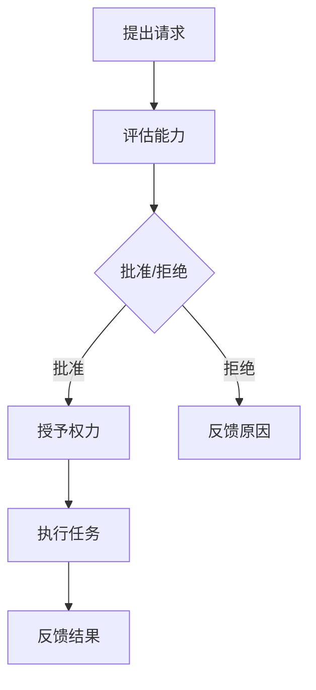

                 

# 《授权与问责：平衡自主与责任的领导艺术》

> 关键词：领导艺术，授权，问责，自主，责任，平衡

> 摘要：本文以《授权与问责：平衡自主与责任的领导艺术》一书为基础，详细探讨了领导艺术中授权与问责的关系，以及如何平衡自主与责任。文章从引言、授权、问责、平衡自主与责任、案例分析、总结与展望六个部分展开，旨在为读者提供关于领导艺术的理论和实践指导。

## 引言

领导艺术是一个广泛而深刻的话题，涵盖了从个人成长到组织发展的方方面面。在当今快速变化的社会环境中，领导艺术显得尤为重要。如何有效地授权与问责，平衡自主与责任，成为领导者在组织管理中必须面对的挑战。

### 1.1 领导艺术的背景

领导艺术的历史可以追溯到古代，但现代领导艺术的兴起主要源于20世纪中叶。当时，工业化和信息化进程的加速，使得组织结构和管理方式发生了巨大变革。传统的权威式领导模式逐渐被以授权、协作和知识管理为核心的领导模式所取代。

### 1.2 授权与问责的重要性

授权与问责是领导艺术中不可或缺的元素。授权是指领导者将决策权和管理权下放给下属，鼓励他们自主思考和行动。问责则是确保下属在获得授权后能够承担相应的责任，并对结果负责。

## 授权

授权是领导艺术的核心之一。有效的授权不仅能够提高团队的效率和创造力，还能够增强团队成员的自主性和责任感。

### 2.1 授权的定义

授权是指领导者将决策权和管理权下放给下属，让他们在一定的范围内独立决策和行动。授权的核心是信任和责任。

#### 2.1.1 授权的基本概念

授权包括以下几个方面：

1. **权力下放**：领导者将部分或全部权力下放给下属。
2. **责任承担**：下属在获得授权后，必须承担相应的责任。
3. **信任建立**：领导者需要对下属有足够的信任，让他们独立决策。
4. **监督与指导**：领导者需要对下属的工作进行监督和指导，以确保他们能够正确地执行任务。

#### 2.1.2 授权的重要性

授权的重要性体现在以下几个方面：

1. **提高团队效率**：授权可以让团队成员充分发挥自己的潜力，提高工作效率。
2. **增强团队凝聚力**：授权可以增强团队成员之间的信任和依赖，提高团队的凝聚力。
3. **激发创造力**：授权可以激发团队成员的创造力和创新精神，为组织带来新的发展机遇。

### 2.2 授权的原则

授权并不是简单的权力下放，而是需要遵循一定的原则。

#### 2.2.1 明确目标和期望

在授权之前，领导者需要明确目标和期望，确保下属知道自己的职责和任务。

#### 2.2.2 建立信任

建立信任是授权成功的关键。领导者需要信任下属，让他们在一定的范围内独立决策。

#### 2.2.3 提供必要的资源和支持

授权并不意味着领导者可以完全放手，而是需要提供必要的资源和支持，帮助下属完成任务。

### 2.3 授权的技巧

授权不仅需要遵循原则，还需要掌握一定的技巧。

#### 2.3.1 分配决策权

分配决策权是授权的核心。领导者需要根据下属的能力和职责，分配相应的决策权。

#### 2.3.2 鼓励下属自主思考

鼓励下属自主思考是提高团队创造力和效率的重要途径。领导者需要给予下属足够的自由，让他们在授权的范围内独立思考。

#### 2.3.3 掌握适当的监督与指导

监督与指导是确保授权成功的重要手段。领导者需要在适当的时机给予下属指导，帮助他们克服困难。

## 问责

问责是授权的必然结果。问责不仅是对下属工作的监督，更是对下属责任的一种体现。

### 3.1 问责的定义

问责是指领导者对下属的工作进行监督、评估和反馈，确保他们能够承担相应的责任，并对结果负责。

#### 3.1.1 问责的基本概念

问责包括以下几个方面：

1. **绩效评估**：对下属的工作进行评估，了解他们的表现。
2. **反馈与改进**：对下属的工作进行反馈，帮助他们发现问题和改进。
3. **责任追究**：对下属的工作结果负责，确保他们能够承担相应的责任。

#### 3.1.2 问责的意义

问责的意义体现在以下几个方面：

1. **确保工作质量**：问责可以确保下属的工作达到预期标准，保证工作质量。
2. **促进团队进步**：问责可以激励下属不断进步，提高团队的整体水平。
3. **维护组织秩序**：问责可以维护组织的纪律和秩序，确保组织的正常运行。

### 3.2 问责的原则

问责需要遵循一定的原则，确保其有效性和公正性。

#### 3.2.1 公平性

公平性是问责的基础。问责必须公平对待每一位下属，确保每个人都能够承担相应的责任。

#### 3.2.2 公开透明

公开透明是问责的必要条件。问责过程必须公开透明，让下属了解他们的责任和权利。

#### 3.2.3 及时性

及时性是问责的重要原则。问责必须在适当的时间进行，确保下属能够及时发现问题并进行改进。

### 3.3 问责的执行方法

问责的执行方法包括以下几个方面：

1. **设定明确的绩效指标**：设定明确的绩效指标，让下属知道他们的工作标准和要求。
2. **定期绩效评估**：定期对下属的工作进行评估，了解他们的表现。
3. **及时反馈与改进**：对下属的工作进行及时反馈，帮助他们发现问题并进行改进。

## 平衡自主与责任

在组织管理中，平衡自主与责任是领导者的核心任务。自主与责任是相互关联的，两者都需要在组织管理中得到充分的重视。

### 4.1 自主与责任的关系

自主与责任是相互依存的。自主是责任的前提，责任是自主的保障。

#### 4.1.1 自主与责任的联系

1. **自主促进责任**：自主可以提高下属的工作积极性和责任感，使他们更加愿意承担责任。
2. **责任保障自主**：责任可以保障下属的自主性，确保他们在自主决策时能够有相应的保障和支持。

#### 4.1.2 自主与责任的对立

1. **自主可能导致责任缺失**：过度自主可能导致下属忽视责任，造成工作失误。
2. **责任可能导致自主受限**：过度责任可能导致下属在决策时受到限制，影响自主性。

### 4.2 平衡自主与责任的方法

平衡自主与责任需要采取一系列方法。

#### 4.2.1 设定清晰的职责范围

设定清晰的职责范围，让下属明确自己的责任和权限，避免自主与责任的冲突。

#### 4.2.2 建立有效的沟通机制

建立有效的沟通机制，确保下属在自主决策时能够得到及时的支持和指导。

#### 4.2.3 提高团队成员的素养和能力

提高团队成员的素养和能力，确保他们在自主决策时能够承担相应的责任。

## 案例分析

案例分析是理解授权与问责的重要途径。通过实际案例，我们可以更好地理解授权与问责的实践。

### 5.1 企业案例

#### 5.1.1 案例一：企业内部的授权与问责实践

某企业在内部推行了授权与问责制度，取得了显著的效果。企业领导者在授权时，明确了下属的职责和权限，并在问责时，制定了明确的绩效指标和反馈机制。

#### 5.1.2 案例二：企业对外的授权与问责实践

某企业在对外合作时，也采取了授权与问责制度。企业领导者将部分决策权下放给下属，并在合作过程中，建立了有效的沟通机制和反馈机制。

### 5.2 团队案例

#### 5.2.1 案例一：团队内部的授权与问责实践

某团队在内部推行了授权与问责制度，团队成员在获得授权后，能够充分发挥自己的潜力，提高了团队的效率。

#### 5.2.2 案例二：团队对外的授权与问责实践

某团队在对外合作时，也采取了授权与问责制度。团队领导者将部分决策权下放给下属，并在合作过程中，建立了有效的沟通机制和反馈机制。

## 总结与展望

授权与问责是领导艺术中至关重要的元素。在组织管理中，平衡自主与责任，采取有效的授权与问责制度，是提高组织效率、激发创造力和实现组织目标的关键。

### 6.1 总结

本文从引言、授权、问责、平衡自主与责任、案例分析、总结与展望六个部分，详细探讨了授权与问责在领导艺术中的应用。

### 6.2 展望

未来，领导艺术将继续发展，授权与问责将成为组织管理中不可或缺的元素。领导者需要不断学习和实践，提高自己的领导能力，以适应不断变化的社会环境。

## 附录

### 梅鲁德流程图

以下是一个简单的梅鲁德流程图，展示了授权与问责的过程。



### 伪代码

以下是一个简单的伪代码，展示了授权与问责的过程。

```python
def authorize(employee):
    if employee.has_required_skills():
        grant_power_to(employee)
        assign_task_to(employee)
    else:
        deny_authorization_and_feedback_reason(employee)

def accountability(employee, result):
    if result.meets_expectations():
        provide_positive_feedback(employee)
    else:
        identify_issues_and_improvement_plan(employee)
```

### 数学模型和公式

以下是一个简单的数学模型和公式，用于评估授权与问责的效果。

$$
\text{授权效果} = \frac{\text{完成任务的数量}}{\text{总任务数量}}
$$

$$
\text{问责效果} = \frac{\text{解决问题的关键性}}{\text{总关键问题数量}}
$$

### 项目实战

以下是一个简单的项目实战，展示了如何在实际项目中应用授权与问责。

#### 项目背景

某企业计划开发一款新软件，需要进行详细的需求分析和设计。企业领导决定授权项目经理负责整个项目。

#### 项目实施

1. **项目经理获得授权**：企业领导者明确项目经理的职责和权限，包括需求分析、设计、开发、测试等。
2. **项目组成员参与**：项目组成员根据项目经理的安排，分工合作，共同完成项目任务。
3. **定期反馈与评估**：项目经理定期向企业领导者反馈项目进展，并接受评估。
4. **问题解决**：在项目过程中，项目经理及时解决遇到的问题，确保项目顺利进行。

#### 项目总结

通过授权与问责制度，该项目取得了成功。项目经理在授权的范围内，充分发挥了团队成员的潜力，项目进度和质量得到了保证。

## 最佳实践 Tips

1. **明确职责和权限**：在授权之前，明确下属的职责和权限，避免权责不明导致的问题。
2. **建立信任**：领导者需要建立与下属的信任关系，这是授权成功的关键。
3. **提供必要的资源和支持**：领导者需要提供必要的资源和支持，帮助下属完成任务。
4. **定期评估和反馈**：定期对下属的工作进行评估和反馈，帮助他们发现问题和改进。
5. **公平对待每一位下属**：问责时，要公平对待每一位下属，确保每个人都能够承担相应的责任。

## 小结

本文详细探讨了授权与问责在领导艺术中的应用，以及如何平衡自主与责任。通过案例分析，我们可以看到，授权与问责不仅能够提高团队的效率和创造力，还能够激发团队成员的自主性和责任感。

## 注意事项

1. **授权与问责不是一蹴而就的过程**：领导者需要持续关注和改进授权与问责制度，以适应不断变化的环境。
2. **授权与问责要适度**：过度授权可能导致责任缺失，过度问责可能导致自主受限。

## 拓展阅读

1. 《领导者的修炼》作者：斯蒂芬·罗宾斯
2. 《授权的艺术》作者：安东尼·罗宾斯
3. 《责任心理学》作者：马丁·塞利格曼

## 作者信息

作者：AI天才研究院/AI Genius Institute & 禅与计算机程序设计艺术 /Zen And The Art of Computer Programming

