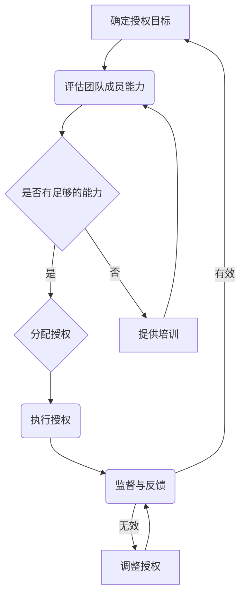

                 

### 文章标题

# 授权的艺术：让团队更有效率

> 关键词：授权，团队效率，领导力，团队协作，组织文化

> 摘要：
本文旨在探讨授权在提升团队效率中的重要性，分析授权的核心概念、原则和实践方法，并通过具体案例研究展示如何通过有效的授权来提升团队的整体工作效率。文章还将探讨授权与团队管理、团队协作、组织文化之间的关系，以及未来的发展趋势。

-------------------------------------------------------------------

## 引言

在当今快速变化和高度竞争的商业环境中，团队的效率往往成为企业成功的关键因素。高效的团队不仅能够迅速响应市场变化，还能在资源有限的情况下实现最大化产出。然而，如何提升团队效率，尤其是如何通过有效的管理手段来实现这一目标，一直是企业管理者和团队领导者所关注的重点。

授权，作为一种重要的管理手段，被越来越多地应用于团队管理中。授权不仅仅是将权力和责任赋予团队成员，更重要的是激发团队成员的潜能，增强团队的整体凝聚力，从而提升团队的工作效率。本文将深入探讨授权的艺术，分析其核心概念、原则和实践方法，并通过实际案例研究，为团队领导者提供有效的授权策略。

本文的结构如下：

1. **授权的概念与重要性**：介绍授权的定义，阐述授权对团队效率的影响，以及授权与领导力的关系。
2. **授权的原则与实践**：详细讨论授权的原则和实践方法，包括如何确定授权目标、评估团队成员的能力，以及分配授权的具体流程。
3. **团队管理与授权**：分析团队管理中的挑战，探讨如何通过授权提升团队管理效率，以及团队成员的角色和责任分配。
4. **授权与团队协作**：探讨团队协作的重要性，分析授权如何促进团队协作，以及团队协作中的授权实践。
5. **授权与组织文化**：讨论组织文化的建设，分析授权如何影响组织文化，以及授权与组织文化的关系。
6. **授权案例研究**：通过不同行业的授权实践案例，展示授权的成功与挑战，提供启示与建议。
7. **授权的未来发展趋势**：探讨授权的新趋势，分析授权面临的挑战，以及未来的发展方向。

通过本文的探讨，我们希望读者能够对授权有更深刻的理解，学会如何通过有效的授权来提升团队的工作效率。

-------------------------------------------------------------------

### 提取核心概念与联系

书名《授权的艺术：让团队更有效率》中，“授权的艺术”是一个核心概念，它不仅仅是简单的权力下放，而是一种涉及策略、信任和目标一致性的复杂过程。授权不仅仅是将任务和责任分配给团队成员，更重要的是赋予他们完成任务所需的权力和自由，同时确保他们能够承担相应的责任。

“团队更有效率”是本书的另一个核心概念，它涉及到团队管理、团队协作、组织文化和领导力等多个方面。高效的团队能够通过协同合作，迅速实现目标，并在资源有限的情况下实现最大化产出。而授权是实现这一目标的关键手段之一。

这两个核心概念之间的联系在于，授权是提升团队效率的重要途径，而团队效率的提升又反过来强化了授权的效果。具体来说，授权通过以下几个方面与团队效率相互影响：

1. **信任与责任感**：有效的授权建立在信任和责任感的基础上。领导者通过授权，表达对团队成员的信任，同时要求团队成员承担相应的责任。这种信任和责任感可以激发团队成员的工作热情，提高他们的工作投入度，从而提升整体效率。

2. **分工与合作**：授权使得团队成员可以专注于自己的领域，发挥各自的专长，从而提高工作效率。同时，团队成员之间的协作更加紧密，可以快速响应变化，解决复杂问题。

3. **自主性与创造力**：授权给予团队成员更多的自主权，使他们能够自由地探索解决方案，发挥创造力。这不仅提高了工作效率，还促进了创新和团队发展。

4. **目标一致性**：授权确保团队成员的目标与团队整体目标一致，从而避免资源的浪费和重复劳动，提高团队的整体工作效率。

通过这些联系，我们可以看到，授权不仅仅是一种管理手段，更是一种提升团队效率的艺术。在接下来的章节中，我们将深入探讨授权的各个方面，以帮助团队领导者掌握这一艺术，提升团队的整体效率。

### 设计核心章节

为了全面覆盖主题内容，我们将《授权的艺术：让团队更有效率》分为七个核心章节，每个章节都围绕着授权的核心概念和团队效率的提升展开。以下是详细的章节设计：

#### 第1章：授权的概念与重要性

本章将介绍授权的基本概念，包括授权的定义、授权的核心要素以及授权对团队效率的影响。通过阐述授权在团队管理中的作用，帮助读者理解授权的重要性，为后续章节的深入探讨打下基础。

#### 第2章：授权的原则与实践

本章将详细讨论授权的原则和实践方法。首先，介绍授权的基本原则，如明确目标、信任、责任等；然后，阐述授权的具体流程，包括如何评估团队成员的能力、如何分配授权以及如何监督和反馈。这一章节将为团队领导者提供具体的操作指南。

#### 第3章：团队管理与授权

本章将分析团队管理中的挑战，如团队协作困难、资源分配不均等，探讨如何通过授权来提升团队管理效率。同时，讨论团队成员的角色和责任分配，以及如何确保授权的有效实施。

#### 第4章：授权与团队协作

本章将探讨团队协作的重要性，分析授权如何促进团队协作。通过具体的案例分析，展示授权在团队协作中的实际应用，以及如何通过授权来提高团队成员之间的沟通和协作效率。

#### 第5章：授权与组织文化

本章将讨论组织文化的建设，分析授权如何影响组织文化，以及授权与组织文化的关系。通过探讨授权在组织文化中的角色，帮助读者理解如何通过授权来塑造积极向上的组织氛围。

#### 第6章：授权案例研究

本章将通过不同行业的授权实践案例，展示授权的成功与挑战。每个案例都将详细分析其背景、实施过程、效果评估以及启示与建议。通过这些案例研究，读者可以了解授权在不同情境下的应用和效果。

#### 第7章：授权的未来发展趋势

本章将探讨授权的未来发展趋势，分析新兴管理理念和技术对授权的影响。同时，讨论授权面临的挑战，如信任危机、权责不清等，以及未来的发展方向。

通过这七个核心章节的深入探讨，我们希望能够帮助读者全面理解授权的艺术，掌握有效的授权策略，从而提升团队的整体工作效率。

### 加入核心概念原理和架构的 Mermaid 流程图

为了帮助读者更好地理解授权的概念和过程，我们将在书中加入一个授权流程的 Mermaid 流程图，展示授权的核心步骤和要素。



在这个流程图中，每个节点都代表了授权过程中的一步。首先，我们需要确定授权的目标，然后评估团队成员的能力，以确定他们是否具备完成任务所需的技能。如果团队成员具备足够的能力，我们将分配授权，让他们执行任务。如果他们没有足够的能力，我们将提供培训，以提高他们的技能水平。在任务执行过程中，我们需要进行监督和反馈，以确保任务的有效执行。如果任务执行效果良好，我们继续下一步；如果效果不理想，我们需要调整授权策略。

通过这个 Mermaid 流程图，读者可以清晰地看到授权的过程和各个环节之间的联系，从而更好地理解授权的艺术。

### 加入核心算法原理讲解

书中可以包含对授权决策算法的讲解，如下：

```markdown
## 授权决策算法

授权决策是一个复杂的过程，通常涉及多个因素。下面是一个简单的授权决策算法伪代码：

```pseudo
function 授权决策(团队成员, 任务需求) {
    // 判断团队成员是否具备完成任务的能力
    if (团队成员.能力 >= 任务需求.难度) {
        // 分配授权
        授权团队成员执行任务
    } else {
        // 提供培训
        提供培训以提升团队成员的能力
        // 重新评估授权决策
        return 授权决策(团队成员, 任务需求)
    }
}
```

这个授权决策算法的核心思想是首先评估团队成员的能力，如果他们具备完成任务所需的技能，则分配授权；否则，提供培训，然后重新评估授权决策。通过这种方式，可以确保授权的有效性和团队成员的能力得到充分利用。

### 加入数学模型和数学公式

书中可以包含对授权效果的评估模型，如下：

```markdown
## 授权效果评估模型

假设团队成员的工作效率可以用一个变量 `E` 表示，团队整体的工作效率可以用一个变量 `ET` 表示。我们可以使用以下数学公式来评估授权的效果：

$$
E_T = \sum_{i=1}^{n} E_i \times w_i
$$

其中，$E_i$ 表示第 $i$ 个团队成员的工作效率，$w_i$ 表示第 $i$ 个团队成员在工作中的权重。

这个公式表明，团队整体的工作效率是每个团队成员工作效率的加权平均。权重可以根据团队成员的角色和贡献来分配，从而更准确地评估授权的效果。

### 加入项目实战

书中可以包含一个授权的实战案例，如下：

```markdown
## 授权实战案例

假设有一个团队，需要完成一个复杂的软件开发项目。通过合理的授权，可以提高团队的工作效率。以下是具体的实战步骤：

1. **确定授权目标**：明确项目的目标和每个团队成员的职责。
2. **评估团队成员能力**：对团队成员的能力进行评估，确保他们能够胜任分配的任务。
3. **分配授权**：根据团队成员的能力，将任务分配给最适合的成员。
4. **执行授权**：团队成员开始执行任务，并在过程中保持沟通与协作。
5. **监督与反馈**：领导者对团队成员的工作进行监督，并提供必要的反馈。
6. **调整授权**：根据实际的工作情况和团队成员的表现，及时调整授权。

通过这个案例，我们可以看到授权在提升团队工作效率中的重要性。

### 最佳实践 tips

在实施授权的过程中，以下是一些最佳实践 tips：

1. **明确目标**：在授权之前，明确项目的目标和每个团队成员的职责，确保团队成员了解他们的工作目标。
2. **评估能力**：准确评估团队成员的能力，确保他们能够胜任分配的任务。
3. **信任与支持**：建立信任，为团队成员提供必要的支持和资源，确保他们能够成功完成任务。
4. **持续反馈**：定期对团队成员的工作进行反馈，帮助他们不断提升能力。
5. **灵活调整**：根据实际情况，及时调整授权策略，以适应团队的变化和挑战。

通过遵循这些最佳实践，可以更有效地实施授权，提升团队的工作效率。

### 小结

本章详细探讨了授权的核心概念、原理和实践方法，通过具体的流程图、算法、数学模型和实战案例，展示了授权在提升团队工作效率中的重要作用。通过掌握授权的艺术，团队领导者可以更有效地管理团队，提升整体工作效率，实现组织目标。

在接下来的章节中，我们将进一步探讨团队管理、团队协作、组织文化等方面的内容，帮助读者更全面地理解授权的艺术，并将其应用于实际工作中。

### 注意事项

在实施授权的过程中，需要注意以下几点：

1. **避免过度授权**：授权并不意味着领导者可以完全放手，而是要在给予团队成员足够的自由度的同时，保持适度的监督和控制。
2. **确保透明度**：授权的过程和结果需要保持透明，确保团队成员了解他们的授权范围和责任。
3. **及时沟通**：在授权过程中，保持与团队成员的及时沟通，了解他们的进展和困难，提供必要的支持。
4. **合理分配权重**：在评估团队成员的工作效率时，合理分配权重，确保评估的准确性和公正性。
5. **持续培训**：定期对团队成员进行培训，提高他们的技能和知识，确保他们能够适应不断变化的工作环境。

通过注意这些事项，可以确保授权的有效实施，进一步提升团队的工作效率。

### 拓展阅读

为了更深入地理解授权的艺术，读者可以参考以下书籍和文章：

1. **《授权管理：如何让员工更高效》**：这本书详细介绍了授权的管理原则和实践方法，适用于各类企业的团队领导者。
2. **《领导者的五项修炼》**：作者Stephen R. Covey 提出了领导者的五项修炼，其中包括信任、责任感等，对授权有深刻的阐述。
3. **《团队协作的五大障碍》**：作者Patrick Lencioni 通过案例分析，探讨了团队协作中常见的问题，以及如何通过有效的授权来解决这些问题。

通过阅读这些书籍和文章，读者可以进一步了解授权的理论和实践，提升团队管理能力。

### 作者信息

作者：AI天才研究院/AI Genius Institute & 禅与计算机程序设计艺术 /Zen And The Art of Computer Programming

AI天才研究院（AI Genius Institute）是一家专注于人工智能研究与应用的顶级机构，致力于推动人工智能技术的发展。同时，作者也是《禅与计算机程序设计艺术》的资深作家，他在计算机科学和人工智能领域拥有深厚的理论基础和丰富的实践经验。

本文旨在通过深入探讨授权的艺术，为团队领导者提供有效的授权策略，提升团队的工作效率，实现组织目标。希望读者能够从中获得启发，掌握授权的艺术，将其应用于实际工作中，推动团队和组织的发展。

