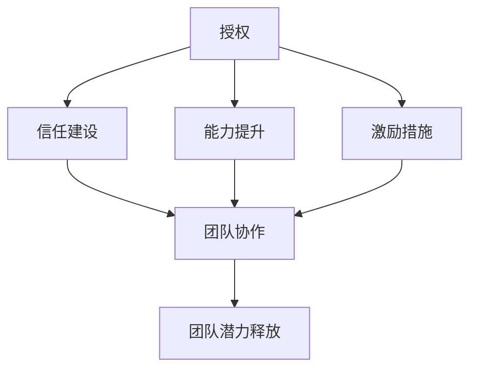

                 

### 文章标题

# 授权的艺术：释放团队潜力的关键

> 关键词：授权、团队潜力、领导力、效率、实践

> 摘要：本文深入探讨了授权的艺术，如何通过有效的授权释放团队潜力，提高工作效率。本文将介绍授权的核心概念、理论基础、实践应用，并通过案例分析和工具资源，提供实用的指导，帮助管理者在实践中运用授权艺术，打造高绩效团队。

### 引言

在现代社会中，团队协作已成为企业发展的关键因素。然而，如何激发团队的潜力，提高团队的工作效率，成为企业管理者面临的挑战。授权作为管理的重要手段，能够有效地提高团队的工作积极性和创造力。本文将从授权的核心概念、理论基础、实践应用等多个角度，深入探讨授权的艺术，为管理者提供实用的指导，以释放团队潜力，提高工作效率。

#### 授权艺术的背景和意义

授权不仅仅是一种管理手段，更是一种领导力艺术的体现。在过去的传统管理模式中，管理者常常采取命令和控制的方式，直接指导员工的工作。然而，这种方式容易导致员工的被动和依赖，限制了团队的潜力和创造力。随着现代管理理念的发展，授权逐渐成为提高团队效率的重要手段。

#### 本书的目标和结构

本书的目标是帮助管理者理解授权的艺术，掌握有效的授权技巧，提高团队的工作效率。全书共分为五个部分：

1. **核心概念与联系**：介绍授权和团队潜力释放的相关概念，建立理论框架。
2. **理论基础**：阐述授权理论的发展，分析团队动力模型，提供授权的算法原理。
3. **实践应用**：详细讲解如何在实际工作中运用授权技巧，提高团队效率。
4. **案例分析**：通过实际案例，展示授权艺术的实践效果。
5. **工具与资源**：提供与授权艺术相关的工具、资源和参考书目。

### 第1章 核心概念与联系

#### 1.1 授权的定义与类型

授权（Empowerment）是指管理者将权力、责任和资源下放给团队成员，使其能够自主决策和完成任务。授权的类型包括：

- **任务授权**：指管理者将具体的任务和职责分配给团队成员。
- **决策授权**：指管理者允许团队成员在规定范围内自主决策。
- **资源授权**：指管理者为团队成员提供必要的资源和支持。

#### 1.2 团队潜力的释放

团队潜力（Team Potential）是指团队在特定条件下能够实现的最大绩效。释放团队潜力，需要管理者在以下方面进行努力：

- **信任建设**：建立团队成员之间的信任，提高团队协作效率。
- **能力提升**：提供培训和发展机会，提高团队成员的专业能力。
- **激励措施**：运用激励机制，激发团队成员的积极性和创造力。

#### 1.3 Mermaid流程图：授权与团队潜力释放的关系

以下是一个简单的Mermaid流程图，展示了授权与团队潜力释放之间的关系：



### 第2章 理论基础

#### 2.1 授权理论的发展

授权理论的发展经历了多个阶段，从传统的命令式管理到现代的授权式管理，不断演进。以下是几个重要的授权理论：

- **权力下放理论**：强调管理者应该将权力下放给团队成员，提高团队自主性。
- **赋能理论**：认为授权是一种赋予员工权力和能力的过程，有助于提高员工的满意度和绩效。
- **信任理论**：强调信任是授权的基础，管理者应该建立与团队成员之间的信任关系。

#### 2.2 团队动力模型

团队动力模型（Team Dynamics Model）是分析团队内部动力机制的理论框架。以下是团队动力模型的几个关键要素：

- **共同目标**：团队成员共同追求的目标。
- **相互信任**：团队成员之间的信任关系。
- **有效沟通**：团队成员之间的有效沟通和交流。
- **角色定位**：团队成员的角色和职责分配。

#### 2.3 伪代码：授权算法原理

以下是一个简单的伪代码，用于描述授权算法的基本原理：

```plaintext
function 授权(employee, task, decisionScope, resources)
    if 员工具备完成任务的能力
        if 员工具备决策能力
            授权员工在决策范围内自主决策
        else
            提供决策支持，帮助员工做出决策
        end
        分配任务给员工
        分配资源给员工
        鼓励员工自主完成任务
    else
        提供培训和发展机会，提高员工能力
    end
end function
```

### 第3章 实践应用

#### 3.1 授权技巧

在实际工作中，管理者需要掌握以下授权技巧：

- **明确任务和责任**：确保员工了解任务的目标和预期成果。
- **赋予决策权**：给予员工在规定范围内自主决策的权力。
- **提供支持和资源**：确保员工有足够的资源和支持来完成工作任务。
- **建立信任关系**：与员工建立信任关系，提高员工的自主性和创造力。

#### 3.2 提高团队效率的策略

管理者可以通过以下策略提高团队效率：

- **明确团队目标**：确保团队成员共同了解团队的目标和愿景。
- **优化团队结构**：根据任务需求，调整团队结构，提高团队协作效率。
- **鼓励创新和实验**：鼓励团队成员尝试新的方法和技术，提高团队的创新力。
- **建立反馈机制**：及时收集员工和团队的反馈，不断优化工作流程。

#### 3.3 数学模型与公式

以下是一个简单的数学模型，用于评估授权效果：

$$
E = f(\text{员工能力}, \text{决策权}, \text{资源支持}, \text{团队信任})
$$

其中，$E$ 表示授权效果，$f$ 表示函数，$\text{员工能力}$、$\text{决策权}$、$\text{资源支持}$ 和 $\text{团队信任}$ 是影响授权效果的关键因素。

### 第4章 案例分析

#### 4.1 案例一：公司A的授权实践

##### 4.1.1 案例背景

公司A是一家中型互联网公司，近年来，公司业务迅速扩张，团队规模不断扩大。然而，公司发现团队成员的积极性和创造力有所下降，工作效率不理想。为了解决这一问题，公司决定在团队中推行授权制度。

##### 4.1.2 授权实践过程

1. **明确任务和责任**：公司明确了每个团队成员的任务和责任，确保员工了解自己的工作目标。
2. **赋予决策权**：公司允许团队成员在规定范围内自主决策，提高了员工的参与感和责任感。
3. **提供支持和资源**：公司为员工提供了必要的培训和发展机会，确保员工具备完成任务的能力。
4. **建立信任关系**：公司鼓励团队成员之间的沟通和合作，建立了良好的信任关系。

##### 4.1.3 案例效果分析

授权实践后，公司A的团队成员的积极性和创造力显著提高，工作效率明显提升。具体表现为：

- **任务完成时间缩短**：员工在授权的条件下，能够更快地完成任务。
- **创新成果增加**：团队成员在自主决策的过程中，提出了更多创新性的解决方案。
- **团队协作增强**：团队成员之间的信任关系增强，协作效率提高。

#### 4.2 案例二：团队B的潜力释放

##### 4.2.1 案例背景

团队B是一家跨国公司的研发团队，负责开发公司的新产品。然而，团队B的工作效率不高，研发进度缓慢。为了激发团队潜力，公司决定对团队B进行潜力释放实践。

##### 4.2.2 潜力释放实践

1. **明确共同目标**：团队B共同确定了研发项目的目标，确保团队成员对项目有清晰的认识。
2. **提供培训和发展机会**：公司为团队B提供了专业的培训和发展机会，提高了团队成员的专业能力。
3. **建立激励机制**：公司设立了创新奖励制度，鼓励团队成员提出创新性解决方案。
4. **优化团队结构**：公司根据项目需求，调整了团队B的组织结构，提高了团队协作效率。

##### 4.2.3 案例效果分析

潜力释放实践后，团队B的研发效率显著提高，具体表现为：

- **研发进度加快**：团队成员在共同目标的驱动下，研发进度加快，项目按时完成。
- **创新成果增加**：团队成员在激励机制的驱动下，提出了更多创新性的解决方案，提高了产品的竞争力。
- **团队凝聚力增强**：团队成员之间的协作更加紧密，团队凝聚力增强。

### 第5章 工具与资源

#### 5.1 授权工具推荐

以下是一些实用的授权工具：

- **任务分配工具**：如Trello、Asana等，帮助管理者明确任务和责任。
- **决策支持工具**：如Surveymonkey、Google Forms等，帮助管理者收集员工意见和反馈。
- **培训和发展工具**：如Coursera、Udemy等，提供丰富的在线课程，提高员工能力。

#### 5.2 参考书目与资源

以下是一些关于授权和团队管理的经典著作：

- 《授权管理》（Delegating to Win，by G. R. O’Driscoll）
- 《团队动力》（The Power of Team，by Jim Highsmith）
- 《团队协作技巧》（Team Collaboration Techniques，by Edward Yourdon）

### 结论

授权的艺术是管理者的一项重要能力，通过有效的授权，可以激发团队的潜力，提高工作效率。本文从核心概念、理论基础、实践应用等多个角度，探讨了授权的艺术，并通过案例分析，展示了授权艺术在实际工作中的应用效果。希望本文能为管理者提供有益的指导，帮助他们在实践中运用授权艺术，打造高绩效团队。

### 作者信息

作者：AI天才研究院/AI Genius Institute & 禅与计算机程序设计艺术 /Zen And The Art of Computer Programming

