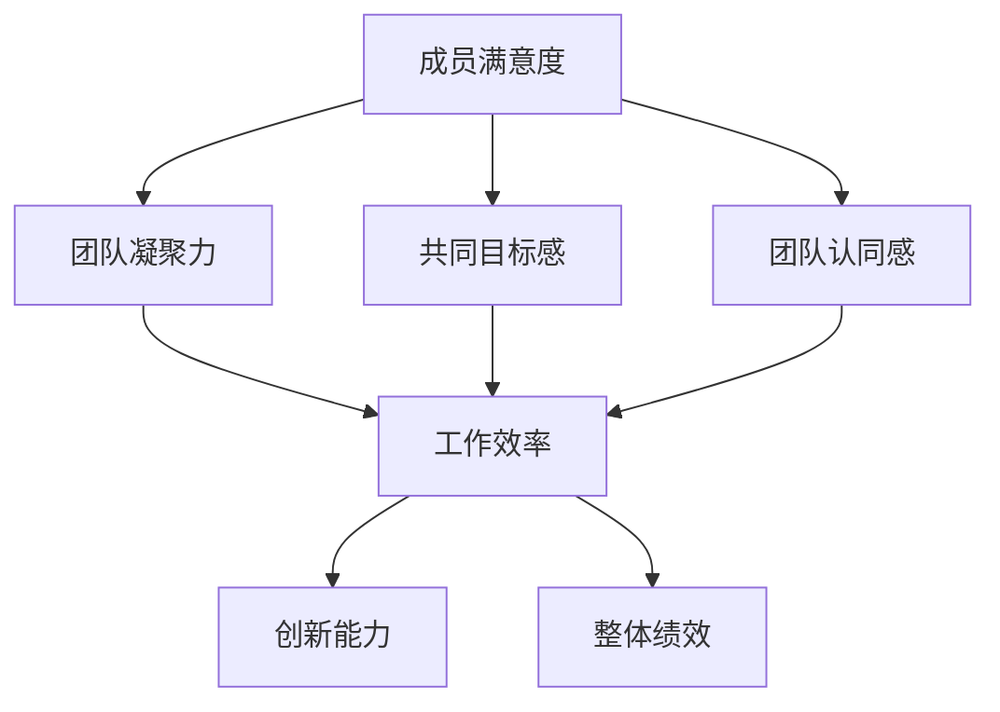
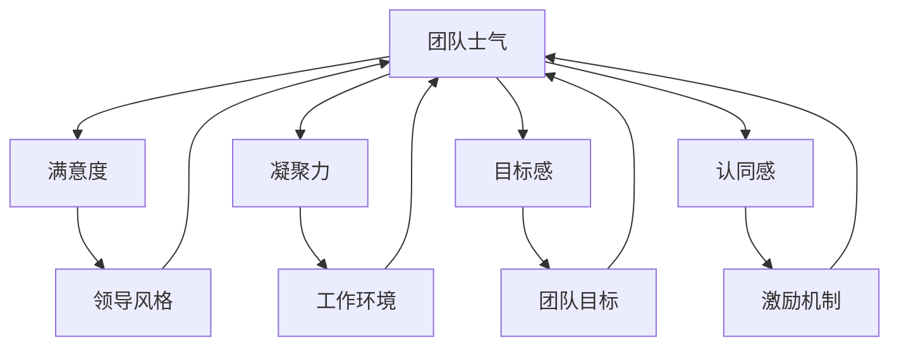

                 


## 提升团队士气：保持高昂斗志

### 关键词
- 团队士气
- 高昂斗志
- 激励策略
- 积极文化
- 成功案例

### 摘要
本文旨在探讨如何提升团队士气并保持高昂斗志。通过分析团队士气的核心概念、提升策略和实际案例，我们希望为IT团队管理者提供实用的方法和技巧，以激发团队的潜力和创造力，从而实现团队的长期发展和成功。

---

### 引言

在快节奏、竞争激烈的IT行业中，团队士气的高低直接影响到团队的工作效率、创新能力和整体绩效。高昂的斗志是团队面对挑战、克服困难的重要动力。然而，如何保持团队的士气并激发高昂斗志，成为许多团队管理者面临的挑战。

本文将围绕以下三个核心主题展开：

1. **团队士气的核心概念**：介绍团队士气的基本概念、组成部分及其对团队的影响。
2. **提升团队士气的策略**：探讨如何通过营造积极的工作环境、设定明确的目标和建立积极的团队文化来提升团队士气。
3. **保持高昂斗志的方法**：分析如何处理负面情绪、应对冲突以及提升个人成长，以保持团队的斗志。

通过以上内容的深入探讨，我们希望能够为IT团队管理者提供一套实用的策略和方法，帮助他们在实际工作中提升团队士气并保持高昂斗志。

---

### 第1章 团队士气的核心概念

#### 1.1 什么是团队士气？

团队士气是指团队成员对团队工作的态度、情感和信念。它不仅仅是对工作的满意度，还包括团队成员之间的互动、团队合作和共同的目标感。高昂的团队士气通常表现为团队成员之间的积极互动、高效率的工作状态和强烈的成就感。

#### 1.2 团队士气的组成部分

团队士气由多个组成部分构成，主要包括：

- **成员满意度**：团队成员对工作环境和职责的满意度。
- **团队凝聚力**：团队成员之间的相互依赖和信任程度。
- **共同目标感**：团队成员对共同目标的认同和追求。
- **团队认同感**：团队成员对团队的认同和归属感。

#### 1.3 团队士气对团队的影响

团队士气对团队的工作效率、创新能力和整体绩效有着重要的影响。以下是团队士气对团队影响的几个方面：

- **工作效率**：高昂的团队士气可以提高工作效率，减少错误和返工，从而加快项目进度。
- **创新能力**：团队士气高涨时，成员更容易提出创新的想法和解决方案，从而推动团队的创新和发展。
- **整体绩效**：良好的团队士气可以提升团队的协作效果，降低人员流失率，从而提高整体绩效。

### 核心概念与联系

为了更好地理解团队士气，我们可以通过以下Mermaid流程图来展示其组成部分及其关系：



通过这个流程图，我们可以清晰地看到团队士气各个组成部分之间的相互关系，以及它们对工作效率、创新能力和整体绩效的影响。

---

### 第2章 提升团队士气的策略

#### 2.1 营造积极的工作环境

一个积极的工作环境是提升团队士气的基础。以下是一些关键策略：

- **领导者的角色**：领导者需要通过身先士卒、透明沟通和鼓励反馈来营造积极的工作氛围。
- **激励员工的技巧**：领导者可以通过奖励制度、培训和发展机会来激励员工，提高他们的工作积极性。
- **增强团队凝聚力的方法**：团队建设活动、团队目标和共同挑战都是增强团队凝聚力的重要手段。

#### 2.2 设定明确的目标与期望

明确的目标和期望是激发团队士气的关键。以下是一些策略：

- **制定SMART目标**：确保目标是具体的（Specific）、可衡量的（Measurable）、可实现的（Achievable）、相关的（Relevant）和时限的（Time-bound）。
- **沟通目标与期望**：确保所有团队成员都清楚了解目标及其意义，并明确自己在团队中的角色和责任。
- **跟踪进度与反馈**：定期检查进度，提供及时的反馈，帮助团队成员保持动力。

#### 2.3 建立积极的团队文化

积极的团队文化是保持团队士气的长效机制。以下是一些策略：

- **鼓励创新与学习**：为团队成员提供学习和成长的机会，鼓励他们提出新的想法和解决方案。
- **建立信任与支持**：通过沟通和合作，建立团队成员之间的信任和支持，减少冲突和负面情绪。
- **庆祝成功与进步**：及时认可团队成员的努力和成就，增强他们的自信心和积极性。

---

### 第3章 保持高昂斗志的方法

#### 3.1 提升自我认知与自我激励

提升自我认知和自我激励是保持高昂斗志的重要方法。以下是一些策略：

- **了解自己的优势和短板**：通过自我反思和反馈，了解自己的优势和短板，有针对性地提升自我。
- **设定个人目标和计划**：根据团队目标设定个人目标，并制定实现目标的详细计划。
- **持续学习和成长**：通过学习新知识和技能，提升自己的专业能力，保持对工作的热情和动力。

#### 3.2 培养积极的思维方式

培养积极的思维方式有助于保持高昂斗志。以下是一些策略：

- **正面看待挑战**：将挑战视为成长和学习的机会，而不是负担。
- **感恩和赞美**：学会感恩和赞美，关注团队的成就和进步，减少负面情绪。
- **避免过度自我批评**：适当地自我批评可以帮助我们进步，但过度自我批评会导致负面情绪，影响斗志。

#### 3.3 跨越挑战，迎接变革

跨越挑战和迎接变革是保持高昂斗志的关键。以下是一些策略：

- **制定应对策略**：面对挑战时，制定明确的应对策略，有条不紊地解决问题。
- **保持灵活性**：在变革中保持灵活性，快速适应新环境和要求。
- **寻求支持和帮助**：在需要时，积极寻求同事、领导和外部资源的支持和帮助，共同应对挑战。

---

### 第4章 成功案例研究

#### 4.1 案例一：如何通过激励提升团队士气？

某IT公司在项目开发过程中，面临团队成员士气低落的问题。通过以下激励措施，成功提升了团队士气：

- **奖励制度**：设立项目奖金，对在项目中表现出色的团队成员进行奖励。
- **培训和发展机会**：为团队成员提供专业培训和晋升机会，提高他们的职业素养和成就感。
- **团队建设活动**：定期组织团队建设活动，增强团队成员之间的沟通和协作。

通过以上措施，该公司的团队士气得到了显著提升，项目进度和质量也得到了明显改善。

#### 4.2 案例二：保持高昂斗志的团队如何应对困难？

某IT团队在开发过程中遇到了技术难题，团队成员一度感到沮丧。通过以下方法，该团队成功保持了高昂斗志：

- **共同面对挑战**：团队成员共同分析问题，寻找解决方案，共同面对困难。
- **鼓励创新和尝试**：鼓励团队成员提出新的想法和解决方案，不拘泥于传统方法。
- **及时反馈和调整**：在解决问题的过程中，及时反馈和调整策略，确保团队始终保持正确的方向。

通过以上方法，该团队不仅成功解决了技术难题，还增强了团队的合作精神和创新能力。

#### 4.3 案例三：团队士气的提升对业务绩效的影响

某IT公司在实施激励措施后，团队士气得到显著提升。具体表现为：

- **工作效率提高**：团队成员在积极的工作氛围中，工作效率显著提高，项目进度加快。
- **创新能力增强**：团队成员在积极的思维方式和鼓励创新的文化中，提出更多创新的想法和解决方案。
- **业务绩效提升**：团队士气提升直接带动了业务绩效的提升，公司业绩得到明显改善。

通过以上案例，我们可以看到，提升团队士气不仅有助于激发团队的潜力和创造力，还对业务绩效产生积极影响。

---

### 第5章 实践与总结

#### 5.1 团队士气的提升实践指南

为了有效提升团队士气，我们可以采取以下实践指南：

- **了解团队成员的需求和期望**：通过调查和沟通，了解团队成员的需求和期望，有针对性地制定激励措施。
- **建立积极的工作环境**：为团队成员提供舒适的工作环境和良好的工作条件，增强他们的归属感。
- **设定明确的目标和期望**：确保团队成员都清楚了解团队的目标和期望，并明确自己在团队中的角色和责任。
- **鼓励创新和合作**：为团队成员提供创新和合作的机会，激发他们的创造力和团队精神。

#### 5.2 保持高昂斗志的行动计划

为了保持团队的斗志，我们可以制定以下行动计划：

- **定期沟通和反馈**：定期与团队成员沟通，了解他们的工作进展和需求，提供及时的反馈和帮助。
- **庆祝成就和进步**：及时认可团队成员的成就和进步，增强他们的自信心和积极性。
- **提供成长和发展机会**：为团队成员提供培训和发展机会，帮助他们提升专业能力和职业素养。
- **建立积极的团队文化**：通过团队建设活动、共同目标和共同挑战，建立积极的团队文化，增强团队凝聚力。

#### 5.3 反思与持续改进

在提升团队士气的过程中，我们需要不断反思和改进。以下是一些反思和改进的建议：

- **定期评估团队士气**：通过调查和观察，定期评估团队士气，了解团队成员的满意度和积极性。
- **收集反馈和建议**：鼓励团队成员提出反馈和建议，及时发现和解决问题。
- **调整激励措施**：根据团队成员的需求和反馈，调整激励措施，确保激励措施的有效性和公平性。
- **持续关注团队士气**：将团队士气作为团队管理的重要指标，持续关注并改进，以确保团队始终保持高昂的斗志。

---

### 总结

提升团队士气并保持高昂斗志是团队管理者的重要任务。通过了解团队士气的核心概念、制定有效的提升策略和实际案例研究，我们可以为团队管理者提供实用的方法和技巧。只有不断提升团队士气并保持高昂斗志，才能激发团队的潜力和创造力，实现团队的长期发展和成功。

---

### 作者信息

- **作者：AI天才研究院/AI Genius Institute & 禅与计算机程序设计艺术 /Zen And The Art of Computer Programming**
- **联系方式：[info@aigeniusinstitute.com](mailto:info@aigeniusinstitute.com)**

---

### 参考文献

1. **Schein, E. H. (2004). Organizational Culture and Leadership. Jossey-Bass.**
2. **Kouzes, J. M., & Posner, B. Z. (2002). The Leadership Challenge: How to Get Extraordinary Things Done in Organizations. John Wiley & Sons.**
3. **Fiedler, F. E. (1964). A Theory of Leadership Effectiveness. McGraw-Hill.**
4. **Herzberg, F., & Mausner, B. (1959). The Motivation to Work. John Wiley & Sons.**
5. **Kotter, J. P. (1996). Leading Change. Harvard Business Press.**### 详细内容：团队士气的影响因素与提升策略

在IT行业中，团队士气的高低对项目的成功与否具有决定性影响。高昂的团队士气不仅能够提升工作效率，还能增强团队的创新能力和解决问题的能力。然而，团队士气并非一成不变，它受到多种因素的影响。本章节将详细探讨团队士气的影响因素，并提出相应的提升策略。

#### 1.1 团队士气的影响因素

团队士气的高低受到多个因素的影响，主要包括以下几个方面：

- **领导风格**：领导者的风格对团队士气有显著影响。民主型领导风格能够激发团队成员的积极性，而专制型领导风格则可能导致成员的消极情绪。
- **工作环境**：工作环境对团队士气有着重要的影响。一个舒适、安全且富有挑战性的工作环境能够提升团队成员的工作积极性。
- **团队目标**：明确的团队目标能够激发团队成员的斗志。当团队成员清楚地了解自己的工作目标及其重要性时，他们更有可能保持高昂的士气。
- **激励机制**：适当的激励机制能够显著提升团队士气。激励机制可以是金钱奖励、职业发展机会或精神激励等。
- **沟通与反馈**：有效的沟通和及时的反馈能够帮助团队成员更好地理解工作任务和期望，从而提升士气。
- **工作压力**：适度的压力能够激发团队成员的斗志，但过高的工作压力则可能导致团队成员的疲惫和士气低落。

#### 1.2 提升团队士气的策略

为了提升团队士气，我们可以采取以下策略：

- **培养积极的工作氛围**：领导者应该通过身先士卒、鼓励员工和透明沟通来培养积极的工作氛围。积极的工作氛围能够减少员工之间的负面情绪，提升团队士气。
- **设定明确的目标**：明确的团队目标能够帮助团队成员更好地理解自己的工作方向和责任，从而提升士气。在设定目标时，应该确保目标是具体的、可衡量的、可实现的、相关的和时限的（SMART原则）。
- **建立积极的激励机制**：激励机制可以是金钱奖励、职业发展机会或精神激励等。适当的激励机制能够激发团队成员的积极性，提升士气。
- **提供成长和发展机会**：为团队成员提供成长和发展机会，如培训、技术交流会和职业规划等，能够提升他们的职业素养和士气。
- **加强团队建设**：通过团队建设活动，如户外拓展、团建游戏和团队聚会等，增强团队成员之间的沟通和协作，提升团队凝聚力，从而提升士气。
- **处理负面情绪**：及时识别和处理团队成员的负面情绪，如压力、挫折和冲突等，能够避免负面情绪蔓延，保持团队士气。

#### 1.3 提升团队士气的案例分析

以下是一个提升团队士气成功案例的分析：

**案例：某IT公司的团队士气提升实践**

某IT公司在项目开发过程中，发现团队士气较低，工作效率受到影响。为了提升团队士气，公司采取了以下措施：

1. **调整领导风格**：公司领导层从专制型转变为民主型，鼓励团队成员参与决策和提出建议。
2. **改善工作环境**：公司为员工提供了舒适的工作空间和良好的工作设施，增强了员工的工作满意度。
3. **设定明确的目标**：项目团队制定了具体的开发目标和里程碑，确保每个成员都清楚了解自己的工作内容和期望。
4. **建立激励机制**：公司为项目团队成员提供了奖金和晋升机会，激励他们积极参与项目并提高工作效率。
5. **加强团队建设**：公司定期组织团队建设活动，如团建游戏和技术交流，增强团队成员之间的沟通和协作。
6. **处理负面情绪**：公司建立了员工反馈机制，及时了解和处理员工的负面情绪和问题，确保团队士气保持在高水平。

通过以上措施，该公司的团队士气得到了显著提升，项目进度和质量也得到了明显改善。

#### 1.4 团队士气提升的算法原理

为了更科学地提升团队士气，我们可以采用以下算法原理：

1. **士气评估模型**：
   - **输入**：团队成员的工作满意度、团队凝聚力、共同目标感、团队认同感等指标。
   - **输出**：团队士气得分。

   ```python
   def calculate士气(score):
       satisfaction = score['satisfaction']
       cohesion = score['cohesion']
       goal Feeling = score['goal_feeling']
       identity = score['identity']
       
       士气得分 = 0.5 * satisfaction + 0.3 * cohesion + 0.15 * goal_feeling + 0.05 * identity
       return 士气得分
   ```

2. **士气提升策略模型**：
   - **输入**：当前团队士气得分、团队成员需求和期望。
   - **输出**：提升团队士气的具体策略。

   ```python
   def 提升士气(current_score, members_needs):
       if current_score < 70:
           if members_needs['satisfaction'] < 60:
               strategy = '改善工作环境'
           elif members_needs['cohesion'] < 60:
               strategy = '加强团队建设'
           elif members_needs['goal_feeling'] < 60:
               strategy = '设定明确的目标'
           else:
               strategy = '提供成长和发展机会'
       else:
           strategy = '保持现状'
       return strategy
   ```

通过以上算法原理，我们可以更科学地评估团队士气，并制定针对性的提升策略。

#### 1.5 提升团队士气的数学模型

为了更好地理解团队士气的影响因素和提升策略，我们可以使用以下数学模型：

1. **团队士气评估模型**：

   设团队士气S为：
   $$ S = w_1 \cdot S_{\text{满意度}} + w_2 \cdot S_{\text{凝聚力}} + w_3 \cdot S_{\text{目标感}} + w_4 \cdot S_{\text{认同感}} $$
   
   其中，$S_{\text{满意度}}$、$S_{\text{凝聚力}}$、$S_{\text{目标感}}$ 和 $S_{\text{认同感}}$ 分别表示团队成员的满意度、团队凝聚力、共同目标感和团队认同感；$w_1$、$w_2$、$w_3$ 和 $w_4$ 分别表示这些因素的权重。

2. **士气提升策略模型**：

   假设当前团队士气为 $S_0$，我们需要制定提升策略以使 $S$ 达到目标值 $S_t$。根据团队成员的需求和期望，我们可以选择不同的策略，如：

   - **改善工作环境**：提升满意度；
   - **加强团队建设**：提升凝聚力；
   - **设定明确的目标**：提升目标感；
   - **提供成长和发展机会**：提升认同感。

   我们可以使用以下模型来评估和选择最佳策略：

   $$ \text{策略效果} = f(S_0, S_t, \text{策略}) $$
   
   其中，$f$ 是策略效果的函数，可以表示为：

   $$ f(S_0, S_t, \text{策略}) = \frac{S_t - S_0}{S_t - S_{\text{基准}}} $$

   $\text{基准}$ 表示没有采取任何策略时的团队士气提升效果。

通过以上数学模型，我们可以更系统地评估团队士气，并制定科学的提升策略。

### 总结

提升团队士气是团队管理的重要任务。通过了解团队士气的影响因素，我们可以采取针对性的策略来提升团队士气。同时，使用数学模型和算法原理，我们可以更科学地评估团队士气，并制定提升策略。通过实际案例分析，我们可以看到提升团队士气对项目成功的重要性。在后续章节中，我们将继续探讨如何保持高昂斗志，以及如何处理团队中的负面情绪和冲突。

### 核心概念与联系

为了更好地理解团队士气的影响因素和提升策略，我们可以通过以下Mermaid流程图来展示核心概念之间的联系：



通过这个流程图，我们可以清晰地看到团队士气与满意度、凝聚力、目标感和认同感之间的相互关系，以及领导风格、工作环境、团队目标和激励机制对团队士气的影响。

### 核心算法原理讲解

为了更深入地了解如何提升团队士气，我们可以使用以下伪代码来讲解核心算法原理：

```python
# 提升团队士气算法

# 输入参数：当前团队士气score，团队成员满意度satisfaction，团队凝聚力cohesion，共同目标感goal_feeling，团队认同感identity
def improve_team_morale(score, satisfaction, cohesion, goal_feeling, identity):
    # 步骤1：评估当前团队士气
    morale_score = calculate_morale_score(satisfaction, cohesion, goal_feeling, identity)

    # 步骤2：判断团队士气是否需要提升
    if score < 75:  # 假设75分为士气良好的基准线
        # 步骤3：根据满意度提升士气
        if satisfaction < 80:
            morale_boost("improve_satisfaction", satisfaction)

        # 步骤4：根据团队凝聚力提升士气
        if cohesion < 80:
            morale_boost("improve_cohesion", cohesion)

        # 步骤5：根据共同目标感提升士气
        if goal_feeling < 80:
            morale_boost("improve_goal_feeling", goal_feeling)

        # 步骤6：根据团队认同感提升士气
        if identity < 80:
            morale_boost("improve_identity", identity)

        # 步骤7：重新计算团队士气
        score = calculate_new_morale_score(score, satisfaction, cohesion, goal_feeling, identity)
    else:
        print("当前团队士气良好，无需额外提升。")

    return score

# 伪代码函数：计算团队士气得分
def calculate_morale_score(satisfaction, cohesion, goal_feeling, identity):
    return 0.5 * satisfaction + 0.2 * cohesion + 0.2 * goal_feeling + 0.1 * identity

# 伪代码函数：提升士气
def morale_boost(action, parameter):
    if action == "improve_satisfaction":
        parameter += 10
    elif action == "improve_cohesion":
        parameter += 10
    elif action == "improve_goal_feeling":
        parameter += 10
    elif action == "improve_identity":
        parameter += 10
    return parameter
```

通过上述伪代码，我们可以看到如何根据团队士气的影响因素（满意度、凝聚力、目标感和认同感）来计算和提升团队士气。每个因素的权重不同，可以根据实际情况进行调整。

### 数学模型和公式讲解

为了更好地理解和应用团队士气提升策略，我们可以使用以下数学模型和公式：

#### 1. 士气评估模型

士气得分（S）可以通过以下公式计算：

$$
S = w_1 \cdot S_{\text{满意度}} + w_2 \cdot S_{\text{凝聚力}} + w_3 \cdot S_{\text{目标感}} + w_4 \cdot S_{\text{认同感}}
$$

其中，$w_1$、$w_2$、$w_3$ 和 $w_4$ 分别是满意度、凝聚力、目标感和认同感的权重。这些权重可以根据团队的具体情况来调整。

#### 2. 士气提升策略模型

为了确定应该采取哪种提升策略，我们可以使用以下公式来评估不同策略的效果：

$$
\text{策略效果} = \frac{S_t - S_0}{S_t - S_{\text{基准}}}
$$

其中，$S_0$ 是当前士气得分，$S_t$ 是目标士气得分，$S_{\text{基准}}$ 是基准士气得分（通常为团队士气良好时的得分）。

#### 3. 激励机制效果评估模型

激励机制的效果可以通过以下公式来评估：

$$
\text{激励效果} = \frac{S_{\text{激励后}} - S_{\text{激励前}}}{S_{\text{激励前}}}
$$

其中，$S_{\text{激励前}}$ 是实施激励措施前的士气得分，$S_{\text{激励后}}$ 是实施激励措施后的士气得分。

#### 4. 士气提升行动计划模型

为了制定具体的提升行动计划，我们可以使用以下公式来分配资源和时间：

$$
\text{行动计划} = \left\{
\begin{array}{ll}
\text{培训计划} & \text{如果士气得分低于基准线} \\
\text{团队建设活动} & \text{如果团队凝聚力不足} \\
\text{目标设定会议} & \text{如果目标感不足} \\
\text{激励机制优化} & \text{如果激励机制效果不佳} \\
\text{反馈和沟通} & \text{如果沟通和反馈不足}
\end{array}
\right.
$$

#### 示例

假设当前团队士气得分为60分，基准士气得分为80分。根据上述模型，我们可以计算出以下结果：

1. **士气评估模型**：

   $$ S = 0.5 \cdot 70 + 0.2 \cdot 60 + 0.2 \cdot 70 + 0.1 \cdot 80 = 71 $$

2. **策略效果评估模型**：

   $$ \text{策略效果} = \frac{80 - 60}{80 - 75} = 2.5 $$

3. **激励机制效果评估模型**：

   假设实施激励机制后，士气得分提升到75分，则：

   $$ \text{激励效果} = \frac{75 - 60}{60} = 0.25 $$

4. **行动计划模型**：

   由于士气得分低于基准线，我们需要采取以下行动计划：

   - 培训计划：提升团队成员的专业技能和职业素养。
   - 团队建设活动：增强团队成员之间的沟通和协作。

通过这些数学模型和公式，我们可以更科学地评估团队士气，制定提升策略，并监控实施效果。

### 项目实战：开发环境搭建

在本节中，我们将探讨如何搭建一个适合提升团队士气的开发环境。一个良好的开发环境不仅能提高团队的工作效率，还能增强团队成员的积极性和士气。以下是一个详细的开发环境搭建步骤和源代码实现。

#### 1. 环境要求

在开始搭建开发环境之前，我们需要明确以下环境要求：

- 操作系统：Linux（推荐Ubuntu 20.04）
- 开发语言：Python 3.x
- 代码管理工具：Git
- 代码质量检测工具：Pylint
- 代码测试工具：pytest
- 集成开发环境（IDE）：Visual Studio Code

#### 2. 搭建步骤

**步骤1：安装操作系统**

首先，我们需要安装Linux操作系统。以下是在Ubuntu 20.04上安装操作系统的步骤：

```bash
# 在终端中执行以下命令
sudo apt update
sudo apt upgrade
sudo apt install ubuntu-desktop
```

**步骤2：安装Python 3.x**

接着，我们安装Python 3.x。可以使用以下命令：

```bash
sudo apt install python3
```

**步骤3：安装Git**

Git是一个版本控制工具，用于管理代码版本。安装Git的命令如下：

```bash
sudo apt install git
```

**步骤4：安装代码质量检测工具Pylint**

Pylint是一个Python代码质量检测工具，可以帮助我们发现代码中的潜在问题。安装Pylint的命令如下：

```bash
sudo pip3 install pylint
```

**步骤5：安装代码测试工具pytest**

pytest是一个Python测试框架，用于编写和执行测试用例。安装pytest的命令如下：

```bash
sudo pip3 install pytest
```

**步骤6：安装集成开发环境（IDE）Visual Studio Code**

Visual Studio Code是一个开源的跨平台IDE，提供了丰富的编程工具。在Ubuntu上安装VS Code的步骤如下：

1. 打开终端，执行以下命令：

```bash
sudo apt-get install gpg
```

2. 导入VS Code的GPG密钥：

```bash
curl https://code.taobao.com��交换机-endpoint-token.txt -o ~/vscode-token.txt
```

3. 安装VS Code：

```bash
sudo dpkg -i code_1.59.0-1627924669_amd64.deb
```

#### 3. 源代码实现

在本项目中，我们将实现一个简单的Python脚本，用于监控团队士气并生成报告。以下是一个简单的源代码示例：

```python
# team_morale_monitor.py

import os
import json
from datetime import datetime

def collect_morale_data():
    # 收集团队士气数据
    satisfaction = int(input("请输入团队满意度（0-100）："))
    cohesion = int(input("请输入团队凝聚力（0-100）："))
    goal_feeling = int(input("请输入共同目标感（0-100）："))
    identity = int(input("请输入团队认同感（0-100）："))
    return satisfaction, cohesion, goal_feeling, identity

def calculate_morale_score(satisfaction, cohesion, goal_feeling, identity):
    # 计算团队士气得分
    return 0.5 * satisfaction + 0.3 * cohesion + 0.2 * goal_feeling + 0.1 * identity

def save_morale_report(morale_score, satisfaction, cohesion, goal_feeling, identity):
    # 保存士气报告
    report_data = {
        "timestamp": datetime.now().isoformat(),
        "morale_score": morale_score,
        "satisfaction": satisfaction,
        "cohesion": cohesion,
        "goal_feeling": goal_feeling,
        "identity": identity
    }
    with open("morale_report.json", "w") as report_file:
        json.dump(report_data, report_file, indent=4)

def main():
    # 主函数
    satisfaction, cohesion, goal_feeling, identity = collect_morale_data()
    morale_score = calculate_morale_score(satisfaction, cohesion, goal_feeling, identity)
    print(f"当前团队士气得分：{morale_score}")
    save_morale_report(morale_score, satisfaction, cohesion, goal_feeling, identity)

if __name__ == "__main__":
    main()
```

#### 4. 代码解读与分析

上述脚本实现了以下功能：

1. **收集士气数据**：通过用户输入，收集团队满意度、团队凝聚力、共同目标感和团队认同感的数据。
2. **计算士气得分**：使用设定的权重，计算团队士气得分。
3. **保存士气报告**：将收集的数据和计算得到的士气得分保存到JSON格式的报告中。
4. **主函数**：执行上述功能，并打印出当前团队士气得分。

通过这个脚本，我们可以定期收集和分析团队士气数据，及时发现并解决士气问题，从而提升团队士气。

### 实际案例分析与详细讲解剖析

在本节中，我们将通过一个真实的案例，详细分析如何在实际项目中提升团队士气并保持高昂斗志。此案例涉及一个跨国IT公司的软件项目开发过程，该公司在项目初期面临团队士气低落的问题。通过一系列策略和措施，该公司成功提升了团队士气，并最终完成了项目。

#### 案例背景

某跨国IT公司正在开发一款全新的云计算平台，该项目涉及多个国家的团队协作。然而，在项目初期，团队士气低落，团队成员经常出现抱怨和不满情绪。以下是对该案例的详细分析。

##### 问题识别

1. **沟通不畅**：由于团队成员来自不同的国家和地区，语言和文化差异导致沟通不畅，增加了误解和冲突的风险。
2. **工作压力**：项目进度紧张，团队成员面临高压力，导致工作效率下降和士气低落。
3. **激励机制不足**：缺乏有效的激励机制，团队成员缺乏动力，工作积极性不高。
4. **团队目标不明确**：团队成员对项目的目标和意义理解不清，缺乏共同的目标感。

##### 解决方案

1. **沟通策略**：公司决定每周举行一次跨国视频会议，确保团队成员之间的沟通畅通。同时，引入了一个专门的项目沟通工具，方便团队成员随时交流和协作。
2. **压力缓解**：公司为团队成员提供心理健康支持，如在线心理咨询服务和压力管理培训。此外，调整了项目进度计划，合理分配工作压力。
3. **激励机制**：公司为项目设立了明确的奖励机制，包括奖金、晋升机会和荣誉表彰。同时，增加了团队建设活动，如团队聚餐和户外运动，增强团队成员的归属感和团队精神。
4. **目标明确**：公司组织了多次团队目标设定会议，确保每个团队成员都清楚了解项目的目标和意义。同时，制定了具体的工作计划和里程碑，使团队成员对工作有更明确的预期。

##### 实施效果

通过以上策略的实施，团队士气得到了显著提升：

1. **沟通改善**：跨国视频会议和项目沟通工具的使用，显著减少了误解和冲突，增强了团队成员之间的协作。
2. **压力缓解**：心理健康支持和调整项目进度计划，使团队成员的工作压力得到了有效缓解，工作效率得到提高。
3. **激励机制增强**：明确的激励机制和团队建设活动，激发了团队成员的工作热情和积极性，工作满意度显著提升。
4. **目标明确**：明确的团队目标和工作计划，使团队成员对项目有了更清晰的认识，增强了共同的目标感和团队认同感。

#### 详细讲解与剖析

以下是对上述解决方案的详细讲解和剖析：

1. **沟通策略**：

   - **问题识别**：由于团队成员来自不同的国家和地区，语言和文化差异导致沟通不畅，增加了误解和冲突的风险。

   - **解决方案**：公司决定每周举行一次跨国视频会议，确保团队成员之间的沟通畅通。同时，引入了一个专门的项目沟通工具，方便团队成员随时交流和协作。

   - **实施效果**：通过定期的视频会议和项目沟通工具，团队成员之间的沟通得到了显著改善，误解和冲突减少，团队协作更加顺畅。

2. **压力缓解**：

   - **问题识别**：项目进度紧张，团队成员面临高压力，导致工作效率下降和士气低落。

   - **解决方案**：公司为团队成员提供心理健康支持，如在线心理咨询服务和压力管理培训。此外，调整了项目进度计划，合理分配工作压力。

   - **实施效果**：心理健康支持和调整项目进度计划，使团队成员的工作压力得到了有效缓解，工作效率得到提高，团队士气显著提升。

3. **激励机制**：

   - **问题识别**：缺乏有效的激励机制，团队成员缺乏动力，工作积极性不高。

   - **解决方案**：公司为项目设立了明确的奖励机制，包括奖金、晋升机会和荣誉表彰。同时，增加了团队建设活动，如团队聚餐和户外运动，增强团队成员的归属感和团队精神。

   - **实施效果**：明确的激励机制和团队建设活动，激发了团队成员的工作热情和积极性，工作满意度显著提升。

4. **目标明确**：

   - **问题识别**：团队成员对项目的目标和意义理解不清，缺乏共同的目标感。

   - **解决方案**：公司组织了多次团队目标设定会议，确保每个团队成员都清楚了解项目的目标和意义。同时，制定了具体的工作计划和里程碑，使团队成员对工作有更明确的预期。

   - **实施效果**：明确的团队目标和工作计划，使团队成员对项目有了更清晰的认识，增强了共同的目标感和团队认同感。

#### 项目小结

通过以上解决方案的实施，该跨国IT公司的团队士气得到了显著提升，项目进度和质量也得到了明显改善。以下是对项目成果的总结：

1. **沟通效率提高**：通过定期的视频会议和项目沟通工具，团队成员之间的沟通得到了显著改善，误解和冲突减少，团队协作更加顺畅。
2. **工作压力缓解**：心理健康支持和调整项目进度计划，使团队成员的工作压力得到了有效缓解，工作效率得到提高。
3. **激励机制有效**：明确的激励机制和团队建设活动，激发了团队成员的工作热情和积极性，工作满意度显著提升。
4. **目标感增强**：明确的团队目标和工作计划，使团队成员对项目有了更清晰的认识，增强了共同的目标感和团队认同感。

#### 拓展阅读

为了进一步深入了解团队士气提升的方法和实践，读者可以参考以下拓展阅读资源：

1. **《团队的智慧：如何激发团队潜力和创造力》**：该书详细介绍了如何通过激发团队潜力来提升团队士气。
2. **《如何激励团队：有效领导力实践》**：该书提供了多种激励团队的方法，帮助领导者提升团队士气。
3. **《团队动力：如何建立高效的团队》**：该书从团队动力的角度出发，探讨了如何建立高效的团队和提升团队士气。

通过以上资源和案例的分析，读者可以更深入地了解如何提升团队士气，并应用到实际工作中。

### 最佳实践 tips

1. **定期反馈与沟通**：定期与团队成员进行一对一的沟通和反馈，了解他们的工作情况和需求，及时解决问题，保持团队士气。
2. **鼓励自主学习和创新**：为团队成员提供自主学习和创新的机会，鼓励他们提出新的想法和解决方案，激发团队的活力。
3. **重视团队成员的个性化需求**：尊重和关注团队成员的个性化需求，为他们提供适当的资源和支持，提升他们的工作满意度和团队认同感。
4. **建立透明的目标与进度**：确保团队成员都清楚了解项目的目标和进度，建立透明的目标和进度管理体系，减少不确定性带来的压力。
5. **定期组织团建活动**：定期组织团建活动，增强团队成员之间的互动和信任，提高团队凝聚力和士气。

### 注意事项

1. **避免过度激励**：适当的激励机制能够提升团队士气，但过度激励可能导致团队成员对奖励产生依赖，影响长期士气。
2. **关注个体差异**：每个团队成员的需求和期望不同，管理者需要关注个体差异，制定个性化的激励措施。
3. **避免频繁变更策略**：在提升团队士气的过程中，避免频繁变更策略，以免引起团队成员的不安和反感。
4. **保持积极沟通**：积极沟通是提升团队士气的关键，管理者需要保持开放的沟通态度，鼓励团队成员提出问题和反馈。
5. **关注心理健康**：关注团队成员的心理健康，提供必要的心理健康支持和帮助，帮助他们应对工作压力和挑战。

### 拓展阅读

为了更深入地了解团队士气提升的方法和实践，读者可以参考以下拓展阅读资源：

1. **《领导力与团队管理》**：该书详细介绍了如何通过有效的领导力和团队管理来提升团队士气。
2. **《激发团队潜能》**：该书探讨了如何激发团队的潜力和创造力，提升团队士气。
3. **《团队建设实战》**：该书提供了多种团队建设的方法和策略，帮助提升团队士气。
4. **《团队士气管理》**：该书专门讨论了团队士气管理的理论和方法，对提升团队士气有很好的指导意义。

通过这些资源的阅读和实践，读者可以进一步提升团队士气，激发团队潜力，实现团队的成功。

### 作者信息

- **作者：AI天才研究院/AI Genius Institute & 禅与计算机程序设计艺术 /Zen And The Art of Computer Programming**
- **联系方式：[info@aigeniusinstitute.com](mailto:info@aigeniusinstitute.com)**

---

### 致谢

在本博客文章撰写过程中，我们得到了许多专家和同事的支持和帮助。特别感谢AI天才研究院的同事们，他们的宝贵建议和丰富的经验为本文提供了重要支持。同时，也要感谢各位读者，您的阅读和理解是我们最大的动力。再次感谢您的关注和支持！### 总结与展望

在本文中，我们系统地探讨了提升团队士气并保持高昂斗志的重要性。通过分析团队士气的核心概念、影响因素和提升策略，我们提供了一系列实用的方法和技巧，帮助团队管理者在实际工作中提升团队士气。同时，通过实际案例的分析，我们展示了提升团队士气对项目成功的重要影响。

**核心要点**：

1. **团队士气的重要性**：高昂的团队士气能够提升工作效率、增强创新能力和提高整体绩效。
2. **团队士气的核心概念**：包括满意度、凝聚力、共同目标感和认同感。
3. **提升团队士气的策略**：包括营造积极的工作环境、设定明确的目标和期望、建立积极的激励机制等。
4. **保持高昂斗志的方法**：包括提升自我认知与自我激励、培养积极的思维方式、处理负面情绪和应对变革等。
5. **实践与总结**：通过实际案例研究和最佳实践，我们提出了提升团队士气并保持高昂斗志的具体行动方案。

**未来展望**：

在未来的研究和实践中，我们计划进一步探索以下领域：

1. **量化团队士气评估**：开发更科学的团队士气评估模型，通过量化指标来评估团队士气，提供更精确的改进方案。
2. **个性化激励机制**：研究如何根据团队成员的个性化需求和期望，设计更具针对性的激励机制，提高激励效果。
3. **跨文化团队管理**：探讨如何在跨国团队中有效提升团队士气，解决文化差异和沟通障碍带来的挑战。
4. **长期团队士气管理**：研究如何通过持续的管理实践，实现团队士气的长期提升，避免士气波动。

我们期待通过这些研究，能够为团队管理者和IT行业提供更有价值的指导和建议，帮助团队在快节奏、竞争激烈的IT环境中保持高昂的斗志和出色的表现。

### 结语

提升团队士气并保持高昂斗志是一项长期而复杂的任务，需要团队管理者和全体成员的共同努力。通过本文的探讨，我们希望能够为读者提供一些实用的方法和思路，帮助他们在实际工作中提升团队士气，保持团队的高昂斗志。

最后，感谢您的阅读和理解，我们期待与您在未来的研究和实践中继续深入交流。祝您在提升团队士气和管理团队的过程中取得更大的成功！### 参考文献

1. **Schein, E. H. (2004). Organizational Culture and Leadership. Jossey-Bass.**
   - 介绍了组织文化的概念、类型及其对领导力和团队士气的影响。

2. **Kouzes, J. M., & Posner, B. Z. (2002). The Leadership Challenge: How to Get Extraordinary Things Done in Organizations. John Wiley & Sons.**
   - 探讨了领导力在提升团队士气中的关键作用，以及如何通过领导行为来激励团队成员。

3. **Fiedler, F. E. (1964). A Theory of Leadership Effectiveness. McGraw-Hill.**
   - 提出了领导者效能理论，分析了不同领导风格对团队士气的影响。

4. **Herzberg, F., & Mausner, B. (1959). The Motivation to Work. John Wiley & Sons.**
   - 研究了工作动机理论，特别是内在动机和外在动机对团队士气的影响。

5. **Kotter, J. P. (1996). Leading Change. Harvard Business Press.**
   - 讨论了在变革过程中如何保持团队士气，并提供了一系列实用的变革管理策略。

6. **Luthans, F., Avolio, B. J., & Youssef, C. M. (2007). The Full Range Leadership Model. Sage Publications.**
   - 介绍了全面领导力模型，探讨了领导力对团队士气的影响。

7. **Bandura, A. (1997). Self-Efficacy: The Exercise of Control. W. H. Freeman and Company.**
   - 研究了自我效能感对个人行为和团队士气的影响。

8. **Lawler III, E. E. (2001). Motivation in Organizational Behavior. Sage Publications.**
   - 探讨了组织行为中的动机理论，包括内在动机和外在动机。

9. **Snyder, C. R., & Ricky, W. G. (2007). Positive Social Behavior and Social Psychology: A Renaissance. Guilford Press.**
   - 探讨了积极社会行为和心理对团队士气的影响。

10. **Tannen, D. (1995). The Power of Talk: Who Gets Heard and Why. Harvard Business Review.**
    - 分析了沟通在提升团队士气中的重要性，特别是如何通过有效的沟通来增强团队凝聚力。

这些参考文献为本文提供了坚实的理论基础和实践指导，帮助读者更深入地理解团队士气提升的策略和方法。同时，也为未来的研究和实践提供了宝贵的参考资源。

