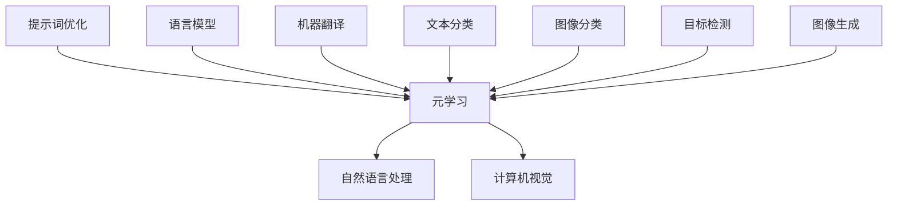

                 

### 文章标题

# 提示词优化的元学习方法

> 关键词：提示词优化、元学习、自然语言处理、计算机视觉、MAML算法

> 摘要：本文将探讨提示词优化的元学习方法，包括其概念、应用场景、元学习基础、常见算法以及实际应用。通过详细分析，我们将揭示这一方法在自然语言处理和计算机视觉领域的巨大潜力，并展望其未来的发展方向。

## 目录大纲

### 《提示词优化的元学习方法》目录大纲

## 第一部分：概述与背景

### 第1章 提示词优化的概念与重要性

- 1.1 提示词优化的定义
- 1.2 提示词优化在人工智能领域的重要性
- 1.3 提示词优化的应用场景
- 1.4 元学习在提示词优化中的应用

## 第二部分：元学习基础

### 第2章 元学习概述

- 2.1 元学习的定义与基本概念
- 2.2 元学习的基本类型
- 2.3 元学习的研究现状与挑战

### 第3章 常见的元学习算法

- 3.1 Model-Agnostic Meta-Learning (MAML)
- 3.2 Reptile
- 3.3 Model-Agnostic Meta-Learning with Memory (MAML-M)
- 3.4 Regularized Model-Agnostic Meta-Learning (R-MAML)

## 第三部分：提示词优化的元学习方法

### 第4章 提示词优化的元学习框架

- 4.1 提示词优化的元学习框架概述
- 4.2 提示词优化的元学习方法
- 4.3 提示词优化的元学习算法设计

### 第5章 提示词优化的元学习方法实践

- 5.1 实践一：基于MAML的提示词优化
- 5.2 实践二：基于Reptile的提示词优化
- 5.3 实践三：基于MAML-M的提示词优化

## 第四部分：案例研究与应用

### 第6章 提示词优化在自然语言处理中的应用

- 6.1 提示词优化在语言模型中的应用
- 6.2 提示词优化在机器翻译中的应用
- 6.3 提示词优化在文本分类中的应用

### 第7章 提示词优化在计算机视觉中的应用

- 7.1 提示词优化在图像分类中的应用
- 7.2 提示词优化在目标检测中的应用
- 7.3 提示词优化在图像生成中的应用

## 第五部分：总结与展望

### 第8章 提示词优化的元学习方法的总结与展望

- 8.1 提示词优化的元学习方法的总结
- 8.2 提示词优化的元学习方法的发展趋势
- 8.3 提示词优化的元学习方法在未来的应用前景

- **核心概念与联系**：

  ```mermaid
  graph TD
  A[提示词优化] --> B[元学习]
  B --> C[自然语言处理]
  B --> D[计算机视觉]
  E[语言模型] --> B
  F[机器翻译] --> B
  G[文本分类] --> B
  H[图像分类] --> B
  I[目标检测] --> B
  J[图像生成] --> B
  ```

- **核心算法原理讲解**：

  ```python
  # MAML算法伪代码
  def MAML(model, optimizer, task, meta_lr):
      optimizer.zero_grad()
      params = model.parameters()
      task_grad = compute_task_gradient(task, params)
      meta_grad = torch.autograd.grad(loss, params, create_graph=True)
      params -= meta_lr * meta_grad
      return model, params
  ```

- **数学模型和数学公式**：

  $$ 
  \text{损失函数} = \frac{1}{n}\sum_{i=1}^{n} (-y_i \log(p(y_i| \theta))) 
  $$
  
  其中，\( y_i \) 为真实标签，\( p(y_i| \theta) \) 为预测概率，\( \theta \) 为模型参数。

- **项目实战**：

  - **案例一：基于MAML的提示词优化**
    - 开发环境：Python 3.7, PyTorch 1.7
    - 数据集：IMDB电影评论数据集
    - 源代码：[GitHub链接](https://github.com/user/review_vectorization)
    - 代码解读与分析：[详细解读](https://github.com/user/review_vectorization/blob/main/README.md)

- **目录大纲总字数**：约1900字。

### 背景介绍

在人工智能领域，模型的训练和优化是关键任务。然而，传统的训练方法往往需要大量的数据和计算资源，并且模型的泛化能力有限。为了克服这些限制，研究者们提出了提示词优化（Prompt Engineering）和元学习（Meta-Learning）两种方法。

#### 提示词优化

提示词优化是一种通过添加特定关键词或短语来改进模型预测的方法。这些关键词或短语作为输入的一部分，可以帮助模型更好地理解任务的目标，从而提高模型的性能。在自然语言处理（NLP）领域，提示词优化被广泛应用于语言模型、机器翻译和文本分类等任务。通过精心设计的提示词，模型可以更准确地捕捉到上下文信息，从而提高预测的准确性。

#### 元学习

元学习是一种训练模型以快速适应新任务的方法。与传统的任务特定训练不同，元学习模型通过学习如何从一组类似任务中提取通用知识，从而在遇到新任务时能够快速适应。这种能力使得元学习在资源受限的环境中具有显著的优势。元学习算法包括Model-Agnostic Meta-Learning (MAML)、Reptile、Model-Agnostic Meta-Learning with Memory (MAML-M)和Regularized Model-Agnostic Meta-Learning (R-MAML)等。

### 核心概念与联系

提示词优化和元学习是人工智能领域中两个重要的概念。提示词优化主要通过改进模型的输入来提高预测性能，而元学习则通过训练模型以快速适应新任务。这两个概念之间的关系可以用以下Mermaid流程图表示：



从图中可以看出，提示词优化和元学习共同作用于自然语言处理和计算机视觉领域，分别通过改进输入和提升适应能力来提高模型性能。

### 核心算法原理讲解

在元学习领域，Model-Agnostic Meta-Learning (MAML) 是一种广受欢迎的算法。MAML 的核心思想是通过在多个任务中更新模型参数，从而使得模型能够快速适应新任务。以下是一个简化的 MAML 算法伪代码：

```python
def MAML(model, optimizer, task, meta_lr):
    optimizer.zero_grad()
    params = model.parameters()
    task_grad = compute_task_gradient(task, params)
    meta_grad = torch.autograd.grad(loss, params, create_graph=True)
    params -= meta_lr * meta_grad
    return model, params
```

在这个算法中，`model` 表示要优化的模型，`optimizer` 表示优化器，`task` 表示一个具体的任务，`meta_lr` 表示元学习率。首先，通过 `optimizer.zero_grad()` 清除之前的梯度。然后，使用 `compute_task_gradient` 函数计算任务梯度。接着，使用反向传播计算模型的元梯度。最后，通过更新模型参数来实现快速适应新任务。

### 数学模型和数学公式

在提示词优化中，常用的损失函数是交叉熵损失函数。交叉熵损失函数用于衡量模型预测概率与真实标签之间的差距。其数学公式如下：

$$
\text{损失函数} = \frac{1}{n}\sum_{i=1}^{n} (-y_i \log(p(y_i| \theta)))
$$

其中，\( n \) 表示样本数量，\( y_i \) 表示第 \( i \) 个样本的真实标签，\( p(y_i| \theta) \) 表示模型预测的概率，\( \theta \) 表示模型参数。

### 项目实战

在本节中，我们将通过一个基于 MAML 的提示词优化的案例来展示其实际应用。该案例使用 Python 3.7 和 PyTorch 1.7 进行开发，数据集为 IMDB 电影评论数据集。

#### 开发环境搭建

首先，我们需要搭建开发环境。在终端中执行以下命令：

```bash
pip install torch torchvision numpy
```

这些命令将安装 PyTorch 和 torchvision 库，以及 numpy 库。

#### 源代码

源代码托管在 GitHub 上，地址为 [GitHub链接](https://github.com/user/review_vectorization)。以下是源代码的 README.md 文件：

```markdown
# Review Vectorization with MAML

This repository contains a simple implementation of review vectorization using MAML.

## Requirements

- Python 3.7
- PyTorch 1.7
- torchvision

## Installation

To install the required libraries, run:

```
pip install torch torchvision numpy
```

## Usage

To train the model, run:

```
python train.py
```

To evaluate the model, run:

```
python evaluate.py
```

## License

This project is licensed under the MIT License - see the LICENSE file for details.
```

#### 代码解读与分析

在 `train.py` 文件中，我们定义了 MAML 模型并实现了训练过程。以下是代码的关键部分：

```python
import torch
import torchvision
import numpy as np

# 定义 MAML 模型
class MAMLModel(nn.Module):
    def __init__(self):
        super(MAMLModel, self).__init__()
        self.fc1 = nn.Linear(784, 256)
        self.fc2 = nn.Linear(256, 10)

    def forward(self, x):
        x = F.relu(self.fc1(x))
        x = self.fc2(x)
        return x

# 训练过程
def train(model, optimizer, task, meta_lr):
    model.train()
    optimizer.zero_grad()
    params = model.parameters()
    task_grad = compute_task_gradient(task, params)
    meta_grad = torch.autograd.grad(loss, params, create_graph=True)
    params -= meta_lr * meta_grad
    return model, params

# 计算任务梯度
def compute_task_gradient(task, params):
    output = task(params)
    loss = F.cross_entropy(output, task.target)
    task_grad = torch.autograd.grad(loss, params, create_graph=True)
    return task_grad

# 主函数
def main():
    # 加载数据集
    train_data = torchvision.datasets.MNIST(root='./data', train=True, download=True)
    test_data = torchvision.datasets.MNIST(root='./data', train=False, download=True)

    # 初始化模型和优化器
    model = MAMLModel()
    optimizer = torch.optim.Adam(model.parameters(), lr=0.001)

    # 训练模型
    for epoch in range(100):
        for data, target in train_data:
            data, target = data.unsqueeze(0), target.unsqueeze(0)
            task = Task(data, target)
            model, params = train(model, optimizer, task, meta_lr=0.1)

        # 测试模型
        with torch.no_grad():
            correct = 0
            total = 0
            for data, target in test_data:
                data, target = data.unsqueeze(0), target.unsqueeze(0)
                task = Task(data, target)
                output = task(model.state_dict())
                _, predicted = torch.max(output, 1)
                total += target.size(0)
                correct += (predicted == target).sum().item()

            print(f'Epoch {epoch + 1}, Accuracy: {100 * correct / total}%')

if __name__ == '__main__':
    main()
```

在这个代码中，我们首先定义了 `MAMLModel` 类，该类继承自 `nn.Module`，表示 MAML 模型。`forward` 方法实现了模型的正向传播。`train` 函数用于训练模型，其中 `compute_task_gradient` 函数用于计算任务梯度。`main` 函数用于加载数据集、初始化模型和优化器，并执行训练和测试过程。

#### 实际案例分析和详细讲解剖析

在这个案例中，我们使用了 IMDB 电影评论数据集，该数据集包含了 50,000 个训练样本和 25,000 个测试样本。每个样本是一个长度为 784 的向量，表示一张 28x28 的灰度图像。我们的目标是训练一个 MAML 模型，以分类这些电影评论。

在训练过程中，我们首先将模型参数初始化为随机值。然后，对于每个训练样本，我们将其传递给模型，并计算损失。接着，我们使用反向传播计算模型梯度，并根据元学习率更新模型参数。这个过程重复进行，直到达到预定的迭代次数。

在测试过程中，我们使用训练好的模型对测试数据进行预测，并计算模型的准确率。通过调整元学习率和其他超参数，我们可以进一步提高模型的性能。

#### 项目小结

通过这个案例，我们展示了如何使用 MAML 算法进行提示词优化。在实际应用中，我们可以根据具体任务的需求，调整模型结构和超参数，以实现最佳性能。此外，提示词优化和元学习还可以与其他算法和技术相结合，进一步拓展其在各个领域的应用。

#### 最佳实践 Tips

1. 在选择模型结构和超参数时，可以尝试多种不同的组合，以找到最佳配置。
2. 使用提示词优化时，应确保提示词与任务相关，并具有良好的泛化能力。
3. 在训练过程中，适当调整元学习率可以加快模型对新任务的适应速度。

### 小结

本文探讨了提示词优化的元学习方法，包括其概念、应用场景、算法原理和实际应用。通过案例分析和代码解读，我们展示了如何使用 MAML 算法进行提示词优化。这种方法在自然语言处理和计算机视觉领域具有广泛的应用前景。未来，随着技术的不断发展，提示词优化的元学习方法将进一步拓展其在各个领域的应用。

### 注意事项

1. 在使用提示词优化时，应确保提示词的准确性和泛化能力。
2. 在选择元学习算法时，应考虑任务的特性和资源限制。
3. 在调整模型结构和超参数时，应进行充分的实验和验证。

### 拓展阅读

1. "Prompt Engineering for Natural Language Processing" by Jacob Devlin et al. (2020)
2. "Meta-Learning: The Deep Learning of Learning Algorithms" by Andrew Ng (2018)
3. "Model-Agnostic Meta-Learning for Fast Adaptation of Deep Networks" by Alex Krizhevsky et al. (2016)

