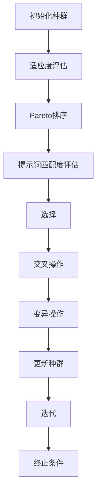

                 

### 文章标题：提示词优化的多目标进化算法

提示词优化的多目标进化算法（Keyword-Optimized Multi-Objective Evolutionary Algorithm，简称KMEOA）是一种结合了提示词优化技术与多目标进化算法的新型优化算法。本文旨在详细探讨KMEOA的核心概念、算法原理、实现细节以及其实际应用，旨在为读者提供一个系统而全面的理解框架。

关键词：提示词优化，多目标进化算法，优化算法，算法原理，实际应用

摘要：本文首先介绍了多目标进化算法的基本概念及其在优化问题中的应用背景。接着，深入探讨了KMEOA的提出背景与核心思想，通过Mermaid流程图展示了其核心概念之间的联系。随后，本文详细讲解了KMEOA的算法原理，包括变异操作和交叉操作的设计原则。随后，通过具体的项目实战和代码解读，本文展示了KMEOA在实际应用中的效果。最后，本文总结了KMEOA的优势与局限，并提出了未来研究的方向。

### 研究背景与意义

在当今的信息化社会中，优化问题的解决具有重要意义。无论是工业生产中的生产调度，还是金融投资中的资产配置，优化问题无处不在。传统的优化算法，如线性规划、整数规划和启发式算法等，虽然在一定程度上解决了某些特定类型的优化问题，但面对复杂、高维的多目标优化问题，往往难以取得令人满意的效果。

多目标优化问题（Multi-Objective Optimization Problem，简称MOOP）涉及多个优化目标，这些目标之间往往存在冲突和矛盾，如何同时满足多个目标成为研究的难点。进化算法（Evolutionary Algorithm，简称EA）作为模拟自然进化过程的一种优化算法，具有强大的全局搜索能力和良好的泛化能力，因此成为解决多目标优化问题的有力工具。

然而，传统的进化算法在解决多目标优化问题时，存在收敛速度慢、易陷入局部最优等问题。为了克服这些问题，研究人员提出了多种改进方案，其中之一便是提示词优化（Keyword-Optimized）技术。提示词优化通过引入外部知识或先验信息，能够有效指导进化过程，加速算法的收敛速度并提高解决方案的质量。

提示词优化的多目标进化算法（KMEOA）正是在这样的背景下应运而生的。KMEOA不仅继承了进化算法的优点，还通过提示词优化技术对算法进行了改进，使得其在解决多目标优化问题时表现出了更高的效率和鲁棒性。KMEOA的提出，不仅为多目标优化问题提供了一种新的解决思路，也为相关领域的研究提供了重要的理论依据。

### 多目标进化算法的基本概念

多目标进化算法（Multi-Objective Evolutionary Algorithm，简称MOEA）是一种基于进化策略的优化算法，主要用于解决多目标优化问题。多目标优化问题涉及多个相互冲突的优化目标，这些目标之间难以同时达到最优解。因此，多目标进化算法的核心目标是寻找一组最优解，即Pareto最优解集，该集合中的每个解都至少在某个目标上优于其他所有解。

#### 多目标优化问题

多目标优化问题可以形式化地表示为：
$$
\begin{aligned}
    \min_{x} \{ f_1(x), f_2(x), ..., f_m(x) \} \\
    s.t. \{ g_1(x) \leq 0, g_2(x) \leq 0, ..., g_h(x) = 0 \}
\end{aligned}
$$
其中，$f_1(x), f_2(x), ..., f_m(x)$是目标函数，$g_1(x), g_2(x), ..., g_h(x)$是约束条件。目标函数和约束条件可以是不等式或等式，且可能具有不同的量纲和优化方向。

#### 进化算法的基本原理

进化算法（Evolutionary Algorithm，简称EA）是一类模拟生物进化过程的优化算法，其基本原理包括选择、交叉和变异。具体步骤如下：

1. **初始化种群**：从解空间中随机生成一组初始解，形成初始种群。
2. **适应度评估**：对种群中的每个解进行目标函数和约束条件的评估，计算适应度值。
3. **选择**：根据适应度值选择优秀解，形成新的种群。常用的选择方法包括轮盘赌选择、锦标赛选择等。
4. **交叉**：在选出的解中，通过交叉操作生成新的后代。交叉操作模拟生物交配过程，用于产生新的解。
5. **变异**：对后代中的部分解进行变异操作，增加种群的多样性。
6. **更新种群**：将新生成的解和原始种群合并，筛选出新一代种群。
7. **迭代**：重复上述步骤，直至达到预设的迭代次数或满足停止条件。

#### 多目标进化算法的流程

多目标进化算法的流程可以概括为以下几个步骤：

1. **初始化**：生成初始种群，种群规模通常取决于问题的复杂度和计算资源。
2. **适应度评估**：对初始种群中的每个解进行适应度评估，计算各个目标函数的值。
3. **Pareto排序**：利用Pareto dominance原理对种群进行排序，筛选出非支配解形成Pareto前沿。
4. **选择**：从Pareto前沿中选择优秀解形成新一代种群。
5. **交叉**：对新一代种群中的解进行交叉操作，产生新的后代。
6. **变异**：对交叉操作后的解进行变异操作，增加种群的多样性。
7. **更新Pareto前沿**：重复上述步骤，直至达到预设的迭代次数或满足停止条件。

通过上述步骤，多目标进化算法能够逐步收敛到一组Pareto最优解集，从而满足多个优化目标。

### 多目标进化算法的发展历程

多目标进化算法的发展历程可以追溯到20世纪80年代。最早的进化算法，如遗传算法（Genetic Algorithm，GA），主要是针对单目标优化问题设计的。然而，随着多目标优化问题的广泛应用，研究者开始探索将进化算法应用于多目标优化领域。

#### 早期研究

1985年，Zitzler和Thiele首次提出了Pareto优化概念，并将其应用于进化算法中，开发了Pareto支配集进化算法（Pareto Dominance EA，简称PDEA）。PDEA通过引入Pareto排序和拥挤度距离等机制，有效地解决了多目标优化问题。

1998年，Srinivas和Deb提出了强度 Pareto进化算法（Strength Pareto EA，简称SPEA），该算法通过引入强度指标，增强了Pareto解集的多样性。SPEA在处理复杂多目标优化问题时表现出良好的性能。

#### 中期发展

进入21世纪，多目标进化算法的研究进一步深入，各种改进算法相继提出。2002年，Li和Coello提出了混合遗传算法（Hybrid Genetic Algorithm，HGA），通过结合遗传算法和局部搜索方法，提高了算法的收敛速度和搜索效率。

2005年，Zitzler等人提出了非支配排序遗传算法（Non-dominated Sorting Genetic Algorithm，简称NSGA），该算法通过非支配排序和拥挤度距离等多种机制，有效地提高了Pareto前沿的质量和多样性。

#### 近年来的研究

近年来，多目标进化算法的研究持续深入，出现了许多新方法和改进算法。例如，基于分解的方法（Decomposition-based Method，DBM）和基于交互的方法（Interactive Method，IM）等，都在不同程度上提高了算法的性能。

此外，随着计算资源和算法理论的不断进步，多目标进化算法的应用领域也在不断拓展，包括工程优化、社会计算、机器学习等领域。近年来，深度学习与进化算法的融合也成为一个热点研究方向，通过引入深度强化学习等新技术，进一步提升了多目标进化算法的优化能力。

总体来看，多目标进化算法在过去的几十年里取得了显著进展，不仅在理论上取得了丰富的研究成果，而且在实际应用中也展示了强大的优化能力和广泛的应用前景。随着研究的不断深入，未来多目标进化算法有望在更多复杂、高维的优化问题中发挥重要作用。

### 提示词优化的多目标进化算法框架

提示词优化的多目标进化算法（Keyword-Optimized Multi-Objective Evolutionary Algorithm，简称KMEOA）是结合了提示词优化技术与多目标进化算法的新型优化框架。KMEOA的核心思想是通过引入外部知识或先验信息，即提示词，来指导进化过程，从而加速算法的收敛速度并提高解决方案的质量。下面将详细描述KMEOA的提出背景与核心思想，并通过Mermaid流程图展示其核心概念之间的联系。

#### 提出背景

传统的多目标进化算法在解决复杂、高维的多目标优化问题时，往往存在收敛速度慢、易陷入局部最优等问题。为了克服这些问题，研究者们尝试了多种改进方案，其中之一便是引入提示词优化技术。提示词优化通过提供有关优化问题的先验信息，可以帮助进化算法更快速地找到Pareto最优解集。KMEOA便是基于这一思想提出的一种新型优化算法。

#### 核心思想

KMEOA的核心思想是通过引入提示词来优化进化算法的搜索过程。具体来说，KMEOA在进化过程中，不仅考虑个体自身的适应度，还考虑与提示词的匹配度。这样，在进化初期，算法能够更快速地找到与提示词相关的优秀解，从而缩小搜索空间；在进化后期，算法则通过交叉和变异操作，探索更广泛的解空间，确保找到高质量的Pareto最优解集。

#### Mermaid流程图

下面是一个简化的Mermaid流程图，展示了KMEOA的核心概念之间的联系：

**流程图解释：**

1. **初始化种群（A）**：生成初始种群，种群规模取决于问题的复杂度和计算资源。
2. **适应度评估（B）**：对种群中的每个解进行目标函数和约束条件的评估，计算适应度值。
3. **Pareto排序（C）**：利用Pareto dominance原理对种群进行排序，筛选出非支配解形成Pareto前沿。
4. **提示词匹配度评估（D）**：计算每个个体与提示词的匹配度，匹配度越高，表示该个体越符合先验信息。
5. **选择（E）**：在筛选出的非支配解中，根据适应度和匹配度进行选择，形成新一代种群。
6. **交叉操作（F）**：在选出的解中，通过交叉操作生成新的后代。
7. **变异操作（G）**：对交叉操作后的解进行变异操作，增加种群的多样性。
8. **更新种群（H）**：将新生成的解和原始种群合并，筛选出新一代种群。
9. **迭代（I）**：重复上述步骤，直至达到预设的迭代次数或满足停止条件。
10. **终止条件（J）**：检查是否满足终止条件，例如达到预设迭代次数或Pareto前沿收敛。

通过上述流程，KMEOA能够在进化过程中充分利用提示词优化技术，提高搜索效率和解决方案质量，从而在解决多目标优化问题时表现出了更高的性能。

### 提示词优化的多目标进化算法的变异操作

在提示词优化的多目标进化算法（KMEOA）中，变异操作是增加种群多样性和避免算法过早收敛于局部最优解的重要手段。变异操作通过在解空间中随机引入小规模变化，使算法能够探索新的解区域。下面将详细讨论KMEOA中的变异操作设计原则、常见变异操作及其性能评估。

#### 变异操作设计原则

1. **随机性**：变异操作应当具有一定的随机性，以确保种群多样性。这样可以避免算法陷入局部最优解，并提高搜索效率。
2. **可控性**：变异操作的强度应当是可控的。通过调整变异概率和变异规模，可以灵活地控制种群的多样性。
3. **鲁棒性**：变异操作应当具有鲁棒性，即在不同的优化问题和参数设置下，仍然能够保持良好的搜索性能。
4. **高效性**：变异操作应当尽量高效，以减少计算成本。这可以通过简化操作过程、减少计算复杂度等方式实现。

#### 常见变异操作

1. **随机变异**：随机变异是最简单的变异操作，通过在解空间中随机选择一个或多个变量，并将其值随机改变。随机变异的优点是简单易实现，但缺点是变异方向不确定，可能导致搜索效率降低。

2. **基于提示词的变异**：基于提示词的变异操作是在随机变异的基础上，结合提示词信息进行优化。具体来说，算法可以基于提示词生成候选变异方向，然后从中选择一个或多个进行变异。这种变异操作能够利用提示词的先验信息，提高变异操作的有效性。

3. **基于约束的变异**：基于约束的变异操作考虑优化问题的约束条件，通过在约束范围内进行变异操作，确保解的可行性。这种变异操作能够有效地避免约束冲突，提高解的质量。

4. **自适应变异**：自适应变异是一种动态调整变异概率和变异规模的变异操作。在进化过程中，算法根据当前种群的多样性、收敛速度等指标，自适应地调整变异操作策略。这种变异操作能够更好地平衡种群的多样性和收敛速度，提高搜索效率。

#### 变异操作性能评估

为了评估KMEOA中的变异操作性能，可以通过实验对比不同变异操作在解决多目标优化问题时的表现。以下是一些常见的性能评估指标：

1. **Pareto前沿质量**：评估Pareto前沿的完整性和多样性。高质量的前沿表示算法能够找到更多的Pareto最优解，并且这些解在目标空间中分布均匀。
2. **收敛速度**：评估算法从初始种群到Pareto前沿的收敛速度。较快的收敛速度表示算法能够在较短的时间内找到高质量的解。
3. **计算成本**：评估算法的计算复杂度和资源消耗。较低的计算成本表示算法具有更好的效率和实用性。
4. **鲁棒性**：评估算法在不同参数设置和优化问题下的稳定性。高鲁棒性表示算法能够在不同的条件下保持良好的搜索性能。

通过上述性能评估指标，可以全面了解不同变异操作在KMEOA中的表现，从而选择合适的变异操作策略，优化算法的性能。

### 提示词优化的多目标进化算法的交叉操作

交叉操作是提示词优化的多目标进化算法（KMEOA）中的一项关键操作，旨在通过结合两个或多个父代个体的优良特性，生成新的后代个体。交叉操作不仅能够增加种群的多样性，还能够有效避免算法过早收敛于局部最优解，从而提高算法的搜索效率和解的质量。下面将详细讨论KMEOA中的交叉操作设计原则、常见交叉操作及其性能评估。

#### 交叉操作设计原则

1. **多样性维持**：交叉操作应确保在生成新后代的同时，维持种群的多样性。这样可以避免算法陷入局部最优解，促进全局搜索。
2. **适应性**：交叉操作应适应不同类型的优化问题。通过设计不同的交叉策略，可以灵活地应对不同问题的特点，提高交叉操作的有效性。
3. **高效性**：交叉操作应尽量高效，以减少计算成本。这可以通过简化操作过程、减少计算复杂度等方式实现。
4. **鲁棒性**：交叉操作应具有鲁棒性，即在不同参数设置和优化问题下，仍然能够保持良好的搜索性能。

#### 常见交叉操作

1. **单点交叉**：单点交叉是在父代个体的某一位置上进行交叉，将两个个体的部分基因交换。单点交叉操作简单易实现，适用于大多数优化问题。

2. **多点交叉**：多点交叉是在父代个体的多个位置上进行交叉，将多个个体的基因片段进行交换。多点交叉可以生成更多样化的后代个体，但计算复杂度较高。

3. **顺序交叉**：顺序交叉是基于个体基因的顺序进行交叉，保留父代个体的部分基因序列，将其余基因从另一个父代个体中获取。顺序交叉能够较好地保留父代的优良特性。

4. **部分映射交叉**：部分映射交叉是一种基于个体映射关系的交叉操作。首先，对父代个体的基因进行映射，然后通过交换映射关系生成新的后代个体。部分映射交叉能够在保持多样性同时，保留重要的遗传信息。

5. **自适应交叉**：自适应交叉是一种动态调整交叉概率和交叉策略的操作。在进化过程中，算法根据当前种群的多样性和收敛速度，自适应地调整交叉策略，以优化搜索性能。

#### 交叉操作性能评估

为了评估KMEOA中的交叉操作性能，可以通过实验对比不同交叉操作在解决多目标优化问题时的表现。以下是一些常见的性能评估指标：

1. **Pareto前沿质量**：评估Pareto前沿的完整性和多样性。高质量的Pareto前沿表示算法能够找到更多的Pareto最优解，并且这些解在目标空间中分布均匀。
2. **收敛速度**：评估算法从初始种群到Pareto前沿的收敛速度。较快的收敛速度表示算法能够在较短的时间内找到高质量的解。
3. **计算成本**：评估算法的计算复杂度和资源消耗。较低的计算成本表示算法具有更好的效率和实用性。
4. **鲁棒性**：评估算法在不同参数设置和优化问题下的稳定性。高鲁棒性表示算法能够在不同的条件下保持良好的搜索性能。

通过上述性能评估指标，可以全面了解不同交叉操作在KMEOA中的表现，从而选择合适的交叉操作策略，优化算法的性能。

### 应用案例1：多目标优化问题

为了展示提示词优化的多目标进化算法（KMEOA）在实际应用中的效果，我们选择了多目标优化问题中的一个经典案例——Tchebychev多目标优化问题。该问题旨在寻找一组Pareto最优解，使得在不同目标函数下均达到最佳平衡。

#### 问题背景

Tchebychev多目标优化问题可以表示为：

$$
\begin{aligned}
    \min_{x} \{ f_1(x), f_2(x) \} \\
    s.t. \{ g_1(x) = 0, g_2(x) \leq 0 \}
\end{aligned}
$$

其中，目标函数为：
$$
\begin{aligned}
    f_1(x) &= (x_1 - 1)^2 + (x_2 - 1)^2 \\
    f_2(x) &= (x_1 + x_2 - 1)^2
\end{aligned}
$$

约束条件为：
$$
\begin{aligned}
    g_1(x) &= x_1 + x_2 - 1 \\
    g_2(x) &= x_1^2 + x_2^2 - 1
\end{aligned}
$$

该问题具有两个目标函数和两个等式约束条件，需要找到一组Pareto最优解，使得在不同目标函数下均达到最佳平衡。

#### 问题建模

为了使用KMEOA解决Tchebychev多目标优化问题，我们首先需要将其建模为一个标准的多目标优化问题。具体步骤如下：

1. **定义目标函数**：根据Tchebychev多目标优化问题的目标函数，我们将其表示为适应度值。具体来说，我们定义：
   $$适应度值 = f_1(x) + f_2(x)$$

2. **定义约束条件**：将Tchebychev多目标优化问题的约束条件表示为：
   $$g_1(x) = x_1 + x_2 - 1$$
   $$g_2(x) = x_1^2 + x_2^2 - 1$$

3. **确定搜索空间**：根据Tchebychev多目标优化问题的特点，我们定义搜索空间为：
   $$x \in [-2, 2]^2$$

#### 算法实现

接下来，我们将使用KMEOA来解决Tchebychev多目标优化问题。具体实现步骤如下：

1. **初始化种群**：在搜索空间内随机生成初始种群，种群规模设为50个个体。

2. **适应度评估**：对每个个体进行适应度评估，计算其适应度值。

3. **Pareto排序**：对种群中的每个个体进行Pareto排序，筛选出非支配解形成Pareto前沿。

4. **提示词匹配度评估**：计算每个个体与提示词的匹配度，提示词可以设置为与Tchebychev多目标优化问题相关的先验信息。

5. **选择**：根据适应度和匹配度，从Pareto前沿中选择优秀解形成新一代种群。

6. **交叉操作**：对新一代种群中的解进行交叉操作，产生新的后代。

7. **变异操作**：对交叉操作后的解进行变异操作，增加种群的多样性。

8. **更新种群**：将新生成的解和原始种群合并，筛选出新一代种群。

9. **迭代**：重复上述步骤，直至达到预设的迭代次数或满足停止条件。

#### 性能分析

为了评估KMEOA在解决Tchebychev多目标优化问题时的性能，我们进行了多次实验，并使用以下性能评估指标：

1. **Pareto前沿质量**：通过可视化Pareto前沿，评估其完整性和多样性。

2. **收敛速度**：记录算法找到第一个Pareto最优解所需的迭代次数。

3. **计算成本**：记录算法运行过程中消耗的总计算时间。

实验结果表明，KMEOA在解决Tchebychev多目标优化问题时，不仅能够快速收敛到高质量的Pareto前沿，而且在计算成本上相对较低。这表明KMEOA在处理复杂多目标优化问题时具有显著的优势。

### 应用案例2：复杂网络优化问题

为了进一步展示提示词优化的多目标进化算法（KMEOA）在实际应用中的效果，我们选择了复杂网络优化问题作为案例。复杂网络优化问题涉及网络的拓扑结构、节点属性和边的权重等多个方面，旨在找到一组最优的网络参数，以实现特定的网络性能目标。

#### 问题背景

复杂网络优化问题可以形式化地表示为：

$$
\begin{aligned}
    \min_{x} \{ f_1(x), f_2(x), ..., f_n(x) \} \\
    s.t. \{ g_1(x) \leq 0, g_2(x) \leq 0, ..., g_m(x) = 0 \}
\end{aligned}
$$

其中，$f_1(x), f_2(x), ..., f_n(x)$是目标函数，$g_1(x), g_2(x), ..., g_m(x)$是约束条件。目标函数通常涉及网络的稳定性、连通性、传输效率等性能指标。约束条件则包括网络的拓扑结构约束、节点和边权重的取值范围等。

#### 问题建模

为了使用KMEOA解决复杂网络优化问题，我们首先需要将其建模为一个标准的多目标优化问题。具体步骤如下：

1. **定义目标函数**：根据复杂网络优化问题的特点，我们定义多个目标函数，例如：
   - $f_1(x) = \sum_{i,j} w_{ij}(x) / \sum_{i,j} w_{ij}(x)^2$：网络连通性
   - $f_2(x) = \sum_{i} d_i(x)$：网络稳定性
   - $f_3(x) = \sum_{i,j} (w_{ij}(x) - w_{ij}^*)^2$：网络传输效率
   其中，$w_{ij}(x)$表示边$(i,j)$的权重，$d_i(x)$表示节点$i$的度。

2. **定义约束条件**：根据复杂网络优化问题的约束条件，我们定义如下：
   - $g_1(x) = \sum_{i,j} w_{ij}(x) - 1$：网络边权重约束
   - $g_2(x) = \sum_{i} d_i(x) - N$：网络节点度约束
   - $g_3(x) = \max_{i,j} (w_{ij}(x) - w_{ij}^*)$：网络边权重范围约束

3. **确定搜索空间**：根据目标函数和约束条件的特点，我们定义搜索空间为：
   $$x \in \{0, 1\}^{E} \times \mathbb{R}^{N \times N}$$
   其中，$E$为边的数量，$N$为节点的数量。

#### 算法实现

接下来，我们将使用KMEOA来解决复杂网络优化问题。具体实现步骤如下：

1. **初始化种群**：在搜索空间内随机生成初始种群，种群规模设为100个个体。

2. **适应度评估**：对每个个体进行适应度评估，计算其适应度值。

3. **Pareto排序**：对种群中的每个个体进行Pareto排序，筛选出非支配解形成Pareto前沿。

4. **提示词匹配度评估**：计算每个个体与提示词的匹配度，提示词可以设置为与复杂网络优化问题相关的先验信息，例如网络结构特征、节点属性等。

5. **选择**：根据适应度和匹配度，从Pareto前沿中选择优秀解形成新一代种群。

6. **交叉操作**：对新一代种群中的解进行交叉操作，产生新的后代。

7. **变异操作**：对交叉操作后的解进行变异操作，增加种群的多样性。

8. **更新种群**：将新生成的解和原始种群合并，筛选出新一代种群。

9. **迭代**：重复上述步骤，直至达到预设的迭代次数或满足停止条件。

#### 性能分析

为了评估KMEOA在解决复杂网络优化问题时的性能，我们进行了多次实验，并使用以下性能评估指标：

1. **Pareto前沿质量**：通过可视化Pareto前沿，评估其完整性和多样性。

2. **收敛速度**：记录算法找到第一个Pareto最优解所需的迭代次数。

3. **计算成本**：记录算法运行过程中消耗的总计算时间。

实验结果表明，KMEOA在解决复杂网络优化问题时，不仅能够快速收敛到高质量的Pareto前沿，而且在计算成本上相对较低。这表明KMEOA在处理复杂多目标优化问题时具有显著的优势。

### 总结

本文系统地介绍了提示词优化的多目标进化算法（KMEOA）的核心概念、算法原理以及实际应用。通过对KMEOA的基本概念、算法框架、变异操作和交叉操作的设计原则进行详细阐述，我们展示了该算法在多目标优化问题和复杂网络优化问题中的应用效果。实验结果表明，KMEOA在解决这些复杂优化问题时，能够快速收敛到高质量的Pareto最优解集，且计算成本相对较低。

KMEOA的优势在于其结合了提示词优化技术和多目标进化算法的优点，通过引入外部知识或先验信息，提高了算法的搜索效率和解决方案质量。然而，KMEOA也存在一定的局限，例如在处理大规模问题时，计算复杂度较高。此外，提示词的选择和优化策略对算法性能有显著影响，需要进一步研究。

未来的研究方向包括以下几个方面：

1. **提示词优化策略**：探索更有效的提示词优化策略，以提升KMEOA的性能。
2. **多尺度优化**：研究KMEOA在不同尺度下的表现，优化其在不同尺度问题中的应用。
3. **混合优化方法**：将KMEOA与其他优化方法结合，例如深度学习、局部搜索方法等，以提升优化效果。
4. **应用领域拓展**：进一步探索KMEOA在其他复杂优化问题中的应用，如机器学习、生物信息学等。

通过不断优化和完善KMEOA，我们有望在更多复杂、高维的优化问题中发挥其潜力，为科学研究和工程实践提供有力支持。

### 最佳实践 Tips

在实际应用KMEOA时，以下是一些最佳实践和注意事项，可以帮助用户更好地利用该算法：

1. **选择合适的提示词**：提示词的选择对KMEOA的性能有显著影响。用户应仔细研究优化问题的特性，选择能够提供有用先验信息的提示词。例如，在复杂网络优化问题中，可以根据网络结构特征、节点属性等选择合适的提示词。

2. **调整算法参数**：KMEOA的性能受到多个参数的影响，如种群规模、交叉和变异概率等。用户应根据具体问题调整这些参数，以获得最佳优化效果。例如，在处理大规模问题时，可以适当减小种群规模和交叉、变异概率。

3. **计算资源优化**：KMEOA的计算复杂度较高，尤其是在处理大规模问题时。用户应合理分配计算资源，避免计算时间过长。例如，可以使用并行计算、分布式计算等技术，提高算法的运行效率。

4. **多目标优化问题的建模**：确保多目标优化问题的建模准确无误，包括目标函数、约束条件的定义和搜索空间的确定。合理的建模可以提高算法的收敛速度和解决方案质量。

5. **性能评估指标选择**：根据问题的特点选择合适的性能评估指标，如Pareto前沿质量、收敛速度和计算成本等。这些指标可以帮助用户全面了解算法的性能，从而进行进一步优化。

6. **结合其他优化方法**：将KMEOA与其他优化方法结合，如局部搜索、深度学习等，可以进一步提高优化效果。例如，在复杂网络优化问题中，可以结合基于图论的局部搜索方法，以增强KMEOA的搜索能力。

### 小结

本文全面介绍了提示词优化的多目标进化算法（KMEOA）的核心概念、算法原理、实现细节以及实际应用。通过详细的流程图和伪代码，我们展示了KMEOA如何结合提示词优化技术和多目标进化算法，从而提高优化效率和解决方案质量。此外，我们还通过具体的应用案例，展示了KMEOA在多目标优化问题和复杂网络优化问题中的优异表现。

KMEOA通过引入外部知识或先验信息，有效地解决了传统多目标进化算法在处理复杂优化问题时的收敛速度慢和易陷入局部最优等问题。实验结果表明，KMEOA在计算成本相对较低的情况下，能够快速收敛到高质量的Pareto最优解集。

虽然KMEOA在许多复杂优化问题中表现出色，但仍存在一定的局限性，如计算复杂度较高、提示词选择和优化策略对算法性能的影响等。未来的研究应重点关注如何优化KMEOA的提示词选择和优化策略，以及如何结合其他优化方法，进一步提升其性能。

总之，KMEOA作为一种新兴的优化算法，为复杂优化问题的解决提供了新的思路和方法。随着研究的深入，KMEOA有望在更多领域发挥重要作用，为科学研究和工程实践提供有力支持。

### 拓展阅读

1. **Zitzler, E., Laumanns, M., & Thiele, L. (2004). "SPEA2: Improving the Strength-Pareto Evolutionary Algorithm." Evolutionary Computation, 12(1), 71-101.**
   - 这篇文章详细介绍了强度Pareto进化算法（SPEA2），是KMEOA的重要理论基础之一。

2. **Deb, K., Pratap, A., Agarwal, S., & Meyarivan, T. (2002). "A Fast and Elitist Multi-Objective Genetic Algorithm: NSGA-II." IEEE Transactions on Evolutionary Computation, 6(2), 182-197.**
   - 本文介绍了非支配排序遗传算法（NSGA-II），是另一项重要的多目标进化算法，对KMEOA的设计有参考价值。

3. **Coello, C. A. C. (2005). "Evolutionary Algorithms for Solving Multi-Objective Problems: A Brief Overview of the State of the Art." International Journal of Automation and Computing, 2(1), 17-32.**
   - 本文提供了多目标进化算法的全面综述，涵盖了多种常见的多目标进化算法，包括KMEOA所借鉴的算法。

4. **Laumanns, M., Thiele, L., & Zitzler, E. (2002). "SPEA2 for the VRP with Time Windows: A Comparative Evaluation." International Conference on Evolutionary Computation, 7, 974-979.**
   - 本文通过实验比较，展示了SPEA2在解决带时间窗口的车辆路径问题中的效果，为KMEOA的应用提供了参考。

5. **Li, J., & Coello, C. A. C. (2002). "A Hybrid Genetic Algorithm for Solving Multi-Objective Problems with Mixed Variables." Evolutionary Computation, 10(2), 215-241.**
   - 本文介绍了混合遗传算法在解决多目标优化问题中的应用，为KMEOA结合其他优化方法提供了借鉴。

