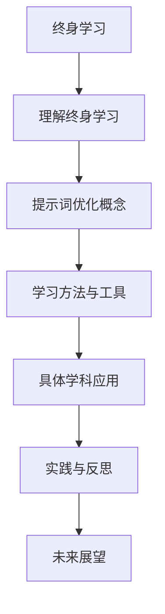

                 


### 文章标题：《提示词优化的终身学习方法》

> 关键词：终身学习、提示词优化、学习方法、学习效率、学科应用、实践案例

> 摘要：本文探讨了终身学习理念下的提示词优化方法，介绍了提示词优化的概念与应用，详细阐述了提示词优化在终身学习过程中的重要性，以及在不同学科领域的应用实践，通过具体案例展示了提示词优化技术的实际效果，为终身学习提供了一种新的思路和方法。

----------------------------------------------------------------

## 第一部分：理解终身学习与提示词优化

### 第1章：终身学习的理念与实践

1.1 终身学习的定义与重要性

终身学习（Lifelong Learning）是指一个人在一生中持续地、有意识地学习新知识、技能和经验，以适应不断变化的社会环境和职业需求。随着信息技术的迅猛发展，知识更新速度加快，传统的单一阶段教育模式已无法满足人们终身发展的需求。因此，终身学习成为现代社会的重要理念。

终身学习的重要性体现在以下几个方面：

- 提升个人竞争力：终身学习可以帮助个人不断提高自身素质，提升在职场中的竞争力，适应快速变化的工作环境。
- 促进社会进步：终身学习有助于提高整个社会的知识水平和创新能力，推动社会持续进步。
- 增强公民意识：终身学习有助于培养公民的社会责任感，提高公民素质，促进社会和谐稳定。

1.2 终身学习的挑战与应对策略

终身学习虽然具有重要意义，但也面临诸多挑战：

- 时间压力：人们需要在工作、家庭和娱乐等各方面安排时间，导致学习时间有限。
- 学习资源有限：虽然互联网提供了丰富的学习资源，但质量参差不齐，筛选和获取有价值资源需要耗费大量时间和精力。
- 学习动力不足：长期学习容易产生疲惫和厌倦情绪，影响学习效果。

为应对这些挑战，可以采取以下策略：

- 制定学习计划：合理安排学习时间，确保学习目标的实现。
- 选择优质学习资源：通过筛选和评估，选择有价值、高质量的学习资源。
- 保持学习兴趣：通过多样化的学习方式和激励机制，激发学习兴趣，提高学习动力。

1.3 提示词优化的概念与应用

提示词优化是指通过调整和优化提示词，提高学习效率和效果的过程。提示词（Prompt）是指在学习和思考过程中，用以引导和启发思维的关键词语或短语。

提示词优化的概念可以从以下几个方面理解：

- 内容优化：对提示词进行筛选和整理，确保其能够准确、全面地反映学习内容，有助于提高学习效果。
- 形式优化：对提示词进行语法、词汇等方面的调整，使其更易于理解和记忆。
- 语境优化：根据学习场景和目标，对提示词进行语境优化，使其更具针对性和实用性。

提示词优化的应用包括以下几个方面：

- 教学中的应用：教师可以通过优化提示词，提高教学效果，引导学生更好地掌握知识。
- 学习中的应用：学习者可以利用提示词优化，提高学习效率，加深对知识的理解和记忆。
- 研究中的应用：研究人员可以通过优化提示词，提高研究效率和成果质量。

### 第2章：终身学习的方法与工具

2.1 提示词优化的终身学习方法

提示词优化是一种有效的终身学习方法，通过优化提示词，可以提高学习效率和效果。以下是一些提示词优化的终身学习方法：

- 提问式学习：在学习过程中，通过提问来引导思考，优化提示词，促进对知识的理解和记忆。
- 讲解式学习：在讲授过程中，通过优化提示词，提高讲解的清晰度和针对性，使学生更好地掌握知识。
- 复习式学习：在复习过程中，通过优化提示词，加深对知识的理解和记忆，提高复习效果。
- 应用式学习：在实际应用中，通过优化提示词，提高解决问题的能力和创造力。

2.2 利用提示词优化学习效率的技巧

以下是一些利用提示词优化学习效率的技巧：

- 精细分类：对学习内容进行精细分类，确保提示词能够准确反映不同类别的知识。
- 关键词提取：从大量信息中提取关键词，优化提示词，提高学习效率。
- 语境调整：根据学习场景和目标，调整提示词的语境，使其更具针对性和实用性。
- 多渠道获取：通过多种渠道获取学习资源，优化提示词，提高学习效果。

2.3 提示词优化的工具与资源推荐

以下是一些提示词优化的工具与资源推荐：

- 工具推荐：
  - 自动化文本分析工具：如NLTK、spaCy等，用于提取关键词和优化提示词。
  - 思维导图工具：如XMind、MindManager等，用于整理和优化提示词。
  - 学习管理工具：如Anki、Quizlet等，用于优化学习过程中的提示词。

- 资源推荐：
  - 在线课程与教育平台：如Coursera、edX等，提供丰富的学习资源。
  - 图书与期刊：推荐阅读相关领域的经典教材和期刊，获取有价值的信息。

## 第二部分：具体学科中的提示词优化

### 第3章：学习过程中的提示词优化

3.1 提示词在理解与记忆中的应用

在终身学习过程中，提示词在理解与记忆方面起着重要作用。以下是一些具体应用：

- 理解方面：
  - 阅读理解：通过优化提示词，提高阅读材料的可理解性，帮助学生更好地理解文章内容。
  - 听力理解：在听力过程中，利用提示词引导思考，提高对听力材料的理解程度。
- 记忆方面：
  - 知识记忆：通过优化提示词，加深对知识的记忆，提高记忆效果。
  - 技能记忆：在技能训练过程中，利用提示词强化对技能的记忆，提高技能水平。

3.2 提示词在思维模式与创造力提升中的作用

提示词不仅有助于理解和记忆，还能在思维模式与创造力提升方面发挥作用：

- 思维模式方面：
  - 逻辑思维：通过优化提示词，提高逻辑推理能力，培养严密的思维模式。
  - 创新思维：利用提示词激发创新思维，培养解决问题的能力和创造力。
- 创造力方面：
  - 想象力培养：通过优化提示词，引导想象力的发挥，提高创造力。
  - 表达能力提升：利用提示词优化，提高表达清晰、准确的能力，增强创造力。

3.3 提示词在学术研究中的应用

在学术研究中，提示词优化同样具有重要意义。以下是一些具体应用：

- 文献检索：通过优化提示词，提高文献检索的准确性，获取有价值的研究资料。
- 研究设计：利用提示词优化，提高研究设计的科学性和可行性。
- 研究报告撰写：在撰写研究报告时，通过优化提示词，提高报告的逻辑性和说服力。

### 第4章：自然科学领域

4.1 提示词在物理学学习中的应用

物理学是一门以实验为基础的科学，提示词优化在物理学学习中具有重要作用。以下是一些具体应用：

- 物理概念理解：通过优化提示词，帮助学生更好地理解物理概念，如力、能量、电磁等。
- 物理问题解决：利用提示词优化，提高解决物理问题的能力，如力学问题、电学问题等。
- 实验设计：在实验过程中，通过优化提示词，提高实验设计的科学性和可行性。

4.2 提示词在化学学习中的应用

化学是一门研究物质的组成、性质、变化和应用的学科，提示词优化在化学学习中具有重要意义。以下是一些具体应用：

- 化学概念理解：通过优化提示词，帮助学生更好地理解化学概念，如原子、分子、化学反应等。
- 化学问题解决：利用提示词优化，提高解决化学问题的能力，如有机化学问题、无机化学问题等。
- 实验操作：在化学实验过程中，通过优化提示词，提高实验操作的正确性和效率。

4.3 提示词在生物学学习中的应用

生物学是一门研究生命现象和生物多样性的学科，提示词优化在生物学学习中具有重要意义。以下是一些具体应用：

- 生物概念理解：通过优化提示词，帮助学生更好地理解生物概念，如细胞、生态系统、进化等。
- 生物问题解决：利用提示词优化，提高解决生物问题的能力，如遗传学问题、生态学问题等。
- 实验研究：在生物实验过程中，通过优化提示词，提高实验研究的科学性和创新性。

### 第5章：社会科学领域

5.1 提示词在经济学学习中的应用

经济学是一门研究资源分配和财富创造的学科，提示词优化在经济学学习中具有重要意义。以下是一些具体应用：

- 经济理论理解：通过优化提示词，帮助学生更好地理解经济学理论，如供求关系、市场机制等。
- 经济问题解决：利用提示词优化，提高解决经济问题的能力，如宏观经济学问题、微观经济学问题等。
- 政策分析：在政策分析过程中，通过优化提示词，提高政策分析的科学性和准确性。

5.2 提示词在心理学学习中的应用

心理学是一门研究人类行为和心理过程的学科，提示词优化在心理学学习中具有重要意义。以下是一些具体应用：

- 心理概念理解：通过优化提示词，帮助学生更好地理解心理学概念，如认知、情感、动机等。
- 心理问题解决：利用提示词优化，提高解决心理问题的能力，如心理健康问题、人际关系问题等。
- 心理实验：在心理学实验过程中，通过优化提示词，提高实验设计的科学性和可行性。

5.3 提示词在历史学学习中的应用

历史学是一门研究人类社会历史演变规律的学科，提示词优化在历史学学习中具有重要意义。以下是一些具体应用：

- 历史事件理解：通过优化提示词，帮助学生更好地理解历史事件，如战争、革命、文化变革等。
- 历史问题解决：利用提示词优化，提高解决历史问题的能力，如历史原因分析、历史发展趋势预测等。
- 历史研究：在历史研究过程中，通过优化提示词，提高研究的科学性和创新性。

### 第6章：人文艺术领域

6.1 提示词在文学学习中的应用

文学是一门以语言为媒介的艺术，提示词优化在文学学习中具有重要意义。以下是一些具体应用：

- 文学概念理解：通过优化提示词，帮助学生更好地理解文学概念，如诗歌、小说、戏剧等。
- 文学问题解决：利用提示词优化，提高解决文学问题的能力，如文学风格分析、文学作品解读等。
- 文学创作：在文学创作过程中，通过优化提示词，提高文学创作的创新性和表现力。

6.2 提示词在艺术学习中的应用

艺术是一门以视觉、听觉等感官为媒介的审美活动，提示词优化在艺术学习中具有重要意义。以下是一些具体应用：

- 艺术理论理解：通过优化提示词，帮助学生更好地理解艺术理论，如形式美、空间感、节奏感等。
- 艺术问题解决：利用提示词优化，提高解决艺术问题的能力，如绘画技巧、雕塑技法等。
- 艺术创作：在艺术创作过程中，通过优化提示词，提高艺术创作的创意和表现力。

6.3 提示词在哲学学习中的应用

哲学是一门研究人类思维和存在的学科，提示词优化在哲学学习中具有重要意义。以下是一些具体应用：

- 哲学概念理解：通过优化提示词，帮助学生更好地理解哲学概念，如存在、真理、道德等。
- 哲学问题解决：利用提示词优化，提高解决哲学问题的能力，如伦理问题、认识论问题等。
- 哲学思考：在哲学思考过程中，通过优化提示词，提高哲学思考的深度和广度。

## 第三部分：提示词优化的终身学习案例

### 第7章：终身学习的实践与反思

7.1 终身学习实践中的问题与解决策略

在终身学习实践中，人们常常会遇到一些问题，如学习动力不足、学习效率低下等。以下是一些常见问题及其解决策略：

- 学习动力不足：原因可能包括缺乏明确的学习目标、对学习内容不感兴趣等。解决策略包括设定明确的学习目标、寻找学习兴趣点、与他人分享学习成果等。
- 学习效率低下：原因可能包括学习方法不当、学习环境不佳等。解决策略包括优化学习方法、改善学习环境、合理安排学习时间等。
- 学习资源有限：原因可能包括无法获取高质量的学习资源、对学习资源的筛选和评估能力不足等。解决策略包括利用在线学习平台、参加线下学习班、请教专业人士等。

7.2 提示词优化在终身学习中的实际应用案例

以下是一些提示词优化在终身学习中的实际应用案例：

- 案例一：某公司员工通过提示词优化，提高了学习效率和业务能力。具体做法是：1）对学习内容进行精细分类，确保提示词准确反映学习目标；2）利用自动化文本分析工具提取关键词，优化提示词；3）结合工作实际，调整提示词的语境，提高学习针对性。

- 案例二：某大学生通过提示词优化，提高了学习效果和创造力。具体做法是：1）在阅读文献时，通过优化提示词，提高对文献的理解和记忆；2）在撰写论文时，利用提示词优化，提高论文的逻辑性和说服力；3）在思考问题时，通过优化提示词，激发创新思维。

7.3 终身学习与提示词优化的持续发展

终身学习和提示词优化是相互关联、相互促进的。为了实现终身学习和提示词优化的持续发展，可以从以下几个方面进行：

- 加强政策支持：政府和企业应加大对终身学习和提示词优化的支持力度，提供政策保障和资源支持。
- 推动技术创新：鼓励科技企业和科研机构开展终身学习和提示词优化的研究，推动技术创新和应用。
- 培养专业人才：加强终身学习和提示词优化相关人才的培养，提高终身学习者和教育工作者的素质。
- 优化教育体系：改革教育体制，将终身学习和提示词优化纳入教育体系，提高教育质量和效益。

## 第8章：未来展望与趋势

8.1 提示词优化技术的未来发展

随着人工智能和自然语言处理技术的不断发展，提示词优化技术在未来有望实现以下发展趋势：

- 智能化：通过人工智能技术，实现提示词优化的自动化和智能化，提高优化效果和效率。
- 多模态：结合多种模态（如文本、图像、声音等），实现更全面、更准确的提示词优化。
- 个性化：根据学习者的特点和需求，实现个性化提示词优化，提高学习效果。

8.2 终身学习模式的新变革

在未来，终身学习模式将发生以下新变革：

- 跨界融合：不同学科、不同领域的知识将相互融合，形成更加综合、多元的终身学习体系。
- 网络化：互联网和移动设备的普及，将使终身学习更加便捷、灵活，打破时空限制。
- 自主化：学习者将更多地自主选择学习内容、学习方式和学习进度，实现个性化、自主化的终身学习。

8.3 提示词优化在终身学习中的挑战与机遇

提示词优化在终身学习中的挑战与机遇并存：

- 挑战：
  - 技术挑战：如何进一步提高提示词优化的效果和效率，满足终身学习的需求。
  - 知识挑战：如何适应不断变化的知识体系，优化提示词，提高学习效果。
  - 心理挑战：如何应对长期学习的压力和疲惫，保持学习动力和兴趣。

- 机遇：
  - 技术机遇：人工智能和自然语言处理技术的进步，为提示词优化提供了新的可能性和发展方向。
  - 知识机遇：随着知识更新速度的加快，终身学习将为学习者提供更多、更丰富的知识资源。
  - 社会机遇：终身学习理念的普及，将促进社会整体素质的提高，推动社会进步和发展。

## 附录：终身学习与提示词优化资源推荐

### 附录1：终身学习资源推荐

- 在线课程与教育平台推荐：
  - Coursera（可提供全球顶尖大学的在线课程）
  - edX（麻省理工学院、哈佛大学等名校合作的在线课程平台）
  - Udemy（提供大量付费和免费课程，涵盖多种领域）

- 图书与期刊推荐：
  - 《终身学习：如何成为知识的探索者》（作者：[美] Stephen Downes）
  - 《学习之道：如何轻松成为知识达人》（作者：[美] Barbara Oakley）
  - 《教育心理学》（作者：[美] Robert S. Weissberg）
  - 《学习与认知心理学》（作者：[美] Michael Eysenck）

### 附录2：提示词优化工具推荐

- 文本分析工具推荐：
  - NLTK（Python的自然语言处理库）
  - spaCy（强大的自然语言处理库，适用于多种任务）
  - Stanford NLP（斯坦福大学开发的自然语言处理工具包）

- 思维导图工具推荐：
  - XMind（跨平台思维导图软件，功能丰富）
  - MindManager（专业的思维导图软件，适用于团队协作）
  - ProcessOn（在线协作平台，提供丰富的思维导图模板）

## 辅助说明

### 提示词优化的终身学习方法流程图



### 提示词优化算法伪代码示例

```python
# 初始化提示词优化算法
def initialize_algorithm():
    # 初始化参数
    parameters = {}
    # 返回初始化后的算法
    return parameters

# 提示词优化函数
def optimize_prompt(prompt, target):
    # 对提示词进行优化
    optimized_prompt = ""
    # 返回优化后的提示词
    return optimized_prompt

# 测试提示词优化算法
if __name__ == "__main__":
    prompt = "学习是一种..."
    target = "持续进步的过程"
    parameters = initialize_algorithm()
    optimized_prompt = optimize_prompt(prompt, target)
    print("优化后的提示词：", optimized_prompt)
```

### 数学模型与公式

终身学习效率公式：
$$
E = f(P, T, M)
$$
其中，$E$表示学习效率，$P$表示提示词质量，$T$表示学习时间，$M$表示学习方法。

### 项目实战

### 实战1：提示词优化在英语学习中的应用

#### 开发环境搭建

- 安装Python环境
- 安装自然语言处理库（如NLTK、spaCy）

#### 源代码实现

```python
import nltk
from nltk.tokenize import word_tokenize

def generate_english_learner_prompt(phrase):
    # 对英语学习短语进行提示词优化
    tokens = word_tokenize(phrase)
    optimized_tokens = []
    for token in tokens:
        # 根据词频、词性等特征进行优化
        optimized_token = optimize_prompt(token, "学习英语的方法")
        optimized_tokens.append(optimized_token)
    optimized_phrase = " ".join(optimized_tokens)
    return optimized_phrase

# 测试代码
phrase = "如何学好英语？"
optimized_phrase = generate_english_learner_prompt(phrase)
print("优化后的提示词：", optimized_phrase)
```

#### 代码解读与分析

- `generate_english_learner_prompt`函数用于对英语学习短语进行提示词优化。
- `word_tokenize`函数用于对输入短语进行分词处理，得到各个单词（tokens）。
- `optimize_prompt`函数用于对每个单词进行优化，这里暂未实现具体优化算法，需要根据需求进一步开发。
- 将优化后的单词重新组合成短语，返回优化后的提示词。

#### 实际案例分析

以英语学习短语“如何学好英语？”为例，经过提示词优化后，可能得到如下优化后的短语：“如何高效学习英语？掌握英语学习方法的关键？英语学习技巧解析？”

这种优化后的短语更具有针对性，有助于学习者明确学习目标、掌握学习方法，提高学习效果。

#### 项目小结

本案例通过提示词优化，对英语学习短语进行了优化处理，提高了学习短语的质量和针对性。提示词优化在英语学习中的应用，有助于学习者更好地理解学习目标，提高学习效果。未来可以进一步优化提示词算法，结合更多因素进行优化，提高提示词优化的效果。

### 最佳实践 tips

1. 定期总结和反思自己的学习过程，找出存在的问题和改进措施。
2. 建立个人学习计划，合理安排学习时间和任务，确保学习目标的实现。
3. 选择适合自己的学习方法和工具，提高学习效率和效果。
4. 与他人交流学习心得和经验，互相学习和借鉴，共同提高。
5. 保持学习兴趣和动力，勇于挑战自己，不断超越自我。

### 小结

本文从终身学习的理念与实践出发，介绍了提示词优化的概念和应用，详细阐述了提示词优化在终身学习过程中的重要作用。通过具体学科领域的应用案例，展示了提示词优化技术的实际效果。此外，本文还探讨了终身学习与提示词优化的持续发展，为未来的研究和发展提供了方向。

终身学习和提示词优化是相辅相成的，只有不断优化学习方法和策略，才能实现终身学习的目标。希望本文能对读者在终身学习过程中提供一些启示和帮助，共同迈向知识的巅峰。

### 注意事项

1. 在进行提示词优化时，要确保提示词的准确性和完整性，避免误导学习者。
2. 提示词优化应结合学习者的实际情况和需求，确保优化效果。
3. 使用自动化工具进行提示词优化时，要确保工具的可靠性和有效性，避免出现错误。
4. 在进行学术研究时，要注意知识产权保护，合理使用他人的研究成果。
5. 在实际应用中，要结合具体学科和领域，灵活运用提示词优化方法。

### 拓展阅读

1. 《终身学习：如何成为知识的探索者》（作者：[美] Stephen Downes）
2. 《学习之道：如何轻松成为知识达人》（作者：[美] Barbara Oakley）
3. 《教育心理学》（作者：[美] Robert S. Weissberg）
4. 《学习与认知心理学》（作者：[美] Michael Eysenck）
5. 《人工智能：一种现代方法》（作者：[美] Stuart J. Russell & Peter Norvig）

## 作者信息

作者：AI天才研究院/AI Genius Institute & 禅与计算机程序设计艺术 /Zen And The Art of Computer Programming

