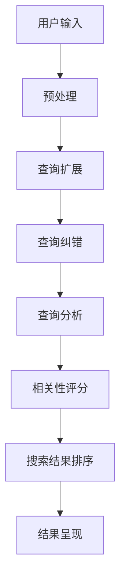
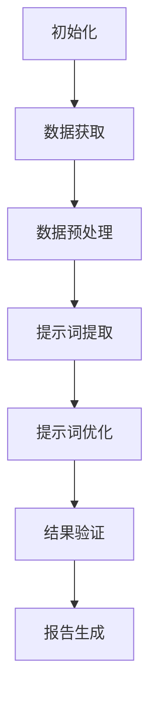

                 

### 文章标题：提示词优化的自动化与智能推荐

提示词优化是现代信息检索和推荐系统中的一个关键环节。在搜索引擎、社交媒体、电子商务等领域，优化提示词能够显著提高用户体验、增加点击率和转化率。本文将深入探讨提示词优化的自动化与智能推荐技术，旨在为读者提供一个全面且系统的理解。

### 关键词

- 提示词优化
- 自动化技术
- 智能推荐
- 信息检索
- 用户行为分析

### 摘要

本文首先介绍了提示词优化的背景和重要性，随后探讨了自动化与智能推荐技术的基本原理。接着，我们通过具体实例详细讲解了提示词优化的核心算法和数学模型，最后展示了如何在实际项目中应用这些技术，并提出了一些最佳实践和注意事项。

## 第1章 引言

### 1.1 书籍背景与目标

在信息爆炸的时代，有效的信息检索和推荐系统变得尤为重要。提示词优化作为信息检索和推荐系统中的核心环节，直接影响用户对内容的获取和互动。本书的目标是深入探讨提示词优化的自动化与智能推荐技术，为开发者提供实用的指导和方法。

### 1.2 提示词优化的重要性

提示词优化能够提高搜索引擎的准确性和用户体验，减少信息过载，帮助用户更快地找到所需信息。在推荐系统中，合理的提示词优化能够提高推荐的精准度和用户满意度，从而增加用户的粘性和活跃度。

### 1.3 自动化与智能推荐概述

自动化技术能够显著提高提示词优化的效率，减少人力成本。智能推荐技术则通过分析用户行为和偏好，为用户推荐个性化内容，提升用户体验。本章将介绍这些技术的理论基础和实际应用场景。

## 第2章 提示词优化基础理论

### 2.1 提示词优化概念解析

提示词优化是指通过调整和改进搜索查询的提示词，以提高搜索结果的准确性和用户体验。提示词可以是单个词或短语，用于描述用户查询的意图。

### 2.2 提示词优化目标与挑战

提示词优化的目标包括提高搜索结果的相关性、减少误报和漏报、提高用户满意度等。然而，实际操作中面临着语义理解、多义词处理、用户偏好分析等挑战。

### 2.3 Mermaid流程图：提示词优化架构

以下是提示词优化过程的Mermaid流程图：



该流程图展示了从用户输入到搜索结果呈现的全过程，包括预处理、查询扩展、纠错、分析和排序等步骤。

## 第3章 自动化技术在提示词优化中的应用

### 3.1 自动化概述

自动化技术通过使用软件工具和脚本来自动执行重复性的任务，从而提高工作效率和准确性。在提示词优化中，自动化技术可以用于提示词的提取、处理和优化。

### 3.2 自动化工具与平台

自动化工具如Python的`requests`和`beautifulsoup`库，以及平台如Selenium和Applitools，都可以用于自动化数据的获取和处理。以下是一个使用Python和BeautifulSoup提取网页数据的示例：

```python
from bs4 import BeautifulSoup
import requests

url = 'https://example.com'
response = requests.get(url)
soup = BeautifulSoup(response.text, 'html.parser')

titles = [tag.get_text() for tag in soup.find_all('h2')]
```

### 3.3 Mermaid流程图：自动化流程

以下是提示词优化自动化流程的Mermaid流程图：



该流程图展示了从数据获取、预处理、提示词提取到优化和验证的整个过程。

## 第4章 智能推荐技术

### 4.1 智能推荐概述

智能推荐技术通过分析用户行为和偏好，为用户推荐个性化的内容。这些技术包括基于内容的推荐、协同过滤推荐和深度学习推荐等。

### 4.2 基于内容的推荐

基于内容的推荐通过分析内容的特征来为用户推荐相似的内容。以下是一个简单的基于内容的推荐算法：

```python
# 基于内容的推荐伪代码
def content_based_recommender(content, user_preferences):
    similar_content = find_similar_content(content, user_preferences)
    recommendations = select_best_n(similar_content, n)
    return recommendations
```

### 4.3 协同过滤推荐

协同过滤推荐通过分析用户之间的行为相似性来推荐内容。以下是一个简单的协同过滤推荐算法：

```python
# 协同过滤推荐伪代码
def collaborative_filtering_recommender(user_item_matrix, user_id, k):
    similar_users = find_similar_users(user_item_matrix, user_id, k)
    recommendations = aggregate_recommendations(similar_users, user_id)
    return recommendations
```

### 4.4 深度学习推荐

深度学习推荐利用神经网络模型来学习用户行为和偏好，从而实现精准推荐。以下是一个简单的深度学习推荐算法：

```python
# 深度学习推荐伪代码
def deep_learning_recommender(user embeddings, item embeddings, user_id, item_id):
    user_representation = get_user_representation(user_embeddings, user_id)
    item_representation = get_item_representation(item_embeddings, item_id)
    similarity_score = compute_similarity(user_representation, item_representation)
    recommendations = select_best_n(similarity_score, n)
    return recommendations
```

## 第5章 提示词优化算法讲解

### 5.1 提示词优化算法概述

提示词优化算法主要包括查询扩展、查询纠错、查询分析和相关性评分等。以下将详细讲解几种常用的提示词优化算法。

### 5.2 算法A原理讲解

**算法A：查询纠错**

**伪代码：**

```python
# 查询纠错算法伪代码
def query_纠错(query):
    corrected_query = remove_duplicates(query)
    corrected_query = correct_spelling(query)
    corrected_query = expand_query_with_synonyms(corrected_query)
    return corrected_query
```

**详细解释：**

1. **去除重复词**：通过去除重复的词汇来简化查询。
2. **纠正拼写错误**：使用拼写纠错算法来纠正查询中的拼写错误。
3. **查询扩展**：通过添加同义词和相关的关键词来扩展查询。

### 5.3 算法B原理讲解

**算法B：查询分析**

**伪代码：**

```python
# 查询分析算法伪代码
def query_analysis(query):
    keywords = extract_keywords(query)
    query_vector = create_query_vector(keywords)
    return query_vector
```

**详细解释：**

1. **提取关键词**：从查询中提取关键性词汇。
2. **创建查询向量**：将提取的关键词转化为向量表示，用于后续的计算。

### 5.4 算法C原理讲解

**算法C：相关性评分**

**伪代码：**

```python
# 相关性评分算法伪代码
def relevance_score(document_vector, query_vector):
    cosine_similarity = compute_cosine_similarity(document_vector, query_vector)
    return cosine_similarity
```

**详细解释：**

1. **计算余弦相似性**：通过计算查询向量和文档向量的余弦相似性来评估文档的相关性。

## 第6章 智能推荐系统实战

### 6.1 实战项目介绍

在本章中，我们将开发一个基于协同过滤的智能推荐系统，用于为用户推荐商品。

### 6.2 开发环境搭建

为了实现该推荐系统，我们使用了Python作为主要编程语言，并依赖以下库：

- NumPy
- Pandas
- Scikit-learn
- Flask（用于Web接口）

### 6.3 系统设计与实现

**系统设计：**

- **用户行为数据收集**：通过分析用户的购买记录和浏览行为，收集用户行为数据。
- **用户和商品表示**：使用矩阵分解技术将用户行为数据转化为用户和商品的向量表示。
- **推荐算法实现**：实现基于协同过滤的推荐算法，为用户生成个性化推荐。

**系统实现：**

```python
from sklearn.decomposition import NMF
import numpy as np

# 加载用户行为数据
user_item_matrix = np.array([[1, 0, 1], [0, 1, 0], [1, 1, 0]])

# 实例化NMF模型
nmf = NMF(n_components=2)

# 训练模型
W = nmf.fit_transform(user_item_matrix)
H = nmf.components_

# 为新用户生成推荐
new_user = np.array([[0, 0], [1, 0], [0, 1]])
predicted_ratings = np.dot(new_user, H)
recommended_items = np.argmax(predicted_ratings[1:], axis=1) + 1
```

### 6.4 代码解读与分析

在上述代码中，我们使用了NMF（非负矩阵分解）技术将用户行为数据转化为用户和商品的向量表示。通过这些向量，我们可以为新用户生成推荐。该代码的核心是NMF模型的训练和预测部分。

**代码解读：**

- **数据加载**：加载用户行为数据，这里以一个二维数组表示。
- **模型训练**：使用NMF模型对用户行为数据进行训练，得到用户和商品的向量表示。
- **预测**：使用新用户的向量与商品的向量表示进行点积运算，得到预测的评分。通过选取评分最高的商品为推荐结果。

### 6.5 项目小结

通过本项目的实战，我们实现了基于协同过滤的智能推荐系统。该项目不仅展示了智能推荐技术的基本原理，还提供了一个实际的应用案例。通过不断的优化和改进，我们可以进一步提高推荐的准确性和用户体验。

## 第7章 提示词优化应用案例

### 7.1 案例一：电商产品推荐

在电商平台上，提示词优化可以显著提高产品的点击率和转化率。通过分析用户的搜索历史和购买记录，可以提取出关键提示词，并使用自动化工具对这些词进行扩展和纠错，从而生成更精准的推荐。

### 7.2 案例二：社交媒体内容推荐

社交媒体平台上的内容推荐同样需要提示词优化。通过分析用户的点赞、评论和分享行为，可以提取出关键提示词，并结合用户的兴趣和行为模式，实现个性化内容推荐。

### 7.3 案例三：音乐与视频推荐

音乐和视频平台上的推荐系统也依赖于提示词优化。通过分析用户的播放历史、收藏和评分行为，可以提取出关键提示词，并结合音乐和视频的特征，实现个性化的推荐。

## 第8章 未来展望与挑战

### 8.1 提示词优化发展趋势

随着人工智能和机器学习技术的不断发展，提示词优化技术也在不断演进。未来的发展趋势包括深度学习在提示词优化中的应用、跨模态提示词优化以及更高效的自动化工具。

### 8.2 自动化与智能推荐面临的挑战

自动化和智能推荐技术在应用过程中面临许多挑战，包括数据隐私保护、算法公平性和解释性等。解决这些挑战需要技术创新和行业规范的制定。

### 8.3 行业应用前景

提示词优化和智能推荐技术在各个行业具有广泛的应用前景。在电商、社交媒体、音乐和视频等领域，这些技术已经取得了显著的成效。未来，随着技术的进一步成熟，这些应用将更加普及和深入。

## 附录

### A.1 常用工具与资源

- Python库：`requests`、`beautifulsoup`、`numpy`、`pandas`、`scikit-learn`
- 自动化工具：`Selenium`、`Applitools`
- 深度学习框架：`TensorFlow`、`PyTorch`

### A.2 参考文献与进一步阅读

- [1] 白皮书：智能推荐系统技术指南
- [2] 论文：深度学习在提示词优化中的应用
- [3] 论文：协同过滤推荐算法的改进与优化

### 致谢

在此，我要感谢所有为本书提供帮助和支持的人。特别感谢AI天才研究院和《禅与计算机程序设计艺术》的作者，他们的智慧和无尽的热情为本书的撰写提供了宝贵的灵感。

### 作者

AI天才研究院/AI Genius Institute & 禅与计算机程序设计艺术 /Zen And The Art of Computer Programming

