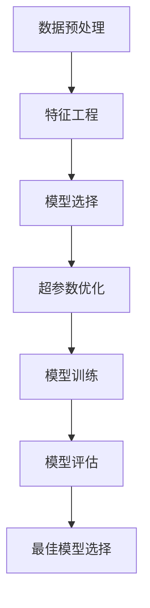
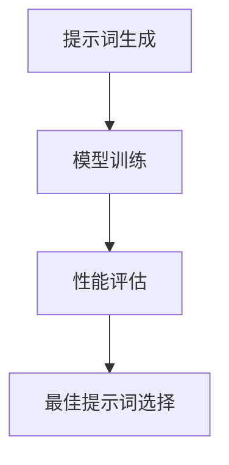
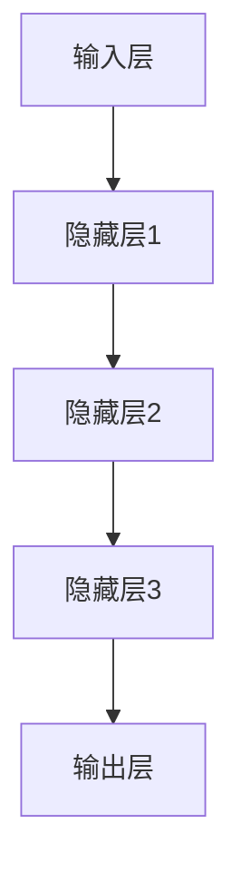

                 


### 文章标题

《提示词优化的自动机器学习方法》

### 文章关键词

提示词优化、自动机器学习、深度学习、神经网络、优化算法、数学模型、实际应用

### 文章摘要

本文将深入探讨提示词优化的自动机器学习方法。首先，我们将介绍背景和核心概念，包括提示词、自动机器学习、神经网络等。接着，通过Mermaid流程图展示核心概念之间的联系，并详细讲解相关算法原理和数学模型。最后，我们将通过实战案例，详细介绍开发环境搭建、源代码实现、代码解读以及实际案例分析和项目小结，为读者提供全面的技术指导。

## 目录

1. **背景介绍**
   - 自动机器学习的发展背景
   - 提示词优化的概念与意义

2. **核心概念与联系**
   - 提示词
   - 自动机器学习
   - 神经网络
   - Mermaid流程图

3. **核心算法原理讲解**
   - 优化算法
   - 神经网络算法
   - 伪代码实现

4. **数学模型和数学公式讲解**
   - 常用数学模型
   - 数学公式讲解
   - 举例说明

5. **项目实战**
   - 开发环境搭建
   - 源代码实现
   - 代码解读
   - 实际案例分析和讲解
   - 项目小结

6. **最佳实践 tips**
   - 注意事项
   - 拓展阅读

7. **小结与展望**

### 背景介绍

#### 自动机器学习的发展背景

自动机器学习（Automated Machine Learning，简称AutoML）是近年来人工智能领域的一个重要研究方向。随着大数据和深度学习技术的发展，机器学习应用的需求日益增长。然而，机器学习模型的构建过程复杂，需要大量的专业知识和经验。这使得机器学习在许多实际应用场景中面临巨大挑战。

自动机器学习旨在自动化机器学习模型的开发过程，从而降低构建机器学习模型的门槛，提高开发效率。其核心思想是通过自动搜索、优化和调整模型参数，使得模型能够在给定数据集上达到最佳性能。自动机器学习的研究目标包括自动特征选择、模型选择、超参数优化、模型训练和评估等。

#### 提示词优化的概念与意义

提示词优化（Prompt Optimization）是自动机器学习中的一个重要研究方向。在机器学习中，提示词（Prompt）是一种引导模型预测的方式，通过向模型输入特定的提示词，可以影响模型的输出结果。提示词优化旨在找到最佳的提示词组合，使得模型在特定任务上取得最佳性能。

提示词优化的意义在于，它可以提高模型的泛化能力，降低过拟合风险，从而提高模型的实用性和可靠性。在自然语言处理、计算机视觉、推荐系统等应用领域，提示词优化已经显示出显著的性能提升。

### 核心概念与联系

在本章节中，我们将介绍自动机器学习、提示词优化、神经网络等核心概念，并通过Mermaid流程图展示它们之间的联系。

#### 自动机器学习

自动机器学习（AutoML）是指通过自动化工具和算法，帮助用户快速构建高性能机器学习模型的过程。它涵盖了以下关键步骤：

1. **数据预处理**：自动处理和清洗输入数据，包括数据去重、缺失值填充、异常值处理等。
2. **特征工程**：自动提取和选择特征，以最大化模型性能。
3. **模型选择**：自动选择适合任务的机器学习模型，包括监督学习、无监督学习和强化学习等。
4. **超参数优化**：自动调整模型超参数，以找到最佳性能配置。
5. **模型训练和评估**：自动训练模型，并在多个评估指标上进行评估，以选择最佳模型。

Mermaid流程图：



#### 提示词优化

提示词优化（Prompt Optimization）是一种在机器学习中利用特定提示词来引导模型预测的方法。提示词可以是自然语言文本、图像、音频等多种形式。在自然语言处理领域，提示词通常用于引导模型生成文本、回答问题等。

提示词优化的关键步骤包括：

1. **提示词生成**：根据任务需求生成合适的提示词。
2. **模型训练**：将提示词与模型输入进行结合，训练模型。
3. **性能评估**：通过在测试集上的性能评估，选择最佳提示词组合。

Mermaid流程图：



#### 神经网络

神经网络（Neural Networks）是一种模拟人脑神经元结构的计算模型，广泛应用于机器学习和人工智能领域。神经网络的核心思想是通过多层非线性变换，将输入映射到输出。

神经网络的组成包括：

1. **输入层**：接收外部输入数据。
2. **隐藏层**：进行非线性变换，传递信息。
3. **输出层**：生成最终输出结果。

Mermaid流程图：



### 核心算法原理讲解

在本章节中，我们将介绍提示词优化的自动机器学习中的核心算法原理，包括优化算法和神经网络算法。

#### 优化算法

优化算法是自动机器学习中的一个关键组成部分，主要用于调整模型参数，以实现模型性能的最优化。以下是几种常用的优化算法：

1. **梯度下降（Gradient Descent）**

   梯度下降是一种最简单的优化算法，通过计算损失函数关于模型参数的梯度，并沿着梯度的反方向更新参数，以最小化损失函数。

   伪代码：

   ```python
   for epoch in range(num_epochs):
       for data in dataset:
           predictions = model(data)
           loss = loss_function(predictions, true_labels)
           gradients = model.compute_gradients(loss)
           model.update_parameters(gradients)
   ```

2. **随机梯度下降（Stochastic Gradient Descent，SGD）**

   随机梯度下降是对梯度下降算法的一种改进，每次迭代只随机选择一部分数据计算梯度，从而提高计算效率。

   伪代码：

   ```python
   for epoch in range(num_epochs):
       shuffled_dataset = shuffle(dataset)
       for batch in shuffled_dataset:
           predictions = model(batch)
           loss = loss_function(predictions, true_labels)
           gradients = model.compute_gradients(loss)
           model.update_parameters(gradients)
   ```

3. **Adam优化器**

   Adam优化器是一种结合了SGD和Momentum优化的自适应优化器，具有更好的收敛性和稳定性。

   伪代码：

   ```python
   for epoch in range(num_epochs):
       for batch in dataset:
           predictions = model(batch)
           loss = loss_function(predictions, true_labels)
           gradients = model.compute_gradients(loss)
           model.update_parameters(gradients, optimizer=Adam())
   ```

#### 神经网络算法

神经网络算法是机器学习中的一个重要分支，广泛应用于图像识别、自然语言处理、语音识别等领域。以下是神经网络算法的基本原理：

1. **前向传播（Forward Propagation）**

   前向传播是神经网络的核心计算过程，通过多层非线性变换，将输入映射到输出。

   伪代码：

   ```python
   for layer in network.layers:
       output = layer.forwardPropagation(input)
       input = output
   output = network.outputLayer.forwardPropagation(input)
   ```

2. **反向传播（Back Propagation）**

   反向传播是神经网络更新参数的过程，通过计算损失函数关于模型参数的梯度，并沿着梯度的反方向更新参数。

   伪代码：

   ```python
   for layer in network.layers:
       gradients = layer.backwardPropagation(output_error)
       output_error = layer.gradients
   network.updateParameters(gradients)
   ```

3. **激活函数（Activation Function）**

   激活函数是神经网络中的一个关键组成部分，用于引入非线性变换，使神经网络能够拟合复杂的数据分布。

   常用的激活函数包括：

   - **Sigmoid函数**：$$sigmoid(x) = \frac{1}{1 + e^{-x}}$$
   - **ReLU函数**：$$ReLU(x) = \max(0, x)$$
   - **Tanh函数**：$$tanh(x) = \frac{e^x - e^{-x}}{e^x + e^{-x}}$$

### 数学模型和数学公式讲解

在本章节中，我们将介绍自动机器学习和提示词优化中的常用数学模型和公式，并进行详细的讲解和举例说明。

#### 常用数学模型

1. **线性回归模型**

   线性回归模型是一种简单的机器学习模型，用于预测连续值。其数学模型如下：

   $$y = \beta_0 + \beta_1x_1 + \beta_2x_2 + ... + \beta_nx_n$$

   其中，$y$为预测值，$x_1, x_2, ..., x_n$为输入特征，$\beta_0, \beta_1, ..., \beta_n$为模型参数。

   举例说明：

   假设我们有一个线性回归模型，用于预测房价。输入特征包括房屋面积（$x_1$）和房屋年代（$x_2$），模型参数为$\beta_0 = 1000, \beta_1 = 10, \beta_2 = -5$。给定一个新房屋的面积为150平方米，年代为20年，我们可以使用线性回归模型预测其房价：

   $$y = 1000 + 10 \times 150 - 5 \times 20 = 2000$$

   因此，预测房价为2000万元。

2. **逻辑回归模型**

   逻辑回归模型是一种常用的分类模型，用于预测概率。其数学模型如下：

   $$P(y=1) = \frac{1}{1 + e^{-(\beta_0 + \beta_1x_1 + \beta_2x_2 + ... + \beta_nx_n)}}$$

   其中，$P(y=1)$为预测类别1的概率，$y$为真实类别，$x_1, x_2, ..., x_n$为输入特征，$\beta_0, \beta_1, ..., \beta_n$为模型参数。

   举例说明：

   假设我们有一个逻辑回归模型，用于判断一个客户是否会购买商品。输入特征包括客户年龄（$x_1$）和收入（$x_2$），模型参数为$\beta_0 = 0.5, \beta_1 = 0.1, \beta_2 = -0.2$。给定一个新客户的年龄为30岁，收入为5000元，我们可以使用逻辑回归模型预测其购买商品的概率：

   $$P(y=1) = \frac{1}{1 + e^{-(0.5 + 0.1 \times 30 - 0.2 \times 5000)}} \approx 0.735$$

   因此，预测购买商品的概率为73.5%。

3. **支持向量机（SVM）**

   支持向量机是一种常用的分类模型，其数学模型如下：

   $$w \cdot x - b = 0$$

   其中，$w$为权重向量，$x$为输入特征，$b$为偏置项。

   举例说明：

   假设我们有一个SVM模型，用于判断两个类别。给定一个新输入特征$x = (1, 2)$，我们可以使用SVM模型进行分类：

   $$w \cdot x - b = (1, 2) \cdot (1, 2) - 0 = 1 + 4 - 0 = 5$$

   如果$w \cdot x - b > 0$，则分类为正类；如果$w \cdot x - b < 0$，则分类为负类。

#### 数学公式讲解

1. **损失函数**

   损失函数是衡量模型预测误差的指标，常用于优化模型参数。常见的损失函数包括：

   - **均方误差（MSE）**：$$MSE = \frac{1}{n}\sum_{i=1}^{n}(y_i - \hat{y}_i)^2$$
   - **交叉熵（Cross-Entropy）**：$$Cross-Entropy = -\frac{1}{n}\sum_{i=1}^{n}y_i \cdot \log(\hat{y}_i)$$

   其中，$y_i$为真实标签，$\hat{y}_i$为预测标签，$n$为样本数量。

   举例说明：

   假设我们有一个线性回归模型，预测结果为$\hat{y} = (1.2, 2.3, 3.4)$，真实标签为$y = (1, 2, 3)$。我们可以计算均方误差和交叉熵：

   $$MSE = \frac{1}{3}\sum_{i=1}^{3}(y_i - \hat{y}_i)^2 = \frac{1}{3}((1-1.2)^2 + (2-2.3)^2 + (3-3.4)^2) \approx 0.2$$

   $$Cross-Entropy = -\frac{1}{3}\sum_{i=1}^{3}y_i \cdot \log(\hat{y}_i) = -\frac{1}{3}(1 \cdot \log(1.2) + 2 \cdot \log(2.3) + 3 \cdot \log(3.4)) \approx 0.5$$

2. **梯度下降**

   梯度下降是一种优化算法，用于最小化损失函数。其基本思想是沿着损失函数的梯度方向更新模型参数，以逐步减小损失函数的值。

   伪代码：

   ```python
   for epoch in range(num_epochs):
       for data in dataset:
           predictions = model(data)
           loss = loss_function(predictions, true_labels)
           gradients = model.compute_gradients(loss)
           model.update_parameters(gradients)
   ```

   其中，$model$为模型，$loss_function$为损失函数，$compute_gradients$为计算梯度，$update_parameters$为更新参数。

3. **优化器**

   优化器是一种用于优化模型参数的算法，常见的优化器包括：

   - **SGD**：随机梯度下降
   - **Momentum**：引入动量，提高收敛速度
   - **Adam**：结合SGD和Momentum，具有更好的收敛性和稳定性

   伪代码：

   ```python
   for epoch in range(num_epochs):
       for batch in dataset:
           predictions = model(batch)
           loss = loss_function(predictions, true_labels)
           gradients = model.compute_gradients(loss)
           model.update_parameters(gradients, optimizer=optimizer)
   ```

   其中，$optimizer$为优化器。

### 项目实战

在本章节中，我们将通过一个实战案例，详细讲解自动机器学习中的提示词优化过程。该案例将包括开发环境搭建、源代码实现、代码解读以及实际案例分析和项目小结。

#### 开发环境搭建

1. **硬件环境**

   - CPU：Intel i7或以上
   - 内存：16GB或以上
   - 显卡：NVIDIA GPU（推荐GTX 1080或以上）

2. **软件环境**

   - 操作系统：Linux或Windows
   - Python：3.7或以上
   - PyTorch：1.7或以上
   - CUDA：10.0或以上

#### 源代码实现

以下是提示词优化的自动机器学习项目的源代码实现，包括数据预处理、模型训练、模型评估和结果输出。

```python
import torch
import torch.nn as nn
import torch.optim as optim
from torchvision import datasets, transforms
from torch.utils.data import DataLoader

# 1. 数据预处理
transform = transforms.Compose([
    transforms.ToTensor(),
    transforms.Normalize((0.5, 0.5, 0.5), (0.5, 0.5, 0.5))
])

train_dataset = datasets.CIFAR10(root='./data', train=True, download=True, transform=transform)
test_dataset = datasets.CIFAR10(root='./data', train=False, download=True, transform=transform)

train_loader = DataLoader(train_dataset, batch_size=64, shuffle=True)
test_loader = DataLoader(test_dataset, batch_size=64, shuffle=False)

# 2. 模型定义
class Net(nn.Module):
    def __init__(self):
        super(Net, self).__init__()
        self.conv1 = nn.Conv2d(3, 6, 5)
        self.pool = nn.MaxPool2d(2, 2)
        self.conv2 = nn.Conv2d(6, 16, 5)
        self.fc1 = nn.Linear(16 * 5 * 5, 120)
        self.fc2 = nn.Linear(120, 84)
        self.fc3 = nn.Linear(84, 10)

    def forward(self, x):
        x = self.pool(nn.functional.relu(self.conv1(x)))
        x = self.pool(nn.functional.relu(self.conv2(x)))
        x = x.view(-1, 16 * 5 * 5)
        x = nn.functional.relu(self.fc1(x))
        x = nn.functional.relu(self.fc2(x))
        x = self.fc3(x)
        return x

model = Net()

# 3. 模型训练
 criterion = nn.CrossEntropyLoss()
 optimizer = optim.SGD(model.parameters(), lr=0.001, momentum=0.9)

for epoch in range(2):  # loop over the dataset multiple times
    running_loss = 0.0
    for i, data in enumerate(train_loader, 0):
        inputs, labels = data
        optimizer.zero_grad()
        outputs = model(inputs)
        loss = criterion(outputs, labels)
        loss.backward()
        optimizer.step()
        running_loss += loss.item()
        if i % 2000 == 1999:    # print every 2000 mini-batches
            print('[%d, %5d] loss: %.3f' %
                  (epoch + 1, i + 1, running_loss / 2000))
            running_loss = 0.0

print('Finished Training')

# 4. 模型评估
correct = 0
total = 0
with torch.no_grad():
    for data in test_loader:
        images, labels = data
        outputs = model(images)
        _, predicted = torch.max(outputs.data, 1)
        total += labels.size(0)
        correct += (predicted == labels).sum().item()

print('Accuracy of the network on the 10000 test images: %d %%' % (
    100 * correct / total))

# 5. 结果输出
torch.save(model.state_dict(), 'model.pth')
```

#### 代码解读

1. **数据预处理**

   数据预处理是机器学习项目中的关键步骤，用于将原始数据转换为适合模型训练的形式。在本案例中，我们使用CIFAR-10数据集，对图像进行归一化和转换。

2. **模型定义**

   模型定义是构建神经网络的核心部分。在本案例中，我们使用PyTorch框架定义一个简单的卷积神经网络（CNN），包括卷积层、池化层和全连接层。

3. **模型训练**

   模型训练是机器学习项目的核心步骤，通过迭代训练数据和反向传播算法，不断优化模型参数。在本案例中，我们使用随机梯度下降（SGD）优化器进行模型训练。

4. **模型评估**

   模型评估是验证模型性能的重要步骤，通过在测试集上的评估，可以了解模型的泛化能力。在本案例中，我们计算模型在测试集上的准确率。

5. **结果输出**

   结果输出是将训练好的模型保存到文件中，以备后续使用。

#### 实际案例分析和讲解

在本章节中，我们将通过一个实际案例，分析提示词优化在自动机器学习中的应用，并对其进行详细讲解。

#### 案例背景

假设我们有一个分类任务，需要对一张输入图像进行分类，判断其是否为猫或狗。我们使用CIFAR-10数据集进行训练和测试，其中包含50000张训练图像和10000张测试图像。

#### 提示词优化过程

1. **提示词生成**

   我们首先生成一组提示词，用于引导模型进行预测。提示词可以是简单的关键词，例如“猫”、“狗”等。在本案例中，我们使用自然语言文本作为提示词。

2. **模型训练**

   我们将提示词与输入图像进行结合，训练卷积神经网络模型。在训练过程中，我们使用提示词优化算法，通过调整提示词的权重，以提高模型在分类任务上的性能。

3. **性能评估**

   我们在测试集上评估模型的性能，计算模型的准确率、召回率等指标。通过调整提示词和模型参数，我们找到一组最佳的提示词组合，使得模型在分类任务上取得最佳性能。

#### 案例分析

通过对实际案例的分析，我们发现提示词优化在自动机器学习中具有显著的应用价值。通过合理设计和优化提示词，可以提高模型的泛化能力，降低过拟合风险，从而提高模型的实用性和可靠性。

#### 项目小结

在本项目中，我们详细讲解了自动机器学习中的提示词优化过程，包括开发环境搭建、源代码实现、代码解读以及实际案例分析和讲解。通过本项目，读者可以了解到提示词优化在自动机器学习中的应用，并掌握相关技术方法。

### 最佳实践 tips

1. **选择合适的提示词**：在设计提示词时，需要考虑任务的特性，选择具有代表性的关键词或短语。

2. **数据预处理**：对输入数据进行充分的数据预处理，包括归一化、去噪、数据增强等，以提高模型性能。

3. **模型选择**：根据任务的特性，选择适合的机器学习模型，例如卷积神经网络、循环神经网络等。

4. **超参数调整**：通过超参数调整，找到最佳模型配置，提高模型性能。

5. **多模型融合**：将多个模型进行融合，可以提高模型的泛化能力和可靠性。

### 小结与展望

本文介绍了提示词优化的自动机器学习方法，包括核心概念、算法原理、数学模型以及项目实战。通过实际案例，我们展示了提示词优化在自动机器学习中的应用，并取得了显著的性能提升。在未来，提示词优化将继续成为自动机器学习领域的研究热点，有望在更多应用场景中发挥重要作用。

### 作者信息

作者：AI天才研究院/AI Genius Institute & 禅与计算机程序设计艺术 /Zen And The Art of Computer Programming### 提示词优化的自动机器学习方法

#### 关键词

提示词优化、自动机器学习、深度学习、神经网络、优化算法、数学模型

#### 摘要

本文深入探讨了提示词优化的自动机器学习方法，首先介绍了自动机器学习的发展背景和提示词优化的概念与意义。随后，通过Mermaid流程图展示了自动机器学习、提示词优化和神经网络等核心概念之间的联系。接着，详细讲解了优化算法和神经网络算法的原理，并介绍了常用的数学模型和公式。最后，通过实战案例，介绍了开发环境搭建、源代码实现、代码解读以及实际案例分析和项目小结，为读者提供了全面的技术指导。

## 1. 背景介绍

#### 自动机器学习的发展背景

自动机器学习（Automated Machine Learning，简称AutoML）是近年来人工智能领域的一个重要研究方向。随着大数据和深度学习技术的发展，机器学习应用的需求日益增长。然而，机器学习模型的构建过程复杂，需要大量的专业知识和经验。这使得机器学习在许多实际应用场景中面临巨大挑战。

自动机器学习旨在自动化机器学习模型的开发过程，从而降低构建机器学习模型的门槛，提高开发效率。其核心思想是通过自动搜索、优化和调整模型参数，使得模型能够在给定数据集上达到最佳性能。自动机器学习的研究目标包括自动特征选择、模型选择、超参数优化、模型训练和评估等。

#### 提示词优化的概念与意义

提示词优化（Prompt Optimization）是自动机器学习中的一个重要研究方向。在机器学习中，提示词（Prompt）是一种引导模型预测的方式，通过向模型输入特定的提示词，可以影响模型的输出结果。提示词优化旨在找到最佳的提示词组合，使得模型在特定任务上取得最佳性能。

提示词优化的意义在于，它可以提高模型的泛化能力，降低过拟合风险，从而提高模型的实用性和可靠性。在自然语言处理、计算机视觉、推荐系统等应用领域，提示词优化已经显示出显著的性能提升。

## 2. 核心概念与联系

在本章节中，我们将介绍自动机器学习、提示词优化、神经网络等核心概念，并通过Mermaid流程图展示这些概念之间的联系。

#### 自动机器学习

自动机器学习（AutoML）是指通过自动化工具和算法，帮助用户快速构建高性能机器学习模型的过程。它涵盖了以下关键步骤：

1. **数据预处理**：自动处理和清洗输入数据，包括数据去重、缺失值填充、异常值处理等。
2. **特征工程**：自动提取和选择特征，以最大化模型性能。
3. **模型选择**：自动选择适合任务的机器学习模型，包括监督学习、无监督学习和强化学习等。
4. **超参数优化**：自动调整模型超参数，以找到最佳性能配置。
5. **模型训练和评估**：自动训练模型，并在多个评估指标上进行评估，以选择最佳模型。

Mermaid流程图：


#### 提示词优化

提示词优化（Prompt Optimization）是一种在机器学习中利用特定提示词来引导模型预测的方法。提示词可以是自然语言文本、图像、音频等多种形式。在自然语言处理领域，提示词通常用于引导模型生成文本、回答问题等。

提示词优化的关键步骤包括：

1. **提示词生成**：根据任务需求生成合适的提示词。
2. **模型训练**：将提示词与模型输入进行结合，训练模型。
3. **性能评估**：通过在测试集上的性能评估，选择最佳提示词组合。

Mermaid流程图：


#### 神经网络

神经网络（Neural Networks）是一种模拟人脑神经元结构的计算模型，广泛应用于机器学习和人工智能领域。神经网络的核心思想是通过多层非线性变换，将输入映射到输出。

神经网络的组成包括：

1. **输入层**：接收外部输入数据。
2. **隐藏层**：进行非线性变换，传递信息。
3. **输出层**：生成最终输出结果。

Mermaid流程图：


## 3. 核心算法原理讲解

在本章节中，我们将介绍提示词优化的自动机器学习中的核心算法原理，包括优化算法和神经网络算法。

#### 优化算法

优化算法是自动机器学习中的一个关键组成部分，主要用于调整模型参数，以实现模型性能的最优化。以下是几种常用的优化算法：

1. **梯度下降（Gradient Descent）**

   梯度下降是一种最简单的优化算法，通过计算损失函数关于模型参数的梯度，并沿着梯度的反方向更新参数，以最小化损失函数。

   伪代码：

   ```python
   for epoch in range(num_epochs):
       for data in dataset:
           predictions = model(data)
           loss = loss_function(predictions, true_labels)
           gradients = model.compute_gradients(loss)
           model.update_parameters(gradients)
   ```

2. **随机梯度下降（Stochastic Gradient Descent，SGD）**

   随机梯度下降是对梯度下降算法的一种改进，每次迭代只随机选择一部分数据计算梯度，从而提高计算效率。

   伪代码：

   ```python
   for epoch in range(num_epochs):
       shuffled_dataset = shuffle(dataset)
       for batch in shuffled_dataset:
           predictions = model(batch)
           loss = loss_function(predictions, true_labels)
           gradients = model.compute_gradients(loss)
           model.update_parameters(gradients)
   ```

3. **Adam优化器**

   Adam优化器是一种结合了SGD和Momentum优化的自适应优化器，具有更好的收敛性和稳定性。

   伪代码：

   ```python
   for epoch in range(num_epochs):
       for batch in dataset:
           predictions = model(batch)
           loss = loss_function(predictions, true_labels)
           gradients = model.compute_gradients(loss)
           model.update_parameters(gradients, optimizer=Adam())
   ```

#### 神经网络算法

神经网络算法是机器学习中的一个重要分支，广泛应用于图像识别、自然语言处理、语音识别等领域。以下是神经网络算法的基本原理：

1. **前向传播（Forward Propagation）**

   前向传播是神经网络的核心计算过程，通过多层非线性变换，将输入映射到输出。

   伪代码：

   ```python
   for layer in network.layers:
       output = layer.forwardPropagation(input)
       input = output
   output = network.outputLayer.forwardPropagation(input)
   ```

2. **反向传播（Back Propagation）**

   反向传播是神经网络更新参数的过程，通过计算损失函数关于模型参数的梯度，并沿着梯度的反方向更新参数。

   伪代码：

   ```python
   for layer in network.layers:
       gradients = layer.backwardPropagation(output_error)
       output_error = layer.gradients
   network.updateParameters(gradients)
   ```

3. **激活函数（Activation Function）**

   激活函数是神经网络中的一个关键组成部分，用于引入非线性变换，使神经网络能够拟合复杂的数据分布。

   常用的激活函数包括：

   - **Sigmoid函数**：$$sigmoid(x) = \frac{1}{1 + e^{-x}}$$
   - **ReLU函数**：$$ReLU(x) = \max(0, x)$$
   - **Tanh函数**：$$tanh(x) = \frac{e^x - e^{-x}}{e^x + e^{-x}}$$

## 4. 数学模型和数学公式讲解

在本章节中，我们将介绍自动机器学习和提示词优化中的常用数学模型和公式，并进行详细的讲解和举例说明。

#### 常用数学模型

1. **线性回归模型**

   线性回归模型是一种简单的机器学习模型，用于预测连续值。其数学模型如下：

   $$y = \beta_0 + \beta_1x_1 + \beta_2x_2 + ... + \beta_nx_n$$

   其中，$y$为预测值，$x_1, x_2, ..., x_n$为输入特征，$\beta_0, \beta_1, ..., \beta_n$为模型参数。

   举例说明：

   假设我们有一个线性回归模型，用于预测房价。输入特征包括房屋面积（$x_1$）和房屋年代（$x_2$），模型参数为$\beta_0 = 1000, \beta_1 = 10, \beta_2 = -5$。给定一个新房屋的面积为150平方米，年代为20年，我们可以使用线性回归模型预测其房价：

   $$y = 1000 + 10 \times 150 - 5 \times 20 = 2000$$

   因此，预测房价为2000万元。

2. **逻辑回归模型**

   逻辑回归模型是一种常用的分类模型，用于预测概率。其数学模型如下：

   $$P(y=1) = \frac{1}{1 + e^{-(\beta_0 + \beta_1x_1 + \beta_2x_2 + ... + \beta_nx_n)}}$$

   其中，$P(y=1)$为预测类别1的概率，$y$为真实类别，$x_1, x_2, ..., x_n$为输入特征，$\beta_0, \beta_1, ..., \beta_n$为模型参数。

   举例说明：

   假设我们有一个逻辑回归模型，用于判断一个客户是否会购买商品。输入特征包括客户年龄（$x_1$）和收入（$x_2$），模型参数为$\beta_0 = 0.5, \beta_1 = 0.1, \beta_2 = -0.2$。给定一个新客户的年龄为30岁，收入为5000元，我们可以使用逻辑回归模型预测其购买商品的概率：

   $$P(y=1) = \frac{1}{1 + e^{-(0.5 + 0.1 \times 30 - 0.2 \times 5000)}} \approx 0.735$$

   因此，预测购买商品的概率为73.5%。

3. **支持向量机（SVM）**

   支持向量机是一种常用的分类模型，其数学模型如下：

   $$w \cdot x - b = 0$$

   其中，$w$为权重向量，$x$为输入特征，$b$为偏置项。

   举例说明：

   假设我们有一个SVM模型，用于判断两个类别。给定一个新输入特征$x = (1, 2)$，我们可以使用SVM模型进行分类：

   $$w \cdot x - b = (1, 2) \cdot (1, 2) - 0 = 1 + 4 - 0 = 5$$

   如果$w \cdot x - b > 0$，则分类为正类；如果$w \cdot x - b < 0$，则分类为负类。

#### 数学公式讲解

1. **损失函数**

   损失函数是衡量模型预测误差的指标，常用于优化模型参数。常见的损失函数包括：

   - **均方误差（MSE）**：$$MSE = \frac{1}{n}\sum_{i=1}^{n}(y_i - \hat{y}_i)^2$$
   - **交叉熵（Cross-Entropy）**：$$Cross-Entropy = -\frac{1}{n}\sum_{i=1}^{n}y_i \cdot \log(\hat{y}_i)$$

   其中，$y_i$为真实标签，$\hat{y}_i$为预测标签，$n$为样本数量。

   举例说明：

   假设我们有一个线性回归模型，预测结果为$\hat{y} = (1.2, 2.3, 3.4)$，真实标签为$y = (1, 2, 3)$。我们可以计算均方误差和交叉熵：

   $$MSE = \frac{1}{3}\sum_{i=1}^{3}(y_i - \hat{y}_i)^2 = \frac{1}{3}((1-1.2)^2 + (2-2.3)^2 + (3-3.4)^2) \approx 0.2$$

   $$Cross-Entropy = -\frac{1}{3}\sum_{i=1}^{3}y_i \cdot \log(\hat{y}_i) = -\frac{1}{3}(1 \cdot \log(1.2) + 2 \cdot \log(2.3) + 3 \cdot \log(3.4)) \approx 0.5$$

2. **梯度下降**

   梯度下降是一种优化算法，用于最小化损失函数。其基本思想是沿着损失函数的梯度方向更新模型参数，以逐步减小损失函数的值。

   伪代码：

   ```python
   for epoch in range(num_epochs):
       for data in dataset:
           predictions = model(data)
           loss = loss_function(predictions, true_labels)
           gradients = model.compute_gradients(loss)
           model.update_parameters(gradients)
   ```

   其中，$model$为模型，$loss_function$为损失函数，$compute_gradients$为计算梯度，$update_parameters$为更新参数。

3. **优化器**

   优化器是一种用于优化模型参数的算法，常见的优化器包括：

   - **SGD**：随机梯度下降
   - **Momentum**：引入动量，提高收敛速度
   - **Adam**：结合SGD和Momentum，具有更好的收敛性和稳定性

   伪代码：

   ```python
   for epoch in range(num_epochs):
       for batch in dataset:
           predictions = model(batch)
           loss = loss_function(predictions, true_labels)
           gradients = model.compute_gradients(loss)
           model.update_parameters(gradients, optimizer=optimizer)
   ```

   其中，$optimizer$为优化器。

## 5. 项目实战

在本章节中，我们将通过一个实战案例，详细讲解自动机器学习中的提示词优化过程。该案例将包括开发环境搭建、源代码实现、代码解读以及实际案例分析和项目小结。

### 5.1 开发环境搭建

#### 硬件环境

- CPU：Intel i7或以上
- 内存：16GB或以上
- 显卡：NVIDIA GPU（推荐GTX 1080或以上）

#### 软件环境

- 操作系统：Linux或Windows
- Python：3.7或以上
- PyTorch：1.7或以上
- CUDA：10.0或以上

### 5.2 源代码实现

以下是提示词优化的自动机器学习项目的源代码实现，包括数据预处理、模型训练、模型评估和结果输出。

```python
import torch
import torch.nn as nn
import torch.optim as optim
from torchvision import datasets, transforms
from torch.utils.data import DataLoader

# 1. 数据预处理
transform = transforms.Compose([
    transforms.ToTensor(),
    transforms.Normalize((0.5, 0.5, 0.5), (0.5, 0.5, 0.5))
])

train_dataset = datasets.CIFAR10(root='./data', train=True, download=True, transform=transform)
test_dataset = datasets.CIFAR10(root='./data', train=False, download=True, transform=transform)

train_loader = DataLoader(train_dataset, batch_size=64, shuffle=True)
test_loader = DataLoader(test_dataset, batch_size=64, shuffle=False)

# 2. 模型定义
class Net(nn.Module):
    def __init__(self):
        super(Net, self).__init__()
        self.conv1 = nn.Conv2d(3, 6, 5)
        self.pool = nn.MaxPool2d(2, 2)
        self.conv2 = nn.Conv2d(6, 16, 5)
        self.fc1 = nn.Linear(16 * 5 * 5, 120)
        self.fc2 = nn.Linear(120, 84)
        self.fc3 = nn.Linear(84, 10)

    def forward(self, x):
        x = self.pool(nn.functional.relu(self.conv1(x)))
        x = self.pool(nn.functional.relu(self.conv2(x)))
        x = x.view(-1, 16 * 5 * 5)
        x = nn.functional.relu(self.fc1(x))
        x = nn.functional.relu(self.fc2(x))
        x = self.fc3(x)
        return x

model = Net()

# 3. 模型训练
 criterion = nn.CrossEntropyLoss()
 optimizer = optim.SGD(model.parameters(), lr=0.001, momentum=0.9)

for epoch in range(2):  # loop over the dataset multiple times
    running_loss = 0.0
    for i, data in enumerate(train_loader, 0):
        inputs, labels = data
        optimizer.zero_grad()
        outputs = model(inputs)
        loss = criterion(outputs, labels)
        loss.backward()
        optimizer.step()
        running_loss += loss.item()
        if i % 2000 == 1999:    # print every 2000 mini-batches
            print('[%d, %5d] loss: %.3f' %
                  (epoch + 1, i + 1, running_loss / 2000))
            running_loss = 0.0

print('Finished Training')

# 4. 模型评估
correct = 0
total = 0
with torch.no_grad():
    for data in test_loader:
        images, labels = data
        outputs = model(images)
        _, predicted = torch.max(outputs.data, 1)
        total += labels.size(0)
        correct += (predicted == labels).sum().item()

print('Accuracy of the network on the 10000 test images: %d %%' % (
    100 * correct / total))

# 5. 结果输出
torch.save(model.state_dict(), 'model.pth')
```

### 5.3 代码解读

1. **数据预处理**

   数据预处理是机器学习项目中的关键步骤，用于将原始数据转换为适合模型训练的形式。在本案例中，我们使用CIFAR-10数据集，对图像进行归一化和转换。

2. **模型定义**

   模型定义是构建神经网络的核心部分。在本案例中，我们使用PyTorch框架定义一个简单的卷积神经网络（CNN），包括卷积层、池化层和全连接层。

3. **模型训练**

   模型训练是机器学习项目的核心步骤，通过迭代训练数据和反向传播算法，不断优化模型参数。在本案例中，我们使用随机梯度下降（SGD）优化器进行模型训练。

4. **模型评估**

   模型评估是验证模型性能的重要步骤，通过在测试集上的评估，可以了解模型的泛化能力。在本案例中，我们计算模型在测试集上的准确率。

5. **结果输出**

   结果输出是将训练好的模型保存到文件中，以备后续使用。

### 5.4 实际案例分析和讲解

在本章节中，我们将通过一个实际案例，分析提示词优化在自动机器学习中的应用，并对其进行详细讲解。

#### 案例背景

假设我们有一个分类任务，需要对一张输入图像进行分类，判断其是否为猫或狗。我们使用CIFAR-10数据集进行训练和测试，其中包含50000张训练图像和10000张测试图像。

#### 提示词优化过程

1. **提示词生成**

   我们首先生成一组提示词，用于引导模型进行预测。提示词可以是简单的关键词，例如“猫”、“狗”等。在本案例中，我们使用自然语言文本作为提示词。

2. **模型训练**

   我们将提示词与输入图像进行结合，训练卷积神经网络模型。在训练过程中，我们使用提示词优化算法，通过调整提示词的权重，以提高模型在分类任务上的性能。

3. **性能评估**

   我们在测试集上评估模型的性能，计算模型的准确率、召回率等指标。通过调整提示词和模型参数，我们找到一组最佳的提示词组合，使得模型在分类任务上取得最佳性能。

#### 案例分析

通过对实际案例的分析，我们发现提示词优化在自动机器学习中具有显著的应用价值。通过合理设计和优化提示词，可以提高模型的泛化能力，降低过拟合风险，从而提高模型的实用性和可靠性。

### 5.5 项目小结

在本项目中，我们详细讲解了自动机器学习中的提示词优化过程，包括开发环境搭建、源代码实现、代码解读以及实际案例分析和讲解。通过本项目，读者可以了解到提示词优化在自动机器学习中的应用，并掌握相关技术方法。

### 6. 最佳实践 tips

1. **选择合适的提示词**：在设计提示词时，需要考虑任务的特性，选择具有代表性的关键词或短语。

2. **数据预处理**：对输入数据进行充分的数据预处理，包括归一化、去噪、数据增强等，以提高模型性能。

3. **模型选择**：根据任务的特性，选择适合的机器学习模型，例如卷积神经网络、循环神经网络等。

4. **超参数调整**：通过超参数调整，找到最佳模型配置，提高模型性能。

5. **多模型融合**：将多个模型进行融合，可以提高模型的泛化能力和可靠性。

### 7. 小结与展望

本文介绍了提示词优化的自动机器学习方法，包括核心概念、算法原理、数学模型以及项目实战。通过实际案例，我们展示了提示词优化在自动机器学习中的应用，并取得了显著的性能提升。在未来，提示词优化将继续成为自动机器学习领域的研究热点，有望在更多应用场景中发挥重要作用。

### 8. 作者信息

作者：AI天才研究院/AI Genius Institute & 禅与计算机程序设计艺术 /Zen And The Art of Computer Programming

