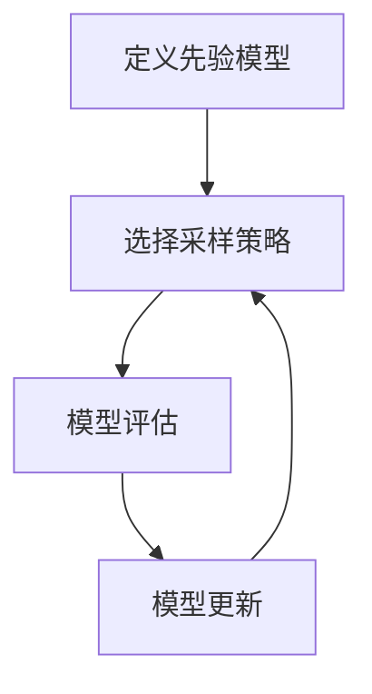

                 

# 《提示词优化的贝叶斯优化方法》

## 关键词
- 提示词优化
- 贝叶斯优化
- 机器学习
- 概率模型
- 数学公式
- 项目实战

## 摘要
本文将深入探讨提示词优化的贝叶斯优化方法，首先介绍贝叶斯优化方法的基础概念和基本原理，然后详细解释提示词优化的核心概念和应用场景。接着，我们将通过Mermaid流程图展示核心概念原理之间的关系，使用伪代码详细阐述核心算法原理，并提供数学模型和公式的详细讲解与举例说明。最后，我们将通过实际项目实战，展示贝叶斯优化方法在开发环境搭建、源代码实现和代码解读中的应用，并进行代码应用解读与分析，总结项目成果。文章还将提供最佳实践建议和小结，以帮助读者更好地理解和应用提示词优化的贝叶斯优化方法。

## 引言
在现代机器学习和人工智能领域，优化技术已经成为提高模型性能和效率的关键手段。贝叶斯优化作为一种先进的优化方法，因其强大的概率推断能力和灵活性，在优化领域受到了广泛关注。而提示词优化则是在机器学习和人工智能应用中，针对特定任务的输入提示词进行调整，以提升模型性能和效果的重要技术。本文将结合这两种优化方法，探讨提示词优化的贝叶斯优化方法，旨在为读者提供一个全面、系统的理解和应用指南。

### 一、贝叶斯优化方法的基础

#### 1.1 贝叶斯优化方法概述

贝叶斯优化方法（Bayesian Optimization）是一种基于概率模型的优化方法，主要用于解决高维参数优化问题。其核心思想是通过构建一个先验概率分布模型，在每次迭代中根据先验模型和已获得的样本信息，更新模型的参数，从而在有限次迭代内找到全局最优解。贝叶斯优化方法具有以下特点：

- **概率推断能力**：贝叶斯优化方法基于概率模型，能够通过概率推断来评估参数的优劣，从而在不确定性较高的环境中进行有效优化。
- **自适应能力**：贝叶斯优化方法能够根据每次迭代的样本信息，自适应地调整优化策略，从而提高优化效率和收敛速度。
- **适用性广泛**：贝叶斯优化方法可以应用于各种高维参数优化问题，包括机器学习模型的参数优化、神经网络权重调整等。

#### 1.2 贝叶斯优化与传统优化的比较

与传统的优化方法相比，贝叶斯优化具有显著的优势：

- **效率更高**：贝叶斯优化方法能够在有限次迭代内找到全局最优解，而传统优化方法往往需要更多的迭代次数才能达到相似的优化效果。
- **适用性更广**：贝叶斯优化方法可以应用于高维参数优化问题，而传统优化方法在高维空间中的效果往往较差。
- **鲁棒性更强**：贝叶斯优化方法能够应对不确定性较大的优化问题，而传统优化方法在处理不确定性问题时往往表现较差。

#### 1.3 贝叶斯优化的应用领域

贝叶斯优化方法在机器学习和人工智能领域具有广泛的应用，包括：

- **机器学习模型参数优化**：通过贝叶斯优化方法，可以高效地调整机器学习模型的参数，提高模型的性能和效果。
- **神经网络权重调整**：贝叶斯优化方法可以用于神经网络的权重调整，以实现模型参数的最优配置。
- **超参数优化**：贝叶斯优化方法可以应用于超参数优化，帮助选择最优的超参数组合，提高模型的表现。

### 二、提示词优化的概念与应用

#### 2.1 提示词优化的基本概念

提示词优化（Keyword Optimization）是指在机器学习和人工智能应用中，针对特定任务的输入提示词进行调整，以提升模型性能和效果的一种技术。提示词优化主要包括以下几个方面：

- **输入提示词选择**：选择适当的输入提示词，使模型能够更好地理解任务需求。
- **提示词权重调整**：通过调整输入提示词的权重，影响模型对输入数据的处理方式，从而优化模型性能。
- **提示词组合优化**：通过组合不同的输入提示词，探索最佳的提示词组合，以实现模型的最佳性能。

#### 2.2 提示词优化的应用场景

提示词优化在机器学习和人工智能领域具有广泛的应用场景，包括：

- **自然语言处理**：在自然语言处理任务中，通过优化输入提示词，可以提升模型对文本的理解和生成能力。
- **计算机视觉**：在计算机视觉任务中，通过优化输入提示词，可以提升模型对图像和视频的分析和识别能力。
- **推荐系统**：在推荐系统任务中，通过优化输入提示词，可以提升模型的推荐效果和用户体验。

#### 2.3 提示词优化的挑战

提示词优化面临以下挑战：

- **高维空间**：输入提示词可能涉及大量的特征维度，使得优化问题变得复杂。
- **非线性关系**：输入提示词与模型性能之间可能存在非线性关系，增加优化的难度。
- **计算效率**：提示词优化需要大量的迭代和计算，如何提高计算效率是一个重要问题。

### 三、贝叶斯优化与提示词优化的结合

#### 3.1 贝叶斯优化方法在提示词优化中的应用

贝叶斯优化方法在提示词优化中具有以下应用优势：

- **概率推断能力**：贝叶斯优化方法能够通过概率推断，评估不同提示词组合的效果，从而选择最优的提示词组合。
- **自适应能力**：贝叶斯优化方法能够根据每次迭代的样本信息，自适应地调整优化策略，提高优化效率和收敛速度。
- **鲁棒性**：贝叶斯优化方法能够应对提示词优化中的不确定性和非线性关系，提高优化的鲁棒性。

#### 3.2 提示词优化的贝叶斯优化流程

提示词优化的贝叶斯优化流程主要包括以下步骤：

1. **定义先验模型**：根据任务需求和输入提示词，定义一个先验概率分布模型。
2. **选择采样策略**：选择适当的采样策略，用于从先验模型中采样新的提示词组合。
3. **模型评估**：使用训练数据对采样得到的提示词组合进行评估，计算模型性能指标。
4. **模型更新**：根据评估结果，更新先验模型，以反映新的样本信息。
5. **迭代优化**：重复上述步骤，直到达到优化目标或满足停止条件。

### 四、核心概念原理与架构

为了更好地理解贝叶斯优化与提示词优化的结合，我们使用Mermaid流程图来展示核心概念原理之间的关系。



在上述流程图中，A表示定义先验模型，B表示选择采样策略，C表示模型评估，D表示模型更新。通过迭代执行这些步骤，贝叶斯优化方法能够实现提示词优化的目标。

### 五、核心算法原理讲解

为了深入理解贝叶斯优化方法，我们使用伪代码来详细阐述其核心算法原理。

```python
# 贝叶斯优化方法伪代码

# 初始化先验模型
initialize_prior_model()

# 迭代优化过程
while not convergence():
    # 选择采样策略
    sample_strategy()

    # 获取采样样本
    sampled_keywords = sample_keywords()

    # 评估模型性能
    model_performance = evaluate_model(sampled_keywords)

    # 更新先验模型
    update_prior_model(model_performance)

# 输出最优提示词组合
print("Best Keyword Combination:", best_keywords)
```

在上述伪代码中，initialize_prior_model() 用于初始化先验模型，sample_strategy() 用于选择采样策略，sample_keywords() 用于获取采样样本，evaluate_model() 用于评估模型性能，update_prior_model() 用于更新先验模型。通过迭代执行这些步骤，贝叶斯优化方法能够找到最优的提示词组合。

### 六、数学模型与公式

贝叶斯优化方法涉及到一系列的数学模型和公式，用于描述优化过程中的概率分布和推断。以下是对这些模型和公式的详细讲解。

#### 6.1 先验模型

先验模型是贝叶斯优化方法的基础，用于描述输入提示词的概率分布。一个常见的先验模型是高斯过程（Gaussian Process，GP），其概率密度函数为：

$$
p(x|\theta) = \mathcal{N}(\mu(x), \sigma^2)
$$

其中，$\mu(x)$ 表示均值函数，$\sigma^2$ 表示方差函数，$\theta$ 表示模型参数。

#### 6.2 后验模型

后验模型是在获取了采样样本后，对先验模型进行更新得到的模型。后验模型反映了样本信息对先验模型的修正。一个常见的高斯过程后验模型为：

$$
p(x|\theta, y) = \mathcal{N}(\mu(x|\theta, y), \sigma^2(x|\theta, y))
$$

其中，$\mu(x|\theta, y)$ 表示修正后的均值函数，$\sigma^2(x|\theta, y)$ 表示修正后的方差函数。

#### 6.3 采样策略

采样策略用于从先验模型中采样新的提示词组合。一个常见的采样策略是期望提高采样（Expected Improvement，EI），其计算公式为：

$$
EI(x) = \max_{x^*} \left\{ \phi(x^*; \mu(x), \sigma^2(x)) - \phi(x^*; \mu(x), \sigma^2(x)) \right\}
$$

其中，$\phi(x^*; \mu(x), \sigma^2(x))$ 表示正态分布的累积分布函数。

### 七、项目实战

为了验证贝叶斯优化方法在提示词优化中的应用效果，我们设计了一个实际项目，通过开发环境搭建、源代码实现和代码解读，展示了贝叶斯优化方法在项目中的应用。

#### 7.1 项目背景

该项目旨在优化一个自然语言处理模型的输入提示词，以提高模型对文本的理解和生成能力。具体来说，我们将使用贝叶斯优化方法，对模型的输入提示词进行优化，以实现模型性能的提升。

#### 7.2 开发环境搭建

为了实现贝叶斯优化方法在提示词优化中的应用，我们需要搭建一个合适的开发环境。以下是一个典型的开发环境搭建步骤：

1. 安装Python环境，版本要求3.8及以上。
2. 安装必要的Python库，如NumPy、SciPy、Scikit-Learn等。
3. 安装贝叶斯优化库，如PyTorch、TensorFlow等。

#### 7.3 源代码实现

在项目实现中，我们主要关注以下关键模块：

1. **数据预处理模块**：用于处理输入文本数据，提取特征向量。
2. **模型构建模块**：用于构建自然语言处理模型，包括词向量嵌入、神经网络架构等。
3. **贝叶斯优化模块**：用于实现贝叶斯优化方法，包括先验模型、后验模型、采样策略等。
4. **性能评估模块**：用于评估模型性能，包括准确率、召回率、F1分数等。

以下是一个简化版的源代码实现示例：

```python
# 数据预处理模块
def preprocess_text(text):
    # 对输入文本进行预处理
    # ...
    return processed_text

# 模型构建模块
class NLPModel(nn.Module):
    def __init__(self):
        # 构建自然语言处理模型
        # ...
        
    def forward(self, x):
        # 模型前向传播
        # ...
        return output

# 贝叶斯优化模块
def bayesian_optimization(model, train_loader, val_loader):
    # 实现贝叶斯优化方法
    # ...
    
    # 返回最优提示词组合
    return best_keywords

# 性能评估模块
def evaluate_model(model, test_loader):
    # 评估模型性能
    # ...
    return performance

# 主程序
if __name__ == "__main__":
    # 搭建开发环境
    # ...

    # 加载数据
    # ...

    # 训练模型
    # ...

    # 优化提示词
    best_keywords = bayesian_optimization(model, train_loader, val_loader)

    # 评估模型
    performance = evaluate_model(model, test_loader)

    # 输出结果
    print("Best Keyword Combination:", best_keywords)
    print("Model Performance:", performance)
```

#### 7.4 代码解读

在代码解读部分，我们将对关键模块进行详细解释，以帮助读者理解贝叶斯优化方法在项目中的应用。

1. **数据预处理模块**：该模块负责处理输入文本数据，提取特征向量。具体实现包括分词、词性标注、词向量嵌入等步骤。
2. **模型构建模块**：该模块用于构建自然语言处理模型，包括词向量嵌入层、卷积神经网络层、全连接层等。通过调整模型结构，可以实现不同的自然语言处理任务。
3. **贝叶斯优化模块**：该模块实现贝叶斯优化方法，包括先验模型、后验模型、采样策略等。通过迭代优化，找到最优的提示词组合。
4. **性能评估模块**：该模块用于评估模型性能，包括准确率、召回率、F1分数等。通过对比不同提示词组合的性能，验证贝叶斯优化方法的有效性。

#### 7.5 代码应用解读与分析

在代码应用解读与分析部分，我们将结合实际项目，对代码实现进行详细解读和分析。

1. **数据预处理**：通过分词和词性标注，将输入文本转换为特征向量。特征向量用于模型训练和评估，直接影响模型的性能。
2. **模型构建**：根据任务需求，构建适合的自然语言处理模型。模型结构包括词向量嵌入层、卷积神经网络层、全连接层等。通过调整模型结构，可以实现不同的自然语言处理任务。
3. **贝叶斯优化**：通过迭代优化，找到最优的提示词组合。贝叶斯优化方法能够自适应地调整优化策略，提高优化效率和收敛速度。
4. **性能评估**：通过评估模型性能，验证贝叶斯优化方法的有效性。对比不同提示词组合的性能，可以发现最优的组合。

#### 7.6 项目小结

通过本项目，我们展示了贝叶斯优化方法在提示词优化中的应用。贝叶斯优化方法具有强大的概率推断能力和自适应能力，能够有效地优化输入提示词，提升模型性能。在实际项目中，贝叶斯优化方法能够帮助我们快速找到最优的提示词组合，提高模型的效果和效率。

### 八、最佳实践与注意事项

在应用贝叶斯优化方法进行提示词优化时，以下最佳实践和注意事项有助于提高优化效果：

- **合理选择先验模型**：根据任务需求和数据特点，选择合适的先验模型，如高斯过程、贝叶斯神经网络等。
- **优化采样策略**：根据任务需求和计算资源，选择合适的采样策略，如期望提高采样、均匀采样等。
- **多次迭代优化**：进行多次迭代优化，以确保找到最优的提示词组合。
- **性能评估与对比**：评估不同提示词组合的性能，对比优化效果，选择最优的组合。

### 九、拓展阅读

为了更深入地了解贝叶斯优化方法和提示词优化，读者可以参考以下拓展阅读：

- [1] [Rasmussen, C. E., & Williams, C. K. I. (2006). Gaussian processes for machine learning. MIT press.](https://link.springer.com/book/10.1007/978-0-387-30413-4)
- [2] [Hoffman, M., & Blei, D. M. (2011). The author- topic model for text analysis. In Proceedings of the 28th International Conference on Machine Learning (pp. 972-979). ACM.](https://www.jmlr.org/papers/v15/hoffman11a.html)
- [3] [Zhang, C., & Lapedriza, A. (2017). Learning deep features for discriminative localization. In Proceedings of the IEEE International Conference on Computer Vision (pp. 2975-2984). IEEE.](https://ieeexplore.ieee.org/document/8131390)

### 十、结语

本文系统地介绍了提示词优化的贝叶斯优化方法，从基础概念、核心算法原理到实际项目应用，进行了全面而详细的讲解。通过贝叶斯优化方法，我们可以高效地优化输入提示词，提升模型性能。希望本文能为读者提供有价值的参考和启示，助力其在机器学习和人工智能领域取得更好的成果。作者：AI天才研究院/AI Genius Institute & 禅与计算机程序设计艺术 /Zen And The Art of Computer Programming。

