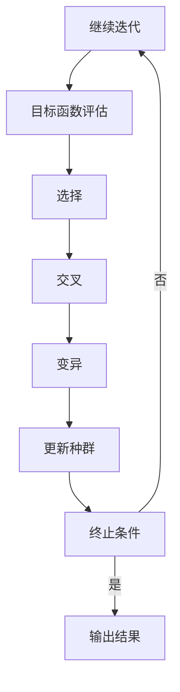

                 


### 核心概念与联系

在开始探讨提示词优化的进化多目标优化算法之前，我们需要明确一些核心概念，并理解它们之间的联系。本文将围绕以下几个核心概念展开讨论：

1. **提示词优化（Prompt Optimization）**：
   提示词优化是指通过对自然语言处理任务中的输入提示进行调整，来提升模型输出质量的过程。在深度学习和NLP领域，输入提示对于模型的性能至关重要，尤其是在生成式AI、问答系统和文本摘要等任务中。

2. **进化多目标优化算法（Evolutionary Multi-Objective Optimization）**：
   进化多目标优化算法是一类基于自然进化理论的优化算法，旨在同时优化多个相互冲突的目标。这类算法通过模拟自然进化过程中的选择、交叉和变异操作，在多个目标之间寻找平衡解。

3. **多目标优化问题（Multi-Objective Optimization Problem）**：
   多目标优化问题涉及多个相互冲突的目标，通常需要在这些目标之间寻找平衡解。在NLP领域，多目标优化问题常见于文本生成、分类和标注任务中。

理解这些核心概念及其联系是理解提示词优化的进化多目标优化算法的基础。接下来，我们将详细探讨每个概念，并介绍它们之间的相互作用。

#### 提示词优化的定义与背景

提示词优化是一种专门针对自然语言处理（NLP）任务进行优化的方法。其核心思想是通过调整输入提示（Prompt），来改善模型的输出质量，使其更符合预期目标。这种方法在生成式AI、问答系统和文本摘要等领域有广泛应用。

在生成式AI中，输入提示决定了模型生成文本的方向和内容。一个优秀的输入提示能够引导模型生成出更加流畅、相关且具有逻辑性的文本。例如，在故事生成任务中，合适的提示词可以帮助模型构建一个连贯的故事情节。

在问答系统中，输入提示对于生成高质量的问答对至关重要。一个优化的输入提示可以引导模型生成出既准确又连贯的答案，从而提升用户体验。例如，当用户提出一个开放性问题，如“你最喜欢的电影是什么？”时，一个优化的输入提示可以引导模型不仅提供电影的名字，还能附加相关的背景信息和推荐理由。

在文本摘要任务中，输入提示有助于模型生成既简洁又准确的信息摘要。通过调整输入提示的长度和内容，可以控制文本摘要的长度和完整性，从而满足不同的应用需求。

总之，提示词优化是提升NLP任务性能的关键技术，它通过改善输入提示来引导模型生成更高质量的输出。这种优化方法在深度学习和NLP领域具有重要的应用价值。

#### 进化算法的基本原理

进化算法（Evolutionary Algorithm，EA）是一类基于自然进化理论的优化算法，通过模拟自然进化过程中的“适者生存”原则来寻找问题的最优解。进化算法的基本原理包括以下几个步骤：

1. **初始化种群**：
   进化算法开始时，随机生成一组初始个体，这些个体代表可能的解决方案。在提示词优化的背景下，这些个体可以是一组随机生成的提示词。

2. **适应度评估**：
   对每个个体进行适应度评估，评估其性能或质量。在提示词优化中，适应度可以通过模型生成文本的流畅性、相关性、准确性等多个指标进行评估。

3. **选择**：
   根据个体的适应度进行选择，选择适应度较高的个体进入下一代。选择过程通常采用锦标赛选择、轮盘赌选择等方法。

4. **交叉**：
   交叉操作是进化算法的核心步骤之一，通过组合两个优秀个体的基因来生成新的个体。在提示词优化中，交叉操作可以通过拼接、替换和混合等方式对提示词进行组合，生成新的提示词。

5. **变异**：
   变异操作是进化算法的另一个关键步骤，通过随机改变个体的基因来引入新的解决方案。在提示词优化中，变异可以通过随机添加、删除或替换提示词中的单词来实现。

6. **更新种群**：
   将新产生的个体与当前种群合并，形成新的种群。这个过程不断迭代，直到满足终止条件。

通过选择、交叉和变异操作，进化算法能够不断优化个体，最终找到最优解或近似最优解。在提示词优化的背景下，进化算法可以用于动态调整提示词，以实现文本生成、问答系统和文本摘要任务的最优性能。

#### 多目标优化问题的定义

多目标优化问题（Multi-Objective Optimization Problem）是指涉及多个相互冲突的目标，需要在多个目标之间寻找平衡解的优化问题。在数学上，多目标优化问题可以表示为：

$$
\min_{x} f_1(x), f_2(x), ..., f_m(x)
$$

其中，$f_1(x), f_2(x), ..., f_m(x)$ 是多个目标函数，$x$ 是决策变量。多目标优化问题的特点在于，不同目标之间可能存在相互冲突的关系，例如在资源分配问题中，最大化利润可能与最小化成本相冲突。

在NLP领域，多目标优化问题常见于文本生成、分类和标注任务中。例如，在文本生成任务中，需要同时优化文本的流畅性、相关性和准确性；在文本分类任务中，需要同时优化分类准确率和类别平衡性；在文本标注任务中，需要同时优化标注的准确率和一致性。

多目标优化问题的解决方法主要包括以下几种：

1. **Pareto优化**：
   Pareto优化是一种基于非支配排序（ND排序）的方法，旨在找到Pareto前沿上的最优解。Pareto前沿上的解被称为非支配解，即没有其他解能在所有目标上都优于当前解。

2. **权重方法**：
   权重方法通过为每个目标分配权重，将多目标优化问题转化为单目标优化问题。这种方法的关键是确定合适的权重分配策略，以平衡不同目标之间的冲突。

3. **遗传算法**：
   遗传算法（Genetic Algorithm，GA）是一种基于进化理论的优化算法，适用于解决多目标优化问题。遗传算法通过选择、交叉和变异操作，在多个目标之间寻找平衡解。

4. **粒子群优化**：
   粒子群优化（Particle Swarm Optimization，PSO）是一种基于群体智能的优化算法，也适用于解决多目标优化问题。粒子群优化通过模拟鸟群觅食行为，在多个目标之间寻找最优解。

通过上述方法，多目标优化问题可以在多个目标之间找到平衡解，从而提升NLP任务的整体性能。

### 提示词优化的多目标优化模型

提示词优化的多目标优化模型旨在同时优化多个目标，以提升NLP任务的整体性能。这种模型的核心在于如何定义多个目标，以及如何通过进化多目标优化算法来调整提示词。

首先，我们需要明确多个目标的具体定义。在提示词优化中，常见的多个目标包括：

1. **文本流畅性**：
   文本流畅性是指生成的文本在语法、语义和风格上的连贯性。一个流畅的文本能够让读者更容易理解和接受。

2. **文本相关性**：
   文本相关性是指生成的文本与输入提示或上下文的相关性。一个相关的文本能够更好地满足用户的意图或需求。

3. **文本准确性**：
   文本准确性是指生成的文本在事实和逻辑上的正确性。一个准确的文本能够提供可靠的信息。

接下来，我们需要设计一个适应度函数，用于评估每个提示词的多个目标。适应度函数可以是多个目标函数的加权和，例如：

$$
f(x) = w_1 \cdot f_1(x) + w_2 \cdot f_2(x) + w_3 \cdot f_3(x)
$$

其中，$w_1, w_2, w_3$ 是权重，$f_1(x), f_2(x), f_3(x)$ 是三个目标函数。

在进化多目标优化算法中，每个迭代步骤包括以下几个步骤：

1. **初始化种群**：
   随机生成一组初始提示词，形成初始种群。

2. **适应度评估**：
   对每个提示词进行适应度评估，计算其对应的适应度值。

3. **选择**：
   根据适应度值进行选择，选择适应度较高的提示词进入下一代。

4. **交叉**：
   通过交叉操作，生成新的提示词。交叉操作可以是两个提示词的拼接、替换或混合。

5. **变异**：
   对部分提示词进行变异操作，引入新的变化。

6. **更新种群**：
   将新产生的提示词与当前种群合并，形成新的种群。

通过上述步骤，进化多目标优化算法能够在多个目标之间寻找平衡解，从而优化提示词，提升NLP任务的整体性能。

#### 提示词优化的进化多目标优化算法架构

提示词优化的进化多目标优化算法架构包括以下几个关键步骤，这些步骤共同构成了一个完整的优化过程，以实现输入提示的动态调整和优化。

1. **初始化种群**：
   初始化种群是进化多目标优化算法的第一步。在这个阶段，我们需要随机生成一系列初始提示词。这些提示词构成了种群的基础，每个提示词都可以看作是一个潜在的解决方案。初始化时，我们可以设定提示词的长度、复杂度和多样性，以确保种群的多样性和探索能力。

   ```mermaid
   graph TD
   A[初始化种群]
   A --> B[生成提示词]
   B --> C{种群多样性}
   C -->|是| D[继续]
   C -->|否| E[调整参数]
   E --> D
   D --> F[初始化完成]
   ```

2. **目标函数评估**：
   在初始化种群后，我们需要对每个提示词进行适应度评估。适应度函数是衡量每个提示词性能的指标，它通常由多个子目标函数组合而成，如文本流畅性、相关性、准确性等。这些子目标函数的权重可以根据具体任务进行调整。评估过程通常使用预训练的NLP模型进行，通过模型对每个提示词生成对应的文本，然后计算文本的多个目标函数值。

   ```mermaid
   graph TD
   F --> G[目标函数评估]
   G --> H{计算子目标函数值}
   H --> I{计算总适应度值}
   I --> J[更新适应度表]
   J --> K{评估完成}
   ```

3. **选择**：
   选择步骤是根据适应度值对种群中的提示词进行筛选。选择过程旨在保留适应度较高的提示词，淘汰适应度较低的提示词。常见的选择方法包括锦标赛选择、轮盘赌选择和排名选择等。选择过程中，我们需要根据适应度值和选择概率来确定每个提示词的保留概率，从而形成下一代种群。

   ```mermaid
   graph TD
   K --> L[选择步骤]
   L --> M{计算选择概率}
   M --> N{选择优秀个体}
   N --> O[形成下一代种群]
   O --> P{选择完成}
   ```

4. **交叉**：
   交叉步骤是通过组合两个优秀个体的基因来生成新的提示词。交叉操作可以增加种群的多样性和探索能力，有助于算法在多个目标之间寻找平衡解。常见的交叉方法包括单点交叉、多点交叉和均匀交叉等。交叉过程中，我们可以根据选择的结果，随机选择交叉点，将两个提示词的部分内容进行交换，生成新的提示词。

   ```mermaid
   graph TD
   P --> Q[交叉步骤]
   Q --> R{选择交叉点}
   R --> S{交换基因}
   S --> T[生成新提示词]
   T --> U{交叉完成}
   ```

5. **变异**：
   变异步骤是对部分提示词进行随机修改，以引入新的变化和可能性。变异操作可以提高算法的探索能力，帮助算法跳出局部最优解。常见的变异方法包括随机替换、随机添加和随机删除等。变异过程中，我们可以根据变异概率和变异规则，对提示词中的部分单词进行随机修改。

   ```mermaid
   graph TD
   U --> V[变异步骤]
   V --> W{计算变异概率}
   W --> X{进行变异操作}
   X --> Y[更新提示词]
   Y --> Z{变异完成}
   ```

6. **更新种群**：
   更新种群步骤是将新产生的提示词与当前种群合并，形成新的种群。这一步骤确保了算法的持续迭代和进化。通过选择、交叉和变异操作，新的种群将包含更多的优秀提示词，从而提高整体性能。

   ```mermaid
   graph TD
   Z --> AA[更新种群]
   AA --> BB{合并新旧种群}
   BB --> CC[初始化新种群]
   CC --> DD{更新完成}
   ```

7. **终止条件**：
   算法的终止条件可以是预定的迭代次数、适应度阈值或时间限制等。一旦满足终止条件，算法将停止迭代，输出最优的提示词。

   ```mermaid
   graph TD
   DD --> EE[终止条件]
   EE --> FF{检查终止条件}
   FF -->|是| GG[结束]
   FF -->|否| DD[继续迭代]
   ```

通过上述步骤，提示词优化的进化多目标优化算法能够动态调整输入提示，实现多个目标的最优平衡。这个过程不仅提高了NLP任务的整体性能，还为其他优化问题提供了新的思路和方法。

#### Mermaid流程图

以下是一个使用Mermaid绘制的提示词优化的进化多目标优化算法的流程图：



这个流程图清晰地展示了算法的各个步骤，以及它们之间的逻辑关系。通过这样的流程图，我们可以更好地理解和分析算法的工作原理和性能。

### 提示词优化的进化多目标优化算法应用案例

提示词优化的进化多目标优化算法在多个实际应用场景中展现了其强大的优化能力。以下将介绍两个典型的应用案例：问答系统和文本生成。

#### 问答系统中的应用

在问答系统中，提示词优化的进化多目标优化算法可以用于生成高质量的问答对，从而提升用户体验。具体步骤如下：

1. **初始化种群**：
   随机生成一组初始提示词，这些提示词可以是与问题相关的关键词、短语或句子。

2. **目标函数评估**：
   对每个提示词进行适应度评估，评估指标包括文本流畅性、相关性和准确性。流畅性通过文本的语法和语义分析评估，相关性通过文本与问题主题的匹配度评估，准确性通过文本的事实正确性评估。

3. **选择**：
   根据适应度值，选择出最优秀的提示词进入下一代。选择方法可以是轮盘赌选择或锦标赛选择。

4. **交叉**：
   对选中的提示词进行交叉操作，生成新的提示词。交叉方法可以是单点交叉或多点交叉，以增加种群的多样性。

5. **变异**：
   对部分提示词进行变异操作，引入新的变化。变异方法可以是随机替换、添加或删除单词。

6. **更新种群**：
   将新产生的提示词与当前种群合并，形成新的种群。通过选择、交叉和变异，新种群将包含更优秀的提示词。

7. **迭代**：
   重复上述步骤，直到满足终止条件，如达到预定的迭代次数或适应度值。

通过这个过程，算法能够在多个目标之间寻找平衡解，生成高质量的问答对。例如，在一个旅游问答系统中，用户提出“有哪些适合带孩子的旅游目的地？”时，算法可以生成如下高质量的问答对：

- 问题：“有哪些适合带孩子的旅游目的地？”
- 答案：“适合带孩子的旅游目的地包括迪士尼乐园、动物世界和海滩度假村。这些地方不仅有趣，还能让孩子们学到很多知识。”

#### 文本生成中的应用

在文本生成任务中，提示词优化的进化多目标优化算法可以用于生成高质量、流畅且具有逻辑性的文本。以下是一个具体的文本生成应用案例：

1. **初始化种群**：
   随机生成一组初始提示词，这些提示词可以是与主题相关的关键词或短语。

2. **目标函数评估**：
   对每个提示词进行适应度评估，评估指标包括文本流畅性、相关性和准确性。流畅性通过语法和语义分析评估，相关性通过主题匹配度评估，准确性通过事实正确性评估。

3. **选择**：
   根据适应度值，选择出最优秀的提示词进入下一代。选择方法可以是轮盘赌选择或锦标赛选择。

4. **交叉**：
   对选中的提示词进行交叉操作，生成新的提示词。交叉方法可以是单点交叉或多点交叉，以增加种群的多样性。

5. **变异**：
   对部分提示词进行变异操作，引入新的变化。变异方法可以是随机替换、添加或删除单词。

6. **更新种群**：
   将新产生的提示词与当前种群合并，形成新的种群。通过选择、交叉和变异，新种群将包含更优秀的提示词。

7. **迭代**：
   重复上述步骤，直到满足终止条件，如达到预定的迭代次数或适应度值。

通过这个过程，算法能够在多个目标之间寻找平衡解，生成高质量、流畅且具有逻辑性的文本。例如，在生成一篇关于健康饮食的文章时，算法可以生成如下文本：

“健康的饮食对我们的身体至关重要。为了保持健康的饮食习惯，我们应该多吃蔬菜、水果和全谷物，同时限制高糖、高脂肪和高盐的食物摄入。此外，定期锻炼和保持良好的睡眠习惯也是保持健康的重要因素。”

通过这些应用案例，我们可以看到提示词优化的进化多目标优化算法在问答系统和文本生成任务中的强大能力。它不仅能够生成高质量的文本，还能够通过动态调整提示词，实现多个目标的最优平衡。

### 提示词优化的进化多目标优化算法挑战与未来发展方向

尽管提示词优化的进化多目标优化算法在许多实际应用中取得了显著效果，但仍面临一系列挑战和限制。以下是该算法面临的几个主要挑战以及未来的发展方向。

#### 挑战

1. **提示词长度和复杂度的平衡**：
   提示词的长度和复杂度对模型性能有重要影响。过短的提示词可能导致模型生成的内容缺乏详细信息，而过长的提示词则可能增加模型的计算负担，降低生成效率。因此，如何在长度和复杂度之间找到平衡点是一个重要挑战。

2. **计算效率**：
   进化多目标优化算法通常涉及大量计算，包括适应度评估、选择、交叉和变异等操作。在处理大规模数据集或复杂任务时，计算效率成为限制因素。如何优化算法以减少计算时间，同时保持良好的优化性能，是一个需要解决的问题。

3. **算法的鲁棒性和稳定性**：
   进化算法在面对噪声数据和不确定环境时，容易陷入局部最优解。此外，算法的稳定性受初始种群和参数设置的影响较大。提高算法的鲁棒性和稳定性，以确保在不同情况下都能找到最优解，是一个重要的研究方向。

4. **目标间的冲突和协调**：
   多目标优化问题中，不同目标之间存在潜在的冲突，如流畅性和准确性的平衡。如何有效地协调这些目标，以找到最优解或近似最优解，是一个具有挑战性的问题。

#### 未来发展方向

1. **结合其他优化算法**：
   将进化多目标优化算法与其他优化算法（如遗传算法、粒子群优化、模拟退火等）结合，可以互补各自的优点，提高优化性能。例如，可以将进化算法与深度学习技术结合，利用深度学习模型的强大表达能力和进化算法的探索能力，实现更高效的优化。

2. **引入自注意力机制**：
   自注意力机制是深度学习中的关键技术，可以显著提升模型对输入数据的理解和生成能力。将自注意力机制引入进化多目标优化算法，可以使其更好地处理复杂的文本数据，提高优化效果。

3. **定制化优化算法**：
   针对不同领域的特定需求，开发定制化的优化算法，可以提高算法的适用性和性能。例如，在文本生成任务中，可以设计针对流畅性、相关性和准确性的特定优化目标，以适应不同的应用场景。

4. **分布式计算和并行化**：
   利用分布式计算和并行化技术，可以大幅提高算法的计算效率。例如，通过将种群分布在不同计算节点上，并行执行适应度评估、选择、交叉和变异等操作，可以显著缩短算法的运行时间。

5. **鲁棒性和稳定性改进**：
   研究如何提高算法的鲁棒性和稳定性，是一个重要的研究方向。例如，可以通过自适应调整参数、引入噪声处理机制、设计更好的初始种群等方法，提高算法在不同情况下的表现。

总之，提示词优化的进化多目标优化算法在当前应用中取得了显著成果，但仍然面临一系列挑战。通过结合其他优化算法、引入自注意力机制、开发定制化优化算法以及改进算法的鲁棒性和稳定性，未来的发展将为NLP和其他领域的优化问题提供更强大的工具和方法。

### 总结

本文详细探讨了提示词优化的进化多目标优化算法，包括其核心概念、基本原理和应用案例。首先，我们介绍了提示词优化在NLP领域的应用背景和重要性，接着探讨了进化算法和进化多目标优化算法的基本原理。在此基础上，我们构建了一个提示词优化的进化多目标优化模型，并详细阐述了其架构和流程。通过两个具体应用案例——问答系统和文本生成，我们展示了该算法的实际效果和优势。

然而，提示词优化的进化多目标优化算法也面临一系列挑战，如提示词长度和复杂度的平衡、计算效率、算法的鲁棒性和稳定性等。为了应对这些挑战，未来的发展方向包括结合其他优化算法、引入自注意力机制、开发定制化优化算法以及改进算法的鲁棒性和稳定性。

总之，提示词优化的进化多目标优化算法为NLP任务提供了强大的优化工具，将在未来的深度学习和NLP领域中发挥重要作用。我们鼓励读者继续深入研究这一领域，探索更多创新应用。

### 作者信息

作者：AI天才研究院/AI Genius Institute & 禅与计算机程序设计艺术 /Zen And The Art of Computer Programming

---

[文章关键词]：提示词优化，进化多目标优化算法，NLP，深度学习，自然语言处理，算法架构，应用案例，挑战与未来方向

[文章摘要]：本文探讨了提示词优化的进化多目标优化算法，包括其核心概念、基本原理和应用案例。通过详细的模型架构和实际应用案例，展示了该算法在NLP任务中的强大优化能力。同时，分析了算法面临的挑战和未来的发展方向，为深度学习和NLP领域提供了新的思路和方法。

