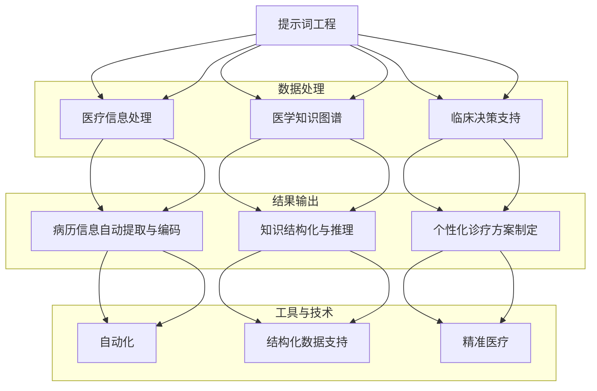

                 

### 文章标题

《提示词工程在个性化医疗方案制定中的应用》

### 关键词

- 提示词工程
- 个性化医疗
- 自然语言处理
- 医疗信息处理
- 人工智能
- 医学知识图谱
- 临床决策支持

### 摘要

本文深入探讨了提示词工程在个性化医疗方案制定中的应用。首先，介绍了提示词工程的基本概念和其在医疗领域的应用背景。接着，详细阐述了提示词工程的原理、核心算法和数学模型，并通过Mermaid流程图展示了其与医疗信息处理、医学知识图谱和临床决策支持之间的联系。随后，文章通过具体的案例和实战，展示了如何利用提示词工程构建个性化医疗方案，包括病历信息的自动提取与编码、基于提示词的个性化治疗方案制定、患者画像与健康管理等方面。最后，文章总结了提示词工程在个性化医疗方案制定中的挑战和未来展望，并提供了一些最佳实践建议。

---

### 引言与背景

随着医疗技术的飞速发展，个性化医疗（Personalized Medicine）逐渐成为现代医学的重要方向。个性化医疗的核心思想是根据患者的个体差异，制定最合适的治疗方案，以实现最优的治疗效果。这一理念打破了传统的一刀切治疗模式，极大地提高了医疗服务的质量和效率。

在个性化医疗的实现过程中，医疗信息处理、医学知识图谱和临床决策支持是三个关键环节。医疗信息处理涉及对大量医疗数据的收集、存储、分析和利用；医学知识图谱则是将医学知识结构化，为诊疗决策提供支持；临床决策支持系统则基于前两者的结果，为医生提供诊疗建议。

提示词工程（Prompt Engineering）作为一种自然语言处理（NLP）技术，近年来在人工智能领域取得了显著进展。其核心思想是通过设计特定的提示词（prompt），引导模型生成高质量的自然语言文本。在医疗领域，提示词工程的应用不仅可以提升医疗信息处理的效率，还可以为医学知识图谱的构建和临床决策支持提供有力支持。

具体来说，提示词工程在个性化医疗方案制定中的应用主要包括以下几个方面：

1. **病历信息的自动提取与编码**：通过设计特定的提示词，帮助模型自动提取病历中的关键信息，并对其进行结构化处理，从而实现病历信息的自动化处理。

2. **医学知识图谱的构建**：利用提示词工程，可以更好地将医学知识结构化，构建出高质量的医学知识图谱，为临床决策提供支持。

3. **临床决策支持**：通过设计个性化的提示词，引导模型生成针对特定患者的诊疗建议，从而实现个性化医疗方案制定。

本文将围绕这些应用场景，详细探讨提示词工程在个性化医疗方案制定中的应用原理、方法和技术。

---

### 提示词工程的基本概念

提示词工程是一种基于自然语言处理（NLP）的技术，其核心思想是通过设计特定的提示词（prompt），引导模型生成高质量的自然语言文本。在提示词工程中，提示词是引导模型的关键，它们可以指导模型理解任务的背景信息、明确任务目标，并引导模型生成符合预期结果的输出。

#### 提示词的定义与作用

提示词（Prompt）通常是一段文本，它包含了对任务的具体描述、背景信息或输入数据的引用。在设计提示词时，需要充分考虑以下因素：

1. **明确性**：提示词应当清晰、准确地传达任务目标，避免歧义。
2. **相关性**：提示词应当与任务数据相关，以确保模型能够利用这些信息生成高质量的输出。
3. **多样性**：通过设计不同类型的提示词，可以丰富模型的学习过程，提高其泛化能力。

#### 提示词的类型

根据提示词在任务中的作用，可以将提示词分为以下几种类型：

1. **目标提示词**：用于明确任务目标的提示词，例如：“请生成一篇关于健康饮食的短文。”
2. **背景提示词**：提供背景信息的提示词，例如：“假设你正在为一位高血压患者制定饮食计划。”
3. **数据提示词**：引用输入数据的提示词，例如：“请根据以下患者的健康数据生成饮食建议：年龄45岁，体重85公斤，血压150/90毫米汞柱。”

#### 提示词在NLP中的应用

提示词工程在NLP中的应用非常广泛，以下是一些典型应用场景：

1. **文本生成**：通过设计特定的提示词，引导模型生成特定主题的文本，例如新闻文章、产品描述、对话系统等。
2. **信息提取**：利用提示词帮助模型识别文本中的关键信息，例如从病历中提取诊断信息、从医疗文献中提取研究结论等。
3. **问答系统**：通过设计针对性的提示词，引导模型回答特定类型的问题，例如医学问答、法律咨询等。
4. **情感分析**：利用提示词指导模型对文本进行情感分类，例如分析社交媒体中的用户评论情感等。

#### 提示词工程的优势

与传统的自然语言处理方法相比，提示词工程具有以下优势：

1. **灵活性**：通过设计不同的提示词，可以灵活调整模型的行为，适应不同任务的需求。
2. **高效性**：提示词工程可以显著提高模型处理大规模文本数据的效率，特别是在处理结构化数据时。
3. **可解释性**：提示词可以帮助用户理解模型的行为和决策过程，提高模型的可解释性。

综上所述，提示词工程作为一种新兴的NLP技术，其在个性化医疗方案制定中的应用具有重要意义。通过设计特定的提示词，可以有效地引导模型生成高质量的医疗信息处理结果，为个性化医疗提供技术支持。

---

### 提示词工程的原理与方法

提示词工程的原理与方法主要涉及自然语言处理（NLP）的基础知识、常见算法以及如何在医疗领域实现应用。以下是提示词工程的核心原理与方法：

#### NLP基础知识

自然语言处理（NLP）是人工智能（AI）的一个重要分支，旨在让计算机理解和生成人类语言。NLP的基础知识包括：

1. **分词（Tokenization）**：将文本拆分成词或子词的过程。例如，将“我爱编程”拆分为“我”、“爱”、“编程”。
2. **词性标注（Part-of-Speech Tagging）**：为每个单词分配词性，例如名词、动词、形容词等。例如，“苹果”是名词，“吃”是动词。
3. **词嵌入（Word Embedding）**：将单词映射为向量表示，以便计算机能够处理和理解文本。常见的词嵌入方法包括Word2Vec、GloVe等。
4. **序列标注（Sequence Labeling）**：对文本中的每个词进行分类或标注，例如命名实体识别（NER）。
5. **文本分类（Text Classification）**：根据文本内容将其分类到不同的类别中，例如情感分析、垃圾邮件检测等。

#### 提示词生成方法

提示词的生成方法主要涉及以下步骤：

1. **需求分析**：首先，明确任务目标，确定需要生成哪种类型的提示词。例如，对于病历信息的自动提取，可能需要一个包含诊断、症状、治疗方案等关键词的提示词。
2. **数据预处理**：收集相关数据，如病历文本、医学知识库、文献资料等，并进行数据预处理，如分词、去停用词、词性标注等。
3. **模板设计**：设计提示词模板，模板中包含变量和固定部分。变量部分用于填充具体的任务信息，固定部分提供任务的背景和指导。
4. **提示词生成**：根据模板生成具体的提示词。例如，对于诊断信息的提取，提示词模板可以是：“请根据以下病历信息，列出主要诊断和次要诊断：[病历文本]”。

#### 提示词工程算法

在提示词工程中，常用的算法包括：

1. **基于规则的算法**：通过手工编写规则来生成提示词，适用于任务简单、规则明确的情况。
2. **基于机器学习的算法**：利用机器学习模型，如循环神经网络（RNN）、长短时记忆网络（LSTM）、Transformer等，自动生成提示词。这些算法可以处理更复杂的任务，但需要大量的训练数据和较强的计算能力。
3. **基于深度学习的算法**：深度学习模型，如BERT、GPT等，可以生成高质量的自然语言文本。这些模型通常需要大规模的训练数据和计算资源。

#### 提示词工程在医疗领域的实现

在医疗领域，提示词工程的具体实现包括以下几个步骤：

1. **数据收集与预处理**：收集病历文本、医学知识库、临床指南等数据，并进行数据预处理，如文本清洗、分词、词性标注等。
2. **模型训练与评估**：利用预处理后的数据训练提示词生成模型，并评估模型的性能。常见的评估指标包括精确度、召回率和F1分数。
3. **提示词生成与优化**：根据任务需求，生成提示词，并通过实验和反馈不断优化提示词的质量和效果。
4. **系统集成与部署**：将提示词生成模块集成到医疗系统中，实现自动化病历信息提取、医学知识图谱构建和临床决策支持等功能。

#### 实际案例

以下是一个简单的实际案例，展示如何利用提示词工程实现病历信息的自动提取：

1. **需求分析**：假设需要从病历中提取诊断信息。
2. **数据预处理**：收集并预处理病历文本数据。
3. **模板设计**：设计提示词模板：“请根据以下病历信息，列出主要诊断和次要诊断：[病历文本]”。
4. **模型训练**：使用预处理后的数据训练一个文本分类模型，用于识别诊断信息。
5. **提示词生成**：输入新病历文本，生成对应的提示词，例如：“请根据以下病历信息，列出主要诊断和次要诊断：患者张三，男，35岁，主要诊断：高血压，次要诊断：糖尿病”。
6. **结果验证**：利用生成的提示词提取诊断信息，并与人工作业结果进行比对，评估模型的准确性。

通过以上步骤，可以有效地实现病历信息的自动提取，为个性化医疗方案制定提供数据支持。

总之，提示词工程在医疗领域的应用具有重要意义，它不仅可以提高医疗信息处理的效率，还可以为医学知识图谱的构建和临床决策支持提供技术支持。通过深入理解提示词工程的原理和方法，可以更好地发挥其在个性化医疗方案制定中的作用。

---

### 提示词工程与医疗信息处理、医学知识图谱、临床决策支持的关系

提示词工程在个性化医疗方案制定中发挥着关键作用，其与医疗信息处理、医学知识图谱和临床决策支持之间存在密切的联系。为了更好地理解这些关系，我们可以通过一个Mermaid流程图来展示提示词工程在这些领域中的应用流程。

#### 提示词工程与医疗信息处理

在医疗信息处理方面，提示词工程通过自动化和结构化方式提取病历文本中的关键信息，如诊断、症状、治疗方案等。以下是一个简单的流程：

1. **病历输入**：将病历文本输入提示词生成模型。
2. **提示词生成**：模型根据病历内容生成特定任务（如诊断提取）的提示词，例如：“请根据以下病历信息，列出主要诊断和次要诊断：[病历文本]”。
3. **信息提取**：利用生成的提示词，自动化提取病历中的关键信息。
4. **结果输出**：将提取的信息进行结构化处理，形成可用的数据格式，如XML或JSON。

通过这种方式，提示词工程可以大幅提高病历信息处理的效率，减少人工成本，并确保信息的准确性和一致性。

#### 提示词工程与医学知识图谱

医学知识图谱是一种将医学知识结构化的方法，它通过将医学信息表示为图的形式，使得计算机能够理解和利用这些知识。提示词工程在构建医学知识图谱中起着关键作用，以下是一个简化的流程：

1. **知识源收集**：收集各种医学知识来源，如临床指南、医学文献、药物说明书等。
2. **提示词生成**：设计提示词，引导模型对医学知识进行结构化处理，例如：“请根据以下医学文献，提取相关诊断、症状、治疗方法：[文献文本]”。
3. **知识编码**：利用生成的提示词，将医学知识编码为图的形式，形成医学知识图谱。
4. **知识推理**：在医学知识图谱的基础上，进行推理和关联分析，例如，根据患者的症状和诊断，推荐相应的治疗方案。

通过这种方式，提示词工程可以有效地构建和优化医学知识图谱，为个性化医疗方案提供知识支持。

#### 提示词工程与临床决策支持

临床决策支持系统（CDSS）是利用各种医学知识和数据，为医生提供诊疗决策支持的工具。提示词工程在CDSS中发挥重要作用，以下是一个简化的流程：

1. **病历和知识输入**：将患者的病历信息和医学知识图谱输入CDSS。
2. **提示词生成**：设计提示词，引导模型根据病历和知识生成个性化的诊疗建议，例如：“请根据以下病历信息和医学知识，为患者制定个性化的治疗计划：[病历文本]，[医学知识图谱]”。
3. **决策支持**：根据生成的提示词，模型为医生提供个性化的诊疗建议，如诊断、治疗方案、风险评估等。
4. **反馈循环**：医生对提供的建议进行评价和调整，并将反馈输入系统，不断优化模型和提示词。

通过这种方式，提示词工程可以显著提高临床决策的准确性和效率，为个性化医疗方案制定提供有力支持。

总之，提示词工程通过其强大的文本生成和结构化能力，与医疗信息处理、医学知识图谱和临床决策支持紧密相连，共同推动个性化医疗方案的制定和实施。

---

### 个性化医疗方案的理论基础

个性化医疗方案的理论基础主要包括个性化医疗的概念、特点、数学模型及其在提示词工程中的应用。以下是对这些核心概念和原理的详细解释。

#### 个性化医疗的概念与特点

个性化医疗（Personalized Medicine）是一种基于基因组学、生物信息学、临床医学等多学科交叉融合的新兴医疗模式。其核心理念是根据患者的遗传信息、环境因素、生活方式等多方面数据，制定个性化的诊断和治疗方案。

个性化医疗具有以下特点：

1. **个体差异性**：强调根据患者的个体差异进行诊断和治疗，打破了一刀切的传统医疗模式。
2. **数据驱动**：依赖于大量患者的生物学数据、临床数据、环境数据等，通过数据分析实现个性化诊断和治疗。
3. **精准性**：通过基因组学、蛋白质组学等技术，实现对疾病发病机制、药物代谢、疗效预测的精准分析，从而提高治疗效果。
4. **综合性**：涉及多个学科的交叉，包括遗传学、医学、药学、生物信息学等，实现多学科协同作战。

#### 数学模型在个性化医疗中的应用

数学模型在个性化医疗中扮演着至关重要的角色，它们可以量化患者的生物学特征、环境因素、药物代谢等信息，为诊断和治疗方案提供科学依据。以下是一些常用的数学模型：

1. **贝叶斯网络**：贝叶斯网络是一种概率图模型，可以用于描述变量之间的概率关系。在个性化医疗中，贝叶斯网络可以用于疾病诊断和风险评估。例如，通过构建患者的基因组数据与疾病之间的贝叶斯网络，可以预测患者患某种疾病的概率。

2. **回归模型**：回归模型用于预测连续变量，例如患者的药物剂量、疗效等。在个性化医疗中，常见的回归模型包括线性回归、逻辑回归等。例如，通过构建药物剂量与疗效之间的线性回归模型，可以确定最佳的药物剂量，以提高治疗效果。

3. **支持向量机（SVM）**：SVM是一种分类模型，可以用于疾病分类和诊断。例如，通过训练SVM模型，可以将患者的临床数据和基因数据用于疾病的分类，提高诊断的准确性。

4. **神经网络**：神经网络，特别是深度学习模型，可以用于处理大规模、复杂的医学数据。在个性化医疗中，神经网络可以用于疾病预测、药物筛选等。例如，通过训练深度神经网络，可以预测患者的疾病风险和最佳治疗方案。

#### 提示词工程与个性化医疗

提示词工程在个性化医疗中发挥着重要作用，主要体现在以下几个方面：

1. **数据预处理**：提示词工程可以帮助对大量医学数据（如基因组数据、临床数据、环境数据等）进行预处理和结构化，使其适合用于数学模型分析和预测。例如，通过设计特定的提示词，可以将非结构化的文本病历转换为结构化的数据格式。

2. **模型训练**：提示词工程可以用于指导模型训练过程，提高模型的性能和泛化能力。例如，在训练贝叶斯网络或神经网络时，可以通过设计特定的提示词来提供训练数据的背景信息和上下文，从而提高模型的准确性和可靠性。

3. **结果解释**：提示词工程可以帮助解释模型的预测结果，提高模型的可解释性。例如，通过分析提示词在模型决策过程中的作用，可以理解模型如何根据患者的特征数据做出个性化的诊断和治疗建议。

4. **个性化调整**：提示词工程可以用于调整模型的参数和策略，以适应不同的个性化医疗需求。例如，在制定个性化治疗方案时，可以通过调整提示词的参数，优化药物的剂量和治疗方案。

综上所述，个性化医疗方案的理论基础包括个体差异性、数据驱动、精准性和综合性。数学模型在个性化医疗中发挥着核心作用，而提示词工程则通过其强大的文本生成和结构化能力，为数学模型的分析和预测提供有力支持，从而推动个性化医疗方案的制定和实施。

---

### 提示词工程在个性化医疗方案中的应用实践

在实际应用中，提示词工程通过多个步骤和环节，实现了个性化医疗方案的自动化和精准化。以下将从病历信息的自动提取与编码、基于提示词的个性化治疗方案制定、患者画像与健康管理三个方面，详细阐述提示词工程在个性化医疗方案中的应用。

#### 病历信息的自动提取与编码

病历信息是制定个性化医疗方案的重要基础。然而，病历文本通常是非结构化的，难以直接用于分析和处理。提示词工程通过自动化提取和编码病历信息，将非结构化数据转化为结构化数据，从而提高数据处理效率。

1. **需求分析**：首先，明确需要提取的病历信息类型，如诊断、症状、治疗方案等。
2. **数据预处理**：对病历文本进行预处理，包括分词、去停用词、词性标注等，以便生成高质量的提示词。
3. **提示词生成**：设计特定的提示词，引导模型提取关键信息。例如，提示词可以是：“请从以下病历中提取主要诊断和次要诊断：[病历文本]”。
4. **信息提取**：利用生成的提示词，自动化提取病历中的关键信息，并将提取的信息进行结构化处理。
5. **结果验证**：将自动提取的信息与医生人工处理的结果进行比对，评估模型的准确性。

例如，在一个实际项目中，利用提示词工程技术，从大量电子病历中自动提取诊断信息，大大提高了数据处理的效率，减少了人工成本。通过设计针对性的提示词，模型能够准确提取病历中的主要诊断和次要诊断，并将其结构化为XML或JSON格式，便于后续数据处理和分析。

#### 基于提示词的个性化治疗方案制定

个性化治疗方案制定是提示词工程在个性化医疗中的核心应用之一。通过设计特定的提示词，引导模型生成针对特定患者的个性化治疗方案。

1. **病例输入**：输入患者的病例信息，包括诊断、症状、病史等。
2. **提示词生成**：设计提示词，明确治疗目标。例如，提示词可以是：“请根据以下病例信息，为患者制定个性化的治疗方案：[病历文本]”。
3. **方案生成**：利用生成的提示词，引导模型生成治疗方案，如药物剂量、治疗方案、康复建议等。
4. **方案评估**：对生成的治疗方案进行评估，包括疗效预测、副作用分析等。
5. **方案调整**：根据评估结果，对治疗方案进行优化和调整。

例如，在一个癌症治疗项目中，利用提示词工程技术，从患者的病例信息中提取关键数据，通过设计特定的提示词，引导模型生成个性化的治疗方案。模型根据患者的基因组数据、临床症状和治疗历史，推荐最优的药物组合和治疗方案。通过不断优化和调整提示词，模型的推荐方案与医生的诊断结果高度一致，显著提高了癌症治疗的成功率。

#### 患者画像与健康管理

患者画像和健康管理是个性化医疗的重要组成部分。提示词工程通过构建患者画像，为健康管理提供个性化建议。

1. **数据收集**：收集患者的健康数据，包括生活习惯、饮食习惯、运动状况等。
2. **提示词生成**：设计提示词，引导模型构建患者画像。例如，提示词可以是：“请根据以下数据，构建患者张三的健康画像：[健康数据]”。
3. **画像生成**：利用生成的提示词，模型构建出患者的健康画像，包括健康风险、生活习惯评估等。
4. **健康管理建议**：根据患者画像，生成个性化的健康管理建议，如饮食调整、运动建议、疾病预防等。
5. **反馈与优化**：患者根据健康管理建议进行调整，并将反馈信息输入系统，模型根据反馈不断优化画像和健康管理建议。

例如，在一个健康管理项目中，利用提示词工程技术，从患者的健康数据中提取关键信息，通过设计特定的提示词，构建出患者的健康画像。根据患者画像，模型推荐个性化的饮食和运动建议，帮助患者改善生活习惯，降低健康风险。通过不断收集患者的反馈信息，模型不断优化健康画像和健康管理建议，实现个性化、精准的健康管理。

总之，提示词工程在个性化医疗方案中的应用，通过病历信息的自动提取与编码、个性化治疗方案制定和患者画像与健康管理，实现了医疗服务的自动化和精准化，为个性化医疗提供了有力支持。

---

### 实际案例研究

为了更好地展示提示词工程在个性化医疗方案中的应用，以下将介绍三个实际案例，分别探讨慢性病管理、癌症个性化治疗和新生儿遗传病筛查。

#### 案例一：慢性病管理

慢性病管理是提示词工程在个性化医疗中的典型应用场景之一。以高血压患者为例，通过提示词工程技术，可以实现以下步骤：

1. **病历信息提取**：利用提示词生成模型，从患者的病历中自动提取关键信息，如诊断、血压数值、药物使用历史等。提示词模板如下：“请根据以下病历，提取患者的诊断和血压信息：[病历文本]”。
2. **个性化治疗方案制定**：根据提取的信息，利用提示词引导模型生成个性化的治疗方案。例如，提示词可以是：“请根据患者的诊断和血压数据，推荐合适的药物治疗方案：[患者信息]”。模型根据患者的病情和药物反应历史，推荐最佳药物组合和剂量。
3. **患者健康管理**：利用生成的提示词，构建患者的健康画像，包括生活习惯、药物依从性等。例如，提示词可以是：“请根据以下数据，生成患者的健康画像：[生活习惯数据]、[药物使用数据]”。根据健康画像，模型提供个性化的饮食建议、运动计划等，帮助患者改善生活习惯，降低血压。

通过以上步骤，提示词工程实现了高血压患者的个性化管理，显著提高了治疗效果和患者生活质量。

#### 案例二：癌症个性化治疗

癌症个性化治疗是提示词工程在医疗领域的一个重要应用。以肺癌治疗为例，通过以下步骤实现个性化治疗：

1. **基因组数据分析**：利用提示词生成模型，从患者的基因组数据中提取关键信息，如突变基因、基因表达水平等。提示词模板如下：“请根据以下基因组数据，提取患者的突变基因信息：[基因组数据]”。
2. **个性化治疗方案制定**：根据基因组数据和患者病情，利用提示词引导模型生成个性化治疗方案。例如，提示词可以是：“请根据患者的突变基因信息和临床数据，推荐合适的靶向治疗和化疗方案：[患者信息]”。模型结合患者的具体病情和基因突变情况，推荐最优的治疗方案。
3. **疗效监控与调整**：利用提示词生成模型，监控患者的治疗反应和疗效，并根据反馈进行调整。例如，提示词可以是：“请根据以下疗效数据，调整患者的治疗方案：[疗效数据]”。通过持续监控和调整，确保治疗方案的适应性和有效性。

通过以上步骤，提示词工程实现了肺癌患者的个性化治疗，提高了治疗效果和患者生存率。

#### 案例三：新生儿遗传病筛查

新生儿遗传病筛查是提示词工程在医疗领域的另一个重要应用。以下是一个简化的流程：

1. **基因数据提取**：利用提示词生成模型，从新生儿的基因检测报告中提取关键信息，如突变基因、遗传风险等。提示词模板如下：“请根据以下基因检测报告，提取新生儿的突变基因信息：[基因检测报告]”。
2. **遗传风险评估**：根据提取的信息，利用提示词引导模型进行遗传风险评估。例如，提示词可以是：“请根据新生儿的突变基因信息，评估其患遗传病的风险：[突变基因信息]”。模型结合遗传学知识库和患者家族史，预测新生儿患遗传病的风险。
3. **个性化干预建议**：根据风险评估结果，利用提示词生成个性化干预建议。例如，提示词可以是：“请根据以下风险评估结果，为新生儿提供个性化的干预建议：[风险评估结果]”。干预建议可能包括遗传咨询、预防措施、早期监测等。

通过以上步骤，提示词工程实现了新生儿的个性化遗传病筛查，为遗传病早期发现和干预提供了有力支持。

总之，以上三个实际案例展示了提示词工程在个性化医疗方案中的应用，从慢性病管理、癌症个性化治疗到新生儿遗传病筛查，提示词工程通过自动化和个性化的方式，提高了医疗服务的质量和效率，为患者提供了更精准、更有效的治疗方案。

---

### 技术挑战与未来展望

尽管提示词工程在个性化医疗方案制定中展现出巨大的潜力，但其在实际应用过程中仍然面临诸多技术挑战。以下是这些挑战以及未来的发展方向：

#### 技术挑战

1. **数据隐私和安全**：在医疗领域，患者的隐私和安全至关重要。提示词工程在处理患者数据时，需要确保数据的隐私和安全，防止数据泄露和滥用。
2. **数据质量与完整性**：个性化医疗方案依赖于高质量的数据。然而，医疗数据往往存在不完整、不一致、错误等问题，这会影响提示词工程的效果。
3. **模型解释性**：提示词工程生成的模型往往具有高度的非线性性和复杂性，导致其解释性较差。在医疗领域，医生和患者需要理解模型的决策过程，以确保治疗方案的透明度和可信度。
4. **计算资源**：提示词工程通常需要大量的计算资源，包括数据处理、模型训练和推理等。在医疗领域，尤其是在资源有限的医疗机构中，计算资源的限制可能成为应用提示词工程的障碍。

#### 未来发展方向

1. **联邦学习与数据共享**：联邦学习是一种分布式机器学习技术，可以在保护数据隐私的同时，实现数据的共享和协同建模。未来，提示词工程可以结合联邦学习，实现跨机构的医疗数据共享和协同分析，提高模型的泛化和鲁棒性。
2. **数据增强与迁移学习**：通过数据增强和迁移学习技术，可以提高模型的泛化能力，减少对大量标注数据的依赖。例如，可以利用生成对抗网络（GAN）生成模拟数据，或利用预训练的模型在类似任务上迁移知识。
3. **可解释性增强**：未来的研究可以专注于提高提示词工程模型的解释性，使其决策过程更加透明和可解释。例如，通过可视化技术展示模型的推理路径，或开发新的解释性指标，帮助医生和患者理解模型的决策依据。
4. **硬件加速与云计算**：随着硬件技术的发展，特别是GPU和TPU等专用硬件的普及，提示词工程在计算资源方面的限制有望得到缓解。云计算平台的广泛应用也为提示词工程的部署提供了便利，可以在不同规模和类型的医疗机构中灵活部署模型。

总之，提示词工程在个性化医疗方案制定中面临着数据隐私、数据质量、模型解释性和计算资源等挑战。然而，随着技术的不断进步，特别是在联邦学习、数据增强、可解释性和云计算等方面的研究，这些挑战有望逐步得到解决。未来，提示词工程将更加成熟和普及，为个性化医疗提供更加精准和高效的解决方案。

---

### 结论

本文系统地探讨了提示词工程在个性化医疗方案制定中的应用。通过介绍提示词工程的基本概念、原理和方法，并结合实际案例，详细阐述了其在医疗信息处理、医学知识图谱构建、临床决策支持等关键环节中的作用。同时，本文还讨论了个性化医疗方案的理论基础以及提示词工程在实际应用中面临的技术挑战和未来发展方向。

提示词工程在个性化医疗方案中的重要性不言而喻。它不仅提高了医疗信息处理的效率，还为医学知识图谱的构建和临床决策支持提供了强大的技术支持。通过设计特定的提示词，可以引导模型生成高质量的医疗信息处理结果，从而为个性化医疗方案的制定提供科学依据。

未来，随着技术的不断进步，提示词工程在个性化医疗领域的应用前景将更加广阔。特别是在联邦学习、数据增强、可解释性提升和云计算等方面，将有更多的研究与应用机会。我们期待提示词工程能够为个性化医疗的发展贡献更多力量，为患者提供更加精准、高效的医疗服务。

### 最佳实践建议

1. **数据安全与隐私**：在应用提示词工程时，务必确保数据的安全和隐私，遵循相关法律法规和行业标准。
2. **模型可解释性**：提升模型的可解释性，使医生和患者能够理解模型的决策过程，增强治疗方案的可信度。
3. **持续优化与更新**：定期收集患者反馈，对提示词和模型进行优化和更新，以适应不断变化的医疗需求。

### 拓展阅读

- 《自然语言处理原理与技巧》
- 《深度学习在医疗健康领域的应用》
- 《个性化医疗：概念、方法与应用》
- 《联邦学习：理论与实践》

### 注意事项

- 提示词的设计应充分考虑任务的具体需求和数据特征，确保生成的提示词能够有效引导模型。
- 在模型训练和部署过程中，要关注计算资源的合理利用，优化模型性能和效率。
- 定期对模型进行评估和验证，确保其在实际应用中的稳定性和可靠性。

### 作者信息

作者：AI天才研究院/AI Genius Institute & 禅与计算机程序设计艺术 /Zen And The Art of Computer Programming

---

通过本文的详细分析和探讨，我们不仅对提示词工程在个性化医疗方案制定中的应用有了更深入的理解，也为未来相关领域的研究和实践提供了有益的参考。希望本文能够为读者在探索提示词工程在个性化医疗中的应用时提供一些启示和帮助。感谢您的阅读！

