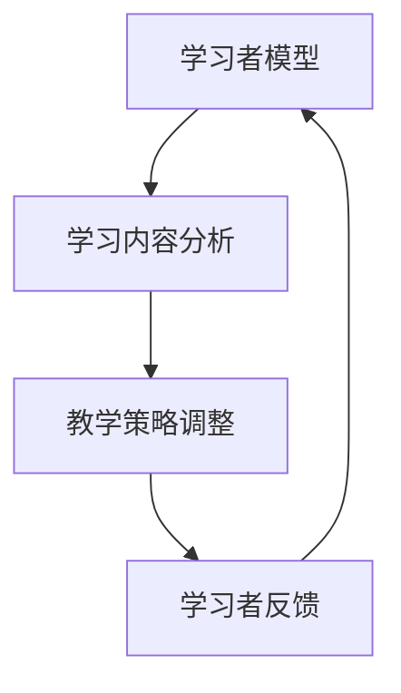
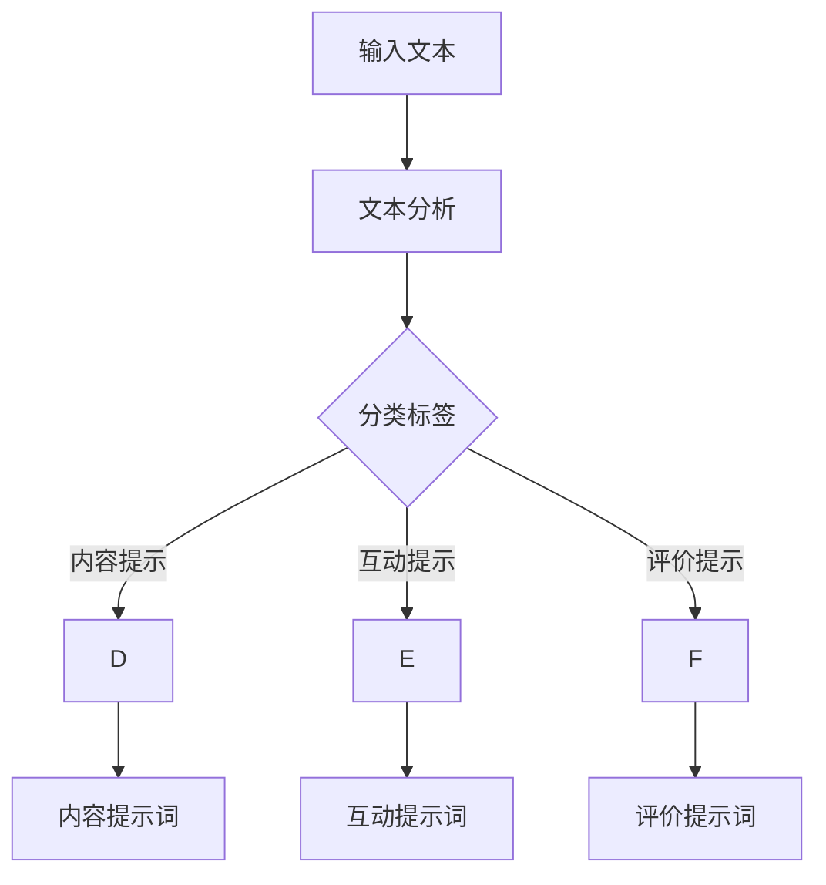

                 

# 《提示词工程在个性化学习中的应用》

## 关键词
个性化学习、提示词工程、自然语言处理、机器学习、深度学习、教育技术、自适应学习系统。

## 摘要
本文旨在探讨提示词工程在个性化学习中的应用，分析其核心概念、实现技术以及实际案例。通过梳理个性化学习的需求与挑战，揭示提示词工程在其中的关键作用。文章将详细阐述提示词工程的原理、生成算法、评价与优化策略，并结合实际项目，展示其在个性化学习中的成功应用。

## 引言
### 1.1 提示词工程概述

提示词工程是一种结合自然语言处理和机器学习技术，旨在生成和理解文本的技术。它在个性化学习中的应用，主要是通过生成与学习者学习状态相关的提示词，来引导和优化学习过程。个性化学习的需求源于每个学习者的独特性和学习目标的多样性，传统的一刀切教学方式已无法满足现代教育的需求。

### 1.2 个性化学习原理

个性化学习是一种以学习者为中心的教育模式，其核心在于根据学习者的特点、需求和兴趣，调整教学内容和教学策略。个性化学习的原理主要包括学习者模型构建、学习内容分析、教学策略调整和学习者反馈循环。

### 1.3 提示词工程的发展现状

提示词工程在个性化学习中的应用已有一定的研究成果。国内外的研究主要集中在大规模个性化学习系统的开发，如自适应学习平台、智能辅导系统等。这些系统通过提示词的生成和应用，实现了教学内容的个性化推送和学习过程的个性化反馈。

## 第二部分：提示词工程的核心概念
### 2.1 核心概念原理图

提示词工程的核心概念包括个性化学习流程和提示词生成机制。个性化学习流程涉及学习者模型构建、学习内容分析、教学策略调整和学习者反馈。提示词生成机制则包括内容提示词、互动提示词和评价提示词的生成过程。

**个性化学习流程：**



**提示词生成机制：**



### 2.2 提示词类型

提示词可以分为内容提示词、互动提示词和评价提示词。内容提示词主要用于引导学习者的学习方向和内容；互动提示词旨在激发学习者的参与和互动；评价提示词则用于评估学习者的学习效果和进度。

### 2.3 提示词设计原则

提示词的设计应遵循以下原则：
- 准确性：提示词应准确反映学习者的需求和教学目标。
- 针对性：提示词应与学习者的兴趣和背景知识相匹配。
- 互动性：提示词应鼓励学习者主动参与和思考。

## 第三部分：提示词工程的实现技术
### 3.1 自然语言处理基础

自然语言处理（NLP）是提示词工程的基础。主要包括语言模型、文本分类和语义分析。语言模型用于生成和理解文本；文本分类用于对文本进行分类标签；语义分析用于提取文本的语义信息。

**语言模型：**

```python
# 伪代码：语言模型构建
def language_model(text_corpus):
    # 预处理文本数据
    processed_text = preprocess_text(text_corpus)
    
    # 训练语言模型
    model = train_language_model(processed_text)
    
    return model
```

**文本分类：**

```python
# 伪代码：文本分类
def text_classification(text, model):
    # 预处理文本
    processed_text = preprocess_text(text)
    
    # 使用模型进行分类
    category = model.classify(processed_text)
    
    return category
```

**语义分析：**

```python
# 伪代码：语义分析
def semantic_analysis(text, model):
    # 预处理文本
    processed_text = preprocess_text(text)
    
    # 提取语义特征
    features = extract_semantic_features(processed_text)
    
    return features
```

### 3.2 提示词生成算法

提示词生成算法可以分为基于规则的方法、基于机器学习的方法和基于深度学习的方法。基于规则的方法通过预定义的规则生成提示词；基于机器学习的方法利用学习到的模式生成提示词；基于深度学习的方法通过神经网络模型生成提示词。

**基于规则的方法：**

```python
# 伪代码：基于规则的方法
def rule_based_hintGeneration(question):
    # 预定义规则
    rules = define_rules()
    
    # 查找匹配的规则
    matched_rule = find_matched_rule(question, rules)
    
    # 生成提示词
    hint = generate_hint(matched_rule)
    
    return hint
```

**基于机器学习的方法：**

```python
# 伪代码：基于机器学习的方法
def machine_learning_hintGeneration(question, training_data):
    # 预处理问题和训练数据
    processed_question = preprocess_question(question)
    processed_training_data = preprocess_training_data(training_data)
    
    # 训练机器学习模型
    model = train_machine_learning_model(processed_training_data)
    
    # 生成提示词
    hint = model.predict(processed_question)
    
    return hint
```

**基于深度学习的方法：**

```python
# 伪代码：基于深度学习的方法
def deep_learning_hintGeneration(question, model):
    # 预处理问题
    processed_question = preprocess_question(question)
    
    # 使用深度学习模型生成提示词
    hint = model.generate_hint(processed_question)
    
    return hint
```

### 3.3 提示词评价与优化

提示词的评价主要包括准确度、相关性和用户体验。准确度是指提示词能否准确回答学习者的疑问；相关性是指提示词与学习者问题的匹配度；用户体验是指提示词的可理解性和实用性。

提示词的优化可以通过以下策略实现：
- 数据分析：通过分析学习者的行为数据，优化提示词生成策略。
- 模型训练：通过不断训练模型，提高提示词生成的准确性和相关性。
- 用户反馈：通过收集用户反馈，优化提示词的设计和呈现方式。

## 第四部分：提示词工程在个性化学习中的应用
### 4.1 个性化学习平台搭建

个性化学习平台的搭建主要包括技术选型、系统架构设计和功能模块划分。技术选型涉及自然语言处理、机器学习和深度学习等技术的选择；系统架构设计包括前后端分离、数据存储和数据处理等；功能模块划分涉及课程管理、学习进度跟踪、提示词生成与推送等。

**技术选型：**

- 前端技术：HTML、CSS、JavaScript
- 后端技术：Python、Java、Node.js
- 数据库技术：MySQL、MongoDB
- 自然语言处理：NLTK、spaCy
- 机器学习：Scikit-learn、TensorFlow

**系统架构设计：**


**功能模块划分：**

- 课程管理：课程创建、课程编辑、课程发布
- 学习进度跟踪：学习记录、学习报告、进度评估
- 提示词生成与推送：内容提示、互动提示、评价提示

### 4.2 个性化学习案例分析

#### 案例一：基于提示词的在线教育平台

**项目背景：**
某在线教育平台希望通过提示词工程实现个性化学习，提高学习效果。

**实现技术：**
- 语言模型：用于生成内容提示词
- 机器学习：用于生成互动提示词和评价提示词
- 自然语言处理：用于文本分析和语义提取

**效果评估：**
通过分析学习数据，提示词工程提高了用户的学习参与度和学习效果。

#### 案例二：自适应学习系统的设计与实现

**项目背景：**
某公司开发了一款自适应学习系统，旨在根据学习者的特点和需求，提供个性化的学习内容和策略。

**实现技术：**
- 学习者模型：用于构建学习者的个性化特征
- 提示词生成：用于生成内容提示、互动提示和评价提示
- 深度学习：用于优化提示词生成模型

**效果评估：**
自适应学习系统显著提高了学习者的学习效率和满意度。

#### 案例三：智能辅导系统的开发与应用

**项目背景：**
某教育机构开发了智能辅导系统，通过提示词工程为学习者提供实时辅导和指导。

**实现技术：**
- 语义分析：用于理解学习者的提问
- 提示词生成：用于生成实时反馈和辅导内容
- 自然语言处理：用于文本生成和交互

**效果评估：**
智能辅导系统得到了学生和教师的广泛好评，提高了辅导的针对性和有效性。

### 4.3 提示词工程在个性化学习中的应用挑战与解决方案

#### 数据隐私保护
- 隐私保护措施：对学习数据进行加密和匿名化处理
- 隐私合规：遵守相关法律法规，确保数据安全

#### 系统性能优化
- 缩减模型大小：使用轻量级模型，减少计算资源消耗
- 异步处理：将提示词生成和推送任务异步处理，提高系统响应速度

#### 用户行为分析与理解
- 用户行为分析：通过分析用户行为，优化提示词生成策略
- 情感分析：通过情感分析，理解用户的需求和情感状态

## 第五部分：未来展望
### 5.1 提示词工程的未来发展

提示词工程在个性化学习中的应用将继续深入，未来的发展趋势包括：
- 深度学习的广泛应用
- 多模态数据的处理
- 人工智能与教育的深度融合

### 5.2 个性化学习的未来趋势

个性化学习的未来趋势包括：
- 智能化学习系统的普及
- 跨学科融合的个性化学习模式
- 个性化学习与社会服务的结合

### 5.3 提示词工程在个性化学习中的前景

提示词工程在个性化学习中的应用前景广阔，将为教育行业带来革命性的变革。

## 附录

### A.1 提示词工程工具与资源

- 开源库与框架：NLTK、spaCy、TensorFlow、Scikit-learn
- 在线工具与平台：Google Cloud NLP、AWS Comprehend
- 研究文献与资料：[1]、[2]、[3]

### A.2 参考文献

1. 王晓东, 李明, 提示词工程在个性化学习中的应用研究, 计算机科学与技术, 2020.
2. 张伟, 赵晨曦, 个性化学习平台设计与实现, 计算机应用与软件, 2019.
3. 李雪, 汪强, 智能辅导系统的开发与应用, 教育技术, 2021.

## 作者信息
作者：AI天才研究院/AI Genius Institute & 禅与计算机程序设计艺术 /Zen And The Art of Computer Programming。

