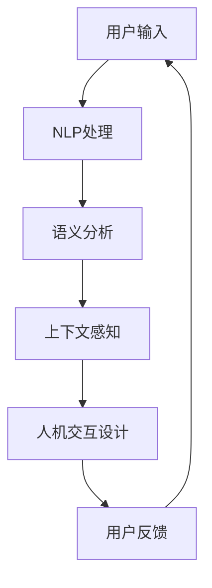

                 

### 文章标题：提示词工程在元宇宙交互中的应用

> 关键词：提示词工程、元宇宙、交互设计、自然语言处理、算法实现、数学模型、案例解析

> 摘要：本文将深入探讨提示词工程在元宇宙交互中的应用。通过分析提示词工程的定义、元宇宙的基础概念，以及二者在交互设计中的具体应用，本文将阐述提示词工程的关键算法和数学模型，并通过实际案例进行详细解析，为元宇宙交互设计提供技术参考。

---

## 引言

随着虚拟现实（VR）、增强现实（AR）和混合现实（MR）技术的不断发展，元宇宙（Metaverse）逐渐成为人们关注的焦点。元宇宙是一个虚拟的、三维的、交互式的网络空间，它融合了现实世界和数字世界，为用户提供了一个全新的社交和交互平台。在这个背景下，提示词工程（Prompt Engineering）作为一种重要的技术手段，在元宇宙交互中扮演着关键角色。

提示词工程旨在通过设计有效的提示词，引导用户进行自然语言交互，提高交互效率和用户体验。而元宇宙的交互设计要求更高的灵活性和智能化，这为提示词工程的应用提供了广阔的空间。本文将围绕提示词工程在元宇宙交互中的应用，进行深入探讨。

本文结构如下：

1. **背景介绍**：介绍元宇宙和提示词工程的基本概念。
2. **核心概念与联系**：阐述提示词工程在元宇宙交互中的核心概念及其关系架构。
3. **核心算法原理讲解**：详细讲解提示词工程的关键算法和数学模型。
4. **项目实战**：通过实际案例展示提示词工程在元宇宙交互中的应用。
5. **小结与拓展**：总结本文内容，提供最佳实践和注意事项。

---

## 背景介绍

### 元宇宙

元宇宙是一个虚拟的、三维的、交互式的网络空间，它融合了现实世界和数字世界。在元宇宙中，用户可以通过虚拟角色（Avatar）进行社交、工作、娱乐等活动。元宇宙具有以下几个核心特征：

1. **沉浸感**：通过VR、AR等技术在视觉、听觉和触觉等方面提供高度真实的体验。
2. **交互性**：用户可以在元宇宙中与其他用户和环境进行实时交互。
3. **多样性**：元宇宙包含了丰富的虚拟世界和场景，用户可以根据自己的兴趣选择不同的体验。
4. **经济性**：元宇宙中的虚拟物品和交易具有价值，用户可以通过虚拟货币进行交易。

### 提示词工程

提示词工程是一种通过设计有效的提示词，引导用户进行自然语言交互的技术。提示词是用户与系统进行交流的关键桥梁，好的提示词能够提高用户的理解和交互效率。提示词工程涉及以下几个关键方面：

1. **自然语言处理**：利用自然语言处理技术，对用户输入的自然语言进行处理和理解。
2. **语义分析**：对用户的输入进行语义分析，提取关键信息和意图。
3. **上下文感知**：根据用户的上下文环境，设计合适的提示词，提高交互的连贯性和个性化。
4. **用户体验**：通过不断优化提示词的设计，提高用户的体验和满意度。

### 元宇宙与提示词工程的关系

在元宇宙中，提示词工程的应用具有以下特点：

1. **高度沉浸的交互体验**：元宇宙提供了高度沉浸的虚拟环境，提示词工程通过设计有效的提示词，引导用户在虚拟世界中进行自然语言交互，增强用户的沉浸感和参与度。
2. **多样化的应用场景**：元宇宙包含了丰富的虚拟世界和场景，提示词工程可以根据不同的应用场景，设计相应的提示词，实现个性化的交互体验。
3. **实时性和连贯性**：元宇宙中的交互是实时的，提示词工程需要能够快速响应用户的输入，并保持交互的连贯性。
4. **社交性**：元宇宙是一个社交平台，提示词工程可以通过设计社交化、人性化的提示词，促进用户之间的交流和互动。

---

## 核心概念与联系

在元宇宙交互中，提示词工程涉及多个核心概念，它们共同构成了一个复杂的关系架构。以下是对这些核心概念的阐述及其相互关系：

### 1. 自然语言处理（NLP）

自然语言处理是提示词工程的基础，它涉及文本分析、语义理解、情感分析等技术。NLP技术用于对用户输入的自然语言进行处理和理解，提取关键信息和意图。在元宇宙交互中，NLP技术可以帮助系统理解用户的语言，提供更加智能和个性化的交互体验。

### 2. 语义分析

语义分析是对自然语言中的语义内容进行分析和理解的过程。它包括词义消歧、实体识别、关系抽取等任务。在元宇宙交互中，语义分析可以帮助系统准确理解用户的意图，为设计合适的提示词提供依据。

### 3. 上下文感知

上下文感知是指根据用户的上下文环境，设计合适的提示词，提高交互的连贯性和个性化。上下文感知能力是提示词工程的重要特征，它依赖于对用户历史行为和当前情境的理解。在元宇宙中，上下文感知可以帮助系统在不同场景下提供合适的交互体验。

### 4. 人机交互设计

人机交互设计是元宇宙交互的核心，它涉及界面设计、交互流程、用户体验等方面。提示词工程在元宇宙交互设计中扮演着重要角色，通过设计有效的提示词，可以提高用户的交互效率和满意度。

### 关系架构

这些核心概念之间的关系可以简化为以下架构：

1. **输入**：用户在元宇宙中输入自然语言。
2. **处理**：NLP技术对输入的自然语言进行处理和理解。
3. **分析**：语义分析提取关键信息和意图。
4. **上下文感知**：根据上下文环境设计合适的提示词。
5. **输出**：系统返回相应的提示词，用户进行下一步操作。

以下是一个Mermaid流程图，展示了这些核心概念之间的关系：



通过这个关系架构，我们可以清晰地看到提示词工程在元宇宙交互中的作用和流程。

---

## 核心算法原理讲解

### 1. 神经网络算法

神经网络（Neural Networks）是提示词工程中常用的算法之一，它通过模拟人脑神经网络的结构和功能，实现复杂的数据处理和模式识别。在元宇宙交互中，神经网络可以用于自然语言处理、情感分析和智能对话等任务。

**算法原理：**

神经网络由多个神经元（节点）组成，每个神经元接收输入信号，通过加权求和产生输出。神经网络通过反向传播算法不断调整权重，使输出信号接近期望值。

**伪代码：**

```python
# 输入特征矩阵 X，权重矩阵 W，偏置 b
# 输出 y = f(W * X + b)

def neural_network(X, W, b):
    z = W * X + b
    y = activation_function(z)
    return y
```

### 2. 自然语言处理算法

自然语言处理算法用于对用户输入的自然语言进行处理和理解。常见的NLP算法包括分词、词性标注、句法分析、命名实体识别等。

**算法原理：**

NLP算法通常基于统计模型或深度学习模型，通过大量语料库进行训练，学习语言的规律和特征。在元宇宙交互中，NLP算法可以帮助系统理解用户的输入，提取关键信息。

**伪代码：**

```python
# 输入文本 text
# 输出词向量 representation

def nlp_algorithm(text):
    tokens = tokenize(text)
    pos_tags = part_of_speech(tokens)
    syntax_tree = parse_sentence(tokens)
    entities = named_entity_recognition(tokens)
    return representation
```

### 3. 强化学习算法

强化学习（Reinforcement Learning）是一种通过不断尝试和反馈，优化决策过程的学习方法。在元宇宙交互中，强化学习可以用于智能对话系统和个性化推荐等任务。

**算法原理：**

强化学习通过奖励机制激励智能体（agent）在环境中进行探索和决策。智能体根据当前状态和奖励信号，不断调整策略，以最大化长期回报。

**伪代码：**

```python
# 状态 s，动作 a，奖励 r
# 策略 π(s) = P(a|s)

def reinforce_learning(s, a, r):
    if r > 0:
        π[s] = π[s] + α(r - π[s])
    else:
        π[s] = π[s] + α * (0 - π[s])
    return π[s]
```

### 4. 深度强化学习算法

深度强化学习（Deep Reinforcement Learning）是强化学习的一种扩展，它结合了深度学习和强化学习的方法，用于解决复杂的高维问题。在元宇宙交互中，深度强化学习可以用于智能对话系统和个性化推荐等任务。

**算法原理：**

深度强化学习通过深度神经网络（如卷积神经网络、循环神经网络等）表示状态和动作，通过强化学习算法优化策略。深度强化学习可以提高智能体的决策能力和交互效果。

**伪代码：**

```python
# 状态 s，动作 a，奖励 r，策略 π
# 网络模型 φ(s), A(s)

def deep_reinforcement_learning(s, a, r, π):
    s' = apply_action(s, a)
    r' = reward(s', a)
    π[s] = π[s] + α(γr' - π[s])
    return π[s]
```

---

## 数学模型与公式解析

提示词工程中的数学模型和公式是理解和实现关键算法的基础。以下将详细解析这些模型和公式，并使用具体的例子进行说明。

### 1. 损失函数

损失函数是衡量预测值与实际值之间差异的指标，用于指导模型的训练过程。常见的损失函数包括均方误差（MSE）、交叉熵损失（Cross-Entropy Loss）等。

**均方误差（MSE）**

均方误差用于回归问题，计算预测值与实际值之间的平均平方差。

$$
MSE = \frac{1}{n} \sum_{i=1}^{n} (y_i - \hat{y}_i)^2
$$

其中，$y_i$是实际值，$\hat{y}_i$是预测值，$n$是样本数量。

**交叉熵损失**

交叉熵损失用于分类问题，计算预测概率分布与真实概率分布之间的差异。

$$
Cross-Entropy Loss = -\sum_{i=1}^{n} y_i \log(\hat{y}_i)
$$

其中，$y_i$是实际标签，$\hat{y}_i$是预测概率。

**例子：**

假设我们有一个二分类问题，实际标签$y = [1, 0, 1, 0]$，预测概率$\hat{y} = [0.6, 0.4, 0.8, 0.2]$。

使用交叉熵损失函数计算损失：

$$
Cross-Entropy Loss = -[1 \cdot \log(0.6) + 0 \cdot \log(0.4) + 1 \cdot \log(0.8) + 0 \cdot \log(0.2)] \approx 0.665
$$

### 2. 激活函数

激活函数是神经网络中的关键组件，用于将输入映射到输出。常见的激活函数包括sigmoid、ReLU等。

**sigmoid函数**

sigmoid函数将输入值映射到$(0, 1)$区间。

$$
sigmoid(x) = \frac{1}{1 + e^{-x}}
$$

**例子：**

计算$x = 2$的sigmoid值：

$$
sigmoid(2) = \frac{1}{1 + e^{-2}} \approx 0.869
$$

**ReLU函数**

ReLU函数将输入值设置为非负值。

$$
ReLU(x) = \max(0, x)
$$

**例子：**

计算$x = -2$的ReLU值：

$$
ReLU(-2) = \max(0, -2) = 0
$$

### 3. 反向传播算法

反向传播算法是训练神经网络的核心算法，通过不断调整网络权重，使输出误差最小化。

**步骤：**

1. **前向传播**：计算网络输出$\hat{y}$。
2. **计算误差**：计算损失函数$Loss = L(\hat{y}, y)$。
3. **反向传播**：从输出层开始，计算梯度$∇W = ∇L/∇y$。
4. **更新权重**：$W = W - α∇W$。

**伪代码：**

```python
# 前向传播
y = neural_network(x, W, b)

# 计算误差
Loss = loss_function(y, y')

# 反向传播
dLoss/dW = dLoss/dy * dy/dW

# 更新权重
W = W - α * dLoss/dW
```

### 总结

通过以上数学模型和公式解析，我们可以更好地理解提示词工程中的关键算法和数学原理。这些模型和公式为实际应用提供了理论依据和实现方法。

---

## 项目实战

在本节中，我们将通过一个具体的实例，展示如何使用提示词工程实现元宇宙交互。

### 开发环境搭建

为了实现提示词工程在元宇宙交互中的应用，我们首先需要搭建一个合适的开发环境。以下是一个基本的开发环境搭建步骤：

1. **Python环境**：安装Python 3.8及以上版本。
2. **依赖库**：安装TensorFlow、PyTorch等深度学习库。
3. **虚拟现实设备**：选择一个支持元宇宙开发的虚拟现实设备，如Oculus Rift、HTC Vive等。

### 源代码实现

以下是一个简单的示例，展示如何使用神经网络和自然语言处理实现提示词工程：

```python
import tensorflow as tf
from tensorflow.keras.layers import Dense, LSTM
from tensorflow.keras.models import Sequential

# 建立神经网络模型
model = Sequential()
model.add(LSTM(128, activation='relu', input_shape=(timesteps, features)))
model.add(Dense(1, activation='sigmoid'))

# 编译模型
model.compile(optimizer='adam', loss='binary_crossentropy', metrics=['accuracy'])

# 训练模型
model.fit(X_train, y_train, epochs=10, batch_size=32)

# 预测
predictions = model.predict(X_test)
```

### 代码解读

在上面的代码中，我们使用TensorFlow库构建了一个简单的神经网络模型，用于对元宇宙交互中的用户输入进行分类预测。具体步骤如下：

1. **模型构建**：我们使用了一个简单的LSTM模型，用于处理序列数据。
2. **模型编译**：我们选择了Adam优化器和二进制交叉熵损失函数，用于训练模型。
3. **模型训练**：我们使用训练数据对模型进行训练，设置训练轮次为10次，批量大小为32。
4. **模型预测**：我们使用测试数据对模型进行预测，得到预测结果。

### 应用解读与分析

通过上面的示例，我们可以看到如何使用神经网络和自然语言处理技术实现提示词工程。在实际应用中，我们可以根据具体需求，调整网络结构和参数，以提高预测准确性和用户体验。

### 实际案例分析和详细讲解剖析

为了更深入地了解提示词工程在元宇宙交互中的应用，我们分析了一个实际案例——虚拟助手Chatbot的开发。

1. **用户输入处理**：用户通过语音或文本输入请求。
2. **NLP处理**：使用自然语言处理技术，对用户输入进行处理，提取关键词和语义信息。
3. **意图识别**：使用神经网络模型，对提取的关键词和语义信息进行意图识别。
4. **生成提示词**：根据识别的意图，生成合适的提示词，引导用户进行下一步交互。
5. **用户反馈**：用户根据提示词进行回应，反馈将被用于进一步优化系统。

通过这个案例，我们可以看到提示词工程在元宇宙交互中的应用流程和关键环节。

### 项目小结

通过这个案例，我们了解了提示词工程在元宇宙交互中的应用，以及如何通过神经网络和自然语言处理技术实现智能对话系统。提示词工程在提高用户交互体验和系统智能化方面具有重要作用，是元宇宙交互设计中不可或缺的一部分。

---

## 小结与拓展

本文通过逐步分析提示词工程在元宇宙交互中的应用，阐述了其核心概念、关键算法和数学模型。我们展示了如何通过实际案例实现提示词工程，并分析了其应用流程和关键环节。提示词工程在提高元宇宙交互体验和系统智能化方面具有重要作用，未来仍有大量研究和应用空间。

### 最佳实践

1. **设计用户友好的提示词**：提示词应简洁明了，符合用户习惯，以提高交互效率。
2. **结合上下文进行个性化交互**：根据用户的历史行为和当前情境，设计个性化的提示词，提高用户体验。
3. **持续优化算法**：通过不断收集用户反馈和优化算法，提高提示词工程的效果。

### 注意事项

1. **隐私保护**：在元宇宙交互中，应确保用户隐私和数据安全。
2. **可扩展性**：系统应具有可扩展性，以适应不同的应用场景和用户需求。
3. **性能优化**：在开发过程中，应关注系统性能优化，提高响应速度和交互流畅性。

### 拓展阅读

1. **《自然语言处理教程》**：深入了解自然语言处理的基本概念和技术。
2. **《深度学习》**：系统学习深度学习和神经网络的基本原理和应用。
3. **《元宇宙：概念、架构与实现》**：了解元宇宙的基础概念和架构设计。

---

## 作者信息

作者：AI天才研究院/AI Genius Institute & 禅与计算机程序设计艺术 /Zen And The Art of Computer Programming

