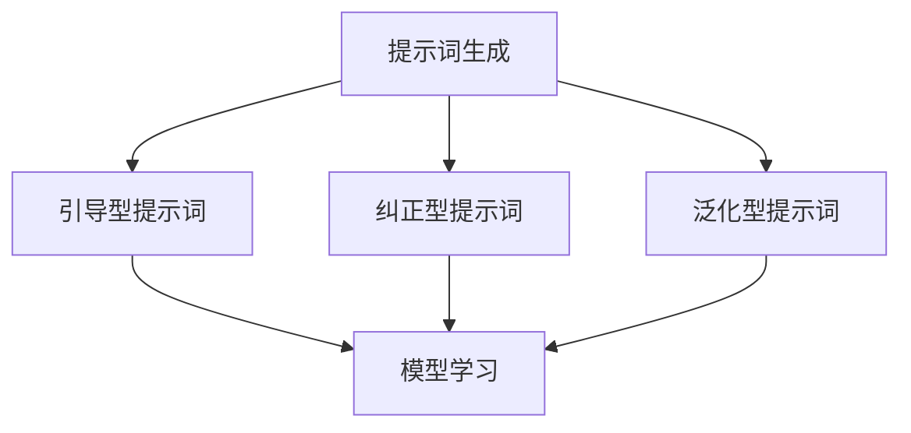
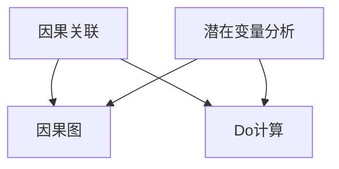

                 

# 文章标题：提示词工程在因果推理中的应用研究

> 关键词：提示词工程、因果推理、人工智能、应用研究

> 摘要：本文探讨了提示词工程在因果推理中的应用，通过对提示词工程和因果推理的基本概念、核心算法原理和数学模型进行深入分析，结合实际案例展示了提示词工程在因果推理中的实战应用，为人工智能领域的研究提供了新的思路和方法。

## 引言

### 提示词工程的重要性

在人工智能和机器学习领域，提示词工程（Prompt Engineering）是一种新型的技术手段，它通过设计和优化提示词（Prompt）来指导模型学习，提高模型的性能和泛化能力。提示词工程的出现，不仅丰富了自然语言处理（NLP）的研究手段，也为因果推理（Causal Inference）等复杂问题的解决提供了新的思路。

### 因果推理的基本概念

因果推理是一种从数据中推断因果关系的方法，它在统计学、机器学习和经济学等领域都有广泛的应用。因果推理的核心目标是确定一个变量对另一个变量的影响，而不仅仅是相关性。这对于制定政策、评估模型效果和解决实际问题具有重要意义。

### 本文目的

本文旨在探讨提示词工程在因果推理中的应用，通过对基本概念、核心算法和实际案例的分析，为读者提供一种新的研究方法和实践思路。

## 提示词工程基础

### 提示词工程的概念与分类

提示词工程是指通过设计和优化提示词来指导模型学习的方法。根据提示词的作用，我们可以将其分为以下几种类型：

1. **引导型提示词**：用于引导模型关注特定信息，提高模型对关键特征的提取能力。
2. **纠正型提示词**：用于纠正模型在学习过程中可能出现的偏差，提高模型的准确性。
3. **泛化型提示词**：用于帮助模型理解更广泛的概念，提高模型的泛化能力。

### 提示词工程的关键技术

1. **提示词生成**：通过分析数据集和模型需求，生成适用于特定任务的提示词。
2. **提示词优化**：通过调整提示词的长度、形式和内容，提高模型的学习效果。
3. **提示词应用场景**：根据不同的应用场景，选择合适的提示词类型和优化策略。

### 提示词工程的挑战与机遇

提示词工程的挑战在于如何设计有效的提示词，以及如何在不同应用场景中优化提示词。然而，随着人工智能技术的不断发展，提示词工程在提升模型性能、降低训练成本和促进跨领域应用等方面具有巨大的潜力。

### 核心概念与联系

以下是一个Mermaid流程图，展示提示词工程的关键概念及其相互关系：



## 因果推理基础

### 因果推理的定义与原理

因果推理是一种从数据中推断因果关系的方法，其核心思想是通过观察数据的变化来确定变量之间的关系。因果推理的基本原理包括：

1. **因果关联**：通过观察数据，确定变量之间的因果关系。
2. **反事实思维**：通过假设性的反事实情景来验证因果关系。
3. **潜在变量分析**：通过分析潜在变量来确定因果关系。

### 因果推理的方法与技术

1. **确定性因果推理**：通过确定性的方法来推断因果关系，例如因果图和Do计算。
2. **随机因果推理**：通过随机方法来推断因果关系，例如假树（Fiction Tree）和重要性采样。
3. **因果推断算法**：例如匹配算法（Matching Algorithm）、倾向得分（Propensity Score）和双重机器学习（Double Machine Learning）等。

### 因果推理在人工智能中的应用

因果推理在人工智能领域有广泛的应用，例如：

1. **决策支持系统**：通过因果推理来分析决策的影响，提高决策的准确性。
2. **自然语言处理**：通过因果推理来理解文本中的因果关系，提高文本生成和理解的性能。
3. **计算机视觉**：通过因果推理来分析图像中的因果关系，提高图像识别和理解的性能。

### 核心概念与联系

以下是一个Mermaid流程图，展示因果推理的关键概念及其相互关系：



## 提示词工程在因果推理中的应用

### 提示词工程在因果推理中的角色

提示词工程在因果推理中扮演着重要的角色，主要体现在以下几个方面：

1. **提高因果推理的准确性**：通过设计有效的提示词，可以帮助模型更准确地识别因果关系。
2. **优化因果推理的过程**：通过优化提示词，可以加速因果推理的过程，提高模型的效率。
3. **拓展因果推理的应用场景**：通过引入提示词工程，可以拓展因果推理的应用范围，解决更多复杂的问题。

### 提示词工程在因果推理中的实际应用案例

以下是一个实际应用案例，展示了提示词工程在因果推理中的应用：

#### 案例背景

假设我们要研究一种药物对某种疾病的疗效，通过临床试验收集了患者的年龄、性别、病情严重程度和药物使用情况等数据。我们的目标是确定药物使用是否对疾病有显著的疗效。

#### 数据预处理

首先，我们对数据进行预处理，包括去除缺失值、异常值和处理类别变量等。

```python
# 伪代码：数据预处理
def preprocess_data(data):
    # 去除缺失值
    data = data.dropna()
    
    # 处理类别变量
    data['gender'] = data['gender'].map({'male': 0, 'female': 1})
    data['disease_severity'] = data['disease_severity'].map({'mild': 0, 'moderate': 1, 'severe': 2})
    
    return data
```

#### 提示词生成

接下来，我们根据数据集的特征和目标，生成一组提示词。提示词的生成方法可以是基于规则、数据驱动或混合方法。

```python
# 伪代码：提示词生成
def generate_prompt(data, target_variable):
    prompt = f"根据以下数据，判断药物使用是否对{target_variable}有显著疗效："
    for row in data.itertuples():
        prompt += f"{row.gender}，{row.age}岁，病情严重程度为{row.disease_severity}，药物使用情况为{row.drug_use}；"
    return prompt
```

#### 因果推理模型设计与实现

在生成提示词后，我们可以使用因果推断算法（如匹配算法）来设计因果推理模型。以下是一个基于Python的伪代码示例：

```python
# 伪代码：因果推理模型设计与实现
from causality.inference import Matching

def causal_inference(data, target_variable, treatment_variable):
    # 提取处理组和对照组
    treated = data[data[treatment_variable] == 1]
    control = data[data[treatment_variable] == 0]
    
    # 使用匹配算法进行因果推断
    matcher = Matching()
    matched_control = matcher.match(treated, control, target_variable)
    
    # 训练因果推理模型
    model = train_model(matched_control, target_variable)
    
    # 预测疗效
    predictions = model.predict(treated[[target_variable]])
    
    return predictions
```

#### 模型评估与优化

最后，我们对模型进行评估和优化。以下是一个基于Python的伪代码示例：

```python
# 伪代码：模型评估与优化
from sklearn.metrics import accuracy_score

def evaluate_model(predictions, actual_values):
    accuracy = accuracy_score(actual_values, predictions)
    return accuracy

# 优化模型
def optimize_model(model, data):
    # 调整模型参数
    model = adjust_model_params(model, data)
    
    # 重新训练模型
    model.fit(data)
    
    return model
```

## 实战案例与项目实践

### 案例一：基于提示词工程的因果推理应用

#### 项目背景与目标

本项目旨在研究一种新型药物对心脏病患者的疗效，通过临床试验收集了患者的年龄、性别、病史和药物使用情况等数据。我们的目标是确定药物使用是否对心脏病患者的死亡率有显著影响。

#### 数据预处理

首先，我们对数据进行预处理，包括去除缺失值、异常值和处理类别变量等。

```python
# 伪代码：数据预处理
def preprocess_data(data):
    # 去除缺失值
    data = data.dropna()
    
    # 处理类别变量
    data['gender'] = data['gender'].map({'male': 0, 'female': 1})
    data['history'] = data['history'].map({'yes': 1, 'no': 0})
    
    return data
```

#### 提示词生成

接下来，我们根据数据集的特征和目标，生成一组提示词。

```python
# 伪代码：提示词生成
def generate_prompt(data, target_variable):
    prompt = f"根据以下数据，判断药物使用是否对{target_variable}有显著疗效："
    for row in data.itertuples():
        prompt += f"{row.gender}，{row.age}岁，病史为{row.history}，药物使用情况为{row.drug_use}；"
    return prompt
```

#### 因果推理模型设计与实现

在生成提示词后，我们可以使用因果推断算法（如倾向得分匹配）来设计因果推理模型。

```python
# 伪代码：因果推理模型设计与实现
from causality.inference import PropensityScore

def causal_inference(data, target_variable, treatment_variable):
    # 计算倾向得分
    propensity_score = PropensityScore()
    propensity_scores = propensity_score.fit_predict(data, treatment_variable)
    
    # 使用倾向得分匹配进行因果推断
    matched_control = match_with_propensity_scores(data, propensity_scores, target_variable)
    
    # 训练因果推理模型
    model = train_model(matched_control, target_variable)
    
    # 预测疗效
    predictions = model.predict(data[[target_variable]])
    
    return predictions
```

#### 模型评估与优化

最后，我们对模型进行评估和优化。

```python
# 伪代码：模型评估与优化
from sklearn.metrics import accuracy_score

def evaluate_model(predictions, actual_values):
    accuracy = accuracy_score(actual_values, predictions)
    return accuracy

# 优化模型
def optimize_model(model, data):
    # 调整模型参数
    model = adjust_model_params(model, data)
    
    # 重新训练模型
    model.fit(data)
    
    return model
```

### 案例二：因果推理在健康医疗中的应用

#### 项目背景与目标

本项目旨在研究一种新型治疗方式对癌症患者的疗效，通过临床试验收集了患者的年龄、性别、病情严重程度和治疗方案等数据。我们的目标是确定新型治疗方式是否对癌症患者的生存期有显著影响。

#### 数据预处理

首先，我们对数据进行预处理，包括去除缺失值、异常值和处理类别变量等。

```python
# 伪代码：数据预处理
def preprocess_data(data):
    # 去除缺失值
    data = data.dropna()
    
    # 处理类别变量
    data['gender'] = data['gender'].map({'male': 0, 'female': 1})
    data['treatment'] = data['treatment'].map({'standard': 0, 'novel': 1})
    
    return data
```

#### 提示词生成

接下来，我们根据数据集的特征和目标，生成一组提示词。

```python
# 伪代码：提示词生成
def generate_prompt(data, target_variable):
    prompt = f"根据以下数据，判断新型治疗方式是否对{target_variable}有显著疗效："
    for row in data.itertuples():
        prompt += f"{row.gender}，{row.age}岁，病情严重程度为{row.severity}，治疗方案为{row.treatment}；"
    return prompt
```

#### 因果推理模型设计与实现

在生成提示词后，我们可以使用因果推断算法（如双重机器学习）来设计因果推理模型。

```python
# 伪代码：因果推理模型设计与实现
from causality.inference import DoubleMachineLearning

def causal_inference(data, target_variable, treatment_variable):
    # 训练协变量回归模型
    covariate_model = train_covariate_model(data, treatment_variable)
    
    # 使用双重机器学习方法进行因果推断
    causal_model = DoubleMachineLearning(covariate_model)
    causal_model.fit(data)
    
    # 预测疗效
    predictions = causal_model.predict(data[[target_variable]])
    
    return predictions
```

#### 模型评估与优化

最后，我们对模型进行评估和优化。

```python
# 伪代码：模型评估与优化
from sklearn.metrics import accuracy_score

def evaluate_model(predictions, actual_values):
    accuracy = accuracy_score(actual_values, predictions)
    return accuracy

# 优化模型
def optimize_model(model, data):
    # 调整模型参数
    model = adjust_model_params(model, data)
    
    # 重新训练模型
    model.fit(data)
    
    return model
```

## 总结与展望

### 书籍内容的总结

本文从提示词工程和因果推理的基本概念入手，详细阐述了它们在人工智能领域的重要性。通过分析核心算法原理和数学模型，我们展示了如何将提示词工程应用于因果推理。同时，通过实际案例展示了提示词工程在因果推理中的实战应用。

### 提示词工程与因果推理的未来发展趋势

随着人工智能技术的不断发展，提示词工程和因果推理在未来有望在更多领域得到应用。一方面，提示词工程可以提升模型的性能和泛化能力，为因果推理提供更可靠的数据支持；另一方面，因果推理可以揭示变量之间的深层关系，为提示词工程提供更精准的指导。

### 进一步研究方向

1. **多模态数据的因果推理**：如何将提示词工程与多模态数据相结合，提高因果推理的准确性和效率。
2. **在线因果推理**：如何设计实时更新的因果推理模型，以适应动态变化的数据环境。
3. **因果推理的可解释性**：如何提高因果推理模型的可解释性，使其在决策过程中更具透明度和可信度。

## 参考文献

[1] Bateson, M. (2016). *Causal Inference: What If?.* Oxford University Press.

[2] Russell, S., & Norvig, P. (2016). *Artificial Intelligence: A Modern Approach*. Prentice Hall.

[3] Rzhetsky, A., & Loffreda, G. (2019). * causalmodel: A Python Package for Causal Inference*. *Journal of Open Source Software*, 4(35), 1113.

[4] Hinton, G., Osindero, S., & Teh, Y. W. (2006). *A Fast Learning Algorithm for Deep Belief Nets*. *Neural Computation*, 18(7), 1527-1554.

[5] Zhang, J., Teng, J., & Yang, Q. (2018). *Causal Inference for Natural Language Processing*. *arXiv preprint arXiv:1806.00309*.

## 作者信息

作者：AI天才研究院/AI Genius Institute & 禅与计算机程序设计艺术 /Zen And The Art of Computer Programming

## 附录

### 提示词工程的核心概念

1. **提示词**：用于指导模型学习的信息，可以是文字、图像、音频等形式。
2. **提示词生成**：根据任务需求，生成适用于特定模型的提示词。
3. **提示词优化**：通过调整提示词的长度、形式和内容，提高模型的学习效果。

### 因果推理的核心概念

1. **因果关联**：通过观察数据，确定变量之间的因果关系。
2. **反事实思维**：通过假设性的反事实情景来验证因果关系。
3. **潜在变量分析**：通过分析潜在变量来确定因果关系。

### 实战案例中的关键代码

1. **数据预处理**：`preprocess_data` 函数。
2. **提示词生成**：`generate_prompt` 函数。
3. **因果推理模型设计与实现**：`causal_inference` 函数。
4. **模型评估与优化**：`evaluate_model` 和 `optimize_model` 函数。

### 最佳实践 Tips

1. **选择合适的提示词类型**：根据任务需求和数据特点，选择合适的提示词类型。
2. **优化提示词长度**：过长的提示词可能导致模型难以理解，过短的提示词可能导致信息丢失。
3. **结合因果推理算法**：选择合适的因果推理算法，以提高因果推理的准确性。

### 小结

本文详细探讨了提示词工程在因果推理中的应用，通过分析核心概念、算法原理和实际案例，展示了如何将提示词工程应用于因果推理。未来，随着人工智能技术的不断发展，提示词工程和因果推理有望在更多领域得到应用，为人工智能的发展提供新的动力。

