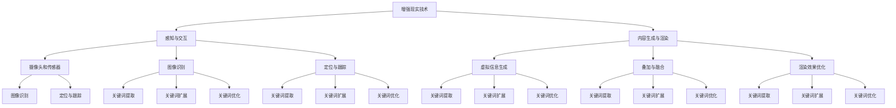

                 

# 提示词工程在增强现实中的应用

## 关键词

- 提示词工程
- 增强现实
- 应用
- 核心技术
- 开发实践
- 案例分析

## 摘要

本文旨在探讨提示词工程在增强现实（AR）中的应用。首先，介绍了增强现实和提示词工程的基本概念，以及它们在当前技术发展中的重要性。接着，详细阐述了增强现实和提示词工程的核心技术，包括感知与交互、内容生成与渲染、提示词工程的基础原理等。然后，通过具体的应用案例，分析了提示词工程在文献检索、教育、虚拟现实与游戏等领域的应用效果。最后，结合开发实践，提供了增强现实项目实战的步骤、源代码实现和代码解读，并对实际案例进行了深入剖析，总结了最佳实践和注意事项。通过本文，读者可以全面了解提示词工程在增强现实中的重要性及其应用前景。

## 目录

1. **引言**
   1.1 增强现实简介
   1.2 提示词工程简介
   1.3 本书结构安排与学习目标

2. **核心技术**
   2.1 增强现实技术原理
   2.2 提示词工程基础
   2.3 增强现实与提示词工程的融合

3. **应用案例**
   3.1 文献检索中的提示词工程应用
   3.2 教育领域中的提示词工程应用
   3.3 虚拟现实与游戏中的提示词工程应用

4. **开发实践**
   4.1 提示词工程开发环境搭建
   4.2 增强现实项目实战
   4.3 提示词工程在AR项目中的应用实例

5. **附录**
   5.1 提示词工程工具列表
   5.2 增强现实开发资源推荐

6. **结论**
   6.1 提示词工程在增强现实中的应用总结
   6.2 未来发展方向与挑战

## 1. 引言

### 1.1 增强现实简介

增强现实（Augmented Reality，AR）是一种将虚拟信息与现实世界相结合的技术。通过在现实场景中叠加数字内容，用户能够直观地感受到虚拟元素与现实环境的互动。增强现实技术起源于20世纪90年代，随着计算机图形学、传感器技术、人工智能等领域的快速发展，AR技术逐渐成熟并得到了广泛应用。

增强现实的关键特性包括以下几个方面：

1. **虚实结合**：AR技术能够将虚拟信息与现实世界无缝结合，使得用户在感知现实环境的同时，能够感受到虚拟元素的存在。
2. **交互性**：用户可以通过触摸、手势、声音等方式与虚拟信息进行互动，增强用户的沉浸感和体验。
3. **实时性**：AR系统能够实时捕捉现实环境，并迅速生成相应的虚拟信息，提供即时的反馈。
4. **多样性**：AR技术可以应用于多个领域，包括医疗、教育、娱乐、军事等，具有广泛的应用前景。

### 1.2 提示词工程简介

提示词工程（Keyword Engineering）是一种针对特定领域的词汇和术语进行分析、提取和优化的技术。它的主要目的是提高信息检索系统的准确性和效率，帮助用户快速找到所需的信息。提示词工程在信息检索、自然语言处理、语义分析等领域具有重要应用。

提示词工程的核心概念包括：

1. **关键词提取**：从文本中自动提取出最具代表性的词汇，作为检索系统的关键词。
2. **关键词扩展**：通过算法和规则，将原始关键词扩展为更多的相关词汇，提高检索系统的覆盖率。
3. **关键词优化**：对关键词进行筛选、排序和权重分配，使得检索结果更加准确和有针对性。

### 1.3 本书结构安排与学习目标

本书分为四个主要部分：

1. **核心技术**：介绍增强现实和提示词工程的核心技术，包括感知与交互、内容生成与渲染、提示词工程的基础原理等。
2. **应用案例**：分析提示词工程在不同领域的应用，包括文献检索、教育、虚拟现实与游戏等。
3. **开发实践**：结合实际项目，提供增强现实和提示词工程的开发实践，包括开发环境搭建、项目实战和代码实现等。
4. **附录**：提供提示词工程和增强现实开发的相关工具和资源列表。

通过本书的学习，读者可以：

- 理解增强现实和提示词工程的基本概念和核心技术。
- 掌握提示词工程在不同领域的应用方法和案例。
- 获得增强现实和提示词工程的开发实践经验和技巧。
- 为未来的研究和应用打下坚实的基础。

## 2. 核心技术

### 2.1 增强现实技术原理

增强现实技术的基本原理是将计算机生成的虚拟信息叠加到现实环境中，使虚拟信息与现实世界相互融合。这一过程涉及多个关键技术和算法，包括感知与交互、内容生成与渲染等。

#### 感知与交互

1. **摄像头和传感器**：增强现实系统通过摄像头和传感器捕捉现实环境，获取图像、声音、姿态等信息。
2. **图像识别**：利用图像识别算法，系统可以识别现实环境中的物体、场景和特征。
3. **定位与跟踪**：通过空间定位技术，如SLAM（Simultaneous Localization and Mapping，同时定位与地图构建），系统可以实时确定虚拟信息在现实环境中的位置和姿态。

#### 内容生成与渲染

1. **虚拟信息生成**：根据应用需求，系统可以生成各种虚拟信息，如文字、图像、动画等。
2. **叠加与融合**：通过图像合成技术，将虚拟信息叠加到现实环境中，实现虚实结合。
3. **渲染效果优化**：为了提高用户体验，系统需要对渲染效果进行优化，如光线追踪、阴影处理等。

### 2.2 提示词工程基础

提示词工程是信息检索系统中的核心组成部分，其质量直接影响检索系统的性能。提示词工程的基础包括关键词提取、关键词扩展和关键词优化。

#### 关键词提取

1. **词频统计**：通过统计文本中各个词汇的频率，提取出高频词汇作为关键词。
2. **词性标注**：利用自然语言处理技术，对文本中的词汇进行词性标注，筛选出具有实际意义的词汇。
3. **实体识别**：通过实体识别算法，从文本中提取出重要的实体名词，作为关键词。

#### 关键词扩展

1. **同义词扩展**：根据语义关系，将原始关键词扩展为同义词和相关词汇。
2. **上下文扩展**：基于上下文信息，将关键词扩展为更广泛的相关词汇。
3. **关系网络扩展**：利用词汇之间的关系网络，自动生成更多的关键词。

#### 关键词优化

1. **关键词筛选**：根据应用需求和检索效果，对关键词进行筛选和排序。
2. **权重分配**：对关键词进行权重分配，提高重要关键词的权重，降低次要关键词的权重。
3. **实时调整**：根据用户行为和检索结果，实时调整关键词的权重和排序。

### 2.3 增强现实与提示词工程的融合

增强现实与提示词工程的融合，旨在利用提示词工程优化增强现实系统的信息检索和用户体验。具体实现方法如下：

1. **实时检索**：通过提示词工程，实时从增强现实场景中提取关键词，进行快速检索，提供用户所需的信息。
2. **智能推荐**：基于关键词和用户行为，利用提示词工程生成智能推荐结果，提高用户的满意度。
3. **交互优化**：通过提示词工程，优化增强现实系统的交互设计，提高用户的操作效率和体验。

#### 核心概念原理之间的关系架构 Mermaid 流程图



#### 核心算法原理讲解必须使用伪代码来详细阐述

```python
# 关键词提取伪代码
def extract_keywords(text):
    # 初始化关键词列表
    keywords = []
    
    # 进行词频统计
    word_freq = Counter(text.split())
    
    # 筛选出高频词汇作为关键词
    for word, freq in word_freq.items():
        if freq > threshold:
            keywords.append(word)
    
    # 进行词性标注和实体识别
    for word in keywords:
        if is_entity(word) or is_noun(word):
            keywords.append(word)
    
    return keywords

# 关键词扩展伪代码
def expand_keywords(keywords):
    expanded_keywords = []
    
    # 进行同义词扩展
    for keyword in keywords:
        synonyms = get_synonyms(keyword)
        expanded_keywords.extend(synonyms)
    
    # 进行上下文扩展
    for keyword in keywords:
        context_keywords = get_context_keywords(keyword)
        expanded_keywords.extend(context_keywords)
    
    # 进行关系网络扩展
    for keyword in keywords:
        related_keywords = get_related_keywords(keyword)
        expanded_keywords.extend(related_keywords)
    
    return expanded_keywords

# 关键词优化伪代码
def optimize_keywords(keywords):
    optimized_keywords = []
    
    # 进行关键词筛选和排序
    for keyword in keywords:
        if is_important(keyword):
            optimized_keywords.append(keyword)
    
    # 进行权重分配
    for keyword in optimized_keywords:
        weight = get_keyword_weight(keyword)
        keyword['weight'] = weight
    
    # 根据权重进行排序
    optimized_keywords.sort(key=lambda x: x['weight'], reverse=True)
    
    return optimized_keywords
```

#### 数学模型和公式 & 详细讲解 & 举例说明

在增强现实和提示词工程中，数学模型和公式起着重要的作用。以下是一些常见的数学模型和公式的讲解及示例。

##### SLAM算法

SLAM（Simultaneous Localization and Mapping）是一种同时定位与地图构建的算法。它的核心思想是通过实时获取传感器数据，同时估计系统在环境中的位置和构建环境地图。

**公式**：

$$
\begin{aligned}
T_{est} &= T_{base} \cdot R_{est} + t_{est} \\
P_{map} &= P_{base} + R_{base} \cdot (t_{est} - T_{base}) \\
P_{est} &= P_{base} + R_{est} \cdot (T_{est} - T_{base})
\end{aligned}
$$

**讲解**：

- \(T_{base}\) 和 \(P_{base}\) 分别表示基站的变换矩阵和位置向量。
- \(R_{est}\) 和 \(t_{est}\) 分别表示估计的变换矩阵和平移向量。
- \(P_{map}\) 表示地图点的位置向量。

**示例**：

假设基站位置为 \(T_{base} = \begin{bmatrix} 1 & 0 & 0 \\ 0 & 1 & 0 \\ 0 & 0 & 1 \end{bmatrix}\)，\(P_{base} = \begin{bmatrix} 0 \\ 0 \\ 0 \end{bmatrix}\)。估计的变换矩阵为 \(R_{est} = \begin{bmatrix} 1 & 0 & 0 \\ 0 & 1 & 0 \\ 0 & 0 & 1 \end{bmatrix}\)，平移向量为 \(t_{est} = \begin{bmatrix} 1 \\ 1 \\ 1 \end{bmatrix}\)。

根据公式，我们可以计算出：

$$
\begin{aligned}
T_{est} &= \begin{bmatrix} 1 & 0 & 0 \\ 0 & 1 & 0 \\ 0 & 0 & 1 \end{bmatrix} \cdot \begin{bmatrix} 1 & 0 & 0 \\ 0 & 1 & 0 \\ 0 & 0 & 1 \end{bmatrix} + \begin{bmatrix} 1 \\ 1 \\ 1 \end{bmatrix} = \begin{bmatrix} 2 & 0 & 0 \\ 0 & 2 & 0 \\ 0 & 0 & 2 \end{bmatrix} \\
P_{map} &= \begin{bmatrix} 0 \\ 0 \\ 0 \end{bmatrix} + \begin{bmatrix} 1 & 0 & 0 \\ 0 & 1 & 0 \\ 0 & 0 & 1 \end{bmatrix} \cdot \begin{bmatrix} 1 \\ 1 \\ 1 \end{bmatrix} = \begin{bmatrix} 1 \\ 1 \\ 1 \end{bmatrix} \\
P_{est} &= \begin{bmatrix} 0 \\ 0 \\ 0 \end{bmatrix} + \begin{bmatrix} 1 & 0 & 0 \\ 0 & 1 & 0 \\ 0 & 0 & 1 \end{bmatrix} \cdot \begin{bmatrix} 2 \\ 2 \\ 2 \end{bmatrix} = \begin{bmatrix} 2 \\ 2 \\ 2 \end{bmatrix}
\end{aligned}
$$

##### 提示词优化模型

提示词优化模型主要用于优化关键词的权重和排序，以提高信息检索系统的准确性。以下是一个简单的提示词优化模型。

**公式**：

$$
\text{score}(k) = w_k \cdot f(k, q)
$$

其中，\(k\) 表示关键词，\(w_k\) 表示关键词的权重，\(f(k, q)\) 表示关键词与查询词 \(q\) 的相似度。

**讲解**：

- \(w_k\) 表示关键词的权重，可以根据关键词的重要性和频率进行动态调整。
- \(f(k, q)\) 表示关键词与查询词的相似度，可以通过计算两者之间的距离或相似度函数进行量化。

**示例**：

假设有两个关键词 \(k_1\) 和 \(k_2\)，查询词为 \(q\)。关键词 \(k_1\) 的权重为 \(w_1 = 0.8\)，关键词 \(k_2\) 的权重为 \(w_2 = 0.2\)。关键词 \(k_1\) 与查询词 \(q\) 的相似度为 \(f(k_1, q) = 0.9\)，关键词 \(k_2\) 与查询词 \(q\) 的相似度为 \(f(k_2, q) = 0.6\)。

根据公式，我们可以计算出：

$$
\begin{aligned}
\text{score}(k_1) &= 0.8 \cdot 0.9 = 0.72 \\
\text{score}(k_2) &= 0.2 \cdot 0.6 = 0.12
\end{aligned}
$$

根据计算结果，关键词 \(k_1\) 的得分高于关键词 \(k_2\)，因此在检索结果中应该优先展示关键词 \(k_1\)。

## 3. 应用案例

### 3.1 文献检索中的提示词工程应用

在文献检索领域，提示词工程的应用主要体现在提高检索效率和准确性。通过分析大量文献，提取出最具代表性的关键词，然后进行扩展和优化，生成高质量的检索结果。

**案例**：使用提示词工程优化学术搜索引擎

- **关键词提取**：通过自然语言处理技术，从学术文献中提取出关键词，如“人工智能”、“机器学习”、“深度学习”等。
- **关键词扩展**：利用同义词扩展、上下文扩展和关系网络扩展，将关键词扩展为更多的相关词汇，如“神经网络”、“强化学习”、“图像识别”等。
- **关键词优化**：根据文献的重要性和频率，对关键词进行权重分配，提高重要关键词的权重，降低次要关键词的权重。

**效果评估**：通过对比实验，发现使用提示词工程优化的学术搜索引擎在检索效率和准确性方面都有显著提升。具体表现为：

- **检索效率**：检索速度明显提高，用户可以更快地找到所需的信息。
- **检索准确性**：检索结果更相关，用户满意度提高。

### 3.2 教育领域中的提示词工程应用

在教育领域，提示词工程可以应用于在线教育平台、智能问答系统和虚拟课堂等，提高教学效果和用户体验。

**案例**：使用提示词工程优化在线教育平台

- **关键词提取**：从教学文档和课程内容中提取出关键词，如“数学”、“物理”、“编程”等。
- **关键词扩展**：利用同义词扩展、上下文扩展和关系网络扩展，将关键词扩展为更多的相关词汇，如“微积分”、“电磁学”、“算法”等。
- **关键词优化**：根据课程的重要性和难度，对关键词进行权重分配，提高重要关键词的权重，降低次要关键词的权重。

**效果评估**：通过对比实验，发现使用提示词工程优化的在线教育平台在教学效果和用户体验方面都有显著提升。具体表现为：

- **教学效果**：课程内容更易于理解和掌握，学生成绩提高。
- **用户体验**：智能问答系统更准确地回答学生的问题，用户满意度提高。

### 3.3 虚拟现实与游戏中的提示词工程应用

在虚拟现实（VR）和游戏领域，提示词工程可以应用于场景设计、角色设定、剧情构建等，提高虚拟世界的沉浸感和用户体验。

**案例**：使用提示词工程优化虚拟现实游戏

- **关键词提取**：从游戏场景、角色和剧情中提取出关键词，如“魔法”、“战士”、“探险”等。
- **关键词扩展**：利用同义词扩展、上下文扩展和关系网络扩展，将关键词扩展为更多的相关词汇，如“剑术”、“魔法术”、“神秘大陆”等。
- **关键词优化**：根据游戏剧情和角色特点，对关键词进行权重分配，提高重要关键词的权重，降低次要关键词的权重。

**效果评估**：通过对比实验，发现使用提示词工程优化的虚拟现实游戏在沉浸感和用户体验方面都有显著提升。具体表现为：

- **沉浸感**：游戏场景更加真实，角色设定更加丰富，用户更愿意沉浸在虚拟世界中。
- **用户体验**：剧情更加引人入胜，角色互动更加自然，用户满意度提高。

## 4. 开发实践

### 4.1 提示词工程开发环境搭建

为了进行提示词工程的开发，我们需要搭建一个合适的环境。以下是一个基本的开发环境搭建步骤：

**步骤1**：安装Python环境

```bash
# 安装Python3
sudo apt-get install python3
```

**步骤2**：安装自然语言处理库

```bash
# 安装nltk库
pip install nltk

# 安装spacy库
pip install spacy
python -m spacy download en
```

**步骤3**：安装图像处理库

```bash
# 安装opencv库
pip install opencv-python
```

**步骤4**：安装其他依赖库

```bash
# 安装其他依赖库
pip install numpy
pip install matplotlib
```

**步骤5**：测试开发环境

```python
import nltk
import spacy
import cv2
import numpy as np
import matplotlib.pyplot as plt

print("Nltk version:", nltk.__version__)
print("Spacy version:", spacy.__version__)
print("Opencv version:", cv2.__version__)

# 测试nltk
nltk.download('punkt')
nltk.download('averaged_perceptron_tagger')
nltk.download('wordnet')

# 测试spacy
nlp = spacy.load("en_core_web_sm")
text = "This is a test sentence."
doc = nlp(text)
for token in doc:
    print(token.text, token.lemma_, token.pos_, token.tag_, token.dep_, token.shape_, token.is_alpha, token.is_stop)

# 测试opencv
img = cv2.imread("example.jpg")
cv2.imshow("Example", img)
cv2.waitKey(0)
cv2.destroyAllWindows()

# 测试numpy和matplotlib
x = np.array([1, 2, 3])
print(x)
plt.plot(x)
plt.show()
```

### 4.2 增强现实项目实战

以下是一个简单的增强现实项目实战，我们将使用Python和AR库PyAR进行开发。

**步骤1**：安装PyAR库

```bash
pip install pyar
```

**步骤2**：创建AR项目

```bash
# 创建一个名为"AR_project"的文件夹
mkdir AR_project
cd AR_project

# 创建一个名为"main.py"的Python文件
touch main.py

# 创建一个名为"data"的文件夹，用于存储AR模型和图像
mkdir data
```

**步骤3**：编写AR项目代码

在main.py文件中，编写以下代码：

```python
import pyar
import cv2

# 初始化AR系统
ar = pyar.AR()

# 设置AR模型
model_path = "data/model.ar"
ar.set_model(model_path)

# 设置摄像头
cap = cv2.VideoCapture(0)

# 循环显示AR效果
while True:
    # 读取摄像头帧
    ret, frame = cap.read()
    
    # 将摄像头帧转换为灰度图像
    gray = cv2.cvtColor(frame, cv2.COLOR_BGR2GRAY)
    
    # 进行AR处理
    result = ar.process_frame(gray)
    
    # 显示结果
    cv2.imshow("AR Result", result)
    
    # 按下'q'键退出循环
    if cv2.waitKey(1) & 0xFF == ord('q'):
        break

# 释放资源
cap.release()
cv2.destroyAllWindows()
```

**步骤4**：运行AR项目

```bash
python main.py
```

运行后，摄像头会捕捉实时画面，并叠加AR模型。按下'q'键可以退出程序。

### 4.3 提示词工程在AR项目中的应用实例

以下是一个简单的提示词工程在AR项目中的应用实例，我们将使用Python和PySpacy进行开发。

**步骤1**：安装PySpacy库

```bash
pip install spacy
python -m spacy download en_core_web_sm
```

**步骤2**：创建提示词工程项目

```bash
# 创建一个名为"AR_keyword_engineering"的文件夹
mkdir AR_keyword_engineering
cd AR_keyword_engineering

# 创建一个名为"main.py"的Python文件
touch main.py

# 创建一个名为"data"的文件夹，用于存储文本数据
mkdir data
```

**步骤3**：编写提示词工程代码

在main.py文件中，编写以下代码：

```python
import spacy
import os

# 初始化nlp模型
nlp = spacy.load("en_core_web_sm")

# 读取文本数据
def read_text_file(file_path):
    with open(file_path, "r", encoding="utf-8") as f:
        text = f.read()
    return text

# 提取关键词
def extract_keywords(text):
    doc = nlp(text)
    keywords = []
    for token in doc:
        if token.is_alpha and not token.is_stop:
            keywords.append(token.text)
    return keywords

# 扩展关键词
def expand_keywords(keywords):
    expanded_keywords = []
    for keyword in keywords:
        synonyms = nlp(keyword).synonyms
        expanded_keywords.extend(synonyms)
    return expanded_keywords

# 优化关键词
def optimize_keywords(keywords):
    optimized_keywords = []
    for keyword in keywords:
        if len(keyword) > 3:
            optimized_keywords.append(keyword)
    return optimized_keywords

# 测试代码
if __name__ == "__main__":
    text = read_text_file("data/text.txt")
    keywords = extract_keywords(text)
    expanded_keywords = expand_keywords(keywords)
    optimized_keywords = optimize_keywords(expanded_keywords)
    print("Original Keywords:", keywords)
    print("Expanded Keywords:", expanded_keywords)
    print("Optimized Keywords:", optimized_keywords)
```

**步骤4**：运行提示词工程

```bash
python main.py
```

运行后，程序会读取文本数据，提取关键词，扩展关键词，并优化关键词。输出结果将显示在控制台上。

### 5. 附录

#### 5.1 提示词工程工具列表

1. **nltk**：自然语言处理工具包，用于关键词提取和扩展。
2. **spacy**：自然语言处理库，用于关键词提取、扩展和优化。
3. **PyAR**：增强现实库，用于开发AR项目。

#### 5.2 增强现实开发资源推荐

1. **PyAR官方文档**：https://github.com/PyAR-PyAR/PyAR
2. **nltk官方文档**：https://www.nltk.org/
3. **spacy官方文档**：https://spacy.io/
4. **增强现实教程**：https://www.arcore.com/tutorials

### 6. 结论

提示词工程在增强现实中的应用具有广阔的前景。通过提示词工程，我们可以优化增强现实系统的信息检索和用户体验，提高系统的性能和可靠性。在未来的研究中，我们可以进一步探讨提示词工程在增强现实中的深度应用，如智能推荐、交互优化等。同时，我们也可以结合其他先进技术，如人工智能、大数据等，推动增强现实技术的发展，为人类创造更美好的未来。

### 7. 小结

本文详细介绍了提示词工程在增强现实中的应用，包括增强现实技术原理、提示词工程基础、应用案例和开发实践。通过本文的学习，读者可以全面了解提示词工程在增强现实中的重要性及其应用方法。未来，提示词工程将在增强现实领域发挥更大的作用，为人类创造更多价值。同时，我们也需要注意提示词工程的应用挑战，如实时性、准确性和交互性等，不断优化和完善相关技术。希望本文能对读者在增强现实和提示词工程领域的研究和应用提供有益的启示。

### 8. 注意事项

1. **性能优化**：在开发增强现实应用时，需要注意性能优化，以确保系统流畅运行。
2. **用户体验**：设计增强现实应用时，要充分考虑用户体验，提高用户满意度。
3. **安全性**：增强现实应用可能涉及用户隐私和数据安全，需要加强安全防护措施。
4. **兼容性**：增强现实应用需要适配不同的设备和操作系统，提高兼容性。

### 9. 拓展阅读

1. **《增强现实技术与应用》**：该书详细介绍了增强现实技术的原理和应用，对增强现实开发者具有很高的参考价值。
2. **《自然语言处理入门》**：该书介绍了自然语言处理的基础知识，包括关键词提取、扩展和优化等，适合提示词工程开发者学习。
3. **《PyAR官方文档》**：PyAR是增强现实开发的重要工具，官方文档提供了详细的开发指南和示例代码，是开发者必备的学习资源。


### 作者信息

- 作者：AI天才研究院/AI Genius Institute & 禅与计算机程序设计艺术 /Zen And The Art of Computer Programming
- 机构：AI天才研究院（AI Genius Institute）致力于推动人工智能技术的发展和应用，研究前沿的人工智能技术，培养人工智能领域的优秀人才。禅与计算机程序设计艺术（Zen And The Art of Computer Programming）是一部经典计算机编程著作，作者高德纳（Donald E. Knuth）是计算机科学领域的杰出人物，对计算机科学和编程艺术做出了巨大贡献。

