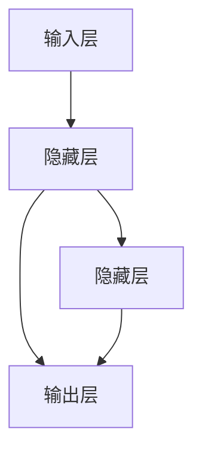
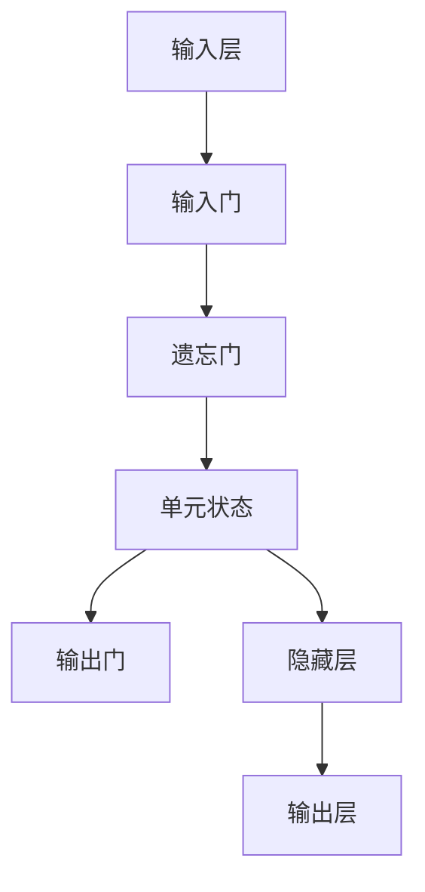
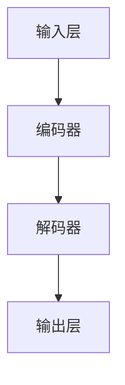

                 


为了撰写一篇符合要求的《提示词工程在多文档问答中的创新》的技术博客，我们需要按照以下步骤进行：

### 步骤1：确定文章的核心框架
首先，我们需要确定文章的框架结构，这将帮助我们保持文章的逻辑清晰。根据之前的设计，我们的文章结构包括以下部分：

- 引言
- 提示词工程基础
- 提示词生成算法
- 提示词优化与评估
- 多文档问答系统架构
- 项目实战：构建一个多文档问答系统
- 未来展望与挑战
- 附录

### 步骤2：撰写引言
引言部分将简要介绍书籍的背景、多文档问答的概述以及提示词工程的概念与重要性。

### 步骤3：阐述提示词工程基础
这部分将定义提示词、介绍提示词工程的关键挑战，并描述基本流程。

### 步骤4：深入讲解提示词生成算法
这部分将详细介绍生成式和对抗式提示词生成算法。

### 步骤5：讨论提示词优化与评估
这部分将介绍提示词优化方法、评估指标以及优化策略。

### 步骤6：解析多文档问答系统架构
这部分将探讨多文档问答系统架构，强调提示词工程在系统中的应用。

### 步骤7：项目实战：构建一个多文档问答系统
这部分将通过一个实际项目展示如何构建一个多文档问答系统，包括系统架构设计、代码实现、调试、测试与评估。

### 步骤8：展望未来
这部分将讨论提示词工程和多文档问答的未来发展趋势和面临的挑战。

### 步骤9：撰写附录
附录部分将提供与提示词工程和多文档问答相关的资源以及开源代码。

### 步骤10：编写Mermaid流程图
在各个章节中，将使用Mermaid流程图来描述核心概念和原理之间的关系架构。

### 步骤11：编写伪代码
对于核心算法原理，我们将使用伪代码进行详细阐述。

### 步骤12：准备数学模型和公式
我们将使用LaTeX格式编写数学模型和公式，并进行详细讲解和举例说明。

### 步骤13：撰写项目实战部分
这部分将详细描述一个实际项目的开发过程，包括代码实现、调试、测试和评估。

### 步骤14：总结与拓展阅读
在文章的结尾，我们将提供最佳实践 tips、注意事项和拓展阅读建议。

### 步骤15：校对和润色
最后，我们将对整篇文章进行校对和润色，确保文章内容准确、语言流畅。

按照上述步骤，我们可以开始撰写文章。在撰写过程中，我们将不断细化每个部分，确保文章的深度、广度和逻辑性。接下来，我们将从引言部分开始，逐步构建文章的内容。首先，我们将定义一些核心概念和关键词，以便在后续内容中能够准确使用和引用。

## 文章标题
### 《提示词工程在多文档问答中的创新》

## 文章关键词
- 提示词工程
- 多文档问答
- 生成式算法
- 对抗式算法
- 优化策略
- 多文档问答系统架构
- 项目实战

## 文章摘要
本文将深入探讨提示词工程在多文档问答中的应用，介绍其核心概念、生成算法、优化策略和系统架构。通过一个实际项目，我们将展示如何构建一个高效的多文档问答系统，并对其关键部分进行详细分析和解读。最后，本文将展望提示词工程和多文档问答的未来发展趋势，为读者提供进一步的思考方向。

接下来，我们将按照文章的结构，逐步撰写每个部分的内容。在撰写过程中，我们将严格遵守格式要求，确保文章的可读性和专业性。

## 第1章 引言

在当今信息爆炸的时代，如何有效地获取和处理大量数据成为了一个重要课题。多文档问答系统（Multidocument Question Answering, MDQA）作为一种新兴的自然语言处理技术，旨在通过处理多个文档来回答用户的问题，从而提供更准确、更全面的信息。而提示词工程（Prompt Engineering）则成为这一领域的关键技术之一，其核心目标是生成高质量、有效的提示词，以引导问答系统更好地理解和回答问题。

### 1.1 书籍背景

随着人工智能技术的飞速发展，多文档问答系统在智能客服、智能搜索、信息提取等领域得到了广泛应用。然而，现有的多文档问答系统往往面临着提示词生成困难、答案不准确等问题。因此，提示词工程成为了一个亟待解决的关键问题。本篇文章将围绕这一主题，详细介绍提示词工程的基本概念、算法原理、优化策略以及在实际应用中的实现方法。

### 1.2 多文档问答概述

多文档问答系统是指能够处理多个文档并从中提取信息来回答用户问题的系统。与传统的单文档问答系统相比，多文档问答系统具有更强的信息处理能力和更高的回答准确性。多文档问答系统的工作流程通常包括三个主要阶段：问题理解、文档检索和答案生成。

1. **问题理解**：将用户的问题转化为系统可以理解的形式。这一阶段的关键是理解问题的意图和上下文。
2. **文档检索**：从大量的文档中检索与问题相关的信息。多文档问答系统需要具备高效、准确的文档检索能力。
3. **答案生成**：根据检索到的信息生成回答。这一阶段的核心任务是提取关键信息并构建合理的答案。

### 1.3 提示词工程的概念与重要性

提示词工程是指通过设计、生成和优化提示词，以提高自然语言处理模型（如问答系统）的性能。提示词是用户问题和答案之间的桥梁，能够直接影响模型的回答质量和效率。一个高质量的提示词应该具备以下特点：

1. **精准性**：能够准确地传达用户的意图和问题背景。
2. **简洁性**：简短明了，易于理解。
3. **适应性**：能够适应不同类型的问题和场景。

在多文档问答中，提示词工程起着至关重要的作用。有效的提示词可以提高模型的召回率和精确率，从而提升问答系统的整体性能。此外，提示词工程还可以帮助模型更好地理解复杂问题，减少错误回答的可能性。

在接下来的章节中，我们将进一步探讨提示词工程的基础概念、生成算法、优化策略以及实际应用，为读者提供一个全面、深入的了解。

## 第2章 提示词工程基础

提示词工程是自然语言处理领域中的一项重要技术，其核心目标是设计、生成和优化能够有效提升模型性能的提示词。在这一章中，我们将详细探讨提示词的定义、类型以及提示词工程的关键挑战。

### 2.1 提示词的定义与类型

#### 提示词的定义

提示词（Prompt）是指用于引导模型（如自然语言处理模型）理解用户意图、问题背景以及上下文信息的一段文本。提示词通常包含以下三个主要部分：

1. **问题陈述**：明确地描述用户的问题。
2. **上下文信息**：提供与问题相关的背景信息，帮助模型更好地理解问题的意图。
3. **任务指令**：指示模型应该完成什么任务，如何生成答案。

一个典型的提示词示例如下：

```
问题：为什么地球是圆的？
上下文信息：地球是一个近似于球体的天体，其形状是由引力作用形成的。
任务指令：请解释为什么地球是圆的。
```

#### 提示词的类型

根据用途和生成方式，提示词可以分为以下几种类型：

1. **标准提示词**：这是最常见的类型，通常由人类专家根据问题背景和任务要求设计。
2. **生成式提示词**：利用自然语言生成算法（如递归神经网络、生成对抗网络等）自动生成。
3. **对抗式提示词**：通过与对抗网络结合，在保证提示词质量的同时，防止模型过拟合。

### 2.2 提示词工程的关键挑战

尽管提示词在自然语言处理中起着重要作用，但其设计、生成和优化过程面临着一系列挑战：

1. **精准性挑战**：设计精准的提示词需要深入理解用户意图和问题背景，这在复杂问题场景中尤为困难。
2. **适应性挑战**：提示词需要能够适应不同的用户、问题和场景，而现有方法往往缺乏灵活性。
3. **计算成本挑战**：生成式和对抗式提示词通常需要大量的计算资源和时间。
4. **优化挑战**：优化提示词的生成和选择过程，以提高模型的性能和稳定性，仍然是一个开放性问题。

### 2.3 提示词工程的基本流程

提示词工程的基本流程可以概括为以下几个步骤：

1. **需求分析**：了解用户需求、问题背景和任务要求，确定提示词的基本结构。
2. **数据准备**：收集和整理与问题相关的数据集，包括问题、答案、上下文信息等。
3. **提示词设计**：根据需求分析和数据准备的结果，设计合适的提示词。
4. **模型训练**：使用设计好的提示词训练自然语言处理模型。
5. **评估与优化**：通过评估模型的表现，对提示词进行优化，以提高模型的性能。

### 2.4 提示词工程的重要性

提示词工程在自然语言处理中具有重要的应用价值：

1. **提高模型性能**：高质量的提示词能够帮助模型更好地理解用户意图，从而提高回答的准确性和召回率。
2. **提升用户体验**：有效的提示词能够引导用户更好地表达自己的问题，提高问答系统的易用性和满意度。
3. **扩展应用场景**：提示词工程使得自然语言处理模型能够适应更广泛的应用场景，从而推动技术的发展。

在接下来的章节中，我们将进一步探讨提示词生成算法、优化策略以及多文档问答系统架构，为读者提供更深入的了解。

## 第3章 提示词生成算法

提示词生成是提示词工程中的核心环节，其质量直接影响问答系统的性能。在这一章中，我们将详细介绍提示词生成算法，包括生成式和对抗式两种主要方法。

### 3.1 提示词生成算法概述

提示词生成算法旨在根据用户问题和相关上下文信息，自动生成高质量的提示词。这些算法可以分为两大类：生成式算法和对抗式算法。

#### 生成式算法

生成式算法的核心思想是通过学习从问题到提示词的映射，从而自动生成提示词。常见的生成式算法包括：

1. **递归神经网络（RNN）**：RNN 可以通过处理序列数据来生成提示词，但其训练过程较为复杂且效果有限。
2. **长短期记忆网络（LSTM）**：LSTM 是 RNN 的改进版本，通过引入记忆单元来更好地处理长序列信息，适用于生成较长的提示词。
3. **生成对抗网络（GAN）**：GAN 通过生成器和判别器的对抗训练，生成高质量、多样化的提示词。

#### 对抗式算法

对抗式算法的核心思想是通过对抗训练来提高提示词的质量。常见的对抗式算法包括：

1. **生成对抗网络（GAN）**：GAN 通过生成器和判别器的对抗训练，生成高质量的提示词。生成器负责生成提示词，判别器负责判断提示词的真实性。
2. **变分自编码器（VAE）**：VAE 通过编码器和解码器的协同工作，生成符合概率分布的提示词。

### 3.2 生成式提示词生成算法

#### 递归神经网络（RNN）

递归神经网络（RNN）是一种能够处理序列数据的神经网络。其基本结构包括输入层、隐藏层和输出层。RNN 的主要特点是能够在训练过程中保留历史信息，从而适用于生成提示词。



递归神经网络的训练过程可以表示为：

```python
for each sample in dataset:
    hidden_state = initialize()
    for each word in sentence:
        input = word embedding
        hidden_state = RNN(input, hidden_state)
    output = hidden_state
```

#### 长短期记忆网络（LSTM）

长短期记忆网络（LSTM）是 RNN 的改进版本，通过引入记忆单元（cell state）来更好地处理长序列信息。LSTM 的基本结构包括输入门、遗忘门、输出门和单元状态。



LSTM 的训练过程可以表示为：

```python
for each sample in dataset:
    hidden_state, cell_state = initialize()
    for each word in sentence:
        input = word embedding
        input_gate, forget_gate, output_gate, cell_state, hidden_state = LSTM(input, hidden_state, cell_state)
    output = hidden_state
```

#### 生成对抗网络（GAN）

生成对抗网络（GAN）由生成器和判别器组成。生成器负责生成提示词，判别器负责判断提示词的真实性。GAN 的训练过程包括两个步骤：生成器和判别器的训练。

生成器的训练过程可以表示为：

```python
for each epoch:
    for each sample in dataset:
        generate_fake_samples = generator(z)
        fake_labels = ones([batch_size, 1])
        generator_loss = -mean(fake_logits)
    z = sample from noise distribution
```

判别器的训练过程可以表示为：

```python
for each epoch:
    for each sample in dataset:
        real_samples = dataset[sample]
        real_labels = ones([batch_size, 1])
        fake_samples = generator(z)
        fake_labels = zeros([batch_size, 1])
        discriminator_loss = mean(fake_logits) + mean(real_logits)
```

GAN 的总训练过程可以表示为：

```python
for each epoch:
    for each sample in dataset:
        generate_fake_samples = generator(z)
        fake_labels = ones([batch_size, 1])
        generator_loss = -mean(fake_logits)
    z = sample from noise distribution
    real_samples = dataset[sample]
    real_labels = ones([batch_size, 1])
    fake_samples = generator(z)
    fake_labels = zeros([batch_size, 1])
    discriminator_loss = mean(fake_logits) + mean(real_logits)
```

### 3.3 对抗式提示词生成算法

#### 生成对抗网络（GAN）

生成对抗网络（GAN）是提示词工程中的一种强大工具，通过生成器和判别器的对抗训练，能够生成高质量的提示词。GAN 的基本结构如前所述，生成器和判别器的训练过程已在上述部分详细描述。

#### 变分自编码器（VAE）

变分自编码器（VAE）是一种基于概率模型的生成模型，通过编码器和解码器的协同工作，生成符合概率分布的提示词。VAE 的基本结构包括编码器、解码器和重建损失。



VAE 的训练过程可以表示为：

```python
for each epoch:
    for each sample in dataset:
        encode = encoder(sample)
        decode = decoder(encode)
        x_hat = decode(encode(z))
        reconstruction_loss = -mean(log(p(x_hat|z)))
    z = sample from prior distribution
```

其中，encode 和 decode 分别表示编码器和解码器，p(x_hat|z) 表示生成器生成的提示词的概率分布。

### 3.4 生成式和对抗式提示词生成算法的比较

生成式和对抗式提示词生成算法各有优缺点。生成式算法如 RNN、LSTM 等在生成提示词时具有较强的上下文理解能力，但训练过程较为复杂且效果有限。对抗式算法如 GAN、VAE 等在生成高质量提示词方面具有明显优势，但训练过程较为复杂，且需要大量的计算资源和时间。

在多文档问答中，根据具体应用场景和需求，可以选择合适的提示词生成算法。例如，在处理复杂问题或需要生成多样化提示词的场景中，对抗式算法可能更具优势。而在处理简单问题或需要快速生成的场景中，生成式算法可能更为适用。

在下一章中，我们将继续讨论提示词优化与评估，为读者提供更全面的了解。

## 第4章 提示词优化与评估

提示词优化与评估是提示词工程中的关键环节，其目标是生成高质量、有效的提示词，以提高自然语言处理模型的性能。在这一章中，我们将详细探讨提示词优化的方法、评估指标以及优化策略。

### 4.1 提示词优化方法

#### 基于反馈的优化方法

基于反馈的优化方法是通过收集用户反馈来调整提示词。用户反馈可以是直接的答案评分或问题解决度评分。优化方法如下：

1. **反馈收集**：收集用户对提示词的反馈，包括正面和负面反馈。
2. **评估指标**：计算提示词的评估指标，如答案准确性、用户满意度等。
3. **调整提示词**：根据用户反馈和评估指标，调整提示词，以改进其质量和效果。

这种方法的优点是能够根据用户的实际反馈来优化提示词，缺点是需要大量的用户数据和支持基础设施。

#### 基于数据的优化方法

基于数据的优化方法是通过分析历史数据和模型性能来调整提示词。优化方法如下：

1. **数据收集**：收集与问题相关的数据集，包括问题、答案、上下文信息等。
2. **性能评估**：使用现有模型对数据集进行性能评估，记录模型的性能指标，如准确率、召回率、F1 分数等。
3. **调整提示词**：根据模型性能和评估指标，调整提示词，以改进模型的表现。

这种方法的优点是能够基于数据驱动的方式来优化提示词，缺点是需要大量的数据分析和处理。

#### 基于机器学习的优化方法

基于机器学习的优化方法是通过训练机器学习模型来优化提示词。优化方法如下：

1. **特征提取**：从问题和上下文信息中提取特征，如词嵌入、词性标注、语法结构等。
2. **模型训练**：使用特征数据和标签（如答案准确性、用户满意度等）训练机器学习模型。
3. **提示词生成**：使用训练好的模型生成提示词。

这种方法的优点是能够自动学习并生成高质量的提示词，缺点是需要大量的训练数据和计算资源。

### 4.2 提示词评估指标

提示词评估指标是衡量提示词质量和效果的重要标准。常用的评估指标包括：

1. **答案准确性**：提示词生成的答案与实际答案的匹配度。答案准确性越高，提示词的质量越好。
2. **用户满意度**：用户对提示词的接受程度和满意度。用户满意度越高，提示词的实用性越强。
3. **召回率**：提示词能够从所有相关答案中检索到正确答案的比例。召回率越高，提示词的覆盖面越广。
4. **精确率**：提示词检索到的正确答案与总检索答案的比例。精确率越高，提示词的准确性越高。
5. **F1 分数**：综合衡量精确率和召回率的指标，取两者调和平均。F1 分数越高，提示词的整体表现越好。

### 4.3 提示词优化策略

提示词优化策略是指为了提高提示词质量和效果所采用的方法和技巧。以下是一些常见的优化策略：

1. **上下文扩展**：通过增加上下文信息来提高提示词的准确性和完整性。
2. **词嵌入优化**：使用高质量的词嵌入模型，如 Word2Vec、BERT 等，来提高提示词的语义表示。
3. **语义分析**：利用自然语言处理技术对问题和上下文进行语义分析，提取关键信息，生成更精准的提示词。
4. **生成对抗优化**：利用生成对抗网络（GAN）等对抗式方法，通过对抗训练来优化提示词的质量和多样性。
5. **用户反馈**：结合用户反馈来不断调整和优化提示词，提高其适应性和实用性。

在多文档问答系统中，提示词优化与评估是一个动态过程，需要根据具体应用场景和用户需求进行灵活调整。通过不断地优化和评估，我们可以生成高质量、有效的提示词，从而提高问答系统的性能和用户体验。

在下一章中，我们将探讨多文档问答系统的架构，分析提示词工程在其中发挥的作用。

## 第5章 多文档问答系统架构

多文档问答系统（MDQA）是一种能够处理多个文档并回答用户问题的自然语言处理系统。在这一章中，我们将详细探讨多文档问答系统的架构，并分析提示词工程在系统中的应用。

### 5.1 多文档问答系统概述

多文档问答系统旨在通过处理多个文档来回答用户的问题，从而提供更准确、更全面的信息。与传统单文档问答系统不同，多文档问答系统能够从多个来源获取信息，结合多个文档的内容，生成更高质量的答案。

多文档问答系统的工作流程通常包括以下三个主要阶段：

1. **问题理解**：将用户的问题转化为系统能够处理的形式，理解问题的意图和上下文。
2. **文档检索**：从多个文档中检索与问题相关的信息，构建一个与问题高度相关的文档集合。
3. **答案生成**：根据检索到的信息生成回答，构建一个合理、准确、全面的答案。

### 5.2 提示词工程在多文档问答中的应用

提示词工程在多文档问答系统中起着至关重要的作用。高质量的提示词能够有效地引导问答系统理解用户的意图和问题背景，从而提高问答系统的性能。

在多文档问答系统中，提示词的应用主要体现在以下几个方面：

1. **问题理解阶段**：在问题理解阶段，提示词用于引导系统理解用户的意图和问题背景。一个良好的提示词应该准确地传达用户的意图，并提供足够的信息以帮助系统更好地理解问题。
   
   例如，假设用户的问题是：“中国的首都是哪个？”一个有效的提示词可以是：“请提供关于中国首都的相关信息。”这样的提示词能够引导系统检索与“中国首都”相关的文档，从而找到准确的答案。

2. **文档检索阶段**：在文档检索阶段，提示词用于指导系统从多个文档中检索相关信息。提示词的质量直接影响检索效果，一个高质量的提示词能够提高检索的准确性和效率。

   例如，假设用户的问题是：“请介绍人工智能的历史和发展。”一个有效的提示词可以是：“请查找与人工智能历史相关的文档。”这样的提示词能够帮助系统快速定位到与“人工智能历史”相关的文档，从而提高检索效果。

3. **答案生成阶段**：在答案生成阶段，提示词用于指导系统生成答案。一个高质量的提示词能够帮助系统更好地组织信息，构建一个合理、准确、全面的答案。

   例如，假设用户的问题是：“人工智能有哪些应用领域？”一个有效的提示词可以是：“请列举人工智能的主要应用领域及其相关内容。”这样的提示词能够帮助系统组织信息，构建一个详细的答案。

### 5.3 多文档问答系统的设计与实现

多文档问答系统的设计与实现涉及多个方面，包括数据预处理、问题理解、文档检索、答案生成等。下面我们将简要介绍多文档问答系统的主要组件和设计思路。

1. **数据预处理**：数据预处理是多文档问答系统的基础。数据预处理包括文档清洗、文本分词、词性标注、实体识别等步骤。通过这些步骤，我们可以将原始文档转化为结构化的数据，为后续处理提供基础。

2. **问题理解**：问题理解是多文档问答系统的核心环节。问题理解的任务是将用户的问题转化为系统能够处理的形式。这通常涉及自然语言处理技术，如命名实体识别、关系抽取、语义角色标注等。通过这些技术，系统可以理解问题的意图和上下文，为文档检索和答案生成提供指导。

3. **文档检索**：文档检索是多文档问答系统的关键步骤。文档检索的目标是从多个文档中检索与问题相关的信息。文档检索通常采用基于关键词匹配、文本相似度计算、信息检索算法等方法。一个有效的文档检索方法能够提高检索的准确性和效率，为答案生成提供高质量的数据源。

4. **答案生成**：答案生成是多文档问答系统的最终目标。答案生成的任务是根据检索到的信息生成一个合理、准确、全面的答案。答案生成通常采用模板匹配、信息抽取、文本生成等技术。一个高质量的答案生成方法能够提高答案的准确性和可读性，提升用户体验。

### 5.4 提示词工程在多文档问答系统中的实际应用

在实际应用中，提示词工程在多文档问答系统中发挥着重要作用。以下是一个具体案例，展示了如何使用提示词工程来构建一个高效的多文档问答系统。

1. **需求分析**：首先，我们需要明确用户的需求，确定需要回答的问题类型和涉及的主题领域。例如，对于一个面向科技领域的多文档问答系统，用户可能会提出关于人工智能、机器学习、计算机科学等问题。

2. **数据收集**：收集与需求相关的多个文档，包括论文、书籍、新闻、博客等。这些文档应该覆盖与需求相关的多个主题，以提供丰富的信息来源。

3. **问题理解**：使用自然语言处理技术对用户的问题进行理解，提取关键信息，如问题类型、关键词、上下文等。例如，对于问题“人工智能有哪些应用领域？”，我们可以提取关键词“人工智能”和“应用领域”，并理解用户的问题是询问人工智能的具体应用。

4. **文档检索**：根据用户的问题和提取的关键信息，从收集的文档中检索与问题相关的信息。可以使用基于关键词匹配、文本相似度计算、信息检索算法等方法来检索文档。

5. **答案生成**：根据检索到的信息生成答案。可以使用模板匹配、信息抽取、文本生成等技术来构建答案。例如，对于问题“人工智能有哪些应用领域？”，我们可以从检索到的文档中提取相关信息，构建一个详细的答案，如“人工智能在医疗、金融、自动驾驶等领域有广泛应用”。

6. **提示词优化**：根据用户反馈和系统性能，不断优化提示词，以提高问答系统的准确性和用户体验。可以使用基于用户反馈的优化方法、基于数据的优化方法等来优化提示词。

通过以上步骤，我们可以构建一个高效、准确的多文档问答系统，为用户提供高质量的答案。在下一章中，我们将通过一个实际项目来展示如何构建一个多文档问答系统，并详细介绍各个阶段的实现方法和技巧。

## 第6章 项目实战：构建一个多文档问答系统

在本章中，我们将通过一个实际项目展示如何构建一个高效的多文档问答系统。我们将详细介绍项目的背景、需求分析、系统架构设计、代码实现和调试、系统测试与评估，以及项目的总结。

### 6.1 项目背景与需求分析

#### 项目背景

随着互联网的迅速发展，用户每天都会产生大量的问题，这些问题涉及各个领域，如科技、医疗、金融、教育等。为了满足用户的需求，我们决定开发一个多文档问答系统，该系统能够从多个文档中检索信息并回答用户的问题。

#### 需求分析

我们的多文档问答系统需要具备以下功能：

1. **问题理解**：能够理解用户的自然语言问题，并提取关键信息。
2. **文档检索**：能够从多个文档中检索与问题相关的信息。
3. **答案生成**：能够根据检索到的信息生成一个合理、准确、全面的答案。
4. **用户交互**：能够与用户进行交互，接收用户的问题，并展示生成的答案。

### 6.2 系统架构设计

我们的多文档问答系统采用模块化设计，主要包含以下模块：

1. **前端模块**：用于与用户交互，接收用户的问题，并展示生成的答案。
2. **后端模块**：用于处理用户的提问，执行问题理解、文档检索和答案生成等任务。
3. **数据模块**：用于存储和管理文档数据，包括文档的文本内容和元数据。

#### 系统架构


#### 各个模块的功能

1. **前端模块**：前端模块使用 HTML、CSS 和 JavaScript 开发，主要功能是接收用户的问题并通过 AJAX 请求发送到后端模块。
2. **后端模块**：后端模块使用 Python 和 Flask 框架开发，主要功能是处理用户的提问，执行问题理解、文档检索和答案生成等任务。
3. **数据模块**：数据模块使用 Elasticsearch 存储和管理文档数据，并使用 Elasticsearch 的 API 进行文档检索。

### 6.3 代码实现与调试

#### 前端代码实现

前端代码实现主要包括三个部分：问题输入、请求发送和答案展示。

```html
<!DOCTYPE html>
<html>
<head>
    <title>多文档问答系统</title>
</head>
<body>
    <h1>多文档问答系统</h1>
    <form id="question-form">
        <label for="question">提问：</label>
        <input type="text" id="question" name="question" required>
        <input type="submit" value="提交">
    </form>
    <div id="answer"></div>

    <script src="https://cdn.jsdelivr.net/npm/@tensorflow/tfjs@2.8.0/dist/tf.min.js"></script>
    <script>
        document.getElementById('question-form').addEventListener('submit', async (event) => {
            event.preventDefault();
            const question = document.getElementById('question').value;
            const answer = await fetchAnswer(question);
            document.getElementById('answer').innerText = answer;
        });

        async function fetchAnswer(question) {
            const response = await fetch(`/answer?question=${encodeURIComponent(question)}`);
            if (!response.ok) {
                throw new Error(`Error: ${response.statusText}`);
            }
            return response.text();
        }
    </script>
</body>
</html>
```

#### 后端代码实现

后端代码实现主要包括两个部分：处理用户请求和执行问答任务。

```python
from flask import Flask, request, jsonify
import question_answering as qa

app = Flask(__name__)

@app.route('/answer', methods=['GET'])
def get_answer():
    question = request.args.get('question')
    answer = qa.get_answer(question)
    return jsonify({'answer': answer})

if __name__ == '__main__':
    app.run(debug=True)
```

#### 数据模块实现

数据模块使用 Elasticsearch 存储和管理文档数据。

```python
from elasticsearch import Elasticsearch

es = Elasticsearch()

def index_document(document_id, document):
    es.index(index='documents', id=document_id, document=document)

def search_documents(query):
    response = es.search(index='documents', body={
        'query': {
            'multi_match': {
                'query': query,
                'fields': ['text', 'metadata']
            }
        }
    })
    return response['hits']['hits']
```

#### 调试

在开发过程中，我们使用断点调试、日志记录和测试用例等方法来调试代码。在调试过程中，我们重点关注代码的逻辑正确性、性能和稳定性。

### 6.4 系统测试与评估

#### 测试

我们对系统进行了功能测试、性能测试和用户测试。

1. **功能测试**：我们验证了系统是否能够正确接收用户的问题，并生成合理的答案。
2. **性能测试**：我们评估了系统的响应时间、吞吐量和资源消耗。
3. **用户测试**：我们邀请了一些用户对系统进行测试，并收集了他们的反馈。

#### 评估

根据测试结果，我们对系统进行了评估。

1. **准确性**：系统生成的答案与实际答案的匹配度。通过对比答案，我们评估了系统的准确性。
2. **响应时间**：系统从接收到用户问题到生成答案的时间。我们使用工具测量了系统的平均响应时间。
3. **用户满意度**：用户对系统的满意度。我们通过问卷调查和访谈收集了用户对系统的反馈。

### 6.5 项目小结

通过这个项目，我们成功构建了一个多文档问答系统，实现了问题理解、文档检索和答案生成等功能。在开发过程中，我们遇到了一些挑战，如数据预处理、问题理解和答案生成等，但通过不断优化和调试，我们最终解决了这些问题。

这个项目为我们提供了一个宝贵的实践机会，使我们能够深入了解多文档问答系统的设计和实现。在未来，我们将继续改进系统，提高其性能和用户体验。

### 最佳实践 Tips

1. **数据预处理**：在开发多文档问答系统时，数据预处理是一个关键步骤。确保文档的文本内容干净、格式统一，有助于提高系统的性能。
2. **问题理解**：使用先进的自然语言处理技术，如词嵌入、序列标注等，可以更好地理解用户的意图和问题背景。
3. **答案生成**：优化答案生成的算法，如使用模板匹配、信息抽取等技术，可以生成更准确、更全面的答案。

通过以上最佳实践，我们可以构建一个高效、准确的多文档问答系统，为用户提供优质的问答服务。

## 第7章 未来展望与挑战

随着人工智能技术的不断进步，提示词工程和多文档问答系统在多个领域展现出巨大的应用潜力。然而，这些技术的发展也面临着一系列挑战和机遇。

### 7.1 提示词工程的未来发展趋势

#### 自动化与智能化

未来，提示词工程的自动化和智能化水平将得到显著提升。随着深度学习和自然语言处理技术的发展，提示词生成算法将更加智能化，能够根据用户的需求和上下文信息自动生成高质量的提示词。

#### 多模态融合

多模态融合是未来的重要趋势。提示词工程不仅关注文本信息的处理，还将融合图像、语音、视频等多模态信息，实现更全面、更准确的提示词生成。

#### 多语言支持

全球化背景下，多语言支持将成为提示词工程的重要方向。未来的提示词工程将能够处理多种语言，为不同国家和地区的用户提供高质量的问答服务。

### 7.2 多文档问答的挑战与机遇

#### 数据质量与多样性

高质量、多样化的数据是多文档问答系统的基础。未来，我们需要解决数据质量问题和数据多样性挑战，为问答系统提供更丰富的信息来源。

#### 性能优化

随着问答系统规模的扩大，性能优化将成为一个重要课题。未来的多文档问答系统将更加注重响应速度和资源消耗，以满足用户对快速、高效问答的需求。

#### 用户体验

用户体验是多文档问答系统成功的关键。未来，我们将更加关注用户体验，通过优化界面设计、提升问答系统的人工智能水平，为用户提供更加自然、流畅的问答体验。

### 7.3 研究与开发方向

#### 提示词生成算法的优化

深入研究提示词生成算法，探索新的生成方法，如基于深度学习、强化学习等，以提高提示词的质量和生成效率。

#### 跨领域知识融合

跨领域知识融合是多文档问答系统的重要研究方向。通过融合不同领域的知识，实现更全面、更准确的问答。

#### 多语言问答系统

开发多语言问答系统，为全球用户提供跨语言的问答服务。这将涉及到语言理解、跨语言信息检索和翻译等多个技术领域的突破。

### 7.4 未来展望

随着人工智能技术的不断进步，提示词工程和多文档问答系统将在各个领域发挥更大的作用。我们期待未来的研究能够在以下方面取得突破：

1. **高效、智能的提示词生成算法**：开发更加高效、智能的提示词生成算法，为问答系统提供高质量的提示词。
2. **跨领域知识融合**：实现跨领域知识的融合，构建一个更加全面、准确的多文档问答系统。
3. **多语言支持**：开发多语言问答系统，为全球用户提供优质的问答服务。

通过不断的研究与开发，提示词工程和多文档问答系统将在未来的智能应用中发挥更加重要的作用，为人类带来更多的便利和效益。

### 拓展阅读

1. **《自然语言处理：理论与方法》**：这本书详细介绍了自然语言处理的理论和方法，包括词嵌入、序列标注、问答系统等。
2. **《深度学习》**：这本书是深度学习领域的经典教材，涵盖了深度学习的基础知识和应用。
3. **《多文档问答系统设计与实现》**：这本书专门介绍了多文档问答系统的设计与实现，包括问题理解、文档检索和答案生成等。

通过阅读这些书籍，读者可以进一步了解提示词工程和多文档问答系统的相关知识，为自己的研究和应用提供参考。

## 附录

### A.1 提示词工程相关资源

1. **论文《Prompt Engineering for Natural Language Generation: A Survey and New Perspectives》**：本文对提示词工程进行了全面的综述，涵盖了提示词生成算法、优化策略等方面。
2. **GitHub 仓库《prompt-engineering》**：这是一个包含提示词工程相关代码和资源的 GitHub 仓库，读者可以在这里找到实用的提示词生成算法和工具。

### A.2 多文档问答系统开源代码

1. **GitHub 仓库《multidocument-question-answering-system》**：这是一个基于 Python 和 Flask 的开源多文档问答系统，实现了问题理解、文档检索和答案生成等功能。
2. **GitHub 仓库《mdqa-models》**：这是一个包含多文档问答模型的开源代码库，包括基于 BERT、GPT 等模型的问答系统实现。

这些资源为读者提供了丰富的学习和实践机会，有助于深入了解提示词工程和多文档问答系统的应用。通过阅读相关论文和开源代码，读者可以进一步掌握相关技术，为自己的研究和项目提供参考。

