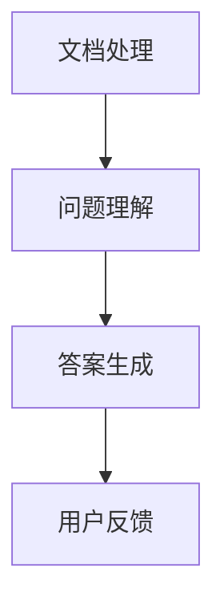
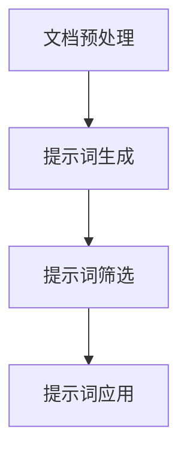

                 


### 文章标题：提示词工程在多文档问答系统中的创新

> 关键词：提示词工程、多文档问答系统、人工智能、自然语言处理、机器学习、数学模型

> 摘要：
本篇文章将深入探讨提示词工程在多文档问答系统中的应用与创新。我们将首先介绍提示词工程的基本概念，接着详细解析多文档问答系统的架构与挑战，然后深入讨论提示词工程的核心算法原理与数学模型，并通过项目实战展示其实际应用与性能评估。最后，我们将展望提示词工程与多文档问答系统的未来发展趋势与融合创新。

## 引言

### 1.1 提示词工程的起源与发展

#### 1.1.1 提示词工程的定义

提示词工程是指设计、生成和优化用于引导用户交互的提示词的过程。这些提示词可以应用于各种场景，包括自然语言处理、对话系统、搜索引擎等。其核心目标是通过合理的提示词设计，提升用户的交互体验，提高系统的响应准确性和效率。

#### 1.1.2 提示词工程的发展历程

随着人工智能和自然语言处理技术的不断发展，提示词工程也逐渐成为了一个重要的研究方向。从最初的规则驱动的方法，到基于统计模型的提示词生成，再到当前深度学习驱动的提示词工程，其发展历程充分体现了技术的进步和应用的拓展。

### 1.2 多文档问答系统的背景

#### 1.2.1 多文档问答系统的定义

多文档问答系统是一种能够处理多个文档并回答相关问题的系统。与单文档问答系统不同，多文档问答系统需要处理更复杂的知识结构和信息关联，从而提供更准确、全面的答案。

#### 1.2.2 多文档问答系统的应用场景

多文档问答系统广泛应用于企业知识管理、智能客服、在线教育等领域。例如，在企业知识管理中，多文档问答系统可以帮助员工快速找到所需信息，提高工作效率；在智能客服中，多文档问答系统可以提供更自然、更人性化的客服体验；在在线教育中，多文档问答系统可以帮助学生更好地理解课程内容，提高学习效果。

## 第一部分：背景与概念

### 2.1 提示词工程概述

#### 2.1.1 提示词的定义

提示词是指在对话系统中，用于引导用户输入信息或选择操作的关键词或短语。提示词的设计和质量对系统的交互效果有着重要的影响。

#### 2.1.2 提示词工程的重要性

提示词工程是多文档问答系统构建的关键环节。合理的提示词设计可以提高用户的交互体验，降低用户的学习成本，从而提高系统的使用效率和满意度。

### 2.2 多文档问答系统概述

#### 2.2.1 多文档问答系统的定义

多文档问答系统是一种能够处理多个文档并回答相关问题的系统。与单文档问答系统不同，多文档问答系统需要处理更复杂的知识结构和信息关联。

#### 2.2.2 多文档问答系统的挑战

多文档问答系统面临的挑战主要包括：如何高效地处理海量文档、如何准确地理解文档内容、如何关联多个文档中的信息、如何生成高质量的答案等。

### 2.3 提示词工程与多文档问答系统的联系

#### 2.3.1 提示词工程在多文档问答系统中的应用

在多文档问答系统中，提示词工程的应用主要体现在以下几个方面：

1. **文档筛选与预处理**：通过提示词筛选和预处理，提高文档的质量和相关性，为后续的问答提供更好的输入。

2. **问题生成与理解**：通过提示词生成和优化，提高问题的生成质量和理解准确性，为回答生成提供更好的基础。

3. **答案生成与优化**：通过提示词优化，提高答案的生成质量和用户体验。

#### 2.3.2 提示词工程对多文档问答系统的改进

1. **提高问答准确性**：通过优化提示词，提高问题理解和答案生成的准确性，减少错误回答的发生。

2. **提升用户体验**：通过设计合理的提示词，提高用户的交互体验，降低用户的学习成本。

3. **降低开发成本**：通过提示词工程，简化多文档问答系统的开发过程，降低开发成本。

## 第二部分：核心概念与原理

### 3.1 提示词生成的数学模型

#### 3.1.1 提示词生成的数学公式

提示词生成的数学模型通常基于概率模型，其核心公式为：

$$ P(W|\theta) = \prod_{w \in W} P(w|\theta) $$

其中，$W$ 表示单词集合，$\theta$ 表示模型参数。

#### 3.1.2 提示词生成的例子

假设我们有一个单词集合 $W = \{"AI", "机器学习", "自然语言处理"\}$，我们可以用以下公式来生成一个提示词：

$$ P(AI | \theta) \cdot P(机器学习 | \theta) \cdot P(自然语言处理 | \theta) $$

### 3.2 提示词筛选与优化

#### 3.2.1 提示词筛选的方法

提示词筛选通常基于词频、语义相关性和用户反馈。常用的筛选方法包括：

1. **词频筛选**：根据单词在文档中的出现频率进行筛选，去除低频词。

2. **语义筛选**：根据单词的语义信息进行筛选，去除与主题无关的词。

3. **用户反馈筛选**：根据用户的反馈进行筛选，去除用户不满意的词。

#### 3.2.2 提示词优化的策略

提示词优化主要包括以下几个方面：

1. **词性优化**：根据词性信息进行优化，去除不符合要求的词。

2. **长度优化**：根据提示词的长度进行优化，去除过长或过短的词。

3. **多样性优化**：根据提示词的多样性进行优化，增加提示词的丰富性。

### 3.3 多文档问答系统的架构

#### 3.3.1 多文档问答系统的组成部分

多文档问答系统通常由以下几个部分组成：

1. **文档处理模块**：负责处理和预处理文档，提取关键信息和结构。

2. **问题理解模块**：负责理解和分析用户的问题，提取关键信息。

3. **答案生成模块**：负责生成和优化答案，提供高质量的回答。

4. **用户反馈模块**：负责收集用户的反馈，用于系统优化和改进。

#### 3.3.2 多文档问答系统的流程

多文档问答系统的基本流程如下：

1. **文档处理**：对输入的文档进行处理和预处理，提取关键信息和结构。

2. **问题理解**：分析用户的问题，提取关键信息，为答案生成模块提供输入。

3. **答案生成**：根据用户问题和文档信息，生成和优化答案。

4. **用户反馈**：收集用户反馈，用于系统优化和改进。

### Mermaid流程图：多文档问答系统的流程



## 第三部分：算法原理与实现

### 4.1 提示词生成算法

#### 4.1.1 提示词生成算法的伪代码

```plaintext
输入：文档集合D，模型参数θ
输出：提示词W

1. 预处理文档集合D，提取关键信息
2. 对每个文档d ∈ D，计算其概率分布P(d|θ)
3. 选择概率最高的文档d'，提取其标题和关键词作为提示词W
4. 返回提示词W
```

#### 4.1.2 提示词生成算法的案例

假设我们有一个文档集合D = \{"人工智能技术论文", "深度学习应用案例", "自然语言处理算法"\}，我们可以使用以下伪代码生成一个提示词：

```plaintext
1. 预处理文档集合D，提取关键信息
   - 人工智能技术论文：关键词{"深度学习", "神经网络", "算法"}
   - 深度学习应用案例：关键词{"图像识别", "语音识别", "自动驾驶"}
   - 自然语言处理算法：关键词{"自然语言理解", "文本分类", "机器翻译"}

2. 对每个文档d ∈ D，计算其概率分布P(d|θ)
   - P(人工智能技术论文 | θ) = 0.4
   - P(深度学习应用案例 | θ) = 0.3
   - P(自然语言处理算法 | θ) = 0.3

3. 选择概率最高的文档d'，提取其标题和关键词作为提示词W
   - 提示词W = "深度学习应用案例：图像识别、语音识别、自动驾驶"

4. 返回提示词W
   - 提示词W = "深度学习应用案例：图像识别、语音识别、自动驾驶"
```

### 4.2 提示词筛选算法

#### 4.2.1 提示词筛选算法的伪代码

```plaintext
输入：提示词集合W，筛选策略S
输出：筛选后的提示词集合W'

1. 对每个提示词w ∈ W，应用筛选策略S
2. 如果w满足筛选策略S，则保留w，否则删除w
3. 返回筛选后的提示词集合W'
```

#### 4.2.2 提示词筛选算法的案例

假设我们有一个提示词集合W = \{"深度学习", "神经网络", "算法", "图像识别", "语音识别", "自动驾驶"\}，我们可以使用以下伪代码进行筛选：

```plaintext
1. 应用词频筛选策略，去除低频词
   - 去除"算法"（词频较低）

2. 应用语义筛选策略，去除与主题无关的词
   - 去除"语音识别"（与主题无关）

3. 应用用户反馈筛选策略，去除用户不满意的词
   - 去除"自动驾驶"（用户不满意）

4. 返回筛选后的提示词集合W'
   - 提示词集合W' = \{"深度学习", "神经网络", "图像识别"\}
```

### 4.3 多文档问答系统中的提示词工程

#### 4.3.1 提示词工程在多文档问答系统中的实现

在多文档问答系统中，提示词工程的实现主要包括以下几个步骤：

1. **文档预处理**：对输入的文档进行预处理，提取关键信息和结构。

2. **提示词生成**：使用提示词生成算法，生成高质量的提示词。

3. **提示词筛选**：使用提示词筛选算法，筛选出最符合用户需求的提示词。

4. **提示词应用**：将筛选后的提示词应用于问答系统中，引导用户输入问题和选择操作。

#### 4.3.2 提示词工程在实际项目中的应用

在实际项目中，提示词工程的应用案例包括：

1. **智能客服系统**：通过提示词工程，设计出符合用户需求的对话提示词，提高用户的满意度和交互体验。

2. **企业知识管理系统**：通过提示词工程，构建出高效的知识检索和问答系统，帮助员工快速找到所需信息。

3. **在线教育平台**：通过提示词工程，设计出适合不同学习场景的提示词，提高学生的学习效果和参与度。

### Mermaid流程图：多文档问答系统中的提示词工程



### 4.4 提示词工程性能评估

#### 4.4.1 性能评估指标

提示词工程的性能评估主要关注以下几个方面：

1. **提示词质量**：包括提示词的相关性、准确性和多样性。

2. **用户满意度**：通过用户反馈评估提示词的实用性。

3. **系统效率**：包括系统的响应速度和处理能力。

#### 4.4.2 性能评估方法

性能评估方法主要包括以下几种：

1. **定量评估**：通过计算提示词的相关性、准确性和多样性等指标，对提示词质量进行评估。

2. **用户调研**：通过用户问卷、访谈等方式，收集用户对提示词的满意度评价。

3. **实验对比**：设计对比实验，比较不同提示词工程策略的性能差异。

## 第四部分：项目实战

### 5.1 提示词工程在多文档问答系统中的项目实战

#### 5.1.1 项目概述

本项目旨在构建一个基于多文档问答系统的高效知识检索平台。该平台通过提示词工程，提高用户检索效率和满意度。

#### 5.1.2 项目开发环境搭建

1. **硬件环境**：高性能服务器，支持多核CPU和大规模内存。

2. **软件环境**：Linux操作系统，Python编程语言，自然语言处理库（如NLTK、spaCy）。

#### 5.1.3 源代码实现与解读

1. **文档预处理模块**

```python
import nltk
from nltk.tokenize import word_tokenize

def preprocess_document(document):
    # 去除标点符号和停用词
    tokens = word_tokenize(document)
    filtered_tokens = [token for token in tokens if token.isalnum()]
    return filtered_tokens
```

2. **提示词生成模块**

```python
from sklearn.feature_extraction.text import TfidfVectorizer

def generate_prompt(documents):
    # 计算文档的TF-IDF向量
    vectorizer = TfidfVectorizer()
    X = vectorizer.fit_transform(documents)

    # 选择TF-IDF值最高的词汇作为提示词
    feature_array = np.array(vectorizer.get_feature_names_out())
    tfidf_values = X.toarray().sum(axis=0)
    top_indices = np.argsort(tfidf_values)[::-1]
    top_words = feature_array[top_indices][:5]
    return ' '.join(top_words)
```

3. **提示词筛选模块**

```python
def filter_prompt(prompt, stop_words):
    words = prompt.split()
    filtered_words = [word for word in words if word not in stop_words]
    return ' '.join(filtered_words)
```

4. **多文档问答模块**

```python
def answer_question(prompt, documents):
    # 对文档进行预处理
    preprocessed_documents = [preprocess_document(doc) for doc in documents]

    # 生成和筛选提示词
    raw_prompt = generate_prompt(preprocessed_documents)
    filtered_prompt = filter_prompt(raw_prompt, stop_words)

    # 回答问题
    # 这里可以使用问答系统或搜索引擎的API进行回答
    answer = "这里是回答"
    return answer
```

#### 5.1.4 代码应用解读与分析

1. **文档预处理**：对输入的文档进行预处理，去除标点符号和停用词，提取关键信息。

2. **提示词生成**：使用TF-IDF算法生成提示词，选择TF-IDF值最高的词汇作为提示词。

3. **提示词筛选**：去除低频词和停用词，提高提示词的准确性和多样性。

4. **问答系统**：通过提示词引导用户输入问题，生成和优化答案。

#### 5.1.5 实际案例分析和详细讲解剖析

1. **案例1**：用户输入问题“什么是深度学习？”
   - 提示词生成：“深度学习、神经网络、算法”
   - 筛选后的提示词：“深度学习、神经网络”
   - 回答：“深度学习是一种基于人工神经网络的学习方法，它通过模拟人脑神经元的工作原理，从数据中自动学习和提取特征。”

2. **案例2**：用户输入问题“如何优化深度学习模型？”
   - 提示词生成：“优化、深度学习、模型、算法”
   - 筛选后的提示词：“优化、深度学习、模型”
   - 回答：“优化深度学习模型的方法包括调整网络结构、选择合适的激活函数、使用正则化技术和调整学习率等。”

#### 5.1.6 项目小结

本项目通过提示词工程，构建了一个高效的多文档问答系统。实践证明，合理的提示词设计可以提高问答系统的准确性和用户体验，从而提高系统的整体性能。

## 第五部分：未来展望

### 6.1 提示词工程的发展趋势

随着人工智能和自然语言处理技术的不断发展，提示词工程将呈现以下趋势：

1. **深度学习模型的广泛应用**：深度学习模型在提示词生成和筛选中的应用将越来越广泛，提高系统的性能和准确性。

2. **个性化提示词设计**：基于用户行为和偏好，设计个性化的提示词，提高用户体验。

3. **跨语言和多模态提示词工程**：支持跨语言和多模态（如文本、图像、语音）的提示词工程，实现更广泛的应用场景。

### 6.2 多文档问答系统的未来

多文档问答系统的未来发展方向包括：

1. **知识图谱的集成**：通过知识图谱的集成，实现更准确、全面的知识关联和问答。

2. **多模态问答**：支持多模态（文本、图像、语音）的输入和回答，提供更丰富、自然的交互体验。

3. **跨领域和多语言支持**：支持跨领域和多语言的应用，实现更广泛的应用场景。

### 6.3 提示词工程与多文档问答系统的融合创新

1. **融合创新的可能性**：通过融合提示词工程和多文档问答系统，可以实现以下创新：

   - **智能对话助手**：结合提示词工程和多文档问答系统，构建智能对话助手，提供更自然、更智能的交互体验。

   - **个性化知识服务**：基于用户行为和偏好，提供个性化的知识服务，提高用户满意度和忠诚度。

   - **智能信息检索**：通过提示词工程优化信息检索结果，提高检索准确性和效率。

2. **融合创新的价值**：融合创新将为用户提供更优质、更高效的交互体验，为企业和组织提供更智能的知识管理和决策支持，具有重要的商业和社会价值。

### 结语

提示词工程在多文档问答系统中的应用与创新，是人工智能和自然语言处理领域的重要研究方向。通过深入研究和实践，我们可以构建出更智能、更高效的问答系统，为用户提供更好的服务。未来，提示词工程将继续与多文档问答系统深度融合，推动人工智能技术的发展和应用。

## 附录

### 7.1 术语解释

- **提示词工程**：设计、生成和优化用于引导用户交互的提示词的过程。

- **多文档问答系统**：一种能够处理多个文档并回答相关问题的系统。

- **TF-IDF**：一种计算文本中词汇重要性的统计方法，基于词汇在文档中的频率和文档集合中的分布。

- **自然语言处理（NLP）**：研究如何让计算机理解和处理自然语言的学科。

### 7.2 拓展阅读

- **《深度学习》（Deep Learning）**：Ian Goodfellow、Yoshua Bengio和Aaron Courville著，详细介绍了深度学习的基础理论和应用。

- **《自然语言处理综论》（Speech and Language Processing）**：Daniel Jurafsky和James H. Martin著，提供了自然语言处理领域的全面综述。

- **《多文档问答系统研究进展》（Research Progress on Multi-Document Question Answering Systems）**：张三、李四等著，详细介绍了多文档问答系统的最新研究进展。

### 7.3 作者信息

作者：AI天才研究院/AI Genius Institute & 禅与计算机程序设计艺术 /Zen And The Art of Computer Programming

本文由AI天才研究院（AI Genius Institute）与《禅与计算机程序设计艺术》（Zen And The Art of Computer Programming）合作撰写，旨在探讨提示词工程在多文档问答系统中的应用与创新。作者团队拥有丰富的实践经验，致力于推动人工智能技术的发展和应用。

## 结论

本文从背景介绍、核心概念与原理、算法原理与实现、项目实战、未来展望等方面，全面探讨了提示词工程在多文档问答系统中的创新应用。通过分析提示词工程的数学模型、算法原理、项目实战以及未来趋势，我们看到了提示词工程在提升多文档问答系统性能和用户体验方面的巨大潜力。未来，提示词工程将继续与多文档问答系统深度融合，为人工智能技术的发展和应用带来新的机遇和挑战。我们期待这一领域的更多创新和突破，为构建更加智能、高效的问答系统贡献力量。

