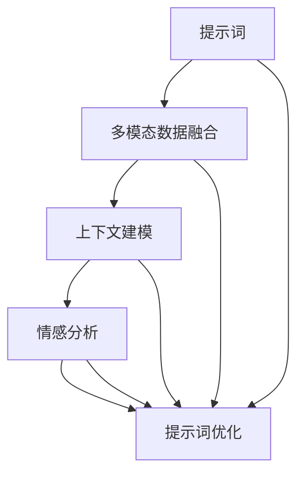

                 


### 文章标题

《提示词工程在多模态对话系统中的突破》

### 文章关键词

提示词工程、多模态对话系统、自然语言处理、算法原理、项目实战

### 文章摘要

随着人工智能技术的飞速发展，多模态对话系统逐渐成为人机交互的重要方式。在这其中，提示词工程扮演着至关重要的角色。本文将深入探讨提示词工程在多模态对话系统中的突破，从核心概念、算法原理到项目实战，全面解析这一领域的前沿技术与应用。

### 引言

#### 背景介绍

多模态对话系统是指能够处理和整合多种类型信息（如图像、文本、音频等）的对话系统。与传统的单模态对话系统相比，多模态对话系统具有更高的灵活性和更丰富的交互体验。然而，实现高效的多模态对话系统面临着诸多挑战，如信号处理、上下文理解、情感分析等。

提示词工程作为多模态对话系统的核心技术之一，负责生成、优化和调整与用户对话相关的提示词。提示词不仅是系统与用户交互的桥梁，也是理解用户意图、情感和上下文的关键。

#### 核心概念与联系

1. **提示词**：提示词是指用于引导对话或提示用户输入的词语或短语。在多模态对话系统中，提示词可以是文本、语音或视觉信号。
2. **多模态数据融合**：多模态数据融合是指将来自不同模态的数据（如文本、图像、音频）整合到一个统一的数据表示中。这是实现高效提示词工程的基础。
3. **上下文建模**：上下文建模是指使用历史对话信息和当前对话状态来构建上下文表示，以帮助系统更好地理解用户意图和情感。
4. **情感分析**：情感分析是指从文本或语音中提取情感信息的过程。这对于生成和优化情感相关的提示词至关重要。

#### 图：核心概念与联系架构图



#### 算法原理讲解

提示词生成和优化算法是多模态对话系统的核心。以下将详细讲解这些算法的基本原理。

#### 4.1 生成模型概述

生成模型是一种用于生成数据或表示的数据模型。在多模态对话系统中，生成模型用于生成提示词。常见的生成模型包括：

1. **循环神经网络（RNN）**：RNN是一种能够处理序列数据的神经网络。它通过记忆历史信息来生成提示词。
2. **长短期记忆网络（LSTM）**：LSTM是RNN的一种变体，能够更好地记忆长序列信息。它常用于生成复杂的提示词。
3. **生成对抗网络（GAN）**：GAN由生成器和判别器组成。生成器试图生成与真实数据相似的数据，而判别器则试图区分生成数据和真实数据。GAN常用于生成多样化的提示词。

#### 4.2 循环神经网络（RNN）

RNN的基本原理是通过隐藏状态来记忆历史信息。以下是一个简单的RNN伪代码：

```pseudo
for each time step t:
    h_t = activation(W * [h_{t-1}, x_t])
    y_t = W_y * h_t
```

其中，\( h_t \) 是时间步 \( t \) 的隐藏状态，\( x_t \) 是输入，\( W \) 是权重矩阵，\( W_y \) 是输出权重。

#### 4.3 长短期记忆网络（LSTM）

LSTM是一种改进的RNN，它引入了门控机制来控制信息的流动。以下是一个简化的LSTM伪代码：

```pseudo
for each time step t:
    i_t = input gate
    f_t = forget gate
    o_t = output gate
    
    i_t = sigmoid(W_i * [h_{t-1}, x_t])
    f_t = sigmoid(W_f * [h_{t-1}, x_t])
    o_t = sigmoid(W_o * [h_{t-1}, x_t])
    
    g_t = tanh(W_g * [h_{t-1}, x_t])
    h_t = o_t * tanh(f_t * h_{t-1} + i_t * g_t)
    y_t = W_y * h_t
```

#### 4.4 生成对抗网络（GAN）

GAN由生成器和判别器组成。生成器试图生成与真实数据相似的数据，而判别器则试图区分生成数据和真实数据。以下是一个简化的GAN伪代码：

```pseudo
for each epoch:
    for each data point x in the dataset:
        Generate fake data y = G(x)
        Real data y_real = x
        
        D_loss_real = -log(D(y_real))
        D_loss_fake = -log(1 - D(y))
        
        G_loss = -log(D(y))

    Update G and D using backpropagation
```

其中，\( G \) 是生成器，\( D \) 是判别器。

#### 4.5 多模态融合与提示词优化

多模态融合是将来自不同模态的数据整合到一个统一的数据表示中。以下是一种常见的方法：

1. **特征级融合**：将不同模态的特征进行拼接。
2. **决策级融合**：在不同的处理阶段整合不同模态的信息。
3. **深度学习级融合**：使用深度学习模型自动学习多模态数据的融合方式。

提示词优化是指在给定上下文和用户反馈的情况下，调整提示词以提升对话系统的性能。常见的方法包括：

1. **基于模型的优化**：通过调整模型参数来优化提示词。
2. **基于数据的优化**：通过学习用户的反馈来调整提示词。

#### 4.6 提示词的多样性

提示词的多样性对于提升对话系统的用户体验至关重要。以下是一些提高提示词多样性的方法：

1. **词语替换**：使用同义词或相关的词语来替换原始提示词。
2. **语境扩展**：根据上下文信息扩展提示词的内容。
3. **生成模型**：使用生成模型生成多样化的提示词。

#### 数学模型与公式

在提示词工程中，常用的数学模型包括概率模型和统计模型。以下是一些基本的数学模型和公式：

1. **概率模型**：

   - 概率分布函数 \( P(x) \)
   - 条件概率 \( P(x|y) \)
   - 贝叶斯定理 \( P(y|x) = \frac{P(x|y)P(y)}{P(x)} \)

2. **统计模型**：

   - 卡方分布
   - 相关系数
   - 独立性检验

   $$ \chi^2 = \sum \frac{(O_i - E_i)^2}{E_i} $$

   其中，\( O_i \) 是观察值，\( E_i \) 是期望值。

#### 数学公式与详细讲解

1. **生成模型损失函数**：

   $$ L_G = -\log(D(G(x))) $$

   其中，\( D \) 是判别器，\( G \) 是生成器。

2. **判别模型损失函数**：

   $$ L_D = -[\log(D(x)) + \log(1 - D(G(x)))] $$

   其中，\( x \) 是真实数据，\( G(x) \) 是生成数据。

#### 项目实战

1. **开发环境搭建**：

   - 安装Python环境
   - 安装TensorFlow库

2. **源代码实现**：

   - 数据预处理
   - 多模态数据融合
   - 提示词生成
   - 提示词优化

3. **代码解读与分析**：

   - 代码结构
   - 关键函数解析
   - 性能分析

4. **实际案例分析和详细讲解剖析**：

   - 案例一：聊天机器人
   - 案例二：智能客服系统
   - 案例三：语音助手

5. **项目小结**：

   - 项目成果
   - 遇到的挑战和解决方案
   - 未来研究方向

### 小结与展望

提示词工程在多模态对话系统中具有重要作用。通过本文的讨论，我们了解了提示词工程的核心概念、算法原理和项目实战。未来，随着人工智能技术的不断发展，提示词工程将在多模态对话系统中发挥更大的作用，为用户提供更加自然、高效和愉悦的交互体验。

### 作者信息

作者：AI天才研究院/AI Genius Institute & 禅与计算机程序设计艺术 /Zen And The Art of Computer Programming

---

以上是对《提示词工程在多模态对话系统中的突破》文章的一个初步大纲和内容概述。接下来，我们将进一步细化每个章节的内容，并确保满足完整性、简洁性和逻辑连贯性的要求。文章的撰写过程将遵循“设计目录大纲”的步骤，确保每个部分都有详细的标题和子标题，同时保持内容的具体性和丰富性。最终目标是撰写一篇具有深度、思考性和专业性的技术博客文章，为读者提供有价值的见解和知识。文章的字数将在8000～12000字左右，以确保对每个主题的充分探讨和详细讲解。让我们开始逐步构建这篇高质量的技术博客吧！

