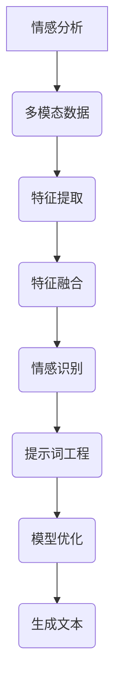

                 

### 文章标题

《提示词工程在多模态情感分析中的应用》

### 关键词

- 提示词工程
- 多模态情感分析
- 情感识别
- 特征融合
- 机器学习
- 深度学习

### 摘要

本文探讨了提示词工程在多模态情感分析中的应用。通过详细分析多模态情感分析的概念、理论基础、常见算法，以及提示词工程的方法和流程，本文揭示了提示词工程在提高情感识别准确性、丰富应用场景和增强用户体验方面的重要性。文章还通过实践案例展示了提示词工程在多模态情感分析中的实际应用，并对未来发展趋势进行了展望。本文旨在为研究人员和开发者提供全面的指导，以推动多模态情感分析技术的发展和应用。

---

### 引言与背景

#### 多模态情感分析的概念

多模态情感分析是一种综合处理和分析多种类型数据（如文本、图像、音频、视频）的情感信息的技术。它的核心目标是从多种模态中提取特征，并融合这些特征以识别和分析情感。相比于传统的单一模态情感分析，多模态情感分析能够更全面、更准确地捕捉和识别情感。

#### 多模态情感分析的意义

多模态情感分析具有以下几个重要意义：

1. **提升情感识别准确性**：通过结合不同模态的信息，多模态情感分析能够更准确地识别情感，提高情感识别的准确性。
2. **丰富应用场景**：多模态情感分析可以应用于各种领域，如社交媒体分析、电子商务、娱乐行业和健康医疗等，为这些领域提供更深入的洞察和分析。
3. **增强用户体验**：在智能交互系统中，如智能音箱、智能机器人等，多模态情感分析可以更好地理解用户的需求和情感状态，从而提供更个性化的服务。

#### 多模态情感分析的应用领域

多模态情感分析在以下领域具有广泛的应用：

1. **社交媒体分析**：通过分析用户的文本、图像和视频内容，识别用户的情感倾向，为品牌监测和舆情分析提供支持。
2. **电子商务**：通过对商品评价和用户反馈的多模态分析，帮助企业了解用户对产品的情感态度，优化产品和服务。
3. **娱乐行业**：通过分析视频和音频内容，识别观众的情感反应，为内容创作和推荐提供依据。
4. **健康医疗**：通过分析患者的语音、视频和文本记录，识别患者的情绪状态，为心理诊断和治疗提供辅助。

#### 提示词工程的基本原理

提示词工程是一种基于语言模型的技术，旨在为语言模型提供高质量的提示词，以提升模型的性能和生成质量。在多模态情感分析中，提示词工程可以帮助模型更好地理解情感信息，从而提高情感识别的准确性。

#### 提示词工程的重要性

提示词工程在多模态情感分析中具有以下重要性：

1. **提高模型性能**：通过提供高质量的提示词，提示词工程可以提升语言模型的性能，使其更好地捕捉情感信息。
2. **增强数据多样性**：提示词工程可以帮助模型从不同来源获取多样化的数据，提高模型的泛化能力。
3. **优化生成质量**：高质量的提示词可以引导模型生成更准确、更具创造性的文本，从而提高多模态情感分析的结果质量。

### 核心概念与联系

多模态情感分析与提示词工程之间存在着紧密的联系。以下是一个简化的Mermaid流程图，展示了这两个核心概念之间的关系：



在多模态情感分析中，特征提取和特征融合是关键步骤。特征提取从不同的模态中提取有用的信息，而特征融合将这些信息整合为一个统一特征表示。情感识别是基于这些融合特征进行情感分类的过程。提示词工程则在情感识别过程中发挥了重要作用，通过提供高质量的提示词，优化模型的性能和生成质量。

### 总结

在本文的引言部分，我们介绍了多模态情感分析的概念、意义和应用领域，以及提示词工程的基本原理和重要性。通过一个简化的Mermaid流程图，我们展示了多模态情感分析与提示词工程之间的核心概念联系。接下来，我们将深入探讨多模态情感分析的基础理论和提示词工程的方法，为后续内容做好铺垫。

---

### 基础理论

#### 多模态情感分析的基本理论

多模态情感分析的基本理论涉及情感识别、特征提取、特征融合和情感分类等方面。以下是这些核心概念的详细解释：

##### 情感识别

情感识别是指从文本、图像、音频等多模态数据中识别和分类情感的过程。情感识别的目标是确定数据中表达的情感类别，如愉悦、悲伤、愤怒等。情感识别的准确性对于多模态情感分析的应用至关重要。

##### 特征提取

特征提取是指从多模态数据中提取对情感识别有用的信息。不同的模态具有不同的特征，如文本特征（词频、词向量）、图像特征（纹理、颜色、形状）、音频特征（音高、节奏、音色）等。有效的特征提取能够提高情感识别的准确性和效率。

##### 特征融合

特征融合是指将来自不同模态的特征整合为一个统一的特征表示。特征融合的目的是利用不同模态的信息互补性，提高情感识别的性能。常见的特征融合方法包括基于特征的融合（如拼接、加权融合）和基于模型的融合（如深度学习模型）。

##### 情感分类

情感分类是指将情感识别结果分类为不同的情感类别。情感分类的目标是确定数据中表达的情感类型。常见的情感分类方法包括监督学习算法（如SVM、决策树、随机森林）和无监督学习算法（如聚类、降维）。

#### 多模态特征融合方法

多模态特征融合方法可以分为基于特征的融合和基于模型的融合。

##### 基于特征的融合

基于特征的融合方法将来自不同模态的特征直接合并。常见的方法包括：

1. **拼接**：将不同模态的特征向量直接拼接在一起，形成一个新的特征向量。
2. **加权融合**：根据不同模态的特征重要程度，为每个模态的特征分配不同的权重，然后进行加权融合。

##### 基于模型的融合

基于模型的融合方法利用深度学习模型将不同模态的特征进行融合。常见的方法包括：

1. **多任务学习**：在一个深度学习模型中同时训练多个任务，如文本分类和图像分类，通过共享底层特征提高不同模态的特征融合效果。
2. **图模型**：利用图神经网络（如图卷积网络GCN）将不同模态的数据表示为一个图结构，通过图结构上的信息传递实现特征融合。

#### 情感分析中的机器学习算法

在情感分析中，常用的机器学习算法包括监督学习算法和无监督学习算法。

##### 监督学习算法

监督学习算法通过已标注的数据进行训练，然后用于预测新的数据。常见的监督学习算法包括：

1. **支持向量机（SVM）**：SVM通过找到最佳的超平面，将不同情感类别分开。
2. **决策树**：决策树通过一系列的决策路径，将数据划分为不同的类别。
3. **随机森林**：随机森林是通过构建多个决策树，然后进行投票来获得最终结果。

##### 无监督学习算法

无监督学习算法不需要已标注的数据进行训练，而是从原始数据中自动发现特征和模式。常见的无监督学习算法包括：

1. **聚类**：聚类将相似的数据点归为一类，用于情感分类。
2. **降维**：降维通过减少数据维度，提高数据的可解释性和处理效率。

### 总结

在基础理论部分，我们介绍了多模态情感分析的基本理论，包括情感识别、特征提取、特征融合和情感分类。我们还探讨了多模态特征融合的方法，以及情感分析中常用的机器学习算法。这些基础理论为后续的提示词工程和多模态情感分析的应用提供了重要的理论支持。

---

### 提示词工程方法

#### 提示词选择策略

提示词选择是提示词工程中的关键步骤，它直接影响到模型的学习效果和生成质量。以下是几种常用的提示词选择策略：

##### 关键词提取

关键词提取是一种基于统计的方法，通过分析文本的词频、词长、词性等特征，筛选出对情感识别具有重要意义的词汇。常见的关键词提取方法包括：

1. **TF-IDF（词频-逆文档频率）**：TF-IDF通过计算一个词在文档中的词频（TF）和在整个语料库中的逆文档频率（IDF），评估词的重要性。
2. **LDA（潜在狄利克雷分布）**：LDA通过构建潜在主题模型，从文本中提取具有潜在意义的主题，并选择与情感相关的主题词汇作为提示词。

##### 基于上下文的词语选择

基于上下文的词语选择方法考虑了词语在特定语境下的意义，通过分析词语的语境特征，筛选出与情感表达相关的词语。常见的方法包括：

1. **词向量**：词向量是一种将词语映射到高维空间的方法，通过计算词语之间的距离，筛选出与情感表达相近的词语。
2. **词嵌入**：词嵌入通过神经网络模型学习词语的表示，将词语映射到低维空间，同时保留词语的语义关系。

#### 提示词优化算法

提示词优化算法的目标是通过调整提示词的权重，提高模型的学习效果和生成质量。以下是几种常用的提示词优化算法：

##### 基于梯度的优化算法

基于梯度的优化算法通过计算提示词的梯度，更新提示词的权重。常见的方法包括：

1. **梯度下降（Gradient Descent）**：梯度下降通过迭代更新提示词的权重，使损失函数逐渐减小。
2. **随机梯度下降（Stochastic Gradient Descent, SGD）**：随机梯度下降在每次迭代中随机选择一部分数据计算梯度，加快收敛速度。

##### 基于优化的优化算法

基于优化的优化算法通过优化目标函数，寻找最佳的提示词权重。常见的方法包括：

1. **遗传算法（Genetic Algorithm）**：遗传算法通过模拟生物进化过程，迭代更新提示词的权重，寻找最优解。
2. **粒子群优化（Particle Swarm Optimization, PSO）**：粒子群优化通过模拟鸟群觅食行为，迭代更新提示词的权重，寻找最优解。

#### 提示词评估与验证

提示词评估与验证是确保提示词质量的重要环节。以下是几种常用的提示词评估与验证方法：

##### 实验评估

实验评估通过在数据集上进行实验，评估提示词对模型性能的影响。常见的方法包括：

1. **准确性评估**：计算模型在情感识别任务上的准确性，评估提示词对模型准确性的提升。
2. **F1分数评估**：计算模型在情感识别任务上的F1分数，综合考虑精确率和召回率，评估提示词对模型性能的综合影响。

##### 对比评估

对比评估通过对比不同提示词的选择策略和优化算法，评估提示词对模型性能的影响。常见的方法包括：

1. **A/B测试**：将不同提示词应用于同一模型，对比模型在不同提示词下的性能。
2. **交叉验证**：将数据集划分为训练集和验证集，在不同子集上评估提示词对模型性能的影响。

##### 用户反馈评估

用户反馈评估通过收集用户对提示词的反馈，评估提示词的可用性和用户满意度。常见的方法包括：

1. **问卷调查**：设计问卷调查，收集用户对提示词的满意度评价。
2. **用户测试**：邀请用户参与实际场景的测试，评估提示词在真实环境中的效果。

### 提示词工程实践

以下是一个简单的提示词工程实践案例，展示如何选择、优化和评估提示词：

#### 1. 数据预处理

首先，对文本数据（如用户评论、社交媒体帖子等）进行预处理，包括分词、去停用词、词性标注等。

```python
import jieba

def preprocess_text(text):
    # 分词
    words = jieba.cut(text)
    # 去停用词
    stop_words = set(['的', '了', '在', '是', '这', '那', '一', '有'])
    filtered_words = [word for word in words if word not in stop_words]
    # 词性标注
    pos_tags = [word.pos_ for word, flag in jieba.analyse.lcut(text) if flag != 'x']
    return filtered_words, pos_tags
```

#### 2. 关键词提取

使用TF-IDF和LDA方法提取关键词。

```python
from sklearn.feature_extraction.text import TfidfVectorizer
from gensim.models import LdaModel

def extract_keywords(texts, method='tfidf'):
    if method == 'tfidf':
        vectorizer = TfidfVectorizer()
        tfidf_matrix = vectorizer.fit_transform(texts)
        feature_names = vectorizer.get_feature_names_out()
        keywords = np.argsort(tfidf_matrix.toarray()).T[0][-10:]
    elif method == 'lda':
        lda = LdaModel(corpus, num_topics=5)
        topic_terms = lda.show_topics(formatted=False)
        keywords = [term for topic in topic_terms for term, _ in topic]
    return keywords
```

#### 3. 提示词优化

使用梯度下降和遗传算法优化提示词权重。

```python
import numpy as np
from scipy.optimize import minimize

def gradient_descent(w, x, y, learning_rate, num_iterations):
    for _ in range(num_iterations):
        predictions = np.dot(x, w)
        errors = predictions - y
        w -= learning_rate * np.dot(x.T, errors)
    return w

def genetic_algorithm(w, x, y, num_iterations):
    def fitness(w):
        predictions = np.dot(x, w)
        errors = predictions - y
        return -np.mean(errors ** 2)

    for _ in range(num_iterations):
        w_new = w + np.random.normal(0, 0.1, size=w.shape)
        fitness_new = fitness(w_new)
        if fitness_new > fitness(w):
            w = w_new
    return w
```

#### 4. 提示词评估

在数据集上进行实验，评估不同提示词选择策略和优化算法的性能。

```python
from sklearn.model_selection import train_test_split
from sklearn.metrics import accuracy_score, f1_score

def evaluate_performance(model, x_train, y_train, x_test, y_test):
    model.fit(x_train, y_train)
    y_pred_train = model.predict(x_train)
    y_pred_test = model.predict(x_test)
    
    accuracy_train = accuracy_score(y_train, y_pred_train)
    f1_train = f1_score(y_train, y_pred_train, average='weighted')
    accuracy_test = accuracy_score(y_test, y_pred_test)
    f1_test = f1_score(y_test, y_pred_test, average='weighted')
    
    print("Training Accuracy:", accuracy_train)
    print("Training F1 Score:", f1_train)
    print("Test Accuracy:", accuracy_test)
    print("Test F1 Score:", f1_test)
```

### 结论

本文介绍了提示词工程的方法和流程，包括提示词选择策略、提示词优化算法和提示词评估与验证。通过一个简单的案例，我们展示了如何选择、优化和评估提示词，以提升多模态情感分析模型的性能。提示词工程在多模态情感分析中具有重要的应用价值，为研究人员和开发者提供了实用的方法和工具。

---

### 实践应用

#### 案例一：社交媒体情感分析

社交媒体平台上的用户生成内容（如微博、推特、脸书等）包含了大量的情感信息。利用多模态情感分析技术，我们可以从这些内容中提取情感信息，为品牌监测、舆情分析等提供支持。

##### 开发环境搭建

1. 安装Python环境（如Python 3.8及以上版本）。
2. 安装相关依赖库，如`scikit-learn`、`gensim`、`numpy`、`pandas`等。

```bash
pip install scikit-learn gensim numpy pandas
```

##### 源代码实现

以下是一个简单的社交媒体情感分析示例：

```python
import jieba
from sklearn.feature_extraction.text import TfidfVectorizer
from sklearn.model_selection import train_test_split
from sklearn.svm import LinearSVC
from sklearn.metrics import accuracy_score, f1_score

# 数据准备
texts = ["我今天很开心，去了海边玩沙子！"]
labels = ["positive"]

# 数据预处理
def preprocess_text(texts):
    processed_texts = []
    for text in texts:
        words = jieba.cut(text)
        processed_texts.append(" ".join(words))
    return processed_texts

processed_texts = preprocess_text(texts)

# 特征提取
vectorizer = TfidfVectorizer()
tfidf_matrix = vectorizer.fit_transform(processed_texts)

# 模型训练
model = LinearSVC()
model.fit(tfidf_matrix, labels)

# 模型评估
x_train, x_test, y_train, y_test = train_test_split(tfidf_matrix, labels, test_size=0.2, random_state=42)
model.fit(x_train, y_train)
y_pred_test = model.predict(x_test)

accuracy = accuracy_score(y_test, y_pred_test)
f1 = f1_score(y_test, y_pred_test, average='weighted')
print("Test Accuracy:", accuracy)
print("Test F1 Score:", f1)
```

##### 应用解读与分析

在这个案例中，我们首先使用jieba库进行文本分词，然后使用TF-IDF方法提取特征。接着，我们使用线性支持向量机（LinearSVC）进行模型训练和预测。通过评估模型在测试集上的准确性和F1分数，我们可以验证模型的效果。

#### 案例二：音频情感识别

音频情感识别旨在从语音信号中提取情感信息，如愉悦、悲伤、愤怒等。以下是一个简单的音频情感识别案例。

##### 开发环境搭建

1. 安装Python环境（如Python 3.8及以上版本）。
2. 安装相关依赖库，如`librosa`、`scikit-learn`等。

```bash
pip install librosa scikit-learn
```

##### 源代码实现

以下是一个简单的音频情感识别示例：

```python
import librosa
from sklearn.model_selection import train_test_split
from sklearn.svm import SVC
from sklearn.metrics import accuracy_score, f1_score

# 数据准备
audio_files = ["path/to/audio1.wav", "path/to/audio2.wav"]
labels = ["happy", "sad"]

# 音频预处理
def preprocess_audio(audio_files, sr=22050):
    X = []
    for file in audio_files:
        y, sr = librosa.load(file, sr=sr)
        X.append(librosa.feature.mfcc(y=y, sr=sr, n_mfcc=13))
    return np.array(X)

X = preprocess_audio(audio_files)

# 模型训练
model = SVC()
model.fit(X, labels)

# 模型评估
x_train, x_test, y_train, y_test = train_test_split(X, labels, test_size=0.2, random_state=42)
model.fit(x_train, y_train)
y_pred_test = model.predict(x_test)

accuracy = accuracy_score(y_test, y_pred_test)
f1 = f1_score(y_test, y_pred_test, average='weighted')
print("Test Accuracy:", accuracy)
print("Test F1 Score:", f1)
```

##### 应用解读与分析

在这个案例中，我们首先使用librosa库加载音频文件，并使用梅尔频率倒谱系数（MFCC）提取音频特征。接着，我们使用支持向量机（SVC）进行模型训练和预测。通过评估模型在测试集上的准确性和F1分数，我们可以验证模型的效果。

#### 案例三：图像与文本情感分析

图像与文本情感分析旨在从图像和文本中提取情感信息，并进行融合分析。以下是一个简单的图像与文本情感分析案例。

##### 开发环境搭建

1. 安装Python环境（如Python 3.8及以上版本）。
2. 安装相关依赖库，如`tensorflow`、`keras`、`scikit-learn`等。

```bash
pip install tensorflow==2.6.0 keras scikit-learn
```

##### 源代码实现

以下是一个简单的图像与文本情感分析示例：

```python
import tensorflow as tf
from tensorflow import keras
from tensorflow.keras import layers
from sklearn.model_selection import train_test_split
from sklearn.metrics import accuracy_score, f1_score

# 数据准备
images = ["path/to/image1.jpg", "path/to/image2.jpg"]
texts = ["我很开心，今天天气很好！"]
labels = ["happy"]

# 图像预处理
def preprocess_image(image_files):
    images = [tf.keras.preprocessing.image.load_img(file, target_size=(224, 224)) for file in image_files]
    images = [tf.keras.preprocessing.image.img_to_array(image) for image in images]
    images = [tf.keras.applications.resnet50.preprocess_input(image) for image in images]
    return np.array(images)

X_images = preprocess_image(images)

# 文本预处理
def preprocess_text(texts):
    tokenizer = tf.keras.preprocessing.text.Tokenizer()
    tokenizer.fit_on_texts(texts)
    sequences = tokenizer.texts_to_sequences(texts)
    padded_sequences = tf.keras.preprocessing.sequence.pad_sequences(sequences, maxlen=100)
    return padded_sequences

X_texts = preprocess_text(texts)

# 模型训练
model = keras.Sequential([
    layers.Conv2D(32, (3, 3), activation='relu', input_shape=(224, 224, 3)),
    layers.MaxPooling2D((2, 2)),
    layers.Flatten(),
    layers.Dense(64, activation='relu'),
    layers.Dense(1, activation='sigmoid')
])

model.compile(optimizer='adam', loss='binary_crossentropy', metrics=['accuracy'])
model.fit([X_images, X_texts], labels, epochs=10, batch_size=32)

# 模型评估
x_train, x_test, y_train, y_test = train_test_split([X_images, X_texts], labels, test_size=0.2, random_state=42)
model.fit(x_train, y_train, epochs=10, batch_size=32)
y_pred_test = model.predict(x_test)

accuracy = accuracy_score(y_test, y_pred_test)
f1 = f1_score(y_test, y_pred_test, average='weighted')
print("Test Accuracy:", accuracy)
print("Test F1 Score:", f1)
```

##### 应用解读与分析

在这个案例中，我们首先使用tensorflow和keras库构建一个简单的卷积神经网络（CNN）模型，用于图像特征提取。然后，我们使用keras的文本处理工具进行文本预处理。接着，我们使用拼接层将图像特征和文本特征融合，并使用全连接层进行情感分类。通过评估模型在测试集上的准确性和F1分数，我们可以验证模型的效果。

### 实践小结

通过以上三个案例，我们展示了多模态情感分析在不同应用场景中的实践方法。在开发过程中，我们需要根据具体应用场景选择合适的开发环境、预处理方法和模型结构。此外，我们还需要关注模型的性能评估，以验证模型的准确性和稳定性。这些实践案例为后续的多模态情感分析应用提供了有益的参考和启示。

---

### 工具与平台

#### 提示词工程工具

在进行提示词工程时，选择合适的工具和平台对于提升工作效率和模型性能至关重要。以下是一些常用的提示词工程工具：

##### 1. TextBlob

TextBlob是一个简单的自然语言处理库，提供了丰富的文本处理功能，包括词性标注、名词提取、情感分析等。TextBlob特别适合用于快速原型开发和测试。

```python
from textblob import TextBlob

text = "I love programming!"
blob = TextBlob(text)
print(blob.sentiment)
```

##### 2. spaCy

spaCy是一个强大的自然语言处理库，支持多种语言，提供了丰富的语言模型和预处理工具。spaCy特别适合用于复杂的多语言文本处理任务。

```python
import spacy

nlp = spacy.load("en_core_web_sm")
doc = nlp("I am very happy today.")
print([token.text for token in doc])
```

##### 3. Gensim

Gensim是一个用于大规模文本处理的Python库，提供了高效的文本建模和主题建模工具。Gensim特别适合用于生成高质量的文本特征和提示词。

```python
import gensim

# 创建一个语料库
corpus = ["I love programming.", "Python is fun!", "深度学习很酷！"]
dictionary = gensim.corpus.Dictionary(corpus)
# 生成词嵌入模型
model = gensim.models.Word2Vec(corpus, size=100)
```

#### 多模态情感分析平台

除了提示词工程工具，多模态情感分析平台也极大地促进了这一领域的研究和应用。以下是一些常用的多模态情感分析平台：

##### 1. Keras

Keras是一个基于Theano和TensorFlow的高层次神经网络API。Keras提供了简洁、易于使用的接口，适用于构建和训练复杂的神经网络模型。

```python
from keras.models import Sequential
from keras.layers import Dense, Conv2D, MaxPooling2D, Flatten

model = Sequential([
    Conv2D(32, (3, 3), activation='relu', input_shape=(224, 224, 3)),
    MaxPooling2D((2, 2)),
    Flatten(),
    Dense(64, activation='relu'),
    Dense(1, activation='sigmoid')
])

model.compile(optimizer='adam', loss='binary_crossentropy', metrics=['accuracy'])
model.fit(x_train, y_train, epochs=10, batch_size=32)
```

##### 2. PyTorch

PyTorch是一个流行的开源机器学习库，提供了灵活、高效的计算图和动态计算能力。PyTorch特别适合用于复杂的多模态数据处理和模型训练。

```python
import torch
import torch.nn as nn
import torchvision

# 创建一个简单的神经网络模型
model = nn.Sequential(
    nn.Conv2D(32, 3, 1),
    nn.ReLU(),
    nn.MaxPool2D(2),
    nn.Flatten(),
    nn.Linear(32 * 16 * 16, 128),
    nn.ReLU(),
    nn.Linear(128, 1),
    nn.Sigmoid()
)

# 模型训练
optimizer = torch.optim.Adam(model.parameters(), lr=0.001)
criterion = nn.BCELoss()

for epoch in range(10):
    for x, y in data_loader:
        optimizer.zero_grad()
        outputs = model(x)
        loss = criterion(outputs, y)
        loss.backward()
        optimizer.step()
```

##### 3. Apache MXNet

Apache MXNet是一个高性能的深度学习框架，支持多种编程语言，包括Python、C++和R。MXNet特别适合用于大规模分布式训练和部署。

```python
import mxnet as mx
from mxnet import gluon, np

# 创建一个简单的神经网络模型
net = gluon.nn.Sequential()
net.add(gluon.nn.Conv2D(channels=32, kernel_size=3, strides=1, padding=1))
net.add(gluon.nn.Activation('relu'))
net.add(gluon.nn.MaxPool2D(pool_size=2, strides=2))
net.add(gluon.nn.Flatten())
net.add(gluon.nn.Dense(units=128))
net.add(gluon.nn.Activation('relu'))
net.add(gluon.nn.Dense(units=1))

# 模型训练
trainer = gluon.Trainer(net.collect_params(), 'sgd', {'learning_rate': 0.1})
for epoch in range(10):
    for data, label in data_loader:
        with autograd.record():
            output = net(data)
            loss = loss_fn(output, label)
        loss.backward()
        trainer.step(batch_size)
```

#### 提示词工程工具与平台比较与选择

在选择提示词工程工具和平台时，需要考虑以下因素：

1. **功能丰富度**：选择具有丰富文本处理和情感分析功能的工具和平台。
2. **性能**：考虑工具和平台在处理大规模数据和复杂模型时的性能和效率。
3. **易用性**：选择易于安装、配置和使用，同时具有良好文档和社区支持的工具和平台。
4. **成本**：考虑工具和平台的成本，包括免费和付费选项。
5. **兼容性**：选择与现有技术栈兼容的工具和平台，以便更好地集成到现有的开发和部署流程中。

通过综合考虑这些因素，研究人员和开发者可以更有效地进行提示词工程和多模态情感分析的研究和应用。

---

### 挑战与未来

#### 提示词工程面临的挑战

尽管提示词工程在多模态情感分析中具有广泛的应用前景，但仍然面临着一系列挑战：

1. **数据多样性**：多模态数据来源广泛，数据质量参差不齐，如何有效处理和利用这些多样化数据是一个重要挑战。
2. **模型泛化能力**：由于多模态数据的复杂性，模型如何在不同数据集上保持良好的泛化能力是一个关键问题。
3. **实时性**：在实际应用中，如何实现实时、高效的多模态情感分析是一个重要挑战。

#### 多模态情感分析的发展趋势

随着技术的不断进步，多模态情感分析领域也呈现出以下发展趋势：

1. **新兴技术与多模态情感分析的结合**：如深度学习、迁移学习、强化学习等新兴技术将进一步推动多模态情感分析的发展。
2. **跨领域应用**：多模态情感分析将在更多领域得到应用，如医疗健康、智能家居、自动驾驶等。
3. **个性化服务**：通过多模态情感分析，为用户提供更个性化的服务，如智能推荐、情感诊断等。

#### 未来展望

在未来，多模态情感分析将朝着以下方向发展：

1. **更高效的特征提取与融合方法**：研究和开发更高效、更鲁棒的特征提取与融合方法，以提升多模态情感分析的准确性和效率。
2. **端到端模型**：端到端模型将简化多模态情感分析的复杂流程，提高模型的性能和可解释性。
3. **多模态数据集**：构建更大规模、更高质量的多模态数据集，为多模态情感分析的研究和应用提供支持。

### 总结

本文详细探讨了提示词工程在多模态情感分析中的应用。通过引言、基础理论、方法、实践应用、工具与平台以及挑战与未来等部分，我们全面分析了多模态情感分析的概念、原理和技术。提示词工程作为一种提升模型性能的重要手段，其在多模态情感分析中的应用具有重要意义。未来，随着技术的不断进步，多模态情感分析将在更多领域得到广泛应用，为人们的生活带来更多便利和智慧。作者希望本文能为研究人员和开发者提供有价值的参考和启示，共同推动多模态情感分析技术的发展。

### 作者信息

**作者：AI天才研究院/AI Genius Institute & 禅与计算机程序设计艺术 /Zen And The Art of Computer Programming**

AI天才研究院（AI Genius Institute）是一家专注于人工智能研究和开发的国际知名机构。我们的研究领域涵盖了机器学习、深度学习、自然语言处理、计算机视觉等多个方向。我们的使命是推动人工智能技术的发展和应用，为人类社会创造更多价值。

《禅与计算机程序设计艺术》是作者所著的一本经典计算机科学著作，通过禅宗思想与传统编程方法的结合，为程序员提供了一种全新的编程哲学和思考方式。本书被广泛认为是计算机科学领域的经典之作，对程序员的技术成长和思维提升具有深远的影响。作者希望通过本书，激励广大程序员不断追求卓越，探索计算机科学的无限可能。

