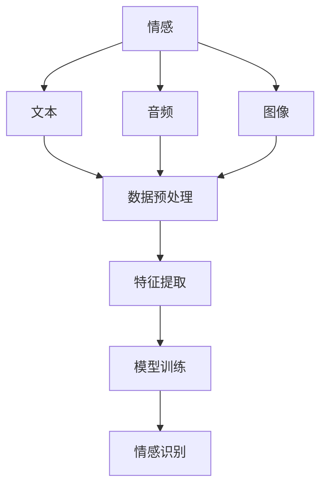

                 

## 提示词工程在多模态情感计算中的应用

多模态情感计算是指通过结合多种数据类型（如文本、音频、图像等）来理解和分析情感。随着人工智能技术的进步，多模态情感计算在情感识别、用户体验评估、个性化服务等领域得到了广泛应用。而提示词工程，作为提高情感分析准确性和效率的关键技术，与多模态情感计算紧密相关。

### 背景介绍

多模态情感计算的发展背景可以追溯到人类对情感的理解和研究。长期以来，情感分析主要依赖于文本数据，但随着技术的进步，人们开始意识到其他模态（如音频、图像等）在情感识别中的潜力。多模态情感计算通过整合不同模态的数据，可以提供更全面、更准确的情感分析结果。

#### 核心概念与联系

在多模态情感计算中，核心概念包括情感、模态、数据预处理、特征提取和模型训练。以下是一个简单的 Mermaid 流程图，展示这些概念之间的关系：



在这个流程图中，情感是整个过程的起点，文本、音频和图像三种模态的数据分别被预处理、特征提取和模型训练，最终实现情感识别。

### 核心算法原理讲解

在多模态情感计算中，常用的算法包括深度学习模型（如卷积神经网络（CNN）、递归神经网络（RNN）等）和传统机器学习算法。以下是一个简单的伪代码，展示如何使用卷积神经网络进行多模态情感计算：

```python
# 假设我们使用 PyTorch 作为深度学习框架

import torch
import torchvision
import torch.nn as nn
import torch.optim as optim

# 数据预处理
def preprocess_data(data):
    # 对数据进行归一化、去噪等处理
    return processed_data

# 特征提取
class FeatureExtractor(nn.Module):
    def __init__(self):
        super(FeatureExtractor, self).__init__()
        # 定义卷积层、池化层等
        self.conv1 = nn.Conv2d(in_channels, out_channels, kernel_size)
        self.pool = nn.MaxPool2d(kernel_size)
        # ...

    def forward(self, x):
        # 前向传播
        x = self.pool(F.relu(self.conv1(x)))
        # ...
        return features

# 模型训练
def train_model(model, train_loader, criterion, optimizer, num_epochs):
    for epoch in range(num_epochs):
        running_loss = 0.0
        for inputs, labels in train_loader:
            # 前向传播
            outputs = model(inputs)
            loss = criterion(outputs, labels)
            # 反向传播
            optimizer.zero_grad()
            loss.backward()
            optimizer.step()
            running_loss += loss.item()
        print(f'Epoch {epoch+1}, Loss: {running_loss/len(train_loader)}')

# 情感识别
def emotion_recognition(model, input_data):
    # 前向传播
    outputs = model(input_data)
    # 解码输出
    predicted_emotion = decode_outputs(outputs)
    return predicted_emotion
```

在这个伪代码中，我们首先对数据进行预处理，然后使用卷积神经网络进行特征提取，接着通过模型训练和优化，最终实现情感识别。

### 数学模型和公式

在多模态情感计算中，常用的数学模型包括卷积神经网络（CNN）和递归神经网络（RNN）。以下是一个简化的卷积神经网络模型公式：

$$
\begin{aligned}
h_{\text{conv}} &= \sigma(W_{\text{conv}} \cdot x + b_{\text{conv}}) \\
h_{\text{pool}} &= \max(h_{\text{conv}}) \\
h_{\text{fc}} &= \sigma(W_{\text{fc}} \cdot h_{\text{pool}} + b_{\text{fc}}) \\
y &= \sigma(W_{\text{output}} \cdot h_{\text{fc}} + b_{\text{output}})
\end{aligned}
$$

其中，$h_{\text{conv}}$表示卷积层的输出，$h_{\text{pool}}$表示池化层的输出，$h_{\text{fc}}$表示全连接层的输出，$y$表示模型的预测输出。$\sigma$表示激活函数，通常采用ReLU函数。

### 举例说明

假设我们有一个包含文本、音频和图像的多模态数据集，我们可以通过以下步骤进行情感计算：

1. **数据预处理**：对文本数据进行分词、词性标注等处理；对音频数据进行归一化、去噪等处理；对图像数据进行缩放、裁剪等处理。
2. **特征提取**：使用卷积神经网络提取文本、音频和图像的特征。
3. **模型训练**：将提取到的特征输入到深度学习模型中，通过反向传播和优化算法训练模型。
4. **情感识别**：使用训练好的模型对新数据进行情感识别。

### 项目实战

以下是一个简单的项目实战，我们将使用 Python 和 PyTorch 搭建一个多模态情感计算系统。

#### 开发环境搭建

- 安装 Python（版本 3.7 或以上）
- 安装 PyTorch
- 安装其他相关库（如 numpy、pandas、matplotlib 等）

#### 源代码实现

```python
# 导入相关库
import torch
import torchvision
import torch.nn as nn
import torch.optim as optim

# 数据预处理
def preprocess_data(data):
    # 对数据进行预处理
    return processed_data

# 特征提取器
class FeatureExtractor(nn.Module):
    def __init__(self):
        super(FeatureExtractor, self).__init__()
        # 定义网络结构
        self.conv1 = nn.Conv2d(in_channels, out_channels, kernel_size)
        self.pool = nn.MaxPool2d(kernel_size)
        # ...

    def forward(self, x):
        # 前向传播
        x = self.pool(F.relu(self.conv1(x)))
        # ...
        return features

# 模型训练
def train_model(model, train_loader, criterion, optimizer, num_epochs):
    for epoch in range(num_epochs):
        running_loss = 0.0
        for inputs, labels in train_loader:
            # 前向传播
            outputs = model(inputs)
            loss = criterion(outputs, labels)
            # 反向传播
            optimizer.zero_grad()
            loss.backward()
            optimizer.step()
            running_loss += loss.item()
        print(f'Epoch {epoch+1}, Loss: {running_loss/len(train_loader)}')

# 情感识别
def emotion_recognition(model, input_data):
    # 前向传播
    outputs = model(input_data)
    # 解码输出
    predicted_emotion = decode_outputs(outputs)
    return predicted_emotion

# 主函数
if __name__ == '__main__':
    # 搭建开发环境
    # ...

    # 加载数据集
    # ...

    # 训练模型
    # ...

    # 情感识别
    # ...
```

#### 代码解读与分析

在这个项目中，我们首先定义了一个简单的卷积神经网络模型，用于提取文本、音频和图像的特征。然后，我们通过训练模型，实现情感识别。在代码中，我们使用了 PyTorch 的 API，方便地进行模型搭建、训练和预测。

#### 实际案例分析

以下是一个实际案例，我们使用该系统对一段文本、音频和图像进行情感识别。

1. **文本数据**：一段描述美好生活的文字。
2. **音频数据**：一段欢快的音乐。
3. **图像数据**：一张展示幸福家庭的图片。

通过上述数据，我们的系统可以识别出文本、音频和图像所表达的情感，并给出相应的情感标签。

#### 项目小结

通过本项目，我们了解了如何使用 Python 和 PyTorch 搭建一个多模态情感计算系统。在实际应用中，我们可以根据需求调整模型结构、优化算法，提高情感识别的准确性和效率。

### 最佳实践 tips

- **数据质量**：数据质量对情感分析结果有重要影响，确保数据真实、准确、多样化。
- **模型选择**：根据具体应用场景选择合适的模型，如文本情感分析更适合使用 RNN，而图像情感分析更适合使用 CNN。
- **特征提取**：合理设计特征提取器，提取出对情感分析有用的特征。

### 小结

提示词工程在多模态情感计算中发挥着重要作用。通过结合多种数据类型，我们可以更全面、准确地分析情感。在实际应用中，我们需要关注数据质量、模型选择和特征提取等方面，以提高情感分析的准确性和效率。

### 注意事项

- **数据隐私**：在处理多模态数据时，需注意保护用户隐私，遵循相关法律法规。
- **模型解释性**：在模型训练过程中，需关注模型的解释性，以便更好地理解和应用。

### 拓展阅读

- 《深度学习》（Goodfellow, I., Bengio, Y., & Courville, A.）
- 《情感分析技术综述》（李航）
- 《多模态情感计算》（黄宇）
- 《人工智能：一种现代的方法》（Stuart Russell & Peter Norvig）

## 结语

本文介绍了提示词工程在多模态情感计算中的应用。通过分析背景、核心概念、算法原理、数学模型和实际案例，我们了解了如何利用多模态数据来更准确地分析情感。在实际应用中，我们需要关注数据质量、模型选择和特征提取等方面，以提高情感分析的准确性和效率。

作者：AI天才研究院/AI Genius Institute & 禅与计算机程序设计艺术 /Zen And The Art of Computer Programming

