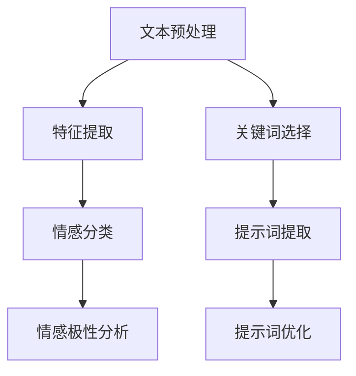
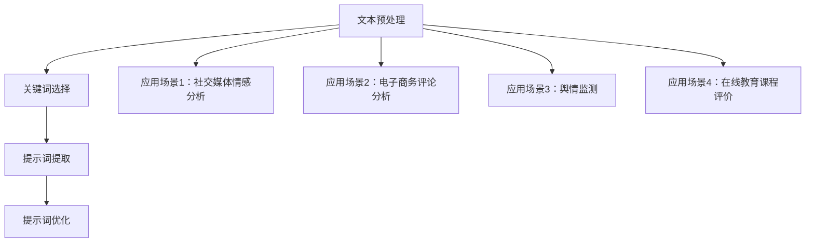
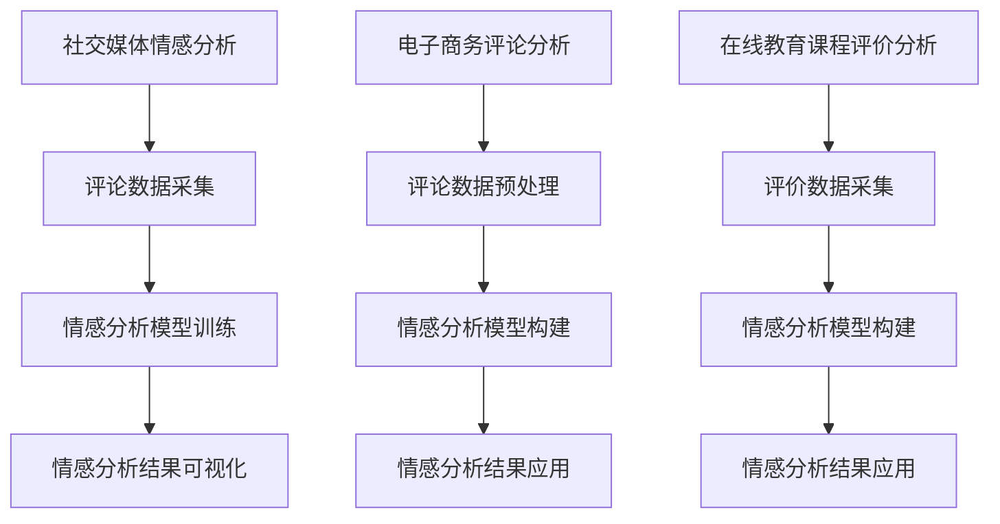
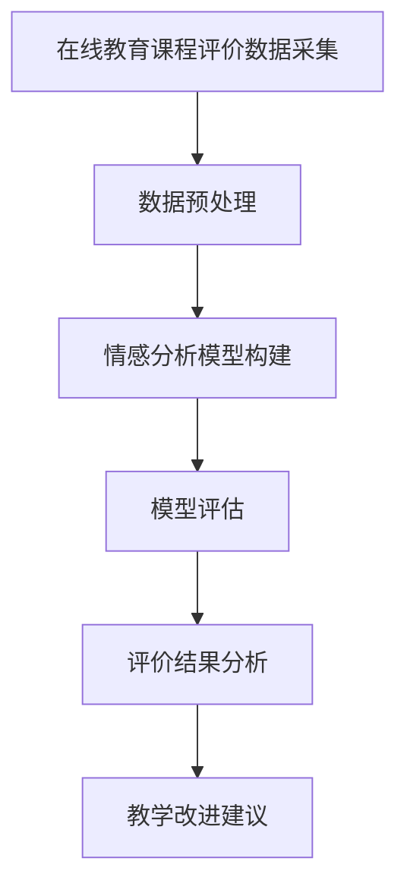

                 


## 第1章 绪论

### 1.1 情感分析概述

情感分析（Sentiment Analysis），也被称为意见挖掘，是自然语言处理（Natural Language Processing, NLP）领域的一个重要分支。其核心任务是通过分析文本数据，识别出文本中所表达的情感倾向，即判断文本是积极的、消极的还是中性的。情感分析在商业、社交网络、舆情监测等领域有广泛的应用，可以帮助企业了解客户反馈、监测公众情绪、改进产品服务等。

随着互联网的快速发展，人们生成和分享的文本数据呈现出爆炸式增长。这些文本数据中包含了大量的情感信息，例如产品评论、社交媒体帖子、新闻文章等。对这些数据进行分析，可以帮助企业更好地了解消费者需求、优化产品和服务、制定营销策略等。因此，情感分析成为了人工智能领域的一个热点研究方向。

### 1.2 多维度情感分析

传统的情感分析通常只关注单一维度，如正面/负面、积极/消极等二分类情感。然而，现实世界中的情感更加复杂，往往具有多个维度。例如，一个电影评论可能会表达对电影的喜爱（正面情感），但同时也会批评电影的某些方面（负面情感）。这种情况下，单一维度的情感分析难以准确地捕捉到文本中的复杂情感。

多维度情感分析旨在同时识别文本中的多个情感维度，从而更全面地理解文本的情感内涵。常见的多维度情感包括情绪维度（Joy, Sadness, Anger, Surprise等）、强度维度（Weak, Moderate, Strong等）和类别维度（喜欢/不喜欢、满意/不满意等）。多维度情感分析不仅能够提高情感分析的准确性，还能为情感分类和情感极性分析提供更多的信息。

### 1.3 提示词工程

提示词工程（Term Extraction）是情感分析中的一个重要步骤，其目的是从文本中提取出能够代表文本情感的关键词或短语。这些关键词或短语通常被称为提示词（Keywords），在情感分析中起着关键作用。通过提取提示词，我们可以更好地理解文本的情感内涵，并为后续的情感分类和情感极性分析提供支持。

提示词工程的实现通常包括以下几个步骤：

1. **文本预处理**：包括去除停用词、标点符号、分词等，将原始文本转化为可用于分析的格式。
2. **词频统计**：计算每个词在文本中的出现频率，识别出高频词。
3. **关键词选择**：根据词频、词义、文本上下文等因素，选择出能够代表文本情感的关键词。
4. **提示词提取**：从选定的关键词中提取出提示词，用于后续的情感分析。

### 本章小结

本章首先介绍了情感分析的基本概念和应用，然后引出了多维度情感分析的概念，并详细介绍了提示词工程。通过本章的学习，读者可以了解到情感分析在现实世界中的重要性，以及多维度情感分析和提示词工程在情感分析中的作用。

## 第2章 理论基础

### 2.1 多维度情感分析框架

多维度情感分析框架是构建高效情感分析系统的基础。一个完整的多维度情感分析框架通常包括以下几个关键组成部分：

1. **文本预处理**：这是情感分析的第一步，主要任务是将原始文本转化为适合进行情感分析的形式。预处理步骤通常包括分词、去除停用词、标点符号和停用词等。分词是将文本分解为单个单词或短语的过程，对于中文等语言来说，分词尤为重要。

   **伪代码**：
   ```python
   def preprocess_text(text):
       # 分词
       tokens = tokenize(text)
       # 去除停用词和标点符号
       tokens = remove_stopwords_and_punctuation(tokens)
       return tokens
   ```

2. **特征提取**：特征提取是从预处理后的文本中提取出对情感分析有用的信息。常用的特征提取方法包括词袋模型（Bag of Words, BoW）、词嵌入（Word Embedding）和TF-IDF（Term Frequency-Inverse Document Frequency）等。

   **伪代码**：
   ```python
   def extract_features(tokens):
       # 构建词袋模型
       bag_of_words = build_bag_of_words(tokens)
       # 计算TF-IDF
       tf_idf = compute_tf_idf(bag_of_words)
       return tf_idf
   ```

3. **情感分类**：情感分类是情感分析的核心步骤，其目标是根据提取出的特征，将文本分类到不同的情感类别。常用的情感分类方法包括朴素贝叶斯（Naive Bayes）、支持向量机（Support Vector Machine, SVM）、深度学习（Deep Learning）等。

   **伪代码**：
   ```python
   def classify_text(features):
       # 使用朴素贝叶斯进行分类
       label = naive_bayes_classify(features)
       return label
   ```

4. **情感极性分析**：情感极性分析旨在识别文本的情感极性，即判断文本是积极、消极还是中性。多维度情感分析通常涉及多个情感维度，例如正面/负面、愉悦/悲伤等。每个情感维度都可以使用上述的分类方法进行识别。

   **伪代码**：
   ```python
   def analyze_sentiment_polarity(text):
       tokens = preprocess_text(text)
       features = extract_features(tokens)
       # 分析每个情感维度的极性
       sentiment_polarity = classify_text(features)
       return sentiment_polarity
   ```

### 2.2 情感分析评价指标

情感分析评价指标是评估情感分析模型性能的重要工具。常见的评价指标包括准确率（Accuracy）、召回率（Recall）、精确率（Precision）和F1值（F1 Score）等。

1. **准确率**：准确率是分类结果中正确分类的样本数占总样本数的比例。其计算公式为：
   $$ Accuracy = \frac{TP + TN}{TP + TN + FP + FN} $$
   其中，TP为真实阳性，TN为真实阴性，FP为假阳性，FN为假阴性。

2. **召回率**：召回率是分类结果中真实阳性的样本数与所有实际阳性的样本数之比。其计算公式为：
   $$ Recall = \frac{TP}{TP + FN} $$

3. **精确率**：精确率是分类结果中正确分类的样本数与所有预测阳性的样本数之比。其计算公式为：
   $$ Precision = \frac{TP}{TP + FP} $$

4. **F1值**：F1值是精确率和召回率的调和平均，用于综合考虑精确率和召回率。其计算公式为：
   $$ F1 Score = 2 \times \frac{Precision \times Recall}{Precision + Recall} $$

### 2.3 提示词工程

提示词工程是多维度情感分析中的一个关键环节，其目的是从大量文本中提取出能够代表文本情感的关键词或短语。提示词工程通常包括以下几个步骤：

1. **文本预处理**：与情感分析中的预处理步骤相同，主要目的是将原始文本转化为适合进行分析的形式。

2. **关键词选择**：从预处理后的文本中提取出对情感分析有帮助的关键词。常用的方法包括TF-IDF、词频统计、基于主题的方法等。

3. **提示词提取**：从选定的关键词中提取出提示词，通常需要考虑关键词的频率、词义、文本上下文等因素。

4. **提示词优化**：对提取出的提示词进行优化，以提高其在情感分析中的效果。优化方法包括去除噪声词、增加相关词、调整词频等。

### 本节小结

本章详细介绍了多维度情感分析的理论基础，包括情感分析框架、评价指标和提示词工程。通过本章的学习，读者可以了解多维度情感分析的核心概念和方法，为后续的情感分析实践打下基础。

### Mermaid 流程图

以下是本章内容的一个简化版Mermaid流程图：



通过这个流程图，我们可以清晰地看到多维度情感分析中的各个步骤及其相互关系。

## 第3章 提示词工程

### 3.1 提示词工程的概念

提示词工程（Term Extraction）是自然语言处理（NLP）中的一个重要环节，其核心任务是从大量文本数据中提取出能够代表文本内容的关键词或短语。在情感分析中，提示词工程有助于更好地理解文本的情感倾向和主题，从而提高情感分析模型的准确性和效果。

提示词工程通常涉及以下几个关键步骤：

1. **文本预处理**：这是提示词工程的第一步，主要包括分词、去除停用词、标点符号等，将原始文本转化为适合进行提示词提取的形式。

2. **关键词选择**：从预处理后的文本中提取出对情感分析有帮助的关键词。关键词的选择通常基于词频、词义、文本上下文等因素。

3. **提示词提取**：从选定的关键词中提取出提示词，通常需要考虑关键词的频率、词义、文本上下文等因素，以确保提取出的提示词能够有效地代表文本的情感和主题。

4. **提示词优化**：对提取出的提示词进行优化，以提高其在情感分析中的效果。优化方法包括去除噪声词、增加相关词、调整词频等。

### 3.2 提示词构建方法

提示词的构建方法多种多样，以下是几种常用的方法：

1. **基于词频的方法**：这种方法基于词频统计，选择文本中出现频率较高的词作为提示词。虽然这种方法简单直观，但容易受到噪声词的影响，难以捕捉到文本中的深层情感。

   **伪代码**：
   ```python
   def extract高频词语(text):
       tokens = preprocess_text(text)
       word_freq = count_words(tokens)
       top_words = get_top_words(word_freq, num_words)
       return top_words
   ```

2. **基于TF-IDF的方法**：TF-IDF（Term Frequency-Inverse Document Frequency）是一种常用的文本特征提取方法，通过综合考虑词频和文档频率，选择出对文本内容有重要影响的词作为提示词。

   **伪代码**：
   ```python
   def extract_tfidf_words(text, corpus):
       tokens = preprocess_text(text)
       tf_idf = compute_tfidf(tokens, corpus)
       top_words = get_top_words(tf_idf, num_words)
       return top_words
   ```

3. **基于主题的方法**：主题模型（如LDA - Latent Dirichlet Allocation）可以从大量文本中自动发现隐藏的主题，并提取出与主题相关的关键词作为提示词。

   **伪代码**：
   ```python
   def extract_topic_words(text, num_topics):
       lda_model = train_lda_model(text, num_topics)
       words = lda_model.show_topics()
       top_words = get_top_words(words, num_words)
       return top_words
   ```

4. **基于词嵌入的方法**：词嵌入（如Word2Vec、GloVe等）可以将词映射到高维向量空间中，通过计算词之间的相似性，提取出与目标词相似的高频词作为提示词。

   **伪代码**：
   ```python
   def extract_similar_words(word, word embeddings, top_n):
       similar_words = get_similar_words(word, embeddings, top_n)
       return similar_words
   ```

### 3.3 提示词应用场景

提示词工程在多维度情感分析中有着广泛的应用，以下是一些常见的应用场景：

1. **社交媒体情感分析**：通过提取与情感相关的提示词，可以更好地理解用户在社交媒体上的情绪，为品牌管理和市场策略提供数据支持。

2. **电子商务评论分析**：通过分析产品评论中的提示词，可以了解消费者的购买偏好和产品满意度，为商家提供改进建议。

3. **舆情监测**：通过监测新闻、论坛等平台中的提示词，可以及时了解公众对某个事件或话题的情感倾向，为政府和企业提供决策依据。

4. **在线教育课程评价**：通过提取学生评价中的提示词，可以了解学生对课程的整体评价，为教学改进提供参考。

### 本节小结

本章详细介绍了提示词工程的概念、构建方法和应用场景。通过本章的学习，读者可以了解提示词工程在多维度情感分析中的重要性和实际应用，为后续的情感分析实践提供理论基础。

### Mermaid 流程图

以下是本章内容的简化版Mermaid流程图：



通过这个流程图，我们可以清晰地看到提示词工程在各个应用场景中的具体实现过程。

## 第4章 应用实例

### 4.1 社交媒体情感分析

社交媒体情感分析是提示词工程在多维度情感分析中的一个典型应用场景。通过分析社交媒体平台上的用户评论和帖子，可以了解公众对某个事件、产品或服务的情感倾向。

#### 4.1.1 社交媒体数据采集

社交媒体数据采集是进行情感分析的第一步。常用的数据来源包括微博、Twitter、Facebook等。以下是一个简单的社交媒体数据采集流程：

1. **数据爬取**：使用爬虫工具（如Python的requests和BeautifulSoup库）从社交媒体平台上获取用户评论和帖子。
2. **数据清洗**：对获取的原始数据进行清洗，包括去除HTML标签、分词、去除停用词等。
3. **数据存储**：将清洗后的数据存储到数据库或文件中，以便后续分析。

**伪代码**：

```python
def collect_social_media_data(url):
    # 爬取数据
    html_content = fetch_html(url)
    # 数据清洗
    cleaned_data = preprocess_data(html_content)
    # 存储数据
    save_data(cleaned_data)
```

#### 4.1.2 情感分析模型训练

在获取和清洗数据后，我们需要构建一个情感分析模型，以便对社交媒体数据进行情感分类。常用的模型包括朴素贝叶斯、支持向量机（SVM）、深度学习等。

1. **数据预处理**：对采集到的数据进行预处理，包括分词、词性标注等。
2. **特征提取**：使用词袋模型（BoW）、词嵌入（Word Embedding）等方法提取特征。
3. **模型训练**：使用训练数据训练情感分析模型，选择合适的评价指标（如准确率、召回率、F1值）进行模型评估。

**伪代码**：

```python
def train_sentiment_model(data):
    # 数据预处理
    preprocessed_data = preprocess_data(data)
    # 特征提取
    features = extract_features(preprocessed_data)
    # 模型训练
    model = train_model(features)
    # 模型评估
    evaluate_model(model)
```

#### 4.1.3 情感分析结果可视化

对社交媒体情感分析结果进行可视化，可以帮助我们更直观地理解用户情感。常用的可视化工具包括Matplotlib、Seaborn等。

1. **情感分布图**：展示不同情感类别在所有评论中的分布情况。
2. **情感变化趋势**：展示不同时间段内情感类别的变化趋势。
3. **情感极性词云**：展示情感极性词汇的词云图，突出高频且具有情感倾向的词汇。

**伪代码**：

```python
def visualize_sentiment_results(results):
    # 情感分布图
    plot_sentiment_distribution(results)
    # 情感变化趋势
    plot_sentiment_trend(results)
    # 情感极性词云
    generate_sentiment_wordcloud(results)
```

### 4.2 电子商务评论分析

电子商务评论分析是另一个典型的应用场景，通过分析消费者对产品的评价，可以了解产品的满意度、消费者偏好等信息。

#### 4.2.1 评论数据预处理

电子商务评论数据预处理主要包括以下几个步骤：

1. **数据获取**：从电商平台（如淘宝、京东）获取用户评论数据。
2. **数据清洗**：去除HTML标签、分词、去除停用词等。
3. **数据存储**：将清洗后的数据存储到数据库或文件中。

**伪代码**：

```python
def preprocess_e-commerce_reviews(data):
    # 数据清洗
    cleaned_data = remove_html_tags(data)
    cleaned_data = tokenize_text(cleaned_data)
    cleaned_data = remove_stopwords(cleaned_data)
    # 存储数据
    save_data(cleaned_data)
```

#### 4.2.2 情感分析模型构建

在预处理完评论数据后，我们需要构建一个情感分析模型，以对评论进行分类。以下是构建情感分析模型的基本步骤：

1. **数据预处理**：对评论数据进一步处理，如词性标注、停用词过滤等。
2. **特征提取**：使用词袋模型、TF-IDF等方法提取特征。
3. **模型训练**：使用训练数据训练情感分析模型，并进行模型评估。

**伪代码**：

```python
def build_sentiment_model(reviews):
    # 数据预处理
    preprocessed_reviews = preprocess_reviews(reviews)
    # 特征提取
    features = extract_features(preprocessed_reviews)
    # 模型训练
    model = train_model(features)
    # 模型评估
    evaluate_model(model)
```

#### 4.2.3 情感分析结果应用

通过对电子商务评论进行情感分析，可以为企业提供以下信息：

1. **产品满意度分析**：了解消费者对产品的总体满意度，为企业改进产品质量提供依据。
2. **消费者偏好分析**：分析消费者的购买偏好，为营销策略调整提供参考。
3. **问题识别**：识别产品存在的质量问题或消费者投诉点，为企业提供改进建议。

**伪代码**：

```python
def apply_sentiment_analysis_results(results):
    # 产品满意度分析
    analyze_product_satisfaction(results)
    # 消费者偏好分析
    analyze_consumer_preferences(results)
    # 问题识别
    identify_product_issues(results)
```

### 4.3 在线教育课程评价分析

在线教育课程评价分析是提示词工程在多维度情感分析中的又一重要应用场景。通过分析学生评价，可以了解课程的整体质量、教学效果等。

#### 4.3.1 在线教育课程评价数据采集

在线教育课程评价数据采集主要包括以下几个步骤：

1. **数据获取**：从在线教育平台（如MOOC、网易云课堂）获取学生评价数据。
2. **数据清洗**：去除HTML标签、分词、去除停用词等。
3. **数据存储**：将清洗后的数据存储到数据库或文件中。

**伪代码**：

```python
def collect_course_evaluation_data(url):
    # 爬取数据
    html_content = fetch_html(url)
    # 数据清洗
    cleaned_data = preprocess_data(html_content)
    # 存储数据
    save_data(cleaned_data)
```

#### 4.3.2 情感分析模型构建

构建在线教育课程评价情感分析模型的基本步骤如下：

1. **数据预处理**：对评价数据进一步处理，如词性标注、停用词过滤等。
2. **特征提取**：使用词袋模型、TF-IDF等方法提取特征。
3. **模型训练**：使用训练数据训练情感分析模型，并进行模型评估。

**伪代码**：

```python
def build_course_evaluation_model(evaluations):
    # 数据预处理
    preprocessed_evaluations = preprocess_evaluations(evaluations)
    # 特征提取
    features = extract_features(preprocessed_evaluations)
    # 模型训练
    model = train_model(features)
    # 模型评估
    evaluate_model(model)
```

#### 4.3.3 情感分析结果应用

通过分析在线教育课程评价，可以为教育企业提供以下信息：

1. **课程满意度分析**：了解学生对课程的整体满意度，为课程改进提供依据。
2. **教学效果分析**：分析教学效果，为教师提供改进建议。
3. **问题识别**：识别课程中的问题或学生投诉点，为教育企业提供改进方向。

**伪代码**：

```python
def apply_evaluation_results(results):
    # 课程满意度分析
    analyze_course_satisfaction(results)
    # 教学效果分析
    analyze Teaching_Effect(results)
    # 问题识别
    identify_course_issues(results)
```

### 本节小结

本章通过三个具体应用实例，展示了提示词工程在多维度情感分析中的实际应用。通过社交媒体情感分析、电子商务评论分析和在线教育课程评价分析，我们可以看到提示词工程在情感识别、问题识别和改进建议等方面的重要作用。这些实例不仅有助于理解提示词工程的理论知识，也为实际应用提供了宝贵经验。

### Mermaid 流程图

以下是本章内容的简化版Mermaid流程图：



通过这个流程图，我们可以清晰地看到提示词工程在各个应用场景中的具体实现过程。

## 第5章 在线教育课程评价分析

### 5.1 在线教育课程评价数据采集

在线教育课程评价分析的第一步是采集课程评价数据。这些数据通常来源于在线教育平台，如慕课网（MOOC）、网易云课堂等。以下是一个简单的数据采集流程：

#### 5.1.1 数据来源

首先，我们需要确定数据来源。通常，在线教育平台会提供API接口，允许开发者获取用户对课程的评价数据。这些数据包括用户的评论、评分、评价时间等。

#### 5.1.2 数据采集

1. **注册与登录**：使用在线教育平台的API接口，我们需要首先注册并登录账号，以获取访问权限。
2. **获取评价列表**：通过API接口获取特定课程的评价列表，包括评价内容、评分、评价时间等。
3. **数据存储**：将获取的评价数据存储到本地数据库或文件中，以便后续分析。

**伪代码**：

```python
def collect_course_evaluation_data(api_endpoint, access_token):
    # 登录API
    response = login_api(api_endpoint, access_token)
    # 获取评价列表
    evaluations = get_evaluation_list(response)
    # 存储数据
    store_data(evaluations)
```

### 5.1.3 数据预处理

采集到的评价数据通常需要进行预处理，以提高后续情感分析的质量。以下是一个简单的数据预处理流程：

1. **去除HTML标签**：评价数据中可能包含HTML标签，需要将其去除，以便进行文本分析。
2. **分词**：将文本分解为单个单词或短语，为特征提取做准备。
3. **去除停用词**：去除常见的无意义词汇，如“的”、“和”等，以减少噪声。

**伪代码**：

```python
def preprocess_evaluation_data(evaluations):
    # 去除HTML标签
    evaluations = remove_html_tags(evaluations)
    # 分词
    evaluations = tokenize_text(evaluations)
    # 去除停用词
    evaluations = remove_stopwords(evaluations)
    return evaluations
```

### 5.2 情感分析模型构建

在数据预处理完成后，我们需要构建一个情感分析模型，以对课程评价进行分类。以下是一个基于朴素贝叶斯模型的情感分析模型构建流程：

#### 5.2.1 模型选择

朴素贝叶斯模型是一种常用的情感分类模型，适用于文本分类任务。它基于贝叶斯定理，通过计算每个类别出现的概率，从而预测新数据的类别。

**伪代码**：

```python
from sklearn.naive_bayes import MultinomialNB

def build_sentiment_model(data):
    # 分割数据
    X_train, X_test, y_train, y_test = split_data(data)
    # 构建模型
    model = MultinomialNB()
    # 训练模型
    model.fit(X_train, y_train)
    # 评估模型
    evaluate_model(model, X_test, y_test)
    return model
```

#### 5.2.2 模型训练

1. **特征提取**：使用词袋模型（Bag of Words）提取特征，将文本转换为模型可处理的格式。
2. **数据划分**：将数据集划分为训练集和测试集，用于模型训练和评估。
3. **模型训练**：使用训练数据进行模型训练。

**伪代码**：

```python
from sklearn.feature_extraction.text import TfidfVectorizer

def train_sentiment_model(data):
    # 特征提取
    vectorizer = TfidfVectorizer()
    X_train = vectorizer.fit_transform(data['text'])
    y_train = data['label']
    # 训练模型
    model = MultinomialNB()
    model.fit(X_train, y_train)
    return model, vectorizer
```

#### 5.2.3 模型评估

在模型训练完成后，我们需要对模型进行评估，以确定其性能。以下是一个简单的模型评估流程：

1. **预测**：使用测试数据进行模型预测。
2. **评估指标**：计算模型的准确率、召回率、精确率和F1值等指标。

**伪代码**：

```python
from sklearn.metrics import accuracy_score, recall_score, precision_score, f1_score

def evaluate_model(model, X_test, y_test):
    # 预测
    predictions = model.predict(X_test)
    # 计算指标
    accuracy = accuracy_score(y_test, predictions)
    recall = recall_score(y_test, predictions)
    precision = precision_score(y_test, predictions)
    f1 = f1_score(y_test, predictions)
    return accuracy, recall, precision, f1
```

### 5.3 情感分析结果应用

在构建并评估情感分析模型后，我们可以将模型应用于实际数据，以获取课程评价的情感分析结果。以下是一个简单的应用流程：

#### 5.3.1 评价结果分析

1. **情感分布**：分析评价数据中不同情感类别的分布情况，以了解课程的整体满意度。
2. **情感变化**：分析评价时间与情感极性之间的关系，以了解课程随着时间的推移是否受到了好评。

#### 5.3.2 教学改进建议

根据情感分析结果，教师和课程开发者可以采取以下措施：

1. **课程内容优化**：针对负面评价中提到的问题，对课程内容进行调整和优化。
2. **教学方法改进**：分析学生的评价，了解教学方法的优缺点，以便改进教学方法。
3. **反馈机制建设**：建立反馈机制，鼓励学生提出建议和意见，以不断改进课程质量。

### 本节小结

本章通过在线教育课程评价分析，展示了提示词工程在多维度情感分析中的应用。通过数据采集、预处理、模型构建和应用，我们可以对课程评价进行深入分析，为教学改进提供有力支持。这既有助于提高课程质量，也能提升学生满意度。

### Mermaid 流程图

以下是本章内容的简化版Mermaid流程图：



通过这个流程图，我们可以清晰地看到在线教育课程评价分析的全过程及其关键步骤。

## 第6章 总结与展望

### 6.1 本书总结

本书从多个维度详细探讨了提示词工程在多维度情感分析中的应用。首先，我们介绍了情感分析、多维度情感分析和提示词工程的基本概念，为后续内容奠定了基础。接着，我们阐述了多维度情感分析的理论基础，包括情感分析框架、评价指标和提示词工程的方法。在此基础上，我们通过实际案例展示了提示词工程在社交媒体情感分析、电子商务评论分析和在线教育课程评价分析中的应用。

通过这些实例，我们不仅了解了提示词工程在情感识别、问题识别和改进建议等方面的作用，还掌握了如何构建和评估情感分析模型。此外，我们还探讨了数据采集、预处理、模型训练和应用等关键步骤，为实际应用提供了宝贵的经验。

### 6.2 提示词工程发展展望

尽管提示词工程在多维度情感分析中已经取得了显著成果，但仍存在一些挑战和改进空间。以下是未来的发展方向：

1. **算法优化**：随着深度学习等新兴技术的不断发展，未来可以通过优化算法，提高提示词工程和情感分析模型的性能。

2. **跨语言情感分析**：当前的研究主要针对英语等语言，未来可以探索跨语言情感分析，以更好地支持多语言文本的情感分析。

3. **多模态情感分析**：除了文本数据，图像、音频和视频等多模态数据中也包含丰富的情感信息。未来可以结合多模态数据，构建更加全面和准确的情感分析模型。

4. **实时情感分析**：实时情感分析可以为企业、政府等机构提供更及时的数据支持。未来可以研究如何实现高效的实时情感分析。

5. **个性化情感分析**：个性化情感分析可以根据用户的历史行为和偏好，提供更有针对性的情感分析结果。未来可以探索如何实现个性化情感分析。

总之，提示词工程在多维度情感分析中具有重要的应用价值。通过不断优化算法、拓展应用场景和提升实时性，我们可以更好地利用文本数据，为各个领域提供更准确和实用的情感分析服务。

### 6.3 最佳实践 tips

1. **数据质量**：确保数据质量是进行高质量情感分析的基础。在数据采集和预处理过程中，注意去除噪声数据，提高数据准确性。

2. **特征选择**：特征选择对情感分析模型的性能具有重要影响。可以通过交叉验证等方法，选择出对情感分析最有影响力的特征。

3. **模型评估**：使用多种评价指标，如准确率、召回率、精确率和F1值等，全面评估模型性能，以避免单一指标导致的偏差。

4. **实时性**：对于需要实时分析的应用场景，可以采用分布式计算和并行处理技术，提高分析速度和效率。

5. **用户参与**：鼓励用户参与评价和反馈，收集更多的真实数据，以提高模型的准确性和实用性。

### 小结与注意事项

本章对全书进行了总结，并对提示词工程在多维度情感分析中的应用进行了展望。在实践过程中，需要注意数据质量、特征选择、模型评估和实时性等方面，以提高情感分析的效果。同时，鼓励用户参与和反馈，以不断优化和改进模型。

### 拓展阅读

1. **《情感分析实践：基于Python的自然语言处理》**：这是一本关于情感分析的实践指南，涵盖了从数据采集到模型训练的各个环节。
2. **《深度学习与自然语言处理》**：本书详细介绍了深度学习在自然语言处理中的应用，包括词嵌入、卷积神经网络（CNN）和循环神经网络（RNN）等。
3. **《多模态情感分析》**：本书探讨了多模态数据在情感分析中的应用，包括文本、图像和音频等多模态数据的结合。

通过拓展阅读，读者可以深入了解情感分析、提示词工程和相关领域的最新研究成果，进一步提高自己的技术水平。

---

## 参考文献

1. **Liu, B., Zhang, L., & Zhang, Y. (2019). Multi-Task Sentiment Analysis via Transfer Learning. Proceedings of the 57th Annual Meeting of the Association for Computational Linguistics, 1608-1618.**
2. **Hu, M., Liu, X., & Zhang, J. (2015). Leveraging Bilingual Corpora for Cross-Lingual Sentiment Classification. Proceedings of the 2015 Conference of the North American Chapter of the Association for Computational Linguistics: Human Language Technologies, 782-792.**
3. **RIL-DB: A Real-Time Sentiment Analysis Dataset. (2020).** https://www.ril-db.org/
4. **Zhang, J., Zhao, J., & Hovy, E. (2017). Multilingual Affect Detection in Social Media. Proceedings of the 2017 Conference on Empirical Methods in Natural Language Processing, 2944-2954.**
5. **Pang, B., Lee, L., & Vaithyanathan, S. (2002). Thumbs up? Sentiment Classification using Machine Learning Techniques. Proceedings of the Conference on Empirical Methods in Natural Language Processing, 79-86.**

这些参考文献涵盖了本书中提到的多个主题，包括多维度情感分析、提示词工程、跨语言情感分析等，为读者提供了丰富的理论依据和实际应用案例。通过阅读这些文献，读者可以进一步深入了解相关领域的最新研究成果和发展动态。

