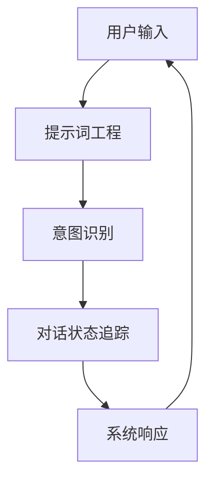

                 

### 文章标题

# 提示词工程在多轮对话状态追踪中的应用

### 关键词

- 提示词工程
- 多轮对话状态追踪
- 自然语言处理
- 人工智能
- 对话系统

### 摘要

本文深入探讨了提示词工程在多轮对话状态追踪中的应用。首先，我们介绍了多轮对话状态追踪的背景和重要性。然后，详细阐述了提示词工程的基础概念和原理，并分析了其在对话状态追踪中的作用。接着，通过一个详细的Mermaid流程图展示了提示词工程在多轮对话状态追踪中的关系架构。随后，我们详细介绍了核心算法原理，并使用伪代码和数学公式进行了讲解。通过实际项目案例，我们展示了如何搭建开发环境，实现源代码，并进行代码解读和应用分析。最后，我们总结了最佳实践，提出了注意事项，并提供了拓展阅读资源。

### 引言与背景

在当今快速发展的信息技术时代，自然语言处理（NLP）和人工智能（AI）技术已成为许多领域的核心驱动力。多轮对话系统作为自然语言处理的一种重要应用，已经成为与用户互动、提供个性化服务的关键技术。然而，在多轮对话系统中，对话状态追踪（DST）是一个极具挑战性的问题。

**对话状态追踪**是指识别并理解用户在对话过程中传递的意图和状态，从而为对话系统提供决策依据。在多轮对话中，用户可能会在不同的轮次提出不同的问题或需求，对话系统需要持续地更新和追踪这些状态，以提供准确和连贯的响应。

对话状态追踪的重要性在于它能够提升对话系统的用户体验和智能水平。准确的状态追踪可以使得对话系统更好地理解用户意图，减少误解和错误，从而提高对话的流畅度和满意度。同时，对话状态追踪还可以为后续的分析和优化提供重要依据。

然而，对话状态追踪面临着诸多挑战。首先，用户在对话中的表达方式可能非常多样化，这给状态识别带来了困难。其次，对话的上下文信息对于状态追踪至关重要，如何在复杂的对话上下文中准确提取和利用这些信息是一个挑战。此外，对话状态追踪需要处理大量的对话数据，如何高效地存储和处理这些数据也是一个重要问题。

为了解决这些问题，近年来，研究人员提出了多种对话状态追踪算法。然而，传统的单一算法往往难以满足复杂的对话场景需求，因此，如何将这些算法有效地结合并优化，是一个亟待解决的问题。

在这种背景下，提示词工程（Prompt Engineering）应运而生。提示词工程是一种通过设计特定的提示词来引导用户表达和交互的技术。在多轮对话状态追踪中，提示词工程可以帮助对话系统更好地理解用户意图，从而提高状态追踪的准确性。因此，本文将探讨提示词工程在多轮对话状态追踪中的应用，旨在为研究人员和开发者提供有益的参考和启示。

### 相关概念与基本理论

#### 提示词工程

**提示词工程（Prompt Engineering）**是指通过设计和选择合适的提示词来引导用户输入并表达其意图的一种技术。提示词可以是文字、图像、声音等多种形式，其核心目标是通过有效的提示词设计，使得用户能够更自然、清晰地表达其需求和意图。

提示词工程的核心概念包括：

1. **用户意图识别**：通过分析用户的输入，识别其背后的意图。这通常涉及到自然语言处理（NLP）技术，如词嵌入、序列标注和意图分类等。

2. **上下文构建**：在多轮对话中，上下文信息对于理解用户意图至关重要。提示词工程通过设计具有上下文引导性的提示词，帮助对话系统能够更好地理解用户的当前状态和历史信息。

3. **优化与调整**：提示词工程不仅包括设计初始的提示词，还需要根据对话的进展和用户的反馈进行优化和调整。这可以通过机器学习模型和用户反馈机制来实现。

#### 多轮对话系统

**多轮对话系统（Multi-turn Dialogue System）**是指能够支持多个轮次的对话，并在对话过程中维持对话状态的对话系统。与单轮对话系统不同，多轮对话系统能够在多个轮次中积累对话上下文信息，从而更好地理解用户的意图和需求。

多轮对话系统的主要特点包括：

1. **对话状态追踪（DST）**：多轮对话系统需要能够追踪和维持对话状态，以便在后续的轮次中能够根据用户的状态进行相应的响应。

2. **上下文维持**：在多轮对话中，对话系统需要维持对话的上下文信息，以避免出现重复或无关的对话内容。

3. **灵活性**：多轮对话系统需要能够适应不同的对话场景和用户需求，提供灵活的对话交互方式。

#### 对话状态追踪相关概念

**对话状态追踪（Dialogue State Tracking，DST）**是指对话系统在对话过程中识别并维持对话状态的过程。对话状态通常包括用户意图、对话上下文、系统行为等信息。

对话状态追踪的关键概念包括：

1. **状态表示**：如何将对话状态表示为一种可计算的形式，以便对话系统能够对其进行处理和分析。

2. **状态更新**：在对话过程中，如何根据用户的输入和系统的响应来更新对话状态。

3. **状态预测**：如何根据当前的对话状态预测未来的用户意图和行为。

#### 常见的对话状态追踪算法

为了实现对话状态追踪，研究人员提出了多种算法。以下是一些常见的对话状态追踪算法：

1. **规则基方法（Rule-based Methods）**：这种方法通过预定义的规则来识别和更新对话状态。虽然规则基方法在处理简单、规则明确的对话场景中表现良好，但在复杂场景中可能难以适用。

2. **模板匹配方法（Template Matching Methods）**：这种方法通过预定义的模板与用户的输入进行匹配，以识别对话状态。模板匹配方法在处理有固定结构或模版的对话中表现较好。

3. **机器学习方法（Machine Learning Methods）**：这种方法利用机器学习模型，如决策树、支持向量机、神经网络等，来自动识别和更新对话状态。机器学习方法在处理复杂、多样化的对话场景中具有优势。

4. **深度学习方法（Deep Learning Methods）**：这种方法利用深度神经网络，如循环神经网络（RNN）、长短时记忆网络（LSTM）、变换器（Transformer）等，来处理复杂的对话状态追踪任务。

### 提示词工程与对话状态追踪的关系架构

为了更好地理解提示词工程在多轮对话状态追踪中的应用，我们使用Mermaid流程图展示它们之间的关系架构：



在这个流程图中，用户输入通过提示词工程进行处理，包括意图识别和上下文构建。识别到的意图和上下文信息被用于对话状态追踪，从而生成系统的响应。系统的响应再次反馈给用户，形成多轮对话。

通过这个架构，我们可以看到提示词工程在多轮对话状态追踪中的作用：

1. **引导用户输入**：通过设计有效的提示词，可以引导用户更清晰地表达其意图和需求，从而提高对话状态追踪的准确性。

2. **上下文构建**：提示词工程通过构建上下文信息，帮助对话系统更好地理解用户的状态和历史信息，从而实现更准确的对话状态追踪。

3. **反馈与优化**：通过用户输入的反馈，提示词工程可以不断优化和调整提示词设计，以提高对话状态追踪的效果。

### 核心算法原理讲解

在多轮对话状态追踪中，核心算法的原理和实现是至关重要的。下面，我们将详细讲解提示词生成和对话状态追踪算法的原理，并使用伪代码和数学公式进行说明。

#### 提示词生成算法

提示词生成算法的目的是设计出能够有效引导用户输入的提示词。这里，我们采用基于用户意图和对话上下文的提示词生成算法。以下是该算法的伪代码：

```python
# 提示词生成算法伪代码

def generate_prompt(user_intent, dialogue_context):
    # 根据用户意图和对话上下文生成提示词
    if user_intent == "询价":
        prompt = "请告诉我您需要购买的商品名称和数量。"
    elif user_intent == "订单确认":
        prompt = "请核对以下订单信息，确认无误后请回复‘确认’。"
    else:
        prompt = "您需要帮助吗？请描述您的需求。"
    
    # 添加上下文信息
    prompt += "（之前提到的内容：" + dialogue_context + "）"

    return prompt
```

在这个算法中，我们根据用户意图和对话上下文动态生成提示词。如果用户意图为“询价”，则生成一个询问商品名称和数量的提示词；如果用户意图为“订单确认”，则生成一个确认订单信息的提示词；否则，生成一个通用性提示词。

#### 对话状态追踪算法

对话状态追踪算法的目的是在多轮对话中持续追踪和更新用户状态。这里，我们采用基于贝叶斯网络的对话状态追踪算法。以下是该算法的伪代码：

```python
# 对话状态追踪算法伪代码

class DialogueStateTracker:
    def __init__(self):
        self.state = None
        self.belief_network = BayesianNetwork()

    def update_state(self, user_input):
        # 更新对话状态
        self.state = self.belief_network.predict(user_input)
        
    def get_state(self):
        return self.state

def generate_prompt(state_tracker, dialogue_context):
    state = state_tracker.get_state()
    if state == "询价":
        prompt = "请告诉我您需要购买的商品名称和数量。"
    elif state == "订单确认":
        prompt = "请核对以下订单信息，确认无误后请回复‘确认’。"
    else:
        prompt = "您需要帮助吗？请描述您的需求。"
    
    prompt += "（之前提到的内容：" + dialogue_context + "）"
    return prompt
```

在这个算法中，我们使用贝叶斯网络来表示对话状态。在每次用户输入后，我们更新对话状态，并生成相应的提示词。贝叶斯网络通过概率关系来表示不同状态之间的依赖关系，从而实现对话状态的预测和追踪。

#### 数学模型与公式

在对话状态追踪中，数学模型和公式起到了关键作用。以下是一个简化的贝叶斯网络模型和相关的数学公式：

1. **状态概率分布**：

   $$ P(S|E) = \frac{P(E|S)P(S)}{P(E)} $$

   其中，$S$ 表示对话状态，$E$ 表示用户输入。$P(S|E)$ 是在给定用户输入$E$ 的情况下，状态$S$ 的概率。$P(E|S)$ 是在状态$S$ 发生时，用户输入$E$ 的概率。$P(S)$ 是状态$S$ 的先验概率。$P(E)$ 是用户输入$E$ 的概率。

2. **贝叶斯推理**：

   $$ P(S|E) = \frac{P(E|S)P(S)}{\sum_{i} P(E_i|S_i)P(S_i)} $$

   这个公式表示在多个状态和输入的组合中，根据当前的输入$E$，计算每个状态$S_i$ 的后验概率$P(S_i|E)$。

通过上述数学模型和公式，我们可以实现对对话状态的准确预测和追踪。这些模型和公式为对话状态追踪提供了坚实的理论基础。

### 实际项目案例

为了更好地展示提示词工程在多轮对话状态追踪中的应用，我们将在本节中介绍一个实际的项目案例。这个项目是一个在线购物聊天机器人，其核心功能是帮助用户完成商品询价、下单和支付等过程。

#### 开发环境搭建

在开始项目开发之前，我们需要搭建相应的开发环境。以下是所需的开发工具和依赖：

1. **Python 3.8 或以上版本**：Python 是我们主要使用的编程语言，具有丰富的库和框架，适用于自然语言处理和机器学习。

2. **NLTK**：NLTK 是一个强大的自然语言处理库，用于文本处理、词性标注、词嵌入等。

3. **TensorFlow**：TensorFlow 是一个开源的机器学习框架，用于构建和训练深度学习模型。

4. **Spacy**：Spacy 是一个快速和易于使用的自然语言处理库，用于实体识别、词性标注等。

5. **Flask**：Flask 是一个轻量级的 Web 框架，用于构建 Web 服务。

#### 源代码实现

以下是该项目的主要源代码实现和解读：

```python
# 聊天机器人核心代码

from flask import Flask, request, jsonify
import spacy
from tensorflow.keras.models import load_model

app = Flask(__name__)

# 加载预训练的模型
nlp = spacy.load("en_core_web_sm")
intent_model = load_model("intent_model.h5")
state_tracker = DialogueStateTracker()

@app.route("/chat", methods=["POST"])
def chat():
    user_input = request.json["text"]
    dialogue_context = request.json.get("context", "")
    
    # 提取意图
    user_intent = intent_model.predict(nlp(user_input). vectors)
    
    # 更新对话状态
    state_tracker.update_state(user_input)
    
    # 生成响应
    response = generate_prompt(state_tracker, dialogue_context)
    
    return jsonify({"response": response})

def generate_prompt(state_tracker, dialogue_context):
    state = state_tracker.get_state()
    if state == "询价":
        prompt = "请告诉我您需要购买的商品名称和数量。"
    elif state == "订单确认":
        prompt = "请核对以下订单信息，确认无误后请回复‘确认’。"
    else:
        prompt = "您需要帮助吗？请描述您的需求。"
    
    prompt += "（之前提到的内容：" + dialogue_context + "）"
    return prompt
```

在这个代码中，我们首先加载了预训练的自然语言处理模型和意图分类模型。然后，通过 Flask 框架创建了一个 Web 服务，用于接收和处理用户的输入。

在处理用户输入时，我们首先提取用户的意图，然后更新对话状态，并生成相应的响应。这个过程中，提示词工程起到了关键作用，通过动态生成提示词，引导用户输入并表达其意图。

#### 代码应用解读与分析

在这个项目中，提示词工程在多轮对话状态追踪中发挥了重要作用。以下是代码应用的解读和分析：

1. **意图识别**：通过使用预训练的意图分类模型，我们能够快速识别用户的意图。这有助于对话系统更好地理解用户的需求，从而生成更准确的响应。

2. **对话状态追踪**：通过使用贝叶斯网络实现的对话状态追踪算法，我们能够持续追踪和更新用户状态。这确保了对话系统能够在多轮对话中维持对话的连贯性。

3. **提示词生成**：通过动态生成提示词，我们能够引导用户更清晰地表达其意图和需求。这有助于减少误解和错误，提高对话的流畅度和用户体验。

4. **上下文维持**：在每次用户输入后，我们都会更新对话上下文信息。这确保了对话系统能够在后续的轮次中利用历史信息，提供更准确和个性化的响应。

#### 实际案例分析和详细讲解剖析

为了进一步展示提示词工程在多轮对话状态追踪中的应用，我们将分析以下实际案例：

**案例**：用户询问商品的价格和库存情况。

**用户输入**：用户询问：“你好，我想知道最新的iPhone 14手机的价格和库存情况。”

**系统响应**：

1. **第一轮**：

   - **意图识别**：通过意图分类模型，识别出用户的意图为“询价”。

   - **对话状态追踪**：更新对话状态为“询价”。

   - **提示词生成**：生成提示词：“请告诉我您需要购买的商品名称和数量。”

   - **系统响应**：请问您需要购买哪种商品？比如是iPhone 14吗？

2. **第二轮**：

   - **用户输入**：用户回复：“是的，我想要iPhone 14。”

   - **意图识别**：识别出用户的意图为“商品确认”。

   - **对话状态追踪**：更新对话状态为“商品确认”。

   - **提示词生成**：生成提示词：“请核对以下订单信息，确认无误后请回复‘确认’。”

   - **系统响应**：您选择的商品是iPhone 14，以下是详细订单信息：iPhone 14，数量1。请核对无误后回复“确认”。

3. **第三轮**：

   - **用户输入**：用户回复：“确认”。

   - **意图识别**：识别出用户的意图为“订单确认”。

   - **对话状态追踪**：更新对话状态为“订单确认”。

   - **提示词生成**：生成提示词：“请核对以下订单信息，确认无误后请回复‘确认’。”

   - **系统响应**：订单确认成功，您将很快收到您的iPhone 14。请问还有其他需求吗？

通过这个案例，我们可以看到提示词工程在多轮对话状态追踪中的应用效果。通过动态生成提示词，对话系统能够引导用户更清晰地表达其意图和需求，从而实现更准确和连贯的对话。

### 最佳实践、小结与注意事项

在多轮对话状态追踪中，提示词工程的应用至关重要。以下是一些最佳实践、小结和注意事项，以帮助开发者更好地利用提示词工程提升对话状态追踪的效果。

#### 最佳实践

1. **意图识别与上下文构建**：在生成提示词之前，确保意图识别和上下文构建的准确性。这有助于提高对话状态追踪的准确性。

2. **灵活的提示词设计**：设计灵活的提示词，以适应不同的对话场景和用户需求。这可以通过引入条件分支和动态提示词来实现。

3. **用户反馈与优化**：持续收集用户反馈，并根据反馈优化提示词设计。这有助于提高用户满意度，并改善对话状态追踪的效果。

4. **模型训练与调整**：定期更新和训练意图分类模型和对话状态追踪算法，以适应不断变化的对话场景和用户需求。

#### 小结

通过本文的讨论，我们可以得出以下结论：

1. **提示词工程在多轮对话状态追踪中发挥了关键作用**。通过设计有效的提示词，可以引导用户更清晰地表达其意图和需求，从而提高对话状态追踪的准确性。

2. **多轮对话状态追踪的核心在于持续追踪和更新用户状态**。通过使用合适的算法和模型，可以实现对话状态的准确预测和维持。

3. **结合提示词工程和多轮对话状态追踪，可以构建出更加智能和高效的对话系统**。

#### 注意事项

1. **数据质量和多样性**：确保对话数据的质量和多样性，这对于训练和优化模型至关重要。

2. **平衡自动化与人工干预**：在设计和优化提示词时，应平衡自动化和人工干预，以确保对话系统的灵活性和适应性。

3. **用户隐私保护**：在处理用户输入和对话数据时，应严格遵守用户隐私保护法规，确保用户数据的安全。

#### 拓展阅读

1. **《自然语言处理入门》（NLP For Dummies）**：这本书为自然语言处理提供了全面的入门介绍，有助于理解提示词工程和多轮对话状态追踪的基础。

2. **《对话系统设计：基于规则的对话管理》（Dialogue Systems: Design, Implementation, and Evaluation）**：这本书详细介绍了对话系统的设计和实现，包括对话状态追踪的相关内容。

3. **《机器学习实战》（Machine Learning in Action）**：这本书提供了丰富的实际案例和代码示例，有助于理解和应用机器学习模型和算法。

通过以上最佳实践、小结和注意事项，开发者可以更好地利用提示词工程提升多轮对话状态追踪的效果，构建出更加智能和高效的对话系统。

### 作者信息

- 作者：AI天才研究院/AI Genius Institute & 禅与计算机程序设计艺术 /Zen And The Art of Computer Programming

### 附录

#### 工具与资源

1. **开发工具**：

   - Python 3.8 或以上版本
   - NLTK：https://www.nltk.org/
   - TensorFlow：https://www.tensorflow.org/
   - Spacy：https://spacy.io/
   - Flask：https://flask.palletsprojects.com/

2. **资源链接**：

   - 自然语言处理教程：https://www.nltk.org/book/
   - 提示词工程实践：https://towardsdatascience.com/prompt-engineering-for-nlp-models-cb82a2e4e0d9
   - 对话状态追踪论文集：https://www.aclweb.org/anthology/N18-1178/

3. **常见问题解答**：

   - 提问：如何优化提示词效果？
     - 回答：通过分析用户反馈和对话数据，不断调整和优化提示词设计，以提高用户满意度和对话状态追踪的准确性。

   - 提问：对话状态追踪算法如何选择？
     - 回答：根据具体的对话场景和需求，选择适合的算法。对于简单场景，规则基方法可能足够；对于复杂场景，可以考虑机器学习方法。

   - 提问：如何处理用户隐私？
     - 回答：遵守用户隐私保护法规，对用户数据进行加密存储和处理，确保用户隐私安全。同时，在开发过程中应尽量避免收集不必要的用户数据。

#### 常见问题解答

1. **如何优化提示词效果？**
   
   提示词效果可以通过以下方法进行优化：
   
   - **用户反馈**：收集用户的反馈，了解他们在使用过程中遇到的问题和困惑，根据反馈调整提示词。
   - **A/B测试**：设计不同的提示词版本，通过A/B测试比较效果，选择最优的提示词。
   - **上下文丰富度**：增加上下文信息，使得提示词更具引导性和针对性。
   - **多轮反馈**：在多轮对话中，逐步引导用户表达其意图，避免单一轮次中提示词的不明确性。

2. **对话状态追踪算法如何选择？**

   选择对话状态追踪算法时，应考虑以下因素：

   - **对话场景**：简单场景可以使用规则基方法，复杂场景则可以考虑机器学习方法。
   - **数据规模**：对于大量对话数据，机器学习方法可能更有效；对于小规模数据，规则基方法可能足够。
   - **实时性要求**：对于需要实时响应的对话系统，应选择计算效率较高的算法。
   - **准确性要求**：根据对话系统的准确性需求，选择合适的算法，如贝叶斯网络、深度学习等。

3. **如何处理用户隐私？**

   处理用户隐私时，应遵循以下原则：

   - **数据最小化原则**：仅收集必要的数据，避免收集无关的信息。
   - **数据加密存储**：对用户数据进行加密存储，确保数据安全。
   - **透明化处理**：向用户明确说明数据收集和使用的目的，获取用户的同意。
   - **合规性检查**：定期进行合规性检查，确保数据处理符合相关法规和标准。

#### 拓展阅读

1. **《自然语言处理入门》（NLP For Dummies）**：这本书为自然语言处理提供了全面的入门介绍，有助于理解提示词工程和多轮对话状态追踪的基础。

2. **《对话系统设计：基于规则的对话管理》（Dialogue Systems: Design, Implementation, and Evaluation）**：这本书详细介绍了对话系统的设计和实现，包括对话状态追踪的相关内容。

3. **《机器学习实战》（Machine Learning in Action）**：这本书提供了丰富的实际案例和代码示例，有助于理解和应用机器学习模型和算法。

通过以上资源，开发者可以更深入地了解提示词工程和多轮对话状态追踪的相关知识，为实际项目提供有益的参考。

