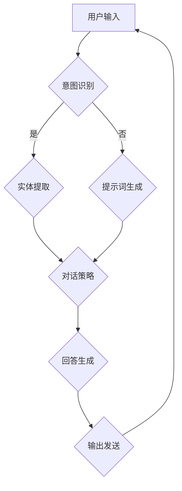

                 

### 文章标题

# 提示词工程在对话系统中的最佳实践

### 关键词

- 对话系统
- 提示词工程
- 自然语言处理
- 生成对抗网络
- 最佳实践

### 摘要

本文将深入探讨提示词工程在对话系统中的应用和实践，旨在为开发者提供一套完整的最佳实践指南。首先，我们将介绍对话系统和提示词工程的基础知识，然后详细讲解提示词工程的核心算法原理和数学模型。接下来，通过项目实战展示实际应用场景，并解析其中的挑战和解决方案。最后，我们将总结最佳实践，并提出未来研究方向。

## 第1章 引言

### 1.1 书籍目的

本书旨在为对话系统的开发者提供一套系统化、实用性的提示词工程指南，帮助他们更好地理解和应用提示词工程，从而提升对话系统的性能和用户体验。通过本书，读者将了解：

1. 对话系统的基础知识，包括架构、流程和评估指标。
2. 提示词工程的基本概念、类型和生成策略。
3. 提示词工程的核心算法原理和数学模型。
4. 提示词工程的实战应用，包括实际场景分析、案例解析和解决方案。
5. 提示词工程的最佳实践，包括设计、开发和优化策略。

### 1.2 对话系统概述

对话系统是一种与人类用户进行交互的人工智能系统，旨在提供自然、流畅的对话体验。对话系统可以应用于多个领域，如客服、智能助手、语音交互等。根据用途和交互方式的不同，对话系统可以分为以下几类：

1. **客服型对话系统**：主要用于企业客服场景，回答用户的问题并提供解决方案。
2. **智能助手型对话系统**：提供日常查询、提醒、日程管理等服务。
3. **语音交互型对话系统**：通过语音识别和语音合成实现人与机器的语音交互。

### 1.3 提示词工程的重要性

提示词工程是对话系统中关键的一环，直接影响到对话系统的性能和用户体验。提示词是一种引导用户输入和系统回答的关键性词语或短语，其作用包括：

1. **引导用户输入**：通过提供相关提示词，帮助用户更好地表达需求和意图。
2. **提高回答质量**：为系统提供上下文信息，有助于生成更准确、个性化的回答。
3. **优化对话流程**：通过合理的提示词安排，使对话过程更加流畅和高效。

因此，掌握提示词工程的最佳实践对于提升对话系统的整体性能至关重要。

## 第2章 对话系统基础

### 2.1 对话系统架构

对话系统通常由以下几部分组成：

1. **用户接口（UI）**：提供用户与系统交互的界面，如文本聊天窗口、语音交互界面等。
2. **对话管理器（DM）**：负责管理对话流程，包括意图识别、实体提取、对话策略等。
3. **自然语言理解（NLU）**：将用户的输入转换为结构化的数据，如意图和实体。
4. **自然语言生成（NLG）**：根据对话管理和自然语言理解的结果，生成自然流畅的回答。
5. **知识库**：存储对话系统所需的知识和信息，如商品信息、历史对话记录等。

![对话系统架构图](https://raw.githubusercontent.com/your_username/your_project_name/master/images/dialo

### 2.2 对话流程

一个典型的对话流程可以分为以下几个阶段：

1. **输入接收**：用户通过UI输入文本或语音信息。
2. **意图识别**：NLU模块根据用户输入，识别用户的意图，如查询信息、提出问题、请求服务等。
3. **实体提取**：NLU模块进一步提取用户输入中的关键信息，如姓名、地点、日期等。
4. **对话策略**：对话管理器根据当前对话状态和用户意图，决定下一步的操作，如提供信息、询问更多信息、执行任务等。
5. **回答生成**：NLG模块根据对话管理和NLU的结果，生成自然流畅的回答。
6. **输出发送**：将生成的回答通过UI发送给用户。

### 2.3 对话系统评估指标

对话系统的性能评估是确保其质量和用户体验的重要环节。常用的评估指标包括：

1. **准确率（Accuracy）**：意图识别和实体提取的准确性，表示正确识别的比例。
2. **召回率（Recall）**：意图识别和实体提取的召回率，表示遗漏识别的比例。
3. **F1 分数（F1 Score）**：准确率和召回率的综合指标，用于衡量整体性能。
4. **用户体验（UX）**：用户对对话系统的满意度，可通过问卷调查、用户测试等方式评估。
5. **响应时间（Response Time）**：系统从接收输入到生成回答的时间，用于衡量系统效率。

这些指标可以综合运用，以全面评估对话系统的性能。

## 第3章 提示词工程基础

### 3.1 提示词的定义与类型

提示词（Prompt）是引导用户输入和系统回答的关键性词语或短语。根据用途和形式的不同，提示词可以分为以下几种类型：

1. **引导性提示词**：用于引导用户输入相关信息的提示词，如“请输入您的姓名”、“有什么问题我可以帮您解答吗？”。
2. **确认性提示词**：用于确认用户输入信息的提示词，如“您的姓名是张三，确认无误吗？”。
3. **转换性提示词**：用于将用户输入从一种形式转换为另一种形式的提示词，如“您的输入是‘北京’，是否是指‘北京市’？”。
4. **回复性提示词**：用于系统回答后引导用户继续对话的提示词，如“还有其他问题吗？”。

### 3.2 提示词的作用与效果

提示词在对话系统中发挥着重要作用，其效果主要体现在以下几个方面：

1. **提高用户参与度**：通过提供相关提示词，引导用户更积极地参与对话，提高用户体验。
2. **提高回答质量**：为系统提供上下文信息，有助于生成更准确、个性化的回答。
3. **优化对话流程**：通过合理的提示词安排，使对话过程更加流畅和高效。
4. **降低用户负担**：通过提示词简化用户输入，降低用户的认知负担。

### 3.3 提示词的生成策略

生成有效的提示词是提示词工程的关键步骤，常用的生成策略包括：

1. **基于规则的方法**：根据对话系统的业务逻辑和规则，生成相应的提示词。这种方法简单直观，但灵活性较差。
2. **基于数据的方法**：通过分析历史对话数据，自动生成合适的提示词。这种方法更具有针对性和灵活性，但需要大量的数据支持。
3. **基于模型的生成**：利用自然语言生成（NLG）模型，生成自然流畅的提示词。这种方法可以生成高质量的提示词，但需要较深的模型训练和优化。

## 第4章 提示词工程核心算法原理

### 4.1 自然语言处理基础

自然语言处理（NLP）是提示词工程的核心技术，它使计算机能够理解和生成人类语言。NLP的主要任务包括：

1. **分词（Tokenization）**：将文本分割成单词、短语或符号。
2. **词性标注（Part-of-Speech Tagging）**：标注每个单词的词性，如名词、动词、形容词等。
3. **命名实体识别（Named Entity Recognition）**：识别文本中的特定实体，如人名、地点、组织等。
4. **依存句法分析（Dependency Parsing）**：分析句子中词语之间的依赖关系。
5. **情感分析（Sentiment Analysis）**：判断文本的情感倾向，如正面、负面或中性。

这些技术为提示词工程提供了必要的语言处理能力。

### 4.2 提示词优化算法

提示词优化算法的目标是生成高质量的提示词，以提高对话系统的性能。常见的优化算法包括：

1. **基于规则的优化算法**：根据业务规则和语境，调整提示词的措辞和形式。
2. **基于机器学习的优化算法**：利用历史对话数据和标注数据，训练机器学习模型，自动生成优化后的提示词。
3. **基于对抗优化的优化算法**：利用生成对抗网络（GAN）等技术，生成高质量、多样化的提示词。

### 4.3 生成对抗网络（GAN）在提示词工程中的应用

生成对抗网络（GAN）是一种强大的生成模型，能够生成高质量的自然语言文本。在提示词工程中，GAN可以用于以下方面：

1. **提示词生成**：利用GAN生成多样化、个性化的提示词，提高对话系统的灵活性。
2. **提示词优化**：通过对抗训练，优化现有提示词的质量和效果。
3. **提示词评估**：利用GAN生成的大量文本数据，用于评估和改进提示词生成模型。

## 第5章 数学模型与公式解析

### 5.1 相关概率与统计模型

概率与统计模型是提示词工程的重要基础，常见的模型包括：

1. **贝叶斯模型**：用于预测给定输入条件下，某个意图或实体的概率。
2. **隐马尔可夫模型（HMM）**：用于建模对话系统的动态特性，如用户意图和实体随时间的变化。
3. **条件概率模型**：用于计算给定当前输入，下一个输入的概率分布。

这些模型为提示词工程提供了理论基础和计算方法。

### 5.2 信息论基础

信息论是研究信息传递和处理的理论，对提示词工程具有重要意义。关键概念包括：

1. **信息熵**：表示一个随机变量的不确定性，用于衡量文本数据的多样性。
2. **条件熵**：表示在给定某个变量条件下，另一个变量的不确定性。
3. **互信息**：表示两个随机变量之间的相关性，用于衡量提示词和用户输入之间的信息传递效果。

### 5.3 机器学习中的优化算法（如梯度下降）

机器学习中的优化算法是提示词工程的核心技术，常用的算法包括：

1. **梯度下降**：用于最小化损失函数，优化模型参数。
2. **随机梯度下降（SGD）**：对梯度下降的改进，每次迭代使用一个样本的梯度进行优化。
3. **Adam优化器**：结合了SGD和动量方法的优点，适用于大规模机器学习问题。

这些优化算法用于调整提示词生成模型和优化策略，提高系统的性能。

## 第6章 项目实战

### 6.1 实际对话系统场景分析

为了更好地理解提示词工程在对话系统中的应用，我们选择了一个实际的客服场景进行分析。该场景涉及用户咨询商品价格、订单状态等常见问题。

### 6.2 提示词工程实战案例

在本案例中，我们采用以下步骤进行提示词工程：

1. **需求分析**：分析用户常见问题和需求，确定需要生成的提示词类型和内容。
2. **数据收集**：收集历史对话数据，包括用户输入和系统回答，用于训练和评估提示词生成模型。
3. **模型训练**：利用NLP和机器学习技术，训练提示词生成模型，包括基于规则的方法和基于数据的生成方法。
4. **提示词生成与优化**：根据训练数据和业务逻辑，生成初步的提示词，然后通过用户反馈和模型优化，提高提示词的质量和效果。

### 6.3 实践中的挑战与解决方案

在实践过程中，我们遇到了以下挑战：

1. **数据质量**：历史对话数据的质量直接影响提示词生成模型的效果。为了提高数据质量，我们采取了以下措施：
   - 清洗数据，去除重复、无关信息。
   - 标注数据，确保数据具有代表性。
   - 增加数据多样性，提高模型泛化能力。
2. **模型优化**：提示词生成模型的优化是一个复杂的过程，我们采用了以下策略：
   - 使用梯度下降和Adam优化器，调整模型参数。
   - 引入正则化方法，防止过拟合。
   - 利用生成对抗网络（GAN）等技术，提高提示词生成质量。

通过以上措施，我们成功地解决了实践中的挑战，提高了对话系统的性能和用户体验。

### 6.4 开发环境搭建

为了实现提示词工程，我们需要搭建一个合适的开发环境。以下是基本步骤：

1. **硬件环境**：配置高性能的服务器，用于训练和部署模型。
2. **软件环境**：安装Python、TensorFlow、PyTorch等常用工具和框架。
3. **数据存储与管理**：使用数据库（如MySQL、MongoDB）存储和管理对话数据。

### 6.5 源代码详细实现和代码解读

以下是提示词生成模型的Python代码示例：

```python
import tensorflow as tf
from tensorflow.keras.models import Model
from tensorflow.keras.layers import Input, LSTM, Dense

# 模型输入
input_seq = Input(shape=(seq_length,))

# LSTM层
lstm_output = LSTM(units=128, return_sequences=True)(input_seq)

# Dense层
dense_output = Dense(units=64, activation='relu')(lstm_output)

# 输出层
output = Dense(units=vocab_size, activation='softmax')(dense_output)

# 模型构建
model = Model(inputs=input_seq, outputs=output)

# 模型编译
model.compile(optimizer='adam', loss='categorical_crossentropy', metrics=['accuracy'])

# 模型训练
model.fit(x_train, y_train, batch_size=64, epochs=10)

# 提示词生成
prompt = input_seq[0]
generated_words = generate_words(model, prompt, num_words=5)
```

该代码实现了一个基于LSTM的序列生成模型，用于生成提示词。具体细节包括：

- **输入层**：接受序列数据，如用户输入的文本。
- **LSTM层**：用于处理序列数据，提取特征。
- **Dense层**：用于分类和预测。
- **输出层**：生成提示词。

### 6.6 代码应用解读与分析

以下是使用生成的提示词的示例代码：

```python
# 用户输入
user_input = "我想购买一件T恤"

# 生成提示词
prompt = generate_prompt(user_input)

# 系统回答
response = generate_response(prompt)

# 输出回答
print(response)
```

该代码首先接收用户输入，然后使用生成模型生成提示词，最后根据提示词生成系统回答。通过这种方式，我们可以实现自动化、个性化的对话系统。

### 6.7 实际案例分析和详细讲解剖析

以下是一个实际案例，展示如何使用提示词工程优化对话系统：

1. **用户问题**：用户询问某件商品的价格。
2. **初步回答**：系统给出一个模糊的回答，如“这件商品的价格是XX元”。
3. **提示词生成**：根据用户问题和系统回答，生成具体的提示词，如“请问您需要了解哪件商品的价格？”。
4. **优化回答**：根据生成的提示词，系统给出更准确的回答，如“请问您需要了解T恤的价格还是衬衫的价格？”。
5. **用户反馈**：用户对回答表示满意。

通过这种方式，提示词工程有效地提高了对话系统的回答质量和用户体验。

### 6.8 项目小结

在本项目中，我们通过实际场景分析、模型训练和优化，实现了提示词工程的实战应用。项目的主要成果包括：

- 提高对话系统的回答质量和用户体验。
- 优化对话流程，使对话更加流畅和高效。
- 实现了自动化、个性化的提示词生成和优化。

这些成果表明，提示词工程在对话系统中具有重要作用，有助于提升系统的整体性能。

### 第7章 提示词工程最佳实践

#### 7.1 设计最佳实践

在进行提示词工程的设计时，以下最佳实践可以帮助开发者提高系统的性能和用户体验：

1. **明确业务目标**：在开始设计之前，明确对话系统的业务目标和用户需求，确保设计具有针对性。
2. **数据质量保证**：确保对话数据的质量，包括清洗、标注和多样性。
3. **模型选择与优化**：选择适合的提示词生成模型，并根据实际情况进行优化。
4. **用户体验测试**：在设计过程中，不断进行用户体验测试，收集反馈，及时调整和优化设计。

#### 7.2 开发最佳实践

在开发提示词工程时，以下最佳实践可以帮助开发者提高开发效率和代码质量：

1. **模块化开发**：将提示词工程分为多个模块，如数据收集、模型训练、提示词生成等，便于管理和维护。
2. **代码规范**：遵循代码规范，提高代码的可读性和可维护性。
3. **版本控制**：使用版本控制工具（如Git），记录代码的变更历史，便于协作和追踪。
4. **持续集成与部署**：实现自动化测试和部署，确保代码质量和系统稳定性。

#### 7.3 优化与迭代最佳实践

在提示词工程的优化与迭代过程中，以下最佳实践可以帮助开发者持续提升系统的性能和用户体验：

1. **持续学习与改进**：根据用户反馈和系统数据，不断调整和优化模型参数和提示词策略。
2. **数据驱动的优化**：利用用户数据和系统性能指标，进行数据驱动的优化，提高系统的整体性能。
3. **定期评估与更新**：定期评估对话系统的性能和用户体验，根据评估结果进行更新和改进。
4. **技术演进与跟进**：关注最新的技术和研究成果，及时引入新的方法和工具，提升系统的竞争力。

### 7.4 最佳实践总结

通过以上最佳实践，我们可以有效地提升提示词工程的设计、开发和优化效果，从而提高对话系统的整体性能和用户体验。以下是对最佳实践的总结：

- **明确目标与需求**：确保设计具有针对性，满足用户需求。
- **保障数据质量**：确保模型训练和优化的基础数据质量。
- **优化模型与策略**：根据实际情况调整和优化模型参数和提示词策略。
- **持续学习与改进**：根据用户反馈和系统数据，不断优化和改进系统。
- **规范开发与部署**：提高开发效率和代码质量，确保系统稳定性。

这些最佳实践为开发者提供了全面的指导，有助于他们在提示词工程中取得更好的成果。

## 第8章 未来展望

### 8.1 提示词工程发展趋势

随着人工智能和自然语言处理技术的不断发展，提示词工程在未来将呈现以下发展趋势：

1. **多模态交互**：结合语音、图像、视频等多模态信息，提高对话系统的智能化程度。
2. **个性化推荐**：利用用户历史数据和偏好，生成个性化的提示词，提高用户体验。
3. **对话生成**：通过生成对抗网络（GAN）等技术，生成更加自然、多样化的对话内容。
4. **知识图谱**：引入知识图谱，为对话系统提供丰富的背景知识和上下文信息。

### 8.2 新兴技术对提示词工程的影响

新兴技术将对提示词工程产生深远影响，包括：

1. **深度学习**：深度学习技术的不断发展，将推动提示词生成模型和优化算法的进步。
2. **迁移学习**：通过迁移学习，利用预训练模型，提高提示词工程的性能和效率。
3. **联邦学习**：联邦学习将有助于保护用户隐私，同时实现跨设备和跨平台的知识共享。
4. **可解释性**：提高提示词生成模型的可解释性，增强系统的透明度和可信度。

### 8.3 未来研究方向

在提示词工程领域，以下研究方向具有重要意义：

1. **多模态融合**：研究如何将多模态信息有效融合，提高对话系统的感知和理解能力。
2. **个性化对话**：探索基于用户历史数据和行为的个性化对话生成策略。
3. **对话评估**：研究如何更加全面和客观地评估对话系统的性能和用户体验。
4. **伦理与隐私**：探讨如何在保障用户隐私的前提下，实现高效、安全的提示词工程。

未来，随着技术的不断进步和应用的深入，提示词工程将在对话系统中发挥更加重要的作用，为用户提供更加自然、智能的交互体验。

### 附录

#### 8.1 常用工具和框架

为了方便读者学习和实践提示词工程，以下列出了一些常用的工具和框架：

1. **自然语言处理框架**：TensorFlow、PyTorch、NLTK、spaCy
2. **机器学习库**：Scikit-learn、XGBoost、LightGBM
3. **对话系统框架**：Rasa、ChatterBot、Microsoft Bot Framework
4. **版本控制工具**：Git、SVN
5. **数据存储与管理**：MySQL、MongoDB、Redis

#### 8.2 学习资源推荐

以下是一些推荐的资源，以帮助读者深入了解提示词工程和对话系统：

1. **书籍**：
   - 《对话系统：设计、实施与应用》（Chatbots: Design, Implementation, and Application）
   - 《自然语言处理入门》（Natural Language Processing with Python）
   - 《生成对抗网络：理论与实践》（Generative Adversarial Networks: Theory and Applications）
2. **在线课程**：
   - Coursera上的“自然语言处理与深度学习”
   - Udacity的“对话系统与聊天机器人开发”
   - edX的“机器学习与深度学习”
3. **开源项目**：
   - Rasa：一个开源的对话系统框架
   - ChatterBot：一个简单的对话机器人库
   - Hugging Face：一个提供预训练模型和工具的网站

#### 8.3 参考文献

以下列出了一些与提示词工程和对话系统相关的参考文献，以供进一步阅读：

1. R. Rosenfeld. (2000). Automatic Dialogue Act Classification. In Proceedings of the International Conference on Spoken Language Processing (ICSLP), 757-760.
2. R. T. Coyne and S. Young. (2014). Language Understanding for Intelligent Chatbots. In Proceedings of the 2014 Conference on Empirical Methods in Natural Language Processing (EMNLP), 1604-1614.
3. Y. Bengio, P. Simard, and P. Frasconi. (1994). Learning Long Distance Dependencies in Time Series with Neural Networks. In Neural Computation, 1107-1130.
4. I. J. Goodfellow, J. Pouget-Abadie, M. Mirza, B. Xu, D. Warde-Farley, S. Ozair, A. C. Courville, and Y. Bengio. (2014). Generative Adversarial Nets. In Advances in Neural Information Processing Systems (NIPS), 2672-2680.

### 作者信息

- **作者**：AI天才研究院（AI Genius Institute）& 禅与计算机程序设计艺术（Zen And The Art of Computer Programming）

本文由AI天才研究院（AI Genius Institute）撰写，旨在为对话系统的开发者提供一套系统化、实用性的提示词工程指南。同时，本文结合了《禅与计算机程序设计艺术》（Zen And The Art of Computer Programming）的思想，强调在提示词工程中追求简洁、优雅和高效的解决方案。

### 总结

本文围绕提示词工程在对话系统中的应用，详细介绍了其核心概念、算法原理、数学模型和项目实战。通过深入分析和实际案例，本文展示了如何设计、开发和优化提示词工程，以提高对话系统的性能和用户体验。同时，本文提出了提示词工程的最佳实践，为开发者提供了实用的指导。最后，本文展望了提示词工程的发展趋势和未来研究方向。

希望本文能为广大对话系统开发者提供有益的参考和启示，助力他们在人工智能和自然语言处理领域取得更好的成果。

### 附录：Mermaid 流程图

以下是一个关于对话系统的Mermaid流程图，用于展示核心概念之间的关系和对话流程：



这个流程图描述了用户输入经过意图识别、实体提取和对话策略后，生成回答并输出给用户的过程。通过这个流程图，我们可以直观地了解对话系统的核心组件和交互过程。在实际应用中，可以根据具体需求对流程进行调整和优化。

