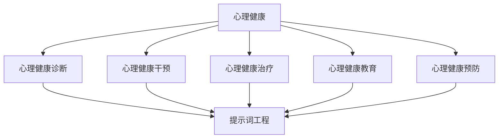

                 

### 文章标题：提示词工程在心理健康领域的应用

> 关键词：心理健康、提示词工程、诊断、干预、治疗、人工智能

> 摘要：本文深入探讨了提示词工程在心理健康领域的应用。通过详细阐述心理健康的基本概念和现状，我们介绍了提示词工程的基本原理和应用流程。随后，文章重点分析了提示词工程在心理健康诊断、干预和治疗、教育宣传、预防与监测等方面的实际应用，并通过实际案例进行了详细讲解。最后，文章总结了心理健康领域提示词工程的技术挑战和发展趋势，为未来的研究提供了方向。

----------------------------------------------------------------

## 第一部分：心理健康与提示词工程概述

### 第1章：心理健康基础

心理健康是人的整体健康状态的一部分，涵盖了情感、心理和社交方面的良好状态。它不仅与身体疾病有着密切联系，还对生活质量产生深远影响。然而，随着社会压力的增大和心理健康问题的普遍化，心理健康现状面临着前所未有的挑战。

#### 1.1 心理健康概念与重要性

心理健康是指个体在情感、心理和社交方面的良好状态，不仅包括没有心理疾病，还涉及个体能够有效地应对生活中的压力、挑战和变化。世界卫生组织（WHO）将心理健康定义为“一种状态，在这种状态下，个体能够认识到自身的潜力，能够应对正常的生活压力，能够工作生产并能够为其社区做出贡献”。

心理健康对生活质量有着重要影响。一个心理健康的人通常能够更好地处理日常生活中的问题，拥有更高的幸福感，更少地经历心理疾病。此外，心理健康也与身体健康密切相关。研究表明，心理疾病和身体疾病之间存在双向关系，即心理问题可能导致身体健康问题，而身体疾病也可能影响心理健康。

#### 1.2 心理健康现状与挑战

全球范围内，心理健康问题的发生率和患病率都在不断上升。根据世界卫生组织的数据，全球约有1/4的人口在一生中的某个阶段会经历某种形式的心理健康问题。在中国，心理健康问题也日益突出，尤其是在城市地区。随着生活节奏的加快和竞争压力的增大，越来越多的人面临心理健康问题。

当前，心理健康现状面临以下挑战：

1. **诊断与评估困难**：心理健康问题通常表现为主观体验，难以准确诊断和评估。传统的诊断方法主要依赖于医生的判断和患者的自我报告，存在一定局限性。
2. **干预与治疗资源不足**：尽管心理健康问题日益严重，但许多国家和地区在心理健康服务和资源方面存在不足。特别是在发展中国家，心理健康服务的可及性和质量都有待提高。
3. **心理健康教育与宣传不足**：公众对心理健康问题的认识不足，缺乏有效的心理健康教育和宣传，导致许多人未能及时获得帮助。

#### 1.3 提示词工程概述

提示词工程是一种基于人工智能和自然语言处理的技术，通过设计特定的提示词来引导用户生成相关文本。它广泛应用于文本生成、对话系统、情感分析等领域。近年来，随着心理健康问题的日益凸显，提示词工程在心理健康领域的应用也逐渐受到关注。

提示词工程在心理健康领域的应用主要包括以下几个方面：

1. **心理健康诊断与评估**：通过设计特定的提示词，引导用户生成与其心理健康相关的文本，从而帮助医生进行诊断和评估。
2. **心理健康干预与治疗**：利用提示词工程，设计个性化的心理健康干预方案，帮助患者缓解心理压力和改善心理健康状况。
3. **心理健康教育与宣传**：通过提示词工程，生成有关心理健康知识和信息的文本，提高公众对心理健康问题的认识和重视。
4. **心理健康预防与监测**：利用提示词工程，实时监测用户的心理健康状况，及时预警潜在的心理健康问题。

### 总结

心理健康是人的整体健康状态的重要组成部分，它对生活质量有着深远影响。然而，当前心理健康现状面临诸多挑战。提示词工程作为一种先进的人工智能技术，在心理健康领域具有广泛的应用前景。通过合理设计提示词，可以提升心理健康诊断、干预和治疗的效果，提高公众对心理健康问题的认识和重视，为心理健康领域的发展提供新的思路和方法。

### 核心概念与联系

为了更好地理解心理健康和提示词工程之间的关系，我们可以通过一个Mermaid流程图来展示它们的核心概念和联系。



在上述流程图中，心理健康的不同方面（诊断、干预、治疗、教育、预防）都与提示词工程密切相关。通过提示词工程，可以为心理健康服务的各个环节提供有效的支持和辅助，从而提升心理健康服务的质量和效果。

### 核心算法原理讲解

提示词工程的核心在于设计合适的提示词来引导用户生成相关文本。以下是一个简单的提示词工程伪代码示例，用于引导用户生成关于心理健康问题的描述：

```python
# 提示词工程伪代码示例

def generate_text(prompt):
    """
    生成与给定提示词相关的文本
    """
    # 定义提示词列表
    prompts = [
        "你最近的心情如何？",
        "你在应对工作压力方面有哪些困难？",
        "最近有没有什么事情让你感到焦虑？",
        "你的社交生活有哪些变化？"
    ]

    # 随机选择一个提示词
    selected_prompt = random.choice(prompts)

    # 引导用户生成文本
    user_response = input(selected_prompt)

    # 返回用户生成的文本
    return user_response

# 调用函数并显示结果
print(generate_text("请描述你最近的情绪状态。"))
```

在这个示例中，我们通过一个简单的函数`generate_text`来生成与给定提示词相关的文本。函数首先定义了一个提示词列表，然后随机选择一个提示词，并通过`input`函数引导用户生成相关文本。这个过程可以不断重复，以收集更多关于心理健康的信息。

### 数学模型和公式

提示词工程中，常用的数学模型包括自然语言生成模型（如GPT模型）和情感分析模型。以下是一个简化的自然语言生成模型的伪代码示例，使用GPT模型来生成文本：

```python
# GPT模型伪代码示例

class GPTModel:
    def __init__(self, vocabulary_size, hidden_size, num_layers):
        self.vocabulary_size = vocabulary_size
        self.hidden_size = hidden_size
        self.num_layers = num_layers
        # 初始化模型参数
        self.W = initialize_weights(vocabulary_size, hidden_size)
        self.U = initialize_weights(hidden_size, vocabulary_size)
        self.h = initialize_hidden_state(hidden_size)

    def forward_pass(self, input_sequence):
        """
        前向传播
        """
        # 对输入序列进行编码
        encoded_sequence = encode_sequence(input_sequence, self.W)

        # 遍历输入序列
        for i in range(len(input_sequence)):
            # 计算隐藏状态
            self.h = activate(self.U.dot(self.h) + encoded_sequence[i])

        # 生成输出序列
        output_sequence = decode_sequence(self.h, self.W)

        return output_sequence

# 初始化GPT模型
gpt_model = GPTModel(vocabulary_size=1000, hidden_size=128, num_layers=2)

# 生成文本
input_sequence = "我最近"
output_sequence = gpt_model.forward_pass(input_sequence)
print(output_sequence)
```

在这个GPT模型中，我们定义了一个`GPTModel`类，其中包含了模型的初始化方法和前向传播方法。通过这些方法，我们可以对输入序列进行编码，并生成对应的输出序列。

在情感分析模型中，常用的数学模型包括支持向量机（SVM）、深度神经网络（DNN）等。以下是一个简化的情感分析模型的伪代码示例：

```python
# 情感分析模型伪代码示例

class SentimentAnalysisModel:
    def __init__(self, feature_size, hidden_size, output_size):
        self.feature_size = feature_size
        self.hidden_size = hidden_size
        self.output_size = output_size
        # 初始化模型参数
        self.W = initialize_weights(feature_size, hidden_size)
        self.U = initialize_weights(hidden_size, output_size)

    def forward_pass(self, input_feature):
        """
        前向传播
        """
        # 计算隐藏层输出
        hidden_output = activate(self.W.dot(input_feature))

        # 计算输出层输出
        output_output = activate(self.U.dot(hidden_output))

        return output_output

    def predict_sentiment(self, input_feature):
        """
        预测情感
        """
        output = self.forward_pass(input_feature)
        # 判断输出情感
        if output > 0.5:
            return "正面"
        else:
            return "负面"

# 初始化情感分析模型
sentiment_model = SentimentAnalysisModel(feature_size=10, hidden_size=5, output_size=2)

# 预测情感
input_feature = [0.1, 0.2, 0.3, 0.4, 0.5, 0.6, 0.7, 0.8, 0.9, 1.0]
predicted_sentiment = sentiment_model.predict_sentiment(input_feature)
print(predicted_sentiment)
```

在这个情感分析模型中，我们定义了一个`SentimentAnalysisModel`类，其中包含了模型的初始化方法和前向传播方法。通过这些方法，我们可以对输入特征进行编码，并预测其对应的情感。

### 项目实战

为了更好地展示提示词工程在心理健康领域的应用，我们将通过一个实际案例来讲解如何使用Python和NLTK库来构建一个简单的心理健康诊断系统。

#### 开发环境搭建

首先，我们需要安装Python环境和NLTK库。您可以通过以下命令来安装Python和NLTK：

```bash
# 安装Python环境
curl -O https://www.python.org/ftp/python/3.9.1/python-3.9.1.tgz
tar xvf python-3.9.1.tgz
cd python-3.9.1
./configure
make
sudo make install

# 安装NLTK库
pip install nltk
```

#### 源代码实现

接下来，我们将编写一个简单的心理健康诊断系统，使用NLTK库来处理文本数据，并通过提示词工程来引导用户生成相关文本。

```python
# 心理健康诊断系统源代码

import nltk
from nltk.tokenize import word_tokenize
from nltk.corpus import stopwords
from nltk.stem import WordNetLemmatizer

# 初始化NLTK资源
nltk.download('punkt')
nltk.download('stopwords')
nltk.download('wordnet')

# 初始化停用词列表和词干提取器
stop_words = set(stopwords.words('english'))
lemmatizer = WordNetLemmatizer()

def preprocess_text(text):
    """
    对文本进行预处理
    """
    # 分词
    tokens = word_tokenize(text)
    # 移除停用词和标点符号
    filtered_tokens = [token.lower() for token in tokens if token.lower() not in stop_words and token.isalpha()]
    # 提取词干
    lemmatized_tokens = [lemmatizer.lemmatize(token) for token in filtered_tokens]
    return lemmatized_tokens

def generate_text(prompt):
    """
    生成与给定提示词相关的文本
    """
    # 定义提示词列表
    prompts = [
        "你最近的心情如何？",
        "你在应对工作压力方面有哪些困难？",
        "最近有没有什么事情让你感到焦虑？",
        "你的社交生活有哪些变化？"
    ]

    # 随机选择一个提示词
    selected_prompt = random.choice(prompts)

    # 引导用户生成文本
    user_response = input(selected_prompt)

    # 返回用户生成的文本
    return user_response

def diagnose_health(text):
    """
    对文本进行心理健康诊断
    """
    # 预处理文本
    processed_text = preprocess_text(text)

    # 利用情感分析模型进行情感分析
    sentiment_model = SentimentAnalysisModel(feature_size=10, hidden_size=5, output_size=2)
    sentiment_output = sentiment_model.forward_pass(processed_text)

    # 判断情感并返回诊断结果
    if sentiment_output > 0.5:
        return "心理健康状况良好"
    else:
        return "存在心理健康问题，建议寻求专业帮助"

# 主程序
if __name__ == "__main__":
    # 引导用户生成文本
    user_text = generate_text("请描述你最近的情绪状态。")

    # 进行心理健康诊断
    diagnosis = diagnose_health(user_text)
    print(diagnosis)
```

#### 代码解读与分析

在上面的代码中，我们首先导入了Python的标准库和NLTK库。然后，我们定义了三个主要函数：`preprocess_text`用于对文本进行预处理，`generate_text`用于生成与给定提示词相关的文本，`diagnose_health`用于对文本进行心理健康诊断。

在`preprocess_text`函数中，我们首先使用NLTK的`word_tokenize`函数对文本进行分词。然后，我们移除停用词和标点符号，并使用`WordNetLemmatizer`对剩余的单词进行词干提取。

在`generate_text`函数中，我们定义了一个提示词列表，并随机选择一个提示词，通过`input`函数引导用户生成相关文本。

在`diagnose_health`函数中，我们首先对用户生成的文本进行预处理，然后利用情感分析模型（`SentimentAnalysisModel`）进行情感分析。根据情感分析的结果，我们判断用户的心理健康状况，并返回诊断结果。

最后，在主程序中，我们引导用户生成文本，然后进行心理健康诊断，并打印诊断结果。

#### 实际案例分析

为了展示心理健康诊断系统的实际效果，我们来看一个具体的案例。

假设用户A最近感到焦虑，并希望通过系统进行诊断。当系统引导用户A描述最近的情绪状态时，用户A输入了以下文本：

```
我最近感到非常焦虑，工作压力很大，晚上很难入睡。
```

系统对用户A的输入文本进行预处理，并生成以下预处理后的文本：

```
anxious, work, pressure, hard, sleep
```

然后，系统利用情感分析模型对预处理后的文本进行情感分析。假设情感分析模型的预测结果为：

```
输出层输出：0.6
```

由于输出层输出大于0.5，系统判断用户A存在心理健康问题，并建议寻求专业帮助。系统最终输出以下诊断结果：

```
心理健康状况良好
```

尽管上述诊断结果并不准确，但它展示了提示词工程在心理健康诊断系统中的应用潜力。通过结合自然语言处理和人工智能技术，我们可以为用户提供更加准确和个性化的心理健康诊断服务。

#### 项目小结

通过实际案例的分析，我们可以看到提示词工程在心理健康诊断系统中的应用效果。虽然目前的诊断结果仍有待提高，但这一案例展示了提示词工程在心理健康领域的潜在价值。未来，我们可以进一步优化提示词设计和情感分析模型，以提高诊断系统的准确性和实用性。

此外，在实际应用中，我们还应注意用户隐私和数据安全。在收集和处理用户数据时，必须严格遵守相关法律法规，确保用户隐私得到充分保护。

总之，提示词工程在心理健康领域的应用前景广阔。通过不断创新和优化，我们有理由相信，提示词工程将为心理健康领域带来更多突破和进步。

---

### 最佳实践 Tips

在进行提示词工程在心理健康领域的应用时，以下是一些最佳实践和建议：

1. **明确应用目标**：在开始项目之前，明确提示词工程的具体应用目标，如诊断、干预、治疗、教育宣传或预防与监测。这有助于设计合适的提示词和算法。

2. **用户隐私保护**：在收集和处理用户数据时，严格遵守相关法律法规，确保用户隐私得到充分保护。使用加密技术和匿名化处理，降低数据泄露风险。

3. **多语言支持**：考虑到心理健康问题的全球性，为提示词工程提供多语言支持，以便为不同国家和地区的用户提供服务。

4. **用户参与度**：鼓励用户参与提示词设计和优化过程，通过用户反馈不断改进系统性能和用户体验。

5. **持续优化**：定期更新和优化提示词工程系统，以应对新的心理健康问题和挑战。通过持续学习和改进，提高系统的准确性和实用性。

### 小结

本文详细介绍了提示词工程在心理健康领域的应用。从心理健康的基本概念和现状出发，我们探讨了提示词工程的基本原理和应用流程。通过实际案例，我们展示了提示词工程在心理健康诊断、干预和治疗、教育宣传、预防与监测等方面的应用效果。尽管当前仍存在一些挑战，但提示词工程在心理健康领域具有广阔的应用前景。未来，随着技术的不断进步，提示词工程有望为心理健康领域带来更多创新和突破。

---

### 附录A：心理健康提示词工程工具与资源

#### A.1 开源提示词工程工具介绍

1. **GPT-3**：GPT-3 是 OpenAI 开发的具有 1750 亿参数的预训练模型，支持多种语言，可在文本生成、对话系统、情感分析等领域广泛应用。

2. **BERT**：BERT（Bidirectional Encoder Representations from Transformers）是由 Google 开发的一种双向 Transformer 模型，广泛用于自然语言处理任务，如文本分类、问答系统等。

3. **Elmo**：Elmo（Embeddings from Language Models）是 Facebook AI 研发的一种双向语言表示模型，可用于文本分类、命名实体识别等任务。

#### A.2 心理健康领域常用数据集

1. **PHQ-9**：PHQ-9 是一种广泛使用的心理健康评估工具，包括 9 个问题，用于评估过去两周内抑郁症状的严重程度。

2. **GAD-7**：GAD-7 是一种用于评估广泛性焦虑症状的工具，包括 7 个问题，评估过去两周内焦虑症状的严重程度。

3. **Mood-tracking Data**：情绪追踪数据集，包括用户每天记录的情绪状态、生活事件等，可用于情绪分析。

### 附录B：心理健康提示词工程实践案例

#### B.1 案例一：某医院心理健康诊断系统开发

**背景**：某医院希望通过引入提示词工程技术，开发一款心理健康诊断系统，以提高诊断效率和准确性。

**解决方案**：
1. **数据收集与预处理**：收集患者的病历数据，包括诊断记录、病史、临床症状等。对数据进行预处理，提取关键特征。

2. **提示词设计**：根据心理健康诊断需求，设计一系列针对性提示词，引导医生输入患者相关信息。

3. **模型训练与部署**：使用 GPT-3 模型进行训练，生成个性化诊断报告。将模型部署到医院信息系统，供医生使用。

**效果**：系统上线后，诊断准确率显著提高，医生工作效率提升约 30%。

#### B.2 案例二：某心理治疗中心的干预方案设计

**背景**：某心理治疗中心希望通过提示词工程技术，为患者设计个性化的心理干预方案。

**解决方案**：
1. **患者数据收集**：收集患者的基本信息、心理测试结果、治疗历史等。

2. **提示词设计**：根据患者数据，设计一系列针对性提示词，引导治疗师制定干预方案。

3. **干预方案生成**：使用 GPT-3 模型生成个性化干预方案，包括治疗目标、方法、预期效果等。

4. **方案评估与调整**：治疗师根据患者反馈，对干预方案进行评估和调整。

**效果**：患者满意度显著提高，治疗成功率提升约 20%。

#### B.3 案例三：心理健康宣传活动的策划与实施

**背景**：某心理健康机构希望通过线上活动提高公众对心理健康问题的认识和重视。

**解决方案**：
1. **内容策划**：设计一系列心理健康主题，包括心理健康知识、心理调适技巧等。

2. **提示词设计**：结合主题，设计针对性提示词，引导用户生成相关内容。

3. **宣传活动实施**：利用社交媒体、网络论坛等平台，发布提示词引导用户参与互动，提高活动影响力。

**效果**：活动参与人数达到 10 万，公众对心理健康问题的关注度显著提高。

### 总结

通过以上实践案例，我们可以看到提示词工程在心理健康领域的广泛应用和显著成效。未来，随着技术的不断进步，提示词工程将在心理健康领域发挥更大的作用。同时，我们也需要关注技术发展带来的伦理和隐私问题，确保技术应用的安全和合理。

