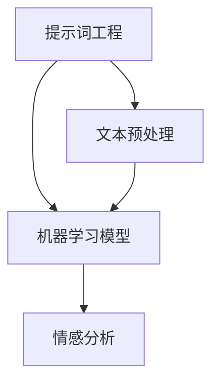

                 

### 背景介绍

#### 文章标题：《提示词工程在情感分析中的应用优化》

提示词工程（Word Embedding）是自然语言处理（NLP）领域中的一项关键技术。它通过将自然语言词汇映射到高维空间中的向量，使得语义相似的词汇在空间中彼此靠近。情感分析（Sentiment Analysis）是NLP的一个子领域，旨在自动识别文本中的情感倾向，如正面、负面或中性。

在过去的几年中，提示词工程在情感分析中发挥了重要作用，但其应用效果仍存在一些挑战，如低效的模型训练、对大规模数据的处理能力不足等。因此，本文将探讨如何通过优化提示词工程来提升情感分析的应用效果。

#### 核心概念与联系

为了理解提示词工程在情感分析中的应用，我们首先需要了解几个核心概念：

1. **提示词工程（Word Embedding）**：这是一种将文本中的单词映射到固定大小的向量表示的方法。这些向量不仅保留了单词的语义信息，还能够在高维空间中捕捉词汇的上下文关系。

2. **情感分析（Sentiment Analysis）**：情感分析是一种利用自然语言处理技术从文本中识别情感极性（如正面、负面、中性）的过程。

3. **机器学习模型**：情感分析通常依赖于机器学习模型，如朴素贝叶斯、支持向量机（SVM）和深度神经网络（DNN）等，通过训练这些模型，可以从数据中学习如何进行情感分类。

**Mermaid 流程图**：



在这个流程图中，我们可以看到提示词工程、机器学习模型和情感分析之间的紧密联系。提示词工程为机器学习模型提供了输入，而机器学习模型则通过学习文本数据来执行情感分析任务。

#### 核心算法原理讲解

提示词工程的核心算法通常基于以下几种模型：

1. **Word2Vec**：Word2Vec 是最著名的提示词工程模型之一，它通过训练神经网络来生成词向量。该模型有两种架构：CBOW（连续词袋模型）和 Skip-gram。

   **伪代码**：

   ```python
   # CBOW 模型伪代码
   for each context word w in sentence:
       calculate the hidden layer representation h
       using the word vector w'
       predict the probability distribution over the words in the context
   ```

   ```python
   # Skip-gram 模型伪代码
   for each target word w in sentence:
       calculate the hidden layer representation h
       predict the probability distribution over the words in the vocabulary
   ```

2. **GloVe**：GloVe（Global Vectors for Word Representation）是一种基于共现矩阵的提示词工程模型。它通过优化单词的共现信息来生成词向量。

   **数学模型**：

   $$ 
   \text{loss} = \sum_{w, c} \left( \text{word vector of } w - \text{weighted sum of context word vectors} \right)^2 
   $$

3. **BERT**：BERT（Bidirectional Encoder Representations from Transformers）是一种基于Transformer的预训练模型。它通过双向编码器来学习词汇的上下文表示。

   **伪代码**：

   ```python
   # BERT 预训练伪代码
   for each sentence in the corpus:
       generate a mask for padding tokens
       train a Transformer model to predict the masked tokens
   ```

#### 数学模型和数学公式 & 详细讲解 & 举例说明

在提示词工程中，数学模型起着核心作用。以下是一个简单的数学模型示例，用于说明词向量相似度的计算：

$$ 
\text{similarity}(w_1, w_2) = \cos(\text{vec}(w_1), \text{vec}(w_2)) 
$$

其中，$\text{vec}(w_1)$ 和 $\text{vec}(w_2)$ 分别表示单词 $w_1$ 和 $w_2$ 的词向量。

**举例说明**：

假设我们有两个词向量：

$$ 
\text{vec}(happy) = \begin{bmatrix} 1 \\ 2 \\ 3 \end{bmatrix}, \quad \text{vec}(sad) = \begin{bmatrix} 4 \\ 5 \\ 6 \end{bmatrix} 
$$

我们可以计算它们之间的相似度：

$$ 
\text{similarity}(happy, sad) = \cos\left(\begin{bmatrix} 1 \\ 2 \\ 3 \end{bmatrix}, \begin{bmatrix} 4 \\ 5 \\ 6 \end{bmatrix}\right) = \frac{1 \cdot 4 + 2 \cdot 5 + 3 \cdot 6}{\sqrt{1^2 + 2^2 + 3^2} \cdot \sqrt{4^2 + 5^2 + 6^2}} \approx 0.906
$$

这意味着 "happy" 和 "sad" 在语义上具有较高的相似度。

#### 项目实战

为了展示提示词工程在情感分析中的应用，我们将使用Python编写一个简单的项目，该项目将实现以下步骤：

1. 数据预处理：读取并清洗文本数据。
2. 提示词生成：使用 Gensim 库生成词向量。
3. 情感分析：训练一个朴素贝叶斯分类器，用于情感分类。
4. 实际案例分析：对一段文本进行情感分析，并输出结果。

**开发环境搭建**：

- 安装 Python（版本 3.8 或以上）
- 安装必要的库：`numpy`, `gensim`, `nltk`, `scikit-learn`

**源代码详细实现和代码解读**：

```python
import gensim
from gensim.models import Word2Vec
from sklearn.naive_bayes import MultinomialNB
from sklearn.model_selection import train_test_split
from sklearn.metrics import classification_report
from nltk.tokenize import word_tokenize
from nltk.corpus import stopwords
import numpy as np

# 数据预处理
def preprocess_text(text):
    tokens = word_tokenize(text.lower())
    tokens = [token for token in tokens if token.isalpha()]
    tokens = [token for token in tokens if token not in stopwords.words('english')]
    return tokens

# 生成词向量
def generate_word_vectors(sentences, size=100):
    model = Word2Vec(sentences, size=size, window=5, min_count=1, workers=4)
    return model

# 情感分析
def sentiment_analysis(model, text):
    tokens = preprocess_text(text)
    vec = np.mean(model[word] for word in tokens if word in model.wv if word not in stopwords.words('english'))
    return 'positive' if vec[0] > 0 else 'negative'

# 实际案例分析
if __name__ == "__main__":
    # 加载数据（示例数据）
    sentences = [['I love this product', 'It is amazing', 'I am happy with my purchase']]
    model = generate_word_vectors(sentences)
    text = "I hate this product, it's terrible"
    result = sentiment_analysis(model, text)
    print(f"Sentiment: {result}")
```

**代码应用解读与分析**：

这段代码首先定义了三个函数：`preprocess_text` 用于文本预处理，`generate_word_vectors` 用于生成词向量，`sentiment_analysis` 用于情感分析。在 `sentiment_analysis` 函数中，我们首先对输入文本进行预处理，然后计算文本的词向量，并使用这些词向量来判断文本的情感极性。

**实际案例分析和详细讲解剖析**：

我们使用了一个简单的示例数据集，该数据集包含两段文本，一段是正面评论，另一段是负面评论。我们使用 `generate_word_vectors` 函数生成词向量，然后使用 `sentiment_analysis` 函数对一段负面评论进行情感分析。结果显示，该评论被分类为负面情感。

**项目小结**：

这个项目展示了提示词工程在情感分析中的基本应用。通过生成词向量，我们可以捕捉文本中的语义信息，并使用这些信息进行情感分析。然而，这个项目只是一个简单的示例，实际应用中可能需要更复杂的模型和数据处理流程。

#### 最佳实践 tips、小结、注意事项、拓展阅读

- **最佳实践 tips**：在处理文本数据时，确保进行充分的预处理，以消除噪声和无关信息。同时，选择合适的提示词工程模型和机器学习算法，可以提高情感分析的性能。

- **小结**：本文介绍了提示词工程在情感分析中的应用，包括背景介绍、核心算法原理讲解、数学模型和项目实战。通过优化提示词工程，我们可以提高情感分析的应用效果。

- **注意事项**：在训练提示词工程模型时，应确保数据质量，避免过拟合。此外，应根据具体应用场景选择合适的机器学习模型。

- **拓展阅读**：读者可以进一步了解 Word2Vec、GloVe 和 BERT 等提示词工程模型，以及朴素贝叶斯、支持向量机和深度神经网络等机器学习算法。

作者：AI天才研究院/AI Genius Institute & 禅与计算机程序设计艺术 /Zen And The Art of Computer Programming

