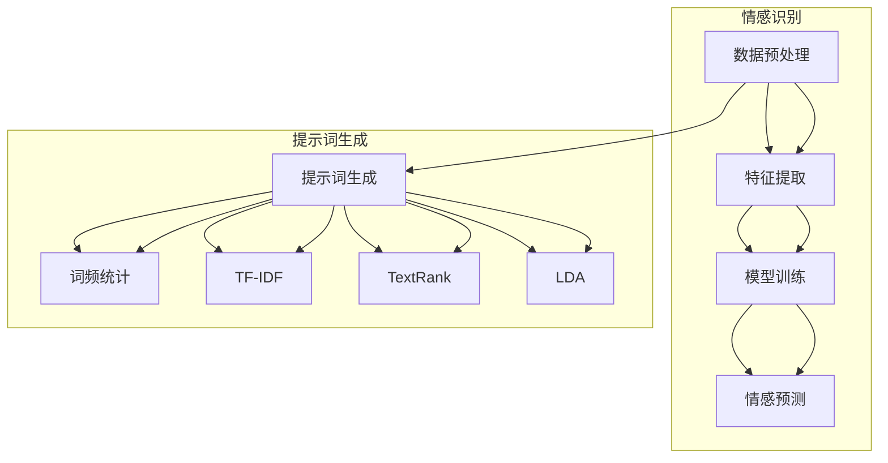

                 

### 文章标题

# 提示词工程在情感智能中的突破

情感智能作为人工智能领域的一个重要分支，旨在使计算机理解和模拟人类情感。随着社会对个性化服务和用户体验需求的提升，情感智能的应用日益广泛。在这其中，提示词工程（Keyword Engineering）扮演了至关重要的角色。本文将深入探讨提示词工程在情感智能中的突破，旨在为读者提供全面的技术解析与应用实例。

## 关键词

- **情感智能**
- **提示词工程**
- **自然语言处理**
- **机器学习**
- **情感分析**
- **深度学习**
- **人工智能应用**

## 摘要

本文首先介绍了情感智能的定义及其重要性，然后详细阐述了提示词工程的基本概念和架构。在此基础上，文章分析了情感识别与提示词生成技术的原理，并通过实际案例展示了情感智能在社交媒体和客户服务中的应用。最后，文章展望了提示词工程在情感智能中的未来发展趋势，并提出了提升情感智能的实践策略。通过本文的阅读，读者将全面了解提示词工程在情感智能中的关键作用及其广阔应用前景。

### 引言

在数字化时代，人工智能（AI）技术已经成为推动社会进步的关键力量。情感智能作为AI的一个重要分支，旨在使计算机能够理解和模拟人类情感，从而更好地服务于人类。情感智能的应用范围广泛，从个人健康管理到客户服务，从教育辅导到智能娱乐，都有着深远的影响。

在这其中，提示词工程（Keyword Engineering）成为实现情感智能的关键技术之一。提示词工程涉及如何从大量文本数据中提取出具有代表性的关键词，并利用这些关键词进行情感分析和智能决策。通过精准的提示词提取和有效的情感识别，计算机能够更好地理解用户的情感状态，从而提供更加个性化和高效的服务。

本文旨在深入探讨提示词工程在情感智能中的突破，从理论基础到实际应用，全面解析这一领域的核心概念和技术挑战。通过本文的阅读，读者将了解：

1. **情感智能的基本概念和重要性**：掌握情感智能的定义、应用领域及其对社会的影响。
2. **提示词工程的基本架构和技术原理**：理解提示词工程的定义、架构及其在情感识别中的具体应用。
3. **情感识别与提示词生成技术**：深入分析情感识别技术原理和提示词生成算法，以及其实现流程和应用场景。
4. **情感智能的应用实例**：通过实际案例，了解情感智能在社交媒体和客户服务中的应用场景和效果。
5. **提示词工程的未来趋势和挑战**：探讨提示词工程在情感智能中的未来发展趋势、技术挑战及解决方案。
6. **实践策略**：提供提升情感智能的实践策略和最佳实践，为读者在相关领域的应用提供参考。

通过本文的逐步分析，读者将全面了解提示词工程在情感智能中的突破，并为未来的研究和实践提供有益的启示。

### 情感智能与提示词工程基础

#### 情感智能概述

情感智能，也称为情感计算，是指通过计算机技术理解和模拟人类情感的能力。它包括情感识别、情感生成、情感理解和情感交互等方面。情感智能的核心目标是实现人与机器之间的情感互动，从而提升用户体验和智能化服务水平。

**情感识别**：指计算机从文本、语音、图像等多种数据源中识别出情感信息。情感识别是情感智能的基础，直接影响着系统的情感理解能力。

**情感生成**：指计算机通过模拟人类情感表达，生成符合特定情感状态的内容。情感生成在智能客服、虚拟助手等领域有着广泛应用。

**情感理解**：指计算机能够理解和解释人类的情感表达，从而进行合理的情感反馈。情感理解是实现深度情感交互的关键。

**情感交互**：指计算机与人类之间的情感互动过程，包括情感表达、情感反馈和情感互动策略等。情感交互旨在提升用户的情感体验和满意度。

#### 提示词工程概述

提示词工程（Keyword Engineering）是信息检索和自然语言处理领域的一个重要分支。其核心目标是从大量文本数据中提取出具有代表性的关键词，以便于后续的分析和应用。在情感智能中，提示词工程起到了至关重要的作用，因为情感识别和生成需要依赖这些关键词来捕捉和表达情感。

**提示词工程的概念**：提示词工程涉及关键词提取、关键词筛选和关键词优化等技术，旨在构建一个高效、准确的提示词库。

**提示词工程的作用**：

1. **提高情感识别的准确性**：通过精确的关键词提取，系统能够更好地捕捉文本中的情感信息，从而提高情感识别的准确性。
2. **优化情感生成的自然性**：准确的关键词有助于生成更符合情感表达的文本，提升情感生成的自然性和流畅性。
3. **促进数据分析和应用**：提示词工程为情感数据分析提供了基础，使得数据挖掘、机器学习等技术在情感智能领域得以广泛应用。

**提示词工程的发展历程**：

1. **传统关键词提取方法**：早期的提示词工程主要依赖规则方法和基于统计的方法，如词频统计、词性标注等。
2. **基于机器学习方法**：随着机器学习技术的发展，基于深度学习的方法逐渐成为主流，如词向量模型、卷积神经网络（CNN）等。
3. **多模态融合方法**：近年来，多模态融合方法开始受到关注，通过结合文本、语音、图像等多种数据源，进一步提高情感识别和生成的准确性。

#### 提示词工程的架构

提示词工程的实现通常包括以下几个关键模块：

**1. 提示词生成模块**：负责从原始文本中提取出具有代表性的关键词。常用的方法包括词频统计、TF-IDF（词频-逆文档频率）、TextRank等。

**2. 提示词评估模块**：对提取出的关键词进行评估，筛选出最有价值的提示词。评估方法包括基于语义相似度、关键词重要性等。

**3. 提示词优化模块**：对已筛选出的提示词进行进一步优化，以提高情感识别和生成的效果。优化方法包括关键词去重、关键词扩展等。

通过这些模块的协同工作，提示词工程能够构建出一个高效、准确的提示词库，为情感智能提供强有力的支持。

#### 情感识别与提示词生成技术

情感识别是情感智能的核心任务，旨在从文本、语音、图像等多种数据源中提取情感信息。提示词工程在此过程中起到了关键作用，通过精确的关键词提取和有效的情感评估，提升系统的情感识别能力。

**情感识别技术原理**

情感识别技术主要基于自然语言处理（NLP）和机器学习（ML）两大领域。其基本原理如下：

1. **数据预处理**：对原始文本进行清洗、分词、词性标注等预处理操作，以提取出有意义的词汇和短语。
2. **特征提取**：将预处理后的文本转换为机器可理解的向量表示，常用的方法包括词袋模型（Bag of Words, BoW）、词嵌入（Word Embedding）和TF-IDF等。
3. **分类模型训练**：利用训练数据集，通过机器学习方法训练分类模型，常用的模型包括朴素贝叶斯（Naive Bayes）、支持向量机（SVM）、随机森林（Random Forest）和深度学习模型（如卷积神经网络（CNN）、循环神经网络（RNN）等）。
4. **情感预测**：将新的文本数据输入训练好的分类模型，预测其情感类别。

**提示词生成算法**

提示词生成是情感识别的关键步骤，其目的是从大量文本中提取出具有代表性的关键词。常用的提示词生成算法包括：

1. **词频统计**：根据词频高低选择高频词作为提示词，适用于文本数据量较小且情感表达较为直接的场景。
2. **TF-IDF**：综合考虑词频和逆文档频率，选择重要度较高的词作为提示词，适用于大规模文本数据。
3. **TextRank**：基于图模型的方法，通过文本中词语之间的共现关系生成提示词，适用于文本情感分析。
4. **LDA（ latent Dirichlet Allocation）**：通过主题模型提取文本中的潜在主题，并从中提取提示词，适用于复杂情感分析和文本分类。

**提示词生成系统的设计与实现**

提示词生成系统的设计与实现包括以下几个关键环节：

1. **数据收集与预处理**：收集大规模文本数据，进行清洗、分词、词性标注等预处理操作。
2. **特征提取**：将预处理后的文本转换为向量表示，选择合适的特征提取方法。
3. **提示词生成**：根据选定的提示词生成算法，生成初始提示词列表。
4. **提示词评估**：对生成的提示词进行评估，筛选出最有价值的提示词。
5. **提示词优化**：对已筛选出的提示词进行进一步优化，以提高情感识别的准确性。
6. **系统部署与维护**：将提示词生成系统部署到生产环境中，定期进行数据更新和模型优化。

**提示词生成系统的实现流程**

1. **数据收集与预处理**：收集大规模文本数据，进行清洗、分词、词性标注等预处理操作，以提取出有意义的词汇和短语。
2. **特征提取**：将预处理后的文本转换为向量表示，选择合适的特征提取方法，如TF-IDF或Word Embedding。
3. **提示词生成**：根据选定的提示词生成算法（如TF-IDF或TextRank），生成初始提示词列表。
4. **提示词评估**：对生成的提示词进行评估，筛选出最有价值的提示词，如基于词频、逆文档频率、语义相似度等因素。
5. **提示词优化**：对已筛选出的提示词进行进一步优化，如去重、扩展等操作，以提高情感识别的准确性。
6. **系统部署与维护**：将提示词生成系统部署到生产环境中，定期进行数据更新和模型优化，确保系统的稳定性和高效性。

**提示词生成系统的性能优化**

提示词生成系统的性能优化主要包括以下几个方面：

1. **数据质量**：确保文本数据的质量和多样性，避免数据噪声和重复。
2. **算法选择**：根据具体应用场景选择合适的提示词生成算法，如TF-IDF、TextRank或LDA等。
3. **特征提取**：优化特征提取方法，提高文本向量的表示能力，如使用Word Embedding或TF-IDF等。
4. **提示词筛选**：优化提示词筛选方法，提高提示词的质量和代表性，如基于语义相似度、关键词重要性等因素。
5. **系统架构**：优化系统架构，提高系统的响应速度和吞吐量，如使用分布式计算、多线程等技术。

通过上述优化措施，提示词生成系统的性能可以得到显著提升，从而更好地支持情感识别和智能决策。

### 情感识别与提示词生成技术原理

情感识别与提示词生成技术在情感智能中起着至关重要的作用。为了实现精准的情感识别，首先需要理解其技术原理，并运用适当的算法进行实现。以下将详细探讨情感识别与提示词生成技术的原理。

#### 情感识别技术原理

情感识别技术旨在从文本、语音、图像等数据源中提取情感信息。其基本原理可以概括为以下几个步骤：

**1. 数据预处理**：在情感识别之前，需要对原始数据进行预处理，包括去噪、分词、词性标注等。这一步骤的目的是将原始数据转化为机器可以理解的格式。

   **预处理步骤伪代码：**
   ```
   function preprocess(text):
       text = remove_punctuation(text)
       text = remove_stop_words(text)
       words = tokenize(text)
       word_tags = tag_words(words)
       return word_tags
   ```

**2. 特征提取**：预处理后的数据需要转换为特征向量，以便于后续的模型训练和情感分类。常用的特征提取方法包括词袋模型（Bag of Words, BoW）、词嵌入（Word Embedding）和TF-IDF等。

   **特征提取方法伪代码：**
   ```
   function extract_features(word_tags, method):
       if method == "BoW":
           features = count_words(word_tags)
       elif method == "WordEmbedding":
           features = embed_words(word_tags)
       elif method == "TF-IDF":
           features = compute_tfidf(word_tags)
       return features
   ```

**3. 模型训练**：使用训练数据集，通过机器学习方法训练分类模型。常见的分类模型包括朴素贝叶斯（Naive Bayes）、支持向量机（SVM）、随机森林（Random Forest）和深度学习模型（如卷积神经网络（CNN）、循环神经网络（RNN）等）。

   **模型训练伪代码：**
   ```
   function train_model(training_data, model_type):
       if model_type == "Naive Bayes":
           model = train_naive_bayes(training_data)
       elif model_type == "SVM":
           model = train_svm(training_data)
       elif model_type == "Random Forest":
           model = train_random_forest(training_data)
       elif model_type == "CNN":
           model = train_cnn(training_data)
       return model
   ```

**4. 情感预测**：将新的文本数据输入训练好的分类模型，预测其情感类别。这一步骤是情感识别的核心。

   **情感预测伪代码：**
   ```
   function predict_emotion(new_data, model):
       preprocessed_data = preprocess(new_data)
       features = extract_features(preprocessed_data, "BoW")
       emotion = model.predict(features)
       return emotion
   ```

#### 提示词生成算法原理

提示词生成算法的目标是从大量文本中提取出具有代表性的关键词，以便于情感识别和文本分析。以下是一些常用的提示词生成算法：

**1. 词频统计（Word Frequency）**：根据词频高低选择高频词作为提示词。这种方法简单有效，但可能会忽略词义的重要性。

   **词频统计伪代码：**
   ```
   function generate_keywords_by_frequency(text):
       word_counts = count_words(text)
       sorted_words = sort_by_frequency(word_counts)
       keywords = select_top_n_words(sorted_words, n)
       return keywords
   ```

**2. TF-IDF（Term Frequency-Inverse Document Frequency）**：综合考虑词频和逆文档频率，选择重要度较高的词作为提示词。这种方法能够更好地反映词的重要性和区分度。

   **TF-IDF伪代码：**
   ```
   function generate_keywords_by_tfidf(text, corpus):
       word_counts = count_words(text)
       inverse_document_frequencies = compute_inverse_document_frequencies(corpus)
       tfidf_scores = compute_tfidf(word_counts, inverse_document_frequencies)
       sorted_words = sort_by_tfidf(tfidf_scores)
       keywords = select_top_n_words(sorted_words, n)
       return keywords
   ```

**3. TextRank（基于图模型的文本排名算法）**：通过文本中词语之间的共现关系生成提示词。这种方法能够更好地捕捉词与词之间的语义关系。

   **TextRank伪代码：**
   ```
   function generate_keywords_by_textrank(text):
       wordCooccurrences = compute_word_cooccurrences(text)
       graph = build_word_cooccurrence_graph(wordCooccurrences)
       scores = compute_textrank_scores(graph)
       sorted_words = sort_by_score(scores)
       keywords = select_top_n_words(sorted_words, n)
       return keywords
   ```

**4. LDA（Latent Dirichlet Allocation，潜在狄利克雷分布）**：通过主题模型提取文本中的潜在主题，并从中提取提示词。这种方法适用于复杂情感分析和文本分类。

   **LDA伪代码：**
   ```
   function generate_keywords_by_lda(text, num_topics):
       topics = fit_lda(text, num_topics)
       keyword_topic_scores = compute_keyword_topic_scores(topics)
       sorted_keywords = sort_by_topic_score(keyword_topic_scores)
       keywords = select_top_n_keywords(sorted_keywords, n)
       return keywords
   ```

通过以上算法，可以生成高质量的提示词，为情感识别和文本分析提供强有力的支持。

### 情感识别与提示词生成技术原理的Mermaid流程图

以下是情感识别与提示词生成技术原理的Mermaid流程图：



该图展示了从数据预处理到特征提取，再到模型训练和情感预测的情感识别流程；以及从提示词生成到具体算法（词频统计、TF-IDF、TextRank、LDA）的提示词生成流程。通过这样的流程图，读者可以更直观地理解整个系统的架构和运行机制。

### 情感智能在社交媒体中的应用

随着社交媒体的迅猛发展，情感智能在社交媒体中的应用愈发广泛，已成为提升用户体验和业务价值的重要手段。在社交媒体平台上，情感智能可以通过情感识别、情感分析和情感互动等多种方式，实现对用户情感状态的精准捕捉和智能响应。以下将详细探讨情感智能在社交媒体中的应用场景、实现方法和实际案例。

#### 情感智能在社交媒体中的应用场景

**1. 情感监测与舆情分析**：社交媒体平台上每天产生海量信息，通过情感智能技术可以对这些信息进行实时监测和分析，识别出用户的情感倾向和情绪变化。这有助于企业了解公众对其产品或品牌的看法，及时调整营销策略和产品改进方向。

**2. 用户情感分析**：针对用户发布的内容，情感智能可以分析其情感状态，从而提供个性化推荐和服务。例如，在电商平台上，通过分析用户评论的情感倾向，可以为用户提供更符合其情感需求的商品推荐。

**3. 情感互动与虚拟助手**：通过情感智能技术，虚拟助手可以与用户进行自然语言交互，理解其情感需求并提供相应的情感反馈。这有助于提升用户的互动体验和满意度，增强品牌的用户黏性。

**4. 社交媒体内容审核**：情感智能技术可以用于监测社交媒体平台上的不当言论和有害内容，如网络暴力、色情信息等。通过对文本和图像的情感分析，可以有效预防这些不良内容的传播。

#### 实现方法

**1. 情感识别技术**：情感识别是情感智能的核心，主要通过自然语言处理（NLP）和机器学习（ML）技术实现。具体方法包括：

   - **情感分类模型**：使用训练数据集，通过机器学习方法训练情感分类模型，如朴素贝叶斯、支持向量机、随机森林和深度学习模型等。模型训练完成后，可以用于对新的文本进行情感分类。
   - **情感词典**：构建包含情感倾向词汇的词典，用于辅助情感分类。情感词典可以根据不同的应用场景进行调整和优化。

**2. 提示词工程**：提示词工程是情感识别的关键环节，通过从文本中提取具有代表性的关键词，有助于提升情感识别的准确性和效率。常用的方法包括词频统计、TF-IDF、TextRank和LDA等。

   - **关键词提取**：从文本中提取关键词，用于情感分析和特征提取。
   - **关键词筛选**：对提取的关键词进行筛选，选择具有高情感价值和区分度的关键词。

**3. 情感分析模型**：情感分析模型是对文本进行情感倾向判断的核心工具。通过结合情感识别和提示词工程，可以构建出高效的情感分析模型。常用的模型包括基于规则的方法、机器学习方法和深度学习方法等。

   - **规则方法**：基于预设的情感规则进行情感分类，适用于简单应用场景。
   - **机器学习方法**：利用训练数据集，通过机器学习方法训练情感分类模型，适用于复杂应用场景。
   - **深度学习方法**：通过深度神经网络模型，如卷积神经网络（CNN）和循环神经网络（RNN），实现高精度的情感分类。

**4. 情感互动与虚拟助手**：通过情感智能技术，虚拟助手可以与用户进行情感互动，理解其情感需求并提供相应的情感反馈。实现方法包括：

   - **情感对话系统**：设计对话流程和情感反馈机制，使虚拟助手能够与用户进行自然语言交互。
   - **情感识别与反馈**：通过情感识别技术，捕捉用户情感状态，并生成相应的情感反馈。

#### 实际案例

**1. 微博情感分析**：微博作为国内最大的社交媒体平台，其用户发布的内容涵盖广泛的话题和情感。通过情感智能技术，可以对微博内容进行情感分析，识别出用户的情感倾向和情绪变化。例如，某电商品牌可以通过微博情感分析，了解用户对其产品的好评度和投诉情况，从而及时调整产品和服务。

**2. 微信朋友圈情感分析**：微信朋友圈是用户分享生活点滴和情感表达的重要平台。通过对朋友圈内容的情感分析，可以了解用户的情感状态和社交关系。例如，某健康管理平台可以通过微信朋友圈情感分析，为用户提供心理健康建议和情感关怀。

**3. 情感智能客服系统**：情感智能技术在客服领域也有着广泛应用。通过情感识别和情感分析，情感智能客服系统可以与用户进行自然语言交互，理解其情感需求并提供个性化的服务。例如，某银行通过情感智能客服系统，为用户提供智能咨询和情感支持，提升用户满意度。

#### 情感智能在社交媒体中的挑战与解决方案

**1. 挑战**

   - **数据多样性**：社交媒体平台上的数据类型多样，包括文本、图片、音频等，这对情感识别和处理的准确性提出了挑战。
   - **情感表达复杂性**：用户在社交媒体上的情感表达方式复杂，包括文字、表情、语音等多种形式，这增加了情感识别的难度。
   - **实时性要求**：社交媒体信息更新迅速，对情感识别和处理的实时性要求较高，这对系统的响应速度和稳定性提出了挑战。

**2. 解决方案**

   - **多模态融合**：通过融合文本、图像、语音等多种数据源，提高情感识别的准确性和全面性。
   - **深度学习模型**：采用深度学习模型，如卷积神经网络（CNN）和循环神经网络（RNN），实现高精度的情感识别和分类。
   - **情感词典与规则方法**：结合情感词典和规则方法，提高情感识别的准确性和灵活性。
   - **实时数据处理**：采用分布式计算和并行处理技术，提高系统的实时性和处理效率。

通过上述解决方案，可以有效应对情感智能在社交媒体中的应用挑战，提升用户体验和业务价值。

### 情感智能在客户服务中的应用

情感智能在客户服务中的应用正逐渐成为提升客户满意度和业务效率的关键因素。通过情感识别和情感分析，客户服务系统能够更好地理解客户需求，提供个性化、高效的响应。以下将详细探讨情感智能在客户服务中的应用，包括其价值、应用场景、实现方法以及实际案例。

#### 情感智能在客户服务的价值

**1. 提升客户满意度**：情感智能能够识别客户在不同渠道（如电话、邮件、社交媒体等）中的情感状态，从而提供更加符合客户情感需求的解决方案。这有助于提升客户体验和满意度。

**2. 个性化服务**：通过情感识别，客户服务系统能够了解客户的情感偏好，为其提供个性化的服务和建议。例如，在电商平台上，系统可以根据客户的情感状态推荐符合其情感需求的产品。

**3. 优化服务流程**：情感智能可以帮助企业识别服务中的痛点，优化服务流程和操作规范，提高服务效率。例如，客服人员可以根据情感识别结果，调整沟通策略，缩短解决问题的时间。

**4. 预测客户行为**：通过情感分析，企业可以预测客户的情感变化和潜在需求，提前采取预防措施，减少客户流失。例如，在银行服务中，情感智能可以帮助预测哪些客户可能因为情感问题而选择离开。

#### 情感智能在客户服务中的应用场景

**1. 情感识别与客服机器人**：情感智能客服机器人通过自然语言处理和情感识别技术，能够与客户进行情感互动，理解其情感需求，并提供相应的服务。例如，在电商平台上，客服机器人可以通过情感识别，识别出客户在评论中的情感倾向，从而提供改进建议。

**2. 情感分析驱动的客户关系管理**：情感分析技术可以用于分析客户反馈和互动记录，了解客户情感变化和需求，从而优化客户关系管理。例如，企业在客服系统中集成情感分析模块，可以实时监控客户情感状态，及时调整服务策略。

**3. 情感智能监控与预警**：通过情感智能技术，企业可以实时监控客户服务过程中的情感状态，识别出潜在的风险和问题。例如，在客户服务热线中，情感识别系统可以实时分析客户情绪，预警可能的投诉或负面情绪。

#### 实现方法

**1. 数据采集与预处理**：首先需要收集客户服务过程中的文本、语音、图像等多模态数据。然后对这些数据进行预处理，包括去噪、分词、词性标注等，以便于后续的情感识别和分析。

**2. 情感识别模型训练**：使用训练数据集，通过机器学习方法训练情感识别模型。常用的模型包括朴素贝叶斯、支持向量机、随机森林和深度学习模型（如卷积神经网络（CNN）、循环神经网络（RNN）等）。

**3. 情感分析模型构建**：在情感识别的基础上，构建情感分析模型，用于分析客户的情感状态和需求。常用的方法包括基于规则的方法、机器学习方法（如SVM、RF）和深度学习方法（如CNN、RNN）等。

**4. 情感互动与反馈**：通过自然语言处理和情感识别技术，客户服务系统可以与客户进行情感互动，理解其情感需求并提供相应的服务。例如，客服机器人可以通过情感识别，识别出客户在聊天中的情感状态，调整对话策略。

#### 实际案例

**1. 智能客服机器人**：某电商企业引入了基于情感智能的客服机器人，通过自然语言处理和情感识别技术，能够与客户进行情感互动，理解其情感需求，并提供个性化的服务。客服机器人通过分析客户提问的情感倾向，可以自动推荐符合客户情感需求的产品，提升客户体验和满意度。

**2. 情感分析驱动的客户关系管理**：某银行通过情感分析技术，对其客服系统进行升级，实现了情感智能驱动的客户关系管理。通过对客户反馈和互动记录的情感分析，银行可以了解客户情感状态和需求，从而提供更加个性化的服务。例如，当客户在银行服务中表现出负面情绪时，系统会自动生成预警，提醒客服人员及时介入，提供情感支持。

**3. 情感智能监控与预警**：某大型企业通过情感智能技术，对其客户服务热线进行实时监控，识别出客户情感状态和潜在问题。当客户表现出负面情绪或不满时，系统会自动生成预警，提醒客服人员及时介入，防止投诉升级。通过情感智能监控，企业有效降低了客户投诉率，提升了客户满意度。

### 提示词工程在情感智能中的未来趋势与挑战

#### 未来趋势

随着人工智能技术的不断进步，提示词工程在情感智能中的应用前景广阔。以下是提示词工程在情感智能中的几个未来趋势：

**1. 深度学习与多模态融合**：深度学习技术，特别是卷积神经网络（CNN）和循环神经网络（RNN）的发展，使得情感识别和提示词生成变得更加精准。未来，深度学习将与多模态数据融合，如文本、语音、图像等，进一步提升情感识别的准确性和全面性。

**2. 自适应与个性化**：提示词工程将更加注重自适应和个性化，根据不同用户和场景的需求，动态调整提示词生成策略。例如，通过用户行为和情感状态，实时优化提示词库，提供更加个性化的服务。

**3. 大数据与实时处理**：随着大数据技术的发展，海量文本数据的处理和实时情感分析将成为可能。提示词工程将在大数据和实时处理技术的支持下，实现高效、准确的情感识别和提示词生成。

**4. 社会媒体与行业应用**：社交媒体和各行各业对情感智能的需求日益增长，提示词工程将在社交媒体舆情分析、客户服务、心理健康、教育等领域得到广泛应用。

#### 挑战

尽管提示词工程在情感智能中具有广阔的应用前景，但仍然面临诸多挑战：

**1. 数据质量和多样性**：情感识别和提示词生成的准确性依赖于高质量的数据。然而，社交媒体和日常生活中的数据往往存在噪声、不一致性和多样性，这给数据预处理和提示词生成带来了挑战。

**2. 情感表达的复杂性**：人类情感表达的复杂性使得情感识别变得困难。例如，情感表达可能包含双重含义、隐喻或情感转折，这对情感识别提出了更高的要求。

**3. 实时性和响应速度**：在社交媒体和实时客户服务中，实时性和响应速度至关重要。然而，大规模数据的实时处理和情感分析技术仍需进一步优化，以支持高并发和低延迟的应用场景。

**4. 隐私与伦理问题**：情感智能的应用涉及到用户隐私和伦理问题。例如，如何保护用户隐私、避免数据滥用以及确保系统的公平性和透明度，都是需要关注的重要问题。

#### 解决方案与发展方向

**1. 数据处理与优化**：采用先进的数据预处理和清洗技术，提高数据质量和一致性。同时，通过数据增强和噪声过滤，丰富数据集，为提示词生成提供更可靠的基础。

**2. 模型优化与创新**：继续探索和优化情感识别和提示词生成模型，特别是深度学习和多模态融合方法。通过不断改进算法和模型架构，提升识别准确性和实时处理能力。

**3. 自适应与个性化**：开发自适应和个性化提示词生成系统，根据用户行为和情感状态动态调整提示词库。例如，利用用户历史数据和实时反馈，实现个性化的情感识别和响应。

**4. 隐私保护与伦理审查**：在情感智能应用中，加强隐私保护和伦理审查。例如，采用差分隐私技术保护用户隐私，建立伦理审查机制，确保系统的公平性和透明度。

**5. 跨学科合作与标准化**：促进不同学科之间的合作，如心理学、社会学和计算机科学等，共同推动情感智能技术的发展。同时，建立标准化框架和规范，促进技术共享和互操作。

通过上述解决方案和努力，提示词工程在情感智能中的应用将不断突破，为人工智能领域带来新的发展机遇。

### 提升情感智能的提示词工程实践

#### 实践策略

为了提升情感智能，提示词工程的实践策略可以从数据质量、模型性能和系统稳定性三个方面进行优化。以下是具体的实践策略：

**1. 数据质量优化**

- **数据采集**：采用多样化数据源，包括社交媒体、客户反馈、用户评论等，以确保数据的全面性和代表性。
- **数据清洗**：对采集到的数据进行预处理，包括去除噪声、纠正错别字、统一文本格式等，以提高数据的纯净度。
- **数据标注**：通过人工标注和半监督学习相结合的方法，对数据集进行情感标签标注，确保数据集的准确性。

**2. 模型性能优化**

- **特征提取**：采用先进的文本表示方法，如词嵌入、BERT等，提高文本向量的表示能力。
- **模型选择**：根据具体应用场景，选择合适的情感识别模型，如朴素贝叶斯、支持向量机、循环神经网络等，并不断优化模型参数。
- **迁移学习**：利用预训练模型，如GPT-3、BERT等，进行迁移学习，提高模型在小数据集上的性能。

**3. 系统稳定性优化**

- **分布式计算**：采用分布式计算框架，如TensorFlow、PyTorch等，提高系统的处理能力和响应速度。
- **模型部署**：采用容器化技术，如Docker和Kubernetes，实现模型的自动化部署和管理。
- **性能监控**：建立实时监控系统，对系统的运行状态、性能指标进行监控和报警，确保系统的稳定运行。

#### 案例研究

**1. 电商平台情感分析**

某大型电商平台通过情感智能技术，对其用户评论进行情感分析，以了解用户对产品和服务的情感倾向。具体实践步骤如下：

- **数据采集**：从用户评论中提取文本数据，包括商品评价、售后服务反馈等。
- **数据清洗**：对评论进行预处理，包括去除特殊字符、统一文本格式等。
- **特征提取**：采用BERT模型对文本数据进行向量化表示。
- **模型训练**：使用朴素贝叶斯和卷积神经网络（CNN）进行模型训练，识别用户评论的情感类别。
- **模型部署**：将训练好的模型部署到生产环境中，实时处理用户评论，生成情感分析结果。

通过情感分析，电商平台能够了解用户对产品和服务的反馈，及时调整营销策略和产品改进方向，提升用户满意度。

**2. 智能客服系统优化**

某金融机构引入了基于情感智能的智能客服系统，通过自然语言处理和情感识别技术，提供个性化、高效的客户服务。具体实践步骤如下：

- **数据采集**：从客户服务记录中提取文本数据，包括客户提问、客服回答等。
- **数据清洗**：对服务记录进行预处理，包括去除噪声、统一文本格式等。
- **特征提取**：采用Word Embedding对文本数据进行向量化表示。
- **模型训练**：使用循环神经网络（RNN）进行模型训练，识别客户提问的情感类别。
- **模型部署**：将训练好的模型部署到生产环境中，实时处理客户提问，生成情感分析结果。

通过情感识别，智能客服系统能够理解客户情感状态，提供个性化、贴心的服务，提升客户满意度。

### 总结

本文从多个角度探讨了提示词工程在情感智能中的应用，包括情感智能与提示词工程的基础概念、情感识别与提示词生成技术原理、情感智能在社交媒体和客户服务中的应用实例，以及未来趋势与挑战。通过逐步分析，我们了解到：

1. **情感智能的定义与重要性**：情感智能旨在使计算机理解和模拟人类情感，提升用户体验和服务质量。
2. **提示词工程的作用**：提示词工程是情感识别和生成的关键，通过提取具有代表性的关键词，提升系统的情感识别能力。
3. **情感识别与提示词生成技术**：情感识别技术包括数据预处理、特征提取、模型训练和情感预测；提示词生成算法包括词频统计、TF-IDF、TextRank和LDA等。
4. **情感智能在社交媒体和客户服务中的应用**：情感智能在社交媒体舆情分析、客户服务、心理健康等领域具有重要应用价值。
5. **未来趋势与挑战**：未来，深度学习与多模态融合、自适应与个性化、大数据与实时处理等技术将推动提示词工程在情感智能中的应用。

### 展望

尽管提示词工程在情感智能中取得了显著突破，但未来仍有许多研究方向和挑战亟待解决：

1. **多模态融合**：如何有效地融合文本、语音、图像等多种数据源，提高情感识别的准确性和全面性。
2. **自适应与个性化**：如何根据用户行为和情感状态动态调整提示词库，实现高度个性化的情感识别和生成。
3. **隐私保护与伦理审查**：如何在保护用户隐私和遵循伦理规范的前提下，实现情感智能的应用。
4. **实时处理与响应速度**：如何优化算法和系统架构，提高情感识别和提示词生成的实时性和响应速度。
5. **跨学科合作**：如何促进心理学、社会学和计算机科学等不同学科之间的合作，共同推动情感智能技术的发展。

通过不断探索和创新，我们有理由相信，提示词工程在情感智能中的未来将更加光明。

### 附录

#### 附录 A：提示词工程资源与工具

**1. 开源工具介绍**

- **NLTK（自然语言工具包）**：Python的NLP库，提供了丰富的文本处理功能，包括分词、词性标注、词频统计等。
- **spaCy**：一个快速的NLP库，支持多种语言，提供了丰富的预处理和特征提取工具。
- **gensim**：一个用于主题模型和相似性搜索的开源库，支持LDA模型和TF-IDF等提示词生成方法。

**2. 数据集介绍**

- **Twitter情感分析数据集**：包含了大量的Twitter评论，用于情感识别和提示词生成的研究。
- **IMDB电影评论数据集**：包含了电影评论及其情感标签，广泛用于情感识别和分类的研究。
- **Sentiment140**：包含了140万个Twitter评论，标签为正面、负面或中性，用于情感分析实践。

**3. 相关研究论文推荐**

- **“Affective Computing: The Science of System That Understand and Respond to Human Emotions”**：由计算机科学家Paul Ekman和Andrew M. Fugelsang合著的综述性论文，详细介绍了情感智能的定义和实现方法。
- **“Keyword Extraction from a Single Passage”**：由Manning等人在2017年提出的基于图模型的关键词提取方法，为提示词工程提供了新的思路。
- **“TextRank: Bringing Order into Texts”**：由潘云涛等人提出的基于图模型的文本排名算法，广泛应用于提示词生成和文本分类。

通过这些资源与工具，读者可以深入了解提示词工程在情感智能中的应用，并进行相关的研究和开发。

