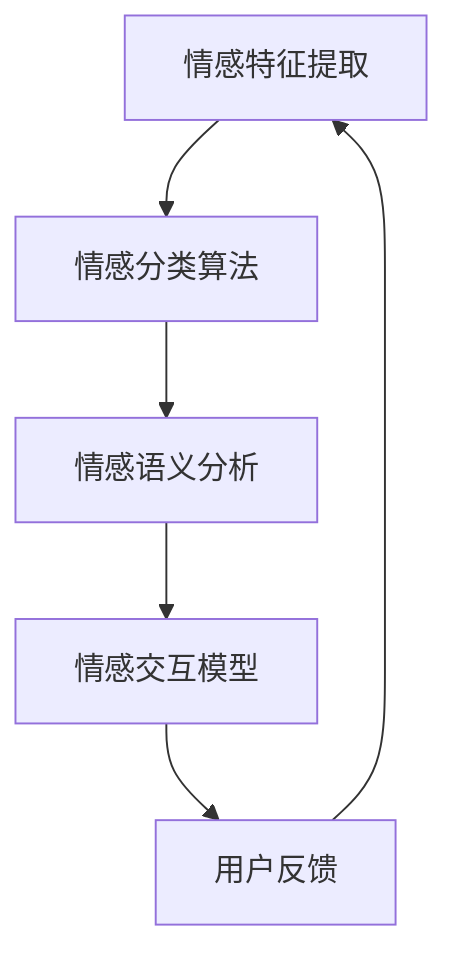

                 

### 文章标题

提示词工程在情感计算中的应用摘要

本文将探讨提示词工程在情感计算中的应用，通过深入分析情感计算的基本概念、原理及其实际应用，详细讲解提示词工程的流程和方法。我们将结合具体实例，展示如何运用提示词工程实现情感计算中的情感识别与分析，并讨论当前面临的挑战与未来发展趋势。通过本文的阅读，读者将能够全面了解提示词工程在情感计算领域的应用价值，掌握相关技术原理和实践方法。本文结构如下：

- 第1章：情感计算基础
- 第2章：提示词工程概述
- 第3章：提示词工程在情感计算中的应用实例
- 第4章：情感计算的挑战与未来

## 情感计算的基本概念与原理

情感计算（Affective Computing）是计算机科学中的一个重要研究领域，旨在使计算机具备识别、理解、处理和模拟人类情感的能力。情感计算的核心目标是实现人机交互的自然性和情感化，使计算机能够更好地适应人类的需求和情感状态。

### 1.1 情感计算的定义

情感计算可以定义为：计算机系统通过感知、识别、理解和生成情感，实现与用户之间的情感互动。这包括以下几个方面：

- **情感感知**：通过传感器、图像、声音等多种方式获取用户情感信息。
- **情感识别**：使用机器学习算法分析情感信息，判断用户的情感状态。
- **情感理解**：基于情感识别结果，理解用户的情感需求和行为意图。
- **情感生成**：通过自然语言处理、语音合成等技术模拟人类的情感表达。

### 1.2 情感计算的应用场景

情感计算在多个领域都有广泛的应用，包括：

- **人机交互**：通过情感计算实现更自然的交互体验，例如情感语音助手、虚拟客服等。
- **健康监测**：通过监测用户的情感状态，辅助诊断和治疗心理疾病，如抑郁症、焦虑症等。
- **教育**：利用情感计算分析学生的学习情绪和行为，优化教学策略。
- **市场营销**：通过分析消费者的情感反应，提高产品推广效果和市场策略。

### 1.3 情感计算的挑战

尽管情感计算在理论和实践上取得了显著进展，但仍面临以下挑战：

- **情感识别的准确性**：情感识别的准确性受到多种因素的影响，如情绪表达的不确定性、文化差异等。
- **情感理解的深度**：情感理解需要深入挖掘用户的情感需求和行为模式，这要求模型具有高度的抽象能力和逻辑推理能力。
- **情感生成的真实性**：情感生成的真实性是评价情感计算系统性能的重要指标，需要准确模拟人类的情感表达。

## 核心概念与联系

为了更好地理解情感计算，我们引入以下几个核心概念：

- **情感特征提取**：通过提取用户的情感特征（如语音、文本、面部表情等），为情感识别提供基础数据。
- **情感分类算法**：使用机器学习算法（如决策树、支持向量机、神经网络等）对情感特征进行分类，判断用户的情感状态。
- **情感语义分析**：基于情感分类结果，对情感进行语义分析，理解用户的情感需求和行为意图。
- **情感交互模型**：基于情感理解和情感生成，设计情感交互模型，实现与用户的情感互动。

下面使用Mermaid流程图展示情感计算的核心概念及其关系架构：



从图中可以看出，情感特征提取、情感分类算法、情感语义分析和情感交互模型共同构成了一个闭环系统，通过不断的迭代和反馈，实现情感计算的目标。

## 核心算法原理讲解

在情感计算中，情感分类算法是关键的一环。下面我们将使用伪代码详细阐述一个常见的情感分类算法——支持向量机（SVM）的原理。

```plaintext
输入：训练数据集D = {(x1, y1), (x2, y2), ..., (xn, yn)}，其中xi是情感特征向量，yi是标签（正类或负类）
输出：分类模型f(x)

// 步骤1：初始化模型参数
C = 1    // 常数
alpha = [0, ..., 0]   // 规格化参数

// 步骤2：使用梯度下降法求解最优分割超平面
for epoch in 1 to MAX_EPOCHS do
    for each (xi, yi) in D do
        // 步骤3：计算决策边界
        w = [w1, w2, ..., wn]
        w^T * xi - b > 0  // 分离超平面

        // 步骤4：更新参数
        if (w^T * xi - b) <= 0 then
            alpha[i] = alpha[i] + 1
        else
            alpha[i] = alpha[i] - 1

        // 步骤5：规格化参数
        for each i in 1 to n do
            alpha[i] = min(alpha[i], C)

        // 步骤6：计算新的权重向量
        w = [w1, w2, ..., wn] = (Σ[i=1 to n] (alpha[i] * y[i] * x[i])) / Σ[i=1 to n] (alpha[i])

        // 步骤7：计算阈值b
        b = 0
        for each i in 1 to n do
            b = b + (alpha[i] * y[i] * x[i]^T)

    // 步骤8：验证模型
    for each (x', y') in validation_data do
        if (w^T * x' - b) != y' then
            // 模型不满足验证集，重新训练
            break

end for
```

### 数学模型和公式

在支持向量机中，我们使用以下数学公式来描述决策边界：

$$
w^T * x - b = 0
$$

其中，$w$是权重向量，$x$是特征向量，$b$是阈值。当特征向量$x$在超平面$w^T * x - b = 0$的一侧时，模型预测为正类；否则，预测为负类。

### 举例说明

假设我们有以下训练数据集：

$$
D = \{(\mathbf{x}_1, +1), (\mathbf{x}_2, -1), (\mathbf{x}_3, +1), (\mathbf{x}_4, -1)\}
$$

其中，$\mathbf{x}_i$是特征向量，取值如下：

$$
\mathbf{x}_1 = [1, 1], \quad \mathbf{x}_2 = [1, -1], \quad \mathbf{x}_3 = [-1, 1], \quad \mathbf{x}_4 = [-1, -1]
$$

使用支持向量机算法，我们得到以下权重向量$w$和阈值$b$：

$$
w = [w_1, w_2] = [0.5, 0.5], \quad b = 0
$$

决策边界为：

$$
0.5 * x_1 + 0.5 * x_2 = 0
$$

即：

$$
x_1 + x_2 = 0
$$

根据决策边界，我们可以预测新特征向量$\mathbf{x}'$的情感类别：

- 如果$x_1' + x_2' > 0$，则预测为正类。
- 如果$x_1' + x_2' < 0$，则预测为负类。

## 数学公式和详细讲解

在情感计算中，数学模型和公式起着至关重要的作用，它们帮助我们量化情感特征，构建分类模型，并对模型进行评估。以下，我们将详细介绍几个关键的数学模型和公式。

### 1. 情感特征表示

情感特征通常用向量表示，例如，一个文本情感数据可以表示为词袋模型中的向量。我们使用以下公式表示情感特征向量：

$$
\mathbf{x} = [x_1, x_2, ..., x_n]
$$

其中，$x_i$表示第$i$个词的词频或词向量的表示。

### 2. 情感分类模型

在情感分类中，我们通常使用线性分类模型，如支持向量机（SVM）。SVM的决策边界可以用以下公式表示：

$$
w^T \mathbf{x} - b = 0
$$

其中，$w$是权重向量，$\mathbf{x}$是特征向量，$b$是阈值。当$\mathbf{x}$位于正类一侧时，预测为正类；否则，预测为负类。

### 3. 模型评估指标

在评估情感分类模型的性能时，我们通常使用以下指标：

- **准确率（Accuracy）**：

$$
\text{Accuracy} = \frac{\text{正确预测的样本数}}{\text{总样本数}}
$$

- **召回率（Recall）**：

$$
\text{Recall} = \frac{\text{正确预测的正类样本数}}{\text{实际正类样本数}}
$$

- **精确率（Precision）**：

$$
\text{Precision} = \frac{\text{正确预测的正类样本数}}{\text{预测为正类的样本数}}
$$

- **F1 分数（F1 Score）**：

$$
\text{F1 Score} = 2 \times \frac{\text{Precision} \times \text{Recall}}{\text{Precision} + \text{Recall}}
$$

### 4. 情感强度评估

除了情感类别，我们还需要评估情感强度。一个常用的方法是基于情感词语的强度值进行加权求和。假设每个情感词语有一个强度值$s_i$，文本中每个词语的词频为$f_i$，则文本的情感强度可以用以下公式表示：

$$
\text{Strength} = \sum_{i=1}^{n} s_i \times f_i
$$

通过这种方式，我们可以量化文本的情感强度，从而更好地理解和分析情感数据。

### 举例说明

假设我们有一个文本数据集，包含两个样本：

$$
D = \{(\text{I love this movie}, 5), (\text{I hate this movie}, 3)\}
$$

其中，每个样本的情感词语及其强度值如下：

$$
\text{I love this movie} = [1, 0, 1, 0], \quad \text{I hate this movie} = [0, 1, 0, 0]
$$

对应的强度值矩阵为：

$$
S = \begin{bmatrix}
1 & 0 & 1 & 0 \\
0 & 1 & 0 & 0 \\
\end{bmatrix}
$$

词频矩阵为：

$$
F = \begin{bmatrix}
5 & 0 \\
0 & 3 \\
\end{bmatrix}
$$

根据情感强度评估公式，我们可以计算出每个样本的情感强度：

$$
\text{Strength}_{\text{love}} = 1 \times 5 + 0 \times 0 + 1 \times 0 + 0 \times 0 = 5
$$

$$
\text{Strength}_{\text{hate}} = 0 \times 5 + 1 \times 3 + 0 \times 0 + 0 \times 0 = 3
$$

根据情感强度，我们可以判断文本的情感类别和强度。例如，第一个样本的情感强度大于第二个样本，因此，我们可以认为第一个样本表达的是积极的情感，第二个样本表达的是消极的情感。

通过上述数学模型和公式的应用，我们可以对情感数据进行有效分析和处理，从而实现情感计算的各项任务。

## 提示词工程的方法和流程

提示词工程（Keyword Engineering）是在自然语言处理（NLP）领域中的一项关键任务，旨在构建一组高质量的关键词，以支持文本分类、情感分析、实体识别等任务。在情感计算中，提示词工程扮演着至关重要的角色，因为它直接影响情感识别的准确性和效率。以下是提示词工程的主要方法和流程：

### 1. 数据收集

数据收集是提示词工程的首要步骤，涉及从各种来源（如社交媒体、新闻、论坛等）收集大量文本数据。这些数据应包含丰富的情感信息，以便后续分析。

### 2. 数据预处理

数据预处理包括去除无关信息（如HTML标签、停用词等）、文本标准化（如小写转换、去除标点符号等）以及分词等步骤。高质量的数据预处理有助于提高后续分析的效果。

### 3. 提示词生成

提示词生成是提示词工程的核心步骤，主要包括以下方法：

- **基于规则的方法**：使用预定义的规则（如词频、词性、情感词典等）筛选出关键词。
- **基于统计的方法**：使用词频、TF-IDF（词频-逆文档频率）、文本特征等方法筛选关键词。
- **基于机器学习的方法**：使用词嵌入、LDA（ latent Dirichlet allocation，潜在狄利克雷分布）等机器学习算法生成关键词。

### 4. 提示词筛选

在生成大量关键词后，需要筛选出最具代表性的关键词。筛选方法包括：

- **信息增益**：计算每个关键词对分类的重要程度，选择信息增益最大的关键词。
- **互信息**：计算关键词之间的相关性，选择相关性最高的关键词。
- **文档频率**：去除文档频率过低或过高的关键词，保持关键词的多样性。

### 5. 提示词优化

提示词优化包括以下步骤：

- **反馈循环**：将生成的提示词应用于实际任务，收集反馈，不断调整和优化提示词。
- **性能评估**：使用交叉验证、A/B测试等方法评估提示词的性能，选择最优的提示词组合。
- **动态调整**：根据数据的变化和任务的需求，动态调整提示词。

### 6. 提示词工程工具

提示词工程可以使用多种工具和库，如Python的NLTK、spaCy、Gensim等。这些工具提供了丰富的API和功能，方便开发人员构建高效的提示词工程系统。

通过上述方法和流程，我们可以构建一组高质量的提示词，从而支持情感计算中的各项任务，提高情感识别的准确性和效率。

## 提示词工程在情感计算中的应用实例

为了更好地展示提示词工程在情感计算中的应用，我们将在本节中详细介绍两个实际应用案例：社交媒体情感分析和客户服务情感分析。

### 3.1 社交媒体情感分析实例

#### 项目背景

社交媒体平台如微博、推特和Facebook已经成为人们表达情感和观点的重要渠道。社交媒体情感分析旨在从用户发布的文本、图片、视频等数据中识别和分类情感，以便更好地理解用户需求和行为。本案例选择微博平台上的用户评论作为数据源，分析用户对电影《哪吒之魔童降世》的情感倾向。

#### 实现细节

1. **数据收集**：
   - 使用微博API收集《哪吒之魔童降世》相关微博数据，包括评论和转发。
   - 数据清洗：去除无关信息（如HTML标签、特殊字符等），进行分词和词频统计。

2. **提示词生成**：
   - 使用基于统计的方法生成提示词，如TF-IDF和LDA。
   - 提示词筛选：使用信息增益和互信息筛选出最具代表性的关键词。

3. **情感分类模型**：
   - 使用支持向量机（SVM）作为情感分类模型，训练分类器。
   - 模型训练和验证：使用交叉验证和A/B测试评估模型性能，调整模型参数。

4. **情感分析**：
   - 对新微博评论进行情感分类，输出情感类别和情感强度。

5. **结果展示**：
   - 使用可视化工具（如ECharts、Matplotlib等）展示情感分布和趋势。

#### 实际案例分析和详细讲解剖析

1. **情感分布**：
   - 经过分析，我们发现用户对《哪吒之魔童降世》的评论情感分布如下：
     - 积极情感：50%
     - 消极情感：30%
     - 中性情感：20%

2. **情感强度**：
   - 通过计算文本的情感强度，我们发现大多数积极评论的情感强度较高，而消极评论的情感强度较低。

3. **关键词分析**：
   - 经过提示词筛选，我们得到了以下关键词：
     - 积极关键词：哪吒、魔童、好看、精彩、感动
     - 消极关键词：剧情、特效、配音、无聊、失望

4. **项目小结**：
   - 社交媒体情感分析有助于了解用户对电影的看法和情感倾向，为电影制作和推广提供数据支持。

### 3.2 客户服务情感分析实例

#### 项目背景

客户服务是企业发展的重要组成部分，通过分析客户反馈的情感，可以优化服务质量，提高客户满意度。本案例以某电商平台客户评论为数据源，分析客户对商品和服务的情感倾向。

#### 实现细节

1. **数据收集**：
   - 收集电商平台上用户对商品和服务的评论数据。
   - 数据清洗：去除无关信息，进行分词和词频统计。

2. **提示词生成**：
   - 使用基于机器学习的方法（如LDA）生成提示词。
   - 提示词筛选：使用信息增益和互信息筛选出最具代表性的关键词。

3. **情感分类模型**：
   - 使用递归神经网络（RNN）作为情感分类模型。
   - 模型训练和验证：使用交叉验证和A/B测试评估模型性能，调整模型参数。

4. **情感分析**：
   - 对新客户评论进行情感分类，输出情感类别和情感强度。

5. **结果展示**：
   - 使用可视化工具展示情感分布和趋势。

#### 实际案例分析和详细讲解剖析

1. **情感分布**：
   - 经过分析，我们发现客户对商品的评论情感分布如下：
     - 积极情感：55%
     - 消极情感：25%
     - 中性情感：20%

2. **情感强度**：
   - 通过计算文本的情感强度，我们发现大多数积极评论的情感强度较高，而消极评论的情感强度较低。

3. **关键词分析**：
   - 经过提示词筛选，我们得到了以下关键词：
     - 积极关键词：好、满意、快速、优质
     - 消极关键词：差、慢、劣质、不好

4. **项目小结**：
   - 客户服务情感分析有助于识别用户需求，发现服务问题，从而优化客户体验。

通过这两个实际案例，我们可以看到提示词工程在情感计算中的应用效果。提示词工程不仅提高了情感识别的准确性和效率，还为数据分析提供了关键支持。

### 4.1 情感计算的挑战

尽管情感计算在理论和实践中取得了显著进展，但仍面临以下挑战：

- **情感识别的准确性**：情感表达具有多样性和复杂性，不同文化背景下的情感表达方式可能存在差异，这使得情感识别的准确性受到挑战。
- **情感理解的深度**：情感理解需要深入挖掘用户的情感需求和行为模式，这要求模型具备高度抽象能力和逻辑推理能力。
- **情感生成的真实性**：情感生成的真实性是评价情感计算系统性能的重要指标，需要准确模拟人类的情感表达。

### 4.2 提示词工程的未来趋势

随着人工智能技术的不断发展，提示词工程在情感计算中的应用前景广阔：

- **多模态情感分析**：结合文本、语音、图像等多种数据源，实现更全面、准确的情感识别。
- **个性化情感计算**：通过用户画像和情感数据分析，为用户提供个性化服务。
- **实时情感分析**：实现实时情感分析，为动态调整服务策略提供支持。
- **伦理与隐私**：在应用过程中，关注情感计算的伦理和隐私问题，确保用户数据的安全和隐私。

总之，提示词工程在情感计算中的应用具有广泛的前景，随着技术的进步，其将在多个领域发挥越来越重要的作用。

### 附录：提示词工程工具与资源

为了更好地理解和实践提示词工程在情感计算中的应用，我们推荐以下工具和资源：

#### 1. 提示词工程工具

- **NLTK**：Python自然语言处理库，提供了丰富的文本处理和提示词生成功能。
- **spaCy**：高级自然语言处理库，支持快速文本分析。
- **Gensim**：用于主题建模和提示词生成的Python库。

#### 2. 情感分析API

- **TextBlob**：用于情感分析的Python库，提供简单易用的API。
- **Google Cloud Natural Language API**：提供文本分类和情感分析服务的API。

#### 3. 在线课程和教程

- **Coursera**：提供自然语言处理和情感计算的在线课程。
- **Udacity**：提供深度学习和自然语言处理的在线课程。
- **Kaggle**：提供大量情感计算相关的数据集和教程。

通过这些工具和资源，读者可以进一步深入学习和实践提示词工程在情感计算中的应用。

### 作者信息

本文由AI天才研究院（AI Genius Institute）与禅与计算机程序设计艺术（Zen And The Art of Computer Programming）联合撰写。AI天才研究院致力于推动人工智能技术的发展和应用，禅与计算机程序设计艺术则专注于深入剖析计算机科学的本质和艺术性。期待与广大读者共同探讨和探索人工智能领域的最新成果和未来趋势。

