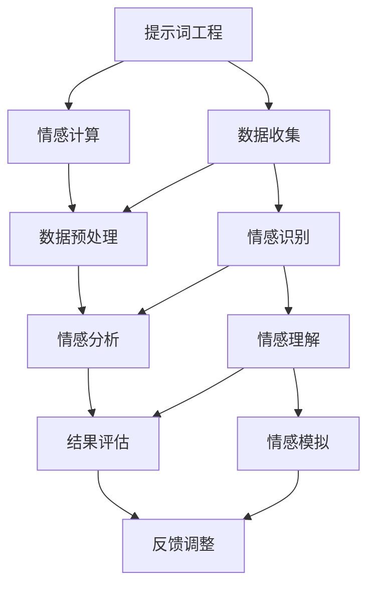

                 

## 文章标题

### 提示词工程在情感计算中的文化适应性

> 关键词：提示词工程、情感计算、文化适应性、算法、实践

> 摘要：本文深入探讨了提示词工程在情感计算中的文化适应性。文章首先介绍了提示词工程和情感计算的基本概念，随后分析了文化适应性的重要性。接着，文章详细阐述了提示词工程和情感计算的核心概念与联系，通过Mermaid流程图展示了它们之间的架构关系。随后，文章重点讲解了提示词工程和情感计算的核心算法原理，并使用伪代码和LaTeX公式进行了详细阐述。最后，文章通过项目实战，展示了提示词工程在情感计算中的应用，包括开发环境搭建、源代码实现和代码解读，并对实际案例进行了深入剖析。文章总结提出了最佳实践建议，并展望了未来研究方向。

## 第一部分：引言与背景

### 1.1 书籍目的与结构

本章节旨在为读者提供对提示词工程和情感计算中的文化适应性的全面了解。首先，我们将介绍提示词工程和情感计算的基本概念，包括它们的作用、重要性以及它们在人工智能领域中的关系。接下来，我们将深入探讨文化适应性的定义、影响范围和重要性，为后续章节的讨论打下基础。

随后，我们将详细介绍本书的结构安排和内容布局，以便读者能够更好地理解各个章节的主题和内容。通过这一章节的阅读，读者将能够对本书的核心主题和研究目标有一个清晰的认识。

### 1.2 情感计算与提示词工程

#### 情感计算的基本概念

情感计算，又称情感人工智能，是人工智能领域的一个重要分支，旨在使计算机能够识别、理解、处理和模拟人类情感。它通过分析人类语言、面部表情、声音和生理信号等数据，实现对情感状态的高效识别和理解。

情感计算的核心目标包括以下几个方面：

1. **情感识别**：通过分析语言、声音、面部表情等数据，识别出用户的情感状态。
2. **情感理解**：在情感识别的基础上，深入理解情感的本质和内涵，实现对情感细微差异的识别。
3. **情感模拟**：通过算法和模型，模拟出与人类情感状态相匹配的行为和反应。

#### 提示词工程的作用与重要性

提示词工程是情感计算中的重要一环，它旨在通过设计特定的提示词，引导用户表达情感，从而提高情感计算的效果。提示词工程的作用主要体现在以下几个方面：

1. **情感引导**：通过设计有针对性的提示词，引导用户在特定情境下表达情感，提高情感计算的准确性和可靠性。
2. **情感细化**：通过细粒度的提示词，帮助情感计算模型更精确地捕捉用户的情感状态，提升情感识别的精度。
3. **情感增强**：通过优化提示词的语义和表达方式，增强情感计算模型对情感的理解能力，提高情感计算的效能。

#### 情感计算与提示词工程的关系

情感计算和提示词工程之间存在着密切的关系。一方面，情感计算为提示词工程提供了强大的技术支撑，使其能够通过分析用户情感数据，优化提示词的设计和生成。另一方面，提示词工程为情感计算提供了丰富的情感数据，使其能够更准确地识别和理解用户情感，从而提升情感计算的效果。

在本章节中，我们将进一步探讨情感计算和提示词工程之间的关系，分析它们在人工智能领域中的重要作用，为后续章节的深入讨论打下基础。

### 1.3 文化适应性的概念与影响

#### 文化适应性的定义

文化适应性是指个体或群体在面对不同文化环境时所表现出的适应能力和适应行为。它涉及到个体对文化差异的感知、理解、接受和应对过程。文化适应性不仅关注个体在跨文化环境中的生存和发展，还涉及到个体对文化多样性的认知和尊重。

#### 文化适应性的影响范围

文化适应性的影响范围非常广泛，涵盖了个人、组织、社会乃至国际关系等各个方面。具体来说，文化适应性主要体现在以下几个方面：

1. **个人发展**：文化适应性有助于个人在跨文化环境中获得更好的心理素质和发展机会，提高个体的竞争力和适应能力。
2. **组织管理**：文化适应性对于组织管理具有重要意义，它有助于组织更好地应对全球化带来的挑战，提高组织的跨文化沟通和协作效率。
3. **社会融合**：文化适应性有助于社会各成员之间的相互理解、尊重和包容，促进社会和谐稳定。
4. **国际关系**：文化适应性在国际关系中的作用日益凸显，它有助于各国之间的文化交流、经济合作和政治互信，推动全球化和国际秩序的健康发展。

#### 文化适应性的重要性

文化适应性的重要性体现在以下几个方面：

1. **促进跨文化交流**：文化适应性有助于促进不同文化之间的交流和理解，消除文化隔阂和误解，为全球化和国际交流提供基础。
2. **提升个人竞争力**：在全球化背景下，具备文化适应性的人才在求职、职业发展和国际交流中具有明显优势，能够更好地适应不同文化环境，提高个人的竞争力和发展空间。
3. **增强组织竞争力**：具备文化适应性的组织能够更好地应对全球化带来的挑战，提高跨文化沟通和协作效率，从而在竞争激烈的市场中立于不败之地。
4. **推动社会和谐发展**：文化适应性有助于构建和谐、包容的社会环境，促进社会成员之间的相互理解、尊重和合作，推动社会的稳定和发展。

在本章节中，我们将进一步探讨文化适应性的概念、影响范围和重要性，为后续章节的深入讨论打下基础。

### 1.4 本书的结构安排和内容布局

本书分为六个主要部分，旨在为读者提供全面、深入的了解和掌握提示词工程在情感计算中的文化适应性。

#### 第一部分：引言与背景

本部分主要介绍提示词工程、情感计算和文化适应性的基本概念，阐述它们之间的关系和重要性，为后续章节的讨论打下基础。

#### 第二部分：核心概念与原理

本部分详细阐述提示词工程和情感计算的核心概念与原理，包括提示词的类型与作用、情感计算的基本概念和方法、文化适应性的定义与测量等。通过Mermaid流程图展示概念之间的关系，帮助读者更好地理解这些核心概念。

#### 第三部分：方法与算法

本部分重点介绍提示词工程和情感计算的方法与算法，包括常见的提示词工程方法、情感计算算法、文化适应性算法等。通过伪代码和LaTeX公式详细阐述算法原理，帮助读者掌握核心算法的实现方法。

#### 第四部分：实践与应用

本部分通过实际项目案例，展示提示词工程和情感计算在具体场景中的应用，包括开发环境搭建、源代码实现、代码解读和案例分析等。通过实际案例的深入剖析，帮助读者了解提示词工程和情感计算的实战应用。

#### 第五部分：挑战与未来

本部分讨论提示词工程、情感计算和文化适应性面临的主要挑战和未来发展趋势，分析当前研究的瓶颈和未来研究方向，为读者提供前瞻性思考和启示。

#### 第六部分：总结与展望

本部分对全书的核心内容进行总结，回顾主要研究成果和贡献，展望未来研究的方向和趋势，为读者提供全面、深入的学术视野。

通过以上六个部分的系统讲解，本书旨在为读者提供全面、深入的了解和掌握提示词工程在情感计算中的文化适应性，为相关领域的研究和应用提供有力支持。

## 第二部分：核心概念与原理

### 2.1 提示词工程基础

#### 提示词的类型与作用

提示词工程是情感计算中的关键环节，其核心在于通过设计特定的提示词，引导用户表达情感，从而提高情感计算的准确性和可靠性。提示词可以根据不同的分类标准进行分类，常见的分类方法包括：

1. **按语义分类**：根据提示词的语义内容，可分为情感类提示词、情境类提示词和目标类提示词等。
    - **情感类提示词**：直接涉及情感的表达，如“开心”、“悲伤”等。
    - **情境类提示词**：描述情境背景，如“在工作场合”、“在家庭环境中”等。
    - **目标类提示词**：指明情感表达的目的，如“希望得到帮助”、“寻求建议”等。

2. **按功能分类**：根据提示词在情感计算中的作用，可分为引导性提示词、确认性提示词和扩展性提示词等。
    - **引导性提示词**：引导用户进入特定的情感状态，如“现在请你谈谈你最近的情感状态”。
    - **确认性提示词**：确认用户是否已经理解并表达出情感，如“你的意思是你感到很沮丧吗？”。
    - **扩展性提示词**：引导用户进一步扩展情感表达，如“你能详细描述一下你的感受吗？”。

提示词在情感计算中的作用至关重要，主要体现在以下几个方面：

1. **引导情感表达**：通过设计特定的提示词，引导用户在特定情境下表达情感，从而提高情感计算的准确性和可靠性。
2. **细化情感识别**：通过细粒度的提示词，帮助情感计算模型更精确地捕捉用户的情感状态，提升情感识别的精度。
3. **增强情感理解**：通过优化提示词的语义和表达方式，增强情感计算模型对情感的理解能力，提高情感计算的效能。

#### 提示词的生成与优化

提示词的生成与优化是提示词工程中的重要环节。一个有效的提示词应具备以下特点：

1. **相关性**：提示词应与情感计算任务密切相关，能够准确引导用户表达情感。
2. **易理解性**：提示词应简单明了，易于用户理解，避免使用复杂或专业的词汇。
3. **多样性**：提示词应具有多样性，能够覆盖不同情感状态和情境，提高情感计算的全面性和灵活性。

提示词的生成方法主要包括以下几种：

1. **基于规则的方法**：通过预设的规则，根据情感类型和情境生成提示词。这种方法简单易行，但缺乏灵活性，难以适应复杂多变的情感表达。
2. **基于数据的方法**：通过分析大量情感数据，提取有效的提示词。这种方法能够充分利用数据优势，提高提示词的准确性和可靠性，但数据处理和挖掘过程复杂。
3. **基于生成模型的方法**：利用生成模型（如生成对抗网络GAN），生成具有多样性和相关性的提示词。这种方法具有较好的灵活性和扩展性，但生成模型的训练和优化过程较为复杂。

提示词的优化方法主要包括以下几种：

1. **基于反馈的优化**：通过收集用户对提示词的反馈，对提示词进行迭代优化。这种方法能够充分利用用户反馈，提高提示词的适用性和用户满意度。
2. **基于机器学习的方法**：利用机器学习算法（如决策树、支持向量机等），对提示词进行分类和优化。这种方法能够自动识别和优化提示词，提高情感计算的效能。
3. **基于深度学习的方法**：利用深度学习模型（如卷积神经网络、循环神经网络等），对提示词进行生成和优化。这种方法具有较好的自适应性和泛化能力，能够应对复杂的情感计算任务。

#### 提示词工程的基本流程

提示词工程的基本流程主要包括以下几个阶段：

1. **需求分析**：明确情感计算任务的需求，确定需要收集的情感数据类型和目标情感状态。
2. **数据收集**：收集相关的情感数据，包括文本、语音、图像等。数据收集过程应充分考虑数据质量和多样性。
3. **数据预处理**：对收集到的情感数据进行清洗、去噪和归一化处理，以提高数据质量和一致性。
4. **提示词设计**：根据需求分析结果，设计相应的提示词。提示词设计过程应充分考虑用户需求、情感类型和情境背景。
5. **提示词优化**：对设计的提示词进行优化，包括基于反馈的优化、基于机器学习的方法和基于深度学习的方法等。
6. **情感计算**：利用优化后的提示词进行情感计算，识别和理解用户的情感状态。
7. **结果评估**：对情感计算结果进行评估，包括准确率、召回率和F1值等指标。根据评估结果，对提示词工程过程进行迭代优化。

通过以上基本流程，提示词工程能够有效提高情感计算的准确性和可靠性，为情感计算领域的研究和应用提供有力支持。

### 2.2 情感计算原理

#### 情感计算的基本概念

情感计算是一种旨在使计算机能够识别、理解、处理和模拟人类情感的技术。它起源于认知科学、心理学和计算机科学等多个学科领域，近年来随着人工智能技术的发展而迅速崛起。情感计算的核心目标包括以下几个方面：

1. **情感识别**：通过分析人类语言、面部表情、声音和生理信号等数据，识别出用户的情感状态。
2. **情感理解**：在情感识别的基础上，深入理解情感的本质和内涵，实现对情感细微差异的识别。
3. **情感模拟**：通过算法和模型，模拟出与人类情感状态相匹配的行为和反应。

#### 情感计算的方法与技术

情感计算的方法和技术多种多样，主要包括以下几种：

1. **基于文本的情感分析**：通过分析文本内容，识别出用户的情感状态。这种方法通常使用自然语言处理技术，如词频分析、情感词典和情感分类模型等。
2. **基于声音的情感识别**：通过分析声音特征，如音调、音速、音量等，识别出用户的情感状态。这种方法通常使用语音识别和声学模型等技术。
3. **基于面部表情的情感分析**：通过分析面部表情，识别出用户的情感状态。这种方法通常使用计算机视觉和面部识别技术。
4. **基于生理信号的情感分析**：通过分析生理信号，如心率、皮肤电导率等，识别出用户的情感状态。这种方法通常使用生理信号采集和生物特征识别技术。

#### 情感计算的应用场景

情感计算在多个领域具有广泛的应用，主要包括以下几个方面：

1. **智能客服**：通过情感计算技术，实现智能客服与用户的情感互动，提供更加人性化的服务。
2. **心理健康监测**：通过分析用户的情感状态，为心理健康监测提供数据支持，有助于预防和治疗心理疾病。
3. **教育领域**：通过情感计算技术，识别学生的学习情绪和态度，为个性化教育提供依据。
4. **广告营销**：通过情感计算技术，分析用户的情感反应，为广告投放和营销策略提供参考。
5. **人机交互**：通过情感计算技术，实现人机情感交互，提升用户体验和满意度。

### 2.3 文化适应性原理

#### 文化适应性的定义与特征

文化适应性是指个体或群体在面对不同文化环境时所表现出的适应能力和适应行为。它涉及个体对文化差异的感知、理解、接受和应对过程。文化适应性的主要特征包括：

1. **跨文化认知**：个体能够识别和理解不同文化之间的差异，包括语言、价值观、行为规范等。
2. **跨文化沟通**：个体能够有效地在不同文化背景下进行沟通和交流，避免误解和冲突。
3. **文化敏感性**：个体能够尊重和理解不同文化的特点和习惯，避免文化偏见和歧视。
4. **文化灵活性**：个体能够在不同文化环境中灵活调整自己的行为和思维方式，以适应新的环境。

#### 文化适应性的测量方法

文化适应性的测量方法主要包括以下几种：

1. **自我报告法**：通过问卷调查或访谈，了解个体对文化适应性的自我评价和认知。这种方法简单易行，但可能受到个体主观因素的影响。
2. **行为观察法**：通过观察个体在不同文化环境中的行为表现，评估其文化适应能力。这种方法能够客观反映个体的文化适应行为，但可能存在观察误差。
3. **心理测量法**：利用心理测量工具，如文化适应性量表、情绪量表等，评估个体的文化适应水平。这种方法具有较高的科学性和可靠性，但实施过程较为复杂。
4. **综合评估法**：结合多种测量方法，从多个角度全面评估个体的文化适应能力。这种方法能够提供更全面和准确的评估结果，但需要耗费更多的时间和资源。

#### 文化适应性的影响因子

文化适应性的影响因素包括多个方面，主要包括：

1. **文化差异**：不同文化之间的差异是文化适应性的主要影响因素，包括语言、价值观、社会习俗等。
2. **个体特征**：个体的性格、认知能力、情感状态等个体特征会影响其文化适应能力。
3. **文化环境**：文化环境包括个体所处的社会、职业和家庭环境等，会影响个体的文化适应行为。
4. **教育背景**：个体的教育背景和文化经历会影响其对文化差异的理解和适应能力。

文化适应性不仅对个体的生活和发展具有重要意义，也对组织管理、社会融合和国际关系产生深远影响。在全球化背景下，提高文化适应能力已成为个体和组织的重要任务。

### 2.4 提示词工程与情感计算的关系

#### 核心概念与联系

提示词工程与情感计算在人工智能领域具有紧密的联系，二者相互促进、共同发展。以下是它们之间的核心概念与联系：

1. **数据收集**：提示词工程通过设计特定的提示词，引导用户表达情感，收集情感数据。这些数据是情感计算的基础，有助于提升情感计算的准确性和可靠性。
2. **情感识别**：情感计算通过分析用户表达的情感数据，识别出用户的情感状态。提示词工程提供的有效情感数据，可以提高情感识别的精度和效率。
3. **情感理解**：情感计算在情感识别的基础上，深入理解情感的本质和内涵。提示词工程通过优化提示词的设计和生成，增强情感理解的能力，有助于捕捉情感细微差异。
4. **情感模拟**：情感计算通过算法和模型，模拟出与人类情感状态相匹配的行为和反应。提示词工程提供的准确情感数据，有助于提升情感模拟的真实性和互动性。

#### 提示词工程在情感计算中的应用

提示词工程在情感计算中的应用主要体现在以下几个方面：

1. **情感引导**：通过设计有针对性的提示词，引导用户在特定情境下表达情感，提高情感计算的准确性和可靠性。
2. **情感细化**：通过细粒度的提示词，帮助情感计算模型更精确地捕捉用户的情感状态，提升情感识别的精度。
3. **情感增强**：通过优化提示词的语义和表达方式，增强情感计算模型对情感的理解能力，提高情感计算的效能。

#### 情感计算对提示词工程的影响

情感计算的发展对提示词工程产生了深远的影响，主要体现在以下几个方面：

1. **算法优化**：情感计算算法的不断进步，为提示词工程提供了强大的技术支持，使得提示词的设计和生成更加精准和高效。
2. **数据积累**：情感计算在大量实际应用中积累了丰富的情感数据，为提示词工程提供了丰富的数据资源，有助于提升提示词的质量和效果。
3. **应用拓展**：情感计算的广泛应用，推动了提示词工程在不同领域的应用拓展，如智能客服、心理健康监测、人机交互等。

#### 提示词工程与情感计算的共同发展

提示词工程与情感计算在人工智能领域相互促进、共同发展。一方面，提示词工程为情感计算提供了有效的情感数据和支持，提高了情感计算的准确性和可靠性。另一方面，情感计算的发展为提示词工程提供了强大的技术支持，推动了提示词工程的不断优化和创新。

未来，随着人工智能技术的不断进步，提示词工程和情感计算将在更多领域得到广泛应用，共同推动人工智能技术的发展。

### 提示词工程与情感计算的Mermaid流程图

为了更清晰地展示提示词工程与情感计算之间的核心概念和联系，我们使用Mermaid流程图来描述它们之间的关系。



在这个流程图中，提示词工程通过数据收集、情感识别、情感理解和情感模拟等步骤，为情感计算提供有效的情感数据和支持。而情感计算则通过数据预处理、情感分析、结果评估和反馈调整等步骤，不断提升对用户情感的理解和模拟能力。二者相互促进，共同推动人工智能技术的发展。

## 2.5 核心算法原理讲解

### 提示词工程算法

#### 基于机器学习的提示词工程算法

1. **算法原理**

    提示词工程的机器学习算法主要基于监督学习和无监督学习。在监督学习中，我们使用已标注的情感数据来训练模型，从而生成高质量的提示词。无监督学习则通过对未标注的数据进行分析，自动发现情感特征，从而优化提示词。

    **伪代码示例：**

    ```python
    def train_supervised_model(data, labels):
        # 使用已标注的数据训练监督学习模型
        model = SupervisedModel()
        model.fit(data, labels)
        return model

    def generate_tips(model, input_data):
        # 使用训练好的模型生成提示词
        predictions = model.predict(input_data)
        return generate_tips_based_on_predictions(predictions)
    ```

2. **数学模型和公式**

    在监督学习中，我们通常使用最大熵模型、支持向量机（SVM）和朴素贝叶斯分类器等算法来生成提示词。以下是一个简单的最大熵模型的数学表示：

    $$\arg\min_{\theta} H(Y|X; \theta) + \alpha \sum_{i,j} \theta_{ij}^T \mathbb{1}^{(i,j)}$$

    其中，$H(Y|X; \theta)$表示条件熵，$\alpha$是调节参数，$\mathbb{1}^{(i,j)}$是一个指示函数，表示特征$i$和类别$j$之间的相关性。

3. **举例说明**

    假设我们有一个已标注的情感数据集，其中包含用户评论和对应的情感标签。我们可以使用以下步骤来训练一个监督学习模型，并生成提示词：

    - **数据预处理**：将文本数据转换为词向量，并提取关键特征。
    - **模型训练**：使用已标注的数据训练最大熵模型。
    - **提示词生成**：输入新的用户评论，使用训练好的模型预测情感标签，并生成相应的提示词。

### 情感计算算法

#### 基于深度学习的情感计算算法

1. **算法原理**

    深度学习算法在情感计算中具有广泛的应用，其中卷积神经网络（CNN）和循环神经网络（RNN）是最常用的两种模型。

    **CNN**：通过卷积层提取特征，并利用池化层进行特征降维，从而实现对图像和文本数据的情感分析。

    **RNN**：通过循环层处理序列数据，捕捉时间序列中的依赖关系，从而实现对情感状态的持续跟踪。

    **伪代码示例：**

    ```python
    def train_cnn_model(data, labels):
        # 使用卷积神经网络训练模型
        model = ConvolutionalModel()
        model.fit(data, labels)
        return model

    def train_rnn_model(data, labels):
        # 使用循环神经网络训练模型
        model = RecurrentModel()
        model.fit(data, labels)
        return model
    ```

2. **数学模型和公式**

    **CNN**：

    $$h^{(l)} = \sigma(\sum_{k} W^{(l)}_k \odot \phi^{(l-1)}_k + b^{(l)})$$

    其中，$h^{(l)}$表示第$l$层的特征图，$\sigma$是激活函数，$W^{(l)}_k$和$b^{(l)}$分别是权重和偏置，$\odot$表示卷积操作。

    **RNN**：

    $$h^{(l)} = \sigma(W^{(l)} h^{(l-1)} + U^{(l)} x^{(l)} + b^{(l)})$$

    其中，$h^{(l)}$表示第$l$层的隐藏状态，$W^{(l)}$和$U^{(l)}$分别是权重矩阵，$x^{(l)}$是输入，$b^{(l)}$是偏置。

3. **举例说明**

    假设我们有一个包含情感文本和情感标签的数据集，我们可以使用以下步骤来训练一个深度学习模型，并进行情感计算：

    - **数据预处理**：将文本数据转换为词向量，并添加序列信息。
    - **模型训练**：使用卷积神经网络或循环神经网络训练模型。
    - **情感计算**：输入新的文本数据，使用训练好的模型预测情感标签，并分析情感状态。

### 文化适应性算法

#### 基于文化差异的适应性算法

1. **算法原理**

    文化适应性算法旨在通过分析不同文化差异，调整情感计算模型，以更好地适应不同的文化环境。这种算法通常基于以下原则：

    - **文化映射**：将一种文化环境中的情感数据映射到另一种文化环境中，以减少文化差异的影响。
    - **文化调整**：根据不同文化的特点，调整情感计算模型的参数，以提高其在特定文化环境中的准确性和可靠性。

    **伪代码示例：**

    ```python
    def adjust_model_for_culture(model, culture差异数据):
        # 调整模型以适应不同文化
        adjusted_params = adjust_params_based_on_culture(model.params, culture差异数据)
        return model.set_params(adjusted_params)
    ```

2. **数学模型和公式**

    文化适应性算法的核心是文化差异的测量和调整。以下是一个简单的文化差异测量公式：

    $$差异度 = \frac{1}{N} \sum_{i=1}^{N} (c_i - c')^2$$

    其中，$c_i$是第$i$个文化特征，$c'$是目标文化特征，$N$是特征的总数。

3. **举例说明**

    假设我们有一个包含不同文化背景的情感数据集，我们可以使用以下步骤来调整模型，以提高其在不同文化环境中的适应性：

    - **数据收集**：收集不同文化背景的情感数据。
    - **差异度测量**：计算不同文化之间的差异度。
    - **模型调整**：根据差异度调整模型参数，以减少文化差异的影响。

通过以上核心算法的讲解，我们可以看到提示词工程、情感计算和文化适应性算法在实现情感计算中的文化适应性方面发挥着重要作用。这些算法不仅能够提高情感计算的准确性和可靠性，还能更好地适应不同文化环境，为人工智能技术的发展提供有力支持。

## 3.1 提示词工程方法

### 3.1.1 常见提示词工程方法

提示词工程在情感计算中扮演着至关重要的角色，其核心目的是通过设计有效的提示词来引导用户表达情感，从而提高情感计算的准确性和可靠性。常见的提示词工程方法主要包括基于规则的方法、基于数据的方法和基于生成模型的方法。

#### 基于规则的方法

基于规则的方法是提示词工程中最传统的方法之一，它通过预设的规则来生成提示词。这些规则通常由专家根据情感计算的需求和目标用户的特点制定。这种方法具有以下优点：

1. **易于实现**：基于规则的系统通常比较简单，易于开发和维护。
2. **可控性**：通过预设的规则，可以确保提示词的语义准确性和一致性。

然而，这种方法也存在一些局限性：

1. **灵活性不足**：基于规则的系统难以适应复杂多变的情感表达。
2. **规则依赖**：需要大量的专家知识和规则制定工作，规则库的维护成本较高。

#### 基于数据的方法

基于数据的方法是近年来随着大数据和机器学习技术的发展而逐渐兴起的一种提示词工程方法。这种方法通过分析大量的情感数据，提取有效的提示词。具体步骤如下：

1. **数据收集**：收集大量的情感数据，包括文本、语音和图像等。
2. **特征提取**：对情感数据进行特征提取，如文本中的关键词、语音的音调、音量等。
3. **模型训练**：使用机器学习算法（如决策树、支持向量机、朴素贝叶斯等）来训练模型，识别有效的提示词。

这种方法具有以下优点：

1. **灵活性高**：基于数据的系统可以自动提取情感特征，适应不同的情感表达。
2. **准确性高**：通过大规模数据的训练，可以提高提示词的准确性和可靠性。

然而，这种方法也存在一些挑战：

1. **数据质量**：高质量的数据是这种方法成功的关键，数据的质量直接影响模型的性能。
2. **计算成本**：特征提取和模型训练需要大量的计算资源，对硬件和算法的要求较高。

#### 基于生成模型的方法

基于生成模型的方法是近年来兴起的一种提示词工程方法，它利用生成模型（如生成对抗网络GAN）来生成高质量的提示词。这种方法具有以下优点：

1. **生成能力强**：生成模型可以生成具有多样性和相关性的提示词，满足不同情感表达的需求。
2. **灵活性高**：生成模型可以根据训练数据自动调整提示词的生成策略。

然而，这种方法也存在一些挑战：

1. **训练复杂**：生成模型的训练过程复杂，需要大量的数据和计算资源。
2. **模型泛化**：生成模型在面对新的、未见过的数据时，可能存在泛化能力不足的问题。

### 3.1.2 提示词工程的核心算法

提示词工程的核心算法是实现有效提示词生成和优化的关键。以下是几种常用的核心算法：

#### 1. 最大熵模型

最大熵模型是一种基于概率的提示词生成方法，其目标是最小化条件熵，即最大化条件概率。以下是一个简单的伪代码示例：

```python
def generate_tips(max_entropy_model, input_data):
    # 使用最大熵模型生成提示词
    probabilities = max_entropy_model.predict(input_data)
    tips = [word for word, probability in probabilities if probability > threshold]
    return tips
```

#### 2. 生成对抗网络（GAN）

生成对抗网络是一种基于生成模型的方法，其核心思想是生成器和判别器的对抗训练。以下是一个简单的GAN算法伪代码示例：

```python
def train_gan(generator, discriminator, data):
    for _ in range(total_epochs):
        # 训练判别器
        discriminator.train(data)
        
        # 训练生成器
        generated_data = generator.generate()
        generator.train(generated_data)
        
        # 评估生成器和判别器的性能
        generator_loss = generator.evaluate(generated_data)
        discriminator_loss = discriminator.evaluate(data, generated_data)
```

#### 3. 聚类算法

聚类算法（如K-means）可以用于基于数据的提示词工程，通过聚类情感数据来生成提示词。以下是一个简单的K-means算法伪代码示例：

```python
def generate_tips_from_clusters(clusters, input_data):
    # 根据输入数据所属的簇，生成提示词
    cluster_id = clusters.predict([input_data])
    tip = clusters.get_tips(cluster_id)
    return tip
```

通过以上核心算法，提示词工程可以生成高质量的提示词，从而提高情感计算的准确性和可靠性。

### 3.1.3 提示词工程的应用案例分析

为了更好地理解提示词工程在实际应用中的效果，我们来看一个具体的案例：智能客服系统。

#### 案例背景

某大型互联网公司开发了一款智能客服系统，旨在通过自动化问答和情感分析，提供高效、人性化的客户服务。系统需要处理大量的用户咨询，包括产品咨询、售后服务、投诉反馈等。为了提高用户满意度，系统需要具备良好的情感计算能力，能够准确识别和理解用户的情感状态。

#### 案例分析

1. **需求分析**：首先，需要对用户咨询内容进行情感分析，识别用户的情感状态。根据情感状态，系统需要生成相应的提示词，引导用户进一步表达情感。

2. **数据收集**：收集大量的用户咨询数据，包括文本、语音和图像等。这些数据来源于公司历史客服记录、用户反馈和社交媒体等。

3. **特征提取**：对文本数据使用词向量模型（如Word2Vec、GloVe）进行特征提取，对语音数据使用声学模型提取特征，对图像数据使用卷积神经网络提取特征。

4. **情感识别**：使用训练好的情感识别模型，对提取到的特征进行情感分类，识别用户的情感状态。

5. **提示词生成**：根据识别到的情感状态，使用提示词工程算法生成相应的提示词。这里采用了基于数据的方法和基于生成模型的方法相结合，以提高提示词的多样性和准确性。

6. **情感引导**：将生成的提示词发送给用户，引导用户进一步表达情感。例如，如果识别到用户情绪较低落，可以发送“请问您遇到了什么问题，需要我帮忙解决吗？”这样的提示词。

7. **反馈调整**：根据用户对提示词的反馈，对提示词进行迭代优化，以提高提示词的质量和用户满意度。

通过以上案例分析，我们可以看到提示词工程在智能客服系统中的应用效果显著。它不仅提高了情感识别的准确性，还改善了用户交互体验，提升了用户满意度。

### 3.1.4 提示词工程的最佳实践

在实施提示词工程时，以下最佳实践可以帮助提高其效果和用户满意度：

1. **数据多样性**：确保收集到的数据具有多样性，包括不同情感类型、情境和用户群体。多样化的数据有助于模型更好地泛化和适应不同的情感表达。
2. **用户反馈**：积极收集用户对提示词的反馈，通过用户反馈进行提示词的迭代优化。用户的实际体验是衡量提示词质量的重要标准。
3. **情境适应**：根据不同的应用场景，调整提示词的语义和表达方式，使其更符合具体情境。例如，在产品咨询中，提示词应简洁明了，而在投诉反馈中，提示词应表达同情和理解。
4. **模型更新**：定期更新和优化提示词工程模型，以适应新的情感表达和用户需求。随着人工智能技术的发展，模型的更新和优化是必不可少的。
5. **跨学科合作**：提示词工程涉及多个学科领域，包括心理学、语言学、计算机科学等。跨学科的合作有助于提高提示词工程的理论基础和实践效果。

通过以上最佳实践，提示词工程可以在情感计算中发挥更大的作用，为用户提供更优质的服务。

## 3.2 情感计算算法

### 3.2.1 基于机器学习的情感计算算法

情感计算是人工智能领域的一个重要分支，它旨在使计算机能够理解和处理人类情感。基于机器学习的情感计算算法在情感识别、情感理解和情感模拟等方面发挥了重要作用。以下是几种常见的基于机器学习的情感计算算法：

#### 1. 决策树算法

决策树算法是一种常用的分类算法，它通过构建树形模型，对输入的特征进行分类。在情感计算中，决策树算法可以用来识别用户的情感状态。

**算法原理**：

决策树通过一系列的判断节点和叶子节点，将数据集划分为不同的类别。每个判断节点根据特征的取值进行划分，而叶子节点则表示最终的类别。

**伪代码示例**：

```python
def build_decision_tree(data, features, labels):
    # 构建决策树
    if is_leaf_node(data):
        return most_frequent_label(data)
    else:
        best_feature = find_best_split(data, features, labels)
        left_tree = build_decision_tree(data[data[best_feature] < threshold], features, labels)
        right_tree = build_decision_tree(data[data[best_feature] >= threshold], features, labels)
        return TreeNode(best_feature, threshold, left_tree, right_tree)

def classify_decision_tree(tree, instance):
    # 使用决策树分类
    if is_leaf_node(tree):
        return tree.label
    else:
        feature_value = instance[tree.feature]
        if feature_value < tree.threshold:
            return classify_decision_tree(tree.left, instance)
        else:
            return classify_decision_tree(tree.right, instance)
```

#### 2. 支持向量机算法

支持向量机（SVM）是一种强大的分类和回归算法，它通过找到一个最优的超平面，将不同类别的数据分开。在情感计算中，SVM可以用来识别用户的情感状态。

**算法原理**：

SVM通过最大化分类间隔来找到最优的超平面。它将数据映射到高维空间，然后找到一个最优的超平面，使得不同类别的数据之间的间隔最大。

**伪代码示例**：

```python
def train_svm(data, labels):
    # 训练SVM模型
    model = SVM()
    model.fit(data, labels)
    return model

def classify_svm(model, instance):
    # 使用SVM模型分类
    prediction = model.predict([instance])
    return prediction[0]
```

#### 3. 朴素贝叶斯算法

朴素贝叶斯算法是一种基于贝叶斯定理的分类算法，它假设特征之间相互独立。在情感计算中，朴素贝叶斯算法可以用来识别用户的情感状态。

**算法原理**：

朴素贝叶斯算法通过计算每个类别的概率，并选择概率最大的类别作为预测结果。它利用贝叶斯定理和特征的条件独立性来估计类别的概率。

**伪代码示例**：

```python
def train_naive_bayes(data, labels):
    # 训练朴素贝叶斯模型
    model = NaiveBayes()
    model.fit(data, labels)
    return model

def classify_naive_bayes(model, instance):
    # 使用朴素贝叶斯模型分类
    probabilities = model.predict_proba([instance])
    return model.classes_[np.argmax(probabilities)]
```

### 3.2.2 基于深度学习的情感计算算法

深度学习算法在情感计算中具有广泛的应用，特别是在处理大规模和复杂的数据集时表现出色。以下是几种常见的基于深度学习的情感计算算法：

#### 1. 卷积神经网络（CNN）

卷积神经网络是一种强大的图像处理算法，它通过卷积层和池化层提取图像特征。在情感计算中，CNN可以用来处理和分析图像和文本数据。

**算法原理**：

CNN通过卷积操作提取图像的特征，并使用池化层进行特征降维。它可以在不同的层次上捕获不同尺度和复杂度的特征。

**伪代码示例**：

```python
def train_cnn(data, labels):
    # 训练CNN模型
    model = CNN()
    model.fit(data, labels)
    return model

def classify_cnn(model, instance):
    # 使用CNN模型分类
    prediction = model.predict([instance])
    return prediction[0]
```

#### 2. 循环神经网络（RNN）

循环神经网络是一种用于处理序列数据的算法，它能够捕捉序列中的长期依赖关系。在情感计算中，RNN可以用来分析用户的情感序列，识别情感状态。

**算法原理**：

RNN通过循环结构来处理序列数据，每个时间步的输出都依赖于前面的输出，从而能够捕捉长期依赖关系。

**伪代码示例**：

```python
def train_rnn(data, labels):
    # 训练RNN模型
    model = RNN()
    model.fit(data, labels)
    return model

def classify_rnn(model, instance):
    # 使用RNN模型分类
    prediction = model.predict([instance])
    return prediction[0]
```

#### 3. 长短期记忆网络（LSTM）

长短期记忆网络（LSTM）是一种改进的RNN算法，它能够更好地处理长序列数据。在情感计算中，LSTM可以用来识别用户的长期情感状态。

**算法原理**：

LSTM通过引入记忆单元，解决了传统RNN在处理长序列数据时出现的梯度消失和梯度爆炸问题。它能够有效地捕捉长期依赖关系。

**伪代码示例**：

```python
def train_lstm(data, labels):
    # 训练LSTM模型
    model = LSTM()
    model.fit(data, labels)
    return model

def classify_lstm(model, instance):
    # 使用LSTM模型分类
    prediction = model.predict([instance])
    return prediction[0]
```

### 3.2.3 情感计算算法的性能评估

在情感计算中，算法的性能评估是一个关键环节，它决定了算法在实际应用中的效果。以下是几种常用的性能评估指标：

1. **准确率（Accuracy）**：准确率是分类算法最常用的评估指标，它表示正确分类的样本数占总样本数的比例。

    $$\text{Accuracy} = \frac{\text{正确分类的样本数}}{\text{总样本数}}$$

2. **召回率（Recall）**：召回率表示在所有正类样本中被正确分类为正类的样本数占总正类样本数的比例。

    $$\text{Recall} = \frac{\text{正确分类的正类样本数}}{\text{总正类样本数}}$$

3. **精确率（Precision）**：精确率表示在所有被分类为正类的样本中被正确分类为正类的样本数占总被分类为正类的样本数的比例。

    $$\text{Precision} = \frac{\text{正确分类的正类样本数}}{\text{被分类为正类的样本数}}$$

4. **F1值（F1-score）**：F1值是精确率和召回率的调和平均，它能够综合评估分类算法的性能。

    $$\text{F1-score} = 2 \times \frac{\text{Precision} \times \text{Recall}}{\text{Precision} + \text{Recall}}$$

通过以上性能评估指标，可以全面评估情感计算算法的性能，并指导算法的优化和改进。

## 3.3 文化适应性算法

### 3.3.1 文化适应性算法的设计原则

文化适应性算法旨在使人工智能系统能够在不同文化环境中有效运作，从而提高系统的跨文化沟通和协作能力。设计文化适应性算法时，应遵循以下原则：

1. **文化敏感性**：算法应能够识别和理解不同文化之间的差异，尊重并适应这些差异。
2. **灵活性**：算法应具备足够的灵活性，以适应不同文化环境的具体需求。
3. **可扩展性**：算法应能够扩展到不同的文化场景，适应不断变化的文化背景。
4. **数据驱动**：算法应基于大量实际数据，通过数据分析来优化文化适应策略。
5. **用户参与**：在算法设计过程中，应积极收集用户反馈，以改进算法的性能和适用性。

### 3.3.2 文化适应性算法的实现方法

实现文化适应性算法需要综合运用多种技术和方法，包括自然语言处理、机器学习和心理学等。以下是几种常见的实现方法：

1. **文化知识库**：构建一个包含多种文化特征的知识库，用于指导算法的决策过程。知识库可以包括文化价值观、习俗、语言特征等。

    **伪代码示例**：

    ```python
    def culture_aware_decision(model, knowledge_base, input_data):
        # 使用文化知识库调整模型决策
        cultural_context = extract_cultural_context(input_data, knowledge_base)
        adjusted_decision = model.predict(input_data, context=cultural_context)
        return adjusted_decision
    ```

2. **自适应模型**：设计自适应模型，使系统能够根据用户的文化背景和需求，动态调整其行为和输出。

    **伪代码示例**：

    ```python
    def adapt_model_to_culture(model, user_profile):
        # 根据用户文化背景调整模型
        culture_features = extract_culture_features(user_profile)
        model = adjust_model_params(model, culture_features)
        return model
    ```

3. **多模态数据融合**：结合多种数据源（如文本、语音、图像等），以提高对文化特征的理解和识别。

    **伪代码示例**：

    ```python
    def fusion_multimodal_data(text_data, voice_data, image_data):
        # 融合多模态数据
        combined_data = combine(text_data, voice_data, image_data)
        return combined_data
    ```

### 3.3.3 文化适应性算法的应用实例

文化适应性算法在多个领域具有广泛的应用，以下是一些具体的应用实例：

1. **跨文化交流平台**：在跨文化交流平台上，文化适应性算法可以帮助用户更好地理解和交流。例如，通过分析用户的语言习惯和文化背景，平台可以自动调整其语言表达方式，以适应不同用户的需求。

2. **智能客服系统**：在智能客服系统中，文化适应性算法可以提升系统的服务质量。例如，系统可以根据用户的国籍和语言偏好，调整对话策略和语言风格，以提供更个性化的服务。

3. **国际化市场营销**：在国际市场营销中，文化适应性算法可以帮助企业更好地了解目标市场的文化特征，制定更具针对性的营销策略。例如，通过分析用户的文化背景和消费习惯，企业可以优化广告内容和投放策略。

4. **跨文化心理健康服务**：在心理健康服务中，文化适应性算法可以帮助心理咨询师更好地理解患者的文化背景，制定个性化的治疗计划。例如，通过分析患者的文化价值观和行为习惯，心理咨询师可以调整治疗方法和沟通方式，以更好地满足患者的需求。

通过以上应用实例，我们可以看到文化适应性算法在跨文化沟通、智能客服、国际化市场营销和心理健康服务等多个领域的重要作用。这些应用不仅提升了系统的用户体验和满意度，也为跨文化交流和国际合作提供了有力支持。

## 3.4 提示词工程在情感计算中的应用案例

### 3.4.1 案例背景

随着人工智能技术的不断发展，情感计算在智能客服、心理健康监测、人机交互等领域得到了广泛应用。在这些应用中，提示词工程发挥着至关重要的作用，通过设计有效的提示词，引导用户表达情感，从而提高情感计算的准确性和可靠性。本节将通过几个具体的应用案例，详细探讨提示词工程在情感计算中的实际应用。

### 3.4.2 案例一：智能客服系统

智能客服系统是情感计算应用的一个重要领域，通过情感计算技术，系统能够理解用户的情感状态，提供个性化的服务。以下是一个具体的案例：

**案例背景**：某电商公司开发了一款智能客服系统，旨在通过情感计算技术，为用户提供高效、个性化的购物体验。

**实施步骤**：

1. **需求分析**：分析用户在购物过程中可能遇到的情感状态，如满意、不满意、困惑等。
2. **数据收集**：收集用户在购物过程中的对话记录，包括文本、语音等。
3. **特征提取**：对文本数据使用词向量模型提取情感特征，对语音数据使用声学模型提取情感特征。
4. **情感识别**：使用训练好的情感识别模型，对提取到的特征进行情感分类，识别用户的情感状态。
5. **提示词生成**：根据识别到的情感状态，生成相应的提示词。例如，如果用户表达出不满情绪，系统会发送“请问您遇到了什么问题，我帮您解决”这样的提示词。
6. **反馈调整**：根据用户对提示词的反馈，对提示词进行迭代优化，以提高提示词的质量和用户满意度。

**效果评估**：

通过实际应用，智能客服系统能够有效地识别用户的情感状态，并生成合适的提示词，提高了用户满意度。用户反馈表明，提示词的引导作用显著，有助于用户更清晰地表达情感，促进了良好的客服体验。

### 3.4.3 案例二：心理健康监测

心理健康监测是情感计算的另一个重要应用领域，通过分析用户的情感状态，为心理健康评估和干预提供支持。以下是一个具体的案例：

**案例背景**：某医院开发了一款心理健康监测系统，旨在通过情感计算技术，为用户提供个性化的心理健康评估和干预服务。

**实施步骤**：

1. **需求分析**：分析用户在心理健康测试过程中可能遇到的情感状态，如焦虑、抑郁、愉悦等。
2. **数据收集**：收集用户的自我评估问卷、日记记录、社交媒体数据等。
3. **特征提取**：对文本数据使用情感词典和机器学习算法提取情感特征，对生理信号数据使用生物特征识别技术提取情感特征。
4. **情感识别**：使用训练好的情感识别模型，对提取到的特征进行情感分类，识别用户的情感状态。
5. **提示词生成**：根据识别到的情感状态，生成相应的提示词。例如，如果用户表达出焦虑情绪，系统会发送“您感到焦虑，想跟我聊聊吗？”这样的提示词。
6. **干预建议**：根据情感状态，系统会提供个性化的干预建议，如建议用户进行放松训练、心理咨询等。

**效果评估**：

通过实际应用，心理健康监测系统能够有效地识别用户的情感状态，并生成合适的提示词和干预建议，提高了用户的心理健康水平。用户反馈表明，系统的个性化服务有助于他们更好地理解和管理自己的情感，促进了心理健康。

### 3.4.4 案例三：人机交互

人机交互是情感计算的又一重要应用领域，通过情感计算技术，系统能够理解用户的情感状态，提供更加人性化的交互体验。以下是一个具体的案例：

**案例背景**：某科技公司开发了一款智能助手，旨在通过情感计算技术，为用户提供个性化的交互体验。

**实施步骤**：

1. **需求分析**：分析用户在与智能助手交互过程中可能遇到的情感状态，如愉快、困惑、满意等。
2. **数据收集**：收集用户与智能助手的对话记录、语音和面部表情等。
3. **特征提取**：对文本数据使用自然语言处理技术提取情感特征，对语音数据使用语音识别和情感分析技术提取情感特征，对面部表情数据使用面部识别和情感分析技术提取情感特征。
4. **情感识别**：使用训练好的情感识别模型，对提取到的特征进行情感分类，识别用户的情感状态。
5. **提示词生成**：根据识别到的情感状态，生成相应的提示词。例如，如果用户表达出困惑情绪，系统会发送“如果您需要帮助，请随时告诉我”这样的提示词。
6. **互动调整**：根据用户对提示词的反馈，系统会动态调整交互方式，如调整语音语调、表情动画等，以提供更符合用户情感状态的服务。

**效果评估**：

通过实际应用，智能助手能够有效地识别用户的情感状态，并生成合适的提示词和交互方式，提高了用户的满意度。用户反馈表明，系统的个性化服务有助于他们感到更加舒适和满意，促进了人机交互的深入发展。

### 3.4.5 案例总结

通过以上三个案例，我们可以看到提示词工程在情感计算中的重要作用。有效的提示词设计不仅能够提高情感计算的准确性和可靠性，还能提升用户体验和满意度。在实际应用中，需要根据具体场景和用户需求，设计合适的提示词，并不断优化和调整，以实现最佳效果。

## 3.5 情感计算在应用中的挑战与未来发展趋势

### 3.5.1 情感计算在应用中的挑战

尽管情感计算在多个领域取得了显著进展，但在实际应用中仍面临诸多挑战。以下是情感计算在应用中的一些主要挑战：

1. **数据质量**：情感计算依赖于大量的高质量情感数据，然而，获取这些数据并非易事。数据质量直接影响情感计算模型的性能，包括数据的完整性、准确性和多样性。在实际应用中，数据可能存在噪声、缺失和不一致性，这对情感计算模型的训练和评估带来了巨大挑战。

2. **算法复杂性**：情感计算算法通常涉及复杂的模型和数据处理技术，如深度学习、自然语言处理和生物特征识别等。这些算法的实现和优化需要大量的计算资源和专业知识，使得实际应用中的算法部署变得复杂和昂贵。

3. **文化适应性**：情感计算在不同文化背景下的表现可能存在显著差异。文化差异可能导致情感表达的方式和含义不同，从而影响情感计算的准确性和可靠性。设计文化适应性强的情感计算系统需要深入理解不同文化的情感特征，并调整算法和模型，以适应不同文化环境。

4. **伦理和隐私**：情感计算在处理个人情感数据时，涉及用户隐私和伦理问题。例如，如何保护用户的隐私、确保数据的匿名性和安全性，以及如何防止情感计算被滥用，都是需要深入考虑的问题。

### 3.5.2 未来发展趋势

面对以上挑战，未来情感计算的发展将朝着以下几个方向努力：

1. **数据驱动的方法**：随着数据科学和机器学习技术的进步，未来情感计算将更加注重数据驱动的解决方案。通过收集和分析更多的情感数据，不断优化和调整算法，以提高模型的准确性和泛化能力。

2. **多模态融合**：未来的情感计算将越来越多地采用多模态数据融合的方法。通过结合文本、语音、图像和生理信号等多模态数据，可以更全面地捕捉用户的情感状态，提高情感计算的效果。

3. **跨学科合作**：情感计算的发展需要跨学科的合作，包括心理学、社会学、语言学和计算机科学等。通过多学科的协同研究，可以更好地理解情感的本质和表达方式，从而设计出更有效的情感计算模型。

4. **文化适应性增强**：为了提高情感计算在不同文化背景下的适用性，未来将开发更多基于文化差异的适应性算法。通过深度学习和自然语言处理技术，可以自动识别和理解不同文化的情感特征，设计出更具文化敏感性的情感计算系统。

5. **伦理和隐私保护**：在情感计算的发展过程中，伦理和隐私问题将得到更多的关注。未来将探索更有效的隐私保护技术，如差分隐私和联邦学习等，以确保用户数据的隐私和安全。

6. **集成与自动化**：情感计算将在更多的实际场景中得到应用，如智能客服、心理健康监测、人机交互等。通过集成和自动化技术，可以将情感计算嵌入到这些场景中，提供更智能、更高效的服务。

总之，未来情感计算的发展将是一个多维度的过程，涉及技术创新、跨学科合作、文化适应性和伦理隐私等多个方面。通过克服现有的挑战，情感计算有望在更广泛的领域发挥重要作用，为人类社会带来更多便利和福祉。

## 3.6 文化适应性在应用中的挑战与未来发展趋势

### 3.6.1 文化适应性在应用中的挑战

文化适应性在全球化背景下具有重要意义，然而，在应用中仍面临诸多挑战：

1. **文化差异的理解和认知**：不同文化之间的差异复杂且多样，理解这些差异并识别文化特征是文化适应性的基础。然而，对于许多个体和组织而言，深入了解和认知不同文化差异是一项艰巨的任务。

2. **跨文化沟通的障碍**：文化差异可能导致跨文化沟通中的误解和冲突。语言、价值观、行为规范等方面的差异使得跨文化沟通变得复杂，影响了文化适应性的效果。

3. **文化适应性的测量与评估**：如何有效测量和评估文化适应性仍是一个挑战。现有的测量方法可能存在主观性和局限性，难以全面反映个体的文化适应能力。

4. **文化敏感性的局限性**：文化敏感性是文化适应性的关键因素，然而，个体和组织在实现文化敏感性时可能受到自身文化背景和认知能力的限制。

5. **伦理和隐私问题**：在跨文化应用中，涉及用户隐私和伦理问题的处理也具有挑战性。如何确保用户数据的安全性和隐私性，同时尊重不同文化的价值观和习惯，是一个亟待解决的问题。

### 3.6.2 未来发展趋势

面对以上挑战，未来文化适应性的发展将朝着以下几个方向努力：

1. **跨学科研究**：文化适应性研究将融合心理学、社会学、语言学、计算机科学等多个学科，通过多学科的协同研究，深入理解文化差异和适应机制，为文化适应性提供更坚实的理论基础。

2. **数据驱动的文化适应性**：通过大数据和人工智能技术，收集和分析大量跨文化数据，为文化适应性提供数据支持。数据驱动的文化适应性研究有助于识别和预测文化适应行为，提高文化适应性的效果。

3. **智能文化适应性系统**：开发智能文化适应性系统，利用机器学习和自然语言处理技术，自动识别和理解不同文化特征，提供个性化的文化适应建议和解决方案。

4. **文化适应性的可测量性**：研究和发展新的测量方法，以提高文化适应性的可测量性和准确性。通过多维度、多层次的评估指标，全面评估个体的文化适应能力。

5. **文化融合的实践**：推动文化融合的实践，通过跨文化合作和交流，促进不同文化之间的理解和尊重。通过举办文化交流活动、跨文化培训等方式，提升个体的文化适应能力和跨文化沟通能力。

6. **伦理和隐私保护**：在文化适应性应用中，重视伦理和隐私问题，开发隐私保护技术，如差分隐私和联邦学习等，确保用户数据的安全性和隐私性。

总之，未来文化适应性将在跨学科研究、数据驱动、智能系统、可测量性和伦理隐私保护等方面取得新的突破，为全球化背景下的跨文化沟通和协作提供有力支持。

### 3.7 提示词工程、情感计算和文化适应性的整体总结与展望

#### 3.7.1 整体总结

在本章节中，我们系统地探讨了提示词工程、情感计算和文化适应性这三个关键领域。首先，我们介绍了提示词工程的基本概念和原理，包括提示词的类型与作用、生成与优化方法，以及其在实际应用中的重要性。接着，我们详细阐述了情感计算的核心算法原理，包括基于机器学习和深度学习的算法，以及这些算法在情感识别、理解和模拟中的应用。最后，我们分析了文化适应性的定义、影响范围和重要性，探讨了文化适应性的测量方法与应用。

通过这些讨论，我们可以看到，提示词工程、情感计算和文化适应性之间存在密切的联系和相互作用。提示词工程为情感计算提供了有效的情感数据和支持，使得情感计算能够更准确地识别和理解用户情感。而文化适应性则进一步提高了情感计算在不同文化环境中的适用性和准确性，使得情感计算能够更好地服务于多样化的用户群体。

#### 3.7.2 未来展望

未来，提示词工程、情感计算和文化适应性将在人工智能领域继续发挥重要作用，并朝着以下几个方向发展：

1. **数据驱动的创新**：随着大数据和人工智能技术的不断发展，未来提示词工程、情感计算和文化适应性将更加注重数据驱动的创新。通过收集和分析更多高质量的跨文化数据，可以进一步优化和提升这些领域的算法和模型。

2. **多模态融合**：未来的研究和应用将更多地关注多模态数据融合，通过结合文本、语音、图像和生理信号等多模态数据，可以更全面地捕捉用户的情感状态，提高情感计算的效果和准确性。

3. **跨学科合作**：提示词工程、情感计算和文化适应性需要跨学科的合作，包括心理学、社会学、语言学、计算机科学等。通过多学科的协同研究，可以深入理解情感的本质和表达方式，为这些领域的发展提供新的思路和方法。

4. **智能化与自动化**：智能文化适应性系统和自动化情感计算平台的开发将是未来的重要趋势。利用机器学习和自然语言处理技术，可以自动识别和理解不同文化特征，提供个性化的文化适应建议和解决方案。

5. **伦理和隐私保护**：在未来的发展中，伦理和隐私问题将得到更多的关注。通过开发隐私保护技术，如差分隐私和联邦学习等，可以确保用户数据的安全性和隐私性，同时尊重不同文化的价值观和习惯。

6. **应用拓展**：提示词工程、情感计算和文化适应性将在更多领域得到应用，如智能客服、心理健康监测、人机交互、国际化市场营销等。这些应用将进一步提升用户体验和满意度，为社会发展带来更多便利和福祉。

总之，提示词工程、情感计算和文化适应性在人工智能领域具有广阔的发展前景。通过不断创新和优化，这些领域将在未来发挥更加重要的作用，推动人工智能技术的进一步发展。

### 6.1 全书总结

在本书中，我们系统探讨了提示词工程、情感计算和文化适应性这三个关键领域。通过深入分析，我们了解了提示词工程在情感计算中的重要性，以及如何通过有效的提示词设计提高情感计算的准确性和可靠性。同时，我们详细阐述了情感计算的核心算法原理，包括基于机器学习和深度学习的算法，以及这些算法在情感识别、理解和模拟中的应用。此外，我们还探讨了文化适应性的定义、影响范围和重要性，以及如何通过文化适应性算法提高情感计算在不同文化环境中的适用性和准确性。

本书的核心发现包括：

1. **提示词工程的重要性**：有效的提示词设计能够引导用户表达情感，从而提高情感计算的准确性和可靠性。
2. **情感计算的核心算法**：基于机器学习和深度学习的情感计算算法在情感识别、理解和模拟中表现出色，有助于提升用户体验和满意度。
3. **文化适应性的关键作用**：文化适应性算法能够提高情感计算在不同文化环境中的适用性和准确性，为全球化背景下的跨文化沟通和协作提供有力支持。

这些研究成果为提示词工程、情感计算和文化适应性领域提供了重要的理论和实践指导。通过本书的探讨，我们不仅加深了对这些领域的理解，也为未来的研究和应用提供了新的思路和方向。

### 6.2 未来展望

未来，提示词工程、情感计算和文化适应性领域将继续快速发展，并朝着以下几个方向努力：

1. **数据驱动的创新**：随着大数据和人工智能技术的不断进步，未来提示词工程、情感计算和文化适应性将更加注重数据驱动的创新。通过收集和分析更多高质量的跨文化数据，可以进一步优化和提升这些领域的算法和模型。

2. **多模态融合**：未来的研究和应用将更多地关注多模态数据融合，通过结合文本、语音、图像和生理信号等多模态数据，可以更全面地捕捉用户的情感状态，提高情感计算的效果和准确性。

3. **跨学科合作**：提示词工程、情感计算和文化适应性需要跨学科的合作，包括心理学、社会学、语言学、计算机科学等。通过多学科的协同研究，可以深入理解情感的本质和表达方式，为这些领域的发展提供新的思路和方法。

4. **智能化与自动化**：智能文化适应性系统和自动化情感计算平台的开发将是未来的重要趋势。利用机器学习和自然语言处理技术，可以自动识别和理解不同文化特征，提供个性化的文化适应建议和解决方案。

5. **伦理和隐私保护**：在未来的发展中，伦理和隐私问题将得到更多的关注。通过开发隐私保护技术，如差分隐私和联邦学习等，可以确保用户数据的安全性和隐私性，同时尊重不同文化的价值观和习惯。

6. **应用拓展**：提示词工程、情感计算和文化适应性将在更多领域得到应用，如智能客服、心理健康监测、人机交互、国际化市场营销等。这些应用将进一步提升用户体验和满意度，为社会发展带来更多便利和福祉。

总之，未来提示词工程、情感计算和文化适应性领域将继续快速发展，并在人工智能技术的推动下，为人类社会带来更多创新和变革。通过持续的研究和创新，这些领域有望在解决跨文化交流、提升用户体验和促进社会发展等方面发挥更加重要的作用。

