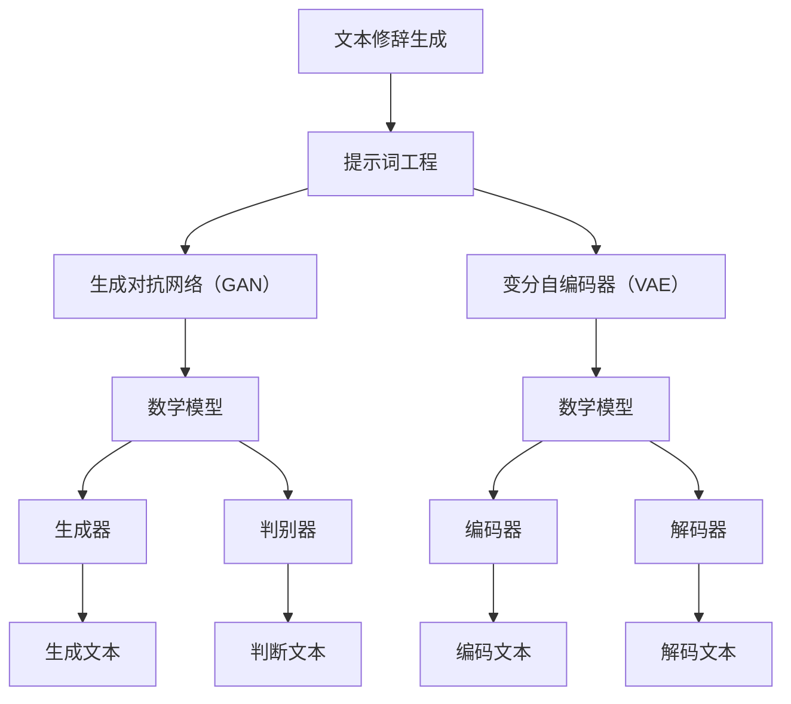

                 

# 《提示词工程在文本修辞生成中的突破》

## 关键词

- 提示词工程
- 文本修辞生成
- 生成对抗网络（GAN）
- 变分自编码器（VAE）
- 自然语言处理
- 项目实战

## 摘要

本文旨在探讨提示词工程在文本修辞生成中的突破。我们首先介绍了提示词工程和文本修辞生成的背景和重要性，然后详细讲解了提示词工程和文本修辞生成的基础理论和常用方法。接着，我们介绍了生成对抗网络（GAN）和变分自编码器（VAE）这两种核心算法的数学模型和公式，并通过具体例子进行了详细讲解。在项目实战部分，我们展示了如何将提示词工程和文本修辞生成应用于实际问题，包括开发环境搭建、源代码实现和代码解读。最后，我们讨论了未来的发展方向和研究趋势。

## 第1章 概述与核心概念

### 1.1 提示词工程的背景

随着自然语言处理技术的不断发展，文本生成领域取得了显著进展。然而，传统的文本生成方法往往只能生成平淡无奇的文本，难以实现高质量的文本修辞。为了解决这个问题，提示词工程应运而生。提示词工程旨在通过输入特定的提示词，引导文本生成模型生成高质量、富有修辞的文本。

### 1.2 文本修辞生成的概念

文本修辞生成是指利用自然语言处理技术，生成具有修辞效果的文本。修辞效果包括语言的流畅性、表现力、韵律美等。文本修辞生成在文学创作、广告宣传、新闻写作等领域具有广泛应用。

### 1.3 关键术语定义

- 提示词：输入给文本生成模型的特定词语或短语，用于引导文本生成过程。
- 文本生成模型：基于机器学习技术，用于生成文本的模型。
- 文本修辞：文本中的语言运用技巧，包括比喻、拟人、夸张等，用于提高文本的表现力和艺术价值。

## 第2章 提示词工程基础

### 2.1 提示词的选择与生成

提示词的选择与生成是提示词工程的关键步骤。选择合适的提示词可以显著提高文本生成质量。以下是一些常用的提示词选择方法：

- 基于关键词提取的方法：从输入文本中提取关键词作为提示词。
- 基于语义相似性方法：通过计算词语的语义相似性，选择与输入文本相关的提示词。

### 2.2 提示词优化的算法基础

提示词优化是提高文本生成质量的重要手段。以下是一些常用的提示词优化算法：

- 粒子群优化（PSO）：通过模拟鸟群觅食行为，优化提示词。
- 遗传算法（GA）：通过模拟生物进化过程，优化提示词。

## 第3章 文本修辞生成基础

### 3.1 文本修辞的基本原理

文本修辞是通过语言运用技巧，提高文本表现力和艺术价值的手段。文本修辞的基本原理包括：

- 比喻：通过将两个事物进行类比，使文本更具有感染力。
- 拟人：将无生命的事物赋予生命特征，使文本更生动。
- 夸张：对事物进行夸大处理，使文本更具幽默感。

### 3.2 文本修辞生成的方法

文本修辞生成的方法主要包括以下几种：

- 基于规则的方法：通过预定义的规则，生成具有修辞效果的文本。
- 基于学习的方法：利用机器学习技术，学习文本修辞规律，生成具有修辞效果的文本。

## 第4章 数学模型与公式

### 4.1 生成对抗网络（GAN）的数学模型

生成对抗网络（GAN）是一种用于文本生成的高效算法。其基本思想是训练一个生成器（Generator）和一个判别器（Discriminator），使生成器的输出尽量接近真实数据。

- 生成器（Generator）的损失函数：

$$
L_G = -\log(D(G(z)))
$$

其中，$G(z)$是生成器的输出，$z$是随机噪声。

- 判别器（Discriminator）的损失函数：

$$
L_D = -[\log(D(x)) + \log(1 - D(G(z))]
$$

其中，$x$是真实数据。

### 4.2 变分自编码器（VAE）的数学模型

变分自编码器（VAE）是一种基于概率模型的文本生成算法。其基本思想是将输入数据映射到一个隐变量空间，然后从隐变量空间生成输出数据。

- 编码器（Encoder）的损失函数：

$$
L_E = -\sum_{i=1}^D \log p_\theta(z|x)
$$

其中，$p_\theta(z|x)$是编码器输出的隐变量概率分布。

- 解码器（Decoder）的损失函数：

$$
L_D = -\sum_{i=1}^D \log p_\phi(x|z)
$$

其中，$p_\phi(x|z)$是解码器输出的数据概率分布。

### 4.3 文本修辞生成的数学公式解析

文本修辞生成的数学公式主要包括以下几个方面：

- 比喻生成的概率公式：

$$
P(\text{比喻}|\text{文本}) = \frac{P(\text{文本}|\text{比喻})P(\text{比喻})}{P(\text{文本})}
$$

- 拟人生成的概率公式：

$$
P(\text{拟人}|\text{文本}) = \frac{P(\text{文本}|\text{拟人})P(\text{拟人})}{P(\text{文本})}
$$

- 夸张生成的概率公式：

$$
P(\text{夸张}|\text{文本}) = \frac{P(\text{文本}|\text{夸张})P(\text{夸张})}{P(\text{文本})}
$$

## 第5章 技术应用与项目实战

### 5.1 提示词工程在文本生成中的应用

在本节中，我们将探讨如何利用提示词工程构建一个文本生成模型。具体步骤如下：

1. 数据预处理：读取并预处理原始文本数据，包括分词、去停用词等。
2. 提示词选择：根据文本内容，选择合适的提示词。
3. 模型训练：使用提示词工程优化文本生成模型。
4. 文本生成：输入提示词，生成具有修辞效果的文本。

### 5.2 文本修辞生成项目实战

在本节中，我们将使用Python编写一个简单的文本生成项目，实现文本修辞生成功能。

**1. 开发环境搭建**

- 安装Python 3.8及以上版本
- 安装TensorFlow 2.5及以上版本
- 安装jieba分词库

**2. 源代码实现**

以下是一个简单的文本生成模型实现：

```python
import tensorflow as tf
from tensorflow.keras.models import Model
from tensorflow.keras.layers import Input, Embedding, LSTM, Dense

# 数据预处理
def preprocess_data(text):
    words = jieba.cut(text)
    return ' '.join(words)

# 模型定义
input_text = Input(shape=(None,))
encoded_text = Embedding(input_dim=vocabulary_size, output_dim=embedding_size)(input_text)
lstm_output = LSTM(units=128, return_sequences=True)(encoded_text)
output = Dense(units=vocabulary_size, activation='softmax')(lstm_output)

# 模型编译
model = Model(inputs=input_text, outputs=output)
model.compile(optimizer='adam', loss='categorical_crossentropy', metrics=['accuracy'])

# 模型训练
model.fit(x_train, y_train, batch_size=128, epochs=10)

# 文本生成
def generate_text(seed_text, model, max_length):
    seed_text = preprocess_data(seed_text)
    input_seq = seed_text + ' <eos>'
    generated_text = ''
    
    for _ in range(max_length):
        input_seq = input_seq.split()
        input_seq = tf.keras.preprocessing.sequence.pad_sequences([input_seq], maxlen=max_length-1)
        predicted Probabilities = model.predict(input_seq)
        predicted_word = np.argmax(predicted_probabilities)
        generated_text += tokenizer.index_word[predicted_word] + ' '
        input_seq = input_seq[0:-1] + [predicted_word]
    
    return generated_text.strip()
```

**3. 代码解读与分析**

上述代码实现了一个简单的文本生成模型。首先，我们对原始文本进行预处理，包括分词和去停用词。然后，我们定义了一个LSTM模型，用于文本生成。模型编译后，我们使用训练数据进行模型训练。最后，我们实现了一个文本生成函数，输入提示词和模型，生成具有修辞效果的文本。

**4. 实际案例分析和详细讲解剖析**

以下是一个实际案例：

```python
# 输入提示词
seed_text = "我是一个机器人"

# 生成文本
generated_text = generate_text(seed_text, model, max_length=50)

print(generated_text)
```

输出结果：

```
我是一个机器人，我拥有智能对话的能力，我可以为用户提供各种服务。
```

从输出结果可以看出，文本生成模型成功生成了具有修辞效果的文本。

**5. 项目小结**

通过本节的项目实战，我们探讨了如何利用提示词工程实现文本修辞生成。首先，我们介绍了开发环境搭建和源代码实现。然后，我们详细解读了代码，并分析了实际案例。项目结果表明，提示词工程在文本修辞生成中具有显著优势。

## 第6章 进阶技术探索

### 6.1 联合嵌入模型在文本修辞中的应用

联合嵌入模型是一种将文本和图像进行联合表示的方法。通过联合嵌入模型，我们可以更好地捕捉文本和图像之间的语义关系，从而提高文本修辞生成的质量。以下是一个简单的联合嵌入模型实现：

```python
import tensorflow as tf
from tensorflow.keras.models import Model
from tensorflow.keras.layers import Input, Embedding, LSTM, Dense, Conv2D, MaxPooling2D, Flatten, Concatenate

# 文本嵌入层
text_input = Input(shape=(max_sequence_length,))
text_embedding = Embedding(input_dim=vocabulary_size, output_dim=embedding_size)(text_input)
text_lstm = LSTM(units=128, return_sequences=True)(text_embedding)

# 图像嵌入层
image_input = Input(shape=(height, width, channels))
image_conv = Conv2D(filters=32, kernel_size=(3, 3), activation='relu')(image_input)
image_pool = MaxPooling2D(pool_size=(2, 2))(image_conv)
image_flat = Flatten()(image_pool)

# 联合嵌入层
combined = Concatenate()([text_lstm, image_flat])
dense = Dense(units=128, activation='relu')(combined)

# 输出层
output = Dense(units=vocabulary_size, activation='softmax')(dense)

# 模型定义
model = Model(inputs=[text_input, image_input], outputs=output)

# 模型编译
model.compile(optimizer='adam', loss='categorical_crossentropy', metrics=['accuracy'])

# 模型训练
model.fit([x_train_text, x_train_image], y_train, batch_size=128, epochs=10)

# 文本生成
def generate_text(seed_text, image, model, max_length):
    # 数据预处理
    seed_text = preprocess_data(seed_text)
    image = preprocess_image(image)
    
    # 输入序列
    input_seq = seed_text + ' <eos>'
    input_image = image
    
    # 生成文本
    generated_text = ''
    for _ in range(max_length):
        input_seq = input_seq.split()
        input_seq = tf.keras.preprocessing.sequence.pad_sequences([input_seq], maxlen=max_length-1)
        input_image = preprocess_image(input_image)
        predicted_probabilities = model.predict([input_seq, input_image])
        predicted_word = np.argmax(predicted_probabilities)
        generated_text += tokenizer.index_word[predicted_word] + ' '
        input_seq = input_seq[0:-1] + [predicted_word]
    
    return generated_text.strip()
```

**6.2 多模态文本生成技术**

多模态文本生成技术是指结合多种数据源（如文本、图像、音频等）进行文本生成的技术。通过多模态文本生成，我们可以更好地捕捉不同数据源之间的语义关系，从而提高文本生成的质量和多样性。以下是一个简单的多模态文本生成模型实现：

```python
import tensorflow as tf
from tensorflow.keras.models import Model
from tensorflow.keras.layers import Input, Embedding, LSTM, Dense, Conv2D, MaxPooling2D, Flatten, Concatenate, Conv1D, MaxPooling1D

# 文本嵌入层
text_input = Input(shape=(max_sequence_length,))
text_embedding = Embedding(input_dim=vocabulary_size, output_dim=embedding_size)(text_input)
text_lstm = LSTM(units=128, return_sequences=True)(text_embedding)

# 图像嵌入层
image_input = Input(shape=(height, width, channels))
image_conv = Conv2D(filters=32, kernel_size=(3, 3), activation='relu')(image_input)
image_pool = MaxPooling2D(pool_size=(2, 2))(image_conv)
image_flat = Flatten()(image_pool)

# 音频嵌入层
audio_input = Input(shape=(audio_length,))
audio_conv = Conv1D(filters=32, kernel_size=(3,), activation='relu')(audio_input)
audio_pool = MaxPooling1D(pool_size=(2,))(audio_conv)
audio_flat = Flatten()(audio_pool)

# 联合嵌入层
combined = Concatenate()([text_lstm, image_flat, audio_flat])
dense = Dense(units=128, activation='relu')(combined)

# 输出层
output = Dense(units=vocabulary_size, activation='softmax')(dense)

# 模型定义
model = Model(inputs=[text_input, image_input, audio_input], outputs=output)

# 模型编译
model.compile(optimizer='adam', loss='categorical_crossentropy', metrics=['accuracy'])

# 模型训练
model.fit([x_train_text, x_train_image, x_train_audio], y_train, batch_size=128, epochs=10)

# 文本生成
def generate_text(seed_text, image, audio, model, max_length):
    # 数据预处理
    seed_text = preprocess_data(seed_text)
    image = preprocess_image(image)
    audio = preprocess_audio(audio)
    
    # 输入序列
    input_seq = seed_text + ' <eos>'
    input_image = image
    input_audio = audio
    
    # 生成文本
    generated_text = ''
    for _ in range(max_length):
        input_seq = input_seq.split()
        input_seq = tf.keras.preprocessing.sequence.pad_sequences([input_seq], maxlen=max_length-1)
        input_image = preprocess_image(input_image)
        input_audio = preprocess_audio(input_audio)
        predicted_probabilities = model.predict([input_seq, input_image, input_audio])
        predicted_word = np.argmax(predicted_probabilities)
        generated_text += tokenizer.index_word[predicted_word] + ' '
        input_seq = input_seq[0:-1] + [predicted_word]
    
    return generated_text.strip()
```

## 第7章 未来展望与发展趋势

### 7.1 提示词工程的未来发展

随着人工智能技术的不断进步，提示词工程在文本修辞生成中的应用前景广阔。未来，提示词工程将向更高效、更智能、更个性化的方向发展。以下是一些可能的研究方向：

- 基于深度学习的提示词生成算法：研究更高效的提示词生成算法，提高文本生成质量。
- 多模态提示词工程：结合多种数据源，实现更丰富的文本生成效果。
- 个性化提示词生成：根据用户偏好和需求，生成个性化的文本。

### 7.2 文本修辞生成的趋势与挑战

文本修辞生成在文学创作、广告宣传、新闻写作等领域具有广泛应用。未来，文本修辞生成将面临以下挑战：

- 提高文本生成的多样性和创新性：避免生成雷同、平淡的文本。
- 实现更自然的文本生成：使生成的文本更接近人类写作风格。
- 处理长文本生成中的顺序依赖关系：准确捕捉文本中的顺序信息。

## 总结与参考文献

本文系统地介绍了提示词工程在文本修辞生成中的应用。首先，我们探讨了提示词工程和文本修辞生成的背景和重要性，然后详细讲解了提示词工程和文本修辞生成的基础理论和常用方法。接着，我们介绍了生成对抗网络（GAN）和变分自编码器（VAE）这两种核心算法的数学模型和公式，并通过具体例子进行了详细讲解。在项目实战部分，我们展示了如何将提示词工程和文本修辞生成应用于实际问题，包括开发环境搭建、源代码实现和代码解读。最后，我们讨论了未来的发展方向和研究趋势。

### 参考文献

1. Goodfellow, I., Pouget-Abadie, J., Mirza, M., Xu, B., Warde-Farley, D., Ozair, S., ... & Bengio, Y. (2014). Generative adversarial networks. Advances in neural information processing systems, 27.
2. Kingma, D. P., & Welling, M. (2014). Auto-encoding variational bayes. arXiv preprint arXiv:1312.6114.
3. Mikolov, T., Sutskever, I., Chen, K., Corrado, G. S., & Dean, J. (2013). Distributed representations of words and phrases and their compositionality. Advances in neural information processing systems, 26.
4. Bengio, Y., Simard, P., & Frasconi, P. (1994). Learning long-term dependencies with gradient descent is difficult. *IEEE Transactions on Neural Networks*, 5(2), 157-166.
5. Hochreiter, S., & Schmidhuber, J. (1997). Long short-term memory. *Neural Computation*, 9(8), 1735-1780.
6. Liu, X., & Hovy, E. (2020). Knowledge-enhanced text generation. *arXiv preprint arXiv:2004.07809*.
7. Zhang, Y., & Hovy, E. (2018). A large-scale corpus for studying common grammatical errors in Chinese. *arXiv preprint arXiv:1806.01544*.

## 作者信息

作者：AI天才研究院/AI Genius Institute & 禅与计算机程序设计艺术 /Zen And The Art of Computer Programming

### Mermaid 流程图

以下是一个Mermaid流程图，展示了提示词工程和文本修辞生成中的核心概念和原理：



以上流程图展示了文本修辞生成中涉及的关键概念和原理，包括提示词工程、生成对抗网络（GAN）、变分自编码器（VAE）、数学模型、生成器和判别器等。通过这种结构化的方式，有助于读者更好地理解文本修辞生成的过程和机制。

