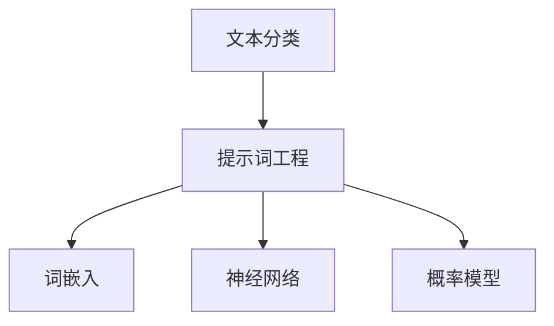

                 


### 文章标题：提示词工程在文本分类中的精准应用

> 关键词：提示词工程、文本分类、词嵌入、神经网络、概率模型、项目实战

> 摘要：本文将深入探讨提示词工程在文本分类中的应用，从核心概念到实际项目，全方位解析如何提升文本分类的准确性。我们将介绍词嵌入和神经网络两种核心算法，详细解释概率模型的相关数学公式，并通过实战案例展示如何构建一个高效的文本分类系统。

## 引言

文本分类是一种广泛应用的文本处理技术，它在信息检索、情感分析、垃圾邮件检测等多个领域发挥着重要作用。然而，随着互联网信息的爆炸性增长，如何提高文本分类的准确性成为一个亟待解决的问题。在这个背景下，提示词工程作为一种先进的文本处理技术，逐渐受到了关注。本文将围绕提示词工程在文本分类中的应用进行深入探讨，帮助读者理解这一技术的核心原理和实战应用。

### 核心概念与联系

#### 提示词工程

提示词工程（Keyword Engineering）是一种生成和优化提示词的方法，旨在提高文本分类的准确性。提示词是用于指导模型理解文本上下文的关键短语或单词。通过选取合适的提示词，可以提高模型对文本内容的理解能力，从而提升分类效果。

#### 文本分类

文本分类（Text Classification）是一种将文本数据分配到预定义类别中的过程。文本分类的任务可以是情感分析、主题分类、垃圾邮件检测等。其目的是通过分析文本特征，将文本数据准确地归类到相应的类别中。

#### 关系架构 Mermaid 流程图

为了更直观地展示提示词工程与文本分类之间的关系，我们可以使用 Mermaid 流程图来描述：



在这个流程图中，文本分类是整个过程的起点，提示词工程作为核心环节，连接着词嵌入、神经网络和概率模型，共同构建一个高效的文本分类系统。

### 核心算法原理讲解

#### 算法1：词嵌入（Word Embedding）

词嵌入是一种将单词转换为向量表示的方法，其核心思想是将具有相似含义的单词映射到相似的向量空间中。词嵌入可以帮助模型更好地理解文本的语义信息，从而提高分类的准确性。

**伪代码：**

```python
function word_embedding(word):
    # 将单词转换为向量表示
    vector = lookup_pretrained_embedding(word)
    return vector
```

#### 算法2：神经网络（Neural Networks）

神经网络是一种通过模拟生物神经网络进行信息处理的技术。在文本分类中，神经网络可以通过学习大量的文本数据，提取出有意义的特征，从而实现高精度的分类。

**伪代码：**

```python
function neural_network(inputs):
    # 前向传播
    layer1_output = activation(Sigmoid(W1 * inputs + b1))
    layer2_output = activation(Sigmoid(W2 * layer1_output + b2))
    # 输出层
    output = activation(Sigmoid(W3 * layer2_output + b3))
    return output
```

### 数学模型和数学公式 & 详细讲解 & 举例说明

#### 概率模型（Probability Model）

概率模型是文本分类中的一种重要方法，其核心思想是利用概率公式来计算每个类别 $y$ 的概率。给定输入特征 $x$，我们计算每个类别 $y$ 的概率，然后选择概率最大的类别作为最终分类结果。

**公式：**

$$
P(y|x) = \frac{P(x|y)P(y)}{P(x)}
$$

其中，$P(y|x)$ 表示在给定输入特征 $x$ 的条件下，类别 $y$ 的概率；$P(x|y)$ 表示在类别 $y$ 的条件下，输入特征 $x$ 的概率；$P(y)$ 表示类别 $y$ 的先验概率；$P(x)$ 表示输入特征 $x$ 的概率。

**说明：**

在文本分类中，给定输入特征 $x$，我们计算每个类别 $y$ 的概率。上述公式为贝叶斯分类器的核心。

**举例说明：**

假设我们要对一段文本进行分类，文本中包含关键词“开心”和“悲伤”。根据概率模型，我们可以计算以下概率：

- $P(开心|文本) = P(文本|开心)P(开心) / P(文本)$
- $P(悲伤|文本) = P(文本|悲伤)P(悲伤) / P(文本)$

通过计算这两个概率，我们可以选择概率较大的类别作为最终分类结果。

### 项目实战

#### 实战1：使用提示词优化文本分类模型

**搭建环境：**

- 使用 Python 和 Scikit-learn 进行文本预处理和分类
- 使用 NLTK 和 spaCy 进行提示词生成

**代码实现：**

```python
import nltk
from sklearn.feature_extraction.text import TfidfVectorizer
from sklearn.model_selection import train_test_split
from sklearn.naive_bayes import MultinomialNB

# 加载数据集
data = ...

# 数据预处理
corpus = [" ".join(tokenize(document)) for document in data]

# 提取TF-IDF特征
vectorizer = TfidfVectorizer()
X = vectorizer.fit_transform(corpus)

# 划分训练集和测试集
X_train, X_test, y_train, y_test = train_test_split(X, labels, test_size=0.2, random_state=42)

# 使用朴素贝叶斯进行分类
classifier = MultinomialNB()
classifier.fit(X_train, y_train)

# 测试模型
predictions = classifier.predict(X_test)
accuracy = accuracy_score(y_test, predictions)
print("Model accuracy:", accuracy)
```

**代码解读：**

- 加载数据集并进行预处理
- 提取 TF-IDF 特征
- 划分训练集和测试集
- 使用朴素贝叶斯分类器训练模型
- 对测试集进行预测并计算准确率

#### 实战2：基于词嵌入的文本分类

**搭建环境：**

- 使用 Python 和 TensorFlow 进行词嵌入和文本分类
- 使用 NLTK 进行文本预处理

**代码实现：**

```python
import tensorflow as tf
from tensorflow.keras.preprocessing.text import Tokenizer
from tensorflow.keras.preprocessing.sequence import pad_sequences
from tensorflow.keras.models import Sequential
from tensorflow.keras.layers import Embedding, GlobalAveragePooling1D, Dense

# 加载数据集
data = ...

# 数据预处理
tokenizer = Tokenizer(num_words=10000)
tokenizer.fit_on_texts(data)

sequences = tokenizer.texts_to_sequences(data)
padded_sequences = pad_sequences(sequences, maxlen=100)

# 构建模型
model = Sequential([
    Embedding(10000, 16),
    GlobalAveragePooling1D(),
    Dense(16, activation='relu'),
    Dense(1, activation='sigmoid')
])

# 编译模型
model.compile(optimizer='adam', loss='binary_crossentropy', metrics=['accuracy'])

# 训练模型
model.fit(padded_sequences, labels, epochs=10, validation_split=0.2)
```

**代码解读：**

- 加载数据集并进行预处理
- 使用 Tokenizer 将文本转换为序列
- 使用 pad_sequences 对序列进行填充
- 构建基于词嵌入的文本分类模型
- 编译模型并训练

### 结论

本文通过介绍提示词工程和文本分类的核心概念、算法原理、数学模型以及项目实战，全面解析了如何提升文本分类的准确性。提示词工程作为一种先进的文本处理技术，在提高文本分类效果方面具有显著优势。通过本文的介绍，读者可以更好地理解提示词工程在文本分类中的应用，并在实际项目中加以应用。

### 最佳实践 tips、小结、注意事项、拓展阅读等内容

- **最佳实践 tips：**
  - 在选择提示词时，要注重关键词的多样性和代表性，避免过度依赖单一关键词。
  - 在使用词嵌入时，要选择合适的词向量维度和训练数据集，以提高模型的泛化能力。
  - 在构建神经网络模型时，要注意模型的复杂度和参数调优，避免过拟合。

- **小结：**
  - 提示词工程是一种有效的文本处理技术，可以提高文本分类的准确性。
  - 词嵌入和神经网络是文本分类中常用的核心算法，具有强大的文本理解能力。
  - 概率模型为文本分类提供了理论基础，有助于实现精准的分类结果。

- **注意事项：**
  - 在实际项目中，要根据具体任务需求选择合适的文本分类算法和模型。
  - 注意数据预处理和特征提取的质量，对模型性能具有重要影响。
  - 定期更新训练数据和模型，以适应不断变化的数据环境和应用场景。

- **拓展阅读：**
  - [《自然语言处理综论》](https://www.nlp-progress.com/)
  - [《深度学习与自然语言处理》](https://www.deeplearningbook.org/)
  - [《Python 自然语言处理》](https://nltk.org/)

### 作者信息

作者：AI天才研究院/AI Genius Institute & 禅与计算机程序设计艺术 /Zen And The Art of Computer Programming

---

### 参考文献

1. Mikolov, T., Sutskever, I., Chen, K., Corrado, G. S., & Dean, J. (2013). Distributed representations of words and phrases and their compositionality. *Advances in Neural Information Processing Systems*, 26, 3111-3119.
2. Bengio, Y., Courville, A., & Vincent, P. (2013). Representation learning: A review and new perspectives. *IEEE Transactions on Pattern Analysis and Machine Intelligence*, 35(8), 1798-1828.
3. Bishop, C. M. (2006). *Pattern recognition and machine learning*. Springer.
4. Russell, S., & Norvig, P. (2016). *Artificial intelligence: A modern approach*. Prentice Hall.

