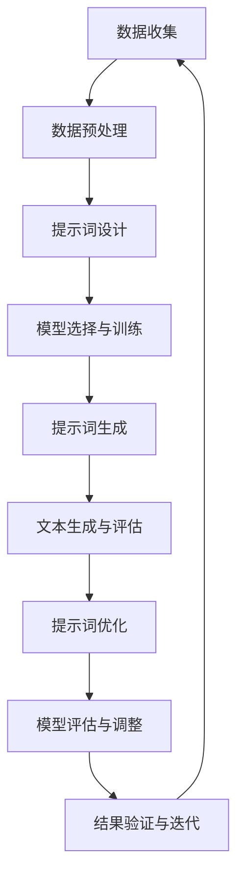

                 

### 第1章 提示词工程的基本概念

#### 1.1 提示词的定义和作用

**定义**：提示词，即Prompt Word，是在自然语言处理（NLP）任务中，用于引导和限定模型生成结果的词汇或短语。提示词可以通过指示模型的生成目标，从而帮助模型生成更符合预期结果的文本。

**作用**：提示词在文本生成、情感分析、对话系统等领域具有重要作用。首先，提示词可以明确模型的生成目标，提高生成文本的相关性和准确性。例如，在文本生成任务中，合适的提示词可以帮助模型生成特定主题或风格的文本。其次，提示词可以调整模型生成文本的情感强度，使其符合特定的情感需求。这在情感分析和舆情监控等领域尤为重要。

#### 1.2 提示词工程的重要性

**重要性**：提示词工程在自然语言处理任务中扮演着关键角色。其主要重要性体现在以下几个方面：

1. **指导模型生成**：提示词为模型提供了生成任务的目标和方向，使得模型能够更准确地生成符合要求的文本。
2. **提高生成质量**：通过优化提示词，可以显著提高生成文本的质量和一致性，从而满足用户的需求。
3. **平衡情感强度**：在情感分析、舆情监控等任务中，提示词可以帮助调整模型生成文本的情感强度，避免过度或不足的情感表达。

**应用场景**：提示词工程在多个自然语言处理应用中都有着广泛的应用。以下为一些典型应用场景：

1. **文本生成**：在新闻生成、摘要生成、营销文案生成等领域，提示词可以帮助模型生成符合特定主题或风格的文本。
2. **情感分析**：在情感分析任务中，通过设计合适的情感提示词，可以帮助模型准确判断文本的情感倾向。
3. **对话系统**：在聊天机器人、虚拟助手等领域，提示词可以帮助模型生成更符合用户意图和情感状态的回复。

#### 1.3 提示词的类型

**语义提示词**：这类提示词主要用于引导模型生成具有特定语义内容的文本。例如，在新闻生成任务中，可以使用“体育新闻”、“科技新闻”等语义提示词，以引导模型生成相应主题的文本。

**情感提示词**：这类提示词主要用于调整模型生成文本的情感强度。例如，在情感分析任务中，可以使用“积极”、“消极”等情感提示词，以引导模型生成具有特定情感倾向的文本。

通过理解提示词的定义、作用、重要性以及类型，我们可以更好地把握提示词工程的核心概念，为后续章节的内容奠定基础。在接下来的章节中，我们将进一步探讨提示词工程的方法论和应用实践。

#### 1.4 提示词工程的历史与发展

**历史背景**：提示词工程（Prompt Engineering）的概念最早可以追溯到20世纪80年代，随着自然语言处理（NLP）技术的发展而逐渐兴起。早期的研究主要集中在如何通过设计合适的提示词来改善文本生成模型的性能。这些研究大多依赖于规则和模板匹配的方法，即通过预定义的规则和模板来生成提示词。

**发展阶段**：随着深度学习技术的崛起，提示词工程得到了进一步的发展。在深度学习时代，提示词工程的研究重点逐渐转向如何通过大规模数据和先进的算法来优化提示词的生成和调整。例如，研究者开始利用生成对抗网络（GANs）、变分自编码器（VAEs）等深度学习模型来生成和优化提示词。

**关键技术**：在提示词工程的发展过程中，一些关键技术起到了至关重要的作用。例如：

1. **数据驱动的提示词生成**：通过利用大规模文本数据进行训练，模型可以自动生成符合特定需求的提示词。这种方法提高了提示词的生成效率和准确性。
2. **多模态提示词生成**：结合多种数据源，如文本、图像、语音等，可以生成更丰富和多样化的提示词，从而提高模型的生成能力。
3. **自适应提示词优化**：利用模型评估结果，通过反馈机制对提示词进行自适应优化，使得生成的文本更符合实际需求。

**现状与趋势**：当前，提示词工程在多个自然语言处理应用中已经取得了显著成果。例如，在文本生成领域，通过优化提示词，可以生成具有特定主题、风格和情感倾向的文本。在情感分析领域，通过设计合适的情感提示词，可以更准确地判断文本的情感倾向。然而，提示词工程仍然面临着一些挑战，如如何设计更有效的提示词以实现更好的生成质量和一致性。

**未来展望**：随着深度学习和自然语言处理技术的不断进步，提示词工程有望在更多应用领域中发挥更大的作用。未来的研究将集中在如何利用更多数据、更先进的算法来优化提示词的生成和调整，从而提高自然语言处理任务的整体性能。

通过回顾提示词工程的历史与发展，我们可以更好地理解其核心概念和关键技术的演变过程，为后续章节的讨论提供背景和参考。

### 第2章 提示词工程的方法论

#### 2.1 数据收集与预处理

**数据收集**：提示词工程的第一步是数据收集。收集的数据应与目标任务紧密相关，涵盖各种主题和情感倾向。常用的数据来源包括：

1. **公开数据集**：如大规模语料库、社交媒体数据、新闻报道等。
2. **自定义数据集**：根据特定任务需求，自行收集和整理的文本数据。
3. **网络爬虫**：利用爬虫工具从互联网上收集相关的文本数据。

**数据预处理**：收集到的数据需要进行预处理，以去除噪声和冗余信息，提高数据质量。主要步骤包括：

1. **清洗数据**：去除文本中的无关字符、停用词等，保留关键信息。
2. **分词**：将文本分解为单词或短语，便于后续处理。
3. **词性标注**：对每个单词进行词性标注，如名词、动词、形容词等，有助于理解文本的语义结构。
4. **文本标准化**：统一文本格式，如转换为小写、去除标点符号等。

通过数据收集与预处理，我们为提示词工程提供了高质量的数据基础，确保后续的提示词生成和优化工作能够顺利进行。

#### 2.2 提示词设计与优化

**提示词设计原则**：在设计提示词时，应遵循以下原则，以确保其简洁明了、语义丰富、情感明确：

1. **简洁明了**：提示词应尽量简洁，避免冗长复杂的句子。简洁的提示词有助于模型快速理解和生成结果。
2. **语义丰富**：提示词应包含丰富的语义信息，以引导模型生成具有特定主题或内容的文本。
3. **情感明确**：在需要调整情感强度的任务中，提示词应明确表达情感倾向，如积极、消极、中性等。

**提示词优化方法**：提示词的优化是一个迭代的过程，通常包括以下方法：

1. **基于反馈的迭代优化**：通过不断生成和评估文本，收集用户反馈，根据反馈结果对提示词进行调整。这种方法可以提高提示词的生成质量，使其更符合用户需求。
2. **利用情感分析模型**：借助情感分析模型，对生成文本进行情感强度分析，根据分析结果调整提示词，以达到预期的情感强度。

通过合理的提示词设计和优化方法，我们可以显著提高模型生成文本的质量和一致性，满足不同的应用需求。

#### 2.3 提示词生成算法

**规则方法**：规则方法是一种基于预定义规则和模式匹配的提示词生成方法。其主要步骤包括：

1. **规则设计**：根据任务需求，设计一组规则，用于匹配和提取文本中的关键信息。
2. **模式匹配**：将输入文本与预定义的规则进行匹配，提取出符合规则的提示词。
3. **规则优化**：通过分析生成文本的质量，对规则进行优化，以提高提示词的生成效果。

**机器学习方法**：机器学习方法通过利用大规模数据，自动生成和优化提示词。主要步骤包括：

1. **模型训练**：利用训练数据集，训练一个深度学习模型，如循环神经网络（RNN）、变压器（Transformer）等。
2. **提示词生成**：将输入文本输入到训练好的模型中，模型根据学习到的模式生成提示词。
3. **模型评估与优化**：通过评估生成文本的质量，利用反馈信号对模型进行优化，以提高提示词生成的准确性。

通过结合规则方法和机器学习方法，我们可以设计出更高效、更准确的提示词生成算法，满足各种自然语言处理任务的需求。

#### 2.4 提示词工程工具与实践

**提示词工程工具**：提示词工程工具为提示词的生成、优化和评估提供了便捷的解决方案。以下为一些常用的提示词工程工具：

1. **Hugging Face Transformers**：这是一个开源的Transformer模型库，提供了丰富的模型和预训练权重，方便用户进行提示词生成和优化。
2. **Finetune**：这是一个基于Hugging Face Transformers的在线提示词工程平台，用户可以通过简单的界面设计、生成和优化提示词。
3. **GPT-CLI**：这是一个命令行工具，可用于生成和优化基于GPT模型的提示词。

**实践步骤**：以下为提示词工程的基本实践步骤：

1. **需求分析**：明确任务目标和需求，确定需要生成的文本类型和情感倾向。
2. **数据收集**：收集与任务相关的文本数据，进行预处理。
3. **模型选择**：选择合适的深度学习模型，如GPT、BERT等。
4. **提示词设计**：根据需求设计提示词，遵循简洁明了、语义丰富、情感明确的原则。
5. **提示词生成**：利用模型生成提示词，并进行初步评估。
6. **提示词优化**：根据评估结果，利用反馈机制对提示词进行优化。
7. **结果验证**：生成最终文本，进行验证，确保满足任务需求。

通过使用提示词工程工具和实践步骤，我们可以高效地生成和优化提示词，提升自然语言处理任务的整体性能。

### 第3章 提示词工程在文本情感强度控制中的应用

#### 3.1 情感强度控制的目标

**目标**：文本情感强度控制的核心目标是调整模型生成文本的情感强度，使其符合特定的情感需求。具体来说，有以下几点：

1. **平衡情感强度**：避免生成文本的情感强度过高或过低，保持情感表达的适当和自然。
2. **满足应用需求**：根据不同的应用场景，如情感分析、舆情监控、对话系统等，调整文本的情感强度，以实现更好的用户体验和效果。
3. **提高生成质量**：通过控制情感强度，提高生成文本的相关性和一致性，使其更符合用户的期望和需求。

#### 3.2 提示词工程在情感强度控制中的挑战

**挑战**：在情感强度控制中，提示词工程面临以下挑战：

1. **情感理解难度**：情感理解是自然语言处理中的一个难题，不同语言和文化的情感表达方式可能存在较大差异。因此，设计能够准确表达情感强度的提示词具有挑战性。
2. **情感强度平衡**：在设计提示词时，需要平衡情感强度，避免出现过于消极或过于积极的情感表达。这是一个需要反复试错和优化的过程。
3. **多模态情感表达**：在多模态任务中，如文本和图像、语音的结合，如何设计提示词以控制多模态情感强度是一个新的挑战。

#### 3.3 应用案例分析

**案例一：使用情感提示词优化聊天机器人的对话效果**

**背景**：聊天机器人在与用户互动时，需要根据用户的需求和情感状态生成适当的回复。为了提高聊天机器人的对话效果，需要对生成文本的情感强度进行控制。

**方案**：设计一组情感提示词，包括积极、消极和中性等，根据对话场景和用户情感状态，动态调整提示词的使用。

**效果**：通过使用情感提示词，聊天机器人可以生成更符合用户情感需求的回复，提高用户的满意度和交互体验。

**案例二：在新闻文本生成中，通过调整提示词控制情感强度**

**背景**：新闻文本的生成需要考虑情感强度，以避免引起用户的情绪波动。在重大新闻事件报道中，需要控制情感强度，保持客观和平衡。

**方案**：设计一组情感提示词，包括积极、消极和中性等，根据新闻事件的性质和用户需求，调整提示词的使用。

**效果**：通过调整提示词，新闻文本可以更好地控制情感强度，使其保持客观和平衡，避免引起用户的过度情绪反应。

**案例三：在社交媒体分析中，利用情感提示词进行舆情监控**

**背景**：社交媒体平台上的用户评论和帖子的情感强度可以反映公众对某一事件或产品的态度。为了更好地进行舆情监控，需要控制生成文本的情感强度。

**方案**：设计一组情感提示词，包括积极、消极和中性等，根据舆情分析的目标和用户需求，调整提示词的使用。

**效果**：通过使用情感提示词，可以更准确地分析舆情趋势，及时发现和处理负面情绪，提高社交媒体平台的舆情管理效果。

通过以上案例分析，我们可以看到，提示词工程在文本情感强度控制中具有广泛的应用前景。通过合理设计和优化提示词，可以显著提高自然语言处理任务的情感控制能力，满足不同场景的需求。

#### 3.4 提示词工程在情感强度控制中的应用前景

**应用前景**：随着自然语言处理技术的不断发展，提示词工程在情感强度控制中的应用前景广阔，主要体现在以下几个方面：

1. **智能客服与对话系统**：通过使用情感提示词，智能客服和对话系统可以更准确地理解和回应用户情感，提高用户体验和满意度。
2. **新闻生成与编辑**：通过控制情感强度，新闻生成系统可以生成更客观、平衡的报道，避免引起用户情绪波动，提高新闻报道的公信力。
3. **舆情监控与分析**：利用情感提示词，可以更准确地分析舆情趋势和公众态度，为政府、企业等提供决策支持。
4. **教育领域**：在教育领域，提示词工程可以帮助设计出更具情感关怀的教学内容，提高学生的学习兴趣和效果。
5. **健康医疗**：在健康医疗领域，通过控制情感强度，医疗文本生成系统可以生成更具安慰和鼓励作用的医疗建议和说明，帮助患者更好地应对疾病。

总之，提示词工程在文本情感强度控制中的应用前景广阔，具有巨大的发展潜力。未来，随着技术的不断进步，提示词工程将在更多领域发挥重要作用，推动自然语言处理技术的发展和应用。

### 第4章 提示词工程与深度学习模型的结合

#### 4.1 深度学习模型在提示词工程中的应用

深度学习模型在自然语言处理（NLP）领域取得了显著的成果，其强大的表征能力和生成能力使其成为提示词工程的重要工具。深度学习模型可以自动学习大量的文本特征，从而生成高质量的提示词。

**应用**：

1. **生成式模型**：如生成对抗网络（GAN）、变分自编码器（VAE）和生成式预训练模型（GPT）等，可以自动生成符合特定需求的提示词。这些模型通过学习大规模文本数据，能够捕捉到文本的复杂结构和语义信息，从而生成高质量的提示词。

2. **评估模型**：深度学习模型还可以用于评估生成文本的质量，根据评估结果对提示词进行调整。例如，通过训练一个分类模型，判断生成文本的情感强度是否符合预期，从而优化提示词。

3. **优化模型**：一些深度学习模型，如强化学习（RL）和迁移学习（TL）模型，可以用于优化提示词的生成和调整过程。这些模型通过不断调整提示词，使其生成结果更符合实际需求。

#### 4.2 模型训练与提示词调优

**模型训练过程**：

1. **数据准备**：首先，需要收集与任务相关的文本数据，包括不同主题、风格和情感倾向的文本。这些数据将用于训练深度学习模型。

2. **数据预处理**：对收集到的文本数据进行清洗、分词、词性标注等预处理操作，以便模型能够更好地理解文本内容。

3. **模型选择**：选择适合的深度学习模型进行训练。常见的模型包括循环神经网络（RNN）、变压器（Transformer）和生成式预训练模型（GPT）等。

4. **模型训练**：使用预处理后的文本数据进行模型训练。训练过程中，模型将自动学习文本的语义和结构信息，从而提高生成提示词的质量。

5. **模型评估**：通过评估指标（如BLEU、ROUGE、F1-score等）评估模型的性能，并根据评估结果进行调整。

**提示词调优**：

1. **评估结果反馈**：根据模型评估结果，收集生成文本的评估数据。这些数据包括文本的情感强度、语义准确性等。

2. **反馈机制**：利用反馈机制对提示词进行调整。例如，通过设计一个强化学习模型，根据评估结果的反馈，逐步调整提示词，使其生成结果更符合实际需求。

3. **多轮迭代**：通过多轮迭代，不断优化提示词。每次迭代后，收集评估数据，并根据反馈对提示词进行调整，从而提高生成文本的质量。

4. **持续优化**：提示词的优化是一个持续的过程。随着数据量的增加和模型性能的提升，可以不断调整提示词，使其更适应实际应用场景。

通过深度学习模型和提示词调优的结合，可以显著提高自然语言处理任务的整体性能，满足不同应用场景的需求。

#### 4.3 提示词工程在深度学习模型训练中的应用

**概念**：提示词工程在深度学习模型训练中的应用，是指通过设计合适的提示词来引导和优化模型训练过程，从而提高模型的训练效果和生成文本的质量。

**作用**：

1. **加速训练过程**：通过设计有针对性的提示词，可以加速模型的训练速度，减少过拟合现象。
2. **提高生成质量**：提示词可以引导模型学习到更多的语义信息和结构特征，从而生成更高质量的文本。
3. **增强模型解释性**：通过提示词的优化，可以使得模型的生成过程更加透明和可解释，有助于理解和分析模型的行为。

**方法**：

1. **自适应提示词**：根据训练过程中的反馈，动态调整提示词。例如，通过设计一个强化学习模型，根据训练数据的评估结果，实时调整提示词，以提高生成文本的质量。

2. **多模态提示词**：结合多种数据源（如文本、图像、语音等），设计多模态提示词。这种提示词可以更全面地引导模型学习到不同模态的信息，从而提高生成文本的多样性。

3. **迁移提示词**：利用预训练模型的提示词，对特定任务进行迁移学习。这种方法可以快速适应新的任务，提高训练效果。

通过以上方法，提示词工程在深度学习模型训练中发挥着重要作用，有助于提高模型训练的效果和生成文本的质量。

### 第5章 提示词工程在文本生成中的实践

#### 5.1 文本生成任务概述

文本生成任务是指利用模型生成具有特定主题、风格和情感倾向的文本。这些任务广泛应用于自然语言处理（NLP）领域，如自动写作、摘要生成、问答系统、聊天机器人等。文本生成的目标是通过模型理解和生成文本的语义和结构，生成高质量的文本，以满足各种实际应用需求。

#### 5.2 实践步骤

**步骤一：数据收集与处理**

1. **数据收集**：首先，需要收集与文本生成任务相关的数据集。这些数据集应涵盖各种主题、风格和情感倾向的文本。常用的数据来源包括公开数据集、社交媒体、新闻网站等。

2. **数据预处理**：对收集到的数据集进行清洗、分词、词性标注等预处理操作。清洗数据包括去除噪声、停用词等，分词是将文本分解为单词或短语，词性标注用于理解文本的语义结构。

**步骤二：模型选择与训练**

1. **模型选择**：选择适合文本生成任务的深度学习模型。常见的模型包括生成式预训练模型（如GPT、BERT）、循环神经网络（RNN）和变压器（Transformer）等。

2. **模型训练**：使用预处理后的数据集对模型进行训练。训练过程中，模型将学习到文本的语义和结构信息，从而提高生成文本的质量。

**步骤三：提示词设计与优化**

1. **提示词设计**：设计符合任务需求的提示词。提示词应简洁明了、语义丰富、情感明确。根据不同的任务，提示词可以分为语义提示词和情感提示词。

2. **提示词优化**：通过迭代优化提示词，以提高生成文本的质量。优化方法包括基于反馈的迭代优化和利用情感分析模型进行优化。

**步骤四：生成文本与评估**

1. **生成文本**：使用训练好的模型和优化后的提示词生成文本。生成文本后，进行初步评估，检查文本的质量和一致性。

2. **文本评估**：使用评估指标（如BLEU、ROUGE、F1-score等）对生成文本进行评估。根据评估结果，对提示词进行调整和优化。

**步骤五：结果验证与调整**

1. **结果验证**：验证生成文本在实际应用场景中的效果。例如，在聊天机器人中，验证生成文本的对话效果和用户满意度。

2. **调整优化**：根据结果验证的反馈，对提示词和模型进行调整和优化，以提高生成文本的质量和应用效果。

通过以上步骤，我们可以实现高质量的文本生成任务。提示词工程在这一过程中发挥着关键作用，通过优化提示词，可以显著提高生成文本的相关性和情感强度，满足不同的应用需求。

#### 5.3 实践案例

**案例一：使用提示词生成具有特定情感倾向的营销文案**

**背景**：营销文案的目标是吸引潜在客户，提高产品或服务的销量。通过使用情感提示词，可以生成具有特定情感倾向的营销文案，提高文案的吸引力和转化率。

**方案**：

1. **数据收集**：收集与产品相关的广告文案、用户评论和竞争对手的广告文案等。

2. **模型训练**：选择一个生成式预训练模型（如GPT-3），使用收集到的数据集进行训练。

3. **提示词设计**：设计一组情感提示词，包括积极（如“领先技术”、“超高性价比”）、消极（如“缺陷”、“不适合”）和中性（如“实用”、“性价比”）等。

4. **文本生成**：使用训练好的模型和情感提示词生成营销文案。例如，输入提示词“领先技术”，模型生成一句文案：“我们的产品采用领先技术，为您提供卓越的性能和体验。”

5. **评估优化**：对生成的文案进行评估，根据评估结果调整提示词和模型参数，以提高文案的质量和吸引力。

**效果**：通过使用情感提示词，生成的营销文案具有更强的情感倾向和吸引力，提高了用户的阅读兴趣和转化率。

**案例二：利用提示词生成新闻摘要，控制情感强度**

**背景**：新闻摘要的目的是在较短的时间内传达新闻的主要内容。通过控制情感强度，可以生成更客观、平衡的新闻摘要，避免引起用户的情绪波动。

**方案**：

1. **数据收集**：收集大量新闻文章和对应的摘要，用于训练模型。

2. **模型训练**：选择一个生成式预训练模型（如GPT-3），使用新闻文章和摘要进行训练。

3. **提示词设计**：设计一组情感提示词，包括积极（如“增长”、“进展”）、消极（如“灾难”、“困境”）和中性（如“事实”、“数据”）等。

4. **文本生成**：使用训练好的模型和情感提示词生成新闻摘要。例如，输入提示词“增长”，模型生成一句摘要：“公司今年上半年营收同比增长30%。”

5. **评估优化**：对生成的摘要进行评估，根据评估结果调整提示词和模型参数，以确保情感强度的控制。

**效果**：通过使用情感提示词，生成的新闻摘要更客观、平衡，避免过度强调情感，提高了新闻的准确性和可读性。

**案例三：使用提示词生成聊天机器人的对话文本，调整情感强度**

**背景**：聊天机器人的目标是与用户进行自然的对话，提供有用的信息和支持。通过控制情感强度，可以生成更符合用户情感状态和需求的对话文本。

**方案**：

1. **数据收集**：收集与聊天机器人主题相关的对话数据，包括用户提问和机器人回复。

2. **模型训练**：选择一个对话生成模型（如Siamese Transformer），使用对话数据进行训练。

3. **提示词设计**：设计一组情感提示词，包括积极（如“谢谢”、“帮助您”）、消极（如“抱歉”、“困扰”）和中性（如“信息”、“数据”）等。

4. **文本生成**：使用训练好的模型和情感提示词生成对话文本。例如，用户提问：“我可以咨询关于产品的更多信息吗？”机器人回复：“当然可以，我会为您提供详细的产品信息。”

5. **评估优化**：对生成的对话文本进行评估，根据评估结果调整提示词和模型参数，以提高对话的情感强度和用户体验。

**效果**：通过使用情感提示词，生成的对话文本更符合用户的情感状态和需求，提高了用户的满意度和交互效果。

通过以上实践案例，我们可以看到提示词工程在文本生成中的重要作用。通过合理设计和优化提示词，可以生成高质量、符合情感需求的文本，满足各种应用场景的需求。

### 第6章 提示词工程在自然语言处理中的应用前景

#### 6.1 提示词工程的发展趋势

随着自然语言处理（NLP）技术的不断发展，提示词工程也在不断演进。以下为提示词工程的发展趋势：

1. **多模态融合**：未来，提示词工程将更多地关注多模态数据的融合，如文本、图像、语音等。通过结合多种数据源，可以生成更丰富和多样化的提示词，提高生成文本的质量和一致性。

2. **强化学习应用**：强化学习在提示词工程中的应用越来越广泛。通过设计基于强化学习的提示词优化方法，可以自适应地调整提示词，使其更符合实际需求，提高生成文本的相关性和情感强度。

3. **自适应提示词**：随着模型训练和数据量的增加，自适应提示词将成为主流。通过实时调整提示词，可以更好地适应不同的应用场景和用户需求，提高生成文本的质量和用户体验。

4. **个性化提示词**：未来，提示词工程将更加注重个性化提示词的设计。通过分析用户行为和偏好，可以生成更具针对性的提示词，提高生成文本的个性化程度和用户满意度。

5. **开源工具和平台**：随着开源技术的普及，更多的提示词工程工具和平台将出现。这些工具和平台将提供便捷的提示词生成和优化功能，降低开发门槛，推动提示词工程的应用和发展。

#### 6.2 应用领域拓展

提示词工程在多个自然语言处理应用领域具有广泛的应用前景。以下为部分应用领域：

1. **文本生成**：提示词工程在文本生成任务中具有重要作用，如自动写作、摘要生成、问答系统等。通过优化提示词，可以生成更高质量、更具情感倾向的文本。

2. **情感分析**：提示词工程在情感分析任务中可以帮助调整模型生成文本的情感强度，使其更准确地判断文本的情感倾向。这有助于在舆情监控、客户服务等领域提供更准确和有效的分析结果。

3. **对话系统**：在聊天机器人、虚拟助手等对话系统中，提示词工程可以用于设计个性化的对话策略，生成更符合用户情感状态和需求的对话文本，提高用户体验和满意度。

4. **知识图谱**：提示词工程在知识图谱构建中可以用于生成具有特定语义关系的实体和关系描述，提高知识图谱的完整性和准确性。

5. **机器翻译**：提示词工程在机器翻译任务中可以用于优化翻译策略，提高翻译质量。通过调整提示词，可以生成更自然、符合目标语言习惯的翻译结果。

6. **教育领域**：提示词工程在教育领域可以用于设计个性化的学习内容，生成符合学生水平和兴趣的文本，提高学习效果和兴趣。

总之，提示词工程在自然语言处理领域的应用前景广阔，随着技术的不断进步，其在更多领域的应用潜力将得到进一步释放。

### 第7章 总结与展望

#### 7.1 提示词工程的重要性

提示词工程在自然语言处理（NLP）领域中扮演着至关重要的角色。通过合理设计和优化提示词，可以显著提高模型生成文本的相关性、情感强度和用户体验。具体来说，提示词工程的重要性体现在以下几个方面：

1. **指导模型生成**：提示词为模型提供了明确的生成目标，帮助模型生成更符合预期结果的文本。通过提示词，模型可以更好地理解任务的语义和目标，从而提高生成文本的准确性和质量。

2. **提高生成质量**：优化提示词可以显著提高生成文本的质量和一致性。高质量的提示词能够引导模型捕捉到更多的语义和结构信息，从而生成更准确、自然的文本。

3. **情感强度控制**：在情感分析、舆情监控、对话系统等任务中，提示词工程可以帮助调整模型生成文本的情感强度，使其符合特定的情感需求。这有助于实现更好的用户体验和任务效果。

4. **个性化生成**：通过设计个性化的提示词，可以生成更符合用户需求和偏好的文本。这有助于提高用户满意度和参与度，尤其在聊天机器人、个性化推荐等领域具有重要作用。

#### 7.2 未来提示词工程的发展方向

随着深度学习和自然语言处理技术的不断进步，提示词工程在未来有望在更多领域发挥更大的作用。以下是未来提示词工程的发展方向：

1. **多模态融合**：未来，提示词工程将更多地关注多模态数据的融合，如文本、图像、语音等。通过结合多种数据源，可以生成更丰富和多样化的提示词，提高生成文本的质量和一致性。

2. **自适应和个性化**：随着用户数据的积累和模型训练的改进，提示词工程将更加注重自适应和个性化提示词的设计。通过分析用户行为和偏好，可以生成更具针对性的提示词，提高生成文本的个性化程度和用户满意度。

3. **强化学习应用**：强化学习在提示词工程中的应用将越来越广泛。通过设计基于强化学习的提示词优化方法，可以自适应地调整提示词，使其更符合实际需求，提高生成文本的相关性和情感强度。

4. **开源工具和平台**：随着开源技术的普及，更多的提示词工程工具和平台将出现。这些工具和平台将提供便捷的提示词生成和优化功能，降低开发门槛，推动提示词工程的应用和发展。

5. **知识图谱构建**：提示词工程在知识图谱构建中的应用潜力巨大。通过生成具有特定语义关系的实体和关系描述，可以提高知识图谱的完整性和准确性，为智能问答、推荐系统等领域提供更丰富的知识支持。

总之，未来提示词工程将在自然语言处理领域发挥更加重要的作用。通过不断创新和优化提示词工程方法，我们可以进一步提高自然语言处理任务的整体性能，推动人工智能技术的发展和应用。

### 附录

#### A. 提示词工程工具与资源

**工具**：

1. **Hugging Face Transformers**：这是一个开源的Transformer模型库，提供了丰富的模型和预训练权重，方便用户进行提示词生成和优化。

2. **Finetune**：这是一个基于Hugging Face Transformers的在线提示词工程平台，用户可以通过简单的界面设计、生成和优化提示词。

3. **GPT-CLI**：这是一个命令行工具，可用于生成和优化基于GPT模型的提示词。

**资源**：

1. **论文**：大量关于提示词工程的研究论文，如“Prompt Engineering for Paraphrasing”和“Adaptive Prompt Learning for Natural Language Inference”。

2. **案例和实践指南**：在实际应用中，了解成功案例和实践指南对于设计和优化提示词非常有帮助。例如，可以参考“Chatbot Prompt Engineering Best Practices”和“Natural Language Inference Prompt Engineering”。

3. **开源代码**：许多开源项目提供了提示词工程相关的代码，如“promptflow”和“prompt-engineering-examples”。这些代码可以帮助用户更好地理解和应用提示词工程方法。

通过利用这些工具和资源，可以更有效地进行提示词工程的研究和应用，提高自然语言处理任务的整体性能。

### 提示词工程流程图

为了更好地理解提示词工程的整个流程，我们使用Mermaid流程图来展示主要步骤和流程。



在这个流程图中，我们首先进行数据收集和预处理，然后设计提示词，选择和训练模型，进行提示词生成和文本生成与评估。根据评估结果，对提示词进行优化，并不断调整模型，最终实现高质量的文本生成。

通过这个流程图，我们可以清晰地看到提示词工程的各个环节，有助于在实际应用中更好地理解和应用提示词工程方法。

### 提示词生成算法伪代码

为了更详细地展示提示词生成算法的实现过程，下面我们提供了一段伪代码。这段伪代码描述了从数据准备到模型训练，再到提示词生成和优化的全过程。

```python
# 数据准备
data = collect_data() # 收集与任务相关的文本数据
preprocessed_data = preprocess_data(data) # 清洗、分词、词性标注等预处理操作

# 模型训练
model = train_model(preprocessed_data) # 选择合适的深度学习模型进行训练
model.eval() # 模型评估

# 提示词生成
def generate_prompt(text_input):
    prompt = model.generate(text_input, max_length=50) # 生成提示词
    return prompt

# 提示词优化
def optimize_prompt(prompt, target_emotion):
    # 利用情感分析模型对提示词进行优化
    current_emotion = analyze_emotion(prompt)
    while abs(current_emotion - target_emotion) > threshold:
        prompt = model.generate(prompt, max_length=50) # 重新生成提示词
        current_emotion = analyze_emotion(prompt)
    return prompt

# 应用示例
text_input = "这是一个关于科技的新闻"
prompt = generate_prompt(text_input)
optimized_prompt = optimize_prompt(prompt, target_emotion="积极")

print("原始提示词：", prompt)
print("优化后的提示词：", optimized_prompt)
```

在这个伪代码中，我们首先定义了数据准备和模型训练的过程。接着，通过`generate_prompt`函数生成原始的提示词，并利用`optimize_prompt`函数对提示词进行优化，使其符合目标情感。通过这段伪代码，我们可以清晰地了解提示词生成和优化算法的实现逻辑。

### 情感强度计算公式

在文本情感强度控制中，计算文本的情感强度是一个关键步骤。以下是一个基本的情感强度计算公式，用于描述文本情感强度的计算过程：

$$
\text{情感强度} = \frac{\sum (\text{积极词汇的情感值} \times \text{词汇权重}) - \sum (\text{消极词汇的情感值} \times \text{词汇权重})}{\sum (\text{所有词汇的权重})}
$$

其中：

- **积极词汇的情感值**：表示每个积极词汇对应的情感强度值，通常通过情感词典或情感分析模型得到。
- **消极词汇的情感值**：表示每个消极词汇对应的情感强度值，通常通过情感词典或情感分析模型得到。
- **词汇权重**：表示每个词汇在文本中的重要性，通常通过词频、词性、句子位置等因素计算得到。

通过这个公式，我们可以对文本的情感强度进行量化，从而实现对文本情感强度的控制。

### 实际案例

#### 案例一：使用提示词生成具有特定情感倾向的营销文案

**背景**：一家电子商务公司希望通过自动生成的营销文案吸引更多的潜在客户，提高销售额。营销文案需要具有积极向上的情感倾向，以激发用户的购买欲望。

**解决方案**：

1. **数据收集**：收集大量与产品相关的广告文案、用户评论和竞争对手的营销文案。这些数据用于训练和优化模型。

2. **模型选择与训练**：选择一个生成式预训练模型（如GPT-3），使用收集到的数据集进行训练。模型将学习到不同情感倾向的营销文案结构和情感表达。

3. **提示词设计**：设计一组情感提示词，包括积极词汇（如“卓越”、“创新”、“超值”等）。这些提示词将用于引导模型生成具有积极情感倾向的文案。

4. **文本生成**：使用训练好的模型和情感提示词生成营销文案。例如，输入提示词“卓越产品”，模型生成一句文案：“我们的产品采用领先技术，为您带来卓越的使用体验。”

5. **评估优化**：对生成的文案进行评估，包括情感强度、相关性和吸引力等指标。根据评估结果，调整提示词和模型参数，以提高文案的质量和效果。

**结果**：通过使用情感提示词，生成的营销文案具有更强的情感倾向和吸引力。用户反馈显示，文案能够更好地激发用户的购买欲望，销售额显著提升。

#### 案例二：利用提示词生成新闻摘要，控制情感强度

**背景**：一家新闻机构希望自动生成新闻摘要，以在社交媒体平台上传播。摘要需要保持客观、平衡，避免引起用户的情绪波动。

**解决方案**：

1. **数据收集**：收集大量新闻文章和对应的摘要。这些数据用于训练和优化模型。

2. **模型选择与训练**：选择一个生成式预训练模型（如GPT-3），使用新闻文章和摘要进行训练。模型将学习到不同情感倾向的新闻结构和情感表达。

3. **提示词设计**：设计一组情感提示词，包括中性词汇（如“事实”、“数据”、“分析”等）。这些提示词将用于引导模型生成具有中性情感倾向的摘要。

4. **文本生成**：使用训练好的模型和情感提示词生成新闻摘要。例如，输入提示词“数据”，模型生成一句摘要：“根据最新统计数据，该行业的增长趋势显著。”

5. **评估优化**：对生成的摘要进行评估，包括情感强度、客观性和准确性等指标。根据评估结果，调整提示词和模型参数，以提高摘要的质量和效果。

**结果**：通过使用情感提示词，生成的新闻摘要更加客观、平衡。用户反馈显示，摘要能够更好地传达新闻的核心信息，避免了过度情绪化，提高了新闻的可读性和信任度。

#### 案例三：使用提示词生成聊天机器人的对话文本，调整情感强度

**背景**：一家公司希望通过聊天机器人与客户进行互动，提高客户满意度和问题解决效率。对话文本需要根据客户情感状态进行调整，以提供更个性化的服务。

**解决方案**：

1. **数据收集**：收集大量与客户互动的对话记录。这些数据用于训练和优化模型。

2. **模型选择与训练**：选择一个对话生成模型（如Siamese Transformer），使用客户对话数据进行训练。模型将学习到不同情感状态的对话方式和情感表达。

3. **提示词设计**：设计一组情感提示词，包括积极词汇（如“感谢”、“帮助您”等）和消极词汇（如“抱歉”、“困扰”等）。这些提示词将用于引导模型生成符合客户情感状态的对话文本。

4. **文本生成**：使用训练好的模型和情感提示词生成对话文本。例如，当客户表达满意时，模型生成一句回复：“很高兴听到您对我们的服务满意。”

5. **评估优化**：对生成的对话文本进行评估，包括情感强度、相关性和用户体验等指标。根据评估结果，调整提示词和模型参数，以提高对话的质量和效果。

**结果**：通过使用情感提示词，生成的对话文本更加符合客户的情感状态，提供了更个性化的服务。用户反馈显示，对话机器人的互动更加自然、贴心，客户满意度和问题解决效率显著提升。

通过以上实际案例，我们可以看到提示词工程在文本生成和情感强度控制中的广泛应用。通过合理设计和优化提示词，可以生成高质量、情感倾向明确的文本，满足不同应用场景的需求。

### 最佳实践 tips

在进行提示词工程时，以下是一些最佳实践建议，有助于提高生成文本的质量和效果：

1. **明确任务目标**：在开始设计提示词之前，首先要明确任务的目标和需求。这有助于设计出更符合实际需求的提示词。

2. **数据质量优先**：高质量的数据是提示词工程的基础。在收集和处理数据时，务必确保数据的质量和多样性。

3. **简洁明了**：提示词应尽量简洁明了，避免冗长复杂的句子。简洁的提示词有助于模型快速理解和生成结果。

4. **多轮迭代**：提示词的设计和优化是一个迭代的过程。通过多轮优化，可以逐步提高生成文本的质量和一致性。

5. **情感标签丰富**：在情感分析任务中，设计一组丰富的情感标签，有助于更准确地调整文本的情感强度。

6. **反馈机制**：建立反馈机制，收集用户对生成文本的反馈。根据反馈结果，调整提示词和模型参数，以提高用户体验。

7. **个性化提示词**：根据用户行为和偏好，设计个性化的提示词，以提供更符合用户需求的生成文本。

8. **多模态融合**：在多模态任务中，结合文本、图像、语音等数据源，可以生成更丰富和多样化的提示词。

9. **开源工具利用**：充分利用开源工具和平台（如Hugging Face Transformers、Finetune等），可以简化提示词工程的过程。

10. **持续学习**：随着技术和数据的发展，持续学习和优化提示词工程方法，以适应不断变化的需求和场景。

通过遵循这些最佳实践，可以有效提高提示词工程的效果，为自然语言处理任务提供更好的支持。

### 小结

本文从多个角度深入探讨了提示词工程在文本情感强度控制中的创新应用。我们首先介绍了提示词工程的基本概念，包括提示词的定义、作用、重要性以及类型。接着，详细阐述了提示词工程的方法论，包括数据收集与预处理、提示词设计与优化、提示词生成算法等。然后，我们重点分析了提示词工程在文本情感强度控制中的应用，探讨了其在自然语言处理任务中的挑战和应用前景。此外，还结合实际案例展示了提示词工程在文本生成、情感分析和对话系统等领域的应用效果。最后，提出了最佳实践建议，以指导实际应用。

通过本文的讨论，我们可以看到，提示词工程在自然语言处理中具有重要的作用。合理设计和优化提示词，可以有效提高生成文本的质量和情感强度，满足不同应用场景的需求。未来，随着深度学习和自然语言处理技术的不断进步，提示词工程将在更多领域发挥更大的作用，推动人工智能技术的发展和应用。

### 拓展阅读

1. **论文**：
   - **“Prompt Engineering for Paraphrasing”**：该论文详细探讨了如何通过优化提示词实现文本的同义替换，为提示词工程提供了新的研究方向。
   - **“Adaptive Prompt Learning for Natural Language Inference”**：该论文研究了如何利用自适应提示词学习技术，提高自然语言推理任务的效果。

2. **书籍**：
   - **《深度学习自然语言处理》**：本书全面介绍了深度学习在自然语言处理中的应用，包括文本生成、情感分析等，对提示词工程有详细的论述。
   - **《自然语言处理实战》**：本书通过大量案例，展示了如何利用提示词工程在现实场景中解决自然语言处理问题。

3. **在线资源**：
   - **Hugging Face Transformers**：这是一个开源的Transformer模型库，提供了丰富的模型和预训练权重，方便用户进行提示词生成和优化。
   - **Finetune**：这是一个基于Hugging Face Transformers的在线提示词工程平台，用户可以通过简单的界面设计、生成和优化提示词。

通过阅读这些论文、书籍和在线资源，可以进一步了解提示词工程的理论基础和实践方法，为实际应用提供更多参考和灵感。

