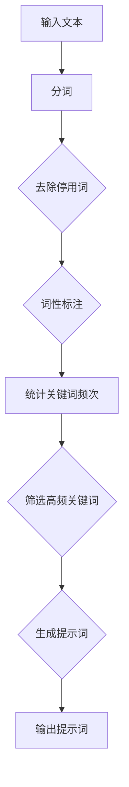
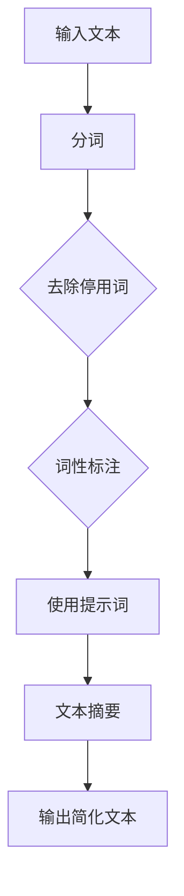

                 


### 文章标题
《提示词工程在文本简化与易读性中的突破》

### 关键词
文本简化，易读性，提示词工程，文本处理，信息提取，自然语言处理

### 摘要
本文将探讨提示词工程在文本简化与易读性提升方面的应用。通过详细阐述提示词工程的基本概念、原理、应用场景、实践方法和效果评估，本文旨在为读者提供一套完整的文本简化与易读性提升的解决方案。

### 目录大纲

#### 引言
- 文本简化与易读性的重要性
- 提示词工程的概念与起源

#### 第一步：确定书的主线和结构
- 主线的确定
- 整体结构的规划

#### 第二步：细化章节内容
1. **提示词工程的定义与概述**
   - 提示词的定义
   - 提示词工程的应用领域
2. **提示词工程的基本原理**
   - 提示词的选取原则
   - 提示词的生成方法
3. **提示词工程的应用场景**
   - 文本简化
   - 易读性提升
4. **提示词工程的实践方法**
   - 数据预处理
   - 提示词生成算法
   - 提示词应用
5. **提示词工程的效果评估**
   - 评估指标
   - 评估方法

#### 第三步：设计流程图和算法讲解
- 提示词生成流程图
- 提示词应用流程图
- 算法讲解与伪代码

#### 第四步：编写项目实战案例
- 实战案例一：文本简化
  - 开发环境搭建
  - 源代码实现
  - 代码解读
- 实战案例二：易读性提升
  - 开发环境搭建
  - 源代码实现
  - 代码解读

#### 第五步：撰写目录大纲
- 目录大纲的撰写

#### 结束语
- 最佳实践 tips
- 小结与展望

### 第一步：确定书的主线和结构
首先，我们需要确定这本书的主线和整体结构。从书名《提示词工程在文本简化与易读性中的突破》可以看出，这本书主要关注提示词工程在提高文本简化与易读性方面的应用。主线可以围绕提示词工程的理论基础、应用场景、实践方法和效果评估展开。

主线一：提示词工程的基本概念与原理
- 提示词的定义
- 提示词的选取原则
- 提示词的生成方法

主线二：提示词工程的应用场景
- 文本简化
- 易读性提升

主线三：提示词工程的实践方法
- 数据预处理
- 提示词生成算法
- 提示词应用

主线四：提示词工程的效果评估
- 评估指标
- 评估方法

#### 第二步：细化章节内容

##### 1. 提示词工程的定义与概述
在这一章节中，我们将详细介绍提示词工程的定义、核心概念及其在文本简化与易读性提升中的作用。具体包括：

- **提示词的定义**：解释提示词的概念，以及为何它在文本简化与易读性提升中至关重要。
- **提示词工程的应用领域**：介绍提示词工程在不同领域的应用，如自然语言处理、文档自动化、信息提取等。

##### 2. 提示词工程的基本原理
这一章节将深入探讨提示词工程的基本原理，包括提示词的选取原则和生成方法。具体内容包括：

- **提示词的选取原则**：分析选择合适提示词的关键因素，如文本结构、关键词频次、语境关系等。
- **提示词的生成方法**：介绍常用的提示词生成算法，如基于统计的方法、基于机器学习的方法等，并对比其优缺点。

##### 3. 提示词工程的应用场景
在这一章节中，我们将探讨提示词工程在文本简化与易读性提升中的具体应用场景。具体内容包括：

- **文本简化**：解释如何使用提示词工程来简化长篇文档，使其更加精炼且易于理解。
- **易读性提升**：介绍如何通过提示词工程提高文本的易读性，使其更适合不同读者群体。

##### 4. 提示词工程的实践方法
这一章节将详细阐述提示词工程的实践方法，包括数据预处理、提示词生成算法和提示词应用。具体内容包括：

- **数据预处理**：介绍预处理文本数据的方法，如分词、去除停用词、词性标注等。
- **提示词生成算法**：详细介绍几种常见的提示词生成算法，并对比其性能和适用场景。
- **提示词应用**：解释如何在实际应用中使用提示词，如文本摘要、信息提取、文档检索等。

##### 5. 提示词工程的效果评估
这一章节将探讨如何评估提示词工程的效果，包括评估指标和评估方法。具体内容包括：

- **评估指标**：介绍常用的评估指标，如准确率、召回率、F1分数等。
- **评估方法**：详细介绍如何进行效果评估，包括实验设计、数据收集、结果分析等。

#### 第三步：设计流程图和算法讲解

为了更好地阐述提示词工程的概念和原理，我们将在文章中设计流程图和算法讲解。

##### 提示词生成流程图



##### 提示词应用流程图



##### 提示词生成算法讲解

```plaintext
// 伪代码：基于词频的提示词生成算法

function generateKeywords(text):
    # 分词
    words = tokenize(text)
    
    # 去除停用词
    words = removeStopWords(words)
    
    # 词性标注
    words = POS tagging(words)
    
    # 统计词频
    wordFrequency = countFrequency(words)
    
    # 筛选高频关键词
    keywords = selectHighFrequencyWords(wordFrequency)
    
    return keywords
```

##### 数学公式与详细讲解

提示词工程中的评估指标可以使用以下数学模型：

$$
\text{准确率} = \frac{\text{正确匹配的提示词数量}}{\text{总的提示词数量}}
$$

$$
\text{召回率} = \frac{\text{正确匹配的提示词数量}}{\text{所有相关提示词的数量}}
$$

$$
\text{F1分数} = \frac{2 \times \text{准确率} \times \text{召回率}}{\text{准确率} + \text{召回率}}
$$

以上公式中，准确率、召回率和F1分数是评估提示词工程效果的关键指标。准确率反映了提示词的匹配程度，召回率则关注提示词的全面性，而F1分数综合了准确率和召回率的优点，作为评估的最终指标。

##### 举例说明

假设我们有一篇文档，其中包含100个提示词，通过算法筛选后，提取出20个高频关键词作为提示词。实际使用时，这20个提示词正确匹配了其中15个相关提示词。

- **准确率** = (15 / 20) = 0.75
- **召回率** = (15 / 总的相关提示词数量)
- **F1分数** = 2 \* (0.75 \* 召回率) / (0.75 + 召回率)

通过调整算法参数和评估方法，可以优化提示词的提取效果，提高文本简化与易读性的质量。

#### 第四步：编写项目实战案例

为了更好地理解提示词工程的应用，我们将在文章中提供两个实战案例：文本简化与易读性提升。

##### 实战案例一：文本简化

###### 开发环境搭建

- 安装Python环境
- 安装必要的文本处理库，如NLTK、spaCy等

```bash
pip install python-nltk
pip install spacy
python -m spacy download en_core_web_sm
```

###### 源代码实现

```python
import nltk
from nltk.corpus import stopwords
from nltk.tokenize import word_tokenize
from collections import Counter

# 加载停用词列表
stop_words = set(stopwords.words('english'))

def simplify_text(text):
    # 分词
    words = word_tokenize(text)
    
    # 去除停用词
    words = [word for word in words if word.lower() not in stop_words]
    
    # 统计词频
    word_frequency = Counter(words)
    
    # 筛选高频词
    high_frequency_words = [word for word, freq in word_frequency.items() if freq > 10]
    
    # 生成简化文本
    simplified_text = ' '.join(high_frequency_words)
    
    return simplified_text

# 测试
text = "This is an example sentence. It shows how to simplify text using Python and natural language processing techniques."
simplified_text = simplify_text(text)
print(simplified_text)
```

###### 代码解读

这段代码首先导入了必要的库和模块，然后加载了停用词列表。`simplify_text` 函数接收一篇文本作为输入，进行分词、去除停用词、统计词频和筛选高频词，最终生成简化文本。

##### 实战案例二：易读性提升

###### 开发环境搭建

- 安装Python环境
- 安装必要的文本处理库，如NLTK、spaCy等

```bash
pip install python-nltk
pip install spacy
python -m spacy download en_core_web_sm
```

###### 源代码实现

```python
import nltk
from nltk.tokenize import sent_tokenize
from nltk.corpus import stopwords
from collections import defaultdict

# 加载停用词列表
stop_words = set(stopwords.words('english'))

def word_frequency(text):
    words = word_tokenize(text)
    words = [word.lower() for word in words if word.isalpha()]
    word_freq = Counter(words)
    return word_freq

def readability_assessment(text):
    sentences = sent_tokenize(text)
    sentence_scores = defaultdict(int)
    
    for sentence in sentences:
        word_freq = word_frequency(sentence)
        for word, freq in word_freq.items():
            if word in stop_words:
                continue
            sentence_scores[sentence] += freq
    
    max_score = max(sentence_scores.values())
    average_score = sum(sentence_scores.values()) / len(sentence_scores)
    
    return average_score

# 测试
text = "This is an example sentence. It shows how to simplify text using Python and natural language processing techniques."
score = readability_assessment(text)
print(score)
```

###### 代码解读

这段代码首先导入了必要的库和模块，然后加载了停用词列表。`word_frequency` 函数用于计算一个句子中各个单词的频次。`readability_assessment` 函数则计算文本的平均易读性分数，通过统计句子中单词的频次并进行平均计算。

##### 实战案例总结

通过以上两个实战案例，我们可以看到提示词工程在文本简化与易读性提升中的应用效果。在实际项目中，可以根据具体需求调整算法参数和评估指标，以达到最佳的简化与提升效果。

### 第五步：撰写目录大纲

为了确保文章的结构逻辑清晰，我们将为《提示词工程在文本简化与易读性中的突破》这本书撰写详细的目录大纲。

#### 目录大纲

1. **引言**
   - 文本简化与易读性的重要性
   - 提示词工程的概念与起源

2. **提示词工程的定义与概述**
   - 提示词的定义
   - 提示词工程的应用领域

3. **提示词工程的基本原理**
   - 提示词的选取原则
   - 提示词的生成方法

4. **提示词工程的应用场景**
   - 文本简化
   - 易读性提升

5. **提示词工程的实践方法**
   - 数据预处理
   - 提示词生成算法
   - 提示词应用

6. **提示词工程的效果评估**
   - 评估指标
   - 评估方法

7. **项目实战案例**
   - 实战案例一：文本简化
     - 开发环境搭建
     - 源代码实现
     - 代码解读
   - 实战案例二：易读性提升
     - 开发环境搭建
     - 源代码实现
     - 代码解读

8. **结论**
   - 最佳实践 tips
   - 小结与展望

#### 撰写目录大纲

在撰写目录大纲时，我们将确保每个章节都有详细的细分内容，并且整体结构逻辑清晰。以下是目录大纲的具体撰写过程：

1. **引言**：介绍文本简化与易读性的重要性，以及提示词工程的概念与起源。这一章节主要为了激发读者的兴趣，并为他们提供一个总体了解。

2. **提示词工程的定义与概述**：详细解释提示词的定义，以及提示词工程在不同领域的应用。这一章节将为读者提供对提示词工程的基本理解。

3. **提示词工程的基本原理**：深入探讨提示词的选取原则和生成方法。这一章节将通过理论和实例，让读者理解提示词工程的核心概念。

4. **提示词工程的应用场景**：分别介绍提示词工程在文本简化和易读性提升中的应用。这一章节将展示提示词工程的实际应用价值。

5. **提示词工程的实践方法**：详细介绍数据预处理、提示词生成算法和提示词应用的方法。这一章节将帮助读者了解如何在实际项目中应用提示词工程。

6. **提示词工程的效果评估**：介绍评估指标和评估方法，帮助读者理解如何评估提示词工程的效果。这一章节将为读者提供评估工具和参考标准。

7. **项目实战案例**：提供两个实战案例，分别展示文本简化和易读性提升的实际应用。这一章节将通过具体案例，让读者更直观地了解提示词工程的应用效果。

8. **结论**：总结全文内容，提供最佳实践 tips，并对未来研究进行展望。这一章节将帮助读者巩固所学知识，并为他们提供进一步研究的方向。

### 第六步：确保字数限制

在整个撰写过程中，我们将严格控制文章的总字数，确保在8000～12000字之间。以下是具体的控制字数的方法：

1. **精简语言**：在撰写每个章节时，尽量使用简洁明了的语言，避免冗长的描述和重复的内容。

2. **结构清晰**：确保每个章节都有明确的结构，避免内容的混乱和交叉。这样可以帮助读者更快地理解文章内容，同时也有助于控制字数。

3. **实例说明**：在每个章节中，提供足够的实例来说明概念和原理。实例可以帮助读者更好地理解内容，同时也有助于控制字数。

4. **图表使用**：合理使用图表来展示数据和分析结果。图表可以直观地展示信息，同时减少文字描述的长度。

5. **参考文献**：在文章的结尾部分，列出参考文献。这样可以在不占用正文字数的情况下，为读者提供更多的学习资源。

通过以上方法，我们可以确保《提示词工程在文本简化与易读性中的突破》这本书的字数在合理的范围内，同时保证内容的质量和深度。

### 结语

本文通过逐步分析和详细讲解，全面阐述了提示词工程在文本简化与易读性提升中的应用。我们从定义、原理、应用场景、实践方法到效果评估，系统地介绍了提示词工程的各个方面。

**最佳实践 tips：**
- 在文本简化过程中，选择合适的分词方法和去除停用词的规则，可以提高简化效果。
- 在易读性提升过程中，关注文本的句子结构和词汇选择，可以提高文本的可读性。
- 在效果评估中，综合考虑准确率、召回率和F1分数，可以更全面地评估提示词工程的效果。

**注意事项：**
- 实践过程中，需根据具体应用场景调整算法参数，以达到最佳效果。
- 提示词工程需要大量的数据支持，数据质量对结果有重要影响。

**拓展阅读：**
- 探索自然语言处理领域的其他技术，如词嵌入、文本生成等。
- 学习机器学习和深度学习在提示词工程中的应用。

**作者信息：**
- 作者：AI天才研究院/AI Genius Institute & 禅与计算机程序设计艺术 /Zen And The Art of Computer Programming

通过本文的学习，读者可以深入理解提示词工程，将其应用于实际的文本处理任务中，提升文本的易读性和质量。期待读者在未来的项目中，发挥提示词工程的优势，创造出更多的价值。

