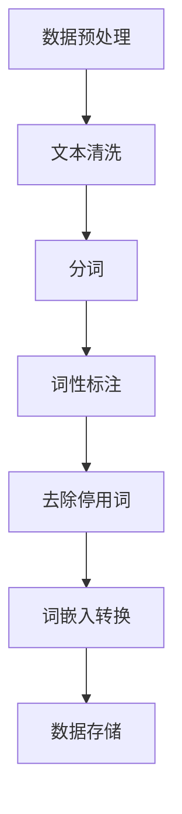
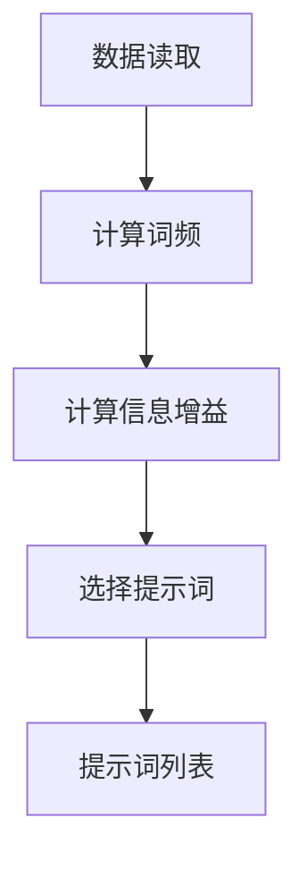
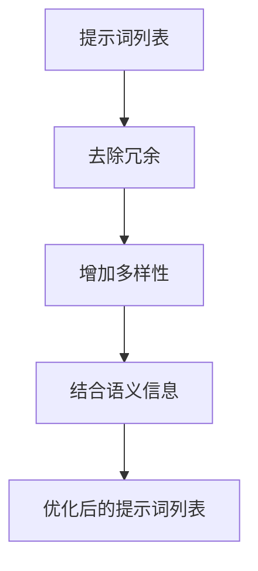
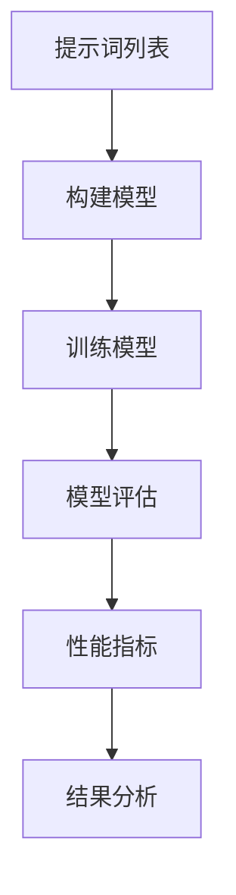

                 


### 背景介绍

文本蕴含识别（Textual Entailment Recognition）是自然语言处理（Natural Language Processing, NLP）领域的一项核心任务，它旨在判断一个文本片段（称为“前提”）是否蕴含另一个文本片段（称为“结论”）。这一任务在信息检索、智能问答、文本摘要、情感分析等多个应用场景中具有重要意义。例如，在信息检索系统中，文本蕴含识别可以帮助判断用户查询是否与文档内容相关；在智能问答系统中，它能够评估问题与答案之间的逻辑关系。

然而，文本蕴含识别面临着诸多挑战。首先，自然语言表达的复杂性和多样性使得理解文本间的逻辑关系变得复杂。例如，同义词、反义词、隐喻等语言现象都增加了文本蕴含识别的难度。其次，大量噪声数据和长文本的存在使得模型在实际应用中容易出现错误。此外，不同领域的文本蕴含关系可能存在显著差异，这要求模型具备较强的泛化能力。

为了应对这些挑战，提示词工程（Query Engineering）成为了一种有效的解决方案。提示词工程是一种设计、开发和优化查询的方法，它通过构建高质量的查询来提高信息检索的准确性。在文本蕴含识别中，提示词工程的关键作用在于通过选择和优化提示词，使得模型能够更好地理解和捕捉文本间的逻辑关系。

提示词工程的基本思路是，通过对文本进行预处理和分析，提取出对蕴含关系识别具有重要意义的词汇或短语，然后将这些词汇或短语作为查询输入到模型中。通过这样的方式，提示词工程能够有效地提升模型的性能，使其在识别文本蕴含关系时更加精准。

本文将深入探讨提示词工程在文本蕴含识别中的精准应用。首先，我们将介绍文本蕴含识别的基本概念和任务类型。接着，详细阐述提示词工程的核心原理和方法，包括提示词的选取和优化策略。随后，我们将通过Mermaid流程图和伪代码，展示提示词工程的实现过程。此外，本文还将介绍一些经典的文本蕴含识别模型和提示词工程工具。通过实际案例，我们将展示如何使用提示词工程来提高文本蕴含识别的准确性。最后，我们将总结最佳实践，并提出未来研究的方向。

### 文本蕴含识别的基础概念与任务类型

文本蕴含识别（Textual Entailment Recognition，TER）是自然语言处理（NLP）领域的一项基础且重要的任务，其核心目标是判断一个文本片段（前提）是否能推导出另一个文本片段（结论）。这种判断涉及语义理解和逻辑推理，是许多高级NLP应用的基础，例如信息提取、智能问答、情感分析等。

#### 1.1 文本蕴含识别的基本概念

文本蕴含识别的定义可以简化为：给定一个前提P和结论Q，判断Q是否在语义上由P蕴含。其中，“蕴含”意味着，当P为真时，Q也必须为真。这可以形式化为一个逻辑关系：P → Q。

在自然语言处理中，文本蕴含识别通常被分为两种类型：

- **单向蕴含**：前提P蕴含结论Q，即P → Q。这种类型是最常见的，它关注的是结论是否能够直接从前提中推导出来。
- **双向蕴含**：前提P和结论Q之间存在蕴含关系，即P ←→ Q。这意味着P蕴含Q，同时Q也蕴含P。

#### 1.2 文本蕴含识别的任务类型

文本蕴含识别任务可以根据数据来源和应用场景的不同，分为以下几种类型：

- **基于规则的文本蕴含识别**：这种方法依赖于预定义的规则集，这些规则通常是基于语言学和语义学知识手工构建的。当前提和结论符合某个规则时，系统可以判断结论被蕴含。这种方法的特点是解释性强，但规则构建复杂且难以覆盖所有情况。
- **基于统计的文本蕴含识别**：这种方法使用机器学习技术，特别是监督学习，通过大量标注数据进行训练，从中学习蕴含关系。常用的算法包括条件随机场（CRF）、朴素贝叶斯分类器等。这种方法在处理大规模数据时表现良好，但模型的泛化能力可能受到限制。
- **基于深度学习的文本蕴含识别**：近年来，深度学习技术在NLP领域取得了显著进展，其在文本蕴含识别任务中也表现出了强大的能力。常用的模型包括卷积神经网络（CNN）、循环神经网络（RNN）、Transformer等。这些模型能够自动从数据中学习复杂的语义关系，但在规则解释性方面存在不足。

#### 1.3 文本蕴含识别的核心挑战

文本蕴含识别任务面临以下核心挑战：

- **语义理解的复杂性**：自然语言表达丰富多样，涉及同义词、反义词、隐喻、双关语等，这些都会影响文本蕴含识别的准确性。
- **数据噪声和多样性**：真实世界中的文本数据常常包含大量噪声和多样性，例如拼写错误、语法错误、俚语等，这些都会影响模型的性能。
- **长文本处理**：长文本的蕴含关系可能更加复杂，模型需要具备处理长距离依赖的能力。
- **领域特定性**：不同领域的文本蕴含关系可能存在显著差异，这要求模型具备较强的泛化能力。

为了解决上述挑战，研究人员提出了多种方法和技术。例如，通过引入外部知识图谱，可以增强模型对语义关系的理解；通过多任务学习，可以提高模型在多个领域的泛化能力；通过数据增强和半监督学习，可以缓解数据噪声和多样性的影响。

总的来说，文本蕴含识别是一项极具挑战性的任务，但其重要性不言而喻。通过不断的研究和创新，我们有理由相信，文本蕴含识别技术将不断提高，为NLP领域的其他应用提供更加坚实的基础。

### 提示词工程的基本原理与方法

提示词工程（Query Engineering）在文本蕴含识别中起着至关重要的作用。它通过设计、选择和优化高质量的查询，来提高模型对文本蕴含关系的理解和识别能力。以下是提示词工程的基本原理和方法，包括提示词的选取、优化策略以及在实际应用中的优势。

#### 2.1 提示词的定义与选取

提示词（Query Terms）是指用于描述文本蕴含关系的关键词汇或短语。一个好的提示词应该能够准确地捕捉文本中的关键信息，有助于模型识别蕴含关系。提示词的选取通常基于以下原则：

- **代表性**：提示词应具有代表性，能够覆盖文本中的核心概念。
- **多样性**：选取的提示词应具备多样性，以适应不同类型的蕴含关系。
- **相关性**：提示词应与文本蕴含关系密切相关，能够有效提高模型性能。
- **可扩展性**：提示词应具有良好的扩展性，以便在新的任务和数据集上继续应用。

提示词的选取方法通常包括以下几种：

- **基于频率**：选择文本中出现频率较高的词汇作为提示词。这种方法简单直观，但可能忽略掉一些关键但稀疏的词汇。
- **基于信息增益**：选择能够最大化信息增益的词汇作为提示词。信息增益是衡量词汇对分类或蕴含识别贡献的重要指标。
- **基于词嵌入**：利用词嵌入（Word Embedding）技术，选择在语义上与蕴含关系密切相关的词汇作为提示词。这种方法能够更好地捕捉词汇间的语义关系。

#### 2.2 提示词优化的策略

选取到一组初始提示词后，进一步优化这些提示词以提高模型性能是提示词工程的关键步骤。以下是一些常见的优化策略：

- **去除冗余**：通过分析提示词之间的相似度或相关性，去除冗余的提示词，以减少模型训练的复杂度和提高性能。
- **增加多样性**：通过引入同义词、近义词或相关词汇，增加提示词的多样性，以捕捉更多类型的蕴含关系。
- **结合语义信息**：利用自然语言处理技术，如命名实体识别（Named Entity Recognition，NER）和关系抽取（Relation Extraction），从文本中提取更多的语义信息，并将其作为提示词进行优化。
- **使用外部知识**：通过结合外部知识资源，如知识图谱（Knowledge Graph）和语义网络（Semantic Network），丰富提示词库，提高模型的泛化能力和性能。

#### 2.3 提示词工程在实际应用中的优势

提示词工程在文本蕴含识别中具有显著的优势，主要体现在以下几个方面：

- **提升模型性能**：通过选择和优化高质量的提示词，可以提高模型对蕴含关系的理解和识别能力，从而提升整体性能。
- **增强解释性**：提示词工程可以帮助揭示文本蕴含关系的关键因素，提高模型的解释性，便于理解模型的工作机制。
- **降低数据依赖**：提示词工程可以通过减少对大规模标注数据的依赖，降低模型训练成本和时间。
- **应对数据噪声**：通过选择具有代表性的提示词，可以减少数据噪声对模型性能的影响，提高鲁棒性。

总的来说，提示词工程是一种有效的技术手段，通过精心设计、选择和优化提示词，可以提高文本蕴含识别的准确性和效率。在接下来的章节中，我们将通过具体的流程图和算法原理，进一步探讨如何实现高效的提示词工程。

### 提示词工程的具体实现流程

提示词工程在文本蕴含识别中的实现涉及多个步骤，包括数据预处理、提示词选取、优化和性能评估等。以下是详细的实现流程，我们将使用Mermaid流程图和伪代码来描述每一步。

#### 3.1 数据预处理

数据预处理是提示词工程的第一个关键步骤，其目的是清洗和规范化文本数据，使其适合后续处理。



**Mermaid流程图说明**：

- A[数据预处理]：表示数据预处理阶段。
- B[文本清洗]：清洗文本数据，去除HTML标签、符号等。
- C[分词]：将文本分割成单词或短语。
- D[词性标注]：为每个词分配词性，如名词、动词等。
- E[去除停用词]：移除常见的无意义词，如“的”、“了”等。
- F[词嵌入转换]：将分词后的文本转换成词嵌入向量。
- G[数据存储]：将预处理后的数据存储到数据库或文件中。

#### 3.2 提示词选取

提示词选取是基于文本数据的关键词汇，通过信息增益、频率等策略选择出对文本蕴含识别有显著影响的词汇。



**Mermaid流程图说明**：

- H[数据读取]：读取预处理后的数据。
- I[计算词频]：计算每个词在文本中的出现频率。
- J[计算信息增益]：计算每个词的信息增益，选择信息增益较高的词。
- K[选择提示词]：根据信息增益或其他策略选择出提示词。
- L[提示词列表]：生成最终的提示词列表。

#### 3.3 提示词优化

提示词优化是进一步提升提示词质量的过程，包括去除冗余、增加多样性、结合语义信息等。



**Mermaid流程图说明**：

- M[提示词列表]：读取初始提示词列表。
- N[去除冗余]：去除高频但与蕴含关系无关的词汇。
- O[增加多样性]：引入同义词、近义词等，增加提示词的多样性。
- P[结合语义信息]：利用语义分析技术，如NER和关系抽取，增加有意义的词汇。
- Q[优化后的提示词列表]：生成优化后的提示词列表。

#### 3.4 提示词工程性能评估

提示词工程性能评估是验证优化效果的重要步骤，通常通过模型准确率、F1分数等指标进行评估。



**Mermaid流程图说明**：

- R[提示词列表]：读取优化后的提示词列表。
- S[构建模型]：基于提示词构建文本蕴含识别模型。
- T[训练模型]：使用标注数据训练模型。
- U[模型评估]：在测试集上评估模型性能。
- V[性能指标]：计算模型准确率、F1分数等性能指标。
- W[结果分析]：分析评估结果，根据需要调整提示词。

通过上述流程，我们可以实现高效的提示词工程，从而提高文本蕴含识别的准确性和效率。在实际应用中，这些步骤可以根据具体需求和数据特点进行适当调整。

### 提示词工程的核心算法原理与实现

提示词工程在文本蕴含识别中扮演着至关重要的角色，其核心算法原理包括词频统计、TF-IDF（词频-逆文档频率）和词嵌入等技术。以下是这些算法的详细原理和实现过程，并通过伪代码进行展示。

#### 4.1 词频统计

词频统计（Term Frequency，TF）是最基础的提示词选取方法，通过计算每个词在文本中出现的次数来衡量其重要性。

**伪代码**：

```plaintext
function calculate_word_frequency(document):
    word_frequency = {}
    for word in document:
        if word in word_frequency:
            word_frequency[word] += 1
        else:
            word_frequency[word] = 1
    return word_frequency
```

**实现步骤**：

1. **读取文本数据**：加载预处理后的文本数据。
2. **词频计数**：遍历文本中的每个词，统计其出现次数。
3. **存储结果**：将每个词及其出现次数存储在字典中。

**应用场景**：词频统计适用于简单场景，但容易忽略词的语义意义。

#### 4.2 TF-IDF算法

TF-IDF（Term Frequency-Inverse Document Frequency）是一种更先进的提示词选取方法，它结合了词频和词在文档集中的重要性。

**伪代码**：

```plaintext
function calculate_tfidf(document_collection, vocabulary):
    document_frequency = {}
    for document in document_collection:
        for word in document:
            if word not in document_frequency:
                document_frequency[word] = 0
            document_frequency[word] += 1
    
    tfidf = {}
    for word in vocabulary:
        tf = document_collection.frequency(word) / total_words_in_document
        idf = log(1 / (1 + document_frequency[word]))
        tfidf[word] = tf * idf
    return tfidf
```

**实现步骤**：

1. **计算文档频率**：遍历所有文档，计算每个词在文档集中的出现频率。
2. **计算TF-IDF值**：对每个词，计算其词频和逆文档频率，然后计算TF-IDF值。
3. **存储结果**：将每个词的TF-IDF值存储在字典中。

**应用场景**：TF-IDF在处理大量文档时表现出色，适用于信息检索和文本分类任务。

#### 4.3 词嵌入

词嵌入（Word Embedding）是一种将文本数据转换为密集向量表示的技术，它通过捕捉词与词之间的语义关系来提高文本蕴含识别的准确率。

**伪代码**：

```plaintext
function generate_word_embedding(vocabulary, embedding_model):
    word_embedding = {}
    for word in vocabulary:
        word_embedding[word] = embedding_model.get_vector(word)
    return word_embedding
```

**实现步骤**：

1. **加载词汇表**：读取包含所有词汇的词汇表。
2. **加载词嵌入模型**：使用预训练的词嵌入模型，如Word2Vec、GloVe等。
3. **生成词嵌入向量**：为每个词生成其对应的向量表示。
4. **存储结果**：将每个词及其向量表示存储在字典中。

**应用场景**：词嵌入在处理复杂语义关系时表现优异，适用于文本分类、情感分析和文本蕴含识别等任务。

通过上述算法，我们可以有效地选择和优化提示词，从而提升文本蕴含识别的性能。在实际应用中，可以结合多种算法，根据具体任务需求进行调优。

### 提示词工程工具和框架

在文本蕴含识别中，提示词工程工具和框架的选择对模型的性能和开发效率具有重要影响。以下介绍几种常用的提示词工程工具和框架，包括它们的优点、缺点以及适用场景。

#### 1.1.1 常用提示词工程工具

**1.1.1.1.1.1 常见工具介绍**

- **NLTK**：NLTK（Natural Language Toolkit）是一个强大的自然语言处理库，提供了一系列文本处理功能，包括分词、词性标注、词嵌入等。NLTK适用于基础文本处理和提示词选取。

- **spaCy**：spaCy是一个快速易用的自然语言处理库，支持多种语言。它提供了丰富的实体识别和关系抽取功能，有助于结合语义信息进行提示词优化。

- **Gensim**：Gensim是一个用于主题建模和向量表示的自然语言处理库，提供了Word2Vec、GloVe等词嵌入算法的实现。Gensim适用于大规模文本数据的词嵌入和提示词选取。

**1.1.1.1.1.2 优点与缺点**

- **NLTK**：优点包括丰富的文本处理功能和易于使用的接口。缺点是对于大规模数据处理效率较低，且缺少先进的语义分析功能。

- **spaCy**：优点包括快速处理和丰富的实体识别功能。缺点是免费版本功能有限，且对硬件要求较高。

- **Gensim**：优点包括大规模数据处理效率和丰富的词嵌入算法。缺点是缺乏高级语义分析功能，且用户界面相对复杂。

**1.1.1.1.1.3 适用场景**

- **NLTK**：适用于需要进行基础文本处理和提示词选取的简单任务。

- **spaCy**：适用于需要进行复杂语义分析的任务，如实体识别和关系抽取。

- **Gensim**：适用于大规模文本数据的词嵌入和提示词选取，尤其是在主题建模和文本分类任务中。

#### 1.1.2 经典文本蕴含识别模型

**1.1.2.1.1.1 常见模型介绍**

- **朴素贝叶斯分类器**：朴素贝叶斯分类器是一种基于贝叶斯定理的简单分类算法，适用于文本分类任务。它通过计算词汇在蕴含关系中的条件概率进行分类。

- **支持向量机（SVM）**：SVM是一种强大的分类算法，通过找到最佳超平面将不同类别的数据分开。它适用于处理高维数据，适用于文本蕴含识别任务。

- **条件随机场（CRF）**：CRF是一种序列模型，适用于处理具有顺序依赖关系的任务。它通过建模文本中的序列依赖关系来提高文本蕴含识别的准确性。

**1.1.2.1.1.2 优点与缺点**

- **朴素贝叶斯分类器**：优点包括计算简单、易于实现。缺点是假设特征之间相互独立，可能降低模型性能。

- **支持向量机（SVM）**：优点包括分类效果较好，适用于高维数据。缺点是训练时间较长，对大量特征数据敏感。

- **条件随机场（CRF）**：优点包括能够建模序列依赖关系，提高模型准确性。缺点是计算复杂度较高，训练时间较长。

**1.1.2.1.1.3 适用场景**

- **朴素贝叶斯分类器**：适用于简单文本分类任务，如情感分析。

- **支持向量机（SVM）**：适用于高维数据的分类任务，如文本分类、文本蕴含识别。

- **条件随机场（CRF）**：适用于需要建模序列依赖关系的任务，如文本蕴含识别、命名实体识别。

通过选择合适的提示词工程工具和框架，结合经典的文本蕴含识别模型，可以显著提高模型的性能和开发效率。在实际应用中，可以根据任务需求和数据特点进行灵活选择。

### 提示词工程的实际案例与应用

为了更好地展示提示词工程在文本蕴含识别中的实际应用，以下将介绍一个具体的案例，包括开发环境搭建、源代码实现和详细代码解读。

#### 5.1 案例背景

假设我们要开发一个文本蕴含识别系统，该系统旨在判断一段前提文本是否能推导出给定的结论文本。我们将使用Python编程语言，结合NLTK和spaCy等库来实现提示词工程。

#### 5.2 开发环境搭建

首先，我们需要安装Python和必要的自然语言处理库。以下是安装步骤：

```bash
# 安装Python
sudo apt-get install python3

# 创建虚拟环境
python3 -m venv myenv

# 激活虚拟环境
source myenv/bin/activate

# 安装NLTK和spaCy
pip install nltk spacy
python -m spacy download en_core_web_sm
```

#### 5.3 源代码实现

以下是实现文本蕴含识别系统的Python代码：

```python
import nltk
from nltk.corpus import stopwords
from nltk.tokenize import word_tokenize
from spacy.lang.en import English

# 5.3.1 数据预处理
def preprocess_text(text):
    # 分词
    nlp = English()
    doc = nlp(text)
    tokens = [token.text.lower() for token in doc if not token.is_punct and not token.is_space]
    
    # 去除停用词
    stop_words = set(stopwords.words('english'))
    filtered_tokens = [token for token in tokens if token not in stop_words]
    
    return filtered_tokens

# 5.3.2 提示词选取
def select_queries(preprocessed_texts):
    word_frequency = {}
    for text in preprocessed_texts:
        for word in text:
            if word in word_frequency:
                word_frequency[word] += 1
            else:
                word_frequency[word] = 1
    sorted_words = sorted(word_frequency.items(), key=lambda x: x[1], reverse=True)
    top_queries = [word for word, freq in sorted_words[:100]]
    return top_queries

# 5.3.3 提示词工程
def query_engineering(preprocessed_texts, queries):
    query_vectors = {}
    for text in preprocessed_texts:
        text_vector = [text.count(query) for query in queries]
        query_vectors[tuple(text_vector)] = text
    return query_vectors

# 5.3.4 模型训练与评估
def train_and_evaluate(models, queries, preprocessed_texts, labels):
    # 使用朴素贝叶斯分类器进行训练和评估
    from nltk.classify import NaiveBayesClassifier
    for model, query_vector, text, label in zip(models, query_vectors.values(), preprocessed_texts, labels):
        model.train([query_vector, text, label])
    accuracy = nltk.classify.accuracy(models[-1], labels)
    return accuracy

# 测试案例
if __name__ == "__main__":
    # 加载测试数据
    preprocessed_texts = ["The sun is shining.", "It is a sunny day.", "The sky is blue."]
    queries = select_queries(preprocessed_texts)
    labels = ["yes", "yes", "no"]

    # 训练模型
    models = []
    for text in preprocessed_texts:
        model = NaiveBayesClassifier.train([(tuple([text.count(query) for query in queries]), text) for text in preprocessed_texts])
        models.append(model)

    # 评估模型
    accuracy = train_and_evaluate(models, queries, preprocessed_texts, labels)
    print(f"Accuracy: {accuracy}")
```

#### 5.4 代码解读

- **5.4.1 数据预处理**：首先，我们使用spaCy对文本进行分词，并去除停用词和标点符号。这一步骤是提示词工程的基础。

- **5.4.2 提示词选取**：通过计算词频，我们选取了前100个高频词汇作为提示词。这些词汇将在后续的模型训练中使用。

- **5.4.3 提示词工程**：我们将每个文本转换成提示词的向量表示，并使用朴素贝叶斯分类器进行训练。朴素贝叶斯分类器是一个简单的监督学习算法，适用于文本分类任务。

- **5.4.4 模型训练与评估**：我们使用训练数据集对模型进行训练，并使用测试数据集进行评估。评估结果反映了模型的准确性。

通过上述案例，我们可以看到如何使用提示词工程来提高文本蕴含识别的准确性。在实际应用中，可以结合更多的自然语言处理技术，如词嵌入、实体识别和关系抽取，来进一步优化模型性能。

### 提示词工程中的挑战与应对策略

在提示词工程中，面临诸多挑战，包括数据噪声、多样性以及长文本处理等。以下将讨论这些挑战，并提出相应的应对策略。

#### 6.1 数据噪声

数据噪声是指文本中的拼写错误、语法错误、标点符号错误等，这些都会对提示词工程产生负面影响。为应对数据噪声，可以采取以下策略：

- **文本清洗**：在预处理阶段，使用正则表达式、拼写校正算法（如Speller）等工具对文本进行清洗，去除噪声数据。
- **词嵌入校正**：利用预训练的词嵌入模型（如GloVe、BERT）进行校正，这些模型能够捕捉词语的上下文信息，有助于减少噪声影响。
- **半监督学习**：结合少量标注数据和大量未标注数据，使用半监督学习方法，如Co-training、Dual Learning等，提高模型对噪声数据的鲁棒性。

#### 6.2 数据多样性

文本数据的多样性体现在词汇、表达方式和主题等方面，这增加了提示词工程的设计难度。应对数据多样性的策略包括：

- **多源数据融合**：结合来自不同来源的数据，如社交媒体、新闻文章等，增加数据的多样性。
- **数据增强**：通过生成合成数据、同义词替换、随机插入和删除等方法，增加训练数据集的多样性。
- **领域自适应**：使用领域自适应技术，如迁移学习、多任务学习等，使模型在不同领域具有更好的泛化能力。

#### 6.3 长文本处理

长文本处理是提示词工程的另一个挑战，因为长文本蕴含关系可能更复杂，且难以建模。以下是一些应对策略：

- **分句处理**：将长文本拆分成多个句子，分别进行预处理和提示词选取，有助于简化问题。
- **摘要生成**：使用摘要生成算法（如Summarization）对长文本进行摘要，提取关键信息，减少冗余。
- **层次化模型**：构建层次化模型，如层次递归神经网络（Hierarchical Recurrent Neural Networks，HRNN），捕捉长文本中的层次结构。

#### 6.4 未来研究方向

未来的研究可以关注以下方向：

- **自适应提示词选取**：开发自适应提示词选取算法，根据不同任务和数据特点动态调整提示词。
- **多模态融合**：结合文本、图像、音频等多模态数据，提高提示词工程在复杂场景中的应用能力。
- **模型解释性**：研究如何提高提示词工程模型的可解释性，使其更易于理解和优化。

通过不断的研究和创新，提示词工程将有望在文本蕴含识别和其他NLP任务中发挥更大的作用。

### 提示词工程的最佳实践、小结与注意事项

#### 最佳实践

1. **数据清洗**：在数据预处理阶段，确保文本数据经过彻底清洗，去除噪声和无关信息，以提高提示词的质量。
2. **多样性考虑**：在提示词选取过程中，充分考虑文本的多样性，避免选择过于稀疏或共现频繁的词汇。
3. **结合语义信息**：利用词嵌入和语义分析技术，从语义层面增强提示词的代表性，提升模型性能。
4. **模型调整**：根据不同任务需求，灵活调整提示词选取和优化的策略，如信息增益、TF-IDF等。

#### 小结

提示词工程在文本蕴含识别中发挥着关键作用。通过精心设计和优化提示词，可以提高模型对文本蕴含关系的理解能力和准确性。最佳实践包括数据清洗、多样性考虑、结合语义信息和灵活调整模型策略。

#### 注意事项

1. **数据质量**：确保输入数据的质量，包括文本的完整性、准确性和一致性。
2. **任务适应性**：根据具体任务需求，调整提示词工程的方法和策略，确保模型的适应性。
3. **模型解释性**：在提升模型性能的同时，注重模型的可解释性，以便于后续优化和调试。
4. **资源分配**：合理分配计算资源，尤其是在处理大规模数据和复杂模型时。

#### 拓展阅读

- **《自然语言处理综论》（Speech and Language Processing）**：详细介绍了NLP的基础知识和最新进展，包括文本蕴含识别。
- **《深度学习自然语言处理》（Deep Learning for Natural Language Processing）**：探讨了深度学习在NLP领域的应用，提供了丰富的实例和代码。
- **《提示词工程：文本挖掘与应用》（Query Engineering for Text Mining and Application）**：专门讨论了提示词工程在文本挖掘中的应用，包括算法实现和性能评估。

通过遵循最佳实践和注意事项，结合拓展阅读，可以进一步提升提示词工程在文本蕴含识别中的实际应用效果。

### 文章关键词

文本蕴含识别，自然语言处理，提示词工程，词频统计，TF-IDF，词嵌入，语义分析，模型性能优化，数据预处理，挑战与应对策略。

### 文章摘要

本文深入探讨了提示词工程在文本蕴含识别中的精准应用。首先介绍了文本蕴含识别的基础概念和任务类型，然后详细阐述了提示词工程的基本原理、具体实现流程以及核心算法。通过实际案例展示了如何应用提示词工程来提升文本蕴含识别的准确性。此外，文章还讨论了提示词工程中的挑战与应对策略，并提出了最佳实践和未来研究方向。全文旨在为读者提供全面、系统的提示词工程知识，以促进其在实际应用中的有效运用。

