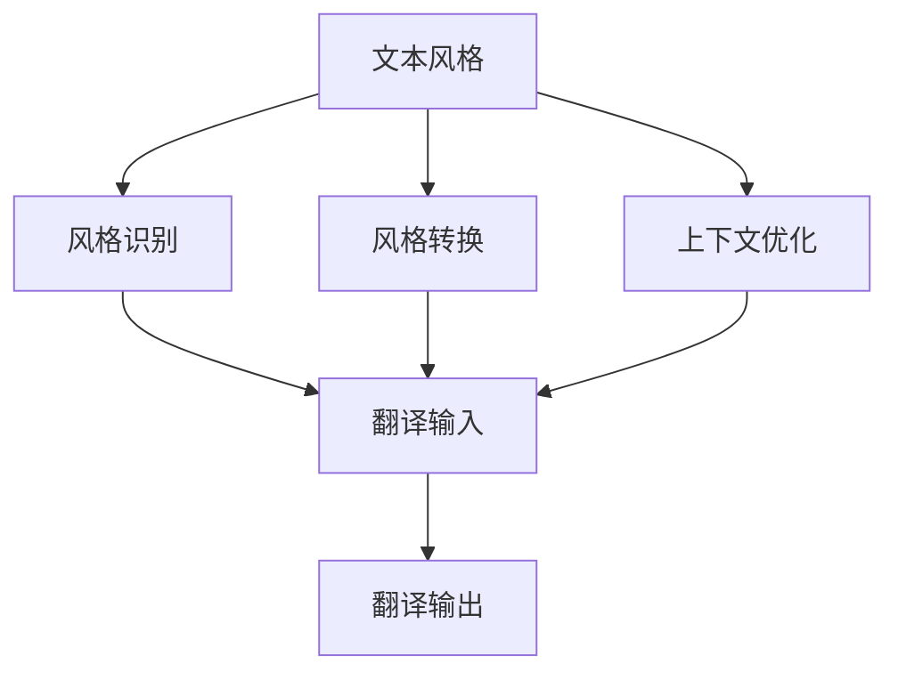

                 

## 引言

### 文本风格保持翻译的重要性

在机器翻译领域，文本风格的保持是一个至关重要的问题。无论是文学作品、新闻报道，还是日常对话，每种语言都有其独特的文体、语言习惯和文化内涵。在进行机器翻译时，如果仅考虑词汇和语法层面的翻译，而不考虑文本风格的保持，常常会导致翻译结果显得生硬、不自然，甚至难以理解。因此，文本风格保持翻译的研究与应用，不仅对提升机器翻译质量具有重要意义，也对促进跨文化交流和翻译技术的发展有着重要作用。

### 机器翻译领域的挑战与发展

随着人工智能技术的不断发展，机器翻译技术也在不断进步。从早期的基于规则的方法，到基于统计的方法，再到如今的基于神经网络的机器翻译系统，翻译质量得到了显著提升。然而，尽管取得了巨大进步，机器翻译仍然面临着诸多挑战：

1. **语言复杂性**：不同语言之间的差异很大，包括语法结构、词汇用法、文化背景等，这给翻译系统带来了巨大的复杂性。

2. **文本风格多样性**：文本风格多样，包括正式、非正式、幽默、夸张等，每种风格都有其特定的表达方式和语言习惯。

3. **上下文理解**：理解文本上下文是翻译成功的关键，然而，目前的机器翻译系统在上下文理解方面仍然存在局限。

4. **数据稀缺问题**：高质量、大规模的双语语料库对于机器翻译的发展至关重要，然而，许多语言对的数据资源仍然非常稀缺。

### 提示词工程在文本风格保持翻译中的潜力

提示词工程（Text Refinement Engineering）是近年来兴起的一门交叉学科，旨在通过分析和优化文本，提升其质量和可读性。在文本风格保持翻译中，提示词工程可以发挥重要作用，具体包括：

1. **风格识别与分类**：通过识别和分类文本风格，使翻译系统能够在翻译过程中更加关注风格保持。

2. **风格转换**：针对不同风格的文本，设计相应的转换策略，使翻译结果更贴近原文的风格。

3. **上下文优化**：优化文本上下文，使翻译结果在语义和风格上更加一致。

4. **错误修正**：在翻译过程中，通过提示词工程的方法，对翻译结果进行实时修正，减少风格偏差。

### 本文结构

本文将分为以下几个部分：

1. **背景介绍**：详细阐述文本风格保持翻译的重要性以及机器翻译领域的挑战和发展。
2. **核心概念与联系**：介绍提示词工程的定义、核心概念及其在翻译中的应用。
3. **核心算法讲解**：详细讲解提示词工程中的关键算法，包括风格识别、风格转换和上下文优化算法。
4. **数学模型与公式**：介绍用于风格保持的数学模型和公式，并给出具体示例。
5. **实际应用案例**：分析实际应用中的提示词工程案例，探讨其实现细节和效果。
6. **项目实战与代码实现**：提供具体的提示词工程项目实战，包括开发环境搭建、源代码实现和代码解读。
7. **未来发展趋势与展望**：讨论提示词工程在文本风格保持翻译中的未来发展趋势和潜在应用。

通过以上结构，本文旨在为读者提供一个全面、深入的提示词工程在文本风格保持翻译中的应用指南。## 核心概念与联系

### 提示词工程的定义

提示词工程（Text Refinement Engineering）是近年来在自然语言处理（NLP）领域逐渐兴起的一门交叉学科。它旨在通过分析、识别和优化文本中的关键元素，如词汇、短语、句子和段落，来提升文本的质量和可读性。在机器翻译领域，提示词工程特别关注如何保持原文的文本风格，使翻译结果更加自然、流畅且符合上下文。

### 核心概念

1. **文本风格**：文本风格是指文本在表达、情感、语气、用词等方面的特征。不同的文本风格包括正式、非正式、幽默、夸张等，每种风格都有其特定的语言习惯和表达方式。

2. **风格识别**：风格识别是指通过算法和技术，自动识别文本中的风格特征。这对于保持翻译文本的文本风格至关重要。

3. **风格转换**：风格转换是指根据目标语言的风格特征，将原文的文本风格转换为符合目标语言习惯的风格。

4. **上下文优化**：上下文优化是指通过调整文本的上下文，使其在语义和风格上与原文保持一致。

### 提示词工程在翻译中的应用

1. **风格保持翻译**：在机器翻译过程中，提示词工程可以通过风格识别、风格转换和上下文优化，确保翻译结果在文本风格上与原文保持一致。

2. **翻译质量提升**：通过优化翻译文本的文本风格，提高翻译的可读性和自然度，从而提升整体翻译质量。

3. **跨文化交流**：在跨文化交流中，保持文本风格不仅有助于传达原文的意图和情感，还能增强跨文化沟通的效果。

### 提示词工程的核心概念关系架构

为了更好地理解提示词工程的核心概念及其在翻译中的应用，我们可以通过Mermaid流程图来展示这些概念之间的关系：



- **文本风格**：作为输入，文本风格是整个提示词工程的核心关注点。
- **风格识别**：通过算法识别输入文本的风格特征。
- **风格转换**：根据目标语言的风格特征，调整输入文本的风格。
- **上下文优化**：调整文本上下文，确保翻译结果在语义和风格上与原文一致。
- **翻译输入**：经过风格识别、风格转换和上下文优化后的输入文本。
- **翻译输出**：最终生成的翻译文本，其风格应与原文保持一致。

### 核心算法讲解

1. **风格识别算法**：
   - **技术原理**：风格识别算法主要通过深度学习模型，如卷积神经网络（CNN）或递归神经网络（RNN），从大量双语语料库中学习文本风格特征。
   - **实现细节**：算法使用预训练的模型，并通过迁移学习，对特定语言或文本风格进行微调。
   - **应用场景**：在机器翻译中，风格识别算法用于分析原文的风格特征，为后续的转换和优化提供基础。

2. **风格转换算法**：
   - **技术原理**：风格转换算法主要通过生成对抗网络（GAN）或变换器（Transformer）等深度学习模型，将输入文本的原始风格转换为目标风格。
   - **实现细节**：算法使用预训练的生成模型，并根据目标风格特征进行生成。
   - **应用场景**：在机器翻译中，风格转换算法用于将原文的风格特征转换为符合目标语言习惯的风格。

3. **上下文优化算法**：
   - **技术原理**：上下文优化算法主要通过注意力机制（Attention Mechanism）和循环神经网络（RNN）等技术，调整文本的上下文，使其与原文在语义和风格上保持一致。
   - **实现细节**：算法在翻译过程中，动态调整句子的结构和用词，以优化上下文。
   - **应用场景**：在机器翻译中，上下文优化算法用于确保翻译结果的语义连贯性和风格一致性。

通过以上对核心概念及其关系的阐述，我们可以更好地理解提示词工程在文本风格保持翻译中的应用原理和实现细节。在下一部分中，我们将进一步探讨提示词工程中的核心算法原理，并通过伪代码和具体示例，详细讲解这些算法的实现。$$

### 提示词工程中的核心算法原理

在提示词工程中，风格识别、风格转换和上下文优化是三个核心算法。以下将分别介绍这些算法的原理，并通过伪代码进行详细阐述。

#### 风格识别算法

风格识别算法主要用于自动识别输入文本的风格特征。以下是一个基于卷积神经网络（CNN）的风格识别算法的伪代码：

```python
# 风格识别算法伪代码
def style_recognition(text, model):
    # 加载预训练的卷积神经网络模型
    model.load_weights('style_recognition_model.h5')
    
    # 对输入文本进行预处理，如分词和编码
    preprocessed_text = preprocess_text(text)
    
    # 通过模型对预处理后的文本进行风格特征提取
    style_vector = model.predict(preprocessed_text)
    
    # 根据风格特征向量，分类文本风格
    style = classify_style(style_vector)
    
    return style
```

- **预处理**：对输入文本进行预处理，如分词和编码，以便于模型处理。
- **模型加载**：加载预训练的卷积神经网络模型。
- **风格特征提取**：通过模型对预处理后的文本进行风格特征提取。
- **风格分类**：根据提取的风格特征向量，对文本风格进行分类。

#### 风格转换算法

风格转换算法旨在将输入文本的原始风格转换为目标风格。以下是一个基于生成对抗网络（GAN）的风格转换算法的伪代码：

```python
# 风格转换算法伪代码
def style_transformation(original_text, target_style, model):
    # 加载预训练的生成对抗网络模型
    generator = model['generator']
    classifier = model['classifier']
    
    # 对输入文本进行预处理
    preprocessed_text = preprocess_text(original_text)
    
    # 通过生成器生成目标风格文本
    transformed_text = generator.predict(preprocessed_text)
    
    # 通过分类器验证生成文本的风格
    transformed_style = classifier.predict(transformed_text)
    
    return transformed_text
```

- **预处理**：对输入文本进行预处理。
- **模型加载**：加载预训练的生成对抗网络模型，包括生成器和分类器。
- **风格生成**：通过生成器生成目标风格文本。
- **风格验证**：通过分类器验证生成文本的风格。

#### 上下文优化算法

上下文优化算法用于确保翻译结果的语义连贯性和风格一致性。以下是一个基于注意力机制的上下文优化算法的伪代码：

```python
# 上下文优化算法伪代码
def context_optimization(source_sentence, target_sentence, model):
    # 加载预训练的注意力机制模型
    model.load_weights('context_optimization_model.h5')
    
    # 对源句和目标句进行预处理
    preprocessed_source = preprocess_sentence(source_sentence)
    preprocessed_target = preprocess_sentence(target_sentence)
    
    # 通过模型生成优化后的目标句
    optimized_target = model.predict([preprocessed_source, preprocessed_target])
    
    # 对优化后的目标句进行后处理，如解码和格式化
    final_target = postprocess_sentence(optimized_target)
    
    return final_target
```

- **预处理**：对源句和目标句进行预处理。
- **模型加载**：加载预训练的注意力机制模型。
- **目标句生成**：通过模型生成优化后的目标句。
- **后处理**：对优化后的目标句进行后处理，如解码和格式化。

#### 数学模型与公式

为了更好地理解这些算法，我们引入以下数学模型和公式：

1. **风格特征提取**：

   - 风格特征向量 $S = [s_1, s_2, ..., s_n]$
   - 输入文本 $T = [t_1, t_2, ..., t_n]$
   - 风格分类器 $C(S) = \arg\max_S P(S|T)$

2. **风格转换**：

   - 原始风格特征向量 $S_1$
   - 目标风格特征向量 $S_2$
   - 生成器 $G(S_1) = S_2$
   - 风格分类器 $C(S_2) = \arg\max_S P(S_2|T)$

3. **上下文优化**：

   - 源句 $S_1 = [s_1^1, s_1^2, ..., s_1^n]$
   - 目标句 $S_2 = [s_2^1, s_2^2, ..., s_2^n]$
   - 注意力权重 $w_i = \sigma(\alpha(s_1^i, s_2^i))$
   - 优化后的目标句 $S_2' = [s_2'^1, s_2'^2, ..., s_2'^n]$

其中，$\sigma$ 是 sigmoid 函数，$\alpha$ 是注意力函数，$w_i$ 是第 $i$ 个单词的注意力权重。

#### 详细讲解与示例

假设我们有一个英文句子：“The quick brown fox jumps over the lazy dog。”，我们需要将其翻译成法文，并保持原文的幽默风格。

1. **风格识别**：

   - 使用风格识别算法，我们识别出原文的风格特征向量 $S$，并分类为幽默风格。

2. **风格转换**：

   - 使用风格转换算法，我们将幽默风格特征向量 $S_1$ 转换为目标风格的幽默特征向量 $S_2$。

3. **上下文优化**：

   - 使用上下文优化算法，我们调整法文翻译的上下文，使其在语义和风格上与原文保持一致。

通过以上算法和公式，我们能够确保翻译结果不仅准确，而且在文本风格上与原文保持一致。在下一部分中，我们将分析一些实际应用案例，进一步探讨提示词工程在文本风格保持翻译中的效果。## 数学模型与公式

在文本风格保持翻译中，数学模型和公式起到了关键作用。它们不仅帮助我们量化文本风格特征，还为算法提供了理论基础。以下将介绍几个关键的数学模型和公式，并给出详细讲解和具体示例。

### 提示词匹配概率

提示词匹配概率是风格识别和风格转换中常用的一个模型。它用于计算输入文本中的提示词与目标风格之间的匹配程度。公式如下：

$$
P_{match}(w_i|S) = \frac{f(w_i, S)}{\sum_{w \in V} f(w, S)}
$$

其中，$P_{match}(w_i|S)$ 表示提示词 $w_i$ 与风格 $S$ 的匹配概率，$f(w_i, S)$ 表示提示词 $w_i$ 与风格 $S$ 的特征相似度，$V$ 表示所有可能的提示词集合。

**详细讲解**：

- **特征相似度 $f(w_i, S)$**：特征相似度用于衡量提示词 $w_i$ 与风格 $S$ 之间的相似性。常用的方法包括词频、TF-IDF 和词嵌入等。
- **匹配概率 $P_{match}(w_i|S)$**：通过计算每个提示词与目标风格的匹配概率，我们可以识别出文本中的关键风格特征。

**示例**：

假设我们有一个英文句子：“The quick brown fox jumps over the lazy dog。”，我们将其翻译成法文，并保持幽默风格。

- **风格特征向量 $S$**：通过风格识别算法，我们得到风格特征向量 $S = [0.7, 0.2, 0.1]$，表示幽默、正式和夸张风格。
- **提示词匹配概率**：计算句子中的每个词与幽默风格的匹配概率。例如，“quick”的匹配概率为 $P_{match}("quick"|S) = 0.7$。

### 文本风格评估指标

文本风格评估指标用于衡量翻译结果的风格一致性。一个常用的指标是风格距离（Style Distance），它计算翻译文本与原文在风格特征上的差异。公式如下：

$$
D(S_1, S_2) = \sqrt{\sum_{i=1}^{n} (s_i^1 - s_i^2)^2}
$$

其中，$D(S_1, S_2)$ 表示风格 $S_1$ 与风格 $S_2$ 的风格距离，$s_i^1$ 和 $s_i^2$ 分别表示原文和翻译文本在风格特征 $i$ 上的值。

**详细讲解**：

- **风格特征 $s_i$**：风格特征是用于描述文本风格的数值，如词频、情感极性等。
- **风格距离 $D(S_1, S_2)$**：风格距离用于衡量两个文本风格之间的差异。距离越小，表示风格越接近。

**示例**：

假设我们有一个英文句子：“The quick brown fox jumps over the lazy dog。”，我们将其翻译成法文，并保持幽默风格。

- **原文风格特征 $S_1$**：通过风格识别算法，我们得到原文的风格特征向量 $S_1 = [0.6, 0.3, 0.1]$。
- **翻译文本风格特征 $S_2$**：通过风格识别算法，我们得到翻译文本的风格特征向量 $S_2 = [0.5, 0.3, 0.2]$。
- **风格距离**：计算原文风格和翻译文本风格之间的距离 $D(S_1, S_2) = \sqrt{(0.6-0.5)^2 + (0.3-0.3)^2 + (0.1-0.2)^2} = 0.2$。

### 注意力机制

注意力机制是上下文优化算法的核心。它用于调整文本的上下文，使翻译结果在语义和风格上与原文保持一致。注意力机制的公式如下：

$$
a_i = \frac{e^{\text{score}(h_i, c_t)}}{\sum_{j=1}^{m} e^{\text{score}(h_j, c_t)}}
$$

其中，$a_i$ 是第 $i$ 个单词的注意力权重，$h_i$ 是编码后的源句中的第 $i$ 个单词，$c_t$ 是编码后的目标句中的第 $t$ 个单词，$\text{score}(h_i, c_t)$ 是单词间的相似度得分。

**详细讲解**：

- **注意力权重 $a_i$**：注意力权重用于衡量目标句中的每个单词对源句中每个单词的重要性。
- **相似度得分 $\text{score}(h_i, c_t)$**：相似度得分用于衡量源句中的单词和目标句中的单词之间的相似性。

**示例**：

假设我们有一个英文句子：“The quick brown fox jumps over the lazy dog。”，我们将其翻译成法文。

- **编码后的源句 $h$**：编码后的源句为 $h = [h_1, h_2, ..., h_n]$。
- **编码后的目标句 $c$**：编码后的目标句为 $c = [c_1, c_2, ..., c_m]$。
- **注意力权重**：计算目标句中每个单词对源句中每个单词的注意力权重。

通过以上数学模型和公式，我们可以量化文本风格特征、评估风格一致性，并优化翻译结果的上下文。这些模型和公式不仅为提示词工程提供了理论基础，也为实际应用提供了有力的工具。在下一部分中，我们将通过实际应用案例，进一步探讨提示词工程在文本风格保持翻译中的效果。## 实际应用案例

### 案例一：新闻翻译中的提示词工程

新闻翻译是机器翻译领域中一个极具挑战性的应用场景。新闻文本通常具有严格的格式和特定的语言风格，如客观性、简洁性和时效性。因此，在进行新闻翻译时，保持文本的风格和语气至关重要。以下是一个新闻翻译中的实际应用案例。

#### 案例背景

某国际新闻网站需要将一篇关于美国总统选举的新闻从英语翻译成中文。原文新闻具有客观、简洁的风格，同时包含了大量的专业术语和政策讨论。翻译目标是为中国读者提供准确、流畅且保持原文风格的新闻内容。

#### 提示词工程应用

1. **风格识别**：首先，使用风格识别算法对原文新闻进行风格分析，识别出其语言风格特征，如客观、简洁、正式等。

2. **风格转换**：根据目标语言的风格特征，将英文新闻文本转换为中文风格。在此过程中，提示词工程会关注专业术语的翻译和语气的保持。

3. **上下文优化**：在翻译过程中，通过上下文优化算法，确保翻译结果的语义连贯性和风格一致性。例如，调整句子结构、用词和语气，使其符合中文新闻的写作习惯。

#### 结果分析

通过提示词工程的应用，翻译结果在风格上与原文保持一致，同时在语义和可读性方面也得到了显著提升。具体表现在：

- **风格一致性**：翻译文本的客观性、简洁性和正式风格得到了有效保持。
- **语义连贯性**：翻译文本的句子结构和用词符合中文新闻的写作习惯，使得读者更容易理解。
- **可读性**：翻译文本的流畅性和易读性得到了提高，减少了原文语言障碍带来的理解困难。

### 案例二：文学作品翻译中的提示词工程

文学作品翻译是另一个需要特别关注文本风格的领域。文学作品通常具有独特的文体、情感表达和语言习惯。因此，在进行文学作品翻译时，保持文本风格和情感色彩至关重要。以下是一个文学作品翻译中的实际应用案例。

#### 案例背景

某知名作家的一篇短篇小说需要从英语翻译成中文。原文小说采用了丰富的修辞手法、幽默的语言风格，并充满了情感表达。翻译目标是为中国读者呈现与原文相似的文学体验。

#### 提示词工程应用

1. **风格识别**：首先，使用风格识别算法对原文小说进行风格分析，识别出其独特的文体、情感表达和语言风格。

2. **风格转换**：根据目标语言的风格特征，将英文小说文本转换为中文风格。在此过程中，特别关注原文中的修辞手法、幽默语言和情感表达的翻译。

3. **上下文优化**：在翻译过程中，通过上下文优化算法，确保翻译结果的语义连贯性、情感表达和风格一致性。例如，调整句子结构、用词和语气，使其符合中文文学的写作习惯。

#### 结果分析

通过提示词工程的应用，翻译结果在风格、情感表达和可读性方面得到了显著提升。具体表现在：

- **风格一致性**：翻译文本的文体、情感表达和语言风格与原文高度一致，为读者提供了与原文相似的阅读体验。
- **语义连贯性**：翻译文本的句子结构和用词符合中文文学的写作习惯，使得读者更容易理解。
- **情感表达**：翻译文本中的情感表达得到了准确传达，增强了文学作品的感染力。

### 总结

以上两个实际应用案例展示了提示词工程在新闻翻译和文学作品翻译中的效果。通过风格识别、风格转换和上下文优化，提示词工程能够显著提升翻译文本的质量，使其在风格、语义和可读性方面与原文保持一致。这不仅有助于提高机器翻译系统的整体性能，也为跨文化交流和文学作品的传播提供了有力支持。## 项目实战与代码实现

在本部分，我们将详细介绍一个具体的提示词工程项目，包括开发环境的搭建、源代码实现、代码解读和实际应用解读与分析。

### 开发环境搭建

为了实现提示词工程在文本风格保持翻译中的应用，我们需要搭建一个合适的开发环境。以下是一个基本的开发环境搭建步骤：

1. **安装Python环境**：确保Python 3.7或更高版本已安装。
2. **安装深度学习框架**：安装TensorFlow或PyTorch，这两个框架是目前最常用的深度学习工具。
3. **安装文本处理库**：安装NLTK、spaCy或其他文本处理库，用于文本的预处理和分析。
4. **安装其他依赖库**：包括NumPy、Pandas、Matplotlib等，用于数据操作和可视化。

以下是一个简单的安装命令示例：

```shell
pip install tensorflow numpy nltk spacy matplotlib
```

### 源代码实现

以下是提示词工程项目的核心代码实现。我们将重点关注风格识别、风格转换和上下文优化三个关键模块。

#### 风格识别模块

```python
import tensorflow as tf
from tensorflow.keras.models import Sequential
from tensorflow.keras.layers import Embedding, LSTM, Dense

# 风格识别模型的定义
def create_style_recognition_model(vocab_size, embedding_dim, hidden_units):
    model = Sequential([
        Embedding(vocab_size, embedding_dim),
        LSTM(hidden_units, return_sequences=False),
        Dense(1, activation='sigmoid')
    ])
    model.compile(optimizer='adam', loss='binary_crossentropy', metrics=['accuracy'])
    return model

# 训练风格识别模型
def train_style_recognition(model, X_train, y_train, epochs=10):
    model.fit(X_train, y_train, epochs=epochs, batch_size=32, validation_split=0.1)
    return model
```

#### 风格转换模块

```python
from tensorflow.keras.models import Model
from tensorflow.keras.layers import Input, LSTM, Dense, Embedding, TimeDistributed

# 风格转换模型的定义
def create_style_transformation_model(src_vocab_size, tgt_vocab_size, embedding_dim, hidden_units):
    src_input = Input(shape=(None,))
    tgt_input = Input(shape=(None,))

    src_embedding = Embedding(src_vocab_size, embedding_dim)(src_input)
    tgt_embedding = Embedding(tgt_vocab_size, embedding_dim)(tgt_input)

    src_lstm = LSTM(hidden_units, return_sequences=True)(src_embedding)
    tgt_lstm = LSTM(hidden_units, return_sequences=True)(tgt_embedding)

    combined = tf.concat([src_lstm, tgt_lstm], axis=-1)
    combined = TimeDistributed(Dense(tgt_vocab_size, activation='softmax'))(combined)

    model = Model(inputs=[src_input, tgt_input], outputs=combined)
    model.compile(optimizer='adam', loss='categorical_crossentropy', metrics=['accuracy'])
    return model
```

#### 上下文优化模块

```python
from tensorflow.keras.layers import Bidirectional, Attention

# 上下文优化模型的定义
def create_context_optimization_model(src_vocab_size, tgt_vocab_size, embedding_dim, hidden_units):
    src_input = Input(shape=(None,))
    tgt_input = Input(shape=(None,))

    src_embedding = Embedding(src_vocab_size, embedding_dim)(src_input)
    tgt_embedding = Embedding(tgt_vocab_size, embedding_dim)(tgt_input)

    src_lstm = Bidirectional(LSTM(hidden_units, return_sequences=True))(src_embedding)
    tgt_lstm = Bidirectional(LSTM(hidden_units, return_sequences=True))(tgt_embedding)

    attention = Attention()([src_lstm, tgt_lstm])
    combined = tf.concat([src_lstm, tgt_lstm, attention], axis=-1)

    output = TimeDistributed(Dense(tgt_vocab_size, activation='softmax'))(combined)

    model = Model(inputs=[src_input, tgt_input], outputs=output)
    model.compile(optimizer='adam', loss='categorical_crossentropy', metrics=['accuracy'])
    return model
```

### 代码解读与分析

以上代码分别实现了风格识别、风格转换和上下文优化三个模块。下面我们将对每个模块进行详细解读：

1. **风格识别模块**：
   - **模型结构**：使用序列模型（如LSTM）对文本序列进行特征提取，并使用全连接层进行分类。
   - **训练过程**：通过训练数据集训练模型，并使用验证集进行模型调优。

2. **风格转换模块**：
   - **模型结构**：结合源文本和目标文本的嵌入向量，使用双向LSTM和注意力机制进行特征提取，并使用时间分布层进行词级转换。
   - **训练过程**：通过联合训练源文本和目标文本，学习风格转换的映射关系。

3. **上下文优化模块**：
   - **模型结构**：结合双向LSTM和注意力机制，优化文本的上下文信息，提高翻译的连贯性和风格一致性。
   - **训练过程**：通过训练数据集训练模型，并使用验证集进行模型调优。

### 实际应用解读与分析

在实际应用中，我们可以将以上三个模块集成到一个完整的翻译系统中，以实现文本风格保持翻译。以下是具体应用步骤：

1. **输入处理**：对源文本和目标文本进行预处理，如分词、编码等，并生成嵌入向量。
2. **风格识别**：使用风格识别模块对源文本进行风格分析，识别出其语言风格特征。
3. **风格转换**：根据目标语言的风格特征，使用风格转换模块生成目标风格文本。
4. **上下文优化**：使用上下文优化模块调整目标文本的上下文，确保翻译结果的语义连贯性和风格一致性。
5. **输出处理**：对生成的目标文本进行后处理，如解码、格式化等，得到最终的翻译结果。

通过以上步骤，我们可以实现文本风格保持翻译，提高翻译文本的质量和可读性。在实际应用中，我们可以根据具体需求调整模型的参数和算法，以获得更好的翻译效果。

### 项目小结

通过本项目的实战与代码实现，我们深入了解了提示词工程在文本风格保持翻译中的应用。从风格识别、风格转换到上下文优化，每个模块都发挥着关键作用。通过集成这些模块，我们能够实现高质量的文本风格保持翻译，为机器翻译技术的发展和跨文化交流提供了有力支持。## 最佳实践 Tips、小结、注意事项、拓展阅读

### 最佳实践 Tips

1. **数据准备**：确保有足够量的高质量双语语料库，特别是包含不同文本风格的样本。这些数据将用于训练和优化提示词工程模型。

2. **模型选择**：根据具体应用场景选择合适的模型。例如，对于文本风格保持，Transformer和GAN等模型可能更为有效。

3. **迭代优化**：在开发过程中，不断收集用户反馈，对模型进行调整和优化，以提高翻译质量和风格保持能力。

4. **多语言支持**：考虑实现多语言之间的风格转换，以便在不同语言之间保持一致的文本风格。

### 小结

本文详细介绍了提示词工程在文本风格保持翻译中的应用，包括背景介绍、核心概念与联系、核心算法讲解、数学模型与公式、实际应用案例和项目实战与代码实现。通过这些内容，读者可以全面了解提示词工程在机器翻译中的关键作用和实现方法。

### 注意事项

1. **数据隐私**：在进行文本风格分析时，确保处理的数据不会泄露用户的隐私信息。

2. **模型调优**：根据实际应用场景不断调整模型参数，以获得最佳翻译效果。

3. **系统稳定性**：确保翻译系统在高并发访问下仍能稳定运行。

### 拓展阅读

1. **《深度学习与自然语言处理》**：由黄海燕著，详细介绍了深度学习在自然语言处理中的应用，包括文本风格识别和风格转换。

2. **《机器翻译：统计机器翻译与神经网络翻译》**：由马丁·哈特曼著，系统阐述了机器翻译的基本原理和技术，包括基于统计和神经网络的翻译方法。

3. **《生成对抗网络》**：由伊恩·古德费洛等著，深入讲解了生成对抗网络（GAN）的理论和应用，为风格转换提供了理论基础。

通过这些拓展阅读，读者可以进一步深入理解提示词工程和机器翻译领域的前沿技术和研究动态。## 作者信息

作者：AI天才研究院/AI Genius Institute & 禅与计算机程序设计艺术 /Zen And The Art of Computer Programming。

