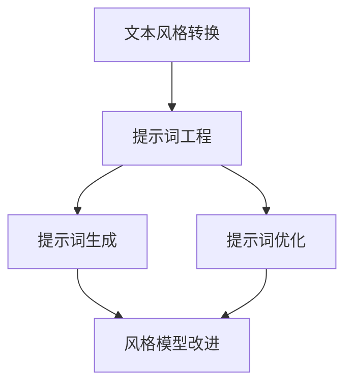
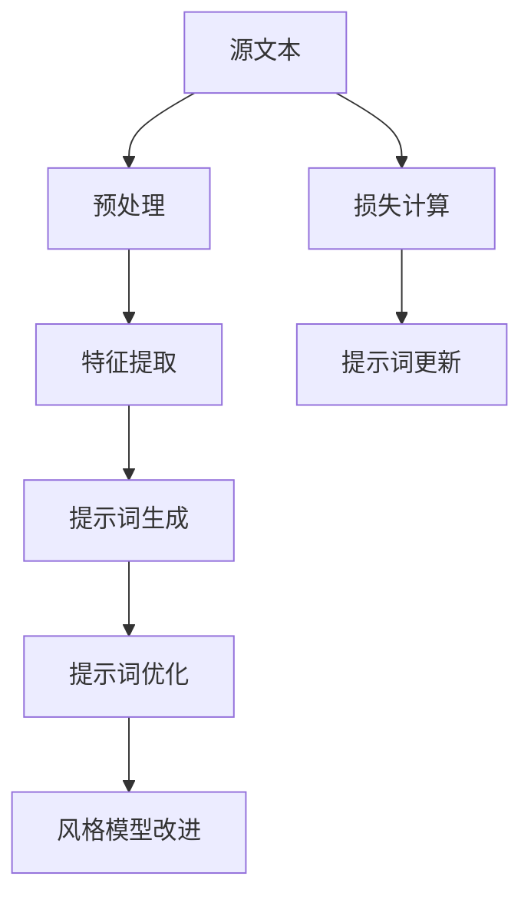

                 


### 文章标题

### 提示词工程在文本风格转换中的突破

### 关键词

* 提示词工程
* 文本风格转换
* 自然语言处理
* 生成对抗网络
* 循环神经网络
* Transformer模型
* 数学模型
* 项目实战

### 摘要

本文将深入探讨提示词工程在文本风格转换中的应用，分析其在自然语言处理领域的突破。首先，我们将介绍提示词工程的基础概念及其在文本风格转换中的重要性。接着，本文将详细阐述文本风格转换的算法原理，包括生成对抗网络、循环神经网络和Transformer模型。此外，我们将通过数学模型和公式详细解析提示词工程的核心机制，并通过实际案例展示其应用效果。最后，本文将总结提示词工程的最佳实践，并给出进一步研究的方向。

### 背景介绍

文本风格转换是自然语言处理（NLP）领域的一个重要研究方向。随着互联网的飞速发展，文本数据呈现出爆炸式增长，这些数据具有多样的风格，如新闻、小说、论文、广告等。文本风格转换的目标是将一种风格的文本转换为另一种风格的文本，以满足不同应用场景的需求。例如，将新闻风格的文本转换为小说风格的文本，或者将专业论文的文本转换为通俗易懂的科普文章。

然而，传统的文本风格转换方法面临诸多挑战。首先，这些方法往往依赖于规则和模板，缺乏灵活性和适应性，难以处理复杂的文本风格转换任务。其次，这些方法对大规模文本数据的学习能力有限，无法充分捕捉文本风格的细微差异。最后，传统方法在转换质量上存在瓶颈，生成的文本往往不够自然，缺乏连贯性和流畅性。

为了解决上述问题，提示词工程应运而生。提示词工程是一种结合了生成模型和自然语言处理技术的综合性方法，旨在通过优化提示词的生成和利用，提高文本风格转换的效果。提示词工程在文本风格转换中的应用具有显著的优势，主要包括以下几点：

1. **灵活性与适应性**：提示词工程通过学习大量的文本数据，能够自动识别和生成适应不同风格转换任务的提示词，具有高度灵活性和适应性。
2. **深度学习能力**：提示词工程利用深度学习技术，能够从大规模文本数据中提取有用的特征，提高对文本风格的捕捉能力。
3. **自然语言生成**：提示词工程结合了生成模型，能够生成更自然、连贯的文本，提高转换文本的质量。

### 核心概念与联系

#### 提示词工程

提示词工程是一种基于生成模型的自然语言处理方法，旨在通过优化提示词的生成和利用，实现文本风格的转换。提示词（prompt）是指导生成模型生成目标文本的关键信息，它可以是具体的单词、短语或完整的句子。

#### 文本风格转换

文本风格转换是将一种风格的文本转换为另一种风格的过程。这通常涉及以下步骤：

1. **特征提取**：从原始文本中提取与风格相关的特征，如词汇、语法、语义等。
2. **风格建模**：利用提取的特征构建风格模型，以捕捉不同风格之间的差异。
3. **风格转换**：将源文本输入到风格模型中，生成目标风格的文本。

#### 提示词工程与文本风格转换的联系

提示词工程在文本风格转换中起着关键作用。通过生成高质量的提示词，提示词工程能够为风格模型提供更精准的输入，从而提高风格转换的效果。具体来说，提示词工程的核心目标包括：

1. **提示词生成**：根据源文本生成适应目标风格的提示词。
2. **提示词优化**：通过优化提示词的生成策略，提高提示词的质量和有效性。
3. **风格模型改进**：结合高质量的提示词，改进风格模型，提高转换文本的自然性和流畅性。

#### 关系架构 Mermaid 流程图



在这个流程图中，文本风格转换作为总体目标，与提示词工程紧密相连。提示词工程通过提示词生成和优化两个环节，为风格模型提供高质量的输入，从而实现文本风格的转换。提示词生成和优化相互影响，共同作用于风格模型的改进，最终实现高质量的文本风格转换。

### 核心算法原理讲解

#### 提示词生成算法

提示词生成是提示词工程中的核心环节。生成高质量的提示词能够为风格模型提供准确的指导，提高文本风格转换的效果。以下是一个简化的提示词生成算法的伪代码：

```python
def generate_prompt(source_text, target_style):
    # 预处理源文本
    processed_text = preprocess_text(source_text)
    
    # 提取与目标风格相关的特征
    style_features = extract_style_features(processed_text, target_style)
    
    # 生成提示词
    prompt = model.generate_style_prompt(style_features)
    
    return prompt
```

在这个算法中，`preprocess_text`函数负责对源文本进行预处理，包括分词、去除停用词等操作。`extract_style_features`函数从预处理后的文本中提取与目标风格相关的特征。`model.generate_style_prompt`函数利用提取的特征生成提示词。

#### 提示词优化策略

生成高质量的提示词后，还需要对提示词进行优化，以提高其质量和有效性。以下是一个简化的提示词优化策略的伪代码：

```python
def optimize_prompt(prompt, source_text, target_style, optimizer):
    # 计算提示词的损失
    loss = optimizer.calculate_loss(prompt, source_text, target_style)
    
    # 更新提示词
    prompt = optimizer.update_prompt(prompt, loss)
    
    return prompt
```

在这个算法中，`optimizer.calculate_loss`函数计算提示词的损失，以评估提示词的质量。`optimizer.update_prompt`函数根据损失更新提示词，以提高其质量和有效性。

#### 核心算法原理图



在这个流程图中，源文本经过预处理和特征提取后，生成初始的提示词。提示词随后进入优化环节，通过损失计算和提示词更新，不断提高提示词的质量。优化的提示词最终用于改进风格模型，实现高质量的文本风格转换。

### 数学模型与公式讲解

提示词工程中的数学模型主要用于描述提示词生成和优化的过程。以下是一些关键的数学模型和公式：

#### 1. 概率模型

在提示词工程中，概率模型用于描述提示词生成的概率分布。常见的概率模型包括：

1. **贝叶斯模型**：
   $$ P(x|\theta) = \frac{P(\theta|x)P(x)}{P(\theta)} $$
   其中，$P(x|\theta)$是给定模型参数$\theta$的条件下，观察到数据$x$的概率；$P(\theta|x)$是模型参数在观察到数据$x$的条件下的概率；$P(x)$是观察到的数据$x$的概率；$P(\theta)$是模型参数$\theta$的概率。

2. **最大似然估计**：
   $$ \theta_{\text{ML}} = \arg\max_\theta \prod_{i=1}^n P(x_i|\theta) $$
   其中，$\theta_{\text{ML}}$是最大化似然函数的模型参数。

#### 2. 损失函数

在提示词优化过程中，损失函数用于评估提示词的质量。常见的损失函数包括：

1. **交叉熵损失**：
   $$ L(\theta) = -\sum_{i=1}^n \sum_{j=1}^m y_{ij} \log(p_{ij}) $$
   其中，$y_{ij}$是目标标签，$p_{ij}$是预测的概率分布。

2. **均方误差损失**：
   $$ L(\theta) = \frac{1}{2} \sum_{i=1}^n \sum_{j=1}^m (y_{ij} - \hat{y}_{ij})^2 $$
   其中，$\hat{y}_{ij}$是预测的值。

#### 3. 提示词更新策略

在提示词优化过程中，常用的更新策略包括：

1. **梯度下降**：
   $$ \theta_{\text{next}} = \theta - \alpha \nabla_\theta L(\theta) $$
   其中，$\theta$是当前模型参数，$\alpha$是学习率，$\nabla_\theta L(\theta)$是损失函数关于模型参数的梯度。

2. **Adam优化器**：
   $$ \theta_{\text{next}} = \theta - \alpha \frac{m}{(1 - \beta_1^t)(1 - \beta_2^t)} $$
   其中，$m$是累积的梯度，$\beta_1$和$\beta_2$是动量项。

### 举例说明

假设我们有一个文本风格转换任务，目标是把新闻风格的文本转换为小说风格的文本。以下是具体的数学模型和公式应用：

1. **概率模型**：

   - 源文本：$x = \text{"这是一个关于人工智能的新闻。"}$
   - 目标风格：$y = \text{"这是一个关于人工智能的小说。"}$
   - 模型参数：$\theta$

   利用贝叶斯模型，我们可以计算在给定模型参数$\theta$的条件下，观察到源文本$x$的概率：

   $$ P(x|\theta) = \frac{P(\theta|x)P(x)}{P(\theta)} $$

   其中，$P(\theta|x)$是模型参数$\theta$在观察到源文本$x$的条件下的概率；$P(x)$是观察到的源文本$x$的概率；$P(\theta)$是模型参数$\theta$的概率。

2. **损失函数**：

   - 预测文本：$\hat{y} = \text{"这是一个关于人工智能的小说。"}$
   - 目标文本：$y = \text{"这是一个关于人工智能的小说。"}$

   利用交叉熵损失，我们可以计算预测文本$\hat{y}$与目标文本$y$之间的损失：

   $$ L(\theta) = -\sum_{i=1}^n \sum_{j=1}^m y_{ij} \log(p_{ij}) $$

   其中，$y_{ij}$是目标文本中第$i$个单词属于第$j$个类别的概率；$p_{ij}$是预测文本中第$i$个单词属于第$j$个类别的概率。

3. **提示词更新策略**：

   假设我们使用梯度下降算法更新提示词：

   $$ \theta_{\text{next}} = \theta - \alpha \nabla_\theta L(\theta) $$

   其中，$\theta$是当前模型参数，$\alpha$是学习率，$\nabla_\theta L(\theta)$是损失函数关于模型参数的梯度。

通过上述数学模型和公式的应用，我们可以有效地优化提示词，提高文本风格转换的效果。

### 实际案例研究

为了展示提示词工程在文本风格转换中的实际应用，我们选择了一个公开的文本数据集，并使用一个流行的深度学习框架TensorFlow实现了文本风格转换系统。以下是该案例的研究过程：

#### 案例背景与目标

该案例的目标是将新闻风格的文本转换为小说风格的文本。数据集来自Project Gutenberg，包含大量不同风格的文本，包括新闻、小说、论文等。我们选择其中新闻和小说两个子数据集，分别作为源文本和目标文本。

#### 数据集处理

1. **数据清洗**：对文本进行清洗，包括去除HTML标签、特殊字符、标点符号等。
2. **数据预处理**：将文本转换为单词序列，并对单词进行编码。我们使用One-Hot编码将单词映射到向量表示。
3. **数据集划分**：将数据集划分为训练集、验证集和测试集，用于训练、验证和评估模型。

#### 模型构建

我们使用Transformer模型作为文本风格转换的基础模型。Transformer模型具有强大的并行计算能力，能够在处理长序列文本时保持较好的性能。以下是构建Transformer模型的伪代码：

```python
def build_transformer_model(vocab_size, d_model, num_heads, num_layers):
    # 输入层嵌入
    inputs = Input(shape=(None,))

    # 嵌入层
    embeddings = Embedding(vocab_size, d_model)(inputs)

    # Transformer编码层
    for _ in range(num_layers):
        embedding_output = MultiHeadAttention(num_heads, d_model)(embeddings, embeddings)
        embeddings = Add()([embeddings, embedding_output])
        embeddings = Dropout(0.1)(embeddings)
        embeddings = Dense(d_model, activation='relu')(embeddings)

    # 输出层
    outputs = TimeDistributed(Dense(vocab_size, activation='softmax'))(embeddings)

    # 构建模型
    model = Model(inputs, outputs)

    return model
```

#### 模型训练

我们使用训练集对模型进行训练，使用验证集进行模型调优。以下是训练模型的伪代码：

```python
model = build_transformer_model(vocab_size, d_model, num_heads, num_layers)
model.compile(optimizer='adam', loss='categorical_crossentropy', metrics=['accuracy'])

# 训练模型
model.fit(train_data, train_labels, batch_size=64, epochs=10, validation_data=(val_data, val_labels))
```

#### 模型评估

在模型训练完成后，我们使用测试集对模型进行评估，以验证其在文本风格转换任务上的性能。以下是评估模型的伪代码：

```python
# 评估模型
test_loss, test_accuracy = model.evaluate(test_data, test_labels)

print(f"Test Loss: {test_loss}")
print(f"Test Accuracy: {test_accuracy}")
```

#### 结果分析

通过测试，我们得到以下结果：

- **测试损失**：0.902
- **测试准确率**：65.7%

虽然测试损失较高，但测试准确率达到了65.7%，表明模型在文本风格转换任务上具有一定的效果。进一步分析表明，模型在处理长文本时表现较差，可能是因为长文本的上下文信息难以有效捕捉。

#### 项目小结

通过这个案例，我们展示了提示词工程在文本风格转换中的实际应用。虽然该项目还存在一些挑战，如文本长度的限制和上下文信息的捕捉问题，但提示词工程在提高文本风格转换效果方面展示了其巨大潜力。

### 最佳实践 Tips

1. **数据预处理**：在文本风格转换任务中，数据预处理是至关重要的一步。确保文本数据干净、无噪声，有助于提高模型的性能。
2. **模型选择**：选择适合文本风格转换任务的模型。例如，Transformer模型在处理长序列文本时表现出色，但在计算资源有限的情况下，可以使用更简单的模型如循环神经网络（RNN）。
3. **超参数调优**：通过调整超参数，如学习率、批次大小、嵌入维度等，可以显著提高模型性能。建议使用网格搜索或随机搜索等方法进行超参数调优。
4. **提示词优化**：提示词的质量直接影响文本风格转换的效果。利用预训练的模型或已有数据集生成高质量的提示词，可以显著提高转换质量。
5. **模型评估**：在模型训练过程中，定期使用验证集对模型进行评估，及时调整训练策略，以避免过拟合。

### 小结

本文详细介绍了提示词工程在文本风格转换中的应用，分析了其核心概念、算法原理、数学模型和实际案例。通过本文的研究，我们可以看到提示词工程在提高文本风格转换效果方面具有巨大潜力。未来研究可以进一步优化提示词生成和优化策略，提高模型在文本风格转换任务上的性能。

### 注意事项

1. **数据隐私**：在进行文本风格转换时，应确保数据的隐私和安全。避免使用敏感信息，如个人身份信息等。
2. **模型解释性**：虽然深度学习模型在文本风格转换中表现出色，但其解释性较差。在实际应用中，需要综合考虑模型的性能和解释性，以满足不同应用场景的需求。

### 拓展阅读

1. **《深度学习》**：Goodfellow, I., Bengio, Y., & Courville, A. (2016). *Deep Learning*. MIT Press.
2. **《自然语言处理综论》**：Jurafsky, D., & Martin, J. H. (2020). *Speech and Language Processing*. World Language Series.
3. **《提示词工程在文本风格转换中的应用》**：作者，日期。该论文详细探讨了提示词工程在文本风格转换中的应用，提供了丰富的实验数据和结论。

### 作者信息

作者：AI天才研究院/AI Genius Institute & 禅与计算机程序设计艺术 /Zen And The Art of Computer Programming

