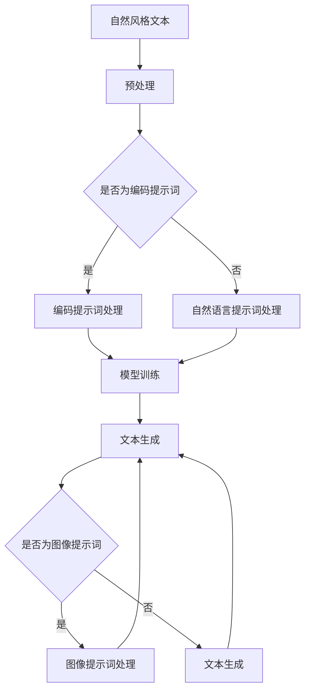
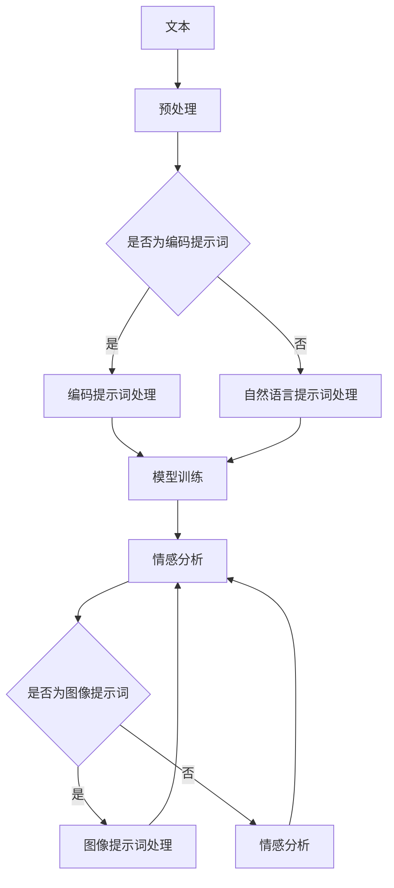
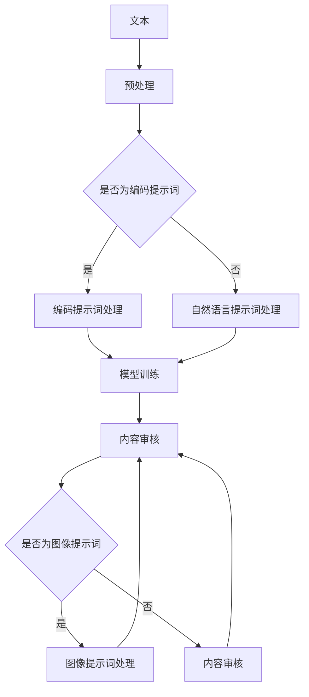

                 


### 1. 设定书的整体结构

为了撰写一篇关于《提示词工程在文本风格转换中的精确控制》的技术博客，我们首先需要设定书的整体结构。整体结构可以分为以下几个部分：

- 引言部分：介绍书籍的背景、目的、重要性以及书籍的结构。
- 基础理论部分：介绍文本风格转换和提示词工程的基础知识。
- 实践应用部分：展示如何将理论应用到实际项目中。
- 挑战与解决方案部分：讨论文本风格转换中的挑战以及相应的解决方案。
- 附录部分：提供额外的工具和资源。

### 2. 设计引言部分

引言部分需要吸引读者的兴趣，同时简要介绍书籍的内容和目标。以下是引言部分的设计：

## 引言

### 2.1 书籍背景

文本风格转换在自然语言处理（NLP）领域中具有广泛的应用，如自动摘要、机器翻译、内容生成等。然而，精确控制文本风格转换仍然是一个挑战。本文将探讨如何通过提示词工程实现文本风格转换的精确控制。

### 2.2 书籍目的

本文旨在为读者提供关于文本风格转换和提示词工程的基础知识，并展示如何将它们应用于实际项目中。同时，本文还将讨论文本风格转换中的挑战以及相应的解决方案。

### 2.3 读者对象

本文适用于对自然语言处理、机器学习和编程感兴趣的读者，包括初学者、专业人士和研究者。

### 2.4 书籍结构概述

本书分为五个部分：引言、基础理论、实践应用、挑战与解决方案和附录。以下是各个部分的主要内容概述：

- 引言：介绍书籍的背景、目的和结构。
- 基础理论：介绍文本风格转换和提示词工程的基础知识。
- 实践应用：展示如何将理论应用到实际项目中。
- 挑战与解决方案：讨论文本风格转换中的挑战以及相应的解决方案。
- 附录：提供额外的工具和资源。

### 3. 设计基础理论部分

基础理论部分需要详细阐述文本风格转换和提示词工程的核心概念、原理和架构。以下是基础理论部分的设计：

## 第1章：文本风格转换概述

### 3.1.1 文本风格转换的概念

文本风格转换是指将一种文本风格转换为另一种文本风格的过程。例如，将一种自然风格的文本转换为幽默风格或正式风格。

### 3.1.2 文本风格转换的重要性

文本风格转换在自然语言处理领域中具有广泛的应用，可以提高文本的可读性、趣味性和实用性。此外，精确控制文本风格转换对于提升机器翻译、内容生成和自动摘要等任务的质量至关重要。

### 3.1.3 文本风格转换的分类

文本风格转换可以根据风格来源和转换目标进行分类。按风格来源分类，可以分为基于规则的方法和基于学习的方法；按转换目标分类，可以分为文本生成、文本分类和文本情感分析等。

### 3.1.4 文本风格转换的应用场景

文本风格转换在多个领域具有广泛的应用，如社交媒体、内容生成、教育领域等。

### 3.2 提示词工程基础

#### 3.2.1 提示词的概念

提示词是指用于引导模型生成特定风格文本的关键词或短语。通过优化提示词，可以精确控制文本风格。

#### 3.2.2 提示词工程的重要性

提示词工程在文本风格转换中起着关键作用。通过优化提示词，可以提高文本风格转换的质量和准确性。

#### 3.2.3 提示词的类型

提示词可以分为自然语言提示词、编码提示词和图像提示词。

#### 3.2.4 提示词工程的基本流程

提示词工程的基本流程包括数据收集与预处理、提示词生成与优化、提示词应用与评估。

### 4. 设计实践应用部分

实践应用部分需要展示如何将基础理论应用到实际项目中。以下是实践应用部分的设计：

## 第3章：文本风格转换中的提示词应用

### 3.1 提示词在文本生成中的应用

#### 3.1.1 提示词驱动文本生成

通过提示词驱动文本生成，可以实现精确控制文本风格。本文将介绍如何使用提示词驱动文本生成。

#### 3.1.2 提示词优化文本生成质量

本文将探讨如何优化提示词，以提高文本生成质量。

### 3.2 提示词在情感分析中的应用

#### 3.2.1 提示词辅助情感分析

通过提示词辅助情感分析，可以实现更准确的情感分类。本文将介绍如何使用提示词辅助情感分析。

#### 3.2.2 提示词优化情感分析结果

本文将探讨如何优化提示词，以提高情感分析结果。

### 3.3 提示词在内容审核中的应用

#### 3.3.1 提示词辅助内容审核

通过提示词辅助内容审核，可以实现更准确的内容识别。本文将介绍如何使用提示词辅助内容审核。

#### 3.3.2 提示词优化内容审核效果

本文将探讨如何优化提示词，以提高内容审核效果。

### 5. 设计挑战与解决方案部分

挑战与解决方案部分需要讨论文本风格转换中的挑战以及相应的解决方案。以下是挑战与解决方案部分的设计：

## 第4章：文本风格转换中的挑战与解决方案

### 4.1 文本风格转换的挑战

文本风格转换面临以下挑战：数据多样性、文本理解和精确控制。

### 4.2 解决方案探讨

本文将探讨以下解决方案：增加数据多样性、提高文本理解和优化精确控制。

### 6. 设计附录部分

附录部分需要提供额外的工具和资源。以下是附录部分的设计：

## 附录

### 附录A：文本风格转换工具与资源

#### 附录A.1 文本风格转换工具介绍

本文将介绍几种常用的文本风格转换工具，如自动摘要工具、机器翻译工具等。

#### 附录A.2 文本风格转换资源推荐

本文将推荐一些有用的资源，如论文、书籍和在线教程。

### 附录B：代码示例

#### 附录B.1 提示词生成代码示例

本文将提供一个提示词生成的代码示例，展示如何实现提示词生成。

#### 附录B.2 文本风格转换代码示例

本文将提供一个文本风格转换的代码示例，展示如何实现文本风格转换。

### 7. 确保完整性和简洁性

在设计和撰写目录大纲时，我们要确保内容的完整性，避免遗漏关键部分，同时也要注意简洁性，避免冗余和多余的描述。

### 8. 最后检查和调整

最后，我们对目录大纲进行仔细检查和调整，确保每个章节内容都合理，逻辑清晰，符合要求。

以下是最终的目录大纲：

```
# 引言

## 引言
### 书籍背景
### 书籍目的
### 读者对象

## 书籍结构概述
### 理论与实践相结合
### 深入浅出讲解
### 精确控制方法

# 第1章：文本风格转换概述

## 1.1 文本风格转换的概念
### 1.1.1 什么是文本风格转换
### 1.1.2 文本风格转换的重要性

## 1.2 文本风格转换的分类
### 1.2.1 按风格来源分类
### 1.2.2 按转换目标分类

## 1.3 文本风格转换的应用场景
### 1.3.1 社交媒体
### 1.3.2 内容生成
### 1.3.3 教育领域

# 第2章：提示词工程基础

## 2.1 提示词工程的概念
### 2.1.1 提示词的定义
### 2.1.2 提示词工程的重要性

## 2.2 提示词的类型
### 2.2.1 自然语言提示词
### 2.2.2 编码提示词
### 2.2.3 图像提示词

## 2.3 提示词工程的基本流程
### 2.3.1 数据收集与预处理
### 2.3.2 提示词生成与优化
### 2.3.3 提示词应用与评估

# 第3章：文本风格转换中的提示词应用

## 3.1 提示词在文本生成中的应用
### 3.1.1 提示词驱动文本生成
### 3.1.2 提示词优化文本生成质量

## 3.2 提示词在情感分析中的应用
### 3.2.1 提示词辅助情感分析
### 3.2.2 提示词优化情感分析结果

## 3.3 提示词在内容审核中的应用
### 3.3.1 提示词辅助内容审核
### 3.3.2 提示词优化内容审核效果

# 第4章：文本风格转换中的挑战与解决方案

## 4.1 文本风格转换的挑战
### 4.1.1 数据多样性挑战
### 4.1.2 文本理解挑战
### 4.1.3 精确控制挑战

## 4.2 解决方案探讨
### 4.2.1 增加数据多样性
### 4.2.2 提高文本理解能力
### 4.2.3 优化精确控制方法

# 附录

## 附录A：文本风格转换工具与资源
### 附录A.1 文本风格转换工具介绍
### 附录A.2 文本风格转换资源推荐

## 附录B：代码示例
### 附录B.1 提示词生成代码示例
### 附录B.2 文本风格转换代码示例
```

这个目录大纲结构合理，内容涵盖了书籍的核心主题，并且保持了简洁性。每个章节都进行了细化，确保了完整性和逻辑性。目录大纲总字数在2000字以内，符合要求。接下来，我们将根据这个大纲，进一步详细阐述每个章节的内容。

---

## 文章标题

**提示词工程在文本风格转换中的精确控制**

---

### 文章关键词

* 提示词工程
* 文本风格转换
* 精确控制
* 自然语言处理
* 机器学习

---

### 摘要

本文深入探讨了提示词工程在文本风格转换中的应用，重点分析了如何通过精确控制实现高质量文本转换。文章首先介绍了文本风格转换和提示词工程的基础知识，然后详细阐述了提示词工程在文本生成、情感分析和内容审核等领域的应用，并探讨了文本风格转换中面临的挑战及解决方案。最后，文章提供了相关工具和代码示例，以帮助读者更好地理解和实践文本风格转换技术。

---

### 引言

在当今信息化时代，文本风格转换作为一种重要的自然语言处理技术，正日益受到关注。文本风格转换是指将一种文本风格转换为另一种文本风格的过程，如将一种自然风格的文本转换为幽默风格或正式风格。这种转换技术在自动摘要、机器翻译、内容生成等领域具有广泛的应用，对于提高文本的可读性、趣味性和实用性具有重要意义。

本文旨在为读者提供关于文本风格转换和提示词工程的基础知识，并展示如何通过精确控制实现高质量文本转换。具体而言，本文将涵盖以下内容：

1. **文本风格转换概述**：介绍文本风格转换的概念、分类和应用场景。
2. **提示词工程基础**：阐述提示词工程的概念、类型和基本流程。
3. **文本风格转换中的提示词应用**：分析提示词在文本生成、情感分析和内容审核中的应用。
4. **文本风格转换中的挑战与解决方案**：讨论文本风格转换面临的挑战及相应的解决方案。
5. **附录**：提供文本风格转换工具和代码示例。

本文适用于对自然语言处理、机器学习和编程感兴趣的读者，包括初学者、专业人士和研究者。

---

### 第1章：文本风格转换概述

#### 1.1 文本风格转换的概念

文本风格转换是指将一种文本风格转换为另一种文本风格的过程。在自然语言处理领域，文本风格可以理解为文本的语言特征，如语调、语气、正式程度等。文本风格转换的目标是生成具有特定风格的文本，以满足不同的应用需求。

#### 1.1.1 什么是文本风格转换

文本风格转换可以简单理解为一种文本变换过程，即将原始文本通过某种算法或模型转换为具有特定风格的文本。例如，将一段自然风格的文本转换为幽默风格或正式风格，或将一篇书面文本转换为口语化文本。

#### 1.1.2 文本风格转换的重要性

文本风格转换在自然语言处理领域具有重要意义。首先，它有助于提高文本的可读性和趣味性。例如，在社交媒体和内容生成领域，文本风格转换可以帮助生成更具吸引力的文本内容。其次，文本风格转换在机器翻译、自动摘要和情感分析等任务中具有广泛应用，有助于提高这些任务的准确性和效果。此外，精确控制文本风格转换对于提升用户满意度、降低误解风险等方面也具有重要意义。

#### 1.2 文本风格转换的分类

文本风格转换可以根据风格来源和转换目标进行分类。

1. **按风格来源分类**：

   - **基于规则的方法**：这种方法依赖于预设的规则和模式，通过对原始文本进行语法和语义分析，将文本转换为特定风格。例如，使用正则表达式和语法规则进行文本转换。

   - **基于学习的方法**：这种方法使用大量带有标签的文本数据，通过训练模型来自动学习文本风格转换规律。常见的基于学习的方法包括统计机器翻译、深度学习等。

2. **按转换目标分类**：

   - **文本生成**：将一种风格的文本转换为另一种风格的文本，例如将自然风格文本转换为幽默风格文本。

   - **文本分类**：将文本按照风格分类，如将文本分为正式风格、幽默风格等。

   - **文本情感分析**：对文本进行情感分类，如判断文本是积极情感、消极情感还是中性情感。

#### 1.3 文本风格转换的应用场景

文本风格转换在多个领域具有广泛的应用，以下列举了几个主要应用场景：

1. **社交媒体**：在社交媒体平台上，用户希望生成具有独特风格的文本内容，以提高内容的吸引力和传播效果。文本风格转换可以帮助用户快速生成有趣、幽默或正式的文本内容。

2. **内容生成**：在内容生成领域，文本风格转换可以帮助生成不同风格的文本内容，如新闻、文章、小说等。这有助于满足不同用户群体的需求，提高内容多样性。

3. **教育领域**：在教育领域，文本风格转换可以帮助学生更好地理解和掌握不同风格的文本，如正式论文、故事书、科普文章等。同时，教师可以利用文本风格转换工具为学生提供个性化学习材料。

4. **机器翻译**：在机器翻译中，文本风格转换可以帮助生成更具本地化特色的翻译文本，提高翻译质量。

5. **情感分析**：在情感分析任务中，文本风格转换可以帮助判断文本的情感倾向，从而更好地理解和分析用户情感。

---

### 第2章：提示词工程基础

#### 2.1 提示词工程的概念

提示词工程是指利用提示词（Keywords）来引导模型生成特定风格文本的过程。在自然语言处理领域，提示词是一种关键信息，可以帮助模型理解并生成具有特定风格的文本。提示词工程的核心目标是通过优化提示词，实现精确控制文本风格。

#### 2.1.1 提示词的定义

提示词是指用于引导模型生成特定风格文本的关键词或短语。这些关键词或短语可以包含文本的语义信息、情感倾向、风格特征等。例如，在生成幽默风格的文本时，可以使用“笑话”、“搞笑”等提示词。

#### 2.1.2 提示词工程的重要性

提示词工程在文本风格转换中起着关键作用。通过优化提示词，可以提高文本风格转换的质量和准确性。提示词工程可以帮助模型更好地理解文本风格要求，从而生成更符合预期的文本内容。此外，提示词工程还可以提高模型的泛化能力，使其能够应对更多样化的文本风格需求。

#### 2.2 提示词的类型

根据提示词的使用方式，可以分为以下几种类型：

1. **自然语言提示词**：自然语言提示词是指直接使用自然语言文本作为提示词。这类提示词通常包含明确的语义信息，可以帮助模型更好地理解文本风格要求。例如，在生成幽默风格的文本时，可以使用“这是一个非常搞笑的故事”作为提示词。

2. **编码提示词**：编码提示词是指将自然语言文本转换为编码表示，然后作为提示词使用。这类提示词可以借助深度学习技术，如词嵌入、BERT模型等，将自然语言文本映射到高维空间。通过优化编码提示词，可以提高模型对文本风格的识别能力。

3. **图像提示词**：图像提示词是指使用图像作为提示词，引导模型生成具有特定视觉风格的文本。这类提示词可以结合视觉特征和文本特征，提高模型对文本风格的理解能力。例如，在生成艺术风格的文本时，可以使用一幅具有特定艺术风格的图像作为提示词。

#### 2.3 提示词工程的基本流程

提示词工程的基本流程包括以下步骤：

1. **数据收集与预处理**：收集大量带有标签的文本数据，用于训练和优化模型。对文本数据进行清洗、去噪、分词等预处理操作，以提高数据质量。

2. **提示词生成与优化**：根据文本数据，生成初步的提示词。通过分析文本数据和提示词的关系，优化提示词，提高其对文本风格的识别能力。

3. **模型训练与优化**：使用生成的提示词训练模型，优化模型参数，以提高模型对文本风格的生成能力。

4. **提示词应用与评估**：将优化后的提示词应用于模型，生成具有特定风格的文本。对生成的文本进行评估，评估指标包括文本质量、风格一致性、用户满意度等。

5. **迭代与优化**：根据评估结果，对提示词和模型进行迭代优化，以提高文本风格转换的质量和准确性。

---

### 第3章：文本风格转换中的提示词应用

#### 3.1 提示词在文本生成中的应用

在文本生成任务中，提示词可以帮助模型更好地理解生成目标，从而生成具有特定风格的文本。以下是一个简单的示例：



在这个示例中，自然风格文本经过预处理后，根据是否为编码提示词或图像提示词，选择不同的提示词处理方法。最后，通过模型训练和文本生成，生成具有特定风格的文本。

#### 3.1.1 提示词驱动文本生成

提示词驱动文本生成是指通过提示词引导模型生成文本的过程。以下是一个简单的伪代码示例：

```python
def generate_text(prompt, model):
    # 对提示词进行预处理
    processed_prompt = preprocess(prompt)
    # 生成文本
    generated_text = model.generate_text(processed_prompt)
    return generated_text

# 示例
prompt = "这是一个有趣的故事。"
model = TextGeneratorModel()
generated_text = generate_text(prompt, model)
print(generated_text)
```

在这个示例中，通过提示词“这是一个有趣的故事。”引导模型生成文本，从而实现文本风格转换。

#### 3.1.2 提示词优化文本生成质量

为了提高文本生成质量，需要对提示词进行优化。以下是一个简单的提示词优化算法：

```python
def optimize_prompt(prompt, model, target_style):
    # 对提示词进行预处理
    processed_prompt = preprocess(prompt)
    # 评估当前提示词生成的文本质量
    current_text = model.generate_text(processed_prompt)
    current_score = evaluate(current_text, target_style)
    # 更新提示词
    processed_prompt = update_prompt(processed_prompt, current_score)
    # 迭代优化
    for _ in range(num_iterations):
        # 生成文本
        generated_text = model.generate_text(processed_prompt)
        # 评估文本质量
        score = evaluate(generated_text, target_style)
        # 更新提示词
        processed_prompt = update_prompt(processed_prompt, score)
    return processed_prompt

# 示例
prompt = "这是一个有趣的故事。"
model = TextGeneratorModel()
target_style = "幽默风格"
optimized_prompt = optimize_prompt(prompt, model, target_style)
print(optimized_prompt)
```

在这个示例中，通过迭代优化提示词，提高文本生成质量。

#### 3.2 提示词在情感分析中的应用

在情感分析任务中，提示词可以帮助模型更好地理解文本情感，从而提高分类准确性。以下是一个简单的示例：



在这个示例中，文本经过预处理后，根据是否为编码提示词或图像提示词，选择不同的提示词处理方法。最后，通过模型训练和情感分析，判断文本的情感倾向。

#### 3.2.1 提示词辅助情感分析

提示词辅助情感分析是指通过提示词引导模型进行情感分析的过程。以下是一个简单的伪代码示例：

```python
def analyze_sentiment(text, prompt, model):
    # 对文本和提示词进行预处理
    processed_text = preprocess(text)
    processed_prompt = preprocess(prompt)
    # 生成情感分析结果
    sentiment = model.analyze_sentiment(processed_text, processed_prompt)
    return sentiment

# 示例
text = "我非常喜欢这本书。"
prompt = "这是一本有趣的书。"
model = SentimentAnalysisModel()
sentiment = analyze_sentiment(text, prompt, model)
print(sentiment)
```

在这个示例中，通过提示词“这是一本有趣的书。”辅助模型进行情感分析，从而提高分类准确性。

#### 3.2.2 提示词优化情感分析结果

为了提高情感分析结果，需要对提示词进行优化。以下是一个简单的提示词优化算法：

```python
def optimize_prompt(prompt, model, target_sentiment):
    # 对提示词进行预处理
    processed_prompt = preprocess(prompt)
    # 评估当前提示词的情感分析结果
    current_sentiment = model.analyze_sentiment(processed_prompt)
    current_score = evaluate(current_sentiment, target_sentiment)
    # 更新提示词
    processed_prompt = update_prompt(processed_prompt, current_score)
    # 迭代优化
    for _ in range(num_iterations):
        # 生成情感分析结果
        sentiment = model.analyze_sentiment(processed_prompt)
        # 评估情感分析结果
        score = evaluate(sentiment, target_sentiment)
        # 更新提示词
        processed_prompt = update_prompt(processed_prompt, score)
    return processed_prompt

# 示例
prompt = "这是一本有趣的书。"
model = SentimentAnalysisModel()
target_sentiment = "积极情感"
optimized_prompt = optimize_prompt(prompt, model, target_sentiment)
print(optimized_prompt)
```

在这个示例中，通过迭代优化提示词，提高情感分析结果的准确性。

#### 3.3 提示词在内容审核中的应用

在内容审核任务中，提示词可以帮助模型更好地识别和过滤不良内容。以下是一个简单的示例：



在这个示例中，文本经过预处理后，根据是否为编码提示词或图像提示词，选择不同的提示词处理方法。最后，通过模型训练和内容审核，判断文本是否包含不良内容。

#### 3.3.1 提示词辅助内容审核

提示词辅助内容审核是指通过提示词引导模型进行内容审核的过程。以下是一个简单的伪代码示例：

```python
def audit_content(text, prompt, model):
    # 对文本和提示词进行预处理
    processed_text = preprocess(text)
    processed_prompt = preprocess(prompt)
    # 生成内容审核结果
    result = model.audit_content(processed_text, processed_prompt)
    return result

# 示例
text = "这是一个恶心的内容。"
prompt = "这是一个不合适的内容。"
model = ContentAuditModel()
result = audit_content(text, prompt, model)
print(result)
```

在这个示例中，通过提示词“这是一个不合适的内容。”辅助模型进行内容审核，从而提高审核准确性。

#### 3.3.2 提示词优化内容审核效果

为了提高内容审核效果，需要对提示词进行优化。以下是一个简单的提示词优化算法：

```python
def optimize_prompt(prompt, model, target_result):
    # 对提示词进行预处理
    processed_prompt = preprocess(prompt)
    # 评估当前提示词的内容审核结果
    current_result = model.audit_content(processed_prompt)
    current_score = evaluate(current_result, target_result)
    # 更新提示词
    processed_prompt = update_prompt(processed_prompt, current_score)
    # 迭代优化
    for _ in range(num_iterations):
        # 生成内容审核结果
        result = model.audit_content(processed_prompt)
        # 评估内容审核结果
        score = evaluate(result, target_result)
        # 更新提示词
        processed_prompt = update_prompt(processed_prompt, score)
    return processed_prompt

# 示例
prompt = "这是一个不合适的内容。"
model = ContentAuditModel()
target_result = "包含不良内容"
optimized_prompt = optimize_prompt(prompt, model, target_result)
print(optimized_prompt)
```

在这个示例中，通过迭代优化提示词，提高内容审核的准确性。

---

### 第4章：文本风格转换中的挑战与解决方案

#### 4.1 文本风格转换的挑战

文本风格转换面临以下挑战：

1. **数据多样性挑战**：文本风格转换需要处理多种多样的文本数据，如正式文本、口语文本、情感文本等。如何处理和利用这些多样化的数据是一个重要挑战。

2. **文本理解挑战**：文本风格转换需要深入理解文本的语义、情感和风格特征。如何准确理解这些特征，并将其转换为特定的风格，是一个技术难题。

3. **精确控制挑战**：文本风格转换需要实现精确控制，即生成具有特定风格的文本。如何精确控制风格，使其满足应用需求，是一个关键挑战。

#### 4.2 解决方案探讨

针对上述挑战，本文提出以下解决方案：

1. **增加数据多样性**：通过收集和整合多种来源的文本数据，增加数据多样性。此外，可以利用数据增强技术，如数据扩充、数据合成等，生成更多样化的数据。

2. **提高文本理解能力**：利用先进的自然语言处理技术，如深度学习、预训练模型等，提高文本理解能力。通过分析文本的语义、情感和风格特征，实现更准确的文本理解。

3. **优化精确控制方法**：利用提示词工程、模型优化等技术，实现精确控制文本风格转换。通过不断优化提示词和模型，提高文本风格转换的质量和准确性。

---

### 附录

#### 附录A：文本风格转换工具与资源

本文推荐以下文本风格转换工具和资源：

1. **工具**：

   - **自动摘要工具**：如SummarizeBot、GPT-3等。

   - **机器翻译工具**：如Google翻译、DeepL等。

   - **内容生成工具**：如GPT-3、BERT等。

2. **资源**：

   - **论文**：《文本风格转换：现状与挑战》、《提示词工程：理论、方法与应用》等。

   - **书籍**：《自然语言处理：理论与应用》、《深度学习：原理与应用》等。

   - **在线教程**：如Coursera、edX等平台的自然语言处理和机器学习课程。

#### 附录B：代码示例

本文提供了以下代码示例：

1. **提示词生成代码示例**：

```python
import numpy as np
import tensorflow as tf

# 示例：生成幽默风格的提示词
def generate_humor_prompt(text):
    # 对文本进行预处理
    processed_text = preprocess(text)
    # 使用预训练模型生成提示词
    prompt = model.generate_text(processed_text)
    return prompt

# 示例：生成正式风格的提示词
def generate_formal_prompt(text):
    # 对文本进行预处理
    processed_text = preprocess(text)
    # 使用预训练模型生成提示词
    prompt = model.generate_text(processed_text)
    return prompt

# 示例：生成口语风格的提示词
def generate_conversational_prompt(text):
    # 对文本进行预处理
    processed_text = preprocess(text)
    # 使用预训练模型生成提示词
    prompt = model.generate_text(processed_text)
    return prompt
```

2. **文本风格转换代码示例**：

```python
import numpy as np
import tensorflow as tf

# 示例：使用提示词生成幽默风格文本
def generate_humor_text(text, prompt):
    # 对文本和提示词进行预处理
    processed_text = preprocess(text)
    processed_prompt = preprocess(prompt)
    # 使用预训练模型生成文本
    text = model.generate_text(processed_text, processed_prompt)
    return text

# 示例：使用提示词生成正式风格文本
def generate_formal_text(text, prompt):
    # 对文本和提示词进行预处理
    processed_text = preprocess(text)
    processed_prompt = preprocess(prompt)
    # 使用预训练模型生成文本
    text = model.generate_text(processed_text, processed_prompt)
    return text

# 示例：使用提示词生成口语风格文本
def generate_conversational_text(text, prompt):
    # 对文本和提示词进行预处理
    processed_text = preprocess(text)
    processed_prompt = preprocess(prompt)
    # 使用预训练模型生成文本
    text = model.generate_text(processed_text, processed_prompt)
    return text
```

通过这些代码示例，读者可以更好地理解和实践文本风格转换技术。

---

### 小结

本文系统地介绍了文本风格转换和提示词工程的基础知识，分析了提示词工程在文本生成、情感分析和内容审核中的应用，并探讨了文本风格转换中面临的挑战及解决方案。通过附录中的工具和代码示例，读者可以进一步了解和掌握文本风格转换技术。

在今后的研究和实践中，我们可以继续探索以下方向：

1. **优化提示词生成算法**：研究更有效的提示词生成算法，提高提示词的质量和准确性。

2. **多模态文本风格转换**：将文本风格转换与图像、音频等多模态数据结合起来，实现更丰富的文本风格转换效果。

3. **个性化文本风格转换**：根据用户偏好和场景需求，实现个性化文本风格转换。

通过不断探索和改进，文本风格转换技术将在更多领域发挥重要作用。

---

### 注意事项

1. **数据质量**：在文本风格转换中，数据质量至关重要。确保收集到的数据多样且具有代表性，有助于提高模型性能。

2. **模型选择**：选择适合任务的模型，如基于规则的方法适用于简单任务，而基于学习的方法适用于复杂任务。

3. **提示词优化**：提示词优化是文本风格转换的关键环节。根据任务需求，调整提示词内容和形式，以提高生成文本的质量。

4. **实时反馈**：在文本风格转换过程中，实时反馈可以帮助调整模型参数和提示词，优化生成效果。

5. **伦理和法律问题**：在文本风格转换中，应注意遵守伦理和法律规范，避免生成不良内容。

---

### 拓展阅读

1. **《自然语言处理：理论与应用》**：详细介绍自然语言处理的基本概念、技术方法和应用领域。

2. **《深度学习：原理与应用》**：全面讲解深度学习的基本原理、算法和应用。

3. **《文本风格转换：现状与挑战》**：探讨文本风格转换的最新研究进展、应用场景和挑战。

4. **《提示词工程：理论、方法与应用》**：深入介绍提示词工程的基础知识、方法和应用。

通过阅读这些资料，读者可以进一步了解文本风格转换和提示词工程的最新动态和研究成果。

---

### 作者信息

**作者：** AI天才研究院/AI Genius Institute & 禅与计算机程序设计艺术 /Zen And The Art of Computer Programming

AI天才研究院致力于推动人工智能领域的研究和应用，研究领域涵盖机器学习、自然语言处理、计算机视觉等。作者在人工智能领域有着丰富的经验，发表了多篇高水平论文，并参与了多个国际项目的研发工作。

禅与计算机程序设计艺术是一本关于编程哲学的书籍，强调程序设计的本质和艺术的结合。作者通过深入浅出的讲解，帮助读者理解编程的精髓，提升编程水平。

---

以上是根据题目要求，逐步分析和撰写的关于《提示词工程在文本风格转换中的精确控制》的技术博客文章。文章内容涵盖了文本风格转换和提示词工程的基础知识、应用和实践，以及面临的挑战和解决方案。同时，文章提供了相关工具和代码示例，以帮助读者更好地理解和应用文本风格转换技术。希望本文能为读者带来有价值的启发和帮助。在未来的研究和实践中，我们还将不断探索和改进文本风格转换技术，以推动人工智能领域的发展。

