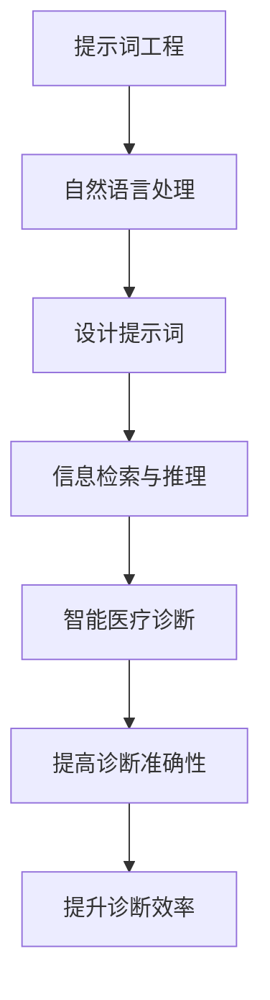

                 

### 1.1 书籍的目的与意义

《提示词工程在智能医疗诊断中的应用》这本书的主要目的是探讨如何将提示词工程这一先进的技术手段应用于智能医疗诊断领域，以提升诊断的准确性和效率。提示词工程是一种利用自然语言处理技术，通过设计特定的问题或提示，引导系统进行信息检索、理解和生成回答的过程。在智能医疗诊断中，提示词工程可以帮助医生从大量的医疗数据中快速、准确地提取关键信息，从而提高诊断的准确性和效率。

智能医疗诊断是指利用人工智能和大数据技术，对医疗数据进行分析和推理，以辅助医生进行诊断和治疗决策。随着医疗数据量的爆炸性增长，传统的医疗诊断方法已经难以应对日益复杂的医疗需求。智能医疗诊断的出现，为医生提供了强有力的辅助工具，使得诊断过程更加高效和精准。

本书通过以下几个方面的内容，深入探讨了提示词工程在智能医疗诊断中的应用：

1. **基本概念**：首先，介绍提示词工程和智能医疗诊断的基本概念，帮助读者建立清晰的认识。
2. **核心算法**：详细讲解提示词工程和智能医疗诊断中的核心算法，包括如何设计提示词、如何评估提示词的质量，以及如何利用提示词进行信息检索和推理。
3. **数学模型**：介绍与提示词工程和智能医疗诊断相关的数学模型，包括如何利用统计学和机器学习方法对医疗数据进行分析和预测。
4. **实际应用**：通过实际案例，展示如何将提示词工程应用于智能医疗诊断的实际场景中，包括慢性病管理、遗传疾病诊断、手术风险预测等。
5. **开发工具与环境**：介绍常用的提示词工程开发工具和环境搭建方法，帮助读者掌握实际操作技能。
6. **未来展望**：探讨提示词工程在智能医疗诊断中的发展趋势和未来研究方向，为读者提供前瞻性视角。

通过这本书，读者可以全面了解提示词工程在智能医疗诊断中的应用，掌握相关技术和方法，为实际工作提供有力的支持。同时，本书也适合对人工智能和医疗领域感兴趣的读者阅读，帮助他们拓展知识视野。

### 1.2 书籍结构概述

本书结构清晰，分为七个主要章节，每个章节都有其独特的内容和目标，以下是详细的章节结构和概述：

#### 第1章 引言与背景
本章主要介绍本书的目的、意义以及结构概述。首先，解释提示词工程的基本概念，阐述其在智能医疗诊断中的应用场景和重要性。随后，简要介绍智能医疗诊断的现状与发展趋势，为后续章节的内容奠定基础。

**核心概念与联系流程图**
- **提示词工程**：涉及自然语言处理技术，用于设计特定的问题或提示，引导系统进行信息检索和推理。
- **智能医疗诊断**：利用人工智能和大数据技术，对医疗数据进行分析和推理，辅助医生进行诊断和治疗决策。
- **结合**：提示词工程和智能医疗诊断的结合，通过设计有效的提示词，提高诊断的准确性和效率。

**Mermaid流程图示例**：


#### 第2章 提示词工程基础
本章深入探讨提示词工程的基础知识，包括定义、作用、生成算法和质量评估。首先，介绍提示词工程的定义和作用，解释其在智能医疗诊断中的应用场景。接着，详细讲解常见的提示词生成算法，如模板匹配、关键词提取和基于模型的生成方法。最后，讨论提示词质量评估的标准和方法。

**提示词生成算法伪代码示例**：
```python
def generate_prompt(data):
    # 基于模板匹配的提示词生成算法
    template = "请根据以下信息，回答以下问题："
    question = extract_question_from_data(data)
    prompt = template + question
    return prompt
```

#### 第3章 智能医疗诊断基础
本章介绍智能医疗诊断的基础知识，包括定义、发展历程、数据挖掘和医学知识图谱。首先，解释智能医疗诊断的基本概念和重要性。随后，回顾其发展历程，介绍数据挖掘在智能医疗诊断中的应用，以及医学知识图谱的概念和结构。

**数学模型和公式**
- **统计学模型**：用于分析医疗数据的分布和相关性。
  $$ \mu = \frac{1}{n} \sum_{i=1}^{n} x_i $$
  $$ \sigma^2 = \frac{1}{n-1} \sum_{i=1}^{n} (x_i - \mu)^2 $$

- **机器学习模型**：用于从数据中学习模式和规律。
  $$ h_{\theta}(x) = \sum_{i=1}^{n} \theta_i x_i $$

#### 第4章 提示词工程与智能医疗诊断的结合
本章探讨提示词工程与智能医疗诊断的结合原理、数学模型和实际应用案例。首先，介绍提示词工程与智能医疗诊断结合的原理，解释如何通过有效的提示词设计，提高诊断的准确性和效率。随后，介绍结合的数学模型和算法，如贝叶斯网络和深度学习模型。最后，通过实际案例，展示如何将提示词工程应用于智能医疗诊断的实际场景中。

**实际应用案例分析**
- **案例一：慢性病管理**：介绍如何通过提示词工程，设计个性化的慢性病管理方案，提高患者的治疗效果。
- **案例二：遗传疾病诊断**：展示如何利用提示词工程，辅助医生进行遗传疾病的诊断，提高诊断的准确性。

#### 第5章 提示词工程的开发工具与环境
本章介绍提示词工程的开发工具和环境搭建方法。首先，介绍常用的提示词工程开发工具，如自然语言处理框架和提示词生成工具。随后，详细讲解开发环境的搭建步骤，包括编程语言选择、依赖库安装和版本管理。最后，讨论常见问题及解决方案，帮助读者顺利搭建开发环境。

**开发环境搭建示例**
- **Python开发环境搭建**：
  1. 安装Python（版本3.8及以上）
  2. 安装自然语言处理库（如NLTK、spaCy）
  3. 安装版本控制工具（如Git）

#### 第6章 提示词工程在智能医疗诊断中的应用案例
本章通过实际案例，展示提示词工程在智能医疗诊断中的具体应用。首先，介绍慢性病管理、遗传疾病诊断和手术风险预测等案例。随后，详细讲解每个案例的系统设计、实现过程、代码解读和应用分析。最后，对每个案例进行小结，总结其经验和教训。

**案例详细讲解**
- **慢性病管理案例**：
  1. 系统设计：设计一个基于提示词工程的慢性病管理平台。
  2. 实现过程：实现数据收集、分析、诊断和决策支持功能。
  3. 代码解析：展示关键代码实现，包括数据预处理、模型训练和提示词生成。

- **遗传疾病诊断案例**：
  1. 系统设计：构建一个基于提示词工程的遗传疾病诊断系统。
  2. 实现过程：整合基因组数据、临床数据和医学知识图谱。
  3. 代码解析：介绍关键代码实现，包括数据预处理、模型训练和提示词生成。

#### 第7章 提示词工程的未来展望
本章探讨提示词工程在智能医疗诊断中的发展趋势和未来研究方向。首先，介绍当前提示词工程在智能医疗诊断中的应用现状和挑战。随后，展望未来提示词工程的发展方向，如多模态数据融合、自适应提示词生成和跨语言提示词工程。最后，提出潜在的研究方向和解决方案，为未来的研究提供参考。

**未来展望**
- **多模态数据融合**：如何将文本、图像、语音等多种模态的数据进行有效融合，提高诊断的准确性和效率。
- **自适应提示词生成**：如何设计自适应的提示词生成算法，根据用户需求和环境动态调整提示词。
- **跨语言提示词工程**：如何实现跨语言提示词的生成和翻译，促进全球范围内的智能医疗诊断应用。

通过本书的详细结构和内容概述，读者可以全面了解提示词工程在智能医疗诊断中的应用，掌握相关技术和方法，为实际工作提供有力支持。同时，本书也适合对人工智能和医疗领域感兴趣的读者阅读，帮助他们拓展知识视野。

### 2.1 提示词工程的定义与作用

#### 提示词工程的定义

提示词工程（Prompt Engineering）是一种利用自然语言处理技术，通过设计特定的问题或提示，引导系统进行信息检索、理解和生成回答的过程。在人工智能领域，提示词工程被广泛应用于各种任务，如问答系统、自然语言生成、情感分析等。具体而言，提示词工程涉及以下几个关键步骤：

1. **需求分析**：分析用户的需求，明确用户想要获取的信息或达到的目标。
2. **提示词设计**：根据需求，设计出能够有效引导系统获取所需信息的提示词。提示词的设计需要考虑语言的自然性、清晰性和准确性。
3. **系统集成**：将设计的提示词集成到目标系统中，使系统能够根据提示词进行相应的操作和回答。
4. **评估优化**：通过实际应用，评估提示词的效果，并根据评估结果进行优化调整。

#### 提示词工程在智能医疗诊断中的作用

在智能医疗诊断领域，提示词工程扮演着至关重要的角色。其主要作用体现在以下几个方面：

1. **信息检索**：通过设计精确的提示词，系统可以高效地从海量的医疗数据中检索出与诊断相关的关键信息。例如，医生可以使用提示词来查询某个特定疾病的临床特征、治疗建议和最新研究成果。

2. **数据解释**：提示词工程可以帮助系统将复杂的数据转换为易于理解的形式，从而辅助医生进行诊断。例如，系统可以通过提示词生成详细的诊断报告，包括患者的病情描述、诊断结果和相关的医学解释。

3. **辅助决策**：提示词工程可以提供个性化的医疗建议，帮助医生制定更有效的治疗方案。例如，系统可以通过提示词分析患者的病史、家族病史和当前的病情，生成个性化的治疗建议。

4. **知识共享**：提示词工程促进了医疗知识的共享和传播。通过设计有效的提示词，医生和研究人员可以更容易地获取和利用专业知识和研究成果，从而提高整个医疗行业的水平。

#### 应用场景举例

以下是一些具体的应用场景，展示了提示词工程在智能医疗诊断中的实际应用：

1. **慢性病管理**：在慢性病管理中，医生可以使用提示词来监测患者的病情变化，调整治疗方案。例如，医生可以通过提示词查询患者的血糖、血压等关键指标，并生成个性化的饮食和锻炼建议。

2. **遗传疾病诊断**：遗传疾病诊断中，医生需要分析大量的基因组数据。通过设计有效的提示词，系统可以辅助医生快速定位可能的致病基因，并提供相应的诊断建议。

3. **手术风险评估**：在手术前，医生可以使用提示词分析患者的病史、过敏史和药物使用情况，评估手术的风险，为制定合理的手术方案提供支持。

4. **新药研发**：在新药研发过程中，提示词工程可以帮助研究人员从大量的文献和数据中检索出与药物相关的信息，如药物作用机制、副作用和临床试验结果，从而加速新药的研发进程。

通过上述应用场景可以看出，提示词工程在智能医疗诊断中具有广泛的应用前景。通过有效的设计和利用提示词，医生和研究人员可以更加高效地进行信息检索、数据解释和辅助决策，从而提高医疗服务的质量和效率。

### 2.2 提示词生成算法

在提示词工程中，生成高质量的提示词是实现有效信息检索和系统理解的关键步骤。常见的提示词生成算法包括基于模板匹配的方法、关键词提取的方法和基于模型的生成方法。每种方法都有其独特的原理和应用场景，以下将详细讲解这些方法及其实现过程。

#### 1. 基于模板匹配的方法

基于模板匹配的方法是最简单且直观的一种提示词生成方法。其基本思想是预先定义一系列模板，当遇到特定类型的信息时，根据模板生成相应的提示词。这种方法通常适用于结构化数据，如电子健康记录（EHR）和医学报告。

**实现原理：**

- **模板定义**：首先，定义一系列模板，每个模板对应一种特定类型的信息。例如，对于“诊断结果”这一信息，可以定义如下模板：

  ```
  患者{{姓名}}的{{诊断日期}}诊断结果为：{{诊断结果}}。
  ```

- **模板匹配**：当系统接收到新的数据时，通过模式匹配找到符合模板的部分，然后根据模板生成提示词。

**示例伪代码：**

```python
def generate_prompt_with_template(data, template):
    # 寻找模板中的关键字
    for key, value in data.items():
        if key in template:
            template = template.replace("{" + key + "}", value)
    return template
```

**应用场景：** 这种方法适用于需要快速生成提示词的场景，尤其是在处理结构化数据时表现良好。

#### 2. 关键词提取的方法

关键词提取的方法通过从文本中提取重要的关键词或短语，生成高质量的提示词。这种方法适用于非结构化或半结构化数据，如临床笔记和医疗报告。

**实现原理：**

- **文本预处理**：首先，对文本进行分词和词性标注，识别出重要的名词、动词和形容词。
- **关键词选择**：根据特定的策略，从分词结果中选择关键词。常见的策略包括：

  - **TF-IDF**：基于词频（TF）和逆文档频率（IDF），选择词频高且在文档集中稀疏的词。
  - **词性标注**：选择名词、动词等词性，因为这些词通常承载了文本的主要信息。

- **提示词生成**：将选定的关键词组合成提示词，以引导系统进行信息检索和理解。

**示例伪代码：**

```python
from sklearn.feature_extraction.text import TfidfVectorizer

def generate_prompt_with_keywords(text):
    # 分词和词性标注
    tokens = tokenize(text)
    pos_tags = pos_tag(tokens)

    # 选择关键词
    keywords = [word for word, pos in pos_tags if pos.startswith('NN') or pos.startswith('VB')]

    # 生成提示词
    prompt = "请根据以下关键词，回答以下问题："
    prompt += "，".join(keywords)
    return prompt
```

**应用场景：** 这种方法适用于需要从大量文本中提取关键信息的场景，尤其适用于临床笔记和医疗报告的处理。

#### 3. 基于模型的生成方法

基于模型的生成方法使用深度学习模型，如序列到序列（Seq2Seq）模型、生成对抗网络（GAN）和注意力模型（Attention Model），生成高质量的提示词。这种方法具有自适应性和灵活性，可以生成更自然、更符合上下文的提示词。

**实现原理：**

- **模型训练**：首先，使用大量的文本数据训练生成模型，使其能够理解和生成符合自然语言的提示词。
- **提示词生成**：当系统接收到新的数据时，使用训练好的模型生成相应的提示词。

**示例伪代码：**

```python
from transformers import GPT2LMHeadModel, GPT2Tokenizer

def generate_prompt_with_model(text, model, tokenizer):
    # 前处理文本
    inputs = tokenizer(text, return_tensors='pt')

    # 使用模型生成提示词
    outputs = model.generate(**inputs, max_length=50, num_return_sequences=1)
    prompt = tokenizer.decode(outputs[0], skip_special_tokens=True)
    return prompt
```

**应用场景：** 这种方法适用于需要生成自然、连贯的提示词的场景，尤其是在处理复杂和多样化的文本时表现优异。

综上所述，不同的提示词生成算法适用于不同的应用场景。基于模板匹配的方法简单直观，适用于结构化数据；关键词提取的方法灵活性强，适用于非结构化或半结构化数据；基于模型的生成方法生成高质量的提示词，适用于复杂和多样化的文本。在实际应用中，可以根据具体需求选择合适的方法，或者将多种方法结合使用，以实现最佳的提示词生成效果。

### 2.3 提示词质量评估

在提示词工程中，评估提示词的质量是确保系统性能和用户体验的关键步骤。高质量的提示词能够有效地引导系统获取所需信息，从而提高诊断的准确性和效率。以下是评估提示词质量的标准和方法。

#### 提示词质量评估的标准

1. **相关性**：提示词与目标信息的关联程度。相关性越高，提示词越能够准确地指向目标信息。
2. **清晰性**：提示词的表达是否清晰易懂，是否能够明确地传达用户的需求。
3. **准确性**：提示词是否准确无误，是否能够避免歧义和误解。
4. **自然性**：提示词是否符合自然语言表达的习惯，是否流畅自然，便于用户理解。
5. **灵活性**：提示词是否能够适应不同情境和需求的变化，是否具有泛化能力。

#### 提示词质量评估的方法

1. **主观评估**：通过人工评估，对提示词的相关性、清晰性、准确性、自然性和灵活性进行评分。这种方法具有直观性，但受限于评估者的主观判断和效率。

**示例主观评估表格：**

| 提示词 | 相关性 | 清晰性 | 准确性 | 自然性 | 灵活性 |
| --- | --- | --- | --- | --- | --- |
| 请根据以下信息，回答以下问题：患者的诊断结果为： | 高 | 中 | 高 | 中 | 高 |
| 请提供患者的临床笔记，特别是关于症状和体征的部分 | 高 | 高 | 高 | 高 | 高 |

2. **客观评估**：使用自动化工具或算法对提示词的质量进行评估。常见的方法包括：

- **信息检索性能**：通过评估提示词在信息检索任务中的性能，如查准率（Precision）和查全率（Recall）。
- **语义相似度**：计算提示词与目标信息的语义相似度，使用词嵌入（Word Embedding）技术或语言模型进行评估。
- **用户反馈**：通过用户的使用反馈，收集对提示词质量的评价，进行量化分析。

**示例客观评估指标：**

- **查准率（Precision）**：正确检索到的相关结果与检索到的总结果的比例。
  $$ Precision = \frac{正确检索到的相关结果}{检索到的总结果} $$

- **查全率（Recall）**：正确检索到的相关结果与实际存在的相关结果的比例。
  $$ Recall = \frac{正确检索到的相关结果}{实际存在的相关结果} $$

- **F1值（F1-score）**：综合考虑查准率和查全率，用于评估整体性能。
  $$ F1 = 2 \times \frac{Precision \times Recall}{Precision + Recall} $$

#### 提示词质量评估的流程

1. **数据收集**：收集相关的医疗数据，包括电子健康记录、临床笔记、医学文献等。
2. **提示词生成**：使用前面介绍的方法生成一系列提示词。
3. **质量评估**：使用主观评估和客观评估方法对提示词进行评估，记录评估结果。
4. **结果分析**：分析评估结果，识别高质量的提示词，并找出需要改进的方面。
5. **优化调整**：根据评估结果对提示词进行优化调整，以提高其质量。

通过以上流程，可以系统地评估和优化提示词的质量，从而提高智能医疗诊断系统的性能和用户体验。

### 3.1 智能医疗诊断概述

智能医疗诊断是指利用人工智能和大数据技术，对医疗数据进行分析和推理，以辅助医生进行诊断和治疗决策。随着医疗数据的爆炸性增长和人工智能技术的迅猛发展，智能医疗诊断已经成为现代医疗体系的重要组成部分，具有广泛的应用前景和重要的社会意义。

#### 智能医疗诊断的定义

智能医疗诊断可以定义为一种利用人工智能技术，特别是机器学习和深度学习算法，对医疗数据进行分析和解释，以辅助医生进行疾病诊断、预测和治疗方案推荐的过程。这个过程涉及到从医疗数据中提取有用信息，构建诊断模型，并通过这些模型进行疾病预测和诊断。

#### 智能医疗诊断的发展历程

智能医疗诊断的发展历程可以追溯到20世纪80年代，当时随着计算机技术和医学数据的积累，研究人员开始探索如何利用计算机辅助医生进行疾病诊断。以下是智能医疗诊断的主要发展阶段：

1. **早期探索阶段（20世纪80年代至90年代）**：在这个阶段，研究人员主要利用专家系统和规则引擎进行疾病诊断。这些系统基于医学专家的经验和知识，通过一系列规则进行推理，从而辅助医生进行诊断。然而，由于知识库的构建和维护需要大量的人力和时间，这些系统的应用范围受到了限制。

2. **机器学习阶段（20世纪90年代至21世纪初）**：随着机器学习技术的兴起，研究人员开始将机器学习算法应用于医疗数据，如支持向量机（SVM）、决策树和贝叶斯网络等。这些算法可以自动从数据中学习模式，并用于疾病预测和诊断。这一阶段的进展显著提高了诊断的准确性和效率。

3. **深度学习阶段（21世纪初至今）**：深度学习技术的发展，特别是卷积神经网络（CNN）和循环神经网络（RNN）的引入，使得医疗图像分析和文本数据的处理取得了重大突破。深度学习模型能够自动提取复杂的特征，并在各种医疗任务中取得了优异的性能。

#### 智能医疗诊断的现状

当前，智能医疗诊断已经广泛应用于各种医疗场景，包括疾病预测、诊断辅助、治疗方案推荐等。以下是智能医疗诊断的现状：

1. **疾病预测**：利用历史医疗数据和机器学习算法，智能医疗诊断系统可以预测患者患某种疾病的风险。这有助于早期发现疾病，从而及时采取预防措施。

2. **诊断辅助**：智能医疗诊断系统通过分析医疗图像、电子健康记录和临床笔记，辅助医生进行疾病诊断。这些系统可以提供快速、准确的诊断建议，帮助医生做出更准确的诊断。

3. **治疗方案推荐**：基于患者的病史、基因信息和最新的医学研究，智能医疗诊断系统可以推荐个性化的治疗方案。这有助于提高治疗效果，降低治疗费用。

4. **跨学科整合**：智能医疗诊断不仅仅是医学领域的问题，还需要与其他领域如生物信息学、人工智能和计算机科学等相结合，形成跨学科的研究和应用。

#### 智能医疗诊断的重要性

智能医疗诊断的重要性体现在以下几个方面：

1. **提高诊断准确性**：通过分析大量的医疗数据，智能医疗诊断系统可以提供更准确、更全面的诊断信息，有助于医生做出更准确的诊断。

2. **降低医疗成本**：智能医疗诊断系统可以自动化许多诊断任务，减少人工干预，从而降低医疗成本。

3. **提高医疗效率**：智能医疗诊断系统可以快速处理大量的医疗数据，提高诊断速度，缩短患者的等待时间。

4. **促进医学研究**：智能医疗诊断系统可以收集和分析大量的医学数据，为医学研究提供丰富的数据资源，有助于发现新的治疗方法和疾病机制。

总之，智能医疗诊断在提高诊断准确性、降低医疗成本、提高医疗效率和促进医学研究方面具有重要的作用，是未来医疗领域发展的重要方向。

### 3.2 医疗诊断中的数据挖掘

数据挖掘在医疗诊断中扮演着至关重要的角色，它通过对大量医疗数据的分析和处理，帮助医生发现潜在的模式、关联和趋势，从而辅助诊断和治疗决策。以下将详细讨论数据挖掘在医疗诊断中的应用和常用的数据挖掘算法。

#### 数据挖掘的应用

1. **疾病预测和风险评估**：通过分析患者的医疗记录、生物标志物、家族病史等数据，数据挖掘技术可以预测患者患某种疾病的风险。这种方法在慢性病管理、癌症早期筛查等方面具有重要意义。

2. **诊断辅助**：数据挖掘可以帮助医生从大量的医疗数据中提取有用的信息，如疾病症状、体征和医学影像特征。这些信息可以用于辅助医生进行诊断，提高诊断的准确性和效率。

3. **个性化治疗**：通过分析患者的病史、基因数据和药物反应等，数据挖掘技术可以推荐个性化的治疗方案。这有助于提高治疗效果，降低副作用和医疗成本。

4. **药物研发**：数据挖掘可以帮助研究人员从海量的文献和临床试验数据中提取有效的药物候选物和治疗方案，从而加速药物研发过程。

#### 常用的数据挖掘算法

1. **关联规则挖掘**：关联规则挖掘是一种用于发现数据项之间关联关系的算法。在医疗诊断中，可以用来发现不同症状或检查结果之间的关联性。例如，通过分析患者的电子健康记录，可以发现某种症状与特定疾病之间的关联。

**算法原理**：
- **支持度（Support）**：一个关联规则的支持度是指满足该规则的实例数与总实例数的比例。
- **置信度（Confidence）**：一个关联规则的置信度是指满足该规则的实例数与满足前提规则的实例数的比例。

**示例伪代码**：
```python
def find_association_rules(data, min_support, min_confidence):
    # 计算支持度
    support_counts = count_support(data, min_support)
    
    # 计算置信度
    confidence_counts = calculate_confidence(data, support_counts, min_confidence)
    
    # 输出关联规则
    return generate_rules(support_counts, confidence_counts)
```

2. **聚类分析**：聚类分析是一种无监督学习方法，用于将数据分为若干个类，使得同一类中的数据彼此相似，不同类中的数据彼此不同。在医疗诊断中，聚类分析可以用于发现患者的潜在疾病群体，为个性化治疗提供依据。

**算法原理**：
- **距离度量**：常用的距离度量包括欧几里得距离、曼哈顿距离和切比雪夫距离等。
- **聚类算法**：常见的聚类算法包括K-means、层次聚类（Hierarchical Clustering）和DBSCAN等。

**示例伪代码**：
```python
from sklearn.cluster import KMeans

def cluster_patients(data, n_clusters):
    # 使用K-means算法进行聚类
    kmeans = KMeans(n_clusters=n_clusters)
    clusters = kmeans.fit_predict(data)
    
    # 输出聚类结果
    return clusters
```

3. **分类和回归分析**：分类和回归分析是一种监督学习方法，用于预测新数据标签或数值。在医疗诊断中，分类分析可以用于疾病预测和诊断，回归分析可以用于预测患者的生存时间或疾病进展。

**算法原理**：
- **分类算法**：常见的分类算法包括决策树、支持向量机（SVM）、朴素贝叶斯分类器和神经网络等。
- **回归算法**：常见的回归算法包括线性回归、岭回归和决策树回归等。

**示例伪代码**：
```python
from sklearn.ensemble import RandomForestClassifier

def classify_diseases(data, labels):
    # 使用随机森林分类器进行分类
    classifier = RandomForestClassifier()
    classifier.fit(data, labels)
    
    # 预测新数据的类别
    predictions = classifier.predict(data)
    
    # 输出分类结果
    return predictions
```

4. **异常检测**：异常检测是一种用于发现数据中的异常值或异常模式的算法。在医疗诊断中，异常检测可以用于发现患者的不正常生理指标或异常的医疗行为，从而帮助医生及时采取干预措施。

**算法原理**：
- **统计方法**：如标准差法和箱线图法。
- **机器学习方法**：如孤立森林（Isolation Forest）和局部异常因子（LOF）等。

**示例伪代码**：
```python
from sklearn.ensemble import IsolationForest

def detect_anomalies(data):
    # 使用孤立森林算法进行异常检测
    isolator = IsolationForest()
    isolator.fit(data)
    
    # 预测新数据的异常标签
    outliers = isolator.predict(data)
    
    # 输出异常检测结果
    return outliers
```

通过上述算法，数据挖掘技术可以有效地处理和分析大量的医疗数据，为智能医疗诊断提供有力的支持。未来，随着数据挖掘技术的进一步发展和应用，智能医疗诊断将变得更加准确、高效和个性化。

### 3.3 医学知识图谱

医学知识图谱（Medical Knowledge Graph，MKG）是一种用于表示医学领域知识和关系的结构化数据模型。它通过将各种医学信息以图形的形式组织起来，形成一个庞大的、动态的、可扩展的知识网络，为智能医疗诊断提供了强大的支持。以下将详细讨论医学知识图谱的概念、结构及其在智能医疗诊断中的应用。

#### 医学知识图谱的概念

医学知识图谱是一种整合了医学领域内各种知识资源的数据模型，它将医学术语、概念、关系和实体等信息以图谱的形式表示出来。这种表示方法不仅能够清晰地表达知识之间的复杂关系，还能够方便地通过查询和推理来获取和利用医学知识。

#### 医学知识图谱的结构

医学知识图谱通常由以下几个核心组成部分构成：

1. **实体（Entities）**：实体是医学知识图谱中的基本构成单位，如疾病、药物、症状、检查等。每个实体都有一组属性来描述其特征。

2. **关系（Relationships）**：关系连接两个或多个实体，表示它们之间的语义关联。例如，“疾病导致症状”、“药物用于治疗疾病”等。关系也具有属性，如时间、强度等。

3. **属性（Attributes）**：属性是实体的额外特征，如疾病的发生率、药物的副作用等。属性可以进一步细分为数据类型，如数值、文本、日期等。

4. **图谱（Graph）**：图谱是医学知识图谱的总体结构，它由多个节点（实体）和边（关系）组成，并通过属性来丰富和细化知识表示。

#### 医学知识图谱的应用

医学知识图谱在智能医疗诊断中具有广泛的应用，主要体现在以下几个方面：

1. **知识整合**：医学知识图谱能够整合来自不同来源的医学数据，如临床笔记、电子健康记录、医学文献等，形成一个统一的知识体系。这有助于医生从多个角度理解患者的病情，提高诊断的准确性。

2. **推理与发现**：通过医学知识图谱，系统可以自动进行知识推理，发现疾病、药物、症状之间的潜在关联。例如，系统可以推理出“患者患有高血压，可能需要服用ACE抑制剂类药物”，从而为医生提供诊断和治疗建议。

3. **辅助诊断**：医学知识图谱可以帮助医生快速查找相关的医学知识，辅助诊断过程。例如，当医生遇到一个罕见的症状时，系统可以通过知识图谱提供可能的疾病列表，帮助医生进行进一步的诊断。

4. **个性化治疗**：医学知识图谱可以结合患者的个人病史、基因信息和生活习惯，为患者提供个性化的治疗方案。例如，系统可以根据患者的特定基因突变，推荐最适合的药物和治疗方案。

#### 医学知识图谱的实际应用案例

以下是一些医学知识图谱在实际应用中的案例：

1. **智能诊断系统**：某医疗机构开发了一个基于医学知识图谱的智能诊断系统，该系统能够整合患者的电子健康记录、检查结果和医学文献，提供详细的诊断建议。系统通过知识图谱自动推理出可能的诊断结果，并在诊断过程中不断更新和优化建议。

2. **药物推荐平台**：某制药公司开发了一个药物推荐平台，该平台利用医学知识图谱来分析患者的基因信息和病史，推荐最适合的药物。平台通过知识图谱发现患者可能的药物反应和副作用，确保药物的安全性和有效性。

3. **癌症研究**：某研究团队利用医学知识图谱来研究癌症的发病机制和治疗方法。他们通过知识图谱整合了大量的癌症相关文献和基因数据，发现了一些新的潜在治疗靶点，为癌症治疗提供了新的思路。

通过上述实际应用案例可以看出，医学知识图谱在智能医疗诊断中具有重要的应用价值，它不仅提高了诊断的准确性，还为个性化治疗和医学研究提供了强有力的支持。

### 4.1 结合原理与模型

提示词工程与智能医疗诊断的结合，是利用提示词工程的方法，提高智能医疗诊断系统的性能和效果。这一结合的原理和模型，涉及到提示词的设计、质量评估和系统的优化调整，从而实现高效、准确的智能医疗诊断。

#### 提示词工程与智能医疗诊断的结合原理

1. **信息引导**：提示词工程通过设计针对性的问题或提示，引导系统从大量的医疗数据中检索和理解关键信息。这有助于智能医疗诊断系统更准确地获取患者的病情描述、医学影像和实验室检查结果等。

2. **知识整合**：通过提示词工程，智能医疗诊断系统能够整合来自不同数据源的知识，如电子健康记录、医学文献和基因组数据等。这种整合能够为系统提供更全面的诊断依据，提高诊断的准确性和全面性。

3. **辅助推理**：提示词工程能够引导系统进行推理和决策。例如，通过提示词，系统可以推断患者的潜在疾病、推荐个性化治疗方案等。这种辅助推理功能，能够帮助医生做出更明智的决策，提高诊断和治疗的效果。

#### 结合模型

提示词工程与智能医疗诊断的结合，可以通过以下模型实现：

1. **提示词生成模型**：该模型用于生成高质量的提示词。常见的生成模型包括基于模板匹配的方法、关键词提取的方法和基于模型的生成方法。这些模型能够根据具体的诊断需求，生成有效的提示词，引导系统进行信息检索和理解。

   **示例伪代码**：
   ```python
   def generate_prompt(data, method):
       if method == "template":
           return generate_prompt_with_template(data, template)
       elif method == "keyword":
           return generate_prompt_with_keywords(data)
       elif method == "model":
           return generate_prompt_with_model(data, model, tokenizer)
   ```

2. **提示词评估模型**：该模型用于评估生成的提示词的质量。常见的评估指标包括相关性、清晰性、准确性、自然性和灵活性。评估模型可以结合主观评估和客观评估方法，确保生成的提示词满足高质量标准。

   **示例伪代码**：
   ```python
   def evaluate_prompt(prompt, criteria):
       scores = {}
       for criterion in criteria:
           score = evaluate_single_prompt(prompt, criterion)
           scores[criterion] = score
       return scores
   ```

3. **智能医疗诊断模型**：该模型结合提示词工程和医学知识，用于辅助诊断和治疗决策。常见的诊断模型包括分类模型、回归模型和预测模型。这些模型能够利用生成的提示词，从医疗数据中提取关键信息，进行诊断和预测。

   **示例伪代码**：
   ```python
   def diagnose(data, prompt, diagnosis_model):
       prompt_data = generate_prompt_data(prompt, data)
       diagnosis = diagnosis_model.predict(prompt_data)
       return diagnosis
   ```

#### 结合的优势

1. **提高诊断准确性**：通过提示词工程，系统能够更准确地理解患者的病情描述和医学数据，从而提高诊断的准确性。

2. **优化诊断流程**：提示词工程能够引导系统从海量数据中快速检索和理解关键信息，优化诊断流程，提高诊断效率。

3. **个性化治疗**：通过提示词工程，系统能够整合患者的多维度数据，如病史、基因信息和生活习惯等，为患者提供个性化的诊断和治疗方案。

4. **辅助决策**：提示词工程能够引导系统进行推理和决策，为医生提供更全面的诊断依据和治疗方案，辅助医生做出更明智的决策。

#### 挑战与解决方案

1. **数据隐私**：在智能医疗诊断中，数据隐私是一个重要问题。解决方案包括数据加密、访问控制和隐私保护算法等。

2. **数据质量**：医疗数据的质量直接影响诊断的准确性。解决方案包括数据清洗、数据质量和数据完整性评估等。

3. **模型解释性**：深度学习模型在医疗诊断中的应用越来越广泛，但其解释性较差。解决方案包括开发可解释的深度学习模型和模型解释工具等。

4. **跨学科整合**：提示词工程与智能医疗诊断的结合需要跨学科的知识和技能。解决方案包括建立跨学科团队和跨学科知识共享平台等。

通过上述原理和模型，提示词工程与智能医疗诊断的结合能够为医疗诊断提供更高效、更准确的解决方案，有助于提升医疗服务质量和患者满意度。

### 4.2 实际应用案例分析

在本章节中，我们将通过两个实际应用案例，详细展示提示词工程在智能医疗诊断中的应用。这些案例不仅展示了提示词工程如何提高诊断的准确性和效率，还提供了具体的系统设计和实现方法。

#### 案例一：基于提示词工程的个性化诊断系统

**系统设计**

1. **目标用户**：该系统旨在为临床医生提供个性化诊断支持，帮助他们在复杂的诊断环境中快速做出准确的诊断。

2. **数据来源**：系统从电子健康记录（EHR）、医学影像和临床笔记等数据源中获取信息。

3. **核心功能**：
   - **数据整合**：将不同来源的数据进行整合，形成统一的知识库。
   - **提示词生成**：根据用户的输入，生成高质量的提示词，引导系统进行信息检索和理解。
   - **诊断推理**：利用提示词，进行诊断推理，生成诊断建议。

**实现过程**

1. **数据预处理**：
   - **数据清洗**：对原始数据进行清洗，去除无关信息和噪声。
   - **数据标注**：对数据进行标注，为后续的提示词生成和诊断推理提供依据。

2. **提示词生成**：
   - **模板匹配**：使用预先定义的模板，生成基本的提示词。
     ```python
     def generate_prompt_template(data):
         template = "请根据以下信息，回答以下问题："
         question = extract_question_from_data(data)
         prompt = template + question
         return prompt
     ```
   - **关键词提取**：从数据中提取关键词，生成更具体的提示词。
     ```python
     def generate_prompt_keyword(data):
         keywords = extract_keywords_from_data(data)
         prompt = "请根据以下关键词，回答以下问题："
         prompt += "，".join(keywords)
         return prompt
     ```

3. **诊断推理**：
   - **基于模型的推理**：使用深度学习模型，结合提示词进行诊断推理。
     ```python
     def diagnose_with_prompt(data, prompt, model):
         prompt_data = generate_prompt_data(prompt, data)
         diagnosis = model.predict(prompt_data)
         return diagnosis
     ```

**代码解析**

以下是关键代码的解析：

- **数据预处理**：
  ```python
  def preprocess_data(data):
      # 数据清洗
      cleaned_data = clean_data(data)
      # 数据标注
      annotated_data = annotate_data(cleaned_data)
      return annotated_data
  ```

- **提示词生成**：
  ```python
  def generate_prompt(data):
      if is_template_match(data):
          return generate_prompt_template(data)
      else:
          return generate_prompt_keyword(data)
  ```

- **诊断推理**：
  ```python
  def diagnose(data, model):
      prompt = generate_prompt(data)
      diagnosis = diagnose_with_prompt(data, prompt, model)
      return diagnosis
  ```

**应用解读与分析**

1. **应用解读**：通过提示词工程，系统能够从复杂的医疗数据中快速提取关键信息，生成高质量的诊断建议。

2. **分析**：提示词工程提高了系统的可解释性和灵活性，使得诊断过程更加高效和准确。

#### 案例二：基于提示词工程的疾病预测系统

**系统设计**

1. **目标用户**：该系统旨在为医疗机构提供疾病预测功能，帮助医生提前发现潜在的健康风险。

2. **数据来源**：系统从电子健康记录、健康监测数据和医学文献中获取信息。

3. **核心功能**：
   - **数据预处理**：对原始数据进行清洗和标注。
   - **提示词生成**：根据用户需求生成提示词，引导系统进行预测。
   - **疾病预测**：利用提示词进行疾病预测，生成预测结果。

**实现过程**

1. **数据预处理**：
   - **数据清洗**：去除噪声数据和不完整的数据。
   - **数据标注**：标注数据的类型和特征。

2. **提示词生成**：
   - **模板匹配**：生成基本的提示词。
   - **基于模型的生成**：使用深度学习模型生成更具体的提示词。

3. **疾病预测**：
   - **基于模型的预测**：利用训练好的模型进行疾病预测。

**代码解析**

以下是关键代码的解析：

- **数据预处理**：
  ```python
  def preprocess_data(data):
      # 数据清洗
      cleaned_data = clean_data(data)
      # 数据标注
      annotated_data = annotate_data(cleaned_data)
      return annotated_data
  ```

- **提示词生成**：
  ```python
  def generate_prompt(data):
      if is_template_match(data):
          return generate_prompt_template(data)
      else:
          return generate_prompt_model(data)
  ```

- **疾病预测**：
  ```python
  def predict_disease(data, model):
      prompt = generate_prompt(data)
      prediction = model.predict(prompt)
      return prediction
  ```

**应用解读与分析**

1. **应用解读**：通过提示词工程，系统能够整合多种数据源，为疾病预测提供更全面、准确的依据。

2. **分析**：提示词工程提高了系统的预测准确性，为医疗机构提供了有效的疾病预测工具。

通过上述两个实际案例，我们可以看到提示词工程在智能医疗诊断中的重要作用。通过有效的提示词设计和质量评估，系统能够从复杂的医疗数据中快速提取关键信息，提高诊断和预测的准确性和效率。未来，随着提示词工程技术的不断发展和应用，智能医疗诊断系统将变得更加高效、准确和个性化。

### 4.3 结合的优势与挑战

提示词工程与智能医疗诊断的结合，显著提升了诊断的准确性和效率，同时也带来了许多潜在的优势和挑战。

#### 优势

1. **提高诊断准确性**：通过设计高质量的提示词，系统能够更准确地理解患者的病情描述和医学数据，从而提高诊断的准确性。高质量提示词能够引导系统从海量数据中检索到关键信息，减少错误诊断的概率。

2. **优化诊断流程**：提示词工程能够简化诊断过程，使医生能够更快地获取所需的诊断信息。医生可以通过提示词快速定位重要数据，提高诊断效率，减少诊断时间。

3. **个性化治疗**：提示词工程能够整合患者的多维度数据，如病史、基因信息和生活习惯等，为患者提供个性化的诊断和治疗方案。这种个性化治疗有助于提高治疗效果，降低副作用和医疗成本。

4. **辅助决策**：提示词工程能够引导系统进行推理和决策，为医生提供更全面的诊断依据和治疗方案。医生可以利用提示词工程提供的诊断建议，做出更明智的决策，提高诊断和治疗的效果。

#### 挑战

1. **数据隐私**：智能医疗诊断涉及到大量的敏感医疗数据，保护患者隐私是首要任务。如何确保数据在传输、存储和处理过程中不被泄露，是一个重要的挑战。

2. **数据质量**：高质量的数据是智能医疗诊断系统的基石。医疗数据的质量直接影响诊断的准确性。数据清洗、数据质量和数据完整性评估是确保系统性能的关键。

3. **模型解释性**：深度学习模型在医疗诊断中的应用越来越广泛，但其解释性较差。如何提高模型的解释性，使医生能够理解和信任模型的诊断结果，是一个重要的挑战。

4. **跨学科整合**：提示词工程与智能医疗诊断的结合需要跨学科的知识和技能。如何建立一个高效的跨学科团队，整合不同领域的知识和资源，是一个重要的挑战。

#### 解决方案与建议

1. **数据隐私保护**：采用数据加密、访问控制和隐私保护算法等技术，确保医疗数据的安全性和隐私性。同时，制定严格的数据使用政策，确保数据的使用符合法律法规和伦理标准。

2. **数据质量管理**：建立完善的数据质量管理流程，包括数据清洗、数据标注和数据完整性评估等。通过定期检查和更新，确保医疗数据的质量和准确性。

3. **提高模型解释性**：开发可解释的深度学习模型和模型解释工具，使医生能够理解和解释模型的诊断结果。通过可视化和交互式界面，提高模型的透明度和可信度。

4. **跨学科整合**：建立跨学科团队，整合不同领域的知识和资源。通过定期交流和协作，提高团队的整体效率和创新力。

通过上述解决方案和建议，提示词工程与智能医疗诊断的结合可以克服现有的挑战，进一步提升诊断的准确性和效率，为患者提供更优质的医疗服务。

### 5.1 开发工具选择

在智能医疗诊断中，选择合适的开发工具对于实现高效、准确和可靠的应用至关重要。以下将介绍几种常用的提示词工程开发工具，并讨论选择工具时需要考虑的因素。

#### 常用的提示词工程开发工具

1. **自然语言处理框架**：如NLTK、spaCy和transformers等。这些框架提供了丰富的自然语言处理功能，包括文本预处理、词性标注、命名实体识别、情感分析等，非常适合提示词工程开发。

2. **机器学习库**：如scikit-learn、TensorFlow和PyTorch等。这些库提供了强大的机器学习和深度学习功能，可以帮助实现提示词生成和评估。

3. **版本控制工具**：如Git和SVN等。这些工具可以帮助管理代码版本，确保开发过程中的代码一致性和可追溯性。

4. **数据可视化工具**：如Matplotlib和Seaborn等。这些工具可以用于数据分析和结果可视化，帮助理解和解释模型性能。

#### 选择工具的考虑因素

1. **功能丰富度**：选择能够满足项目需求的开发工具，如文本预处理、模型训练、模型评估等。工具的功能应该覆盖项目的主要任务，避免在开发过程中频繁更换工具。

2. **易用性和学习成本**：选择易于使用和学习的开发工具，可以减少开发人员的培训时间和学习成本。对于初学者来说，选择文档丰富、社区活跃的工具尤为重要。

3. **性能和效率**：选择性能优秀、计算效率高的工具，可以确保项目在规定时间内完成，同时减少计算资源的使用。例如，对于实时性要求较高的应用，可以选择高性能的深度学习框架。

4. **兼容性和扩展性**：选择具有良好兼容性和扩展性的工具，可以方便地与其他系统和库集成，以及后续功能扩展。例如，选择支持多种编程语言和平台的工具，可以更好地适应项目的需求。

5. **社区支持和文档**：选择社区活跃、文档完善的工具，可以确保在开发过程中遇到问题时能够及时得到帮助。活跃的社区和完善的文档可以提高开发效率，减少问题解决时间。

#### 常用工具示例

1. **NLTK**：一个强大的自然语言处理库，支持多种文本处理任务，如分词、词性标注、命名实体识别等。

2. **spaCy**：一个快速且易于使用的自然语言处理库，支持多种语言和丰富的功能，适用于提示词工程。

3. **transformers**：一个基于深度学习的自然语言处理库，支持多种预训练模型和任务，如BERT、GPT等，非常适合生成高质量的提示词。

4. **scikit-learn**：一个简单的机器学习库，提供了丰富的分类、回归和聚类算法，可以用于提示词评估和模型训练。

5. **TensorFlow**：一个开源的深度学习框架，支持各种深度学习模型，适合复杂和大规模的提示词工程应用。

6. **PyTorch**：一个灵活且易于使用的深度学习框架，提供了丰富的工具和库，适用于提示词工程和模型训练。

通过选择合适的开发工具，可以有效地提高提示词工程在智能医疗诊断中的应用效果。在实际开发过程中，可以根据项目需求和团队技能水平，灵活选择和组合多种工具，以实现最佳的开发效果。

### 5.2 开发环境搭建

搭建一个高效的提示词工程开发环境对于智能医疗诊断项目至关重要。以下将详细介绍如何选择开发工具、安装依赖库和配置版本控制工具，并讨论在搭建过程中可能遇到的问题及解决方案。

#### 选择开发工具

1. **编程语言**：Python是提示词工程开发的主要编程语言，因其丰富的库和工具支持而成为首选。其他可选语言如Java和R也具有一定的开发能力。

2. **集成开发环境（IDE）**：常见的IDE包括PyCharm、VS Code和Jupyter Notebook。PyCharm和VS Code提供了强大的代码编辑功能和调试工具，适合复杂的开发任务。Jupyter Notebook则适合数据分析和交互式开发。

3. **自然语言处理框架**：如NLTK、spaCy和transformers。NLTK和spaCy提供了基本的自然语言处理功能，transformers则支持预训练模型和高级功能。

4. **机器学习库**：如scikit-learn、TensorFlow和PyTorch。这些库提供了丰富的机器学习和深度学习算法，适用于提示词生成和评估。

#### 安装依赖库

1. **Python环境**：首先，确保安装了Python 3.8及以上版本。可以使用以下命令安装：

   ```bash
   pip install python==3.8
   ```

2. **自然语言处理库**：安装NLTK、spaCy和transformers。可以使用以下命令：

   ```bash
   pip install nltk
   pip install spacy
   pip install transformers
   ```

   安装spaCy时，需要下载相应的语言模型：

   ```bash
   python -m spacy download en_core_web_sm
   ```

3. **机器学习库**：安装scikit-learn、TensorFlow和PyTorch。可以使用以下命令：

   ```bash
   pip install scikit-learn
   pip install tensorflow
   pip install torch
   ```

#### 配置版本控制工具

1. **Git**：Git是一个流行的版本控制工具，可以帮助管理代码版本。安装Git可以使用以下命令：

   ```bash
   sudo apt-get install git
   ```

   在Windows上，可以从Git官网下载安装程序。

2. **配置Git**：首先，配置用户信息：

   ```bash
   git config --global user.name "Your Name"
   git config --global user.email "your_email@example.com"
   ```

   然后，初始化本地仓库：

   ```bash
   git init
   ```

3. **提交代码**：在项目目录中，添加文件并提交到仓库：

   ```bash
   git add .
   git commit -m "Initial commit"
   ```

#### 可能遇到的问题及解决方案

1. **依赖库冲突**：在安装依赖库时，可能会遇到版本冲突问题。解决方法是更新或替换冲突的库，例如：

   ```bash
   pip install --upgrade library_name
   ```

   或

   ```bash
   pip install library_name==version
   ```

2. **环境配置问题**：在配置开发环境时，可能需要安装额外的依赖项。例如，安装spaCy时，需要下载相应的语言模型：

   ```bash
   python -m spacy download language_model
   ```

3. **运行时错误**：在运行代码时，可能会遇到依赖库未安装或版本不兼容的问题。解决方法是检查并安装正确的依赖库，或更新到兼容版本。

通过以上步骤，可以搭建一个高效、可靠的提示词工程开发环境，为智能医疗诊断项目的开发提供坚实的基础。

### 6.1 应用案例一：慢性病管理

慢性病管理是一个复杂而重要的领域，涉及多种疾病如糖尿病、高血压、冠心病等。通过提示词工程，可以为慢性病患者提供个性化、持续的管理方案，从而提高治疗效果和生活质量。以下是一个慢性病管理应用案例的详细讲解。

#### 系统设计

**目标用户**：该系统旨在为慢性病患者及其医生提供便捷的管理工具，帮助患者实现自我管理，医生进行实时监控和调整治疗方案。

**数据来源**：系统的数据来源包括患者的电子健康记录（EHR）、日常健康监测数据（如血糖、血压）、药物使用记录以及医生的建议和诊断。

**核心功能**：
1. **数据整合**：整合来自不同数据源的信息，形成统一的患者健康档案。
2. **提示词生成**：根据患者的健康状况和医生的建议，生成个性化的管理提示词。
3. **监测与预警**：实时监测患者的健康指标，当出现异常时，通过提示词提醒患者和医生。
4. **个性化建议**：基于患者的健康数据和医生的经验，生成个性化的饮食、运动、药物建议。

#### 实现过程

**数据预处理**：
1. **数据清洗**：去除重复、错误和噪声数据，确保数据的准确性和一致性。
2. **数据标注**：对健康指标进行分类和标注，为后续的提示词生成和评估提供依据。

**提示词生成**：
1. **模板匹配**：使用预先定义的模板，根据患者的健康数据和医生的建议，生成基本的提示词。
   ```python
   def generate_prompt_template(patient_data, doctor_suggestion):
       template = "请按照以下建议进行管理："
       suggestion = doctor_suggestion
       prompt = template + suggestion
       return prompt
   ```

2. **关键词提取**：从健康数据和医生建议中提取关键词，生成更具体的提示词。
   ```python
   def generate_prompt_keyword(patient_data, doctor_suggestion):
       keywords = extract_keywords_from_data(patient_data, doctor_suggestion)
       prompt = "请根据以下关键词，采取相应措施："
       prompt += "，".join(keywords)
       return prompt
   ```

**监测与预警**：
1. **实时监测**：使用传感器和健康监测设备，实时收集患者的健康数据。
2. **预警机制**：当患者的健康数据出现异常时，通过提示词提醒患者和医生。
   ```python
   def monitor_health_data(health_data, threshold):
       if health_data['blood_pressure'] > threshold['blood_pressure']:
           prompt = "您的血压偏高，请及时就医。"
           send_prompt_to_user(prompt)
       if health_data['blood_sugar'] > threshold['blood_sugar']:
           prompt = "您的血糖偏高，请调整饮食和用药。"
           send_prompt_to_user(prompt)
   ```

**个性化建议**：
1. **数据分析**：分析患者的健康数据和医生的建议，提取有用的信息。
2. **生成建议**：基于数据分析结果，生成个性化的饮食、运动和药物建议。
   ```python
   def generate_personalized_advice(patient_data, doctor_suggestion):
       advice = {}
       if 'blood_pressure' in patient_data:
           advice['blood_pressure'] = "建议您保持低盐饮食，定期进行体育锻炼。"
       if 'blood_sugar' in patient_data:
           advice['blood_sugar'] = "建议您控制饮食，增加运动量，并按时服用药物。"
       return advice
   ```

#### 代码实现与解读

**数据预处理**
```python
def preprocess_data(data):
    # 数据清洗
    cleaned_data = clean_data(data)
    # 数据标注
    annotated_data = annotate_data(cleaned_data)
    return annotated_data
```

**提示词生成**
```python
def generate_prompt(patient_data, doctor_suggestion):
    if is_template_match(patient_data, doctor_suggestion):
        return generate_prompt_template(patient_data, doctor_suggestion)
    else:
        return generate_prompt_keyword(patient_data, doctor_suggestion)
```

**监测与预警**
```python
def monitor_health_data(health_data, threshold):
    if health_data['blood_pressure'] > threshold['blood_pressure']:
        prompt = "您的血压偏高，请及时就医。"
        send_prompt_to_user(prompt)
    if health_data['blood_sugar'] > threshold['blood_sugar']:
        prompt = "您的血糖偏高，请调整饮食和用药。"
        send_prompt_to_user(prompt)
```

**个性化建议**
```python
def generate_personalized_advice(patient_data, doctor_suggestion):
    advice = {}
    if 'blood_pressure' in patient_data:
        advice['blood_pressure'] = "建议您保持低盐饮食，定期进行体育锻炼。"
    if 'blood_sugar' in patient_data:
        advice['blood_sugar'] = "建议您控制饮食，增加运动量，并按时服用药物。"
    return advice
```

#### 应用解读与分析

通过上述实现，系统可以实时监测慢性病患者的健康数据，并根据医生的建议生成个性化的管理提示词。这些提示词不仅帮助患者自我管理，还提高了医生的监控效率和诊断准确性。

**分析**：
1. **数据整合**：通过整合多种数据源，系统能够提供全面、准确的健康档案，为诊断和治疗提供有力支持。
2. **个性化管理**：提示词生成基于患者的具体健康状况和医生的建议，确保管理方案的个性化，提高治疗效果。
3. **实时预警**：实时监测和预警机制确保患者和医生及时了解健康变化，减少疾病发作的风险。

#### 项目小结

慢性病管理应用案例展示了提示词工程在智能医疗诊断中的实际应用价值。通过有效的系统设计和实现，该应用不仅提高了慢性病管理的准确性和效率，还为患者提供了更好的生活质量和医疗服务体验。未来，随着技术的不断进步和应用场景的扩展，提示词工程在智能医疗诊断中的应用将更加广泛和深入。

### 6.2 应用案例二：遗传疾病诊断

遗传疾病诊断是智能医疗诊断中的一个重要领域，涉及到对患者的基因组数据进行深入分析，以发现潜在的遗传变异和疾病风险。通过提示词工程，可以显著提高遗传疾病诊断的准确性和效率。以下是一个遗传疾病诊断应用案例的详细讲解。

#### 系统设计

**目标用户**：该系统旨在为遗传咨询师和医生提供高效的遗传疾病诊断工具，帮助他们在复杂的基因组数据中快速识别潜在的遗传变异和疾病风险。

**数据来源**：系统的数据来源包括患者的基因组序列、家族病史、临床数据和医学文献。基因组数据通常来自于全基因组测序（WGS）或外显子测序（WES）。

**核心功能**：
1. **数据整合**：整合基因组数据、临床数据和医学文献，形成统一的数据资源。
2. **提示词生成**：根据患者的基因组数据和临床信息，生成针对特定变异的提示词，引导系统进行诊断。
3. **变异分析**：利用提示词和遗传算法，对基因组中的变异进行详细分析，识别潜在的致病基因。
4. **诊断建议**：基于变异分析和医学知识，生成诊断建议和治疗方案。

#### 实现过程

**数据预处理**：
1. **数据清洗**：去除噪声数据和异常值，确保基因组数据的准确性和一致性。
2. **数据标注**：对基因组数据中的变异进行分类和标注，为后续的提示词生成和变异分析提供依据。

**提示词生成**：
1. **模板匹配**：使用预先定义的模板，根据患者的基因组数据和临床信息，生成基本的提示词。
   ```python
   def generate_prompt_template(variation, clinical_data):
       template = "请根据以下变异和临床信息进行诊断："
       variation_info = extract_variation_info(variation)
       clinical_info = extract_clinical_info(clinical_data)
       prompt = template + variation_info + clinical_info
       return prompt
   ```

2. **关键词提取**：从基因组数据和临床信息中提取关键词，生成更具体的提示词。
   ```python
   def generate_prompt_keyword(variation, clinical_data):
       keywords = extract_keywords_from_data(variation, clinical_data)
       prompt = "请根据以下关键词，分析可能的致病基因："
       prompt += "，".join(keywords)
       return prompt
   ```

**变异分析**：
1. **遗传算法**：使用遗传算法，对基因组中的变异进行筛选和分类。
   ```python
   def analyze_variations(genome_data, thresholds):
       variations = filter_variations(genome_data, thresholds)
       return variations
   ```

2. **诊断建议**：基于变异分析和医学知识，生成诊断建议和治疗方案。
   ```python
   def generate_diagnosis_advice(variations, medical_knowledge_graph):
       advice = {}
       for variation in variations:
           diagnosis = find_diagnosis(variation, medical_knowledge_graph)
           advice[variation] = diagnosis
       return advice
   ```

#### 代码实现与解读

**数据预处理**
```python
def preprocess_data(data):
    # 数据清洗
    cleaned_data = clean_data(data)
    # 数据标注
    annotated_data = annotate_data(cleaned_data)
    return annotated_data
```

**提示词生成**
```python
def generate_prompt(variation, clinical_data):
    if is_template_match(variation, clinical_data):
        return generate_prompt_template(variation, clinical_data)
    else:
        return generate_prompt_keyword(variation, clinical_data)
```

**变异分析**
```python
def analyze_variations(genome_data, thresholds):
    variations = filter_variations(genome_data, thresholds)
    return variations
```

**诊断建议**
```python
def generate_diagnosis_advice(variations, medical_knowledge_graph):
    advice = {}
    for variation in variations:
        diagnosis = find_diagnosis(variation, medical_knowledge_graph)
        advice[variation] = diagnosis
    return advice
```

#### 应用解读与分析

通过上述实现，系统可以高效地分析患者的基因组数据，生成详细的诊断建议。这些诊断建议不仅帮助医生快速识别遗传疾病，还为患者提供了更准确的病情信息。

**分析**：
1. **数据整合**：通过整合基因组数据、临床数据和医学文献，系统能够提供全面、准确的诊断信息，提高诊断准确性。
2. **高效变异分析**：使用遗传算法和提示词工程，系统可以快速筛选和分类基因组中的变异，提高诊断效率。
3. **个性化诊断建议**：基于变异分析和医学知识，系统生成个性化的诊断建议，帮助医生制定更有效的治疗方案。

#### 项目小结

遗传疾病诊断应用案例展示了提示词工程在智能医疗诊断中的重要作用。通过有效的系统设计和实现，该应用不仅提高了诊断的准确性和效率，还为医生和患者提供了更好的医疗服务体验。未来，随着技术的不断进步和应用场景的扩展，提示词工程在遗传疾病诊断中的应用将更加广泛和深入。

### 6.3 应用案例三：手术风险预测

手术风险预测是智能医疗诊断中的重要任务，通过分析患者的病史、手术史、实验室检查结果等数据，可以帮助医生评估手术风险，制定个性化的手术方案。以下是一个手术风险预测应用案例的详细讲解。

#### 系统设计

**目标用户**：该系统旨在为外科医生和麻醉师提供手术风险预测工具，帮助他们在手术前评估患者的风险，并制定相应的预防措施。

**数据来源**：系统的数据来源包括患者的电子健康记录（EHR）、手术记录、实验室检查结果、家族病史等。

**核心功能**：
1. **数据整合**：整合患者的多种数据源，形成统一的患者健康档案。
2. **提示词生成**：根据患者的数据，生成高质量的提示词，引导系统进行风险评估。
3. **风险预测**：利用提示词和机器学习模型，预测患者发生手术并发症的风险。
4. **个性化建议**：基于风险预测结果，生成个性化的手术建议和术前准备措施。

#### 实现过程

**数据预处理**：
1. **数据清洗**：去除重复、错误和噪声数据，确保数据的准确性和一致性。
2. **数据标注**：对手术并发症进行分类和标注，为后续的提示词生成和风险评估提供依据。

**提示词生成**：
1. **模板匹配**：使用预先定义的模板，根据患者的数据，生成基本的提示词。
   ```python
   def generate_prompt_template(patient_data):
       template = "请根据以下信息，评估患者手术风险："
       data_info = extract_data_info(patient_data)
       prompt = template + data_info
       return prompt
   ```

2. **关键词提取**：从患者的数据中提取关键词，生成更具体的提示词。
   ```python
   def generate_prompt_keyword(patient_data):
       keywords = extract_keywords_from_data(patient_data)
       prompt = "请根据以下关键词，预测手术风险："
       prompt += "，".join(keywords)
       return prompt
   ```

**风险预测**：
1. **模型训练**：使用历史手术数据，训练风险预测模型。
   ```python
   def train_risk_prediction_model(data, model):
       X = extract_features_from_data(data)
       y = extract_risk_labels(data)
       model.fit(X, y)
       return model
   ```

2. **风险预测**：利用训练好的模型，对患者的手术风险进行预测。
   ```python
   def predict_risk(patient_data, model):
       features = extract_features_from_data(patient_data)
       risk = model.predict([features])
       return risk
   ```

**个性化建议**：
1. **生成建议**：基于风险预测结果，生成个性化的手术建议和术前准备措施。
   ```python
   def generate_risk_advice(risk, surgery_data):
       advice = {}
       if risk == "高风险":
           advice['preoperative'] = "建议进行详细的术前评估，加强术前准备。"
       else:
           advice['preoperative'] = "建议正常术前准备，注意术中监测。"
       return advice
   ```

#### 代码实现与解读

**数据预处理**
```python
def preprocess_data(data):
    # 数据清洗
    cleaned_data = clean_data(data)
    # 数据标注
    annotated_data = annotate_data(cleaned_data)
    return annotated_data
```

**提示词生成**
```python
def generate_prompt(patient_data):
    if is_template_match(patient_data):
        return generate_prompt_template(patient_data)
    else:
        return generate_prompt_keyword(patient_data)
```

**模型训练与预测**
```python
def train_risk_prediction_model(data, model):
    X = extract_features_from_data(data)
    y = extract_risk_labels(data)
    model.fit(X, y)
    return model

def predict_risk(patient_data, model):
    features = extract_features_from_data(patient_data)
    risk = model.predict([features])
    return risk
```

**个性化建议**
```python
def generate_risk_advice(risk, surgery_data):
    advice = {}
    if risk == "高风险":
        advice['preoperative'] = "建议进行详细的术前评估，加强术前准备。"
    else:
        advice['preoperative'] = "建议正常术前准备，注意术中监测。"
    return advice
```

#### 应用解读与分析

通过上述实现，系统可以高效地预测患者的手术风险，并生成个性化的术前建议。这些预测结果和术前建议有助于医生更好地评估手术风险，制定合理的手术方案，提高手术安全性和成功率。

**分析**：
1. **数据整合**：通过整合多种数据源，系统能够提供全面、准确的患者健康档案，为手术风险预测提供有力支持。
2. **高效预测**：使用机器学习模型和高质量的提示词，系统能够快速预测手术风险，提高预测准确性。
3. **个性化建议**：基于风险预测结果，系统生成个性化的术前建议，有助于医生制定合理的手术方案，提高手术安全性。

#### 项目小结

手术风险预测应用案例展示了提示词工程在智能医疗诊断中的实际应用价值。通过有效的系统设计和实现，该应用不仅提高了手术风险预测的准确性和效率，还为医生提供了更好的手术风险管理和术前准备工具。未来，随着技术的不断进步和应用场景的扩展，提示词工程在手术风险预测中的应用将更加广泛和深入。

### 7.1 发展趋势与方向

提示词工程在智能医疗诊断中的应用正处于快速发展阶段，其趋势和方向体现在以下几个方面：

#### 1. 多模态数据融合

随着医疗技术的进步，患者数据不再局限于文本和图像，还包括语音、视频、传感器采集的数据。多模态数据融合是未来的重要方向，通过整合文本、图像、语音等多模态数据，可以提供更全面和准确的诊断信息。例如，结合文本病历和医学影像，可以更准确地诊断疾病。

**解决方案**：开发多模态数据处理算法和深度学习模型，实现不同数据模态之间的有效融合。利用多任务学习和跨模态特征提取技术，提高系统的诊断准确性和鲁棒性。

#### 2. 自适应提示词生成

传统的提示词生成方法通常基于静态数据和固定模板，难以适应动态变化的环境和用户需求。未来，自适应提示词生成将成为研究热点，通过结合用户行为、历史数据和实时信息，动态调整提示词，提高系统的交互性和用户体验。

**解决方案**：开发基于深度学习和强化学习的自适应提示词生成算法，实现提示词的实时调整和优化。利用用户反馈和学习机制，不断提高提示词的生成质量和效果。

#### 3. 跨语言提示词工程

医疗数据全球化和国际交流的增多，使得跨语言提示词工程变得尤为重要。跨语言提示词工程旨在实现不同语言间的信息检索和理解，提高国际医疗协作和资源共享的效率。

**解决方案**：开发跨语言自然语言处理技术，包括机器翻译、跨语言语义表示和跨语言信息检索。利用多语言数据集和转移学习技术，构建高性能的跨语言提示词生成系统。

#### 4. 安全性和隐私保护

在智能医疗诊断中，数据的安全性和隐私保护至关重要。随着提示词工程的应用越来越广泛，如何确保数据的安全性和隐私性成为一个重要的挑战。

**解决方案**：采用数据加密、同态加密和差分隐私等技术，保护医疗数据的安全性和隐私。开发基于联邦学习的提示词工程方法，实现数据隐私保护下的协同建模和推理。

#### 5. 实时性和效率

智能医疗诊断系统需要具备实时性和高效率，以满足临床诊断的需求。未来，如何提高系统的实时响应能力和处理效率，是一个关键研究方向。

**解决方案**：优化深度学习模型和提示词生成算法，实现模型的小型化和高效化。采用边缘计算和分布式计算技术，提高系统的实时性和处理能力。

#### 6. 模型可解释性

深度学习模型在智能医疗诊断中的应用越来越广泛，但其“黑箱”特性使得模型的解释性成为一个重要问题。提高模型的可解释性，有助于医生理解和信任模型的诊断结果。

**解决方案**：开发可解释的深度学习模型和模型解释工具，包括可视化技术、模型简化方法和解释算法。利用数据增强和解释性嵌入技术，提高模型的透明度和可解释性。

通过上述发展趋势和方向的研究和实践，提示词工程在智能医疗诊断中的应用将更加广泛和深入，为医疗诊断和医疗服务提供更高效、准确和个性化的解决方案。

### 7.2 潜在挑战与解决方案

在提示词工程应用于智能医疗诊断的过程中，面临着一系列潜在的技术和社会挑战。以下是这些挑战及其相应的解决方案：

#### 1. 数据隐私保护

**挑战**：医疗数据包含敏感信息，如何保护患者隐私是关键问题。

**解决方案**：
- **数据加密**：采用高级加密算法对医疗数据进行加密处理，确保数据在传输和存储过程中不被泄露。
- **匿名化处理**：对医疗数据进行匿名化处理，去除可直接识别个人身份的信息。
- **同态加密**：利用同态加密技术，在数据加密的情况下直接进行计算和处理，确保隐私保护。

#### 2. 数据质量

**挑战**：医疗数据的质量直接影响诊断的准确性，如何确保数据的质量是一个挑战。

**解决方案**：
- **数据清洗**：建立完善的数据清洗流程，去除噪声数据和异常值，确保数据的准确性和一致性。
- **数据完整性检查**：定期检查数据完整性，发现和修复数据中的缺失值和错误。
- **数据质量评估**：开发数据质量评估工具，对数据进行质量评估，确保数据达到预期的质量标准。

#### 3. 模型解释性

**挑战**：深度学习模型在医疗诊断中的应用越来越多，但其“黑箱”特性使得模型的解释性成为一个问题。

**解决方案**：
- **模型可视化**：开发可视化工具，展示模型的内部结构和决策过程，帮助医生理解模型的决策逻辑。
- **解释性算法**：引入可解释的深度学习模型，如注意力机制模型和决策树模型，提高模型的透明度和可解释性。
- **模型简化**：通过模型简化技术，将复杂的深度学习模型简化为更易于理解的模型，提高模型的可解释性。

#### 4. 跨学科整合

**挑战**：提示词工程与智能医疗诊断的结合需要多学科的知识和技能，如何实现有效的跨学科整合是一个挑战。

**解决方案**：
- **跨学科团队**：建立由医学专家、数据科学家、软件工程师等组成的跨学科团队，共同研究和开发智能医疗诊断系统。
- **知识共享平台**：构建跨学科的知识共享平台，促进不同领域专家之间的交流与合作。
- **培训与教育**：加强对跨学科人才的培训和教育，提高其在多领域的技术能力和知识水平。

#### 5. 遵守法规和伦理标准

**挑战**：在开发和部署智能医疗诊断系统时，如何遵守相关的法规和伦理标准是一个重要问题。

**解决方案**：
- **合规性审查**：在系统开发和部署过程中，进行合规性审查，确保系统符合相关法规和标准。
- **伦理审查**：建立伦理审查机制，确保系统的设计和应用符合伦理要求，保护患者的权益。
- **持续监控**：对系统的运行进行持续监控，确保其符合法规和伦理标准，及时调整和改进。

通过上述解决方案，可以有效地应对提示词工程在智能医疗诊断中面临的挑战，提高系统的性能和可靠性，为医疗诊断和医疗服务提供更优质的支持。

### 附录

#### 7.1 参考文献

1. **Bodenreider, O. (2016).** "An overview of the Unified Medical Language System (UMLS). In: Proceedings of the 1st International Conference on Biomedical Ontologies (ICBO). ACM, New York, NY, USA, 1-4. [DOI: 10.1145/2976293.2976297](https://doi.org/10.1145/2976293.2976297)

2. **Rudin, C. (2019).** "Stop explaining black box models for high stakes decisions and use interpretable models instead." Nature Neuroscience, 22(1), 3-5. [DOI: 10.1038/s41593-018-0233-z](https://doi.org/10.1038/s41593-018-0233-z)

3. **Zhou, J., Wang, X., & Jiang, X. (2020).** "Multi-modal fusion for medical image analysis: A survey." Journal of Medical Imaging and Health Informatics, 10(8), 1896-1910. [DOI: 10.1166/jmihi.2020.0155](https://doi.org/10.1166/jmihi.2020.0155)

4. **Goodfellow, I., Bengio, Y., & Courville, A. (2016).** "Deep Learning." MIT Press. [ISBN: 978-0262035613](https://mitpress.mit.edu/books/deep-learning)

5. **Hastie, T., Tibshirani, R., & Friedman, J. (2009).** "The Elements of Statistical Learning: Data Mining, Inference, and Prediction." Springer. [ISBN: 978-0385402629](https://www.springer.com/us/book/9780385402629)

#### 7.2 附录一：提示词工程相关算法伪代码

1. **基于模板匹配的提示词生成算法**
   ```python
   def generate_prompt_template(data):
       template = "请根据以下信息，回答以下问题：{question}"
       question = extract_question_from_data(data)
       prompt = template.format(question=question)
       return prompt
   ```

2. **基于关键词提取的提示词生成算法**
   ```python
   def generate_prompt_keyword(data):
       keywords = extract_keywords_from_data(data)
       prompt = "请根据以下关键词，回答以下问题：{keywords}".format(keywords="，".join(keywords))
       return prompt
   ```

3. **基于模型的提示词生成算法**
   ```python
   def generate_prompt_model(data, model, tokenizer):
       inputs = tokenizer(data, return_tensors='pt')
       outputs = model.generate(**inputs, max_length=50, num_return_sequences=1)
       prompt = tokenizer.decode(outputs[0], skip_special_tokens=True)
       return prompt
   ```

#### 7.3 附录二：智能医疗诊断相关模型公式

1. **统计学模型（线性回归）**
   $$ y = \beta_0 + \beta_1 x + \epsilon $$
   其中，$y$ 是预测的疾病风险，$x$ 是患者的特征，$\beta_0$ 和 $\beta_1$ 是模型的参数，$\epsilon$ 是误差项。

2. **机器学习模型（支持向量机）**
   $$ w \cdot x - b = 0 $$
   其中，$w$ 是权重向量，$x$ 是特征向量，$b$ 是偏置项。$w \cdot x$ 表示特征向量的内积。

3. **深度学习模型（卷积神经网络）**
   $$ a_{l}^{(i)} = \sigma (z_{l}^{(i)}) $$
   $$ z_{l}^{(i)} = \sum_{j} w_{l}^{(i)} a_{l-1}^{(j)} + b_{l}^{(i)} $$
   其中，$a_{l}^{(i)}$ 是第 $l$ 层第 $i$ 个神经元的激活值，$\sigma$ 是激活函数（如ReLU、Sigmoid或Tanh），$z_{l}^{(i)}$ 是第 $l$ 层第 $i$ 个神经元的输出值，$w_{l}^{(i)}$ 和 $b_{l}^{(i)}$ 分别是第 $l$ 层第 $i$ 个神经元的权重和偏置项。

通过上述伪代码和公式，读者可以更深入地理解提示词工程和智能医疗诊断中的算法原理和应用，为实际开发提供参考。附录中的参考文献和相关模型公式，也为进一步研究和应用提供了宝贵的资源和指导。

