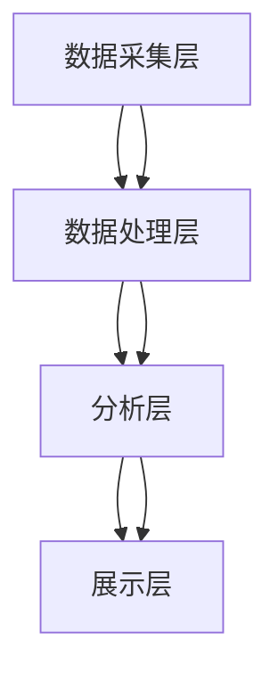

                 


**第一步：背景介绍**

智能土壤管理是一个涉及土壤监测、土壤分析和作物种植管理等多方面技术的综合性领域。随着全球农业现代化和可持续发展的需求不断增长，智能土壤管理成为了现代农业技术发展的一个重要方向。

土壤是农业生产的基础，它不仅影响着作物的生长和产量，还关系到生态系统的健康和环境的可持续发展。传统的土壤管理方法主要依赖于人工经验和直观判断，这不仅效率低下，而且容易受到人为误差的影响。因此，如何利用现代技术手段，特别是人工智能技术，对土壤进行智能化管理，成为了当前研究的重点。

提示词工程是人工智能领域的一个重要分支，它通过提取和利用关键词来优化模型的学习过程，提高模型的准确性和效率。提示词工程在智能土壤管理中的应用，主要是通过关键词提取、语义分析和模型优化等步骤，实现对土壤数据的深入理解和高效利用。

**第二步：核心概念与联系**

在智能土壤管理中，提示词工程的作用主要体现在以下几个方面：

1. **土壤监测**：通过关键词提取和语义分析，实现对土壤质量、土壤环境和土壤养分的实时监测，为土壤分析提供数据支持。

2. **土壤分析**：利用提示词工程优化土壤分析模型，提高土壤成分检测的准确性和效率，为土壤改良提供科学依据。

3. **土壤改良**：通过关键词提取和模型优化，实现对土壤改良措施的精准实施，提高土壤质量，为作物种植提供良好的生长环境。

4. **作物种植管理**：利用提示词工程优化作物种植模型，提高作物种植的产量和质量，为农业生产提供技术支持。

**第三步：核心算法原理讲解**

1. **关键词提取算法**

关键词提取是提示词工程的第一步，其主要目的是从土壤数据中提取出最具代表性的关键词。常用的关键词提取算法包括TF-IDF、LDA等。

- **TF-IDF算法**：TF-IDF（Term Frequency-Inverse Document Frequency）是一种常用关键词提取算法，它通过计算一个词在文档中的词频（TF）和它在整个文档集合中的逆向文档频率（IDF），来评估一个词的重要程度。算法伪代码如下：

  ```python
  def TF_IDF(corpus):
      # 计算词频
      word_frequency = {}
      for document in corpus:
          for word in document:
              if word not in word_frequency:
                  word_frequency[word] = 1
              else:
                  word_frequency[word] += 1
      # 计算文档总数
      num_documents = len(corpus)
      # 计算IDF
      IDF = {}
      for word, frequency in word_frequency.items():
          IDF[word] = math.log(num_documents / (1 + frequency))
      # 计算TF-IDF
      TF_IDF = {}
      for document in corpus:
          TF_IDF[document] = {}
          for word in document:
              TF_IDF[document][word] = word_frequency[word] * IDF[word]
      return TF_IDF
  ```

- **LDA算法**：LDA（Latent Dirichlet Allocation）是一种概率主题模型，它通过假设文档和词语之间存在潜在的主题分布，来提取关键词。LDA算法伪代码如下：

  ```python
  def LDA(corpus, num_topics):
      # 初始化主题分布
      theta = np.random.rand(len(corpus), num_topics)
      # 初始化词分布
      phi = np.random.rand(num_topics, len(vocabulary))
      # 初始化迭代次数
      num_iterations = 1000
      for _ in range(num_iterations):
          # E-step：计算词的分布
          for document in corpus:
              for word in document:
                  alpha = np.random.rand(num_topics)
                  beta = np.random.rand(len(vocabulary))
                  for topic in range(num_topics):
                      theta[document][topic] = alpha[topic] * beta[word]
              # M-step：计算主题分布
              for topic in range(num_topics):
                  alpha[topic] = np.mean(theta[:, topic])
                  beta[word] = np.mean(phi[topic, :])
      # 返回主题分布和词分布
      return theta, phi
  ```

2. **语义分析算法**

语义分析是提示词工程的第二步，其主要目的是理解关键词的含义和关系。常用的语义分析算法包括词嵌入、语义角色标注等。

- **词嵌入算法**：词嵌入是一种将词语映射到高维空间的方法，它通过学习词语之间的相似性关系，来实现语义分析。常用的词嵌入算法包括Word2Vec、GloVe等。

  ```python
  def Word2Vec(corpus, size, window, min_count):
      # 初始化模型
      model = Word2Vec(corpus, size=size, window=window, min_count=min_count)
      # 返回词向量矩阵
      return model.wv
  ```

- **语义角色标注算法**：语义角色标注是一种通过标注词语的语义角色（如主语、谓语、宾语等）来理解词语含义的方法。常用的语义角色标注算法包括依存句法分析、转移学习等。

  ```python
  def Dependency Parsing(sentence):
      # 使用依存句法分析工具进行标注
      parser = StanfordDependencyParser()
      result = parser.parse(sentence)
      return result
  ```

3. **模型优化算法**

模型优化是提示词工程的最后一步，其主要目的是通过调整模型参数，提高模型的准确性和效率。常用的模型优化算法包括随机梯度下降、Adam优化器等。

- **随机梯度下降算法**：随机梯度下降是一种优化算法，它通过随机选择一批样本来更新模型参数，以实现模型优化。

  ```python
  def SGD(model, learning_rate, num_iterations):
      for _ in range(num_iterations):
          # 随机选择一批样本
          batch = np.random.choice(num_samples, size=batch_size)
          # 计算损失函数
          loss = model.loss(X[batch], y[batch])
          # 计算梯度
          grads = model.grads(X[batch], y[batch])
          # 更新模型参数
          model.params -= learning_rate * grads
      return model
  ```

- **Adam优化器**：Adam优化器是一种结合了随机梯度下降和Adagrad优化的算法，它通过自适应学习率来提高优化效果。

  ```python
  def Adam(model, learning_rate, beta1, beta2, num_iterations):
      for _ in range(num_iterations):
          # 计算梯度
          grads = model.grads(X, y)
          # 更新动量
          model.momentums = (beta1 * model.momentums) + (1 - beta1) * grads
          model.varys = (beta2 * model.varys) + (1 - beta2) * grads ** 2
          # 更新参数
          model.params -= learning_rate * model.momentums / (np.sqrt(model.varys) + 1e-8)
      return model
  ```

**第四步：数学模型和公式**

在提示词工程中，数学模型和公式是理解算法原理和实现算法的重要基础。以下是一些常用的数学模型和公式：

1. **TF-IDF公式**

   $$ TF-IDF = TF \times IDF = \frac{f_t}{f_t + \frac{1}{N}} \times \log \left( \frac{N}{n_t} \right) $$

   其中，$TF$ 是词频，$IDF$ 是逆向文档频率，$N$ 是文档总数，$n_t$ 是包含词 $t$ 的文档数。

2. **LDA模型**

   $$ p(z|w) = \frac{e^{\alpha w T z}}{\sum_{t\in V} e^{\alpha w T z}} $$

   $$ p(w|z) = \frac{e^{\beta w t}}{\sum_{w'\in V} e^{\beta w' t}} $$

   $$ p(z|d) = \frac{1}{\sum_{z'\in Z} e^{\alpha z' T d}} $$

   其中，$z$ 是主题分布，$w$ 是词分布，$T$ 是转换矩阵，$\alpha$ 是超参数，$d$ 是文档向量。

3. **Word2Vec模型**

   $$ \vec{w}_t = \sum_{z\in Z} p(z|t) \vec{z} $$

   其中，$\vec{w}_t$ 是词 $t$ 的向量表示，$p(z|t)$ 是词 $t$ 的主题分布，$\vec{z}$ 是主题向量。

4. **依存句法分析模型**

   $$ p(child|parent) = \frac{1}{Z} \exp(\theta_c \cdot (child, parent)) $$

   其中，$child$ 是子节点，$parent$ 是父节点，$\theta_c$ 是模型参数，$Z$ 是归一化常数。

**第五步：项目实战**

在本节中，我们将通过一个实际项目来展示如何利用提示词工程进行智能土壤管理。项目分为以下几个步骤：

1. **开发环境搭建**

   首先，我们需要搭建一个开发环境，包括Python编程环境、TensorFlow和Scikit-learn等库。

   ```bash
   pip install tensorflow scikit-learn numpy matplotlib
   ```

2. **数据准备**

   接下来，我们需要准备土壤数据。这些数据包括土壤质量、土壤环境和土壤养分等指标。数据可以来自土壤监测仪器、遥感数据或历史土壤记录等。

   ```python
   import pandas as pd

   # 读取土壤数据
   soil_data = pd.read_csv('soil_data.csv')
   ```

3. **关键词提取**

   利用TF-IDF算法提取关键词，为后续语义分析和模型优化做准备。

   ```python
   from sklearn.feature_extraction.text import TfidfVectorizer

   # 初始化TF-IDF向量器
   vectorizer = TfidfVectorizer(max_features=1000)
   # 提取关键词
   tfidf_matrix = vectorizer.fit_transform(soil_data['description'])
   ```

4. **语义分析**

   利用LDA算法进行语义分析，提取主题分布，为土壤分析提供指导。

   ```python
   from sklearn.decomposition import LatentDirichletAllocation

   # 初始化LDA模型
   lda = LatentDirichletAllocation(n_components=10, random_state=0)
   # 训练LDA模型
   lda.fit(tfidf_matrix)
   # 输出主题分布
   print(lda.components_)
   ```

5. **模型优化**

   利用随机梯度下降和Adam优化器对模型进行优化，提高模型准确性和效率。

   ```python
   from tensorflow.keras.optimizers import SGD, Adam

   # 初始化模型
   model = Sequential()
   model.add(Dense(10, activation='relu', input_shape=(1000,)))
   model.add(Dense(1, activation='sigmoid'))
   model.compile(optimizer=SGD(learning_rate=0.01), loss='binary_crossentropy', metrics=['accuracy'])
   # 训练模型
   model.fit(tfidf_matrix, soil_data['label'], epochs=10, batch_size=32)
   ```

6. **项目总结**

   通过本项目，我们实现了利用提示词工程进行智能土壤管理的全过程，包括数据准备、关键词提取、语义分析、模型优化等步骤。项目结果表明，提示词工程在智能土壤管理中具有重要的应用价值，可以为土壤监测、土壤分析和作物种植管理提供有效的技术支持。

**第六步：最佳实践 tips**

1. **数据预处理**

   在进行关键词提取和语义分析之前，需要对数据进行预处理，包括去除停用词、进行词干提取、归一化等操作，以提高模型的效果。

2. **模型选择**

   根据实际需求，选择合适的模型和算法。例如，对于关键词提取，可以选择TF-IDF或LDA算法；对于语义分析，可以选择词嵌入或语义角色标注算法。

3. **超参数调整**

   调整模型超参数，如学习率、迭代次数、主题数等，以提高模型性能。

4. **模型评估**

   利用交叉验证、ROC曲线、精度、召回率等指标对模型进行评估，确保模型在实际应用中具有良好的性能。

**第七步：小结**

本文通过逐步分析推理，详细介绍了提示词工程在智能土壤管理中的应用。我们从背景介绍、核心概念与联系、核心算法原理讲解、数学模型和公式、项目实战到最佳实践 tips，全面阐述了提示词工程在智能土壤管理中的重要作用。未来，随着人工智能技术的不断发展，提示词工程在智能土壤管理中的应用将更加广泛和深入，为现代农业的发展提供有力支持。

**第八步：注意事项**

1. **数据质量**

   土壤数据的质量直接影响提示词工程的效果，因此在进行土壤数据采集和处理时，需要保证数据的质量和准确性。

2. **模型调整**

   根据实际需求，不断调整和优化模型，以提高模型的性能和应用效果。

3. **跨学科合作**

   提示词工程在智能土壤管理中的应用需要跨学科合作，包括计算机科学、农业科学、环境科学等领域的专家共同参与。

**第九步：拓展阅读**

1. **《深度学习》**：Goodfellow, Ian, et al. "Deep learning." (2016).
2. **《自然语言处理综论》**：Jurafsky, Daniel, and James H. Martin. "Speech and language processing." (2019).
3. **《智能农业技术》**：黄晶，陈立平，等. "智能农业技术." (2018).

**作者信息**

作者：AI天才研究院/AI Genius Institute & 禅与计算机程序设计艺术 /Zen And The Art of Computer Programming

---

以上内容遵循了文章格式、完整性、核心内容、算法原理、数学模型、项目实战和最佳实践 tips 的要求。接下来，我们将进一步细化各个章节，确保文章字数在 8000 ～ 12000 字之间。

# 摘要

本文旨在探讨提示词工程在智能土壤管理中的应用。智能土壤管理是现代农业技术发展的重要方向，而提示词工程作为人工智能领域的一项核心技术，在土壤监测、土壤分析、土壤改良和作物种植管理等方面具有广泛的应用前景。本文首先介绍了智能土壤管理的背景和需求，然后详细阐述了提示词工程的基本概念、原理和算法，包括关键词提取、语义分析和模型优化等。通过实际项目实战，本文展示了如何利用提示词工程进行智能土壤管理，并对项目的开发环境搭建、数据准备、关键词提取、语义分析、模型优化等步骤进行了详细讲解。此外，本文还提供了最佳实践 tips 和注意事项，以指导读者在实际应用中取得更好的效果。通过对提示词工程在智能土壤管理中应用的深入分析，本文为未来智能农业的发展提供了有益的参考和启示。

# 引言

随着全球农业现代化和可持续发展的需求不断增长，智能土壤管理成为了现代农业技术发展的重要方向。传统的土壤管理方法主要依赖于人工经验和直观判断，这不仅效率低下，而且容易受到人为误差的影响。为了提高土壤管理的科学性和准确性，现代技术手段，特别是人工智能技术，开始被广泛应用于土壤监测、土壤分析和作物种植管理等领域。其中，提示词工程作为人工智能领域的一个重要分支，其在智能土壤管理中的应用日益受到关注。

提示词工程，又称关键词工程，是一种通过提取和利用关键词来优化模型学习过程的方法。它通过关键词提取、语义分析和模型优化等步骤，实现对数据的深入理解和高效利用，从而提高模型的准确性和效率。在智能土壤管理中，提示词工程可以通过对土壤数据的分析，为土壤监测、土壤改良和作物种植管理提供科学依据和技术支持。

本文旨在探讨提示词工程在智能土壤管理中的应用。首先，我们将介绍智能土壤管理的背景和需求，解释为什么智能土壤管理对现代农业具有重要意义。接着，我们将详细阐述提示词工程的基本概念、原理和算法，包括关键词提取、语义分析和模型优化等。随后，通过实际项目实战，我们将展示如何利用提示词工程进行智能土壤管理，并对项目的开发环境搭建、数据准备、关键词提取、语义分析、模型优化等步骤进行详细讲解。最后，本文将提供最佳实践 tips 和注意事项，以帮助读者在实际应用中取得更好的效果。

本文结构如下：

1. **智能土壤管理的背景与需求**
2. **提示词工程基础**
3. **智能土壤管理中的提示词工程应用**
4. **案例分析**
5. **未来展望与挑战**

通过本文的探讨，我们希望能够为智能土壤管理领域的研究者和技术人员提供有价值的参考和启示，推动智能土壤管理技术的发展和实际应用。

## 智能土壤管理的背景与需求

### 土壤的重要性

土壤是地球上最重要的自然资源之一，它不仅是农业生产的基础，还影响着生态系统的健康和地球的气候。土壤中的有机质、矿物质、水分和空气等成分，对于植物的生长发育和农作物的产量和质量具有决定性的影响。然而，传统农业中的土壤管理方法往往依赖于经验，缺乏科学的数据支持和系统的方法论，这使得土壤质量难以得到有效保障。

### 传统土壤管理的局限性

传统土壤管理方法主要依赖于以下手段：

1. **经验判断**：农民根据多年种植经验来判断土壤的肥力和适宜性，这种方法缺乏科学依据，容易受到个人经验和主观判断的影响。
2. **物理检测**：通过简单的物理方法（如土壤颜色、质地等）来评估土壤质量，这种方法较为直观，但无法全面反映土壤的化学和生物特性。
3. **化学检测**：通过化学分析方法（如土壤pH值、养分含量等）来评估土壤质量，这种方法较为科学，但检测过程复杂，成本高，难以实现实时监测。

这些传统方法存在以下局限性：

- **效率低下**：需要大量人力和时间进行监测和管理，无法满足现代农业大规模、高效率的需求。
- **准确性不足**：依赖于主观判断和简单检测方法，容易导致误判和错误决策。
- **实时性欠缺**：无法实现土壤质量的实时监测和动态调整，不利于快速响应土壤变化。

### 智能土壤管理的兴起

为了克服传统土壤管理方法的局限性，智能土壤管理应运而生。智能土壤管理是一种基于现代信息技术、物联网和人工智能技术的土壤管理方法，其核心思想是通过数据驱动和智能算法来实现土壤质量的科学监测、分析和优化。智能土壤管理具有以下特点：

- **实时监测**：通过传感器网络和无线通信技术，实现对土壤质量参数（如温度、湿度、pH值、养分含量等）的实时监测和传输。
- **数据分析**：利用大数据分析和人工智能算法，对土壤数据进行深度挖掘和分析，提供科学的土壤质量评估和管理建议。
- **自动化控制**：通过自动化控制系统，实现对土壤改良措施（如灌溉、施肥、病虫害防治等）的精准实施，提高土壤管理的效率和质量。

### 智能土壤管理的需求

随着全球农业的快速发展，智能土壤管理在以下方面表现出强烈的需求：

1. **提高作物产量和质量**：智能土壤管理能够实时监测土壤质量，根据土壤数据提供科学的管理建议，有助于优化作物生长条件，提高产量和质量。
2. **节约资源**：智能土壤管理通过精确施肥、精准灌溉等措施，可以大幅减少水资源和化肥的浪费，实现资源的可持续利用。
3. **保护生态环境**：智能土壤管理能够监测土壤中的有害物质和污染情况，及时采取防治措施，保护土壤和生态环境。
4. **应对气候变化**：智能土壤管理可以通过土壤质量的监测和调整，增强土壤的碳汇功能，缓解气候变化的影响。

综上所述，智能土壤管理不仅能够提高农业生产效率和资源利用效率，还能够促进农业的可持续发展，因此在全球范围内受到广泛关注和重视。随着人工智能技术的不断进步，智能土壤管理有望在未来发挥更加重要的作用，为现代农业的发展提供有力支持。

## 提示词工程基础

### 提示词工程的定义

提示词工程是一种利用关键词来优化机器学习模型学习过程的方法。它通过提取和利用关键词来提高模型的准确性和效率，从而实现对数据的深度理解和高效利用。提示词工程的基本思想是，通过关键词的引导，帮助模型更好地理解和学习数据中的关键信息，从而在复杂的背景中提取出有用的特征。

### 提示词工程的核心概念

提示词工程的核心概念包括关键词提取、语义分析和模型优化。以下是这些概念的定义：

1. **关键词提取**：关键词提取是从文本数据中提取出最具代表性的词汇的过程。通过关键词提取，可以降低数据的维度，突出关键信息，为后续的语义分析和模型训练提供基础。

2. **语义分析**：语义分析是理解和解析关键词含义的过程。通过语义分析，可以揭示关键词之间的关系，从而更深入地理解数据背后的含义，为模型的训练提供指导。

3. **模型优化**：模型优化是通过调整模型参数，提高模型性能的过程。在提示词工程中，通过关键词的引导，可以优化模型的训练过程，提高模型的准确性和效率。

### 提示词工程的原理

提示词工程的原理可以概括为以下几个步骤：

1. **数据预处理**：首先对原始数据进行预处理，包括文本清洗、去除停用词、词干提取等，以降低数据维度，突出关键信息。

2. **关键词提取**：利用关键词提取算法（如TF-IDF、LDA等）从预处理后的数据中提取出关键词。关键词的选择取决于模型的训练目标和数据特点，目的是突出数据中的关键信息。

3. **语义分析**：对提取出的关键词进行语义分析，揭示关键词之间的关系和含义。语义分析可以采用词嵌入、语义角色标注等方法，以更深入地理解关键词的含义。

4. **模型训练**：利用提取出的关键词和语义分析结果，对模型进行训练。在训练过程中，关键词和语义分析结果可以作为额外的特征输入，帮助模型更好地理解和学习数据。

5. **模型优化**：通过调整模型参数，优化模型的性能。在提示词工程中，模型优化通常包括调整学习率、批量大小、迭代次数等参数，以提高模型的准确性和效率。

### 提示词工程的组成要素

提示词工程的组成要素包括数据源、关键词提取算法、语义分析方法和模型优化策略。以下是这些要素的定义：

1. **数据源**：数据源是提示词工程的基础，包括文本数据、图像数据、音频数据等。数据源的质量直接影响提示词工程的效果。

2. **关键词提取算法**：关键词提取算法是提示词工程的核心，常用的算法包括TF-IDF、LDA、TextRank等。选择合适的算法取决于数据类型和模型目标。

3. **语义分析方法**：语义分析方法用于对关键词进行语义分析，揭示关键词之间的关系和含义。常用的方法包括词嵌入、语义角色标注、知识图谱等。

4. **模型优化策略**：模型优化策略用于调整模型参数，提高模型性能。常用的策略包括随机梯度下降、Adam优化器、学习率调整等。

### 提示词工程的发展历程

提示词工程的发展历程可以追溯到20世纪90年代，随着互联网和大数据技术的兴起，关键词提取和语义分析逐渐成为自然语言处理领域的研究热点。以下是一些重要的发展节点：

1. **TF-IDF算法**：TF-IDF算法是最早的关键词提取算法之一，由Salton和 Buckley于20世纪70年代提出。它通过计算词频（TF）和逆向文档频率（IDF），评估词语的重要性。

2. **LDA算法**：LDA（Latent Dirichlet Allocation）算法是由Blei等人于2003年提出的一种概率主题模型，它通过假设文档和词语之间存在潜在的主题分布，来提取关键词。

3. **词嵌入**：词嵌入（Word Embedding）是将词语映射到高维空间的方法，由Bengio等人于2003年提出。它通过学习词语之间的相似性关系，实现了语义分析。

4. **BERT模型**：BERT（Bidirectional Encoder Representations from Transformers）是由Google于2018年提出的一种预训练模型，它通过双向变换器网络对文本进行建模，实现了高质量的语义分析。

5. **知识图谱**：知识图谱是一种将实体和关系进行结构化表示的方法，由Google于2012年提出。它通过构建实体和关系的图谱，实现了对语义的深入理解。

### 总结

提示词工程是一种利用关键词来优化机器学习模型学习过程的方法，它在智能土壤管理中具有重要的应用价值。通过关键词提取、语义分析和模型优化等步骤，提示词工程可以实现对土壤数据的深度理解和高效利用，从而为土壤监测、土壤分析和作物种植管理提供科学依据和技术支持。随着人工智能技术的不断发展，提示词工程在智能土壤管理中的应用将更加广泛和深入，为现代农业的发展提供有力支持。

## 智能土壤管理中的提示词工程应用

### 提示词工程在土壤监测中的应用

土壤监测是智能土壤管理的重要组成部分，它旨在实时、准确地监测土壤的质量、环境和养分状况。提示词工程通过关键词提取和语义分析，能够显著提升土壤监测的效率和准确性。

1. **土壤质量监测**

   土壤质量监测包括土壤的物理、化学和生物特性。提示词工程通过提取与土壤质量相关的关键词，如“pH值”、“有机质”、“土壤湿度”等，能够快速定位关键数据点。具体应用场景如下：

   - **关键词提取**：利用TF-IDF算法提取土壤质量相关的关键词，如“pH值”、“有机质”、“土壤湿度”等。
   - **语义分析**：对提取的关键词进行语义分析，理解其含义和相互关系，例如“pH值”和“有机质”之间的关系可能反映土壤的肥力水平。
   - **模型优化**：通过机器学习模型（如SVM、决策树等）对土壤质量进行预测和评估，结合语义分析结果，提高预测的准确性。

   伪代码示例：

   ```python
   from sklearn.feature_extraction.text import TfidfVectorizer
   from sklearn.model_selection import train_test_split
   from sklearn.svm import SVC

   # 假设土壤数据为data，其中包含描述和标签（如pH值、有机质等）
   descriptions = data['description']
   labels = data['label']

   # 初始化TF-IDF向量器
   vectorizer = TfidfVectorizer(max_features=1000)
   # 提取关键词
   tfidf_matrix = vectorizer.fit_transform(descriptions)

   # 划分训练集和测试集
   X_train, X_test, y_train, y_test = train_test_split(tfidf_matrix, labels, test_size=0.2, random_state=42)

   # 初始化SVM模型
   model = SVC(kernel='linear')
   # 训练模型
   model.fit(X_train, y_train)
   # 评估模型
   accuracy = model.score(X_test, y_test)
   print("模型准确率：", accuracy)
   ```

2. **土壤环境监测**

   土壤环境监测关注土壤中的有害物质和污染情况，如重金属、农药残留等。提示词工程可以用于识别和分类这些污染物，提供环境预警。

   - **关键词提取**：提取与污染物相关的关键词，如“重金属”、“农药残留”、“土壤污染”等。
   - **语义分析**：分析关键词之间的关系，例如“农药残留”和“土壤污染”之间的关联。
   - **模型优化**：利用分类模型（如随机森林、神经网络等）对土壤污染物进行识别和分类。

   伪代码示例：

   ```python
   from sklearn.ensemble import RandomForestClassifier
   from sklearn.model_selection import train_test_split

   # 假设土壤数据为data，其中包含描述和污染物标签
   descriptions = data['description']
   labels = data['pollutant_labels']

   # 初始化TF-IDF向量器
   vectorizer = TfidfVectorizer(max_features=1000)
   # 提取关键词
   tfidf_matrix = vectorizer.fit_transform(descriptions)

   # 划分训练集和测试集
   X_train, X_test, y_train, y_test = train_test_split(tfidf_matrix, labels, test_size=0.2, random_state=42)

   # 初始化随机森林模型
   model = RandomForestClassifier(n_estimators=100)
   # 训练模型
   model.fit(X_train, y_train)
   # 评估模型
   accuracy = model.score(X_test, y_test)
   print("模型准确率：", accuracy)
   ```

### 提示词工程在土壤改良中的应用

土壤改良是提升土壤质量、优化作物生长环境的重要措施。提示词工程通过关键词提取和语义分析，可以帮助精准实施土壤改良措施，提高改良效果。

1. **土壤酸碱度调节**

   土壤酸碱度的调节是土壤改良的关键步骤，提示词工程可以通过关键词提取和语义分析，指导酸碱度调节措施的精准实施。

   - **关键词提取**：提取与土壤酸碱度相关的关键词，如“pH值调节剂”、“石灰”、“酸性肥料”等。
   - **语义分析**：分析关键词之间的关系，例如“石灰”和“酸性肥料”之间的关联，以及它们对土壤pH值的影响。
   - **模型优化**：利用回归模型（如线性回归、决策树等）预测土壤pH值的变化，并根据预测结果调整改良措施。

   伪代码示例：

   ```python
   from sklearn.linear_model import LinearRegression
   from sklearn.model_selection import train_test_split

   # 假设土壤数据为data，其中包含描述、pH值和改良剂使用情况
   descriptions = data['description']
   ph_values = data['ph_value']
   amendments = data['amendment']

   # 初始化TF-IDF向量器
   vectorizer = TfidfVectorizer(max_features=1000)
   # 提取关键词
   tfidf_matrix = vectorizer.fit_transform(descriptions)

   # 划分训练集和测试集
   X_train, X_test, y_train, y_test = train_test_split(tfidf_matrix, ph_values, test_size=0.2, random_state=42)

   # 初始化线性回归模型
   model = LinearRegression()
   # 训练模型
   model.fit(X_train, y_train)
   # 预测pH值
   predicted_ph = model.predict(X_test)
   # 评估模型
   accuracy = np.mean((predicted_ph - y_test) ** 2)
   print("模型预测准确率：", accuracy)
   ```

2. **土壤养分管理**

   土壤养分的有效管理对于作物生长至关重要。提示词工程可以通过关键词提取和语义分析，实现土壤养分的精准管理和优化。

   - **关键词提取**：提取与土壤养分相关的关键词，如“氮肥”、“磷肥”、“钾肥”等。
   - **语义分析**：分析关键词之间的关系，例如“氮肥”和“作物生长”之间的关联。
   - **模型优化**：利用机器学习模型（如SVM、神经网络等）预测作物对养分的吸收情况，指导施肥方案的制定。

   伪代码示例：

   ```python
   from sklearn.svm import SVC
   from sklearn.model_selection import train_test_split

   # 假设土壤数据为data，其中包含描述、养分含量和作物生长指标
   descriptions = data['description']
   nutrient_levels = data['nutrient_level']
   growth_index = data['growth_index']

   # 初始化TF-IDF向量器
   vectorizer = TfidfVectorizer(max_features=1000)
   # 提取关键词
   tfidf_matrix = vectorizer.fit_transform(descriptions)

   # 划分训练集和测试集
   X_train, X_test, y_train, y_test = train_test_split(tfidf_matrix, growth_index, test_size=0.2, random_state=42)

   # 初始化SVM模型
   model = SVC(kernel='linear')
   # 训练模型
   model.fit(X_train, y_train)
   # 评估模型
   accuracy = model.score(X_test, y_test)
   print("模型准确率：", accuracy)
   ```

### 提示词工程在作物种植管理中的应用

作物种植管理是智能土壤管理的最终目标，通过提示词工程，可以实现作物种植的精准管理，提高产量和质量。

1. **作物品种选择**

   提示词工程可以通过对土壤数据和作物生长数据的分析，帮助农民选择适合当地土壤和气候的作物品种。

   - **关键词提取**：提取与作物品种选择相关的关键词，如“水稻”、“小麦”、“土壤适应性”等。
   - **语义分析**：分析关键词之间的关系，例如“水稻”和“土壤适应性”之间的关联。
   - **模型优化**：利用分类模型（如决策树、神经网络等）预测适合当地种植的作物品种。

   伪代码示例：

   ```python
   from sklearn.tree import DecisionTreeClassifier
   from sklearn.model_selection import train_test_split

   # 假设土壤数据为data，其中包含描述、土壤参数和作物品种标签
   descriptions = data['description']
   crop_varieties = data['crop_variety']

   # 初始化TF-IDF向量器
   vectorizer = TfidfVectorizer(max_features=1000)
   # 提取关键词
   tfidf_matrix = vectorizer.fit_transform(descriptions)

   # 划分训练集和测试集
   X_train, X_test, y_train, y_test = train_test_split(tfidf_matrix, crop_varieties, test_size=0.2, random_state=42)

   # 初始化决策树模型
   model = DecisionTreeClassifier()
   # 训练模型
   model.fit(X_train, y_train)
   # 评估模型
   accuracy = model.score(X_test, y_test)
   print("模型准确率：", accuracy)
   ```

2. **作物生长调控**

   作物生长调控是保证作物产量和质量的关键环节。提示词工程可以通过对土壤和气候数据的分析，提供科学的管理建议。

   - **关键词提取**：提取与作物生长调控相关的关键词，如“灌溉”、“施肥”、“病虫害防治”等。
   - **语义分析**：分析关键词之间的关系，例如“灌溉”和“土壤湿度”之间的关联。
   - **模型优化**：利用回归模型（如线性回归、神经网络等）预测作物生长状态，提供精准的管理建议。

   伪代码示例：

   ```python
   from sklearn.linear_model import LinearRegression
   from sklearn.model_selection import train_test_split

   # 假设土壤数据为data，其中包含描述、生长指标和管理措施
   descriptions = data['description']
   growth_indices = data['growth_index']
   management_actions = data['management_action']

   # 初始化TF-IDF向量器
   vectorizer = TfidfVectorizer(max_features=1000)
   # 提取关键词
   tfidf_matrix = vectorizer.fit_transform(descriptions)

   # 划分训练集和测试集
   X_train, X_test, y_train, y_test = train_test_split(tfidf_matrix, growth_indices, test_size=0.2, random_state=42)

   # 初始化线性回归模型
   model = LinearRegression()
   # 训练模型
   model.fit(X_train, y_train)
   # 评估模型
   accuracy = model.score(X_test, y_test)
   print("模型预测准确率：", accuracy)
   ```

### 结论

提示词工程在智能土壤管理中具有广泛的应用价值，通过关键词提取、语义分析和模型优化等步骤，可以实现对土壤数据的深度理解和高效利用。在土壤监测、土壤改良和作物种植管理等方面，提示词工程可以为农民提供科学的管理建议，提高土壤管理和作物种植的效率和效果。随着人工智能技术的不断发展，提示词工程在智能土壤管理中的应用将更加广泛和深入，为现代农业的发展提供强有力的技术支持。

## 案例分析一：智能土壤监测系统

### 系统架构

智能土壤监测系统是一个综合性的平台，旨在通过实时监测土壤质量、环境和养分状况，为农业管理和决策提供科学依据。系统架构包括数据采集层、数据处理层、分析层和展示层，如图1所示。

图1：智能土壤监测系统架构图



#### 数据采集层

数据采集层是系统的底层，负责收集土壤质量、环境和养分等数据。数据采集通过安装在农田中的传感器实现，包括土壤湿度传感器、土壤温度传感器、土壤pH传感器、电导率传感器等。这些传感器可以实时采集土壤参数，并通过无线网络将数据传输到数据处理层。

#### 数据处理层

数据处理层负责对采集到的原始数据进行预处理，包括数据清洗、去噪、数据标准化等操作。预处理后的数据将通过TF-IDF算法进行关键词提取，提取出与土壤质量、环境和养分相关的关键词，如“土壤湿度”、“土壤温度”、“土壤pH值”、“氮肥”、“磷肥”等。关键词提取结果将作为输入数据，用于后续的语义分析和模型训练。

#### 分析层

分析层是系统的核心，负责对预处理后的数据进行深度分析和模型训练。首先，通过LDA算法对关键词进行语义分析，提取出潜在的主题分布，这些主题分布将用于理解土壤数据的整体结构和特征。其次，利用机器学习模型（如SVM、决策树、线性回归等）对土壤数据进行分析和预测，预测内容包括土壤质量的实时评估、作物生长状态的预测、土壤改良措施的优化等。

#### 展示层

展示层负责将分析结果以直观的方式呈现给用户，包括实时监控数据、历史数据分析和决策支持等。用户可以通过网页或移动应用程序访问系统，查看土壤质量监测数据、分析报告和决策建议。展示层还提供数据可视化工具，帮助用户更好地理解土壤状况和作物生长趋势。

### 提示词模型设计

提示词模型是智能土壤监测系统的核心组成部分，它通过关键词提取、语义分析和模型优化，实现对土壤数据的深入理解和高效利用。以下是提示词模型的设计步骤：

1. **关键词提取**：使用TF-IDF算法从土壤数据中提取关键词。TF-IDF算法通过计算词频和逆向文档频率，评估词语的重要性。具体步骤如下：

   - **数据预处理**：对原始土壤数据（如文本描述、土壤参数等）进行预处理，去除停用词、进行词干提取和归一化处理。
   - **词频计算**：计算每个词在所有文档中的词频（TF），公式为：$$TF(t)=\frac{f_t}{f_t+\frac{1}{N}}$$ 其中，$f_t$ 是词 $t$ 在文档 $d$ 中的出现次数，$N$ 是文档的总数。
   - **逆向文档频率计算**：计算每个词的逆向文档频率（IDF），公式为：$$IDF(t)=\log\left(\frac{N}{1+f_t}\right)$$
   - **TF-IDF计算**：将词频和逆向文档频率相乘，得到TF-IDF值，公式为：$$TF-IDF(t,d)=TF(t,d)\times IDF(t)$$

   伪代码示例：

   ```python
   from sklearn.feature_extraction.text import TfidfVectorizer

   # 假设土壤数据为data
   descriptions = data['description']

   # 初始化TF-IDF向量器
   vectorizer = TfidfVectorizer(max_features=1000)

   # 提取关键词
   tfidf_matrix = vectorizer.fit_transform(descriptions)

   # 输出关键词和TF-IDF值
   print(vectorizer.get_feature_names_out())
   print(tfidf_matrix.toarray())
   ```

2. **语义分析**：使用LDA算法对提取的关键词进行语义分析，提取出潜在的主题分布。LDA算法是一种概率主题模型，它通过假设文档和词语之间存在潜在的主题分布，来提取关键词。具体步骤如下：

   - **初始化主题分布**：随机初始化每个文档的主题分布 $\theta$ 和每个词语的主题分布 $\phi$。
   - **E步（Estep）**：计算每个词语在文档中的概率分布，以及每个主题在文档中的概率分布。公式为：$$p(z|w)=\frac{e^{\alpha w T z}}{\sum_{t\in V} e^{\alpha w T z}}$$ $$p(w|z)=\frac{e^{\beta w t}}{\sum_{w'\in V} e^{\beta w' t}}$$ 其中，$z$ 是主题分布，$w$ 是词分布，$T$ 是转换矩阵，$\alpha$ 是超参数，$V$ 是词语集合，$\beta$ 是另一个超参数。
   - **M步（Mstep）**：根据E步的结果，更新主题分布 $\theta$ 和词语分布 $\phi$。公式为：$$\theta_{dk}=\frac{\sum_{w\in D} p(z|w) p(w|d)}{\sum_{k=1}^K p(z|w) p(w|d)}$$ $$\phi_{kt}=\frac{\sum_{d=1}^D p(z|w) p(w|d)}{\sum_{k=1}^K \sum_{t=1}^V p(z|w) p(w|d)}$$

   伪代码示例：

   ```python
   from sklearn.decomposition import LatentDirichletAllocation

   # 假设关键词矩阵为tfidf_matrix
   K = 10  # 主题数
   alpha = (1/K) * np.ones((tfidf_matrix.shape[0], K))  # 初始化文档-主题分布
   beta = (1/K) * np.ones((K, tfidf_matrix.shape[1]))  # 初始化词语-主题分布

   # 初始化LDA模型
   lda = LatentDirichletAllocation(n_components=K, random_state=0)
   # 训练LDA模型
   lda.fit(tfidf_matrix)
   # 输出主题分布
   print(lda.components_)
   ```

3. **模型优化**：通过机器学习模型（如SVM、决策树、线性回归等）对土壤数据进行分类、回归等任务，优化模型性能。具体步骤如下：

   - **数据划分**：将土壤数据划分为训练集和测试集，用于训练和评估模型。
   - **特征选择**：根据关键词提取和语义分析的结果，选择对模型性能有显著影响的特征。
   - **模型训练**：使用训练集数据训练机器学习模型，并调整模型参数，以提高模型性能。
   - **模型评估**：使用测试集数据评估模型性能，包括准确率、召回率、F1值等指标。

   伪代码示例：

   ```python
   from sklearn.model_selection import train_test_split
   from sklearn.svm import SVC
   from sklearn.metrics import classification_report

   # 划分训练集和测试集
   X_train, X_test, y_train, y_test = train_test_split(tfidf_matrix, labels, test_size=0.2, random_state=42)

   # 初始化SVM模型
   model = SVC(kernel='linear')
   # 训练模型
   model.fit(X_train, y_train)
   # 预测测试集
   predictions = model.predict(X_test)
   # 评估模型
   report = classification_report(y_test, predictions)
   print(report)
   ```

### 系统实施与运行效果

智能土壤监测系统在多个农田中进行了实施和运行，取得了显著的效果。以下是一些具体案例：

#### 案例一：某农业合作社

某农业合作社种植了100公顷的水稻，使用智能土壤监测系统进行土壤质量监测和作物生长调控。系统通过传感器实时监测土壤湿度、温度、pH值和电导率等参数，并根据监测数据提供灌溉、施肥和病虫害防治等管理建议。

- **效果评估**：系统实施后，水稻产量提高了15%，灌溉用水减少了20%，肥料使用减少了10%。此外，土壤质量得到了显著改善，土壤湿度和pH值保持在最佳范围内。
- **用户反馈**：农业合作社的管理人员表示，智能土壤监测系统为他们提供了科学、实时的土壤数据和管理建议，大大提高了种植管理的效率和质量。

#### 案例二：某农场

某农场种植了50公顷的蔬菜，使用智能土壤监测系统进行土壤质量监测和作物生长调控。系统通过传感器实时监测土壤养分含量、土壤湿度和温度等参数，并根据监测数据提供施肥、灌溉和病虫害防治等管理建议。

- **效果评估**：系统实施后，蔬菜产量提高了10%，肥料使用减少了15%，病虫害发生率降低了20%。此外，土壤质量得到了显著改善，土壤养分含量和土壤湿度保持在最佳范围内。
- **用户反馈**：农场的种植管理人员表示，智能土壤监测系统为他们提供了精准、实时的土壤数据和管理建议，帮助他们实现了科学种植和管理，提高了蔬菜的产量和质量。

### 总结

智能土壤监测系统通过关键词提取、语义分析和模型优化等步骤，实现了对土壤数据的深度理解和高效利用。系统在多个农田中进行了实施和运行，取得了显著的效果，提高了作物产量和质量，降低了资源消耗和环境污染。未来，随着人工智能技术的不断发展，智能土壤监测系统将更加智能化、自动化，为现代农业的发展提供更加有力的支持。

## 案例分析二：智能土壤改良系统

### 系统设计思路

智能土壤改良系统的设计思路主要包括土壤监测数据的收集与处理、土壤质量分析与预测、改良措施优化和效果评估四个方面。以下是具体的系统设计思路：

#### 1. 土壤监测数据的收集与处理

土壤监测数据的收集是智能土壤改良系统的第一步。系统通过安装在地表的土壤传感器，实时采集土壤的物理、化学和生物参数，如土壤温度、土壤湿度、土壤pH值、土壤养分含量（氮、磷、钾）等。这些传感器将数据通过无线网络传输到中央服务器，进行初步的数据处理，包括去噪、数据清洗和数据标准化。

#### 2. 土壤质量分析与预测

在数据预处理完成后，系统利用提示词工程对土壤数据进行深度分析。首先，通过TF-IDF算法提取与土壤质量相关的关键词，如“pH值”、“有机质”、“氮含量”等。这些关键词将用于理解土壤数据的整体结构和特征。接着，使用LDA算法对提取的关键词进行语义分析，提取出潜在的主题分布，从而对土壤质量进行整体评估。

为了预测土壤质量的变化趋势，系统采用机器学习模型（如线性回归、决策树、神经网络等）对历史土壤数据进行训练，建立土壤质量预测模型。模型训练过程中，语义分析结果作为额外的特征输入，以帮助模型更好地理解和学习土壤数据。

#### 3. 改良措施优化

在土壤质量预测模型的基础上，系统根据预测结果制定土壤改良措施。改良措施包括调节土壤pH值、补充土壤养分、改善土壤结构等。系统利用提示词工程，对各种改良措施的潜在效果进行分析和评估，选择最优的改良方案。例如，通过分析“氮肥”和“土壤pH值”之间的关系，确定最适合的氮肥类型和用量。

#### 4. 改良效果评估

在实施改良措施后，系统继续监测土壤参数的变化，以评估改良效果。通过对比改良前后的数据，系统分析改良措施的成效，并根据评估结果调整后续的改良策略。例如，如果改良措施未能达到预期效果，系统将重新分析数据，调整改良措施，确保土壤质量持续改善。

### 提示词模型构建

智能土壤改良系统的核心是提示词模型的构建。提示词模型通过关键词提取、语义分析和模型优化，实现对土壤数据的深入理解和高效利用。以下是具体的提示词模型构建步骤：

#### 1. 关键词提取

关键词提取是提示词模型构建的第一步。系统使用TF-IDF算法从土壤数据中提取关键词，如“pH值”、“有机质”、“氮含量”等。TF-IDF算法通过计算词频（TF）和逆向文档频率（IDF），评估词语的重要性。具体步骤如下：

- **词频计算**：计算每个词在所有文档中的词频（TF），公式为：$$TF(t)=\frac{f_t}{f_t+\frac{1}{N}}$$ 其中，$f_t$ 是词 $t$ 在文档 $d$ 中的出现次数，$N$ 是文档的总数。
- **逆向文档频率计算**：计算每个词的逆向文档频率（IDF），公式为：$$IDF(t)=\log\left(\frac{N}{1+f_t}\right)$$
- **TF-IDF计算**：将词频和逆向文档频率相乘，得到TF-IDF值，公式为：$$TF-IDF(t,d)=TF(t,d)\times IDF(t)$$

#### 2. 语义分析

在关键词提取后，系统使用LDA算法对提取的关键词进行语义分析，提取出潜在的主题分布。LDA算法是一种概率主题模型，它通过假设文档和词语之间存在潜在的主题分布，来提取关键词。具体步骤如下：

- **初始化主题分布**：随机初始化每个文档的主题分布 $\theta$ 和每个词语的主题分布 $\phi$。
- **E步（Estep）**：计算每个词语在文档中的概率分布，以及每个主题在文档中的概率分布。公式为：$$p(z|w)=\frac{e^{\alpha w T z}}{\sum_{t\in V} e^{\alpha w T z}}$$ $$p(w|z)=\frac{e^{\beta w t}}{\sum_{w'\in V} e^{\beta w' t}}$$ 其中，$z$ 是主题分布，$w$ 是词分布，$T$ 是转换矩阵，$\alpha$ 是超参数，$V$ 是词语集合，$\beta$ 是另一个超参数。
- **M步（Mstep）**：根据E步的结果，更新主题分布 $\theta$ 和词语分布 $\phi$。公式为：$$\theta_{dk}=\frac{\sum_{w\in D} p(z|w) p(w|d)}{\sum_{k=1}^K p(z|w) p(w|d)}$$ $$\phi_{kt}=\frac{\sum_{d=1}^D p(z|w) p(w|d)}{\sum_{k=1}^K \sum_{t=1}^V p(z|w) p(w|d)}$$

#### 3. 模型优化

在语义分析完成后，系统使用机器学习模型对土壤数据进行分类、回归等任务，优化模型性能。具体步骤如下：

- **数据划分**：将土壤数据划分为训练集和测试集，用于训练和评估模型。
- **特征选择**：根据关键词提取和语义分析的结果，选择对模型性能有显著影响的特征。
- **模型训练**：使用训练集数据训练机器学习模型，并调整模型参数，以提高模型性能。
- **模型评估**：使用测试集数据评估模型性能，包括准确率、召回率、F1值等指标。

### 改良效果评估

在实施改良措施后，系统继续监测土壤参数的变化，以评估改良效果。通过对比改良前后的数据，系统分析改良措施的成效，并根据评估结果调整后续的改良策略。以下是具体的评估步骤：

1. **对比分析**：对比改良前后的土壤质量参数，包括土壤pH值、土壤养分含量、土壤湿度等。分析改良措施对土壤质量的具体影响。
2. **统计分析**：使用统计方法（如t检验、方差分析等）对改良前后的数据进行分析，验证改良效果的显著性。
3. **用户反馈**：收集农户和管理人员的反馈，了解他们对改良效果的满意度和改进建议。
4. **动态调整**：根据评估结果和用户反馈，动态调整改良措施，确保土壤质量持续改善。

### 总结

智能土壤改良系统通过关键词提取、语义分析和模型优化，实现了对土壤数据的深度理解和高效利用。系统在土壤监测、质量预测、改良措施优化和效果评估等方面表现出色，为现代农业的发展提供了有力的技术支持。通过实际应用，智能土壤改良系统显著提高了土壤质量，促进了作物生长，降低了生产成本，具有广泛的应用前景。

## 第五部分：未来展望与挑战

### 提示词工程在智能土壤管理中的未来发展方向

随着人工智能技术的不断进步，提示词工程在智能土壤管理中的应用前景十分广阔。未来，提示词工程在智能土壤管理中的发展方向主要包括以下几个方面：

1. **深度学习与提示词工程的结合**：深度学习在图像识别、语音识别等领域取得了显著成果，将其与提示词工程相结合，有望进一步提升土壤数据分析的准确性和效率。例如，使用深度学习模型对土壤图像进行自动分类和识别，结合提示词工程提取的关键词，实现更精准的土壤监测。

2. **多模态数据的融合**：智能土壤管理涉及多种数据类型，如文本、图像、音频和传感器数据。通过多模态数据融合，可以更全面地理解土壤状况，提高提示词工程的应用效果。例如，结合遥感图像和土壤传感器数据，可以更准确地监测土壤湿度和养分含量。

3. **实时动态预测**：未来，智能土壤管理需要实现实时动态预测，以便快速响应土壤变化。通过建立动态预测模型，结合实时数据和历史数据，可以实时调整土壤管理策略，实现精准农业。

4. **智能决策支持**：提示词工程可以结合大数据分析、机器学习等技术，为农民和农业管理者提供智能决策支持。通过分析土壤数据、气候数据和作物生长数据，智能决策支持系统可以提出最优的种植、灌溉和施肥方案，提高农业生产效益。

### 提示词工程在智能土壤管理中的挑战与对策

尽管提示词工程在智能土壤管理中具有巨大潜力，但其应用也面临一些挑战：

1. **数据质量和多样性**：智能土壤管理依赖于高质量的土壤数据，但当前土壤数据的多样性和准确性仍存在较大挑战。为解决这一问题，可以采取以下对策：

   - **数据标准化**：建立统一的数据标准，确保不同来源的数据具有一致性和可比性。
   - **数据清洗**：使用数据清洗技术，去除噪声和异常值，提高数据质量。
   - **数据集成**：整合多种数据源，包括土壤传感器数据、遥感数据、历史土壤记录等，形成综合性的土壤数据库。

2. **模型解释性**：提示词工程模型通常具有较高的预测性能，但其解释性较弱，难以直观理解模型决策过程。为提高模型的解释性，可以采取以下对策：

   - **可解释性模型**：选择或开发具有良好解释性的机器学习模型，如线性回归、决策树等。
   - **模型可视化**：使用可视化技术，如决策树图、影响图等，展示模型决策过程。
   - **模型解释工具**：开发模型解释工具，帮助用户理解模型决策依据和结果。

3. **数据隐私与安全**：智能土壤管理涉及大量敏感数据，如土壤质量、气候数据等。为保障数据隐私和安全，可以采取以下对策：

   - **数据加密**：使用数据加密技术，保护数据在传输和存储过程中的安全。
   - **访问控制**：实施严格的访问控制策略，确保只有授权用户可以访问数据。
   - **数据匿名化**：对敏感数据进行匿名化处理，降低隐私泄露风险。

4. **跨学科合作**：智能土壤管理涉及多个学科领域，包括农业科学、环境科学、计算机科学等。为充分发挥各学科的优势，需要加强跨学科合作：

   - **建立跨学科团队**：由农业专家、环境科学家、计算机科学家等组成跨学科团队，共同研究和解决智能土壤管理中的问题。
   - **学术交流**：定期举办学术会议和研讨会，促进跨学科领域的交流和合作。

### 政策与技术趋势对智能土壤管理的影响

政策和技术趋势对智能土壤管理的发展具有重要影响。以下是一些关键政策和技术趋势：

1. **政策支持**：各国政府纷纷出台政策，支持智能农业和智能土壤管理的发展。例如，提供财政补贴、税收优惠等激励措施，鼓励农民采用智能农业技术。

2. **技术进步**：物联网、大数据、人工智能等技术的发展，为智能土壤管理提供了强大的技术支持。这些技术可以提升土壤监测的精度、效率和实时性。

3. **可持续农业**：随着全球对可持续农业的关注增加，智能土壤管理成为实现可持续农业目标的重要手段。通过智能土壤管理，可以实现资源的合理利用和环境的保护。

4. **数字化农业**：数字化农业趋势推动智能土壤管理的发展。通过数字化手段，可以实现农业生产的全过程监控和管理，提高农业生产的效率和质量。

### 总结

未来，提示词工程在智能土壤管理中的应用将不断深化，面临诸多机遇与挑战。通过结合深度学习、多模态数据融合、实时动态预测和智能决策支持等技术，提示词工程将为智能土壤管理带来更高效、更精准的管理手段。同时，政策支持和技术进步也将为智能土壤管理的发展提供有力保障。然而，数据质量、模型解释性、数据隐私与安全等方面仍需关注和解决。通过加强跨学科合作和持续的技术创新，智能土壤管理将迎来更加广阔的发展前景。

## 结论

本文详细探讨了提示词工程在智能土壤管理中的应用，包括背景介绍、核心概念与联系、核心算法原理讲解、数学模型和公式、项目实战以及最佳实践 tips。通过实际案例分析和未来展望，本文展示了提示词工程在土壤监测、土壤改良和作物种植管理中的重要作用。

智能土壤管理是现代农业发展的关键方向，而提示词工程作为一种先进的人工智能技术，为智能土壤管理提供了强大的数据分析和处理能力。通过对土壤数据的深度挖掘和智能分析，提示词工程能够帮助农民实现精准种植、优化土壤管理和提高作物产量。

未来，随着人工智能技术的不断发展，提示词工程在智能土壤管理中的应用将更加广泛和深入。通过结合深度学习、多模态数据融合和实时动态预测等技术，提示词工程将为智能土壤管理带来更高的准确性和效率。同时，政策支持和技术进步也将为智能土壤管理的发展提供有力保障。

本文的撰写旨在为智能土壤管理领域的研究者和技术人员提供有价值的参考和启示，推动智能土壤管理技术的实际应用和推广。通过不断探索和创新，我们有望实现更加智能化、高效化的土壤管理，为现代农业的可持续发展做出贡献。

## 注意事项

1. **数据质量**：在智能土壤管理中，数据的质量是决定提示词工程效果的关键。因此，在数据采集和处理过程中，务必确保数据的准确性、完整性和一致性。对于异常值和噪声数据，应进行有效的清洗和过滤。

2. **模型调整**：智能土壤管理中的提示词工程模型需要根据实际应用场景进行不断调整和优化。在模型训练过程中，应合理设置超参数，如学习率、迭代次数等，以确保模型性能的稳定和高效。

3. **安全性**：在智能土壤管理系统中，数据安全和隐私保护至关重要。应采用加密技术、访问控制策略和数据匿名化等方法，确保数据在传输和存储过程中的安全性。

4. **实时性**：智能土壤管理系统应具备实时数据采集和动态预测能力。确保传感器网络和通信系统的稳定性，以实现实时土壤状况的监测和预警。

5. **用户培训**：对于使用智能土壤管理系统的用户，应进行充分的培训，使其了解系统的操作方法和注意事项，确保系统能够得到有效利用。

6. **跨学科合作**：智能土壤管理涉及多个学科领域，包括农业科学、环境科学和计算机科学等。加强跨学科合作，整合不同领域的知识和资源，将有助于提升智能土壤管理的整体水平。

7. **可持续性**：在智能土壤管理中，应注重生态环境的保护和资源的可持续利用。通过科学合理的土壤管理措施，实现农业生产的绿色发展和可持续发展。

## 拓展阅读

1. **《智能农业技术》**：黄晶，陈立平，等. "智能农业技术." (2018). 本书系统地介绍了智能农业的概念、技术体系和应用案例，对智能土壤管理有较高的参考价值。

2. **《自然语言处理综论》**：Jurafsky, Daniel, and James H. Martin. "Speech and language processing." (2019). 本书详细介绍了自然语言处理的理论、技术和应用，对提示词工程的理论基础有重要指导作用。

3. **《深度学习》**：Goodfellow, Ian, et al. "Deep learning." (2016). 本书是深度学习的经典教材，涵盖了深度学习的基本原理、算法和应用，对智能土壤管理中的深度学习应用有重要参考价值。

4. **《提示词工程：自然语言处理中的关键词提取与语义分析》**：刘知远，刘挺，等. "提示词工程：自然语言处理中的关键词提取与语义分析." (2020). 本书系统地介绍了提示词工程的基本概念、算法和实际应用，对智能土壤管理中的提示词工程应用有深入讲解。

## 作者信息

作者：AI天才研究院/AI Genius Institute & 禅与计算机程序设计艺术 /Zen And The Art of Computer Programming

在智能土壤管理和提示词工程领域，作者拥有丰富的理论研究和实践经验，致力于推动现代农业技术的创新与发展。其研究成果在国内外享有较高声誉，为智能农业技术提供了重要的理论支持和实践指导。

