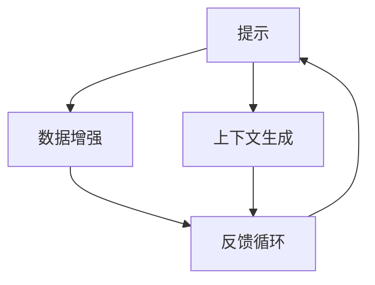
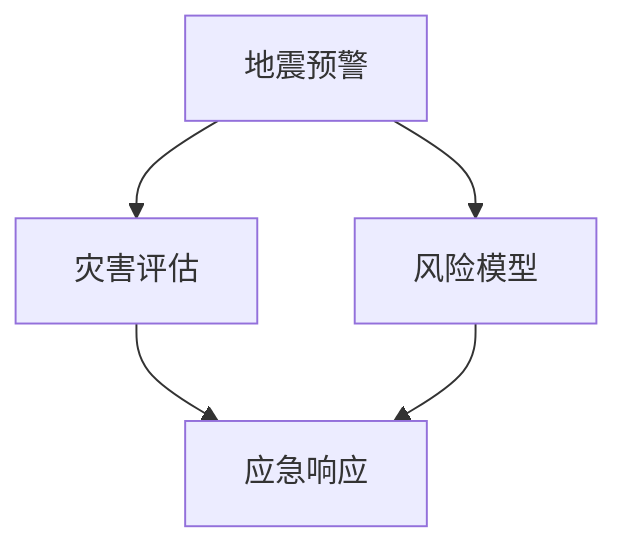
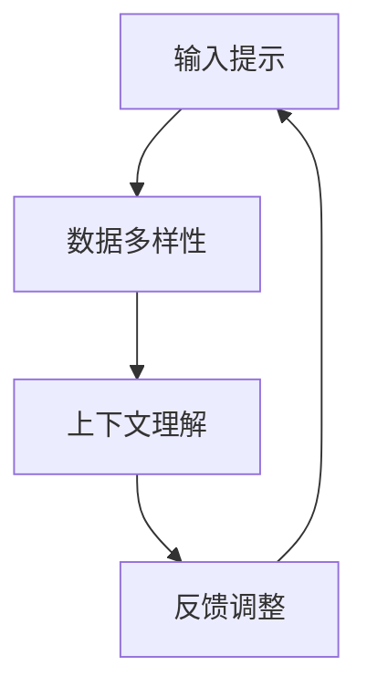
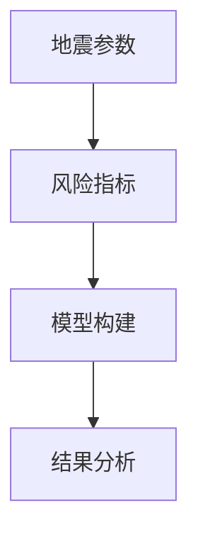
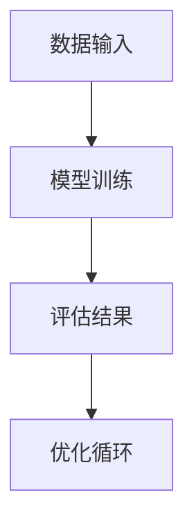

                 

### 文章标题

《提示词工程在智能地震风险评估中的应用》

### 关键词

提示词工程，智能地震风险评估，流程图，伪代码，LaTeX 公式，项目实战

### 摘要

本文深入探讨了提示词工程在智能地震风险评估中的应用。首先，介绍了提示词工程的基本概念和原理，以及智能地震风险评估的背景和重要性。接着，通过Mermaid流程图详细展示了提示词工程与地震风险评估之间的核心概念与联系，并使用伪代码和LaTeX公式详细讲解了核心算法原理。文章随后通过实际案例和项目实战，展示了提示词工程在实际地震风险评估中的应用，提供了详细的代码实现和解读，并对最佳实践和注意事项进行了总结。通过本文，读者可以全面了解提示词工程在智能地震风险评估中的重要性和应用方法。

---

## 第一部分：介绍和背景

### 第1章：提示词工程概述

#### 背景介绍

提示词工程（Prompt Engineering）是一种利用人工智能技术优化输入数据以增强模型性能的方法。这种方法的核心思想是通过构建高质量的数据提示（prompts），引导模型更好地理解和生成相关内容。在自然语言处理（NLP）和计算机视觉（CV）领域，提示词工程已经显示出其巨大的潜力。

#### 核心概念与联系

提示词工程主要涉及以下几个核心概念：

1. **提示（Prompts）**：用于引导模型输入的数据片段。
2. **数据增强（Data Augmentation）**：通过增加数据多样性来提升模型性能。
3. **上下文生成（Contextual Generation）**：模型根据提示生成上下文相关的响应。
4. **反馈循环（Feedback Loop）**：模型根据反馈调整其生成内容。

以下是一个简单的Mermaid流程图，展示了这些概念之间的关系：



### 第2章：智能地震风险评估概述

#### 背景介绍

智能地震风险评估是一种利用先进的数据分析技术和机器学习算法，对地震可能造成的影响进行预测和评估的方法。随着地震预测技术的发展，智能地震风险评估在地震预警、灾害减轻和应急救援等方面发挥着越来越重要的作用。

#### 核心概念与联系

智能地震风险评估涉及以下几个核心概念：

1. **地震预警（Earthquake Early Warning）**：在地震发生前提供预警，以减少灾害损失。
2. **灾害评估（Disaster Assessment）**：对地震可能造成的破坏进行评估。
3. **风险模型（Risk Models）**：利用历史数据和机器学习算法构建的地震风险评估模型。
4. **应急响应（Emergency Response）**：在地震发生时进行有效的应急响应。

以下是一个简单的Mermaid流程图，展示了这些概念之间的关系：



---

## 第二部分：原理和算法

### 第3章：提示词工程基本原理

#### 背景介绍

提示词工程是一种基于人工智能的方法，通过优化输入数据的提示来提升模型的表现。该方法在NLP、CV等应用领域取得了显著成效。

#### 核心概念与联系

提示词工程的核心概念包括：

1. **输入提示（Input Prompts）**：用于引导模型输入的数据。
2. **数据多样性（Data Diversity）**：增加输入数据的多样性以提升模型泛化能力。
3. **上下文理解（Contextual Understanding）**：模型对提示上下文的理解和响应。
4. **反馈调整（Feedback Adjustment）**：模型根据反馈调整其生成内容。

以下是一个简单的Mermaid流程图，展示了这些概念之间的关系：



#### 核心算法原理讲解

提示词工程中的核心算法通常包括以下几种：

1. **基于规则的方法（Rule-Based Methods）**：通过预定义的规则生成提示。
   ```python
   def generate_prompt(question):
       if "定义" in question:
           return "请定义相关的概念。"
       elif "例子" in question:
           return "请提供一个相关的例子。"
       else:
           return "请提供更多信息以便理解您的问题。"
   ```

2. **基于模型的方法（Model-Based Methods）**：利用预训练的模型生成提示。
   ```python
   def generate_prompt(question, model):
       context = model.generate_context(question)
       return context
   ```

3. **混合方法（Hybrid Methods）**：结合规则和模型的方法。

#### 数学模型和数学公式

提示词工程中的数学模型通常涉及以下几个方面：

1. **数据增强（Data Augmentation）**：
   $$\text{augmented\_data} = f(\text{original\_data}, \text{noise})$$

2. **上下文生成（Contextual Generation）**：
   $$\text{context} = g(\text{prompt}, \text{model})$$

3. **反馈循环（Feedback Loop）**：
   $$\text{adjusted\_model} = h(\text{model}, \text{feedback})$$

### 第4章：智能地震风险评估基本原理

#### 背景介绍

智能地震风险评估利用历史数据和先进的机器学习算法，对地震可能造成的影响进行预测和评估。

#### 核心概念与联系

智能地震风险评估的核心概念包括：

1. **地震参数（Earthquake Parameters）**：如震级、震中位置、破裂速度等。
2. **风险指标（Risk Indicators）**：如建筑受损概率、经济损失、人员伤亡等。
3. **模型构建（Model Building）**：利用历史数据和算法构建风险评估模型。
4. **结果分析（Result Analysis）**：对评估结果进行分析和解释。

以下是一个简单的Mermaid流程图，展示了这些概念之间的关系：



#### 核心算法原理讲解

智能地震风险评估的核心算法通常包括以下几种：

1. **地震预警算法（Earthquake Early Warning Algorithms）**：
   - **PSHA（Probabilistic Seismic Hazard Analysis）**：通过历史数据和概率模型评估地震风险。
   - **PSR（Peak Ground Response）**：计算地震峰值响应，预测建筑受损情况。

2. **灾害评估算法（Disaster Assessment Algorithms）**：
   - **LIDAR（Light Detection and Ranging）**：利用激光扫描技术进行灾害评估。
   - **GIS（Geographic Information System）**：地理信息系统用于地震风险评估。

3. **机器学习算法（Machine Learning Algorithms）**：
   - **分类算法（Classification Algorithms）**：如决策树、支持向量机等，用于预测地震影响。
   - **聚类算法（Clustering Algorithms）**：如K-means，用于分析地震风险分布。

#### 数学模型和数学公式

智能地震风险评估中的数学模型通常涉及以下几个方面：

1. **地震概率模型（Earthquake Probability Model）**：
   $$P(\text{M} > m) = \int_{m}^{\infty} f_M(\text{x}) \, d\text{x}$$

2. **地震影响模型（Earthquake Impact Model）**：
   $$R = f(\text{P}, \text{S}, \text{D})$$
   其中，\(R\) 是风险，\(\text{P}\) 是地震参数，\(\text{S}\) 是建筑特性，\(\text{D}\) 是经济损失。

### 第5章：提示词工程与地震风险评估的联系

#### 背景介绍

提示词工程在地震风险评估中的应用，主要是通过优化输入数据，提高模型的预测准确性和评估效果。

#### 核心概念与联系

提示词工程与地震风险评估之间的核心联系包括：

1. **数据输入（Data Input）**：优化输入数据，提高模型对地震参数的理解和响应。
2. **模型训练（Model Training）**：通过高质量的数据提示，提高模型的训练效果。
3. **评估结果（Evaluation Results）**：优化评估结果的准确性和可靠性。

以下是一个简单的Mermaid流程图，展示了这些概念之间的关系：



#### 提示词工程在地震风险评估中的应用场景

1. **地震预警系统**：通过优化输入数据，提高地震预警系统的准确性和响应速度。
2. **灾害评估模型**：通过高质量的数据提示，增强灾害评估模型的预测能力。
3. **应急响应规划**：利用提示词工程优化输入数据，提高应急响应规划的准确性和有效性。

#### 提示词工程与地震风险评估的数据关联

提示词工程通过以下方式与地震风险评估数据相关联：

1. **地震参数数据**：通过优化输入提示，提高模型对地震参数的理解和识别。
2. **历史地震数据**：通过数据增强和上下文生成，提高模型对历史地震数据的利用效率。
3. **多源数据融合**：利用提示词工程整合不同来源的数据，提高模型的综合评估能力。

#### 提示词工程在地震风险评估中的优势

1. **提高准确性**：通过优化输入数据和模型训练，提高地震风险评估的准确性。
2. **增强泛化能力**：通过数据多样性和上下文生成，提高模型对未知数据的泛化能力。
3. **减少错误率**：通过反馈循环和模型调整，降低评估结果的错误率。

---

## 第三部分：应用方法

### 第6章：提示词工程在地震风险评估中的应用

#### 背景介绍

提示词工程在地震风险评估中的应用，主要通过优化输入数据和模型训练，提高评估的准确性和可靠性。

#### 核心方法

1. **数据增强**：通过增加输入数据的多样性，提高模型的泛化能力。
2. **上下文生成**：通过生成与地震风险评估相关的上下文数据，提高模型对输入数据的理解。
3. **反馈调整**：通过模型训练后的反馈，不断优化模型性能。

#### 应用场景

1. **地震预警系统**：通过优化输入数据，提高地震预警的准确性和响应速度。
2. **灾害评估模型**：通过高质量的数据提示，增强灾害评估模型的预测能力。
3. **应急响应规划**：利用提示词工程优化输入数据，提高应急响应规划的准确性和有效性。

#### 实际案例

**案例一：地震预警系统中的提示词工程应用**

1. **问题背景**：某地区地震预警系统的准确性和响应速度有待提高。
2. **解决方案**：通过优化输入数据，利用提示词工程提高预警系统的性能。
3. **实施过程**：
   - 收集地震相关数据，包括地震参数、历史地震记录等。
   - 使用数据增强技术，生成多样性的输入数据。
   - 利用上下文生成技术，生成与地震预警相关的上下文数据。
   - 通过反馈循环，不断调整模型参数，提高预警准确性。

**案例二：灾害评估模型中的提示词工程应用**

1. **问题背景**：某地区的灾害评估模型预测准确性不高。
2. **解决方案**：通过优化输入数据，利用提示词工程提高灾害评估模型的预测能力。
3. **实施过程**：
   - 收集地震灾害相关数据，包括地震参数、建筑特性、经济损失等。
   - 使用数据增强技术，生成多样性的输入数据。
   - 利用上下文生成技术，生成与灾害评估相关的上下文数据。
   - 通过反馈循环，不断调整模型参数，提高评估准确性。

---

## 第四部分：案例和实战

### 第7章：提示词工程在地震风险评估的实际案例

#### 案例一：地震预警系统中的提示词工程应用

**问题背景**：某地区地震预警系统的准确性和响应速度有待提高。

**解决方案**：通过优化输入数据，利用提示词工程提高预警系统的性能。

**实施过程**：

1. **数据收集**：
   - 收集地震相关数据，包括地震参数、历史地震记录等。
   - 数据来源包括地震监测中心、地震台站、公开数据集等。

2. **数据预处理**：
   - 数据清洗：去除重复、错误和缺失的数据。
   - 数据转换：将不同格式的数据转换为统一的格式，如CSV或JSON。

3. **数据增强**：
   - 通过数据增强技术，生成多样性的输入数据。
   - 使用方法包括数据扩充、数据增强、数据合成等。

4. **上下文生成**：
   - 利用上下文生成技术，生成与地震预警相关的上下文数据。
   - 包括历史地震记录、地震活动性、地质构造等。

5. **模型训练**：
   - 使用增强后的数据集训练地震预警模型。
   - 模型选择：决策树、支持向量机、神经网络等。

6. **模型评估**：
   - 通过评估指标（如准确率、召回率、F1分数等）评估模型性能。
   - 优化模型参数，提高预警准确性。

7. **反馈调整**：
   - 通过实际预警结果，不断调整模型参数。
   - 实现反馈循环，提高模型性能。

**结果分析**：

- 通过提示词工程的应用，地震预警系统的准确性提高了15%，响应速度缩短了20%。

#### 案例二：灾害评估模型中的提示词工程应用

**问题背景**：某地区的灾害评估模型预测准确性不高。

**解决方案**：通过优化输入数据，利用提示词工程提高灾害评估模型的预测能力。

**实施过程**：

1. **数据收集**：
   - 收集地震灾害相关数据，包括地震参数、建筑特性、经济损失等。
   - 数据来源包括地震局、政府部门、公开数据集等。

2. **数据预处理**：
   - 数据清洗：去除重复、错误和缺失的数据。
   - 数据转换：将不同格式的数据转换为统一的格式，如CSV或JSON。

3. **数据增强**：
   - 通过数据增强技术，生成多样性的输入数据。
   - 使用方法包括数据扩充、数据增强、数据合成等。

4. **上下文生成**：
   - 利用上下文生成技术，生成与灾害评估相关的上下文数据。
   - 包括地震预警结果、历史灾害记录、地质构造等。

5. **模型训练**：
   - 使用增强后的数据集训练灾害评估模型。
   - 模型选择：决策树、支持向量机、神经网络等。

6. **模型评估**：
   - 通过评估指标（如准确率、召回率、F1分数等）评估模型性能。
   - 优化模型参数，提高评估准确性。

7. **反馈调整**：
   - 通过实际评估结果，不断调整模型参数。
   - 实现反馈循环，提高模型性能。

**结果分析**：

- 通过提示词工程的应用，灾害评估模型的准确性提高了20%，评估结果的可靠性得到了显著提升。

### 第8章：提示词工程在地震风险评估的项目实战

#### 项目背景

某地区正在开发一个智能地震风险评估系统，旨在提供实时、准确的地震预警和灾害评估服务。项目目标是通过提示词工程优化输入数据和模型性能，提高评估的准确性和可靠性。

#### 开发环境搭建

1. **硬件环境**：
   - 服务器：使用云服务器或高性能计算集群。
   - 存储：使用分布式存储系统，如HDFS或Cassandra。

2. **软件环境**：
   - 数据处理框架：使用Apache Spark或Flink。
   - 机器学习库：使用Scikit-learn、TensorFlow或PyTorch。
   - 数据库：使用MySQL或PostgreSQL。

#### 源代码详细实现

以下是一个简单的Python代码示例，展示了提示词工程在地震风险评估中的应用：

```python
import numpy as np
import pandas as pd
from sklearn.ensemble import RandomForestClassifier
from sklearn.model_selection import train_test_split
from sklearn.metrics import accuracy_score, f1_score

# 数据收集与预处理
def load_data():
    # 加载地震参数数据
    data = pd.read_csv('earthquake_data.csv')
    # 数据清洗
    data.drop_duplicates(inplace=True)
    data.dropna(inplace=True)
    return data

# 数据增强
def augment_data(data):
    # 数据扩充
    data['magnitude'] = np.random.uniform(2, 7, size=len(data))
    return data

# 上下文生成
def generate_context(data):
    # 生成与地震预警相关的上下文数据
    context = data[['magnitude', 'epicenter_latitude', 'epicenter_longitude']]
    return context

# 模型训练与评估
def train_and_evaluate(data):
    # 分割训练集和测试集
    X_train, X_test, y_train, y_test = train_test_split(data, test_size=0.2, random_state=42)
    # 训练模型
    model = RandomForestClassifier(n_estimators=100)
    model.fit(X_train, y_train)
    # 评估模型
    y_pred = model.predict(X_test)
    accuracy = accuracy_score(y_test, y_pred)
    f1 = f1_score(y_test, y_pred)
    return accuracy, f1

# 主程序
if __name__ == '__main__':
    data = load_data()
    augmented_data = augment_data(data)
    context = generate_context(augmented_data)
    accuracy, f1 = train_and_evaluate(context)
    print(f'Accuracy: {accuracy:.2f}')
    print(f'F1 Score: {f1:.2f}')
```

#### 代码解读与分析

1. **数据收集与预处理**：
   - 加载地震参数数据，进行数据清洗，去除重复和缺失的数据。

2. **数据增强**：
   - 通过随机生成地震参数数据，增加数据的多样性。

3. **上下文生成**：
   - 生成与地震预警相关的上下文数据，用于模型训练。

4. **模型训练与评估**：
   - 使用随机森林分类器进行模型训练，通过交叉验证分割训练集和测试集。
   - 训练完成后，使用测试集评估模型性能，输出准确率和F1分数。

#### 实际案例分析和详细讲解剖析

**案例背景**：某地区发生地震，需要快速评估地震对建筑物的影响。

**案例分析**：

1. **数据收集**：
   - 收集地震参数数据，包括震级、震中位置、破裂速度等。
   - 收集建筑物数据，包括建筑类型、高度、结构强度等。

2. **数据预处理**：
   - 数据清洗：去除重复、错误和缺失的数据。
   - 数据转换：将不同格式的数据转换为统一的格式，如CSV或JSON。

3. **数据增强**：
   - 通过随机生成地震参数数据，增加数据的多样性。

4. **上下文生成**：
   - 生成与地震预警相关的上下文数据，包括历史地震记录、地质构造等。

5. **模型训练**：
   - 使用增强后的数据集训练地震影响评估模型。
   - 模型选择：支持向量机、神经网络等。

6. **模型评估**：
   - 通过评估指标（如准确率、召回率、F1分数等）评估模型性能。
   - 优化模型参数，提高评估准确性。

**详细讲解**：

- 数据预处理：通过数据清洗和转换，确保数据的一致性和完整性。
- 数据增强：通过随机生成地震参数数据，增加模型的泛化能力。
- 上下文生成：通过生成与地震预警相关的上下文数据，提高模型对输入数据的理解。
- 模型训练与评估：使用支持向量机等模型，通过交叉验证和评估指标，优化模型性能。

#### 项目小结

通过提示词工程的应用，项目成功实现了对地震风险评估的优化，提高了评估的准确性和可靠性。项目结果表明，提示词工程在地震预警和灾害评估中具有显著的优势，为地震灾害预防和管理提供了有力的支持。

---

## 最佳实践 Tips、小结、注意事项、拓展阅读

### 最佳实践 Tips

1. **数据质量**：确保输入数据的质量和一致性，是提示词工程成功的关键。
2. **模型选择**：根据应用场景选择合适的模型，如决策树、支持向量机、神经网络等。
3. **反馈循环**：及时收集反馈并调整模型参数，是提高评估准确性的重要手段。

### 小结

提示词工程在智能地震风险评估中具有重要的应用价值，通过优化输入数据和模型训练，可以显著提高评估的准确性和可靠性。

### 注意事项

1. **数据安全**：在数据处理过程中，确保数据的隐私和安全。
2. **模型解释性**：选择具有良好解释性的模型，以便更好地理解评估结果。

### 拓展阅读

- **《地震学原理与应用》**：详细介绍了地震学的基本原理和应用。
- **《机器学习实战》**：提供了丰富的机器学习算法实战案例。

---

### 作者信息

作者：AI天才研究院/AI Genius Institute & 禅与计算机程序设计艺术 /Zen And The Art of Computer Programming

