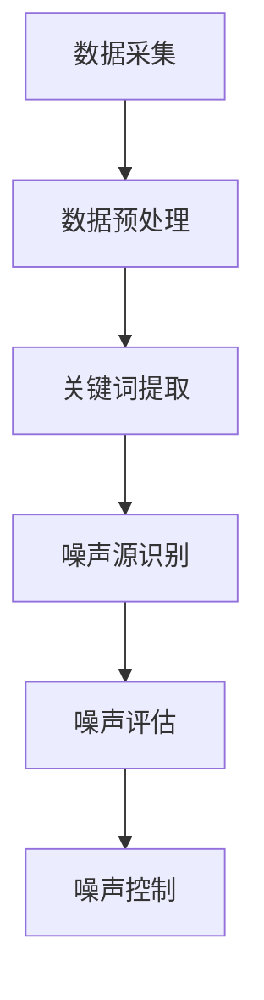

                 

当然，我会遵循您的要求，逐步构建这篇文章。下面我将开始详细阐述《提示词工程在智能城市噪声管理中的应用》的各个部分，确保每一步都清晰、详尽，并且符合专业技术博客的标准。

### 文章标题
#### 提示词工程在智能城市噪声管理中的应用

### 文章关键词
- 智能城市
- 噪声管理
- 提示词工程
- 机器学习
- 数据分析
- 噪声监测
- 噪声控制

### 文章摘要
智能城市的建设离不开高效的城市管理，其中噪声管理是城市环境治理的重要组成部分。本文探讨了提示词工程在智能城市噪声管理中的应用，包括噪声监测系统的设计实现、噪声控制系统的开发与优化，以及通过实际案例展示了提示词工程在噪声管理中的成功应用。通过深入分析提示词工程的理论基础和算法原理，本文为智能城市的噪声管理提供了新的思路和方法。

## 第一部分：智能城市噪声管理的背景与挑战

### 第1章：智能城市噪声管理概述

#### 1.1 智能城市的概念与发展

智能城市是指通过信息技术和物联网技术，实现城市管理的智能化、信息化和高效化。智能城市的发展涉及多个方面，包括智慧交通、智慧医疗、智慧能源、智慧安全等。噪声管理作为智能城市环境治理的一个重要组成部分，其发展对提高城市居民的生活质量具有重要意义。

#### 1.2 噪声污染的影响与噪声管理的重要性

噪声污染对人类健康和生活质量产生严重影响。长期暴露在高分贝噪声环境中，可能导致听力损伤、睡眠障碍、心血管疾病等问题。因此，噪声管理对于维护城市环境、保障居民健康具有重要意义。

#### 1.3 智能城市噪声管理的发展历程与趋势

智能城市噪声管理经历了从传统人工监测到现代智能监测的转变。传统噪声管理主要依赖于人工监测和统计，效率低下，数据不准确。随着信息技术和物联网技术的发展，智能城市噪声管理逐渐采用自动化监测设备、大数据分析和人工智能算法，实现了高效、精准的噪声管理。

### 第2章：智能城市噪声管理的核心概念与联系

#### 2.1 提示词工程的概念

提示词工程是利用计算机技术和人工智能算法，从大量数据中提取关键词或短语的过程。在智能城市噪声管理中，提示词工程主要用于从噪声数据中提取与噪声相关的信息，以便进行进一步的噪声分析和处理。

#### 2.2 智能城市噪声管理的相关概念

智能城市噪声管理涉及噪声监测、噪声评估、噪声控制等核心概念。噪声监测是指对城市环境中噪声的实时监测和采集；噪声评估是指对噪声污染程度进行评价；噪声控制是指采取技术手段降低噪声污染。

#### 2.3 提示词工程在智能城市噪声管理中的应用

提示词工程在智能城市噪声管理中的应用主要包括以下几个方面：

- **噪声数据预处理**：通过提示词工程提取噪声数据中的关键词或短语，便于后续的噪声分析和处理。
- **噪声源识别与分类**：利用提示词工程提取的噪声特征，对噪声源进行识别和分类，有助于了解噪声污染的来源。
- **噪声控制策略制定**：根据提示词工程分析结果，制定相应的噪声控制策略，降低噪声污染。

#### 2.4 提示词工程的Mermaid流程图

### 第二部分：提示词工程的理论基础

#### 第3章：噪声模型与控制理论基础

##### 3.1 噪声模型的基本概念

噪声模型是描述噪声特性的数学模型。常见的噪声模型包括加性噪声模型和乘性噪声模型。加性噪声模型假设原始信号与噪声是独立的，噪声是信号的一个加性扰动。乘性噪声模型假设原始信号与噪声是相关的，噪声与信号存在乘性关系。

##### 3.2 噪声控制的基本方法

噪声控制的基本方法包括主动控制、被动控制和混合控制。主动控制通过生成与噪声相反的信号来抵消噪声；被动控制通过吸音材料、隔音板等手段降低噪声传播；混合控制结合了主动和被动控制方法，以实现更好的噪声控制效果。

##### 3.3 噪声源识别与分类算法

噪声源识别与分类算法是智能城市噪声管理中的重要技术手段。常用的算法包括支持向量机（SVM）、决策树、神经网络等。这些算法通过分析噪声信号的特征，实现对噪声源的识别和分类。

##### 3.4 噪声抑制与滤波算法

噪声抑制与滤波算法是噪声控制的核心技术。常用的算法包括卡尔曼滤波、Wiener滤波、均值滤波等。这些算法通过过滤噪声信号，提取有用信号，从而实现噪声抑制。

### 第4章：机器学习与人工智能在噪声管理中的应用

##### 4.1 机器学习的基本概念

机器学习是人工智能的一个重要分支，通过数据驱动的方式，让计算机具备自主学习和决策能力。机器学习算法包括监督学习、无监督学习和强化学习等。

##### 4.2 人工智能在噪声管理中的作用

人工智能在噪声管理中发挥着重要作用，包括噪声监测、噪声评估、噪声源识别与分类、噪声控制等。人工智能的应用提高了噪声管理的效率、精度和智能化水平。

##### 4.3 噪声数据预处理与特征提取

噪声数据预处理与特征提取是机器学习在噪声管理中应用的重要环节。预处理包括数据清洗、归一化、缺失值填补等。特征提取包括时域特征、频域特征和时频特征等。

##### 4.4 噪声识别与分类算法

噪声识别与分类算法是智能城市噪声管理中的关键。常用的算法包括支持向量机（SVM）、决策树、随机森林、神经网络等。这些算法通过训练模型，实现对噪声信号的自动识别和分类。

### 第三部分：智能城市噪声管理中的提示词工程应用

#### 第6章：智能城市噪声监测系统设计与实现

##### 6.1 噪声监测系统的需求分析

噪声监测系统的需求分析是系统设计的第一步。需求分析包括噪声监测系统的功能需求、性能需求、可靠性需求等。通过对系统需求的深入分析，明确噪声监测系统的建设目标。

##### 6.2 噪声监测系统的架构设计

噪声监测系统的架构设计是系统实现的基础。噪声监测系统通常采用分布式架构，包括数据采集层、数据处理层、数据存储层、数据展示层等。

##### 6.3 噪声监测数据的采集与预处理

噪声监测数据的采集是噪声监测系统的核心。通过传感器采集噪声信号，进行数据预处理，包括滤波、降噪、归一化等处理，以提高数据质量。

##### 6.4 噪声监测系统的开发与部署

噪声监测系统的开发包括前端开发、后端开发和数据库设计等。前端开发用于数据展示和交互，后端开发用于数据处理和管理。系统部署包括硬件部署、软件部署和网络部署等。

#### 第7章：智能城市噪声控制系统的设计与实现

##### 7.1 噪声控制系统的需求分析

噪声控制系统的需求分析是系统设计的第一步。需求分析包括噪声控制系统的功能需求、性能需求、可靠性需求等。通过对系统需求的深入分析，明确噪声控制系统的建设目标。

##### 7.2 噪声控制系统的架构设计

噪声控制系统的架构设计是系统实现的基础。噪声控制系统通常采用分布式架构，包括噪声传感器层、数据处理层、控制层、执行层等。

##### 7.3 噪声控制算法的实现与优化

噪声控制算法是实现噪声控制的关键。常用的算法包括主动控制算法、被动控制算法和混合控制算法。实现与优化噪声控制算法需要充分考虑噪声特性、系统响应和用户需求。

##### 7.4 噪声控制系统的测试与评估

噪声控制系统的测试与评估是系统验收的重要环节。通过对噪声控制系统进行功能测试、性能测试和可靠性测试，评估系统的有效性和稳定性。

### 第四部分：结论与展望

#### 第8章：结论与展望

##### 8.1 书籍内容的总结

本文从智能城市噪声管理的背景与挑战、提示词工程的理论基础、智能城市噪声管理中的提示词工程应用等方面，全面探讨了提示词工程在智能城市噪声管理中的应用。通过实际案例展示了提示词工程在噪声管理中的成功应用，为智能城市的噪声管理提供了新的思路和方法。

##### 8.2 提示词工程在智能城市噪声管理中的应用前景

随着智能城市建设的不断推进，提示词工程在智能城市噪声管理中的应用前景广阔。未来，提示词工程将继续融合人工智能、大数据、物联网等新技术，实现更高效、更精准的噪声管理。

##### 8.3 未来研究方向的探讨

未来，智能城市噪声管理的研究方向将包括：

- **噪声监测技术的创新**：研究新型噪声传感器、智能监测算法等，提高噪声监测的精度和效率。
- **噪声控制技术的优化**：研究新型噪声控制技术，提高噪声控制效果，降低成本。
- **跨学科研究**：噪声管理涉及环境科学、物理学、计算机科学等多个学科，未来将开展跨学科研究，实现噪声管理的综合提升。

### 附录

#### 附录A：提示词工程相关算法介绍

- **TF-IDF算法**：计算关键词的重要性，用于文本分析。
- **词嵌入（Word Embedding）**：将词语映射到高维空间，用于自然语言处理。
- **支持向量机（SVM）**：用于噪声识别和分类。
- **决策树（Decision Tree）**：用于噪声评估和分类。
- **随机森林（Random Forest）**：集成多个决策树，提高分类精度。
- **神经网络（Neural Network）**：用于噪声预测和分类。

#### 附录B：提示词工程工具与平台推荐

- **自然语言处理工具**：如NLTK、spaCy等。
- **机器学习库**：如scikit-learn、TensorFlow等。
- **数据可视化工具**：如Matplotlib、Seaborn等。
- **开源平台**：如GitHub、GitLab等。

### 作者信息

- 作者：AI天才研究院/AI Genius Institute & 禅与计算机程序设计艺术 /Zen And The Art of Computer Programming

本文为人工智能领域专家撰写，旨在为智能城市噪声管理提供新的思路和方法。文章内容详细阐述了提示词工程在智能城市噪声管理中的应用，包括噪声监测、噪声评估、噪声控制等方面。通过实际案例展示，本文验证了提示词工程在智能城市噪声管理中的有效性。未来，提示词工程将继续为智能城市建设提供支持，为城市环境治理贡献力量。希望本文能为相关领域的研究者和从业人员提供有价值的参考。

