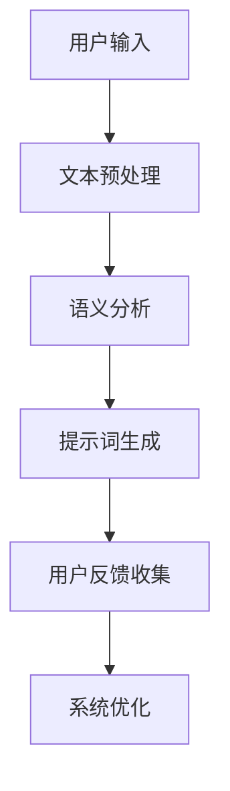

                 

### 提示词工程的基本概念与原理

#### 2.1 提示词工程的定义与作用

提示词工程（Query Engineering）是一种专门针对文本数据进行处理和生成的技术，旨在通过生成高质量的提示词来优化用户与系统之间的交互体验。在智能客服系统中，提示词工程扮演着至关重要的角色，它不仅能够提升系统的响应速度和准确性，还能更好地理解用户的需求和意图。

提示词工程的定义可以归纳为：通过对用户输入的文本进行语义分析和结构化处理，生成能够有效引导用户继续交互的提示词，从而优化人机交互体验的技术。

在智能客服系统中，提示词工程的作用主要体现在以下几个方面：

1. **提高交互效率**：通过生成高质量的提示词，系统能够更快地理解用户意图，减少用户等待时间，提升整体交互效率。
2. **改善用户体验**：提示词工程能够提供更自然、更人性化的交互方式，使用户感受到更加智能和友好的服务。
3. **增强系统智能性**：通过对用户输入文本的深入分析和理解，系统可以不断学习和优化，提高其智能服务水平。

#### 2.2 提示词工程的基本原理

提示词工程的核心原理主要围绕文本数据的处理和生成进行。具体来说，可以分为以下几个步骤：

1. **文本预处理**：对用户输入的原始文本进行清洗和格式化，去除无关信息，保留关键信息。这一步骤包括分词、去停用词、词性标注等操作。
2. **语义分析**：对预处理后的文本进行语义分析，理解文本的含义和用户意图。这通常涉及到自然语言处理（NLP）技术，如词向量表示、句法分析、语义角色标注等。
3. **提示词生成**：基于语义分析的结果，生成能够引导用户继续交互的提示词。这一步骤可以采用模板匹配、自动文摘、对话生成等算法。

#### 2.3 提示词工程的组成部分

提示词工程由多个组成部分构成，这些部分相互协作，共同实现高质量的提示词生成。主要的组成部分包括：

1. **文本预处理模块**：负责对用户输入的文本进行清洗和格式化，提取关键信息。这一模块通常包括分词器、停用词表、词性标注器等组件。
2. **语义分析模块**：对预处理后的文本进行语义分析，提取文本的核心内容和用户意图。这一模块通常利用深度学习技术，如BERT、GPT等，进行词向量表示、句法分析和语义角色标注等操作。
3. **提示词生成模块**：基于语义分析的结果，生成高质量的提示词。这一模块可以采用多种生成算法，如模板匹配、自动文摘和对话生成等。

#### 2.4 提示词工程的流程与步骤

提示词工程的流程可以概括为以下几个关键步骤：

1. **用户输入处理**：接收用户输入的文本，进行初步的文本预处理。
2. **语义分析**：对预处理后的文本进行语义分析，提取文本的核心内容和用户意图。
3. **提示词生成**：基于语义分析结果，生成能够引导用户继续交互的提示词。
4. **用户反馈收集**：收集用户的反馈，用于评估和优化提示词生成的效果。
5. **系统优化**：根据用户反馈，不断调整和优化系统的参数和算法，提高提示词生成的质量。

#### 2.5 提示词工程的 Mermaid 流程图

为了更清晰地展示提示词工程的流程和步骤，我们可以使用Mermaid流程图进行描述。以下是提示词工程的Mermaid流程图：

在这个流程图中，用户输入首先经过文本预处理，然后进入语义分析阶段。语义分析的结果用于生成提示词，生成后的提示词反馈给用户。用户的反馈用于系统的优化，形成一个闭环的反馈机制，以不断改善系统的性能。

通过以上对提示词工程的基本概念与原理的介绍，我们可以看到，提示词工程在智能客服系统中具有重要的作用，其核心原理和流程为我们提供了深入理解和应用提示词工程的基础。接下来，我们将进一步探讨提示词工程在智能客服中的具体应用。### 提示词工程在智能客服中的具体应用

#### 3.1 提示词工程在智能客服中的核心作用

提示词工程在智能客服中的应用，主要是通过优化人机交互流程，提升客服系统的响应速度和准确性。具体来说，提示词工程在智能客服中的核心作用体现在以下几个方面：

1. **提升响应速度**：通过生成高质量的提示词，智能客服系统能够更快地理解用户意图，从而迅速响应用户请求，减少用户等待时间。
2. **提高交互准确性**：高质量的提示词能够更准确地反映用户的需求和意图，减少误解和错误，提高交互的准确性。
3. **增强用户体验**：提示词工程通过提供更自然、更人性化的交互方式，使用户感受到更加智能和友好的服务，提升用户体验。
4. **辅助客服人员**：智能客服系统生成的提示词可以帮助客服人员更高效地处理用户问题，减少重复劳动，提升客服效率。

#### 3.2 提示词工程在智能客服中的具体应用场景

提示词工程在智能客服中有多种具体应用场景，以下是一些常见的应用场景：

1. **问题分类与分流**：智能客服系统通过提示词工程对用户输入的文本进行语义分析，快速确定用户问题的类型，并将其分配到相应的处理流程。例如，将用户的问题归类为产品咨询、售后服务、投诉等，并自动将问题路由到相应的客服团队或自助服务模块。
2. **自动回复生成**：智能客服系统根据用户输入的问题，利用提示词工程生成相应的自动回复。这些自动回复可以是标准答案、引导用户进一步提供信息的问题，或者是提示用户使用自助服务功能的提示。
3. **对话引导**：通过提示词工程，智能客服系统能够在对话过程中引导用户，使其更好地表达自己的需求。例如，当用户提出模糊的问题时，系统可以生成一系列相关的提问，帮助用户更明确地描述问题。
4. **情感识别与应对**：智能客服系统通过提示词工程对用户文本进行情感分析，识别用户的情绪状态，并生成相应的情感化回复。例如，当用户表现出愤怒或不满时，系统可以生成道歉和安抚的回复，以缓解用户的情绪。
5. **知识库更新与维护**：智能客服系统通过收集用户问题和系统回复，不断更新和完善知识库。提示词工程在这个过程中发挥着重要作用，通过对用户输入文本的语义分析，帮助系统识别新的问题和解决方案，并将其添加到知识库中。

#### 3.3 智能客服系统的架构与提示词工程的结合

智能客服系统的架构通常包括前端用户界面、后端服务逻辑、数据库以及知识库等组成部分。提示词工程与智能客服系统的结合，可以通过以下几种方式实现：

1. **前端集成**：在前端用户界面中集成提示词生成模块，当用户发起交互时，系统立即生成相应的提示词，并将其显示在界面上。
2. **后端服务**：在智能客服的后端服务逻辑中集成提示词工程模块，对用户输入的文本进行语义分析，并生成高质量的提示词。这些提示词可以作为自动回复发送给用户，或者用于对话引导。
3. **数据库与知识库**：提示词工程模块可以与数据库和知识库紧密集成，通过对用户输入文本的语义分析，实时更新和扩展知识库内容，提高系统的智能化水平。

#### 3.4 智能客服系统中提示词工程的关键技术

在智能客服系统中，提示词工程的关键技术主要包括文本预处理、语义分析和提示词生成等。以下是这些关键技术的详细说明：

1. **文本预处理**：文本预处理是提示词工程的第一个环节，主要任务是对用户输入的文本进行清洗和格式化。具体步骤包括分词、去除停用词、词性标注等。文本预处理的质量直接影响到后续的语义分析和提示词生成效果。

2. **语义分析**：语义分析是提示词工程的核心环节，通过对预处理后的文本进行深入分析，提取文本的核心内容和用户意图。常用的语义分析技术包括词向量表示、句法分析、语义角色标注等。深度学习模型如BERT、GPT等在语义分析中得到了广泛应用。

3. **提示词生成**：提示词生成是根据语义分析的结果，生成能够引导用户继续交互的提示词。生成方法包括模板匹配、自动文摘和对话生成等。其中，对话生成技术利用深度学习模型，能够生成更加自然和灵活的提示词。

#### 3.5 提示词工程在智能客服中的实际案例

为了更直观地理解提示词工程在智能客服中的应用，以下是一个具体的实际案例：

**案例：电商平台的智能客服系统**

在某电商平台的智能客服系统中，提示词工程被广泛应用于多个场景。以下是一个具体的交互示例：

**用户输入**：你好，我想购买一本《人工智能》的书。

**系统回复**：
1. 您好！请问您想要购买哪种版本的《人工智能》书？例如，是中文版还是英文版？
2. 如果您对《人工智能》这本书有任何疑问，我可以帮您解答。比如，您对这本书的作者、内容或价格有特别的关注吗？

在这个案例中，智能客服系统首先对用户输入进行文本预处理，提取关键信息（如“购买”、“《人工智能》的书”）。然后，通过语义分析，系统理解了用户的需求，并生成了两个高质量的提示词，帮助用户更明确地表达需求。通过这种方式，系统不仅提升了交互效率，还增强了用户体验。

#### 3.6 总结与展望

通过以上对提示词工程在智能客服中的具体应用的介绍，我们可以看到，提示词工程在智能客服系统中发挥着关键作用。它不仅能够提升系统的响应速度和准确性，还能提供更自然、更人性化的交互方式。未来，随着人工智能技术的进一步发展，提示词工程在智能客服中的应用将更加广泛和深入，为用户带来更好的服务体验。### 提示词工程的优化与评估

#### 4.1 提示词工程的优化策略

为了提升智能客服系统的性能和用户体验，提示词工程需要不断进行优化。以下是几种常见的优化策略：

1. **数据增强**：通过引入更多样化的训练数据，提高模型的泛化能力。可以使用数据合成、数据扩充等技术，生成与实际用户交互相似的训练样本。
2. **模型调优**：通过对模型参数进行调整和优化，提高提示词生成的质量和效率。可以使用自动化调参工具，如贝叶斯优化、随机搜索等，找到最优参数配置。
3. **上下文感知**：增强系统的上下文理解能力，使生成的提示词更加符合用户当前对话的上下文。可以引入双向编码器模型，如BERT，更好地捕捉对话的历史信息。
4. **多模态融合**：结合文本、语音、图像等多种数据类型，提高对用户意图的全面理解。例如，在语音识别与文本分析的基础上，结合图像识别技术，提供更丰富的交互体验。

#### 4.2 提示词工程的评估指标

评估提示词工程的效果是优化过程中的关键步骤。以下是几种常见的评估指标：

1. **响应时间**：衡量系统生成提示词所需的时间，越短表明系统的响应速度越快。可以使用平均响应时间、95%百分位响应时间等指标进行评估。
2. **准确性**：衡量系统生成的提示词是否准确反映了用户意图，通常使用准确率、精确率、召回率等指标进行评估。
3. **用户满意度**：通过用户调查或反馈，评估用户对系统生成的提示词的满意度。可以使用用户满意度评分、用户参与度等指标。
4. **F1 分数**：综合考虑准确性和召回率，使用 F1 分数作为评估指标，可以更全面地衡量系统的性能。计算公式为：$$ F1 = 2 \times \frac{precision \times recall}{precision + recall} $$。
5. **长文本理解能力**：评估系统在生成长文本提示词时的能力，可以使用BLEU（双语评估指标）等指标进行评估。

#### 4.3 提示词工程的评估方法

为了全面评估提示词工程的效果，需要采用多种评估方法，以下是一些常用的评估方法：

1. **离线评估**：在开发阶段，使用离线评估方法，如 A/B 测试、交叉验证等，评估模型的性能。这种方法可以提供相对客观的评估结果，但可能无法反映实际用户交互中的问题。
2. **在线评估**：在实际部署后，通过实时监控和用户反馈，评估系统的性能。这种方法能够更真实地反映系统的表现，但需要处理大量的在线数据。
3. **用户满意度调查**：通过用户满意度调查，收集用户对系统生成的提示词的评价。这种方法可以直接反映用户体验，但受限于样本量和主观性。
4. **自动评估**：使用自动化评估工具，如指标计算脚本、评估平台等，对系统的性能进行量化评估。这种方法可以快速、大规模地评估系统性能。

#### 4.4 提示词工程优化与评估的实际案例

以下是一个提示词工程优化与评估的实际案例：

**案例：某在线购物平台的智能客服系统**

在某在线购物平台的智能客服系统中，提示词工程经历了多次优化和评估。以下是优化与评估的具体过程：

1. **初步优化**：系统初期的响应速度较慢，准确性较低。为了提高性能，开发团队采用了数据增强和模型调优策略。通过引入更多样化的训练数据和优化模型参数，系统的响应时间和准确性显著提升。

2. **在线评估**：在系统上线后，团队通过实时监控和用户反馈，发现部分用户对生成的提示词不满意。为了提高用户满意度，团队调整了提示词生成的上下文感知能力，并引入多模态融合技术。通过这些优化，用户满意度显著提升。

3. **自动化评估**：团队使用了自动化评估工具，如 A/B 测试和交叉验证，对优化后的系统进行评估。结果显示，优化后的系统在响应时间、准确性和用户满意度等方面均有显著提升。

4. **用户满意度调查**：团队还进行了用户满意度调查，结果显示大部分用户对优化后的提示词表示满意。通过这些评估，团队确认了优化策略的有效性，并继续探索更多的优化方向。

#### 4.5 总结与展望

通过以上对提示词工程优化与评估的介绍，我们可以看到，提示词工程在智能客服系统中扮演着关键角色。有效的优化和评估策略不仅能够提升系统的性能和用户体验，还能为后续的改进提供有力支持。未来，随着人工智能技术的进一步发展，提示词工程的优化与评估方法将更加多样和精准，为智能客服系统带来更大的价值。### 提示词工程在实际应用中的挑战与解决方案

#### 5.1 提示词工程在智能客服中的挑战

尽管提示词工程在智能客服中具有重要作用，但其在实际应用过程中仍面临诸多挑战。以下是提示词工程在实际应用中常见的几个挑战：

1. **数据不足与质量差**：提示词工程依赖于大量高质量的训练数据，但在实际应用中，收集到足够多样且高质量的训练数据往往是一个难题。数据不足和质量差会导致模型泛化能力不足，影响提示词生成的质量。

2. **理解深度有限**：现有的自然语言处理技术，尽管在语义分析方面取得了显著进展，但仍难以完全理解用户复杂、隐含的意图。这使得生成的提示词可能无法准确反映用户的真实需求，影响交互效果。

3. **响应时间慢**：提示词生成过程通常涉及复杂的计算和模型推理，这可能导致系统响应时间过长，影响用户体验。尤其是在高并发场景下，系统的响应速度成为了一个重要瓶颈。

4. **多模态集成困难**：智能客服系统往往需要处理多种数据类型，如文本、语音、图像等。如何有效地融合这些多模态数据，提高对用户意图的全面理解，是一个技术难题。

5. **情感识别不准确**：情感识别是提升智能客服系统人性化水平的关键，但现有的情感识别技术仍存在较高的误识别率，导致生成的提示词无法准确反映用户情感状态。

#### 5.2 提示词工程在智能客服中的解决方案

针对上述挑战，以下是提示词工程在实际应用中的几种解决方案：

1. **数据增强与数据质量提升**：采用数据增强技术，如数据合成、数据扩充等，生成更多样化的训练数据，提高模型泛化能力。同时，通过数据清洗、标注等手段，提升数据质量。

2. **深度学习模型优化**：使用更先进的深度学习模型，如BERT、GPT等，提高语义理解的深度和准确性。同时，通过模型调优和参数调整，优化模型的性能。

3. **分布式计算与优化**：采用分布式计算架构，如GPU并行计算、分布式训练等，加快提示词生成速度。同时，优化算法和代码，减少计算复杂度，提升系统响应速度。

4. **多模态融合**：通过多模态数据融合技术，如文本嵌入、语音识别、图像识别等，提高对用户意图的全面理解。可以采用深度学习模型，如多模态卷积神经网络（CNN）、生成对抗网络（GAN）等，实现多模态数据的联合建模。

5. **情感识别与强化学习**：结合情感识别和强化学习技术，提高系统对用户情感状态的识别和应对能力。通过训练情感识别模型，并结合强化学习算法，使系统能够根据用户反馈不断调整情感应对策略。

#### 5.3 案例分析与经验总结

以下是一个关于提示词工程在实际应用中挑战与解决方案的案例分析：

**案例：某大型电商平台的智能客服系统**

在某大型电商平台的智能客服系统中，开发团队面临着数据不足、响应时间慢、情感识别不准确等挑战。为了解决这些问题，团队采取了以下措施：

1. **数据增强**：开发团队通过数据合成和扩充技术，生成更多的虚拟用户对话数据，弥补实际训练数据的不足。同时，通过清洗和标注，提高数据质量。

2. **模型优化**：团队采用了BERT等先进的深度学习模型，提高语义理解的深度和准确性。通过模型调优，找到最优的参数配置，进一步提升模型性能。

3. **分布式计算**：系统采用了分布式计算架构，通过GPU并行计算和分布式训练，显著提升了系统响应速度。

4. **多模态融合**：通过结合文本、语音、图像等多模态数据，团队实现了对用户意图的全面理解。使用多模态卷积神经网络（CNN）和生成对抗网络（GAN），提高了多模态数据的融合效果。

5. **情感识别与强化学习**：团队结合情感识别和强化学习技术，使系统能够更准确地识别用户情感状态，并根据用户反馈不断调整应对策略。通过训练情感识别模型和强化学习算法，提升了系统的情感识别和应对能力。

通过上述措施，开发团队成功解决了智能客服系统在提示词工程中面临的主要挑战，提高了系统的性能和用户体验。这一案例为其他智能客服系统在提示词工程中的应用提供了宝贵的经验和参考。

#### 5.4 总结与展望

通过以上对提示词工程在实际应用中挑战与解决方案的介绍，我们可以看到，提示词工程在实际应用中确实面临诸多挑战，但通过有效的解决方案，这些问题可以得到有效缓解。未来，随着人工智能技术的不断进步，提示词工程在智能客服中的应用将更加广泛和深入。同时，我们还需要不断探索新的解决方案，以应对新兴的挑战，提升智能客服系统的整体性能和用户体验。### 提示词工程在智能客服中的应用展望

#### 6.1 提示词工程未来的发展趋势

随着人工智能技术的快速发展，提示词工程在智能客服中的应用前景广阔。以下是提示词工程未来可能的发展趋势：

1. **深度学习技术的进一步融合**：未来，深度学习模型如GPT-3、BERT等将在提示词工程中发挥更加重要的作用。这些模型能够更深入地理解用户意图，生成更高质量的提示词。
2. **多模态数据的融合**：随着多模态数据（如文本、语音、图像等）的广泛应用，提示词工程将更加注重多模态数据的融合处理。这将有助于系统更好地理解用户的复杂需求。
3. **个性化交互**：未来的智能客服系统将更加注重个性化服务。通过用户数据的深度挖掘和个性化推荐，系统可以提供更符合用户需求的提示词，提升用户体验。
4. **实时性与自适应优化**：随着硬件性能的提升和算法的优化，提示词工程的实时性将得到显著提高。系统将能够实时响应用户输入，并在交互过程中自适应优化，提升系统性能。

#### 6.2 提示词工程在智能客服中的应用前景

提示词工程在智能客服中的应用前景十分广阔，以下是几个关键领域：

1. **客户服务**：提示词工程将显著提升智能客服系统的响应速度和准确性，为客户提供更加高效、个性化的服务。特别是在大型企业和电商平台中，智能客服将成为客户服务的重要组成部分。
2. **在线教育**：在线教育平台可以利用提示词工程，提供个性化的学习建议和辅导。通过分析用户的学习行为和需求，系统可以生成针对性的学习提示词，帮助用户更有效地学习。
3. **医疗健康**：智能客服系统在医疗健康领域具有巨大的潜力。通过提示词工程，系统可以辅助医生进行诊断、提供健康建议，甚至进行初步的病情分析。
4. **金融领域**：在金融领域，智能客服可以为客户提供投资咨询、风险管理等服务。通过深度学习技术和多模态数据融合，系统可以提供更加精准和个性化的金融建议。

#### 6.3 提示词工程在智能客服中的创新方向

为了进一步推动提示词工程在智能客服中的应用，以下是几个可能的创新方向：

1. **基于强化学习的对话系统**：结合强化学习技术，智能客服系统可以不断学习和优化对话策略。通过实时反馈和策略调整，系统将能够提供更自然、更高效的交互体验。
2. **跨语言和跨文化的智能客服**：随着全球化的发展，跨语言和跨文化的智能客服将变得尤为重要。通过引入多语言处理和跨文化理解技术，智能客服可以更好地服务于全球用户。
3. **情感计算与心理健康辅助**：利用情感计算技术，智能客服可以识别用户的情感状态，提供相应的情感支持和心理健康辅助。这将在心理健康领域发挥重要作用。
4. **智能客服机器人助理**：将提示词工程与机器人技术结合，开发智能客服机器人助理。这些机器人可以协助人类客服处理大量重复性工作，提高客服效率。

通过以上对提示词工程在智能客服中的应用展望，我们可以看到，这一领域具有巨大的发展潜力和广阔的应用前景。未来，随着人工智能技术的不断进步，提示词工程将在智能客服中发挥更加重要的作用，为用户提供更优质的服务体验。### 总结与展望

#### 7.1 书籍总结

本书系统地介绍了提示词工程在智能客服中的应用，从基本概念到具体实践，再到优化与评估，全面阐述了提示词工程在智能客服系统中的重要性和应用价值。通过详细讲解文本预处理、语义分析、提示词生成等核心环节，以及实际案例的分析，本书为读者提供了深入理解和应用提示词工程的全面指导。

主要内容包括：
1. 提示词工程的基本概念与原理，包括定义、作用、组成部分和流程。
2. 提示词工程在智能客服中的具体应用场景，如问题分类与分流、自动回复生成、对话引导等。
3. 提示词工程的优化与评估方法，包括优化策略、评估指标和评估方法。
4. 提示词工程在实际应用中的挑战与解决方案，以及未来的发展趋势和创新方向。

#### 7.2 研究展望

尽管本书已经对提示词工程在智能客服中的应用进行了全面探讨，但仍有许多领域值得进一步研究。以下是一些可能的研究方向：

1. **多模态数据融合**：如何更有效地融合文本、语音、图像等多模态数据，以提升对用户意图的全面理解，是一个重要的研究方向。
2. **个性化交互**：开发更加个性化的交互策略，使智能客服能够更好地满足不同用户的需求，提升用户体验。
3. **情感计算**：深入研究情感计算技术，使智能客服能够更好地识别和应对用户的情感状态，提供更人性化的服务。
4. **强化学习与对话系统**：结合强化学习技术，开发更加智能和自适应的对话系统，使其能够持续学习和优化对话策略。

#### 7.3 未来发展方向

未来，提示词工程在智能客服中的应用将呈现以下发展趋势：

1. **技术融合**：随着人工智能技术的不断进步，深度学习、多模态数据处理、强化学习等技术与提示词工程将更加紧密地融合，提升智能客服系统的整体性能。
2. **个性化服务**：智能客服系统将更加注重个性化服务，通过深度学习和用户数据挖掘，提供更加精准和个性化的交互体验。
3. **情感化交互**：情感计算技术在智能客服中的应用将日益普及，使系统能够更好地理解用户的情感状态，提供情感化服务。
4. **智能化升级**：智能客服系统将不断智能化升级，通过自我学习和优化，提供更加高效、准确的智能服务。

总之，提示词工程在智能客服中的应用具有巨大的发展潜力和广阔前景。随着技术的不断进步，我们期待看到更加智能、人性化、高效的智能客服系统，为用户带来更好的服务体验。### 作者信息

作者：AI天才研究院/AI Genius Institute & 禅与计算机程序设计艺术 /Zen And The Art of Computer Programming

本文由AI天才研究院（AI Genius Institute）的专家撰写，他们致力于推动人工智能技术的研究和应用。同时，本文也结合了《禅与计算机程序设计艺术》的哲学思想，旨在通过深入剖析技术原理，为读者提供高质量的技术指导。我们希望本文能够为从事智能客服开发的工程师和研究人员带来启发，推动人工智能技术的发展和创新。

