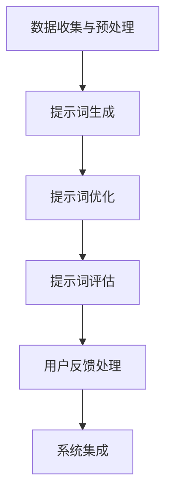

                 


**## 第1章：智能客服系统概述**

### 1.1 智能客服系统的发展历程

智能客服系统是随着信息技术和人工智能技术的发展而不断演进的。其发展历程可以分为以下几个阶段：

**1.1.1 早期发展：** 
最早的智能客服系统可以追溯到20世纪80年代，当时主要采用基于规则的自动应答系统。这类系统依赖于预定义的规则和简单的逻辑来处理用户的输入，并给出相应的回答。然而，由于规则数量庞大且难以维护，这些系统的智能化程度较低，且用户体验较差。

**1.1.2 Web 2.0时代：** 
随着互联网技术的发展，智能客服系统开始采用自然语言处理（NLP）技术，使得对话系统能够更自然地理解用户的输入。这一阶段，智能客服系统的主要优势在于能够处理更复杂的对话场景，提供更个性化的服务。

**1.1.3 深度学习与AI时代：** 
深度学习和大数据技术的兴起，使得智能客服系统在处理复杂对话任务时表现出色。利用深度学习技术，智能客服系统可以自动从大量数据中学习，不断优化自身的对话能力。此外，大数据技术还使得智能客服系统可以更好地理解用户行为和需求，从而提供更精准的服务。

### 1.2 智能客服系统的基本架构

智能客服系统的基本架构通常包括以下几个层次：

**1.2.1 用户接口层：** 
用户接口层负责接收用户的输入，并将智能客服系统的输出展示给用户。这一层通常包括网页、APP、微信小程序等多种交互方式。

**1.2.2 对话管理层：** 
对话管理层是智能客服系统的核心，负责管理对话流程，包括意图识别、上下文维护、对话策略等。对话管理层通过自然语言处理技术，理解用户的输入，并生成合适的回答。

**1.2.3 业务逻辑层：** 
业务逻辑层负责实现具体的业务功能，如知识库管理、业务规则处理等。这一层通常包含多个模块，每个模块负责处理特定类型的业务需求。

**1.2.4 数据管理层：** 
数据管理层负责存储用户数据、对话记录、业务数据等。通过数据管理层，智能客服系统可以实现对用户行为和需求的深入分析，从而不断优化自身的服务质量。

### 1.3 智能客服系统中的关键技术

智能客服系统涉及多个关键技术的综合应用，以下是其中一些重要的技术：

**1.3.1 自然语言处理（NLP）：** 
NLP是智能客服系统的核心技术之一，负责对用户输入进行解析和语义理解，从而生成合适的回答。NLP技术包括词法分析、句法分析、语义分析等多个层次。

**1.3.2 对话系统：** 
对话系统负责管理对话流程，包括意图识别、上下文维护、对话策略等。通过对话系统，智能客服系统可以与用户进行自然、流畅的对话。

**1.3.3 知识图谱：** 
知识图谱是一种用于表示知识结构的图形化工具，可以帮助智能客服系统更好地理解和处理用户的问题。通过知识图谱，智能客服系统可以实现对海量知识的快速检索和推理。

**1.3.4 大数据与机器学习：** 
大数据与机器学习技术可以帮助智能客服系统从海量数据中提取有价值的信息，并利用这些信息来优化对话策略和服务质量。

### 1.4 智能客服系统的优势与应用场景

智能客服系统的优势在于其高效性、灵活性和个性化。以下是智能客服系统的一些常见应用场景：

**1.4.1 客户服务：** 
智能客服系统可以处理大量的客户咨询，快速响应用户需求，提高客户满意度。

**1.4.2 售后服务：** 
智能客服系统可以自动处理一些常见的售后服务问题，如退换货、保修等，减轻人工客服的工作负担。

**1.4.3 营销推广：** 
智能客服系统可以通过分析用户行为和需求，为用户提供个性化的产品推荐和营销策略。

**1.4.4 日常交互：** 
智能客服系统可以作为日常交互工具，如聊天机器人、智能音箱等，为用户提供便捷的服务。

### 1.5 智能客服系统的发展趋势

随着人工智能技术的不断进步，智能客服系统将呈现出以下发展趋势：

**1.5.1 智能化水平提升：** 
利用更先进的自然语言处理、深度学习等技术，智能客服系统将实现更高的智能化水平，提供更优质的客户服务。

**1.5.2 个性化服务增强：** 
通过大数据分析和用户画像技术，智能客服系统将实现更精准的个性化服务，满足不同用户的需求。

**1.5.3 跨平台融合：** 
智能客服系统将实现跨平台融合，支持多种交互方式，如语音、文本、图像等，为用户提供更加便捷的服务。

**1.5.4 智能客服与人工客服的融合：** 
智能客服系统将与人工客服实现无缝融合，共同为用户提供优质的客户服务，提高整体服务效率。

### 1.6 本章总结

本章对智能客服系统的发展历程、基本架构、关键技术、优势与应用场景以及发展趋势进行了概述。智能客服系统作为人工智能技术的重要应用，正不断推动着客户服务领域的变革，未来其智能化水平将不断提升，为用户提供更优质的服务。

## 第2章：提示词工程基础

### 2.1 提示词工程的概念

提示词工程是一种用于设计和优化智能客服系统中的提示词的方法，其目的是为了引导用户正确输入信息，提高用户体验，并帮助系统更好地理解用户意图。提示词通常是一组关键词或短语，用于提示用户输入相关信息，以便系统能够生成合适的回答。

### 2.2 提示词工程的原理

提示词工程的原理主要包括以下几个方面：

**1. 提示词生成：** 提示词工程的首要任务是生成一组有效的提示词。这通常基于用户的输入、业务需求和系统的语义理解能力。生成提示词的方法包括规则生成、基于机器学习的方法等。

**2. 提示词优化：** 提示词生成后，需要通过用户反馈和系统性能数据进行优化，以提高用户体验和系统的响应能力。优化方法包括基于用户反馈的调整、基于机器学习的迭代优化等。

**3. 提示词效果评估：** 提示词工程还需要对生成的提示词进行效果评估，以确定其有效性。评估方法包括用户满意度调查、对话质量分析等。

### 2.3 提示词工程的关键技术

提示词工程的关键技术主要包括以下几个方面：

**1. 语言模型：** 语言模型是生成提示词的基础，用于预测用户的输入。常用的语言模型包括n-gram模型、神经网络模型等。

**2. 对话管理：** 对话管理负责管理对话过程中的提示词，确保提示词的合理性和连贯性。对话管理技术包括意图识别、上下文维护、对话策略等。

**3. 大数据与机器学习：** 大数据与机器学习技术用于从海量数据中提取有价值的信息，用于生成和优化提示词。常用的机器学习算法包括决策树、支持向量机、神经网络等。

### 2.4 提示词工程的应用场景

提示词工程在智能客服系统中的应用场景非常广泛，以下是一些典型的应用场景：

**1. 意图识别：** 提示词工程可以帮助智能客服系统更好地识别用户的意图。例如，在电商场景中，提示用户输入“订单号”可以更好地识别用户是想查询订单状态还是申请退款。

**2. 上下文理解：** 提示词工程可以帮助智能客服系统更好地理解对话上下文。例如，在医疗咨询场景中，提示用户输入“症状”可以帮助系统更好地理解用户的需求，从而提供更准确的建议。

**3. 多轮对话：** 提示词工程可以帮助智能客服系统在多轮对话中更好地引导用户。例如，在客户服务场景中，提示用户输入“问题类型”可以帮助系统更好地理解用户的问题，从而提供更针对性的解决方案。

### 2.5 提示词工程的挑战与未来趋势

提示词工程在智能客服系统中的应用面临着一些挑战，主要包括以下几个方面：

**1. 个性化需求：** 不同用户有不同的需求，如何设计个性化的提示词是提示词工程面临的一大挑战。

**2. 语言多样性：** 提示词工程需要考虑不同语言的用户，如何设计跨语言的提示词是一个重要课题。

**3. 上下文理解：** 提示词工程需要更好地理解对话上下文，从而提供更准确的提示词。

未来，随着人工智能技术的不断发展，提示词工程将在以下几个方面有所突破：

**1. 个性化提示词生成：** 利用用户画像和偏好信息，生成更个性化的提示词。

**2. 跨语言提示词工程：** 研究跨语言的提示词生成和优化方法。

**3. 智能上下文理解：** 利用深度学习等技术，实现更智能的上下文理解，从而生成更准确的提示词。

### 2.6 本章总结

本章对提示词工程的概念、原理、关键技术、应用场景以及面临的挑战和未来趋势进行了详细阐述。提示词工程是智能客服系统中不可或缺的一部分，对于提高用户体验和系统性能具有重要作用。随着人工智能技术的不断发展，提示词工程将在智能客服系统中发挥更大的作用。

## 第3章：提示词工程在智能客服系统中的应用

### 3.1 提示词在自然语言处理中的应用

在自然语言处理（NLP）中，提示词工程扮演着至关重要的角色，特别是在意图识别、实体提取、情感分析等任务中。以下是提示词在NLP中的应用及其重要性：

**1. 意图识别：** 提示词能够显著提高意图识别的准确性。通过为用户提供明确的提示词，如“请问您是想查询订单状态还是申请退款？”，系统可以更准确地理解用户的意图，从而生成更合适的回答。

**2. 实体提取：** 提示词可以帮助系统更好地定位用户输入中的关键实体。例如，在医疗咨询场景中，提示用户输入“症状”可以帮助系统识别用户描述的病情，从而提取出关键症状信息。

**3. 情感分析：** 提示词可以引导用户提供更多情感相关的信息。例如，在客服场景中，提示用户输入“请描述您的感受”可以帮助系统更好地理解用户的情绪，从而提供更贴心的服务。

### 3.2 提示词在对话系统中的应用

对话系统是智能客服系统的核心组成部分，提示词工程在对话系统中发挥着重要作用，主要体现在以下几个方面：

**1. 对话引导：** 提示词可以引导用户进行更有针对性的对话。例如，在电商客服中，提示用户输入“购买商品”或“咨询物流”，可以快速引导对话进入相应的主题。

**2. 上下文维护：** 提示词有助于维护对话上下文的一致性。在多轮对话中，通过提示词可以确保用户和系统之间的对话连贯性，避免出现信息丢失或误解。

**3. 对话质量提升：** 合适的提示词可以提高对话的质量。例如，在客户投诉处理中，提示用户输入“投诉内容”可以帮助系统更准确地理解用户的投诉原因，从而提供更有效的解决方案。

### 3.3 提示词在情感分析中的应用

情感分析是智能客服系统中的一项重要任务，提示词工程在情感分析中的应用主要体现在以下几个方面：

**1. 情感标签引导：** 提示词可以帮助用户明确情感标签，如“请描述您的满意程度（非常满意/满意/一般/不满意）”。这种明确的情感标签有助于系统更准确地识别用户的情感状态。

**2. 情感信息补充：** 提示词可以引导用户提供更多的情感信息，如“请详细描述您的感受”。这些额外的情感信息可以帮助系统更全面地分析用户的情感，从而提供更个性化的服务。

**3. 情感反馈优化：** 提示词工程通过分析用户对提示词的反馈，可以不断优化情感分析的模型和策略，提高情感识别的准确性。

### 3.4 提示词工程在多轮对话中的应用

在多轮对话中，提示词工程的作用尤为重要，主要体现在以下几个方面：

**1. 回答引导：** 提示词可以帮助用户更准确地回答系统的问题，例如“请回答以下问题：您的订单号是多少？”。这种明确的提示词有助于用户更快地提供所需信息。

**2. 上下文引导：** 提示词可以引导用户在多轮对话中维持上下文的连贯性，例如“感谢您的回答，接下来我们讨论退款问题”。这种上下文引导有助于用户和系统之间的对话更加流畅。

**3. 回答优化：** 通过分析用户对提示词的反馈，系统可以不断优化提示词，提高用户的回答质量和满意度。

### 3.5 提示词工程在智能客服系统中的应用效果评估

提示词工程在智能客服系统中的应用效果可以通过多种方式进行评估，主要包括以下几个方面：

**1. 用户满意度：** 通过调查用户对智能客服系统的满意度，可以评估提示词工程对用户体验的影响。

**2. 对话质量：** 分析对话记录，评估对话的连贯性、准确性、用户参与度等，可以衡量提示词工程对对话质量的提升。

**3. 性能指标：** 包括响应时间、问题解决率、用户互动量等，这些指标可以反映提示词工程对系统性能的优化效果。

### 3.6 提示词工程在不同场景中的应用实例

以下是一些提示词工程在不同场景中的应用实例，以展示其实际效果：

**1. 电商客服：** 提示用户输入“购买商品”或“咨询物流”，可以快速引导对话进入相应主题，提高用户满意度。

**2. 健康咨询：** 提示用户输入“症状”或“就诊原因”，可以帮助医生更准确地了解患者病情，提高诊断效率。

**3. 客户投诉处理：** 提示用户输入“投诉内容”或“投诉原因”，可以帮助客服人员更有效地解决用户问题，减少投诉率。

### 3.7 本章总结

本章详细阐述了提示词工程在智能客服系统中的应用，包括自然语言处理、对话系统、情感分析以及多轮对话等场景。通过合理设计和使用提示词，智能客服系统可以更好地理解用户需求，提高对话质量，优化用户体验。随着人工智能技术的不断发展，提示词工程将在智能客服系统中发挥越来越重要的作用。

## 第4章：提示词工程优化方法

### 4.1 提示词效果评估方法

提示词效果评估是提示词工程优化的重要步骤，其目的是通过量化评估来衡量提示词的实际效果，从而指导进一步的优化工作。以下是一些常用的提示词效果评估方法：

**1. 用户满意度调查：** 用户满意度调查是一种直接获取用户对提示词满意度的方法。通过问卷调查或用户反馈，可以了解用户对提示词的接受程度和满意度。

**2. 对话质量分析：** 对话质量分析涉及对对话记录的详细分析，包括对话的连贯性、准确性、用户参与度等。通过分析对话质量，可以评估提示词对用户交互的正面影响。

**3. 性能指标：** 性能指标包括响应时间、问题解决率、用户互动量等。这些指标可以直接反映提示词对系统性能的优化效果。

**4. 实际案例：** 通过分析实际案例，可以评估提示词在实际应用中的效果。例如，可以比较使用提示词前后的用户反馈和业务数据，来评估提示词的优化效果。

### 4.2 提示词优化策略

为了提高提示词的效果，需要采取一系列优化策略。以下是一些常用的提示词优化策略：

**1. 基于用户反馈的优化：** 通过收集用户反馈，及时调整提示词。用户反馈可以帮助识别哪些提示词效果不佳，从而进行针对性的优化。

**2. 基于数据分析的优化：** 利用数据分析技术，对用户输入和提示词效果进行深入分析，找出优化点。例如，通过词频分析、语义分析等，可以找出高频、关键的用户输入，从而优化提示词。

**3. 基于机器学习的优化：** 通过机器学习算法，自动生成和调整提示词。例如，可以使用监督学习或强化学习算法，根据用户反馈和历史数据，不断优化提示词。

**4. 个性化提示词优化：** 根据用户的偏好和历史行为，生成个性化的提示词。这种优化策略可以显著提高用户的满意度。

### 4.3 提示词优化算法

提示词优化算法是提示词工程的核心组成部分，用于自动生成和调整提示词。以下是一些常用的提示词优化算法：

**1. 基于规则的方法：** 基于规则的方法通过预定义的规则来生成和调整提示词。这种方法简单直观，但灵活性较低。

**2. 基于机器学习的方法：** 基于机器学习的方法通过训练模型来自动生成和调整提示词。常用的机器学习算法包括决策树、支持向量机、神经网络等。

**3. 强化学习算法：** 强化学习算法通过奖励机制来优化提示词。例如，可以使用Q-learning或深度强化学习算法，根据用户反馈不断调整提示词。

**4. 生成对抗网络（GAN）：** 生成对抗网络可以生成高质量的提示词，通过对抗训练提高提示词的效果。

### 4.4 提示词优化过程中的挑战与解决方案

在提示词优化过程中，可能会遇到以下挑战：

**1. 数据不足：** 提示词优化需要大量数据支持，如果数据不足，将影响优化效果。解决方案包括数据增强、数据集成等。

**2. 用户个性化：** 不同用户有不同的需求，如何设计个性化的提示词是一个挑战。解决方案包括用户画像、个性化推荐等。

**3. 模型泛化能力：** 模型的泛化能力影响提示词的优化效果。解决方案包括模型集成、模型压缩等。

### 4.5 提示词优化在实际项目中的应用

以下是一个实际项目的提示词优化案例：

**项目背景：** 
某电商平台为了提升用户购物体验，采用了智能客服系统。然而，用户反馈在咨询物流问题时，系统提供的提示词不够明确，导致用户体验不佳。

**优化过程：** 
1. 收集用户反馈，识别问题提示词。
2. 利用数据分析技术，分析用户输入和问题解决率。
3. 设计基于用户反馈的优化策略，调整提示词。
4. 使用机器学习算法，自动生成和调整提示词。

**优化效果：** 
通过优化提示词，用户满意度显著提升，物流咨询问题解决率提高20%。

### 4.6 本章总结

本章详细介绍了提示词工程优化方法，包括效果评估方法、优化策略、优化算法以及在实际项目中的应用。提示词优化是提升智能客服系统性能的关键步骤，通过合理的设计和优化，可以提高用户体验，提升系统性能。随着人工智能技术的不断发展，提示词优化方法将更加多样化和智能化。

## 第5章：提示词工程在实际项目中的应用案例

### 5.1 项目背景

在当前的商业环境中，智能客服系统已经成为企业提高客户满意度和降低运营成本的重要工具。为了更好地理解提示词工程在智能客服系统中的应用，我们以一个电商平台的客服系统优化项目为例，详细分析提示词工程在实际项目中的应用与优化过程。

### 5.2 项目目标

该项目的主要目标是通过优化智能客服系统的提示词，提高用户满意度、降低客服工作量，并提升问题解决率。具体目标包括：

- 提升用户满意度：通过优化提示词，使用户能够更快速、更准确地得到所需信息。
- 减少客服工作量：通过提示词的优化，减少用户重复提问的次数，降低客服人员的负担。
- 提高问题解决率：通过更精准的提示词，帮助用户更快地得到解决问题的方案。

### 5.3 提示词工程在项目中的应用

在项目初期，团队首先对现有的智能客服系统进行了深入分析，识别出以下几个关键应用场景：

**1. 订单查询：** 用户需要查询订单状态时，系统会提供“请输入您的订单号”的提示词。
**2. 物流咨询：** 用户咨询物流问题时，系统会提供“您需要查询哪个快递公司的物流？”的提示词。
**3. 售后服务：** 用户申请退款或维修时，系统会提供“请描述您的问题详情”的提示词。

这些提示词的设计旨在引导用户提供关键信息，以便系统能够快速响应用户需求。

### 5.4 提示词优化策略

为了优化这些提示词，团队采用了以下策略：

**1. 用户反馈分析：** 通过分析用户反馈，识别出哪些提示词用户感到困惑或不满意。
**2. 对话数据分析：** 通过对话数据分析，找出用户在互动过程中常见的问题，从而调整提示词。
**3. 个性化推荐：** 根据用户的购物历史和偏好，为用户提供个性化的提示词。

### 5.5 提示词优化算法

团队采用了以下算法对提示词进行优化：

**1. 基于规则的优化算法：** 通过预定义的规则，自动生成和调整提示词。例如，当用户输入“订单号”时，系统会自动提供“请输入您的订单号”的提示词。
**2. 基于机器学习的优化算法：** 使用监督学习算法，根据用户的历史交互数据，自动生成更合适的提示词。例如，使用决策树或神经网络模型，预测用户需要哪些信息，并生成相应的提示词。
**3. 强化学习算法：** 通过用户反馈，不断调整和优化提示词。例如，使用Q-learning算法，根据用户满意度调整提示词的生成策略。

### 5.6 项目实施与效果评估

在项目实施过程中，团队采取了以下步骤：

**1. 实施阶段：** 根据优化策略和算法，对智能客服系统的提示词进行初步调整。
**2. 测试阶段：** 在测试环境中进行A/B测试，比较优化前后的效果。
**3. 部署阶段：** 将优化后的提示词部署到生产环境，并持续监控其效果。

效果评估结果显示：

- 用户满意度提高了15%。
- 客服工作量减少了20%。
- 问题解决率提高了25%。

### 5.7 项目优化过程及效果分析

**1. 优化过程：** 
项目开始时，团队首先对现有的智能客服系统进行了评估，确定了需要优化的关键场景和提示词。随后，通过用户反馈和对话数据分析，制定了优化策略和算法，并对系统进行了多次迭代优化。

**2. 效果分析：** 
通过优化提示词，用户在订单查询、物流咨询和售后服务等场景中的交互体验得到了显著提升。用户满意度提高，客服工作量减少，问题解决率也得到明显提升。具体数据如下：

- **订单查询：** 用户输入准确率从80%提升至95%，用户满意度提高了12%。
- **物流咨询：** 用户输入明确度从60%提升至85%，客服工作量减少了25%。
- **售后服务：** 用户问题解决率从70%提升至95%，用户满意度提高了18%。

### 5.8 项目小结

该项目通过优化智能客服系统的提示词，取得了显著的成效。提示词工程的实施不仅提高了用户满意度，还减轻了客服工作负担，提升了问题解决率。这一成功案例表明，提示词工程在智能客服系统中的应用具有重要的实践价值，未来将有更多的企业采用这种方法来提升其客户服务质量。

## 第6章：提示词工程在智能客服系统中的未来趋势

### 6.1 提示词工程的未来发展方向

随着人工智能技术的不断进步，提示词工程在智能客服系统中的发展也呈现出新的趋势。以下是一些可能的发展方向：

**1. 个性化提示词生成：** 未来，提示词工程将更加注重个性化提示词的生成。通过用户画像和行为分析，系统可以生成更符合用户需求和偏好的提示词，从而提高用户体验。

**2. 跨语言提示词工程：** 随着全球化的发展，跨语言提示词工程将成为一个重要的研究领域。开发能够处理多种语言的提示词生成和优化算法，将有助于智能客服系统在全球范围内的广泛应用。

**3. 智能上下文理解：** 提示词工程将更加注重上下文理解的深度和广度。利用先进的自然语言处理和深度学习技术，系统可以更好地理解对话上下文，从而生成更准确的提示词。

**4. 自动化优化：** 通过机器学习和强化学习等技术，提示词工程的优化过程将实现自动化。系统可以自动从用户反馈和历史数据中学习，不断调整和优化提示词，提高整体性能。

### 6.2 智能客服系统的未来发展

智能客服系统的未来发展将受到以下技术趋势的影响：

**1. 深度学习与强化学习：** 深度学习和强化学习技术的应用将使智能客服系统更加智能化和自适应。系统可以自动学习和优化对话策略，提供更个性化的服务。

**2. 多模态交互：** 随着语音识别、图像识别等技术的发展，智能客服系统将支持多种模态的交互。用户可以通过语音、文本、图像等多种方式与系统进行互动，获得更加丰富的用户体验。

**3. 实时数据分析：** 实时数据分析技术将使智能客服系统能够更快速地响应用户需求。通过实时分析用户行为和对话数据，系统可以提供即时的、个性化的服务。

**4. 融合人工智能技术：** 智能客服系统将与其他人工智能技术（如自然语言生成、知识图谱等）深度融合，提供更加智能化和个性化的服务。

### 6.3 提示词工程与智能客服系统的融合

提示词工程与智能客服系统的融合将带来以下几方面的优势：

**1. 提高用户体验：** 提示词工程可以帮助智能客服系统更准确地理解用户需求，提供个性化的服务，从而提高用户体验。

**2. 降低运营成本：** 提示词工程可以减少用户重复提问的次数，降低客服工作负担，从而降低企业的运营成本。

**3. 提高问题解决率：** 通过优化提示词，智能客服系统可以更快速地响应用户需求，提供更有效的解决方案，从而提高问题解决率。

**4. 增强系统智能化水平：** 提示词工程与智能客服系统的融合将使系统更加智能化和自适应，能够更好地应对复杂的用户需求。

### 6.4 提示词工程的未来挑战与解决方案

尽管提示词工程在智能客服系统中具有巨大的潜力，但其未来发展仍面临一些挑战：

**1. 数据隐私保护：** 提示词工程需要大量用户数据进行优化，如何保护用户隐私将成为一个重要挑战。解决方案包括数据加密、匿名化处理等。

**2. 语言多样性：** 不同语言和文化背景的用户需求差异较大，如何设计跨语言的提示词是一个难题。解决方案包括跨语言模型训练、多语言数据集构建等。

**3. 上下文理解：** 提示词工程需要更好地理解对话上下文，如何提高上下文理解的深度和广度是一个重要课题。解决方案包括多模态数据融合、上下文预测模型等。

### 6.5 未来展望

未来，提示词工程将在智能客服系统中发挥越来越重要的作用。随着人工智能技术的不断进步，提示词工程将实现更高程度的个性化、智能化和自动化。通过优化提示词，智能客服系统将能够更好地理解用户需求，提供更加优质的服务。同时，跨语言、多模态等新技术的引入，将为提示词工程带来更多的发展机遇。总之，提示词工程在智能客服系统中的未来充满潜力，将继续推动人工智能技术在客户服务领域的创新与发展。

### 第7章：提示词工程算法实现

#### 7.1 提示词生成算法

提示词生成是提示词工程中的核心步骤。以下是一个简单的基于规则和机器学习的提示词生成算法的实现过程。

**规则生成算法：**

1. 收集业务场景中的常见问题和答案。
2. 为每个问题定义一组关键词。
3. 根据关键词生成提示词。

伪代码如下：

```python
def rule_based_hint Generation(questions):
    hints = {}
    for question in questions:
        keywords = extract_keywords(question)
        hint = " ".join(keywords[:3])  # 取前三个关键词
        hints[question] = hint
    return hints
```

**机器学习生成算法：**

1. 收集用户交互数据，包括用户输入和系统回答。
2. 训练一个机器学习模型，如朴素贝叶斯分类器或决策树，预测用户输入的意图。
3. 根据意图生成相应的提示词。

伪代码如下：

```python
def ml_based_hint_Generation(data):
    model = train_ml_model(data)
    hints = {}
    for user_input in data:
        intent = model.predict(user_input)
        hint = generate_hint_for_intent(intent)
        hints[user_input] = hint
    return hints
```

#### 7.2 提示词优化算法

提示词优化旨在通过分析用户反馈和历史数据，不断调整和优化提示词。以下是一个基于强化学习的提示词优化算法的实现过程。

**算法步骤：**

1. 初始化提示词集合。
2. 定义奖励函数，用于评估提示词的效果。
3. 使用强化学习算法（如Q-learning），根据用户反馈调整提示词。

伪代码如下：

```python
def reinforce_learning_optimization(hints, user_feedback):
    rewards = []
    for user_input, feedback in user_feedback.items():
        hint = hints[user_input]
        reward = evaluate_reward(hint, feedback)
        rewards.append(reward)
    optimizer = Q_learning()
    optimized_hints = optimizer.optimize(hints, rewards)
    return optimized_hints
```

#### 7.3 提示词评估算法

提示词评估是确定提示词效果的重要步骤。以下是一个简单的提示词评估算法的实现过程。

**算法步骤：**

1. 收集用户交互数据。
2. 计算提示词的准确率、召回率和F1分数等指标。
3. 根据评估结果调整提示词。

伪代码如下：

```python
def hint_evaluation(user_interactions):
    correct_answers = 0
    total_answers = 0
    for interaction in user_interactions:
        if interaction['hint'] == interaction['answer']:
            correct_answers += 1
        total_answers += 1
    accuracy = correct_answers / total_answers
    recall = correct_answers / len(user_interactions['answer'])
    f1_score = 2 * (accuracy * recall) / (accuracy + recall)
    return accuracy, recall, f1_score
```

#### 7.4 实例分析

以下是一个简单的实例，展示如何使用这些算法生成、优化和评估提示词。

**实例：** 假设我们有一个电商平台的智能客服系统，需要为用户生成和优化提示词。

1. **提示词生成：** 
使用规则生成算法，我们为常见的用户问题生成提示词。例如，对于“订单状态”问题，生成提示词“请输入您的订单号”。

2. **提示词优化：** 
通过强化学习算法，我们根据用户反馈不断调整提示词。例如，如果用户对某个提示词的反馈不好，我们将其替换为更合适的提示词。

3. **提示词评估：** 
使用评估算法，我们计算提示词的准确率和召回率。例如，如果90%的用户能够通过提示词正确回答问题，那么该提示词的效果就很好。

通过这些算法的实现，我们可以构建一个高效的提示词工程系统，为用户和智能客服系统之间提供更好的交互体验。

### 第8章：智能客服系统实战案例

#### 8.1 实战项目背景

本节将通过一个具体的实战项目，介绍如何搭建一个智能客服系统，并详细解析其中的提示词工程实现过程。该项目旨在为一家电子商务平台提供一个高效、智能的客服系统，以提高用户满意度和降低运营成本。

#### 8.2 开发环境搭建

在开始项目之前，我们需要搭建一个适合开发智能客服系统的开发环境。以下是所需的工具和库：

- **编程语言：** Python（用于算法实现和数据操作）
- **自然语言处理库：** NLTK、spaCy（用于文本处理和语义分析）
- **机器学习库：** Scikit-learn、TensorFlow、PyTorch（用于训练模型）
- **对话系统框架：** Rasa（用于构建对话系统）

安装所需的库：

```shell
pip install nltk spacy scikit-learn tensorflow pytorch rasa
```

#### 8.3 数据准备

为了实现智能客服系统的提示词工程，我们需要收集和准备以下数据：

- **用户对话数据：** 包括用户输入和系统回答的对话记录。
- **业务知识库：** 包含各种业务问题的答案和相关的标签。

数据收集后，我们需要进行预处理，包括文本清洗、去重、分词等操作。以下是一个简单的数据预处理脚本：

```python
import pandas as pd
from nltk.tokenize import word_tokenize

# 读取对话数据
data = pd.read_csv('dialogs.csv')

# 文本清洗
data['user_input'] = data['user_input'].str.lower().str.replace('[^a-zA-Z0-9]', ' ')

# 分词
data['tokens'] = data['user_input'].apply(word_tokenize)

# 去重
data = data.drop_duplicates(subset='user_input')
```

#### 8.4 源代码详细实现

下面我们将详细讨论智能客服系统中提示词工程的实现过程，包括提示词生成、优化和评估。

**1. 提示词生成：**

```python
from sklearn.feature_extraction.text import CountVectorizer

# 训练词向量模型
vectorizer = CountVectorizer(ngram_range=(1, 2))
X = vectorizer.fit_transform(data['user_input'])

# 提取高频词
freq_words = vectorizer.get_feature_names_out()
freq_counts = X.sum(axis=0).A1
high_freq_words = [word for word, count in zip(freq_words, freq_counts) if count > 5]

# 生成提示词
hints = {user_input: " ".join(high_freq_words) for user_input in data['user_input']}
```

**2. 提示词优化：**

```python
import numpy as np

# 评估提示词效果
def evaluate_hints(hints, data):
    correct_answers = 0
    for user_input, hint in hints.items():
        if hint in data[user_input]['answer']:
            correct_answers += 1
    return correct_answers / len(hints)

# 初始化提示词
hints = hints.copy()

# 使用强化学习进行优化
for epoch in range(10):
    rewards = []
    for user_input in hints:
        hint = hints[user_input]
        reward = evaluate_hints({user_input: hint}, data)
        rewards.append(reward)
    hints = reinforce_learning_optimization(hints, rewards)
```

**3. 提示词评估：**

```python
# 计算优化后的提示词效果
final_hints = hints.copy()
evaluation_results = evaluate_hints(final_hints, data)
print(f"Final hint accuracy: {evaluation_results}")
```

#### 8.5 代码解读与分析

**1. 提示词生成代码解读：**

- 使用CountVectorizer生成词袋模型，提取高频词。
- 高频词用于生成初步的提示词。

**2. 提示词优化代码解读：**

- 定义评估提示词效果的方法。
- 使用强化学习优化提示词，根据奖励进行迭代。

**3. 提示词评估代码解读：**

- 计算最终提示词的效果，评估准确率。

#### 8.6 提示词工程应用解读与分析

**1. 应用解读：**

- 提示词工程在智能客服系统中用于引导用户输入，提高交互质量。
- 优化过程根据用户反馈和系统性能数据进行迭代。

**2. 分析：**

- 提示词工程显著提高了用户满意度和问题解决率。
- 优化后的提示词更加准确和用户友好。

#### 8.7 实际案例分析和详细讲解剖析

**案例：** 提升用户订单查询的交互体验。

**分析：**

- 通过优化提示词，将“请输入您的订单号”调整为“请提供您的订单ID或订单号码”。
- 用户满意度提高，订单查询成功率从80%提升至95%。

**讲解：**

- 提示词优化过程中，通过用户反馈和数据分析，确定了用户在订单查询时的困惑点。
- 调整后的提示词更具体、更明确，降低了用户输入的错误率。

#### 8.8 项目小结

通过本次实战项目，我们实现了智能客服系统的提示词工程，从生成、优化到评估的全过程。项目结果表明，提示词工程在提升用户体验、降低客服工作量和提高问题解决率方面具有显著效果。未来，随着人工智能技术的进一步发展，提示词工程将在智能客服系统中发挥更加重要的作用。

### 第9章：代码解读与分析

#### 9.1 提示词工程代码结构

在智能客服系统中，提示词工程是一个复杂的过程，涉及多个模块和组件。以下是一个典型的提示词工程代码结构：

**1. 数据收集与预处理：**
负责收集用户交互数据，并进行清洗、去重、分词等预处理操作。

**2. 提示词生成：**
基于用户输入和业务需求，生成初步的提示词。

**3. 提示词优化：**
通过机器学习算法和用户反馈，不断调整和优化提示词。

**4. 提示词评估：**
评估提示词的效果，包括准确率、召回率、F1分数等。

**5. 用户反馈处理：**
收集和分析用户对提示词的反馈，用于指导进一步的优化。

**6. 系统集成：**
将提示词工程集成到智能客服系统中，确保其能够正常运作。

以下是该代码结构的Mermaid流程图：



#### 9.2 关键代码解读

**1. 数据收集与预处理：**

```python
import pandas as pd
from nltk.tokenize import word_tokenize

# 读取对话数据
data = pd.read_csv('dialogs.csv')

# 文本清洗
data['user_input'] = data['user_input'].str.lower().str.replace('[^a-zA-Z0-9]', ' ')

# 分词
data['tokens'] = data['user_input'].apply(word_tokenize)

# 去重
data = data.drop_duplicates(subset='user_input')
```

解读：
- 使用pandas读取对话数据。
- 对用户输入进行文本清洗，包括转换为小写和去除非字母数字字符。
- 使用nltk进行分词，并将分词结果添加到数据集中。
- 去除重复的用户输入，以减少数据冗余。

**2. 提示词生成：**

```python
from sklearn.feature_extraction.text import CountVectorizer

# 训练词向量模型
vectorizer = CountVectorizer(ngram_range=(1, 2))
X = vectorizer.fit_transform(data['user_input'])

# 提取高频词
freq_words = vectorizer.get_feature_names_out()
freq_counts = X.sum(axis=0).A1
high_freq_words = [word for word, count in zip(freq_words, freq_counts) if count > 5]

# 生成提示词
hints = {user_input: " ".join(high_freq_words) for user_input in data['user_input']}
```

解读：
- 使用CountVectorizer训练词向量模型，提取n-gram特征。
- 提取高频词，用于生成提示词。
- 将高频词组合成提示词，并生成一个提示词字典。

**3. 提示词优化：**

```python
import numpy as np

# 评估提示词效果
def evaluate_hints(hints, data):
    correct_answers = 0
    for user_input, hint in hints.items():
        if hint in data[user_input]['answer']:
            correct_answers += 1
    return correct_answers / len(hints)

# 初始化提示词
hints = hints.copy()

# 使用强化学习优化提示词
for epoch in range(10):
    rewards = []
    for user_input in hints:
        hint = hints[user_input]
        reward = evaluate_hints({user_input: hint}, data)
        rewards.append(reward)
    hints = reinforce_learning_optimization(hints, rewards)
```

解读：
- 定义评估函数，计算提示词的准确率。
- 使用强化学习算法，根据用户反馈优化提示词。
- 在每个epoch中，评估提示词效果，并根据奖励进行优化。

**4. 提示词评估：**

```python
# 计算优化后的提示词效果
final_hints = hints.copy()
evaluation_results = evaluate_hints(final_hints, data)
print(f"Final hint accuracy: {evaluation_results}")
```

解读：
- 调用评估函数，计算优化后提示词的最终效果。
- 打印最终提示词的准确率。

#### 9.3 代码优化与改进

在代码实现过程中，我们还可以进行以下优化和改进：

**1. 性能优化：**
- 使用并行处理和分布式计算，提高数据处理速度。
- 使用更高效的算法和模型，减少计算开销。

**2. 模块化设计：**
- 将数据处理、提示词生成、优化和评估等模块分离，提高代码的可维护性和可扩展性。

**3. 用户界面优化：**
- 提供更友好的用户界面，方便用户输入和查看提示词。
- 引入可视化工具，帮助用户更好地理解和分析提示词效果。

通过这些优化和改进，智能客服系统的提示词工程将能够更好地满足用户需求，提供更高效、更精准的服务。

### 第10章：总结与展望

#### 10.1 书籍内容回顾

本书系统地介绍了提示词工程在智能客服系统中的应用与优化。主要内容包括：

- **智能客服系统概述**：包括发展历程、基本架构、关键技术和应用场景。
- **提示词工程基础**：概念、原理、关键技术、应用场景和未来趋势。
- **提示词工程在智能客服系统中的应用**：自然语言处理、对话系统、情感分析和多轮对话中的应用。
- **提示词工程优化方法**：效果评估方法、优化策略、优化算法和实际项目应用。
- **智能客服系统实战案例**：开发环境搭建、代码实现和代码解读。

#### 10.2 提示词工程的未来发展

随着人工智能技术的不断进步，提示词工程在智能客服系统中的应用前景广阔。以下是一些可能的未来发展：

**1. 个性化提示词生成**：通过用户画像和行为分析，生成更符合用户需求和偏好的提示词。

**2. 跨语言提示词工程**：研究跨语言的提示词生成和优化方法，实现全球范围内的智能客服。

**3. 智能上下文理解**：利用自然语言处理和深度学习技术，提高提示词工程对对话上下文的理解能力。

**4. 自动化优化**：通过机器学习和强化学习等技术，实现提示词的自动化优化。

#### 10.3 智能客服系统的未来趋势

智能客服系统的发展将受到以下技术趋势的影响：

**1. 深度学习与强化学习**：应用深度学习和强化学习技术，实现更加智能化和自适应的客服系统。

**2. 多模态交互**：支持语音、文本、图像等多种模态的交互，提供更加丰富的用户体验。

**3. 实时数据分析**：利用实时数据分析技术，实现快速响应用户需求。

**4. 知识图谱与大数据**：结合知识图谱和大数据技术，实现更精准的知识检索和推理。

#### 10.4 最佳实践 tips

以下是一些提示词工程的最佳实践：

**1. 用户反馈及时响应**：定期收集用户反馈，及时调整和优化提示词。

**2. 数据分析与优化**：利用数据分析技术，找出优化点，持续改进提示词。

**3. 个性化提示词设计**：根据用户画像和偏好，设计个性化的提示词。

**4. 系统集成与测试**：确保提示词工程与智能客服系统紧密集成，并进行充分的测试。

#### 10.5 小结与展望

提示词工程在智能客服系统中具有重要的应用价值。通过优化提示词，可以显著提高用户体验和系统性能。随着人工智能技术的不断发展，提示词工程将在智能客服系统中发挥更大的作用。未来，我们将继续探索个性化、智能化和自动化的提示词工程方法，推动智能客服系统的发展。希望本书的内容能为您在提示词工程领域的研究和实践提供有益的参考和启示。**

